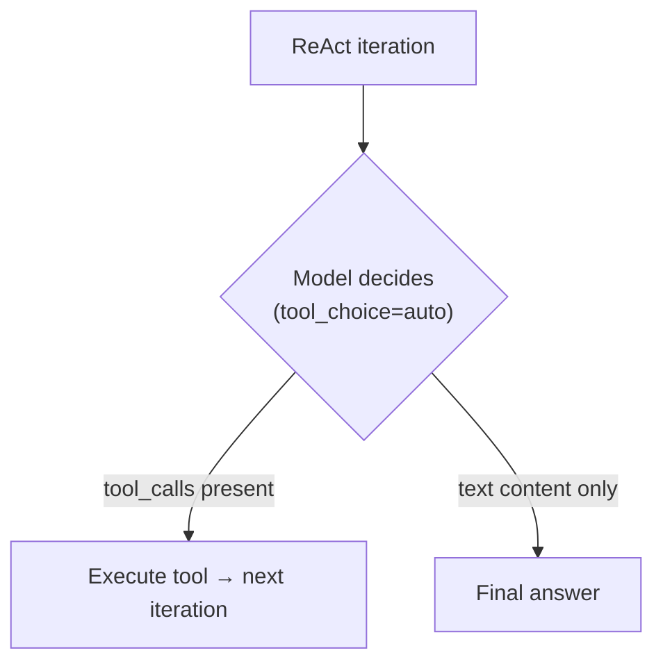
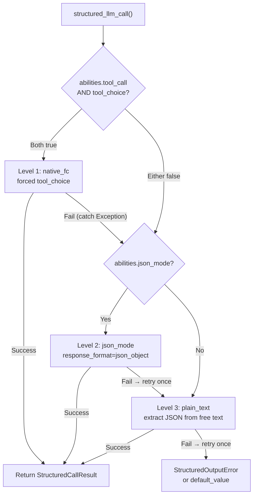

## 제공자 감지

FIM One은 LiteLLM을 범용 어댑터로 사용합니다. `core/model/openai_compatible.py`의 `_resolve_litellm_model()` 함수는 사용자의 `LLM_BASE_URL` + `LLM_MODEL`을 제공자 접두사가 있는 LiteLLM 모델 식별자로 매핑합니다. 접두사는 LiteLLM이 요청을 라우팅하는 방식을 결정합니다 — 네이티브 API 프로토콜(Anthropic Messages API, Gemini 등) 또는 일반 OpenAI 호환 `/v1/chat/completions`.

해석 순서:

1. **명시적 제공자** (DB `ModelConfig.provider` 필드에서) — 최우선 순위. 제공자가 URL의 알려진 도메인과 일치하면 `api_base`가 반환되지 않습니다(LiteLLM이 네이티브로 라우팅). 그렇지 않으면 `api_base`가 릴레이 URL로 설정됩니다.
2. **도메인 매칭** `KNOWN_DOMAINS` 대비 — 공식 API 엔드포인트는 호스트명으로 인식됩니다.
3. **URL 경로 힌트** `PATH_PROVIDER_HINTS` 대비 — UniAPI와 같은 릴레이 플랫폼에서 경로의 `/claude` 또는 `/anthropic`이 업스트림 프로토콜을 나타냅니다.
4. **폴백** — `openai/` 접두사(일반 OpenAI 호환).

| 도메인 / 경로 | 제공자 접두사 | 프로토콜 |
|---|---|---|
| `api.openai.com` | `openai/` | OpenAI Chat Completions |
| `anthropic.com` | `anthropic/` | Anthropic Messages API |
| `generativelanguage.googleapis.com` | `gemini/` | Google Gemini |
| `api.deepseek.com` | `deepseek/` | DeepSeek (OpenAI 호환) |
| `api.mistral.ai` | `mistral/` | Mistral |
| 경로에 `/claude` 또는 `/anthropic` 포함 | `anthropic/` | Anthropic Messages API (릴레이 경유) |
| 경로에 `/gemini` 포함 | `gemini/` | Google Gemini (릴레이 경유) |
| 그 외 모든 경우 | `openai/` | 일반 OpenAI 호환 |

제공자 접두사가 네이티브 프로토콜(anthropic, gemini 등)이고 URL이 공식 엔드포인트가 아닐 때, LiteLLM은 네이티브 프로토콜을 사용하지만 릴레이의 `api_base`로 요청을 전송합니다. 이는 제공자별 동작 — 아래에 설명된 Bedrock prefill 문제 포함 — 이 요청이 공식 API로 가든 릴레이를 통해 가든 적용됨을 의미합니다.

<Warning>
릴레이 URL에 경로에 `/claude`가 포함되어 있으면 FIM One은 자동으로 Anthropic의 네이티브 프로토콜을 통해 라우팅합니다. 이는 보통 올바릅니다(더 나은 스트리밍, thinking 지원), 하지만 제공자별 동작이 적용됨을 의미합니다 — 아래에 설명된 Bedrock prefill 문제 포함.
</Warning>

## tool_choice — 네 가지 모드

`tool_choice` 매개변수는 OpenAI 형식을 통해 표준화됩니다. LiteLLM은 요청을 보내기 전에 각 제공자의 네이티브 프로토콜로 변환합니다.

| 모드 | 의미 | 제공자 지원 |
|---|---|---|
| `"auto"` | 모델이 도구를 호출할지 또는 텍스트로 응답할지 결정 | 모든 제공자 |
| `"required"` | 도구를 반드시 호출해야 하지만 모델이 선택 | 대부분의 제공자 |
| `{"type":"function","function":{"name":"X"}}` | 특정 함수 X를 반드시 호출 | 대부분의 제공자 — **Anthropic 사고와 호환되지 않음** |
| `"none"` | 도구를 사용할 수 없음, 텍스트만 가능 | 모든 제공자 |

`"auto"`와 강제(`{"type":"function",...}`) 간의 구분은 FIM One의 모든 호환성 문제의 핵심입니다. 이 두 모드는 서로 다른 요구사항을 가진 완전히 다른 하위 시스템에서 사용됩니다.

## tool_choice가 사용되는 곳

두 개의 서브시스템이 `tool_choice`를 사용하며, 이들은 근본적으로 다른 방식으로 사용합니다.

### ReAct 엔진 — tool_choice="auto"

ReAct 루프는 모델이 각 반복마다 결정해야 합니다: 도구를 호출할지, 아니면 최종 답변을 제공할지. 여기서는 `"auto"`만 의미가 있습니다 — 모델이 `tool_calls`를 생성하거나 텍스트 콘텐츠를 생성하는 것 중 자유롭게 선택합니다. 이는 모든 제공자, 모든 모델, 확장 사고를 포함한 모든 모드와 호환됩니다.



ReAct 엔진은 `abilities["tool_call"] = True`일 때 네이티브 함수 호출(`_run_native`)을 사용하고, 그렇지 않으면 JSON-in-content 모드(`_run_json`)로 폴백합니다. 두 모드 모두 `"auto"`를 사용합니다 — 차이점은 도구가 `tools` 매개변수를 통해 전달되는지, 아니면 시스템 프롬프트에서 설명되는지입니다. 자세한 내용은 [ReAct 엔진 — 이중 모드 실행](/architecture/react-engine#dual-mode-execution)을 참조하세요.

### structured_llm_call — tool_choice=forced

원샷 구조화된 추출(스키마 주석, DAG 계획, 계획 분석). 모델이 특정 가상 함수를 호출하도록 강제하여 구조화된 JSON 출력을 보장합니다. 이것은 공급자별 오류를 트리거하는 호출 사이트입니다.

`structured_llm_call`은 3단계 성능 저하 체인을 구현합니다:



중요한 설계 차이점: `structured_llm_call`의 폴백은 **런타임**입니다 — 각 단계를 동적으로 시도하고 예외를 포착하여 통과합니다. ReAct 엔진의 모드 선택은 **빌드 타임**입니다 — 시작 시 `_native_mode_active`를 한 번 확인하고 전체 루프에 대해 한 가지 모드에 커밋합니다. 이는 `structured_llm_call`이 공급자별 400 오류에서 투명하게 복구할 수 있음을 의미하는 반면, ReAct는 모드가 처음부터 올바르게 선택되어야 합니다.

## Bedrock prefill 함정

`response_format={"type":"json_object"}`이 `anthropic/` 접두사로 확인된 모델에 전달되면, LiteLLM은 JSON 모드를 시뮬레이션하기 위해 내부적으로 어시스턴트 프리필 메시지를 주입합니다. Anthropic Messages API에는 기본 `response_format` 매개변수가 없으므로, LiteLLM은 어시스턴트 콘텐츠로 여는 중괄호를 앞에 붙여서 근사합니다:

```json
{"role": "assistant", "content": "{"}
```

이는 Anthropic의 직접 API에서 작동합니다. 그러나 최신 AWS Bedrock 모델 버전은 마지막 메시지가 `role: "assistant"`인 대화를 거부합니다 — 이를 "어시스턴트 메시지 프리필"이라고 부르며 다음을 throw합니다:

```
ValidationException: This model does not support assistant message prefill.
The conversation must end with a user message.
```

이 오류는 **세 가지 조건이 모두 동시에 충족될 때만** 발생합니다:

1. 모델이 `anthropic/` 접두사로 확인됩니다(도메인 일치 또는 URL 경로 힌트를 통해).
2. `response_format={"type":"json_object"}`이 전달됩니다(`structured_llm_call`의 json_mode 코드 경로).
3. 실제 백엔드는 AWS Bedrock입니다(프리필을 거부함).

<Warning>
이는 기본 도구 호출(`tool_choice="auto"`과 `tools=` 매개변수 포함)에 영향을 주지 않습니다. 프리필 주입은 `response_format`에만 발생합니다. ReAct 에이전트 실행은 완전히 영향을 받지 않습니다.
</Warning>

Level 1(native_fc)과 Level 2(json_mode)가 모두 Bedrock에서 실패하면, 시스템은 Level 3(plain_text)에서 복구됩니다. 아래에 설명된 `json_mode_enabled` 플래그는 낭비되는 Level 2 호출을 제거합니다.

### 해결책: json_mode_enabled

모델별 `json_mode_enabled` 플래그는 Level 2 (json_mode)를 시도할지 여부를 제어합니다:

- **DB 구성 모델**: Admin → Models → Advanced settings에서 토글합니다. 플래그는 `ModelProviderModel.json_mode_enabled`에 저장됩니다 (기본값 `TRUE`).
- **ENV 구성 모델**: 환경에서 `LLM_JSON_MODE_ENABLED=false`를 설정합니다.
- **효과**: 비활성화되면 `abilities["json_mode"]`는 `False`를 반환 → `response_format`이 전달되지 않음 → prefill 없음 → Bedrock이 작동합니다. 성능 저하 체인은 `native_fc → plain_text`가 되어 실패할 json_mode 호출을 완전히 건너뜁니다.
- **품질 손실 없음**: 시스템 프롬프트가 모델에 JSON을 반환하도록 지시하므로 모델은 여전히 유효한 JSON을 반환합니다. plain_text 레벨은 `extract_json()`을 사용하여 자유 형식 콘텐츠에서 JSON을 파싱하며, 이는 최신 모델에서 안정적으로 작동합니다.

## 사고 모델 + 강제 tool_choice

일부 모델은 확장된 사고(chain-of-thought)가 항상 활성화되어 있습니다. 이들의 API는 특정 함수 호출을 강제하는 것이 모델의 자유로운 추론과 모순되기 때문에 강제 `tool_choice`를 거부합니다:

```
tool_choice 'specified' is incompatible with thinking enabled
```

Anthropic은 프로토콜 수준에서 이 제약을 적용하며, 다른 일부 제공자(예: Moonshot AI / Kimi K2.5)도 동일한 패턴을 따릅니다.

Anthropic 모델의 경우, `structured_llm_call`은 native_fc를 호출할 때 `reasoning_effort=None`을 전달하여 자동으로 이를 처리하고, 해당 특정 호출에 대해 확장된 사고를 비활성화합니다. 구조화된 출력 호출은 깊은 추론이 아닌 **스키마 준수**가 필요하므로, 여기서 사고를 비활성화하는 것은 올바르고 유익합니다(더 낮은 지연 시간, 더 낮은 비용).

그러나 일부 모델(예: Kimi K2.5)은 사고가 항상 켜져 있으며 외부에서 비활성화할 수 있는 방법이 없습니다. 이러한 모델의 경우, native_fc는 항상 400 오류로 실패하며, 구조화된 호출당 약 10초의 낭비된 지연 시간을 추가한 후 저하 체인이 json_mode로 떨어집니다.

### 해결책: tool_choice_enabled

모델별 `tool_choice_enabled` 플래그는 Level 1 (native_fc)이 시도되는지 여부를 제어합니다:

- **DB 구성 모델**: Admin → Models → Advanced → "Native Function Calling"에서 토글합니다. 플래그는 `ModelProviderModel.tool_choice_enabled`에 저장됩니다 (기본값 `TRUE`).
- **ENV 구성 모델**: 환경에서 `LLM_TOOL_CHOICE_ENABLED=false`를 설정합니다.
- **효과**: 비활성화되면 `abilities["tool_choice"]`는 `False`를 반환 → 저하 체인이 Level 2 (json_mode) 또는 Level 3 (plain_text)에서 시작되며, native_fc를 완전히 건너뜁니다. 이는 호환되지 않는 모델에 대한 구조화된 호출당 약 10초의 페널티를 제거합니다.
- **ReAct 에이전트 영향 없음**: `tool_choice_enabled`는 `structured_llm_call`에서만 강제 도구 선택을 제어합니다. ReAct 엔진은 `tool_choice="auto"` (모델이 자유롭게 결정)를 사용하며, 이 설정과 관계없이 모든 모델에서 작동합니다.

<Note>
`tool_choice_enabled`와 `tool_call`은 별도의 능력 플래그입니다. `tool_call` (`OpenAICompatibleLLM`의 경우 항상 `True`)은 도구가 모델에 전달되는지 여부를 제어합니다 — 비활성화하면 ReAct 에이전트가 손상됩니다. `tool_choice`는 구조화된 출력 추출을 위해 **강제** 도구 선택이 시도되는지만 제어합니다.
</Note>

`tool_choice="auto"`는 사고 모드의 영향을 받지 않습니다. ReAct 엔진은 `"auto"`만 사용하므로, 사고가 활성화된 상태에서 에이전트 실행이 작동합니다.

<Warning>
이 제약을 피하기 위해 `abilities["tool_call"] = False`를 설정하지 마세요. 이는 ReAct의 `_run_native` 모드 (이는 `tool_choice="auto"`를 사용하고 사고와 잘 작동함)를 비활성화하여, 덜 안정적인 `_run_json` 모드로 강제합니다.
</Warning>

<Note>
**제공자 마이그레이션 참고:** 일부 타사 릴레이는 `reasoning_effort` (`drop_params=True`)와 같은 지원되지 않는 매개변수를 자동으로 삭제하므로, 구성된 경우에도 사고가 활성화되지 않습니다. 사고를 적절히 지원하는 제공자 (Bedrock, 직접 Anthropic API)로 마이그레이션할 때, native_fc의 `reasoning_effort=None`은 일관된 동작을 보장합니다. 사용자 조치가 필요하지 않습니다 — 구조화된 출력은 모든 제공자에서 동일하게 작동합니다.
</Note>

## 빠른 참조: 어디서 작동하는가

| 시나리오 | ReAct 모드 | structured_llm_call 경로 | 참고 |
|---|---|---|---|
| OpenAI (모든 모델) | `_run_native` | native_fc | 완전 지원 |
| Anthropic (thinking 없음) | `_run_native` | native_fc | 완전 지원 |
| Anthropic + thinking | `_run_native` | native_fc (thinking 자동 비활성화) | 구조화된 출력에만 thinking 비활성화 |
| Bedrock relay (thinking 없음) | `_run_native` | native_fc | 완전 지원 |
| Bedrock relay + thinking | `_run_native` | native_fc (thinking 자동 비활성화) | 구조화된 출력에만 thinking 비활성화 |
| Gemini | `_run_native` | native_fc | 완전 지원 |
| DeepSeek (thinking 없음) | `_run_native` | native_fc | 완전 지원 |
| DeepSeek R1 (thinking) | `_run_native` | json_mode (`tool_choice_enabled=false` 설정) | Thinking 항상 활성화; native_fc 건너뛰기 |
| Kimi K2 (thinking 없음) | `_run_native` | native_fc | 완전 지원 |
| Kimi K2.5 (thinking) | `_run_native` | json_mode (`tool_choice_enabled=false` 설정) | Thinking 항상 활성화; native_fc 건너뛰기 |
| 일반 OpenAI 호환 | `_run_native` | native_fc | 완전 지원 |
| `tool_call=false`인 모든 모델 | `_run_json` | json_mode 또는 plain_text | tool-call을 지원하지 않는 모델의 폴백 |

## 모델별 권장 구성

`tool_choice_enabled`과 `json_mode_enabled`은 모두 관리자 → 모델 → 고급 설정에서 모델별로 토글할 수 있습니다. 기본값(둘 다 `TRUE`)은 대부분의 제공자에게 적합합니다. 오류나 불필요한 지연이 발생할 때만 조정하세요.

| 모델 유형 | 네이티브 FC | JSON 모드 | 이유 |
|---|---|---|---|
| OpenAI GPT 시리즈 | ON | ON | 완전 지원 — 기본값이 올바름 |
| Anthropic Claude | ON | ON | 네이티브_fc에서 사고 자동 비활성화 |
| Google Gemini | ON | ON | 완전 지원 |
| DeepSeek V3 / Coder | ON | ON | 완전 지원 |
| **DeepSeek R1 (사고)** | **OFF** | ON | 사고 항상 활성화; 네이티브_fc 거부 |
| **Kimi K2.5 (사고)** | **OFF** | ON | 사고 항상 활성화; 네이티브_fc 거부 |
| Kimi K2 (비사고) | ON | ON | 완전 지원 |
| **AWS Bedrock 릴레이** | ON | **OFF** | Bedrock이 json_mode에서 어시스턴트 프리필 거부 |
| 약한 / 소형 모델 | OFF | OFF | plain_text 추출로 직접 이동 |

<Tip>
**변경 시기:** 로그에서 `structured_llm_call: native_fc call raised` 경고 다음에 json_mode 추출이 성공하는 것을 보면, 해당 모델은 네이티브_fc의 이점을 얻지 못합니다. 낭비되는 API 호출(구조화된 출력 요청당 약 10초)을 제거하려면 해당 모델에 대해 "네이티브 함수 호출"을 비활성화하세요.
</Tip>

**환경 변수 수준 재정의**는 환경 변수를 통해 구성된 모든 모델에 적용됩니다(관리자 UI 아님):

```bash
# Disable native_fc globally (for thinking-model-only deployments)
LLM_TOOL_CHOICE_ENABLED=false

# Disable json_mode globally (for Bedrock relay deployments)
LLM_JSON_MODE_ENABLED=false
```

## 추론 노력 및 사고 구성

FIM One은 확장된 사고 / 추론을 제어하기 위해 두 개의 환경 변수를 노출합니다:

| 변수 | 값 | 효과 |
|---|---|---|
| `LLM_REASONING_EFFORT` | `low`, `medium`, `high` | LiteLLM에 `reasoning_effort`로 전달됩니다. Anthropic: `thinking` 매개변수로 매핑됩니다. OpenAI o-series: 통과합니다. 기타: 자동으로 삭제됩니다 (`drop_params=True`). |
| `LLM_REASONING_BUDGET_TOKENS` | 정수 (예: `10000`) | Anthropic만 해당: LiteLLM의 자동 매핑을 우회하여 명시적 `thinking.budget_tokens` 상한을 설정합니다. Claude 모델의 비용 제어에 유용합니다. |

`reasoning_effort`가 설정되고 모델이 `anthropic/`로 확인되면 두 가지 추가 동작이 적용됩니다:

1. **온도가 1.0으로 강제됩니다.** Bedrock은 사고가 활성화되었을 때 `temperature != 1.0`을 거부합니다. FIM One은 이를 자동으로 처리합니다 — 사용자 조치가 필요하지 않습니다.
2. **도구가 있는 GPT-5.x**: `tools`가 있을 때 `reasoning_effort`는 자동으로 삭제됩니다. GPT-5 `/v1/chat/completions` 엔드포인트가 이 조합을 거부하기 때문입니다. 이는 ReAct 도구 루프에만 영향을 미칩니다. `tools` 매개변수가 없는 `structured_llm_call` 호출은 영향을 받지 않습니다.

## 구조화된 출력을 위한 방어적 파싱

native_fc가 올바르게 작동하더라도, 구조화된 출력 파이프라인에는 모든 제공자 또는 호환성 계층의 엣지 케이스를 처리하기 위한 방어적 파싱 계층이 포함되어 있습니다.

DAG 플래너의 `_dict_to_steps` 파서는 세 가지 일반적인 엣지 케이스를 처리합니다:

1. **배열 대신 단일 객체.** 일부 모델은 배열 `{"steps": [{"id": "1", "task": "..."}]}` 대신 `{"steps": {"id": "1", "task": "..."}}` (단일 스텝 객체)를 반환합니다. 파서는 `id` 또는 `task` 키를 확인하여 이를 감지하고 객체를 리스트로 래핑합니다.

2. **이중 인코딩된 JSON 문자열.** 구조화된 출력이 json_mode (스키마 강제가 없음)로 폴백될 때, 일부 제공자는 `steps` 값을 네이티브 배열 대신 JSON 문자열로 반환합니다 — 예: `{"steps": "[{\"id\": \"1\", ...}]"}`. 이 문자열에는 표준 `json.loads`를 깨뜨리는 리터럴 줄바꿈 (모델의 포매팅에서 발생)이 포함될 수도 있습니다. 파서는 `extract_json_value()` (이는 `_repair_json_strings`를 포함)를 사용하여 다음을 처리합니다:
   - JSON 문자열 값 내의 리터럴 줄바꿈
   - 잘못된 이스케이프 시퀀스 (LaTeX 또는 코드 콘텐츠에서 일반적)
   - 호환성 계층의 기타 직렬화 특이성

3. **누락된 `steps` 래퍼.** 모델이 `steps` 래퍼 키 없이 최상위 객체로 단일 스텝을 반환할 수 있습니다. 파서는 루트 레벨에서 `id`와 `task`를 감지하고 그에 따라 래핑합니다.

<Note>
정상 작동 중에는 native_fc가 올바르게 구조화된 도구 호출 인자를 반환하며 이러한 엣지 케이스는 발생하지 않습니다. 방어적 파서는 사용자 정의 `BaseLLM` 서브클래스, 비정상적인 제공자 동작 또는 구조화된 출력이 json_mode 또는 plain_text로 저하되는 폴백 시나리오에 대한 안전망으로 존재합니다.
</Note>

## 문제 해결

**"This model does not support assistant message prefill"**
Bedrock + json_mode. `LLM_JSON_MODE_ENABLED=false`를 설정하거나 관리자 모델 설정에서 JSON Mode를 비활성화하세요.

**"Thinking may not be enabled when tool_choice forces tool use"** / **"tool_choice 'specified' is incompatible with thinking enabled"**
Anthropic 모델의 경우, `structured_llm_call`은 native_fc 호출에 대해 자동으로 thinking을 비활성화합니다. 항상 활성화된 thinking을 지원하는 다른 제공자(예: Kimi K2.5)의 경우, 모델의 고급 설정에서 "Native Function Calling"을 비활성화하거나 전역적으로 `LLM_TOOL_CHOICE_ENABLED=false`를 설정하세요. 성능 저하 체인은 native_fc를 건너뛰고 대신 json_mode 또는 plain_text를 통해 구조화된 출력을 추출합니다.

**"DAG pipeline failed: LLM 'steps' is not an array"**
LLM이 `steps` 필드를 문자열 또는 단일 객체로 반환했습니다. 이는 일반적으로 구조화된 출력이 json_mode로 폴백되었음을 의미합니다(스키마 강제가 없음). 로그에서 `structured_llm_call: level=xxx`를 확인하세요. `native_fc` 대신 `json_mode`를 표시하면 native_fc가 조용히 실패하고 있습니다. 사용자 정의 `BaseLLM` 서브클래스를 사용하는 경우, `reasoning_effort` kwarg를 허용하는지 확인하세요.

**ReAct가 예상치 않게 JSON mode로 폴백됨**
모델의 `abilities["tool_call"]`이 `True`인지 확인하세요. `OpenAICompatibleLLM`의 경우 항상 `True`이지만, 사용자 정의 `BaseLLM` 서브클래스는 이를 재정의할 수 있습니다. 관리자 API의 모델 상세 엔드포인트로 확인하세요.

**structured_llm_call이 모든 레벨을 소진하고 StructuredOutputError 발생**
모델이 어떤 레벨에서도 파싱 가능한 JSON을 생성하지 못했습니다. 최신 모델에서는 드문 경우입니다. 다음을 확인하세요: (1) 스키마가 유효한 JSON Schema인지, (2) 모델이 전체 응답을 생성할 충분한 `max_tokens`를 가지고 있는지, (3) 시스템 프롬프트가 스키마 지침과 모순되지 않는지. DAG 플래너와 분석기 모두 `default_value` 폴백을 제공하므로, 이 오류는 명시적으로 기본값을 생략하는 호출 사이트에서만 전파됩니다.
