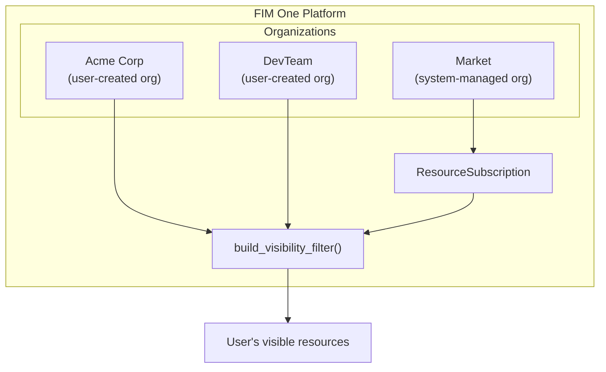
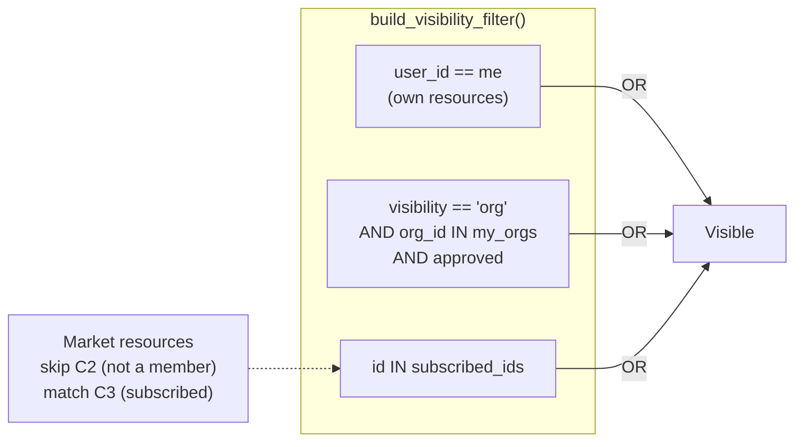
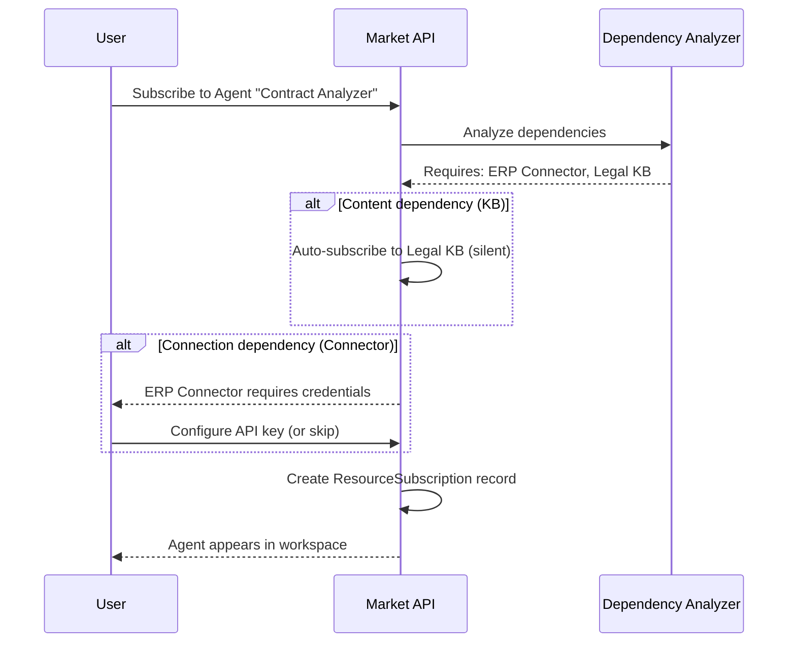
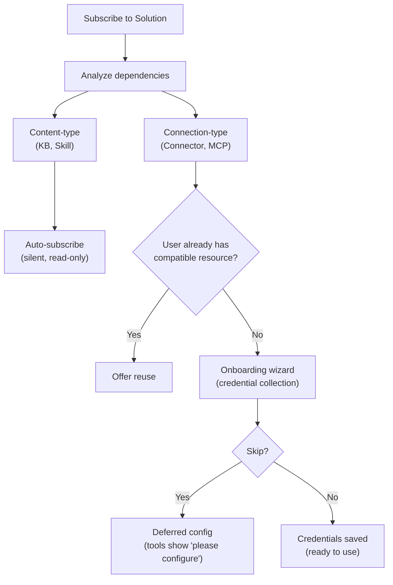

## 개요

Market은 FIM One의 리소스 마켓플레이스입니다. 사용자는 자신이 구축한 리소스를 게시하고, 다른 사용자는 이를 발견하고 구독할 수 있으며, 구독한 리소스는 구독자의 워크스페이스에 자신의 것처럼 나타납니다. 전체 시스템은 하나의 아키텍처 통찰력을 기반으로 구축되었습니다: **Market은 조직입니다** — 특별한 신뢰 규칙을 가진 시스템 관리 섀도우 조직입니다.

이 페이지는 Market의 내부 아키텍처를 설명합니다. 게시 및 구독에 대한 사용자 중심 개요는 [Market (기능)](/concepts/market)을 참조하세요. 구독한 리소스가 도구 집합에 로드되는 방식에 대해서는 [에이전트 및 리소스 발견](/architecture/agent-discovery)을 참조하세요.

## 이중 분류

Market은 리소스가 어떻게 구현되었는지가 아니라 리소스가 무엇을 하는지에 따라 리소스를 두 가지 범주로 구성합니다.

### 솔루션

솔루션은 **당신을 위해 작동하는 것**입니다. 사용자는 솔루션을 구독하고 즉시 사용 가능한 기능을 얻습니다.

| 리소스 유형 | 기능 |
|---|---|
| **에이전트** | 바인딩된 도구, 지식 및 지침을 갖춘 대화형 AI 어시스턴트 |
| **스킬** | `call_agent`를 통해 여러 에이전트를 조율할 수 있는 글로벌 SOP(표준 운영 절차) |
| **워크플로우** | 시각적 편집 및 결정론적 실행이 가능한 DAG 기반 자동화 흐름 |

솔루션은 다른 리소스에 의존할 수 있습니다. 에이전트는 API 호출을 위한 특정 커넥터와 검색 파이프라인을 위한 지식 베이스가 필요할 수 있습니다. 마켓은 구독 중에 이러한 종속성을 자동으로 처리합니다([아래의 종속성 해결](#dependency-resolution) 참조).

### 컴포넌트

컴포넌트는 개발자를 위한 **재사용 가능한 빌딩 블록**입니다. 솔루션이 사용하는 기능을 제공합니다.

| 리소스 유형 | 역할 |
|---|---|
| **커넥터** | API 또는 데이터베이스 통합 어댑터 정의 |
| **MCP 서버** | Model Context Protocol을 사용하는 도구 서비스 구성 |

컴포넌트는 구독하기가 더 간단합니다. 내부 종속성이 없고 자격증명 요구사항만 있습니다.

### 지식 베이스가 독립적으로 나열되지 않는 이유

지식 베이스는 독립형 마켓 리소스로 게시되지 않습니다. 이들은 솔루션의 내부 종속성입니다 — 에이전트의 검색 파이프라인 또는 스킬의 참고 자료입니다. 사용자가 지식 베이스에 종속된 솔루션을 구독하면, KB는 읽기 전용 참고 자료로 자동 포함됩니다. 구독자는 KB를 별도로 찾거나, 평가하거나, 관리할 필요가 없습니다.

<Info>
2계층 분류(솔루션 vs. 컴포넌트)는 **디스플레이 계층 개념**입니다. 이는 쿼리 시 `resource_type`에서 파생되며, 별도 필드로 저장되지 않습니다. 기본 구독 메커니즘, 가시성 필터, 검토 프로세스는 모든 리소스 타입에서 동일합니다.
</Info>

## 통합 아키텍처

### 마켓을 섀도우 조직으로

마켓의 가장 중요한 아키텍처 결정은 별도의 하위 시스템이 아니라는 것입니다. 이는 **조직** — 고정 ID(`MARKET_ORG_ID`)를 가진 시스템 관리 조직으로, 플랫폼 초기화 중에 자동으로 생성됩니다.

이는 다음을 의미합니다:

- **동일한 가시성 필터**(`build_visibility_filter()`)가 단일 쿼리에서 개인, 조직 및 마켓 리소스를 처리합니다. 마켓 조회를 위한 특수 사례 코드가 없습니다.
- **동일한 구독 메커니즘**(`ResourceSubscription`)이 조직 및 마켓 리소스 모두에 적용됩니다. 조직 리소스를 구독하고 마켓 리소스를 구독하면 동일한 레코드가 생성됩니다.
- **동일한 자격 증명 처리**(폴백, 사용자별 재정의)가 두 컨텍스트에서 모두 작동합니다. 커넥터 및 MCP 서버의 `allow_fallback` 플래그는 소스에 관계없이 동일하게 작동합니다.
- **동일한 검토 프로세스**(`apply_publish_status()`)가 조직 수준 및 마켓 수준 검토를 모두 처리합니다. 유일한 차이점은 마켓 조직이 모든 검토 플래그를 `true`로 잠금한다는 것입니다.

일반 조직과 마켓 조직 간의 주요 구분:

| 측면 | 조직 | 마켓 |
|---|---|---|
| **신뢰 모델** | 높은 신뢰(팀 멤버십) | 신뢰 없음(글로벌 커뮤니티) |
| **검토** | 리소스 유형별 선택 사항 | 모든 유형에 대해 항상 필수 |
| **접근** | 모든 멤버에게 자동 | 명시적 구독 필요 |
| **범위** | 팀 또는 회사 | 글로벌 |

<Tip>
마켓은 특수 규칙이 있는 조직일 뿐이므로, 조직을 위해 구축된 모든 기능 — 검토 워크플로우, 자격 증명 관리, 리소스 라이프사이클 — 추가 구현 없이 마켓에서 자동으로 작동합니다.
</Tip>

### 가시성 필터가 이를 처리하는 방식

아무도 Market 조직의 멤버십을 보유하지 않습니다. 사용자는 Market에 "가입"하지 않으며, 개별 리소스를 구독합니다. 이는 `MARKET_ORG_ID`가 사용자의 `user_org_ids` 목록에 절대 나타나지 않으며, Market 리소스에 대해 조직 멤버십 가시성 조건이 자연스럽게 건너뛰어진다는 의미입니다.

대신, 구독된 Market 리소스는 `build_visibility_filter()`의 `subscribed_ids` 경로를 통해 흐릅니다:

이 3개 조건의 OR 절이 전체 가시성 모델입니다. 개인 리소스, 조직 공유 리소스, Market 구독 리소스는 하나의 쿼리로 해결되며, 리소스 출처에 따른 분기 로직이 없습니다.

### 범위 기반 탐색

Market 페이지는 두 가지 탐색 컨텍스트 간에 전환하는 **범위 선택기**를 제공합니다:

| 범위 | 표시 내용 | 검토자 |
|---|---|---|
| **Global Market** | Market 조직의 누구든지 게시한 리소스 | 플랫폼 관리자 |
| **Organization: [name]** | 특정 조직의 멤버가 게시한 리소스 | 조직 관리자 |

동일한 UI, 동일한 탭(Solutions / Components), 그리고 동일한 구독 흐름이 두 범위 모두에 적용됩니다. 범위를 전환하면 탐색 쿼리의 `org_id` 필터만 변경됩니다. 사용자 관점에서 경험은 동일합니다 — 카탈로그를 탐색하고 설치할 항목을 선택하는 것입니다.

## 구독 흐름

### 브라우징 및 검색

사용자는 페이지 매김된 카탈로그를 통해 Market을 탐색합니다. 각 리소스는 이름, 설명, 아이콘, 게시자 사용자명 및 구독 버튼을 표시합니다. 사용자가 이미 구독한 리소스는 그에 따라 표시됩니다. 브라우징 API(`GET /api/market`)는 사용자 자신의 리소스를 제외합니다 — 게시한 항목을 구독할 수 없습니다.

### 솔루션 구독

솔루션(에이전트, 스킬 또는 워크플로우)을 구독하는 것은 종속성 분석을 포함합니다:

1. 시스템은 솔루션의 종속성(필요한 커넥터, 지식 베이스, MCP 서버 및 스킬)을 분석합니다.
2. **콘텐츠 유형 종속성**(KB, 스킬)은 자동으로 자동 구독됩니다. 사용자는 이를 보거나 관리하지 않습니다.
3. **연결 유형 종속성**(커넥터, MCP 서버)은 요구사항으로 나열됩니다. 온보딩 마법사가 자격 증명을 수집합니다.
4. `ResourceSubscription` 레코드가 생성되고 리소스가 사용자의 가시성 필터에 나타납니다.

### 컴포넌트 구독

컴포넌트(커넥터 및 MCP 서버)는 더 간단한 흐름을 가지고 있습니다 — 종속성 분석이 필요하지 않습니다. 사용자가 구독하고, 선택적으로 자격증명을 구성한 후 컴포넌트를 사용할 수 있습니다.

### 자격증명 구성

자격증명은 편의성과 유연성의 균형을 맞추는 **하이브리드 모델**을 따릅니다:

- **구독 중에 제공됨.** 연결 유형 종속성이 자격증명을 요구할 때, 온보딩 마법사가 자격증명 양식을 즉시 표시합니다.
- **건너뛸 수 있음.** 사용자는 "나중에 구성, 건너뛰기"를 선택할 수 있습니다. 리소스는 구독되지만 해당 자격증명이 필요한 도구는 호출될 때 "자격증명을 구성하세요" 메시지를 반환합니다.
- **지연된 구성.** 사용자는 설정 페이지에서 언제든지 자격증명을 구성하거나 업데이트할 수 있습니다.

이는 조직에서 사용되는 동일한 `allow_fallback` 메커니즘입니다. 게시자가 폴백을 활성화하고 기본 자격증명을 설정한 경우, 구독자는 자신의 키를 제공하지 않고도 리소스를 즉시 사용할 수 있습니다. 폴백이 비활성화된 경우, 각 구독자는 자신의 자격증명을 제공해야 합니다.

<Warning>
자격증명 폴백이 활성화된 Market 리소스를 사용할 때, API 요청이 게시자의 자격증명을 통해 흐릅니다. 민감한 작업의 경우, 자신의 자격증명을 제공하거나 게시자의 신뢰성을 확인하는 것을 고려하세요.
</Warning>

### 구독 취소

구독 취소는 `ResourceSubscription` 레코드를 제거합니다. 리소스는 사용자의 가시성 필터에서 사라지고 더 이상 도구 세트에 로드되지 않습니다. 자동 구독된 종속성이 있는 솔루션의 경우 종속 리소스(KB, 기술)도 정리됩니다. 리소스에 대한 사용자 구성 자격증명이 제거됩니다.

## 의존성 해결

솔루션이 게시되거나 구독될 때, 시스템은 해당 의존성 트리를 분석합니다. 의존성은 서로 다른 처리 전략을 가진 두 가지 범주로 나뉩니다.

### 콘텐츠 타입 종속성

**지식 베이스**와 **스킬**은 솔루션에서 참조되는 콘텐츠 타입 종속성입니다. 이들은 솔루션이 사용하는 읽기 전용 데이터(검색 문서, SOP 절차)를 제공합니다.

- **구독 시:** 자동으로 자동 구독됩니다. 사용자는 각 지식 베이스 또는 스킬에 대한 별도의 구독 단계를 보지 않습니다.
- **액세스 모델:** 원본 작성자의 리소스에 대한 읽기 전용 참조입니다. 구독자는 콘텐츠를 수정할 수 없습니다.
- **구독 해제 시:** 상위 솔루션이 구독 해제될 때 자동으로 정리됩니다.

### 연결 유형 종속성

**커넥터** 및 **MCP 서버**는 솔루션에서 참조되는 연결 유형 종속성입니다. 이들은 작동하기 위해 자격 증명이 필요합니다.

- **구독 시:** 온보딩 마법사에서 요구 사항으로 나열됩니다. 사용자에게 자격 증명을 구성하거나 건너뛸 것을 요청합니다.
- **스마트 매칭:** 사용자가 이미 호환되는 커넥터(동일한 유형, 동일한 기본 URL)를 가지고 있으면 시스템은 새 구독을 만드는 대신 이를 재사용할 것을 제안합니다.
- **구독 해제 시:** 구독은 제거되지만 사용자가 만든 자격 증명은 보존됩니다(사용자는 다른 곳에서 동일한 커넥터를 사용할 수 있습니다).

## 게시

### 솔루션 게시

작성자가 에이전트, 스킬 또는 워크플로우를 마켓에 게시할 때:

1. 시스템이 리소스에 `visibility: "org"`와 `org_id: MARKET_ORG_ID`를 설정합니다.
2. 시스템이 솔루션의 종속성을 분석하고 매니페스트를 빌드합니다 — 필요한 커넥터, KB 및 MCP 서버를 나열합니다.
3. 매니페스트가 작성자에게 확인을 위해 표시됩니다.
4. `apply_publish_status()`가 리소스를 `pending_review`로 설정합니다 (마켓 조직은 모든 검토 플래그가 `true`로 잠겨 있습니다).
5. 시스템 관리자가 리소스를 검토하고 승인하거나 거부합니다.

### 컴포넌트 게시

커넥터 또는 MCP 서버를 게시하는 것은 더 간단합니다:

1. 시스템이 위와 같이 가시성 및 org_id를 설정합니다.
2. 자격증명 스키마가 추출됩니다(구독자가 입력해야 할 필드).
3. 리소스가 `pending_review` 상태로 진입하고 관리자 승인을 기다립니다.

### 검토 프로세스

검토 프로세스는 조직에서 사용하는 것과 동일한 메커니즘이지만, 한 가지 중요한 차이점이 있습니다:

| 컨텍스트 | 검토 필수? | 검토자 |
|---|---|---|
| **조직** | 리소스 유형별로 구성 가능 (`review_agents`, `review_connectors` 등) | 조직 관리자 |
| **마켓** | 모든 리소스 유형에 대해 항상 필수 | 플랫폼 관리자 (마켓 조직 소유자) |

마켓 조직은 6개의 검토 플래그가 모두 `true`로 설정된 상태로 초기화되며, 이 구성은 변경할 수 없습니다. 마켓에 게시되는 모든 리소스는 브라우즈 카탈로그에서 표시되기 전에 관리자 검토를 통과해야 합니다.

<Note>
조직 소유자는 자동으로 검토를 우회합니다 — 게시된 리소스는 즉시 사용 가능합니다. 마켓의 경우, 마켓 조직 소유자(시스템 관리자)만 이 우회 권한을 가집니다.
</Note>

승인된 리소스가 작성자에 의해 편집되면, `check_edit_revert()`는 자동으로 `publish_status`를 `pending_review`로 되돌립니다. 이는 라이브 마켓 리소스의 변경 사항이 구독자에게 표시되기 전에 다시 검토되도록 보장합니다.

## 구현 참고 사항

### 섀도우 조직

Market 조직은 잘 알려진 고정 ID(`00000000-0000-0000-0000-000000000001`)와 슬러그(`market`)를 가지고 있습니다. 플랫폼 초기화 중에 `ensure_market_org()`에 의해 생성되며, 일반적으로 첫 번째 관리자 사용자의 로그인 시 생성됩니다. 이 함수는 멱등성을 가지므로 여러 번 호출해도 안전합니다.

### ResourceSubscription

`ResourceSubscription` 테이블은 마켓 접근의 핵심 데이터 구조입니다:

| Column | Purpose |
|---|---|
| `user_id` | 구독자 |
| `resource_type` | `agent`, `connector`, `knowledge_base`, `mcp_server`, `skill`, 또는 `workflow` |
| `resource_id` | 구독한 리소스의 ID |
| `org_id` | 소스 조직 (마켓 조직 ID 또는 일반 조직 ID) |

`(user_id, resource_type, resource_id)`에 대한 고유 제약 조건은 중복 구독을 방지합니다. `org_id` 열은 구독의 출처를 추적하여 범위 인식 구독 취소를 가능하게 합니다.

### 가시성 필터 통합

`resolve_visibility()` 함수는 단일 호출에서 두 가지 조회를 수행합니다:

1. 사용자의 조직 멤버십을 가져옵니다 (`user_org_ids`)
2. 사용자의 구독을 가져옵니다 (`subscribed_ids`)

이들은 `build_visibility_filter()`에 전달되며, 이 함수는 세 가지 가시성 계층(자신의 것, 조직 공유, 구독)을 모두 결합하는 단일 SQL WHERE 절을 생성합니다. 이 함수는 리소스를 쿼리하는 모든 곳에서 사용됩니다 — 에이전트 목록, 커넥터 드롭다운, 스킬 주입, 자동 발견 모드 — 전체 플랫폼에서 일관된 가시성을 보장합니다.

### 자격증명 암호화

구독 중(또는 나중에 설정에서) 구성된 자격증명은 플랫폼의 암호화 키를 사용하여 저장 시 암호화됩니다. Market API는 browse 응답에서 자격증명 값을 노출하지 않습니다. `_*_market_info()` 헬퍼 함수에서는 메타데이터(이름, 설명, 아이콘, 유형)만 반환됩니다.

## 참고 항목

- [Organization & Market](/architecture/organization) -- 조직 수준의 공유 및 신뢰 모델
- [Agent & Resource Discovery](/architecture/agent-discovery) -- 구독한 리소스가 도구 집합에 로드되는 방식
- [Connector Architecture](/architecture/connector-architecture) -- 커넥터 설계, 인증 주입 및 감사
- [System Overview](/architecture/system-overview) -- 모든 리소스가 수렴하는 통합 도구 추상화
