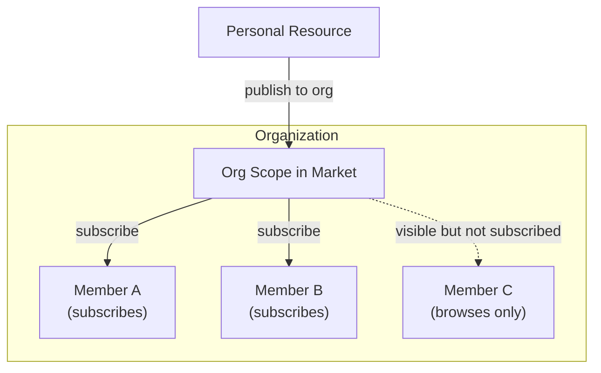
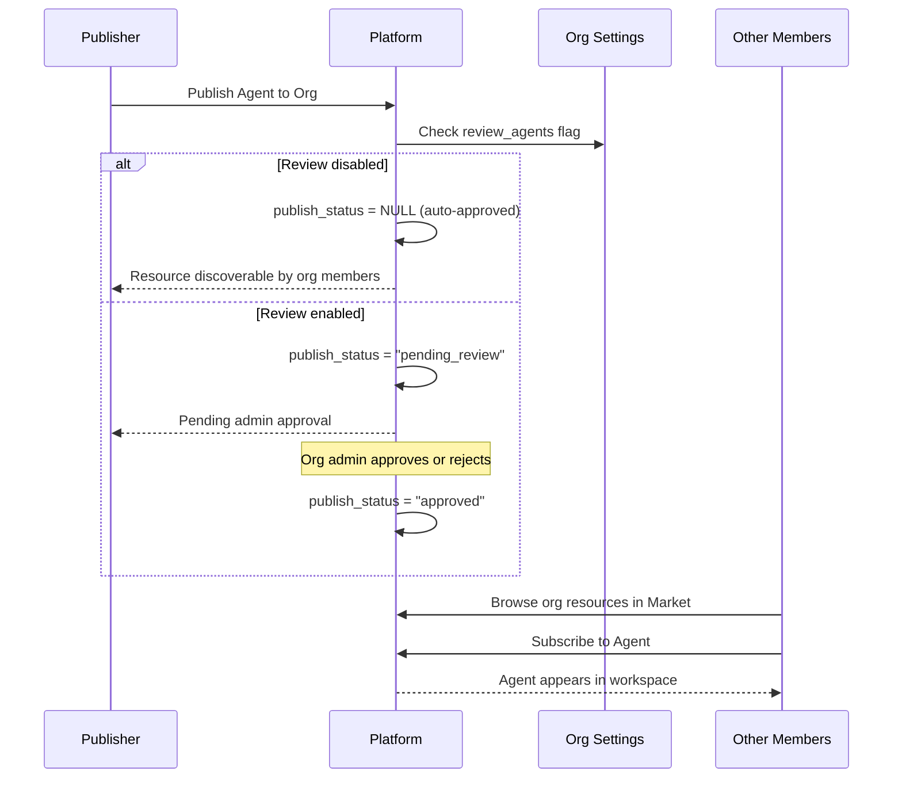
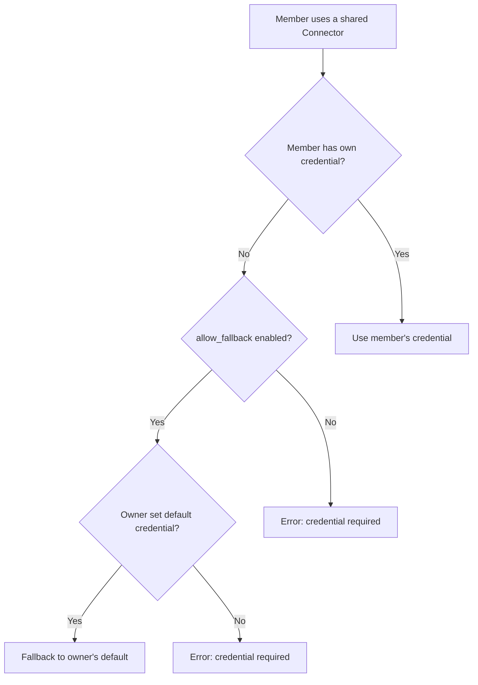
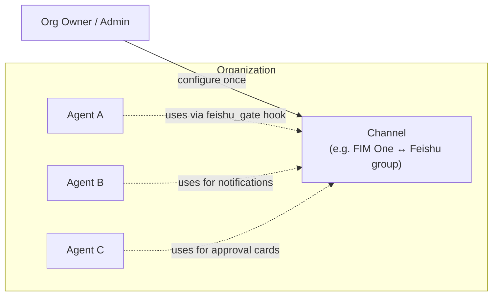

## 개요

조직은 FIM One의 팀 협업 단위입니다. 사용자 그룹이 에이전트, 커넥터, 지식 베이스, MCP 서버, 워크플로우 및 스킬과 같은 리소스를 신뢰할 수 있는 범위 내에서 공유할 수 있게 해줍니다.

FIM One의 모든 리소스는 **개인용**으로 시작됩니다(생성자에게만 표시됨). 리소스를 조직에 게시하면 마켓의 조직 범위를 통해 다른 조직 구성원이 **검색 가능**하게 됩니다. 구성원은 조직의 공유 리소스를 탐색하고 필요한 리소스를 구독합니다.



조직과 글로벌 마켓은 동일한 구독 기반 액세스 모델을 공유합니다. 주요 차이점은 신뢰입니다. 조직은 구성원이 서로를 알고 신뢰하는 팀 또는 회사를 나타내므로 검토는 선택 사항이며 자격증명 공유는 간단합니다.

## 조직 생성 및 관리

모든 사용자는 **무제한** 조직을 생성하고 여러 조직에 참여할 수 있습니다. 조직에는 세 가지 역할이 있습니다:

| 역할 | 권한 |
|---|---|
| **소유자** | 완전한 제어 — 멤버 관리, 설정 구성, 검토 우회 |
| **관리자** | 멤버 관리 및 게시된 리소스 검토 |
| **멤버** | 공유된 리소스 검색 및 구독 |

소유자는 항상 조직을 생성한 사용자입니다. 소유권은 이전할 수 있지만 공유할 수는 없습니다.

## 리소스 게시

조직에 리소스를 게시하면 조직의 모든 멤버 워크스페이스에 **자동으로** 나타나지 않습니다. 대신, 리소스는 마켓의 조직 범위에서 검색 가능해지며, 멤버들은 여기서 리소스를 찾아보고 구독할 수 있습니다.

이 구독 기반 모델은 각 멤버에게 자신의 워크스페이스에 대한 제어권을 제공합니다. 대규모 조직은 수십 개의 커넥터를 공유할 수 있지만, 개별 멤버는 자신의 업무와 관련된 것들만 구독합니다.



### 검토 시스템

검토는 **선택 사항**이며 리소스 유형별로 구성됩니다. 각 조직은 독립적인 토글 플래그를 가집니다:

- `review_agents`
- `review_connectors`
- `review_kbs`
- `review_mcp_servers`
- `review_workflows`
- `review_skills`

리소스 유형에 대해 검토가 비활성화되면, 게시된 리소스는 즉시 멤버들이 발견할 수 있습니다 — 관리자 조치가 필요하지 않습니다. 검토가 활성화되면, 리소스는 `pending_review` 상태로 진입하며 관리자 승인이 필요합니다.

<Tip>
조직 소유자는 자동으로 검토를 우회합니다. 게시된 리소스는 항상 즉시 발견 가능합니다.
</Tip>

이러한 유연성을 통해 조직은 거버넌스 요구사항에 맞출 수 있습니다. 소규모 스타트업은 마찰 없는 공유를 위해 모든 검토 토글을 비활성화할 수 있으며, 규정 준수에 중점을 두는 엔터프라이즈는 에이전트와 커넥터에 대한 검토를 활성화하여 감시를 유지할 수 있습니다.

## 자격증명 폴백

커넥터와 MCP 서버는 종종 자격증명(API 키, 데이터베이스 암호, OAuth 토큰)이 필요합니다. FIM One은 **폴백 메커니즘**을 제공하여 멤버가 모든 자격증명을 직접 구성할 필요가 없도록 합니다.



두 가지 모드가 있습니다:

- **폴백 활성화** (`allow_fallback=true`, 기본값): 자신의 자격증명을 제공하지 않는 멤버는 자동으로 소유자의 기본 자격증명을 사용합니다. 이는 팀 공유 API 키 또는 단일 키가 전체 팀을 커버하는 내부 서비스에 적합합니다.
- **폴백 비활성화** (`allow_fallback=false`): 모든 멤버가 자신의 자격증명을 구성해야 합니다. 이는 각 사용자가 개인 API 키가 필요한 경우(예: 사용자별 SaaS 라이선스)에 적합합니다.

자격증명이 필요하지 않은 리소스(예: 읽기 전용 공개 API 커넥터 또는 인증이 없는 에이전트)는 구독 후 즉시 작동합니다. 구성이 필요하지 않습니다.

<Info>
자격증명 폴백은 멤버가 리소스를 구독한 후에만 적용됩니다. 폴백 메커니즘은 리소스의 접근성이 아니라 런타임에 자격증명이 어떻게 해결되는지를 결정합니다.
</Info>

## 리소스 가시성

FIM One의 모든 리소스에는 접근 범위를 결정하는 `visibility`가 있습니다:

| 가시성 | 범위 | 발견 가능한 사용자 |
|---|---|---|
| `personal` | 소유자만 | 리소스를 생성한 사용자 |
| `org` | 조직 | 조직 구성원은 검색 및 구독 가능 (승인 시) |

가시성 필터는 통합 쿼리 패턴을 따릅니다:

```
A resource is available in your workspace if:
  1. You own it (any visibility), OR
  2. It's published to an org you belong to, approved, AND you've subscribed to it
```

<Warning>
조직에 리소스를 게시해도 자동으로 접근 권한이 부여되지 않습니다. 구성원은 마켓의 조직 범위를 통해 구독하여 리소스를 자신의 워크스페이스에 추가해야 합니다.
</Warning>

## 인프라 리소스 (조직 전체, 구독 불필요)

두 번째 클래스의 조직 범위 리소스는 위의 개인 → 게시 → 구독 라이프사이클을 **따르지 않습니다**. 이러한 리소스는 **조직 소유자 또는 관리자가 한 번 구성**한 후 조직의 모든 에이전트에서 투명하게 사용 가능합니다:

| 리소스 | 목적 | 구성자 | 사용자 |
|---|---|---|---|
| **채널** | IM 플랫폼으로의 아웃바운드 브릿지 (현재 Feishu; Slack / WeCom / Teams 계획 중) | 조직 소유자 / 관리자 | 모든 에이전트의 [Hook System](/architecture/hook-system) 및 사전 알림 도구 |
| **OAuth 제공자** | 소셜 로그인 자격증명 (GitHub, Google, Feishu, Discord) | 시스템 관리자 (환경 변수) | 로그인 페이지 |
| **API 키** | 헤드리스 클라이언트를 위한 프로그래밍 방식 액세스 토큰 | 각 사용자, 조직 범위 | 외부 통합 |



핵심 구분: **게시 가능한 리소스**(에이전트, 커넥터, KB, …)는 명시적 멤버 구독이 필요한 사용자별 아티팩트이고, **인프라 리소스**(채널, OAuth, API 키)는 모든 에이전트가 암묵적으로 공유하는 플랫폼 수준의 배선입니다. 채널은 특히 전체 조직의 IM 핫라인입니다 — 잘 유지된 하나의 Feishu 채널이 모든 에이전트의 승인 게이트, 모든 예약된 보고서, 모든 에스컬레이션 이벤트를 지원합니다.

채널 라이프사이클 및 지원되는 플랫폼에 대해서는 [채널 개요](/configuration/channels/overview)를 참조하세요.

## 실제 시나리오

### 팀이 데이터베이스 커넥터 공유하기

1. Alice가 팀의 PostgreSQL 데이터베이스에 대한 커넥터를 생성합니다
2. Alice가 팀의 조직에 게시합니다 (커넥터는 검토가 비활성화됨)
3. 커넥터가 마켓의 조직 범위에서 검색 가능해집니다
4. Bob이 조직의 공유 리소스를 탐색하고 커넥터를 찾아 구독합니다
5. 커넥터가 Bob의 워크스페이스에 나타나며, Alice의 데이터베이스 자격증명을 폴백으로 사용합니다
6. Carol도 구독합니다. 외부 계약자인 Dave도 구독하고 대신 자신의 읽기 전용 자격증명을 구성합니다

### 엄격한 검토를 통한 조직 관리

1. 규정 준수에 중점을 두는 회사가 조직에서 `review_agents=true` 및 `review_connectors=true`를 활성화합니다
2. 직원이 새로운 에이전트를 게시하면 `pending_review` 상태로 진입합니다
3. 조직 관리자가 에이전트 구성을 검토하고 승인합니다
4. 에이전트가 검색 가능해지며 — 다른 멤버들이 이제 에이전트를 찾고 구독할 수 있습니다
5. 게시자가 나중에 승인된 에이전트를 편집하면 재승인을 위해 자동으로 `pending_review`로 되돌아갑니다

### 대규모 조직에서의 선택적 구독

1. 조직이 내부 API, 데이터베이스 및 타사 서비스를 포함하는 50개 이상의 커넥터를 게시합니다
2. 데이터 팀은 데이터베이스 커넥터와 분석 API만 구독합니다
3. 마케팅 팀은 CRM 및 이메일 플랫폼 커넥터만 구독합니다
4. 각 팀 멤버의 워크스페이스는 집중되고 정돈된 상태를 유지합니다

## 참고 항목

- [Market Architecture](/concepts/market) — 글로벌 Market과 조직과의 관계에 대해 알아봅니다. 둘 다 동일한 구독 모델을 사용하지만, Market은 필수 검토가 있는 조직 간 검색 채널로 기능합니다.
- [에이전트 & 리소스 검색](/architecture/agent-discovery) — 구독한 리소스가 채팅 중에 도구 세트로 어떻게 조립되는지 알아봅니다.
