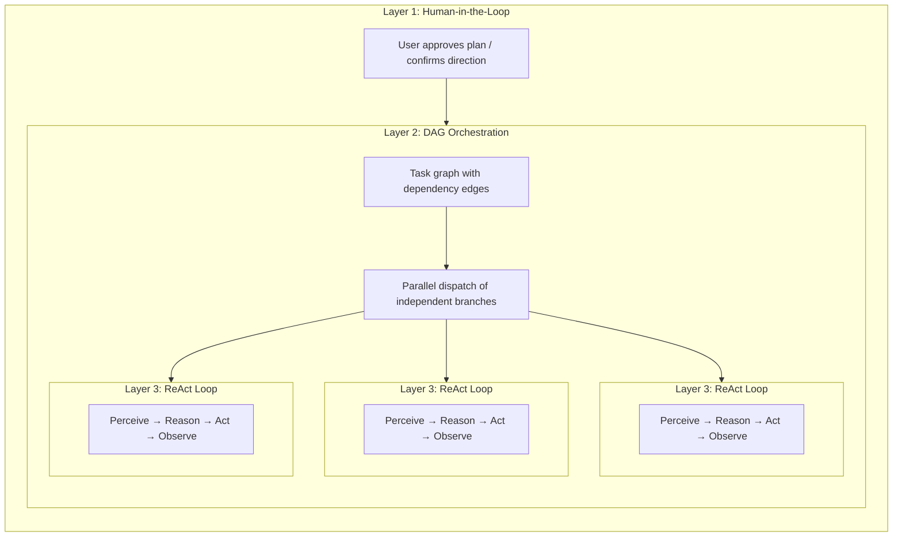

## AI 도구 환경에서 "계획"의 다섯 가지 종류

"계획"이라는 단어는 중복된 의미를 가지고 있습니다. 현재 최소 다섯 가지의 서로 다른 접근 방식이 존재하며, 각각 다른 문제를 해결합니다:

| 접근 방식 | 계획 형식 | 실행 | 승인 | 핵심 가치 |
|---|---|---|---|---|
| **암묵적 모델 계획** | 내부 사고 연쇄 | 단일 추론 패스 | 없음 | 모델이 자체적으로 단계를 생각함 |
| **Claude Code 계획 모드** | Markdown 문서 | 순차적 | 실행 전 인간 검토 | 코드 작업 전 접근 방식 정렬 |
| **Claude Code Teams** | 의존성 간선이 있는 작업 목록 | **동시적** (다중 에이전트) | 인간이 계획 승인, 이후 자율적 | 동적 에이전트 풀 + 병렬 실행 |
| **Kiro 스펙 기반 개발** | 구조화된 스펙 (요구사항 + 설계 + 작업) | 순차적 | 인간이 스펙 검토 | 추적 가능한 요구사항, 수용 기준 |
| **FIM One DAG** | JSON 의존성 그래프 | **동시적** (단일 오케스트레이터) | 자동 (PlanAnalyzer) | 병렬 실행 + 런타임 스케줄링 |

처음 두 가지는 **설계 시간** 계획입니다 — 작업이 시작되기 전에 계획을 생성하고, 인간(또는 모델 자체)이 단계별로 따릅니다. 마지막 세 가지는 **런타임** 계획을 도입합니다 — 실행 그래프가 프로그래밍 방식으로 생성되고 스케줄되며, 독립적인 분기가 병렬로 실행됩니다. 차이점은 *누가* 실행하는가입니다: Claude Code Teams는 자율 에이전트를 생성하고, FIM One DAG는 단일 오케스트레이터 내에서 단계를 디스패치합니다.

이러한 접근 방식들은 경쟁 관계가 아니라 상호 보완적인 계층입니다. Kiro 스타일의 스펙은 *무엇을* 구축할지 정의할 수 있고, FIM One DAG는 하위 작업을 동시에 *어떻게* 실행할지 스케줄할 수 있습니다. Claude Code의 계획 모드는 인간이 접근 방식에 동의하도록 보장하고, FIM One의 PlanAnalyzer는 결과를 자동으로 검증합니다.

## 세 계층 중첩: 완전 기능 아키텍처

Claude Code Teams와 FIM One DAG는 완전한 용량에서 **세 계층 중첩 아키텍처**를 나타냅니다:

- **계층 1 — 휴먼 게이트**: 사용자가 계획을 검토하고 실행 시작 전에 승인합니다.
- **계층 2 — DAG 오케스트레이션**: 승인된 계획은 의존성 엣지가 있는 작업으로 분해됩니다. 독립적인 작업은 병렬로 실행되고, 다운스트림 작업은 차단 요소가 해결될 때까지 대기합니다.
- **계층 3 — ReAct 내부 루프**: 각 작업은 완전한 ReAct 사이클(Perceive → Reason → Act → Observe)을 실행하는 에이전트에 의해 실행되며, 다단계 추론, 도구 사용 및 자율적 재시도가 가능합니다.

핵심 통찰: **Claude Code Teams와 FIM One DAG는 동일한 세 계층을 구현하며, 계층 2 메커니즘만 다릅니다** — 메시지 전달 대 의존성 엣지 해결.

## 전체 성능 런타임: FIM One vs Claude Code Teams

둘 다 진정한 에이전트입니다 — 핵심 루프는 동일합니다: **인식 → 추론 → 행동 → 피드백**. 차이점은 전체 용량에서 병렬 작업을 어떻게 조율하는지에 있습니다.

| 차원 | Claude Code Teams | FIM One DAG |
|---|---|---|
| **병렬 모델** | 리더가 SubAgent를 생성하고 메시지를 통해 작업 할당 | 위상 정렬로 독립적인 단계 자동 병렬화 |
| **작업 그래프** | `blockedBy` / `blocks` 엣지가 있는 TaskList (동적 DAG) | `depends_on` 엣지가 있는 정적 JSON DAG |
| **조율** | 명시적 메시지 전달 (SendMessage / Broadcast) | 암시적 의존성 엣지 — 메시지 없음, 데이터 흐름만 |
| **에이전트 생명주기** | 동적 풀 — 필요 시 에이전트 생성, 완료 시 종료 | 고정 단계 실행자 — 단계당 하나의 LLM 호출 |
| **피드백 및 수정** | 각 SubAgent가 자율적으로 재시도; 리더가 실패 시 재할당 | PlanAnalyzer가 결과 평가 → 재계획 루프 (최대 3라운드) |
| **인간 개입** | 계획 모드 승인, 그 후 자율 실행 | 완전 자동 — PlanAnalyzer가 통과/재계획 결정 |
| **컨텍스트 관리** | 각 SubAgent는 격리된 컨텍스트 윈도우 획득 (교차 오염 없음) | 모든 단계에서 공유 DbMemory + LLM Compact |
| **토큰 경제학** | `N개 에이전트 × 에이전트당 토큰` — 시간↓ 토큰↑ (곱셈 비용) | 순차 또는 얕은 병렬 — 낮은 총 토큰 |
| **확장 패턴** | 더 많은 SubAgent 추가 (수평, 메시지 결합) | 더 많은 DAG 분기 추가 (수평, 의존성 결합) |
| **최적 용도** | 다양하고 느슨하게 관련된 작업 (연구 + 코드 + 테스트) | 명확한 데이터 의존성이 있는 구조화된 워크플로우 |

### 실제 벤치마크: v0.5 RAG 시스템

Claude Code Teams는 FIM One의 전체 v0.5 RAG 하위 시스템을 단일 세션에서 구축했습니다:

- **8단계**: Embedding → Reranker → Loaders → Chunking → VectorStore → Retrieval → KB Backend → Frontend + Docs
- **46개 테스트** 통과, 프론트엔드 빌드 완료
- **실제 소요 시간**: ~5분
- **토큰 비용**: 에이전트 작업당 ~100k 토큰 × 8개 이상 작업 ≈ 총 800k+ 토큰
- **종속성 엣지**: Phase 5는 Phase 4 + 1b에 종속; Phase 6은 Phase 5 + 2 + 3에 종속 — 진정한 DAG

이는 핵심 트레이드오프를 보여줍니다: **토큰 증가의 대가로 시간 병렬화**. Claude Code Teams는 개발자 시간을 위해 컴퓨팅 비용을 거래합니다.

### 수렴, 경쟁이 아닌

"팀 협업"과 "파이프라인 스케줄링" 간의 경계가 흐릿해지고 있습니다:

- **Claude Code Teams의 `blockedBy`/`blocks`는 DAG입니다** — 작업은 명시적 의존성 엣지를 가지며, 리더는 선행 작업이 완료되면 새로 차단 해제된 작업을 디스패치합니다. 이는 추가 단계(메시지)가 있는 위상 정렬 스케줄링입니다.
- **FIM One의 DAG는 에이전트 자율성으로부터 이점을 얻을 수 있습니다** — 단계당 단일 LLM 호출 대신, 각 단계가 전체 ReAct 루프를 실행하도록 하면 복잡한 하위 작업을 더 잘 처리할 수 있습니다.

**핵심:** 동일한 에이전트 본질, 수렴하는 병렬 철학. Claude Code는 **팀 협업** 모델을 따릅니다 — 리더가 메시지를 통해 통신하는 워커에게 위임합니다. FIM One은 **파이프라인 스케줄링** 모델을 따릅니다 — DAG 실행기가 의존성 해결에 따라 단계를 디스패치합니다. 실제로 두 모델 모두 의존성 기반 병렬 실행을 구현합니다. 차이점은 조정 오버헤드(메시지 vs 엣지)와 토큰 경제학(격리된 컨텍스트 vs 공유 메모리)입니다. 최적의 아키텍처는 아마도 둘을 결합할 것입니다: 구조화된 파이프라인을 위한 DAG 스케줄링, 자율적 다단계 추론이 필요한 작업을 위한 에이전트 풀.

## 구조화된 출력 저하

DAG 파이프라인의 모든 구조화된 LLM 호출 사이트(Planner, Analyzer, Tool Selection)는 3단계 저하 체인을 구현하는 통합 `structured_llm_call()` 유틸리티를 사용합니다:

| 레벨 | 조건 | 작동 방식 |
|---|---|---|
| **Native FC** | `llm.abilities["tool_call"]` | 가상 도구 호출을 강제 실행; `tool_calls[0].arguments`에서 추출 |
| **JSON Mode** | `llm.abilities["json_mode"]` | `response_format={"type":"json_object"}` 설정; `extract_json()`으로 파싱 |
| **Plain text** | 항상 사용 가능 | `extract_json()`으로 자유 형식 콘텐츠 파싱, 선택적으로 `regex_fallback()` 사용 |

각 텍스트 기반 레벨은 다음 단계로 넘어가기 전에 재포맷 프롬프트로 한 번 재시도합니다. 결과는 파싱된 값, 성공한 추출 레벨, 누적된 토큰 사용량을 포함하는 `StructuredCallResult`입니다.

이 설계는 동일한 프롬프트가 GPT-4(native FC), Claude(JSON mode), 로컬 모델(plain text)에서 안정적으로 작동하도록 하며, 네 개의 호출 사이트에 분산된 것 대신 한 곳에서 일관된 오류 처리 및 재시도 로직을 제공합니다.
