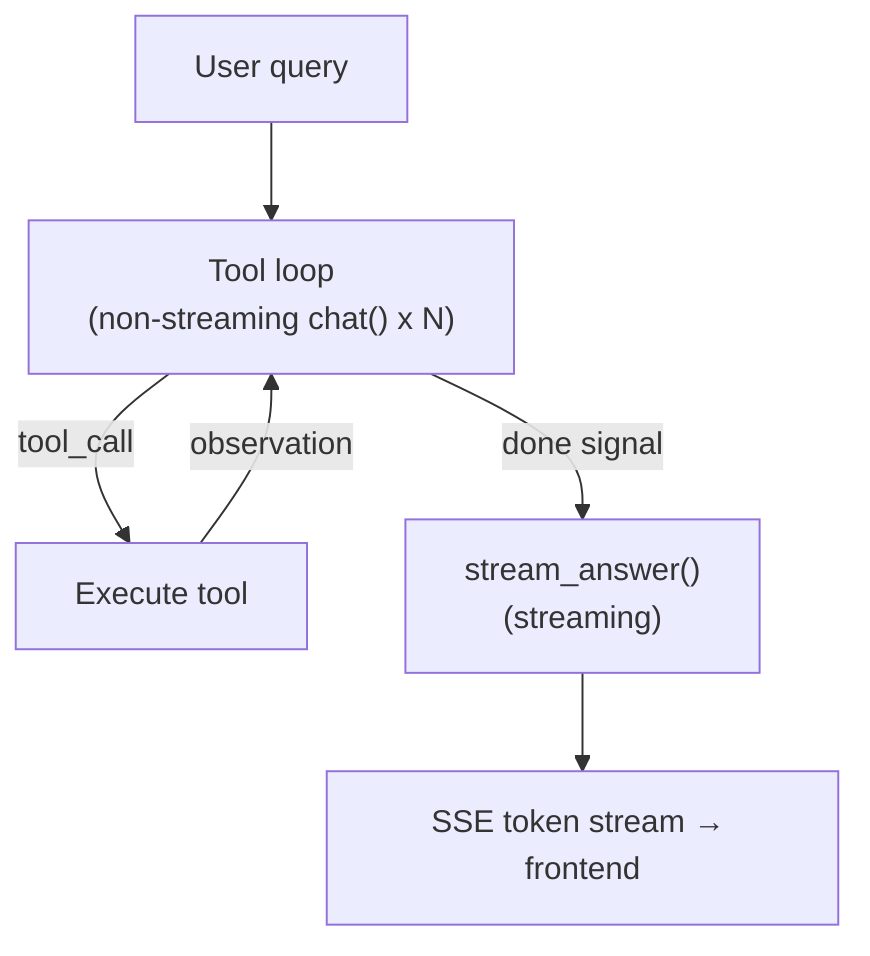
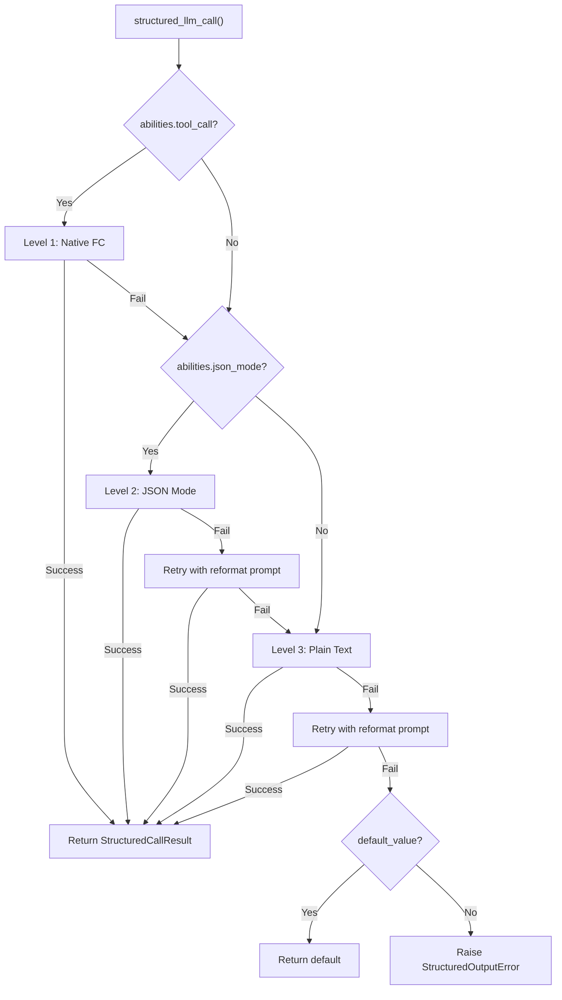
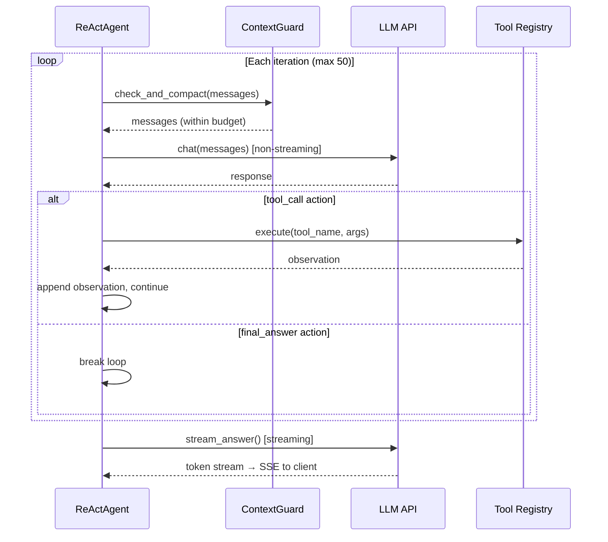
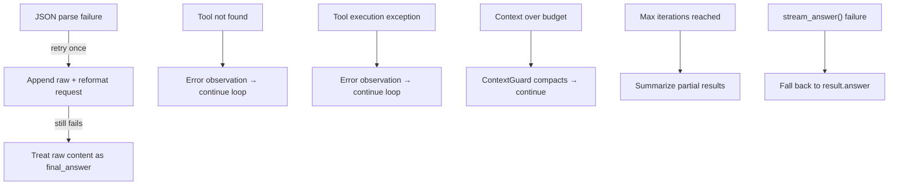
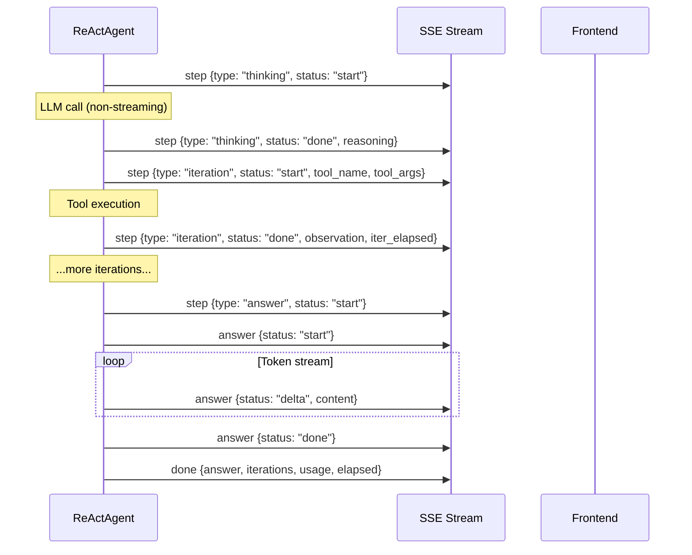

## 아키텍처

ReAct 엔진은 2단계 실행 모델을 구현합니다. 첫 번째 단계는 반복적인 도구 사용 루프입니다: 에이전트는 반복적으로 LLM에 작업을 요청하고, 요청된 도구를 실행하며, 관찰을 추가하고, LLM이 "완료" 신호를 보낼 때까지 계속합니다. 두 번째 단계는 답변 합성입니다: 전체 실행 추적을 읽고 사용자 대면 응답을 생성하는 별도의 스트리밍 LLM 호출입니다.

이러한 분할은 의도적입니다. 도구 반복은 속도에 최적화되어 있습니다 — 루프의 모든 LLM 호출은 비스트리밍 `chat()`을 사용합니다. 사용자가 부분적인 JSON 작업이나 중간 추론 토큰을 볼 필요가 없기 때문입니다. 답변 생성은 UX에 최적화되어 있습니다 — 스트리밍 `stream_chat()`을 사용하므로 사용자는 토큰이 실시간으로 나타나는 것을 봅니다. 결과는 양쪽의 장점을 모두 제공합니다: 빠른 도구 실행과 반응형 답변 전달입니다.

도구 루프는 전체 대화 기록을 포함하는 `AgentResult`를 생성합니다 — 시스템 프롬프트, 사용자 쿼리, 모든 어시스턴트 메시지, 모든 도구 결과. `stream_answer()` 메서드는 이 추적을 간결하고 일관된 답변으로 정제합니다. 도구 결과는 합성 컨텍스트에서 각각 2,000자로 잘려서 복잡한 다중 도구 워크플로우 후에도 프롬프트를 간결하게 유지합니다.

**모델 바인딩.** LLM은 `ReActAgent.__init__()`에 주입되고 `self._llm`으로 저장됩니다. 단일 `run()` 호출 내의 모든 호출 — 모든 도구 루프 반복과 최종 답변 합성 — 이 동일한 인스턴스를 사용합니다. 모델은 반복 간에 변경되지 않습니다. 다른 모델을 사용하려면 새로운 `ReActAgent`를 구성해야 합니다. DAG 모드에서 `DAGExecutor._resolve_agent()`는 이 패턴을 활용합니다: 해당 단계의 ReAct 루프가 시작되기 직전에 단계별로 새로운 에이전트를 생성합니다 (`ModelRegistry`에서 `step.model_hint`를 기반으로 모델 선택). 자세한 내용은 [DAG 엔진 — 단계별 재정의](/architecture/dag-engine#two-llm-architecture)를 참조하세요.

## 이중 모드 실행

ReAct 엔진은 도구 루프 중 LLM과 상호작용하는 두 가지 서로 다른 모드를 지원합니다.

**JSON Mode** (`_run_json`)는 도구 설명을 시스템 프롬프트에 직접 포함하고 LLM에 JSON 객체로 응답하도록 지시합니다 — `tool_call` 액션(도구 이름 및 인수 포함) 또는 `final_answer` 신호 중 하나입니다. 에이전트는 응답 콘텐츠에서 JSON을 파싱하고, 도구를 실행하며, 관찰 결과를 사용자 메시지로 추가합니다.

**Native Function Calling** (`_run_native`)은 LLM 제공자의 기본 제공 도구 호출 API를 사용합니다. 도구 설명은 `tools` 매개변수를 통해 전달되며, LLM은 콘텐츠에서 JSON을 내보내는 대신 API 응답에서 구조화된 `tool_calls`를 반환합니다. 이는 이를 지원하는 모델의 선호 모드입니다.

모드 선택은 자동입니다. `_native_mode_active` 속성은 두 조건이 모두 충족될 때만 `True`를 반환합니다: 에이전트가 `use_native_tools=True`(기본값)로 생성되었고 LLM이 `abilities["tool_call"] = True`를 광고합니다. 어느 조건이든 실패하면 엔진은 JSON 모드로 폴백합니다.

| 측면 | JSON Mode | Native Function Calling |
|--------|-----------|------------------------|
| LLM 출력 | 메시지 콘텐츠의 JSON 객체 | API 응답의 `tool_calls` |
| 시스템 프롬프트 | 텍스트에 전체 도구 설명 포함 | `tools` 매개변수를 통해 전달된 도구 |
| 병렬 도구 호출 | 반복당 하나의 도구 | `asyncio.gather`를 통한 여러 개 |
| 파싱 실패 처리 | 재포맷 프롬프트로 재시도 | N/A (API에 의해 구조화됨) |
| 루프 LLM 호출 | 비스트리밍 `chat()` | 비스트리밍 `chat()` |
| 최적 대상 | 도구 호출 지원이 없는 모델 | GPT-4, Claude 등 |

두 모드 모두 동일한 답변 합성 단계를 공유합니다 — `stream_answer()`는 도구 루프가 어떻게 실행되었는지에 관계없이 동일하게 작동합니다.

## structured_llm_call — 통합 출력 추출

LLM이 JSON 스키마를 준수하는 데이터를 반환해야 하는 모든 호출 지점에서 `structured_llm_call()`을 사용합니다. 이는 전체 프레임워크에서 구조화된 출력의 단일 진입점입니다 — DAG 플래너, 계획 분석기, 도구 선택, 그리고 LLM에서 파싱된 JSON이 필요한 향후 컴포넌트들이 사용합니다.

이 함수는 3단계 열화 체인을 구현하며, LLM의 공시된 기능에 따라 각 단계를 순서대로 시도합니다:

**Level 1: 네이티브 함수 호출.** LLM의 `tool_call` / `tool_choice` API를 사용하여 구조화된 응답을 강제합니다. `abilities["tool_call"] = True`일 때 사용 가능합니다. LLM이 `tool_calls`를 반환하면 인수가 직접 추출됩니다. 파싱이 실패하면 다음 단계로 넘어갑니다.

**Level 2: JSON 모드.** `response_format={"type": "json_object"}`를 설정하여 LLM의 출력 형식을 제한합니다. `abilities["json_mode"] = True`일 때 사용 가능합니다. 응답을 파싱할 수 없으면 재포맷 프롬프트("Your previous response could not be parsed as valid JSON...")와 함께 한 번 재시도한 후 다음 단계로 넘어갑니다.

**Level 3: 평문.** 형식 제약 없이 LLM을 호출하고 `extract_json()`을 사용하여 자유 형식 텍스트에서 JSON을 추출합니다. 추출이 실패하면 선택적 `regex_fallback` 함수를 시도합니다. 재포맷 프롬프트와 함께 한 번 재시도한 후 포기합니다.

열화 체인은 모든 모델 — 전체 도구 호출 지원이 있는 GPT-4부터 평문만 생성할 수 있는 로컬 LLM까지 — 이 구조화된 출력 시나리오에 참여할 수 있음을 의미합니다. 최악의 경우 5번의 LLM 호출(1번의 네이티브 + 1번의 JSON + 1번의 JSON 재시도 + 1번의 평문 + 1번의 평문 재시도)이 필요하지만, 실제로는 대부분의 호출이 Level 1에서 단일 시도로 해결됩니다.

| 모델 기능 | 경로 | 최대 LLM 호출 |
|-----------------|------------|---------------|
| tool_call + json_mode | L1 → L2 → L3 | 5 |
| json_mode만 | L2 → L3 | 4 |
| 평문만 | L3 | 2 |

결과는 파싱된 값, 원본 딕셔너리, 성공한 단계, 누적 토큰 사용량을 포함하는 `StructuredCallResult`입니다. 호출 지점은 `parse_fn`을 사용하여 원본 딕셔너리를 도메인 객체(예: DAG 계획)로 변환하고 `default_value`를 사용하여 전체 실패가 허용 가능할 때 폴백을 제공합니다.

`structured_llm_call`은 다음에서 사용됩니다: DAG 플래너(계획 스키마), 계획 분석기(분석 스키마), 도구 선택(도구 목록 스키마), 그리고 신뢰할 수 있는 구조화된 출력이 필요한 모든 컴포넌트. 또한 [Planning Landscape](/architecture/planning-landscape)에서도 논의됩니다.

## 도구 선택

에이전트가 많은 도구에 접근할 수 있을 때 — Hub 모드에서 여러 커넥터가 각각 여러 작업을 노출하는 경우가 일반적 — 모든 도구의 전체 스키마를 대화 컨텍스트에 주입하는 것은 낭비입니다. 20개의 도구가 있는 커넥터 허브는 도구 설명만으로 약 5K 토큰을 소비하여 대화 기록과 도구 결과를 위한 공간을 압박합니다.

엔진은 경량 선택 단계로 이를 해결합니다. 등록된 도구의 총 개수가 `TOOL_SELECTION_THRESHOLD`(12)를 초과하면, 에이전트는 주 루프에 진입하기 전에 예비 LLM 호출을 실행합니다. 이 호출은 컴팩트 카탈로그를 받습니다 — 도구당 약 80자, 이름과 한 줄 설명만 포함하고 매개변수 스키마는 없음 — 그리고 현재 쿼리에 가장 관련성 높은 도구를 선택합니다. 최대 `_TOOL_SELECTION_MAX`(6)개까지입니다.

선택은 간단한 스키마(`{"tools": ["tool_name_1", "tool_name_2"]}`)와 함께 `structured_llm_call`을 사용하므로, 동일한 3단계 저하의 이점을 얻습니다. 선택된 도구 이름은 주 루프가 시스템 프롬프트 구성과 도구 실행 모두에 사용하는 필터링된 `ToolRegistry`를 구축하는 데 사용됩니다.

선택 실패는 의도적으로 치명적이지 않습니다. LLM이 파싱할 수 없는 출력을 반환하거나, 선택된 이름이 모두 유효하지 않거나, 예외가 발생하면, 에이전트는 전체 도구 세트로 폴백합니다. 이는 결함 있는 선택이 에이전트의 기능을 방해하지 않도록 보장합니다 — 단지 최적보다 더 많은 컨텍스트를 사용할 뿐입니다.

## 반복 루프

핵심 루프는 JSON 모드와 네이티브 모드 모두를 구동하며, 메시지 처리에서 약간의 차이가 있습니다. 각 반복은 동일한 고수준 패턴을 따릅니다: 컨텍스트 예산 확인, LLM 호출, 응답 처리, 도구 실행 또는 중단.

**JSON 모드 루프.** LLM의 응답은 `_parse_action()`을 통해 파싱되며, 이는 `extract_json()`을 사용하여 콘텐츠에서 JSON 객체를 찾습니다. 파싱이 실패하면 에이전트는 원본 응답과 재포맷 요청을 추가한 후 계속 진행합니다. 이는 `max_iterations`에 포함되어 무한 재시도 루프를 방지합니다. 성공 시 작업은 `tool_call`(도구 실행, 관찰을 사용자 메시지로 추가) 또는 `final_answer`(루프 중단 및 합성으로 진행)입니다.

**네이티브 모드 루프.** LLM의 응답에는 하나 이상의 `tool_calls`가 포함될 수 있습니다. 단일 응답의 모든 도구 호출은 `asyncio.gather`를 통해 병렬로 실행되며, 모든 도구 결과 메시지는 다른 메시지보다 먼저 추가됩니다. 이 순서 제약은 중요합니다. OpenAI API(및 호환 제공자)는 `tool` 메시지가 `tool_calls`를 생성한 `assistant` 메시지 바로 뒤에 와야 합니다. 그 사이에 다른 메시지(예: 사용자 인터럽트)를 삽입하면 프로토콜이 손상됩니다. `tool_calls`가 없으면 응답은 최종 답변으로 처리됩니다.

**최대 반복.** 기본 제한은 50회 반복입니다. 루프가 `final_answer`를 생성하지 않고 이 제한을 초과하면 에이전트는 누적된 단계 결과에서 폴백 응답을 합성합니다. 이는 어떤 도구가 호출되었고 성공 또는 실패했는지에 대한 요약입니다. 이는 안전장치이지 정상적인 종료 경로가 아닙니다.

[컨텍스트 관리](/architecture/context-management)는 ContextGuard가 모든 반복에서 토큰 예산을 적용하는 방법을 설명하며, 최근 추론 체인을 보존하도록 압축 LLM에 지시하는 힌트 시스템을 포함합니다.

## 중간 루프 자체 반성

긴 추론 체인(10개 이상의 도구 호출)은 **목표 편향** 위험이 있습니다 — 에이전트가 원래 목표에서 점차 로컬 부분 문제로 초점을 이동하거나, 유사한 작업을 반복하거나, 순환 재시도 루프에 빠집니다. 중간 루프 자체 반성은 가벼운 대응책입니다.

`_SELF_REFLECTION_INTERVAL` 도구 호출 반복마다(기본값: **6**), 에이전트는 LLM에 일시 중지하고 반성하도록 요청하는 사용자 메시지를 대화에 주입합니다:

- 원래 목표를 향해 여전히 진행 중인가?
- 유사한 작업을 반복하거나 원을 그리고 있지는 않은가?
- 완료하기 위한 가장 직접적인 다음 단계는 무엇인가?
- 지금 최종 답변을 제시해야 하는가?

카운터는 **실제 도구 호출만** 추적합니다 — JSON 파싱 재시도, 사고 이벤트, 중단 주입은 계산되지 않습니다. 네이티브 모드에서는 반성 메시지가 tool_use/tool_result 쌍 제약을 유지하기 위해 모든 `tool_result` 메시지 이후에 엄격하게 추가됩니다.

이는 주입당 약 100개의 토큰이 소비되며(추가 LLM 호출 없음) 짧은 실행(`< 6` 도구 호출)에는 영향을 주지 않습니다. ContextGuard(토큰 예산 관리)와 단계별 검증(개별 결과 검증)을 보완하여 다른 실패 모드를 해결합니다: 에이전트가 많은 반복에 걸쳐 목표를 놓치는 것입니다.

## 답변 합성 (stream_answer)

도구 루프와 답변 합성 간의 분리는 핵심 아키텍처 결정입니다. 도구 반복은 원본 데이터(JSON 작업, 도구 관찰, 오류 메시지)를 생성합니다. 사용자는 에이전트의 내부 추적 덤프가 아닌 일관되고 잘 형식화된 답변이 필요합니다.

`stream_answer()`는 두 가지 구성 요소에서 합성 프롬프트를 구축합니다. 시스템 프롬프트는 LLM에 합성기 역할을 수행하도록 지시합니다: 결과를 직접 제시하고, 마크다운 형식을 사용하고, 메타 주석("도구 출력을 기반으로...")을 피하고, 원본 쿼리의 언어와 일치시킵니다. 사용자 메시지는 원본 질문과 형식화된 실행 추적을 포함합니다 — 각 도구 호출과 그 결과이며, 도구 결과는 2,000자로 잘립니다.

합성 호출은 `stream_chat()`을 사용하여 토큰을 증분적으로 생성합니다. 웹 계층은 이러한 토큰을 `delta` 상태의 SSE `answer` 이벤트로 래핑하므로 프론트엔드는 도착하는 대로 렌더링할 수 있습니다.

`stream_answer()`가 실패하면 — 네트워크 오류, LLM 타임아웃, 모든 예외 — 웹 계층은 `result.answer`로 폴백합니다. 이는 도구 루프의 마지막 반복에서 나온 간단한 텍스트입니다. 이는 저하된 경험(스트리밍 없음, 잠재적으로 덜 다듬어진 산문)이지만, 사용자가 항상 응답을 받도록 보장합니다.

## 중단 처리

사용자는 에이전트가 여전히 처리 중인 동안 후속 메시지를 보낼 수 있습니다. 이러한 메시지는 `interrupt_queue`를 통해 전달되며, 이는 대화별로 등록된 `InterruptQueue`로 반복 간에 메시지를 누적합니다.

드레인 타이밍은 도구 호출 순서 제약으로 인해 모드에 따라 다릅니다:

- **JSON 모드**: 큐는 각 어시스턴트 메시지 직후에 즉시 드레인되며, 작업이 `final_answer`인지 확인하기 전입니다. JSON 모드는 구조적 쌍 요구사항이 없는 일반 사용자/어시스턴트 메시지를 사용하므로 안전합니다.

- **Native FC 모드**: 큐는 도구 결과 메시지가 추가된 후에만 드레인됩니다. `tool` 메시지는 `tool_calls`를 포함하는 `assistant` 메시지 바로 뒤에 와야 합니다. 그 사이에 사용자 메시지를 삽입하면 API 프로토콜을 위반하고 오류를 발생시킵니다.

주입된 메시지는 `pinned=True`로 표시되어 ContextGuard의 후속 압축에서도 유지됩니다. 고정 메커니즘이 압축으로부터 중요한 메시지를 보호하는 방법은 [고정된 메시지](/architecture/context-management#pinned-messages)를 참조하세요.

`final_answer`가 대기 중이지만 주입된 메시지가 도착한 경우, 에이전트는 최종 답변을 억제하고 사용자의 후속 질문을 처리할 수 있도록 루핑을 계속합니다. 동일한 드레인에서의 여러 주입은 단일 `[USER INTERRUPT]` 메시지로 결합됩니다. 이는 LLM이 짧은 메시지의 단편화된 시퀀스를 보지 않도록 하고 모든 후속 질문을 전체적으로 처리하도록 장려합니다.

## 오류 처리 및 폴백

엔진은 LLM 또는 도구 실패로 인해 절대 충돌하지 않도록 설계되었습니다. 모든 오류 경로는 자동으로 복구되거나 사용자에게 유용한 메시지를 표시합니다.

**JSON 파싱 실패.** LLM이 JSON 모드에서 JSON이 아닌 콘텐츠를 반환할 때, `_parse_action()`은 이를 `final_answer`로 래핑하고 추론 내용을 `"(could not parse LLM output as JSON)"`으로 설정합니다. 루프는 이 센티널을 감지하고 원본 콘텐츠와 재포맷 지시를 추가한 후 계속 진행합니다. 재시도도 실패하면 원본 콘텐츠가 답변이 됩니다 — 완벽하지는 않지만 충돌하지는 않습니다.

**도구 오류.** "도구를 찾을 수 없음"과 "도구 실행 예외" 모두 대화에 추가되는 오류 관찰을 생성합니다. LLM은 다음 반복에서 오류를 보고 다른 인자로 재시도할지 또는 진행할지 결정할 수 있습니다. 이는 일시적 도구 실패에 대해 에이전트를 자체 치유 가능하게 만듭니다.

**확장된 사고.** DeepSeek R1과 같은 모델은 추론 콘텐츠를 JSON 본문이 아닌 별도의 `reasoning_content` 필드에 반환합니다. 엔진은 이를 확인하고 JSON `reasoning` 필드가 비어 있을 때 폴백으로 사용합니다.

**풍부한 콘텐츠.** 도구가 HTML 또는 마크다운 아티팩트를 생성할 때, LLM으로 전송되는 관찰은 짧은 요약(`"[Artifact generated: filename] The content is rendered as a preview in the UI..."`)으로 대체됩니다. 이는 LLM이 최종 답변에서 큰 HTML 블롭을 에코하는 것을 방지합니다 — 모델이 도움이 되도록 전체 도구 출력을 다시 붙여넣는 일반적인 실패 모드입니다.

## SSE 이벤트 프로토콜

웹 레이어는 에이전트의 반복 콜백을 프론트엔드를 위한 Server-Sent Events로 변환합니다. 이벤트는 두 개의 SSE 채널에서 발생합니다: 도구 루프용 `step`과 합성 단계용 `answer`입니다.

| 이벤트 | 채널 | 페이로드 | 시점 |
|-------|---------|---------|------|
| Thinking start | `step` | `{type: "thinking", status: "start", iteration}` | 각 LLM 호출 전 |
| Thinking done | `step` | `{type: "thinking", status: "done", iteration, reasoning}` | LLM 응답 후, 도구 실행 전 |
| Iteration start | `step` | `{type: "iteration", status: "start", iteration, tool_name, tool_args}` | 도구 실행 시작 |
| Iteration done | `step` | `{type: "iteration", status: "done", iteration, tool_name, observation, error, iter_elapsed}` | 도구 실행 완료 |
| Answer signal | `step` | `{type: "answer", status: "start"}` | 에이전트가 final_answer 신호 |
| Answer start | `answer` | `{status: "start"}` | 합성 스트리밍 시작 |
| Answer delta | `answer` | `{status: "delta", content}` | 각 스트리밍된 토큰 |
| Answer done | `answer` | `{status: "done"}` | 합성 스트리밍 완료 |
| Compact | `compact` | `{original_messages, kept_messages}` | 로드 시 컨텍스트 압축됨 |
| Phase | `phase` | `{phase: "selecting_tools", total_tools}` | 도구 선택 단계 활성 |
| Inject | `inject` | `{type: "inject", content}` | 사용자 인터럽트 수신 |
| Done | `done` | `{answer, iterations, usage, elapsed}` | 최종 결과 페이로드 |

프론트엔드는 `step` 이벤트를 사용하여 접을 수 있는 도구 호출 카드를 렌더링하고(실행 중인 도구, 인수 및 관찰 표시), `answer` 델타를 사용하여 응답 텍스트를 스트리밍하며, `compact`를 사용하여 컨텍스트 요약 구분선을 표시합니다. `done` 이벤트는 완전한 메타데이터(총 반복 횟수, 토큰 사용량 및 경과 시간)를 응답 푸터에 전달합니다.
