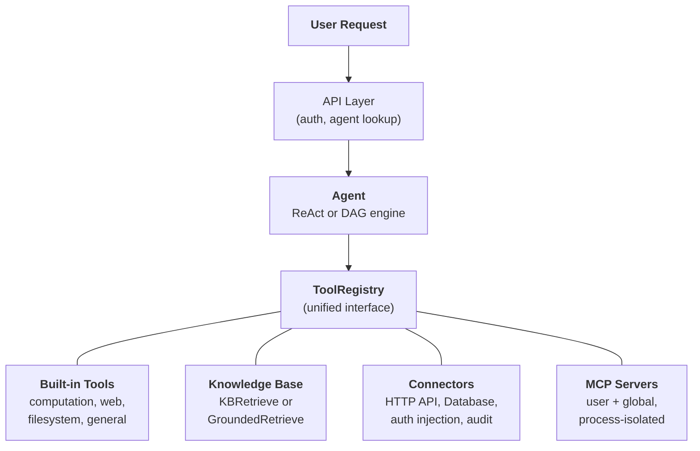
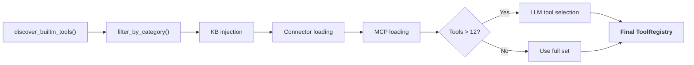

---
title: "시스템 개요"
description: "Agent, Knowledge Base, Connector, Built-in Tools, 및 MCP가 통합 아키텍처로 구성되는 방식."
---## 통합 도구 추상화

FIM One의 핵심 설계 통찰력은 **에이전트가 할 수 있는 모든 것이 도구**라는 것입니다. 계산기, 지식 기반 쿼리, ERP API 호출, 그리고 타사 MCP 서버 모두 동일한 `Tool` 프로토콜을 구현합니다: `name`, `description`, `parameters_schema`, `category`, 그리고 `run()`. 에이전트는 로컬 Python 함수를 호출하는지, 벡터 데이터베이스를 쿼리하는지, 레거시 시스템으로 프록시하는지, 또는 커뮤니티 MCP 서버를 호출하는지 알거나 신경 쓰지 않습니다. 이는 `ToolRegistry`에서 호출 가능한 도구의 평면 목록을 봅니다.

이는 우발적인 단순화가 아니라 의도적인 아키텍처 선택입니다. 이는 새로운 기능 소스를 추가할 때 에이전트, 실행 엔진, 또는 컨텍스트 관리 계층을 변경할 필요가 없다는 것을 의미합니다. 도구를 등록하면 에이전트가 이를 사용합니다.

네 가지 기능 소스가 하나의 레지스트리로 수렴됩니다. 에이전트는 이들 모두에서 동등하게 끌어옵니다.## 네 가지 기능 소스### 기본 제공 도구

`discover_builtin_tools()`를 통해 시작 시 자동으로 발견됩니다. `core/tool/builtin/`에 `BaseTool` 서브클래스를 추가하면 별도의 설정 없이 등록됩니다. 카테고리에는 계산(`calculator`, `python_exec`), 웹(`web_search`, `web_fetch`), 파일시스템(`file_ops`), 일반(`email_send`, `json_transform`, `template_render`, `text_utils`)이 포함됩니다. 이들은 에이전트의 기본 기능입니다 -- 항상 사용 가능하며 설정이 필요 없습니다.### Knowledge Base

조건부. 에이전트가 `kb_ids`를 바인딩했을 때, 일반 `kb_retrieve` 도구는 특화된 검색 도구로 교체됩니다. **simple mode**에서는 `KBRetrieveTool`이 기본 RAG 검색을 수행합니다. **grounding mode**에서는 `GroundedRetrieveTool`이 5단계 파이프라인을 실행합니다: 다중-KB 검색, 인용 추출, 정렬 점수 매기기, 충돌 감지, 신뢰도 계산. Knowledge Base는 에이전트 옆에 있는 별도의 하위 시스템이 아닙니다 -- 에이전트에 특화된 도구로 진입하며, 다른 모든 것과 동일한 `Tool` 프로토콜의 대상입니다.### Connector

`ConnectorToolAdapter`는 엔터프라이즈 시스템 작업을 도구로 래핑합니다. 각 작업은 `{connector}__{action}` 형태로 명명되는 도구가 되며, `connector` 카테고리로 분류됩니다. 어댑터는 인증 주입(bearer, API key, basic)이 포함된 HTTP 프록시, 작업 수준 접근 제어(read/write/admin), 응답 截断, 감사 로깅을 추가합니다. 직접 데이터베이스 접근의 경우, `DatabaseToolAdapter`는 선택적 읽기 전용 강제를 포함한 스키마 인식 SQL 실행을 제공합니다. Connector는 AI와 레거시 시스템 간의 다리 역할을 하며, 핵심 차별화 요소입니다. 전체 설계는 [Connector Architecture](/architecture/connector-architecture)를 참조하세요.### MCP

외부 MCP 서버는 표준 프로토콜을 통해 타사 도구를 제공합니다. 각 서버는 자체 프로세스(stdio 또는 HTTP 전송)에서 실행되며 플랫폼과 완전히 격리됩니다. 도구는 `Tool` 프로토콜로 적응되고 `mcp` 카테고리 아래에 등록됩니다. 관리자는 모든 사용자가 자동으로 로드하는 **전역 MCP 서버**를 프로비저닝할 수 있습니다. MCP는 생태계 플레이입니다 -- 모든 MCP 호환 서버는 사용자 정의 통합 없이 작동합니다.## 요청별 도구 어셈블리

모든 채팅 요청은 `_resolve_tools()`의 필터링 파이프라인을 통해 새로운 도구 세트를 어셈블합니다. 이는 정적 구성이 아니라 에이전트의 설정, 사용자의 신원, 그리고 사용 가능한 커넥터와 MCP 서버를 기반으로 요청별로 계산됩니다.

여섯 단계:

1. **기본 검색.** `discover_builtin_tools()`는 모든 기본 제공 도구를 로드하며, 대화의 샌드박스로 범위가 지정됩니다.
2. **에이전트 카테고리 필터.** `filter_by_category(*agent.tool_categories)`는 에이전트가 사용할 수 있는 카테고리만으로 제한합니다.
3. **KB 주입.** 에이전트에 `kb_ids`가 있으면, 일반 검색 도구는 검색 모드에 따라 `KBRetrieveTool` 또는 `GroundedRetrieveTool`로 대체됩니다.
4. **커넥터 로딩.** 에이전트의 바인딩된 커넥터는 데이터베이스에서 쿼리됩니다. 각 커넥터의 작업(또는 데이터베이스 스키마)은 도구 어댑터로 인스턴스화되고 등록됩니다.
5. **MCP 로딩.** 사용자의 개인 MCP 서버와 관리자가 프로비저닝한 전역 MCP 서버가 로드되고, 연결되며, 해당 도구가 등록됩니다.
6. **런타임 선택.** 전체 도구 수가 12를 초과하면, 경량 LLM 호출이 이 특정 쿼리에 가장 관련성 높은 부분 집합(최대 6개)을 선택합니다. 선택 실패는 치명적이지 않습니다 -- 에이전트는 전체 세트로 폴백됩니다.

결과: 에이전트는 필요한 정확한 도구만 봅니다. 커넥터가 없고 KB가 없는 단순 에이전트는 5개의 도구를 볼 수 있습니다. 3개의 엔터프라이즈 시스템에 연결되고 근거 기반 지식 기반과 2개의 MCP 서버를 가진 Hub 에이전트는 30개를 볼 수 있습니다 -- 하지만 선택 후에는 가장 관련성 높은 6개만 컨텍스트에 포함됩니다.## 언제 무엇을 사용할지

| 필요 사항 | 사용 | 이유 |
|------|-----|-----|
| 일반 계산, 코드 실행, 텍스트 변환 | Built-in Tool | 항상 사용 가능, 설정 불필요 |
| 엔터프라이즈 시스템 통합 (ERP, CRM, OA) | Connector | 인증 거버넌스, 감사 추적, 작업 수준 접근 제어 |
| 인용 및 증거를 포함한 지식 검색 | Knowledge Base | RAG 파이프라인, 근거 기반 생성, 충돌 감지 |
| 타사 도구 생태계 | MCP | 표준 프로토콜, 프로세스 격리, 커뮤니티 서버 |
| 직접 데이터베이스 접근 | Database Connector | 스키마 인식 SQL, 선택적 읽기 전용 적용 |
| 사용자 정의 내부 도구 | MCP 또는 Built-in | 프로세스 격리는 MCP, 긴밀한 통합은 built-in |

이 카테고리들은 상호 배타적이지 않습니다. 단일 agent는 한 번의 대화에서 네 가지 기능 소스를 모두 사용할 수 있습니다. 예를 들어 정책 문서를 위해 knowledge base를 쿼리하고, ERP를 확인하기 위해 connector를 호출하며, 결과를 포맷하기 위해 built-in tool을 사용할 수 있습니다.## 실행 엔진은 직교한다

도구 시스템과 실행 엔진은 독립적인 관심사이다. 두 엔진 모두 동일한 `ToolRegistry`에서 도구를 사용한다. 엔진의 선택은 도구가 어떻게 조율되는지에 영향을 미치며, 어떤 도구를 사용할 수 있는지에는 영향을 미치지 않는다.

**ReAct**는 반복적인 도구 루프이다. 에이전트가 추론하고, 도구를 선택하고, 결과를 관찰한 후 완료될 때까지 반복한다. 다음 단계가 이전 결과에 따라 달라지는 탐색적이고 대화형인 작업에 탁월하다. 루프는 ContextGuard를 통한 반복별 컨텍스트 관리로 최대 50회 반복 실행된다. 구현 세부 사항은 [ReAct Engine](/architecture/react-engine)을 참조하라.

**DAG**는 목표를 2-6개의 병렬 단계로 분해한다. 각 단계는 독립적인 ReAct 에이전트를 실행한다. PlanAnalyzer는 목표 달성 여부를 평가하며, 달성되지 않으면 파이프라인이 자동으로 재계획한다(최대 3라운드). DAG는 명확한 하위 작업이 있고 동시에 실행할 수 있는 작업에 탁월하다 -- "세 개의 소스를 검색하고 결과를 비교"하는 작업이 세 번의 검색 시간이 아닌 한 번의 검색 시간에 완료된다. 전체 파이프라인은 [DAG Engine](/architecture/dag-engine)을 참조하라.

두 엔진은 인프라를 공유한다: 신뢰할 수 있는 구조화된 출력을 위한 `structured_llm_call`, 토큰 예산 적용을 위한 `ContextGuard`, 도구 해석을 위한 `ToolRegistry`. 새로운 도구를 추가하려면 두 엔진 모두에 대한 변경이 필요하지 않다. 새로운 엔진을 추가하려면(필요한 경우) 도구 시스템에 대한 변경이 필요하지 않다.## 라이프사이클 개요

**시작.** `start.sh`는 Alembic 마이그레이션을 실행하고, FastAPI 서버를 시작하며, 기본 제공 도구를 발견하고, 사전 구성된 전역 서버에 대한 MCP 서버 연결을 설정합니다.

**요청별.** JWT 인증, 에이전트 구성 조회, 도구 조립(위의 6단계 파이프라인), 엔진 선택(에이전트 구성에 따른 ReAct 또는 DAG), SSE 스트리밍을 통한 실행, 결과 지속성.

**횡단 관심사.** [컨텍스트 관리](/architecture/context-management)(5계층 토큰 예산)는 모든 LLM 호출을 오버플로우로부터 보호합니다. 감사 로깅은 모든 커넥터 도구 호출을 추적합니다. 샌드박스 격리는 코드 실행 도구를 포함합니다. 2-LLM 아키텍처(스마트 + 빠름)는 계획, 실행, 합성 전반에 걸쳐 비용을 최적화합니다.

아키텍처는 각 관심사(도구 등록, 실행 오케스트레이션, 컨텍스트 관리, 보안)가 독립적으로 발전할 수 있도록 설계되었습니다. 새로운 커넥터 유형, 새로운 실행 엔진, 또는 새로운 컨텍스트 전략을 시스템 전체에 걸친 연쇄적 변경 없이 추가할 수 있습니다.