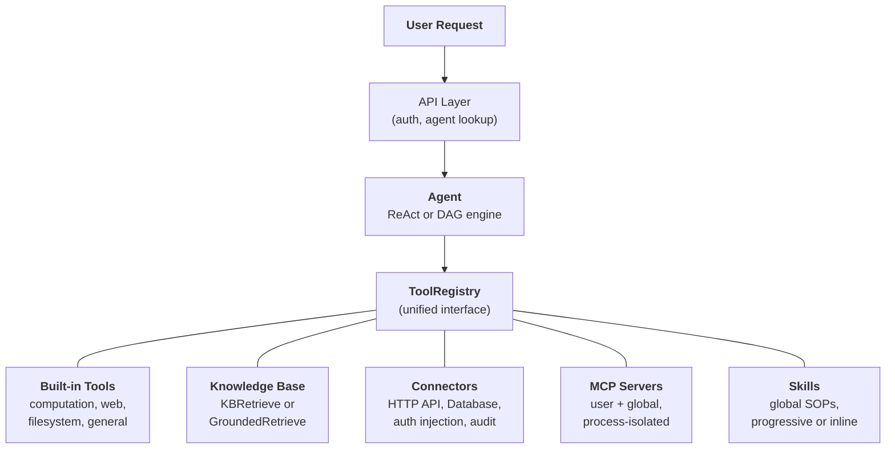
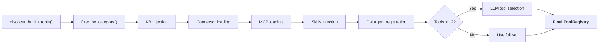

## 통합 도구 추상화

FIM One의 핵심 설계 통찰력은 **에이전트가 할 수 있는 모든 것이 도구**라는 것입니다. 계산기, 지식 기반 쿼리, ERP API 호출, 그리고 타사 MCP 서버 모두 동일한 `Tool` 프로토콜을 구현합니다: `name`, `description`, `parameters_schema`, `category`, 그리고 `run()`. 에이전트는 로컬 Python 함수를 호출하는지, 벡터 데이터베이스를 쿼리하는지, 레거시 시스템으로 프록시하는지, 또는 커뮤니티 MCP 서버를 호출하는지 알거나 신경 쓰지 않습니다. `ToolRegistry`에서 호출 가능한 도구의 평면 목록을 봅니다.

이는 의도적인 아키텍처 선택이며, 우연한 단순화가 아닙니다. 이는 새로운 기능 소스를 추가할 때 에이전트, 실행 엔진, 또는 컨텍스트 관리 계층을 변경할 필요가 없다는 의미입니다. 도구를 등록하면 에이전트가 사용합니다.

5가지 기능 소스가 하나의 레지스트리로 수렴합니다. 에이전트는 모두 동등하게 사용합니다.

## 다섯 가지 기능 소스

### 기본 제공 도구

`discover_builtin_tools()`를 통해 시작 시 자동으로 발견됩니다. `core/tool/builtin/` 디렉토리에 `BaseTool` 서브클래스를 추가하면 별도의 설정 없이 등록됩니다. 카테고리에는 계산(`calculator`, `python_exec`), 웹(`web_search`, `web_fetch`), 파일시스템(`file_ops`), 일반(`email_send`, `json_transform`, `template_render`, `text_utils`)이 포함됩니다. 이들은 에이전트의 기본 능력입니다 -- 항상 사용 가능하며 설정이 필요 없습니다.

### 지식 기반

조건부. 에이전트가 `kb_ids`를 바인딩했을 때, 일반 `kb_retrieve` 도구는 특화된 검색 도구로 교체됩니다. **단순 모드**에서 `KBRetrieveTool`은 기본 RAG 검색을 수행합니다. **근거 모드**에서 `GroundedRetrieveTool`은 5단계 파이프라인을 실행합니다: 다중-KB 검색, 인용 추출, 정렬 점수 계산, 충돌 감지, 신뢰도 계산. 지식 기반은 에이전트 옆에 있는 별도의 하위 시스템이 아닙니다. 에이전트에 특화된 도구로 진입하며, 다른 모든 것과 동일한 `Tool` 프로토콜의 적용을 받습니다.

### 커넥터

`ConnectorToolAdapter`는 엔터프라이즈 시스템 작업을 도구로 래핑합니다. 각 작업은 `{connector}__{action}` 형식으로 명명된 도구가 되며, `connector` 카테고리로 분류됩니다. 어댑터는 인증 주입(bearer, API 키, 기본)이 포함된 HTTP 프록시, 작업 수준 액세스 제어(읽기/쓰기/관리자), 응답 잘라내기 및 감사 로깅을 추가합니다. 직접 데이터베이스 액세스의 경우, `DatabaseToolAdapter`는 선택적 읽기 전용 적용과 함께 스키마 인식 SQL 실행을 제공합니다. 커넥터는 AI와 레거시 시스템 간의 다리입니다 -- 핵심 차별화 요소입니다. 전체 설계는 [커넥터 아키텍처](/architecture/connector-architecture)를 참조하세요.

### MCP

외부 MCP 서버는 표준 프로토콜을 통해 제3자 도구를 제공합니다. 각 서버는 자체 프로세스(stdio 또는 HTTP 전송)에서 실행되며 플랫폼으로부터 완전히 격리됩니다. 도구는 `Tool` 프로토콜로 적응되고 `mcp` 카테고리 아래에 등록됩니다. 관리자는 모든 사용자에 대해 자동으로 로드되는 **전역 MCP 서버**를 프로비저닝할 수 있습니다. MCP는 생태계 전략입니다 -- 모든 MCP 호환 서버는 사용자 정의 통합 없이 작동합니다.

### 스킬

스킬은 재사용 가능한 표준 운영 절차(SOP)입니다. 회사 정책, 처리 절차, 단계별 워크플로우 등이 선택된 에이전트와 관계없이 전역적으로 적용됩니다. 커넥터와 지식 베이스(특정 에이전트로 범위를 지정할 수 있음)와 달리, 스킬은 가시성(개인, 조직 공유 또는 마켓 구독)에 따라 모든 사용자에게 항상 로드됩니다.

스킬은 두 가지 주입 모드를 지원합니다. **점진적 모드**(기본값)에서는 시스템 프롬프트에 간단한 스텁(이름 + 설명)이 포함되며, LLM이 필요에 따라 `read_skill(name)`을 호출하여 전체 콘텐츠를 로드합니다. 이는 많은 스킬을 사용할 때 컨텍스트 토큰을 절약합니다. **인라인 모드**에서는 전체 스킬 콘텐츠가 시스템 프롬프트에 직접 포함됩니다. 이는 적은 수의 작은 스킬을 사용할 때 적합합니다.

스킬이 전역적(에이전트에 바인딩되지 않음)인 이유와 이중 모드 리소스 검색과 상호 작용하는 방식에 대해 자세히 알아보려면 [에이전트 & 리소스 검색](/architecture/agent-discovery)을 참조하세요.

## 요청별 도구 조립

모든 채팅 요청은 `_resolve_tools()`의 필터링 파이프라인을 통해 새로운 도구 세트를 조립합니다. 이는 정적 구성이 아니라 에이전트의 설정, 사용자의 신원, 그리고 사용 가능한 커넥터와 MCP 서버를 기반으로 요청별로 계산됩니다.

8가지 단계:

1. **기본 검색.** `discover_builtin_tools()`는 대화의 샌드박스로 범위가 지정된 모든 기본 제공 도구를 로드합니다.
2. **에이전트 카테고리 필터.** `filter_by_category(*agent.tool_categories)`는 에이전트가 사용할 수 있는 카테고리만으로 제한합니다.
3. **KB 주입.** 에이전트에 `kb_ids`가 있으면, 일반 검색 도구는 검색 모드에 따라 `KBRetrieveTool` 또는 `GroundedRetrieveTool`로 대체됩니다.
4. **커넥터 로드.** 에이전트 제약 모드에서는 에이전트의 바인딩된 커넥터만 로드됩니다. 자동 검색 모드(에이전트 미선택)에서는 사용자에게 표시되는 모든 커넥터가 로드됩니다 -- API 커넥터의 경우 `ConnectorMetaTool`(점진적 검색)을 사용하고 데이터베이스 커넥터의 경우 개별 도구를 사용합니다.
5. **MCP 로드.** 사용자의 개인 MCP 서버와 관리자가 프로비저닝한 전역 MCP 서버가 로드되고, 연결되며, 해당 도구가 등록됩니다.
6. **스킬 주입.** 에이전트 선택 여부와 관계없이 사용자에게 표시되는 모든 활성 스킬이 로드됩니다. 점진적 모드에서는 `ReadSkillTool`이 시스템 프롬프트의 간단한 스텁으로 등록됩니다. 인라인 모드에서는 전체 스킬 콘텐츠가 직접 포함됩니다.
7. **CallAgent 등록.** 모든 활성이고 표시되는 에이전트가 카탈로그로 조립되고 `CallAgentTool`을 통해 노출되어 LLM이 전문 하위 에이전트에게 작업을 위임할 수 있도록 합니다. 하위 에이전트는 자신의 구성에서 구축된 전체 `ToolRegistry`를 받지만 무한 재귀를 방지하기 위해 `call_agent`를 제외합니다.
8. **런타임 선택.** 전체 도구 수가 12개를 초과하면, 경량 LLM 호출이 이 특정 쿼리에 가장 관련성 높은 부분 집합(최대 6개)을 선택합니다. 선택 실패는 치명적이지 않습니다 -- 에이전트는 전체 세트로 폴백합니다.

결과: 에이전트는 필요한 도구만 정확히 봅니다. 커넥터가 없고 KB가 없는 단순 에이전트는 5개의 도구를 볼 수 있습니다. 3개의 엔터프라이즈 시스템에 연결되고 기반이 있는 지식 베이스와 2개의 MCP 서버가 있는 허브 에이전트는 30개를 볼 수 있습니다 -- 하지만 선택 후에는 가장 관련성 높은 6개만 컨텍스트에 포함됩니다.

## 언제 무엇을 사용할지

| 필요 사항 | 사용 대상 | 이유 |
|------|-----|-----|
| 일반 계산, 코드 실행, 텍스트 변환 | 내장 도구 | 항상 사용 가능, 설정 불필요 |
| 엔터프라이즈 시스템 통합 (ERP, CRM, OA) | 커넥터 | 인증 거버넌스, 감사 추적, 작업 수준 접근 제어 |
| 인용 및 증거를 포함한 지식 검색 | 지식 베이스 | RAG 파이프라인, 근거 기반 생성, 신뢰도 점수 |
| 타사 도구 생태계 | MCP | 표준 프로토콜, 프로세스 격리, 커뮤니티 서버 |
| 조직 정책, SOP, 처리 절차 | 스킬 | 기본적으로 전역, 점진적 로딩, 가시성 범위 지정 |
| 전문 에이전트에 작업 위임 | 에이전트 호출 | 의미론적 에이전트 라우팅, 전체 도구 상속, 병렬 실행 |
| 직접 데이터베이스 접근 | 데이터베이스 커넥터 | 스키마 인식 SQL, 선택적 읽기 전용 강제 |
| 사용자 정의 내부 도구 | MCP 또는 내장 | 프로세스 격리는 MCP; 긴밀한 통합은 내장 |

이 카테고리들은 상호 배타적이지 않습니다. 단일 에이전트는 한 번의 대화에서 5가지 기능 소스를 모두 사용할 수 있습니다 -- 불만 처리 SOP를 위해 스킬을 로드하고, 정책 문서를 위해 지식 베이스를 쿼리하고, ERP를 확인하기 위해 커넥터를 호출하고, 분석을 전문 하위 에이전트에 위임하고, 결과 형식을 지정하기 위해 내장 도구를 사용합니다.

## 실행 엔진은 직교한다

도구 시스템과 실행 엔진은 독립적인 관심사이다. LLM 기반 엔진(ReAct 및 DAG)은 동일한 `ToolRegistry`에서 도구를 사용한다. 엔진의 선택은 도구가 어떻게 조율되는지에 영향을 미치지만, 사용 가능한 도구에는 영향을 미치지 않는다.

**ReAct**는 반복적인 도구 루프이다. 에이전트가 추론하고, 도구를 선택하고, 결과를 관찰하고, 완료될 때까지 반복한다. 다음 단계가 이전 결과에 따라 달라지는 탐색적이고 대화형인 작업에 탁월하다. 루프는 ContextGuard를 통한 반복별 컨텍스트 관리로 최대 50회 반복 실행된다. 구현 세부 사항은 [ReAct 엔진](/architecture/react-engine)을 참조하라.

**DAG**는 목표를 2-6개의 병렬 단계로 분해한다. 각 단계는 독립적인 ReAct 에이전트를 실행한다. PlanAnalyzer는 목표 달성 여부를 평가하며, 달성하지 못한 경우 파이프라인이 자동으로 재계획한다(최대 3라운드). DAG는 명확한 하위 작업이 있고 동시에 실행할 수 있는 작업에 탁월하다 -- "세 개의 소스를 검색하고 결과를 비교"하는 작업이 세 번의 검색 시간이 아닌 한 번의 검색 시간에 완료된다. 전체 파이프라인은 [DAG 엔진](/architecture/dag-engine)을 참조하라.

두 엔진은 인프라를 공유한다: 신뢰할 수 있는 구조화된 출력을 위한 `structured_llm_call`, 토큰 예산 적용을 위한 `ContextGuard`, 도구 해석을 위한 `ToolRegistry`. 새로운 도구를 추가하려면 두 엔진 모두에 대한 변경이 필요 없다. 새로운 엔진을 추가하려면(필요한 경우) 도구 시스템에 대한 변경이 필요 없다.

두 엔진 모두 `CallAgentTool`을 통한 **다중 에이전트 위임**을 지원한다. 네이티브 함수 호출 모드에서 LLM은 단일 턴에서 여러 `call_agent` 호출을 호출할 수 있으며, 이는 `asyncio.gather`를 통해 동시에 실행된다. 각 하위 에이전트는 자신의 `ToolRegistry`를 받고 전체 실행 단위로 실행된다. 에이전트 발견, 글로벌 SOP로서의 스킬, 다중 에이전트 조율의 상세한 설계는 [에이전트 및 리소스 발견](/architecture/agent-discovery)을 참조하라.

### 워크플로우 엔진 — 세 번째 패러다임

LLM 기반 ReAct 및 DAG 엔진과 함께 FIM One은 **워크플로우 엔진**을 포함합니다. 이는 고정 프로세스 자동화(승인 체인, 예약된 ETL, 다단계 파이프라인)를 위한 26가지 노드 타입을 갖춘 시각적 DAG 편집기입니다. 워크플로우는 에이전트, 커넥터, 지식 베이스, MCP 서버, LLM 호출, HTTP 요청, Python 코드 및 인간 승인 게이트를 호출할 수 있습니다. 관계는 비대칭적입니다: 워크플로우는 에이전트를 조율할 수 있지만(AGENT 노드를 통해), 에이전트는 워크플로우를 직접 호출할 수 없습니다. 유연하고 탐색적인 작업에는 에이전트를 사용하고, 결정론적이고 반복 가능한 프로세스에는 워크플로우를 사용하세요. 자세한 내용은 [실행 모드](/concepts/execution-modes)를 참조하세요.

## 라이프사이클 개요

**시작.** `start.sh`는 Alembic 마이그레이션을 실행하고, FastAPI 서버를 시작하며, 내장 도구를 발견하고, 사전 구성된 전역 서버에 대한 MCP 서버 연결을 설정합니다.

**요청별.** JWT 인증, 에이전트 구성 조회, 도구 조립(위의 8단계 파이프라인), 엔진 선택(에이전트 구성에 따른 ReAct 또는 DAG), SSE 스트리밍을 통한 실행, 결과 지속성.

**횡단 관심사.** [컨텍스트 관리](/architecture/context-management)(5계층 토큰 예산)는 모든 LLM 호출을 오버플로우로부터 보호합니다. 감사 로깅은 모든 커넥터 도구 호출을 추적합니다. 샌드박스 격리는 코드 실행 도구를 포함합니다. 2-LLM 아키텍처(스마트 + 빠름)는 계획, 실행, 합성 전반에 걸쳐 비용을 최적화합니다.

아키텍처는 각 관심사 -- 도구 등록, 실행 오케스트레이션, 컨텍스트 관리, 보안 -- 가 독립적으로 진화할 수 있도록 설계되었습니다. 새로운 커넥터 유형, 새로운 실행 엔진, 또는 새로운 컨텍스트 전략을 시스템 전체에 걸친 연쇄적 변경 없이 추가할 수 있습니다.
