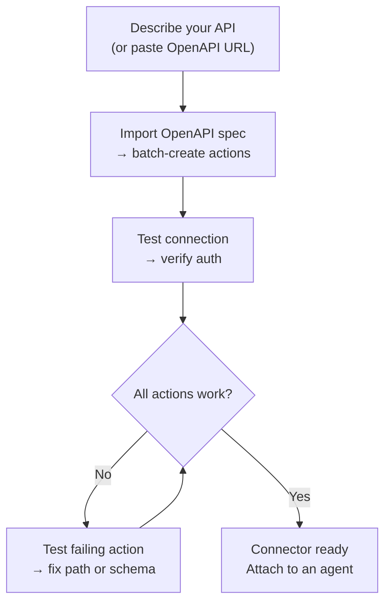
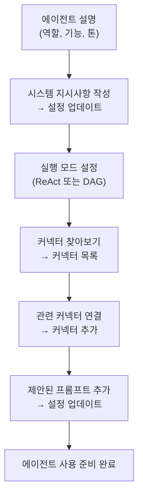

## 개요

AI Builder를 사용하면 일반 언어로 필요한 사항을 설명하고 AI 에이전트가 이를 구성하도록 할 수 있습니다. 두 가지 모드로 작동합니다:

| 모드 | 작동 방식 | 최적 용도 |
|------|-------------|---------|
| **빠른 제안** | 단일 LLM 호출이 구성을 생성합니다 | 빠른 초안 작성, 간단한 API |
| **고급 빌더** | ReAct 에이전트가 루프에서 도구를 사용하여 구축, 테스트 및 개선합니다 | 복잡한 API, OpenAPI 가져오기, 반복적 개선 |

언제든지 모드 간에 전환할 수 있습니다. 빠른 모드는 시작점을 만들고, 고급 빌더를 사용하면 반복할 수 있습니다.

---

## 커넥터 빌더

**커넥터**는 FIM One이 외부 시스템과 통신하는 방식을 정의합니다 — 기본 URL, 인증, 그리고 노출하는 특정 API 작업들입니다. 커넥터 빌더는 AI 에이전트에게 이 구성을 대신 빌드하고 관리할 수 있는 9가지 도구를 제공합니다.

### 도구

| 도구 | 기능 |
|------|-------------|
| **설정 가져오기** | 현재 커넥터 구성(URL, 인증 유형, 인증 구성) 읽기 |
| **설정 업데이트** | 커넥터 이름, 기본 URL 또는 인증 자격증명 변경 |
| **작업 나열** | 모든 기존 API 작업과 해당 메서드 및 경로 확인 |
| **작업 생성** | 새 API 엔드포인트 추가 — HTTP 메서드, 경로, 매개변수, 본문 템플릿 |
| **작업 업데이트** | 기존 작업 수정(설명, 스키마, 응답 추출) |
| **작업 삭제** | 더 이상 필요하지 않은 작업 제거 |
| **작업 테스트** | 모든 작업에 대해 라이브 HTTP 요청을 보내고 응답 검사 |
| **연결 테스트** | 기본 URL에 도달 가능한지 확인하고 자격증명이 수락되는지 확인 |
| **OpenAPI 가져오기** | Swagger 2.x 또는 OpenAPI 3.x 사양에서 최대 50개 엔드포인트 일괄 가져오기 |

### 일반적인 워크플로우

가장 일반적인 패턴: OpenAPI URL을 붙여넣고 빌더가 나머지를 처리하도록 합니다.

**예시 프롬프트:**
> "Import the OpenAPI spec from `https://api.acme.com/openapi.json`, then test the `GET /orders` endpoint with `order_id=12345`."

빌더가 스펙을 가져오고, 모든 작업을 자동으로 생성하며, 테스트 요청을 실행하고, 결과를 보고합니다 — 모두 양식을 건드릴 필요 없이 진행됩니다.

---

## 에이전트 빌더

**에이전트**는 일련의 지시사항, 도구, 그리고 (선택적으로) 커넥터를 가진 명명된 AI 페르소나입니다. 에이전트 빌더는 AI 에이전트에게 처음부터 다른 에이전트를 구성할 수 있는 6가지 도구를 제공합니다.

### 도구

| 도구 | 기능 |
|------|-------------|
| **설정 가져오기** | 현재 에이전트 구성 읽기 (지시사항, 실행 모드, 도구, 모델) |
| **설정 업데이트** | 이름, 설명, 시스템 프롬프트, 실행 모드 또는 제안된 프롬프트 변경 |
| **커넥터 나열** | 사용 가능한 모든 커넥터 탐색 (연결됨 및 미연결) |
| **커넥터 추가** | 커넥터를 연결하여 에이전트가 해당 작업을 도구로 호출할 수 있도록 함 |
| **커넥터 제거** | 커넥터 분리 (커넥터 자체는 삭제되지 않음) |
| **모델 설정** | 기본 LLM 전환 또는 온도 및 최대 토큰 조정 |

### 일반적인 워크플로우

설명으로 시작하여 빌더가 전체 에이전트를 구성하도록 합니다:

**예시 프롬프트:**
> "Finance Copilot을 만들어주세요. Acme 커넥터를 사용하여 주문 및 송장에 대한 질문에 답변해야 합니다. ReAct 모드를 사용하고 일반적인 질문을 위한 3개의 제안된 프롬프트를 추가하세요."

빌더는 현재 설정을 읽고, 시스템 프롬프트를 작성하고, 커넥터를 연결하고, 실행 모드를 설정하고, 제안된 프롬프트를 추가합니다 — 단 하나의 대화 턴에서 모두 완료합니다.

---

## 작동 방식

내부적으로 두 빌더는 일반 에이전트와 동일한 인프라를 공유합니다:

| 빌더 모드 | 메커니즘 |
|-------------|-----------|
| **빠른 제안** | 단일 LLM 추론 호출이 전체 구성을 구조화된 JSON으로 생성합니다 |
| **고급 빌더** | ReAct 에이전트 루프: 추론 → 빌더 도구 호출 → 결과 관찰 → 다음 단계 결정 |

고급 빌더는 제한된 도구 세트만 가지고 있는 완전한 ReAct 에이전트입니다 — 9개의 커넥터 또는 6개의 에이전트 빌더 도구만 있고, 웹이나 계산 도구는 없습니다. 대상 리소스의 현재 상태를 읽고, 변경해야 할 사항을 계획하고, 적절한 도구를 호출한 후, 완료를 선언하기 전에 결과를 검증합니다.

이는 고급 빌더가 모호성을 처리할 수 있다는 의미입니다: OpenAPI 가져오기가 30개의 작업을 생성하지만 5개만 관련이 있는 경우, "주문 관련 엔드포인트만 유지"라고 지시하면 나머지를 삭제합니다.
