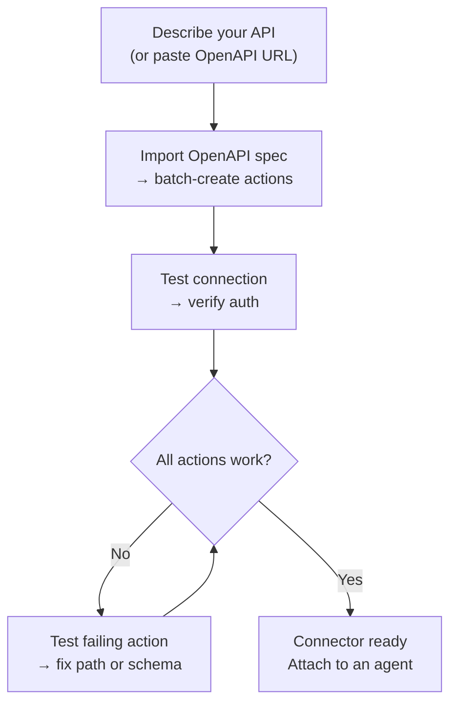
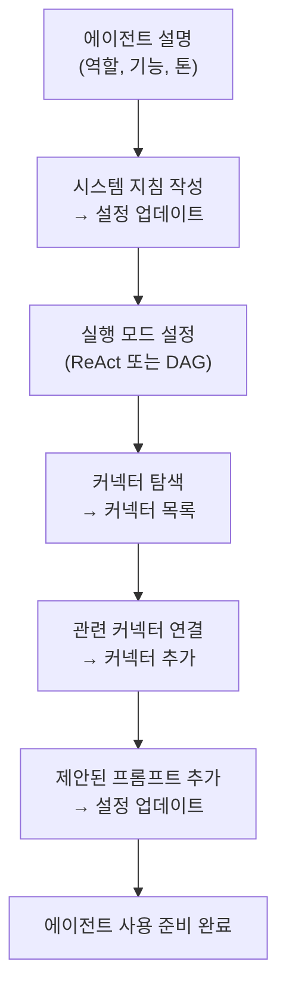

---
title: "AI Builder"
description: "AI를 사용하여 Connectors 및 Agents를 구축하세요 — 빠른 제안 또는 완전한 ReAct 빌더."
---## 개요

AI Builder를 사용하면 평문으로 필요한 것을 설명하고 AI 에이전트가 이를 구성하도록 할 수 있습니다. 두 가지 모드로 작동합니다:

| Mode | How it works | Best for |
|------|-------------|---------|
| **Quick suggestions** | A single LLM call generates the configuration | Rapid first draft, simple APIs |
| **Advanced builder** | A ReAct agent uses tools in a loop to build, test, and refine | Complex APIs, OpenAPI import, iterative refinement |

언제든지 모드 간에 전환할 수 있습니다. 빠른 모드는 시작점을 만들고, 고급 빌더를 사용하면 반복할 수 있습니다.

---## Connector Builder

**Connector**는 FIM One이 외부 시스템과 통신하는 방식을 정의합니다 — 기본 URL, 인증, 그리고 노출하는 특정 API 작업들입니다. Connector Builder는 AI agent에게 이 구성을 대신 구축하고 관리할 수 있는 9가지 도구를 제공합니다.### 도구

| 도구 | 기능 |
|------|-------------|
| **Get Settings** | 현재 커넥터 구성(URL, 인증 유형, 인증 구성) 읽기 |
| **Update Settings** | 커넥터 이름, 기본 URL 또는 인증 자격증명 변경 |
| **List Actions** | 메서드 및 경로와 함께 모든 기존 API 작업 보기 |
| **Create Action** | 새 API 엔드포인트 추가 — HTTP 메서드, 경로, 매개변수, 본문 템플릿 |
| **Update Action** | 기존 작업 수정(설명, 스키마, 응답 추출) |
| **Delete Action** | 더 이상 필요하지 않은 작업 제거 |
| **Test Action** | 모든 작업에 대해 라이브 HTTP 요청을 보내고 응답 검사 |
| **Test Connection** | 기본 URL에 도달할 수 있는지 확인하고 자격증명이 수락되는지 확인 |
| **Import OpenAPI** | Swagger 2.x 또는 OpenAPI 3.x 사양에서 최대 50개 엔드포인트 일괄 가져오기 |### 일반적인 워크플로우

가장 일반적인 패턴: OpenAPI URL을 붙여넣고 빌더가 나머지를 처리하도록 합니다.

**예시 프롬프트:**
> "Import the OpenAPI spec from `https://api.acme.com/openapi.json`, then test the `GET /orders` endpoint with `order_id=12345`."

빌더가 스펙을 가져오고, 모든 액션을 자동으로 생성하며, 테스트 요청을 실행하고, 결과를 보고합니다 — 모두 양식을 건드릴 필요 없이 진행됩니다.

---## Agent Builder

**Agent**는 일련의 지시사항, 도구, 그리고 (선택적으로) 커넥터를 가진 명명된 AI 페르소나입니다. Agent Builder는 AI 에이전트에게 처음부터 다른 에이전트를 구성할 수 있는 6가지 도구를 제공합니다.### Tools

| Tool | What it does |
|------|-------------|
| **Get Settings** | 현재 agent 설정 읽기 (instructions, execution mode, tools, model) |
| **Update Settings** | 이름, 설명, system prompt, execution mode 또는 suggested prompts 변경 |
| **List Connectors** | 사용 가능한 모든 connectors 탐색 (attached 및 unattached) |
| **Add Connector** | connector를 연결하여 agent가 해당 actions을 tools로 호출할 수 있도록 설정 |
| **Remove Connector** | connector 분리 (connector 자체는 삭제되지 않음) |
| **Set Model** | 기본 LLM 전환 또는 temperature 및 max tokens 조정 |### 일반적인 워크플로우

설명으로 시작하여 빌더가 전체 에이전트를 구성하도록 하세요:

**예시 프롬프트:**
> "Finance Copilot을 만들어주세요. Acme 커넥터를 사용하여 주문 및 송장에 대한 질문에 답변해야 합니다. ReAct 모드를 사용하고 일반적인 질문에 대한 제안된 프롬프트 3개를 추가하세요."

빌더는 현재 설정을 읽고, 시스템 프롬프트를 작성하고, 커넥터를 연결하고, 실행 모드를 설정하고, 제안된 프롬프트를 추가합니다 — 단일 대화 턴에서.

---## 작동 방식

내부적으로 두 빌더는 일반 에이전트와 동일한 인프라를 공유합니다:

| 빌더 모드 | 메커니즘 |
|-------------|-----------|
| **빠른 제안** | 단일 LLM 추론 호출이 전체 구성을 구조화된 JSON으로 생성 |
| **고급 빌더** | ReAct 에이전트 루프: 추론 → 빌더 도구 호출 → 결과 관찰 → 다음 단계 결정 |

고급 빌더는 제한된 도구 세트만 가진 완전한 ReAct 에이전트입니다 — 9개의 Connector 또는 6개의 Agent 빌더 도구만 있고, 웹이나 계산 도구는 없습니다. 대상 리소스의 현재 상태를 읽고, 변경해야 할 사항을 계획하고, 적절한 도구를 호출하고, 완료를 선언하기 전에 결과를 검증합니다.

이는 고급 빌더가 모호함을 처리할 수 있음을 의미합니다: OpenAPI 가져오기가 30개의 작업을 생성하지만 5개만 관련이 있는 경우, "주문 관련 엔드포인트만 유지"라고 지시하면 나머지를 삭제합니다.