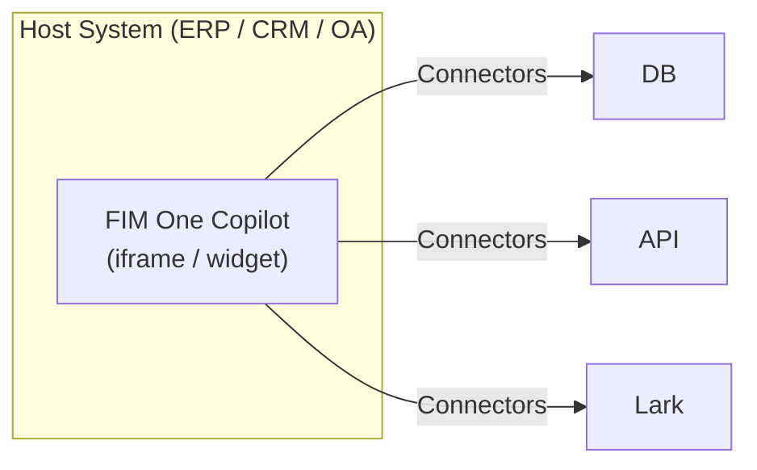
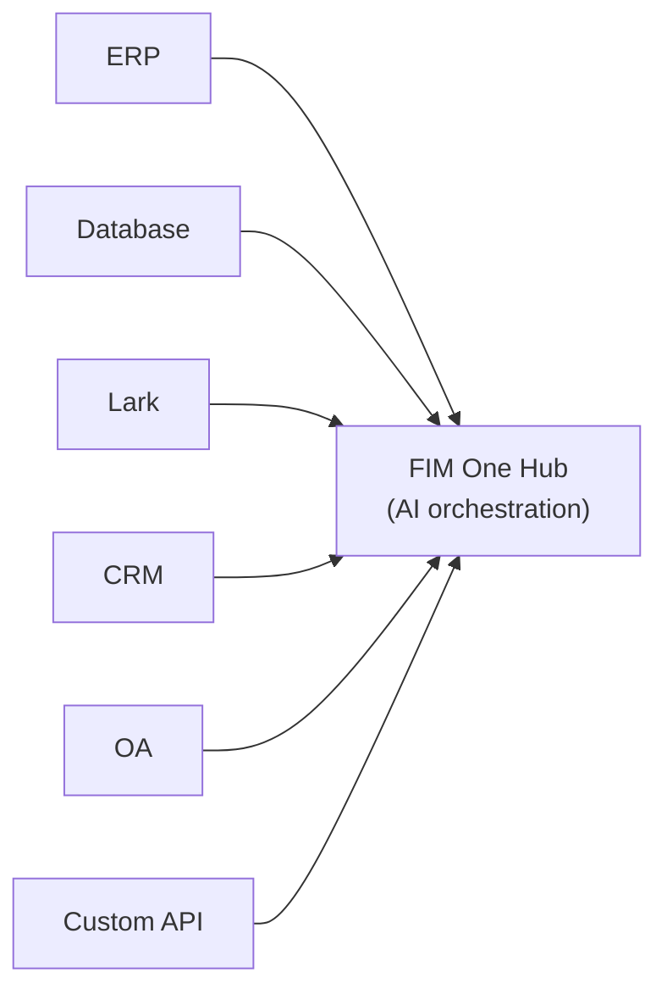
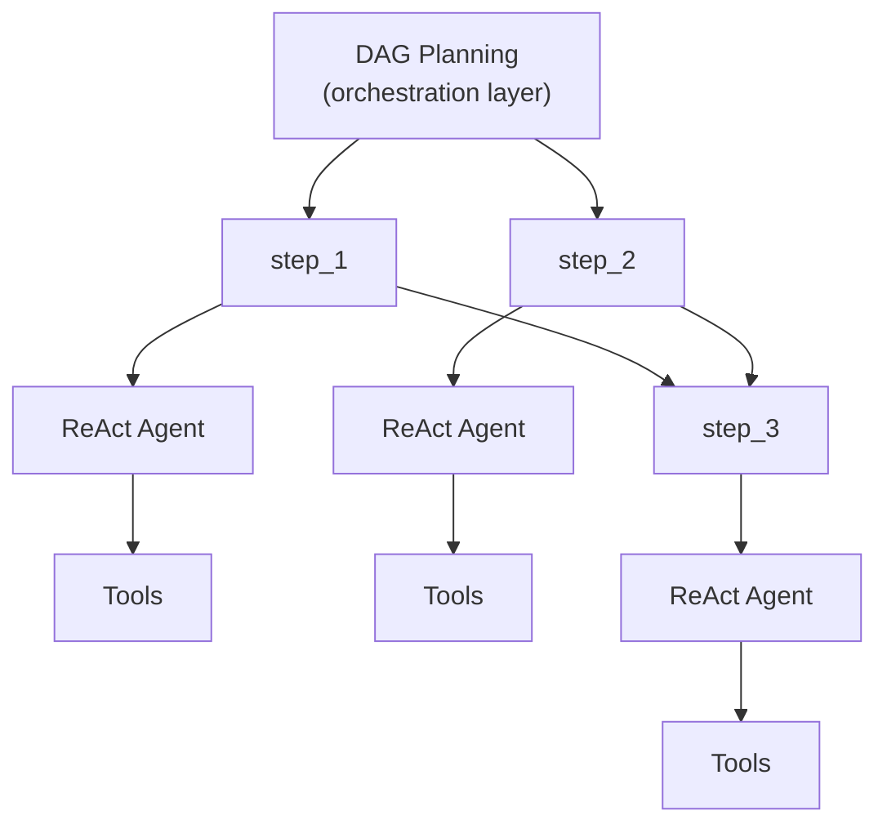

---
title: "실행 모드"
description: "Standalone, Copilot, Hub — FIM One을 배포하는 세 가지 방법."
---## 세 가지 모드

FIM One은 에이전트가 배포되고 사용되는 방식에 따라 결정되는 세 가지 모드로 작동합니다:

| 모드 | 설명 | 전달 방식 | 예시 |
|------|-----------|----------|---------|
| **Standalone** | 범용 AI 어시스턴트 | Portal | 채팅, 검색, 코드 실행, 지식 기반 Q&A |
| **Copilot** | 호스트 시스템에 내장된 AI | iframe / widget / embed | ERP 웹 UI에 내장된 "Finance Copilot" |
| **Hub** | 중앙 크로스 시스템 오케스트레이션 | Portal / API | 에이전트가 ERP를 쿼리하고, OA 승인을 확인하고, Lark를 통해 알림 |

진행 과정은 자연스럽습니다: Standalone으로 시작하여 호스트 시스템에 Copilot으로 임베드한 후, 크로스 시스템 오케스트레이션을 위해 Hub를 설정합니다. Copilot은 임베드된 상태로 계속 실행되며, Hub는 중앙 오케스트레이션 레이어를 추가합니다.## 모드 세부 정보### 독립형 (0개 커넥터)

기본 모드입니다. FIM One은 완전한 기능의 AI 어시스턴트로 작동합니다:

- 기본 제공 도구: 웹 검색, Python 실행, 계산기, 파일 작업, 셸 명령
- RAG를 포함한 지식 베이스 (PDF, DOCX, Markdown, HTML, CSV)
- 복잡한 다단계 작업을 위한 동적 DAG 계획
- DAG 시각화를 포함한 실시간 스트리밍

외부 시스템 접근이 필요하지 않습니다. 일반적인 분석, 연구 및 코드 작업에 유용합니다.### Copilot (embedded)

FIM One을 호스트 시스템의 웹 UI에 임베드합니다. 에이전트는 사용자의 익숙한 인터페이스에서 함께 작동하므로 컨텍스트 전환이 필요하지 않습니다. Copilot 모드는 여러 커넥터를 사용할 수 있습니다(예: 호스트 시스템의 DB + 알림 서비스).

예시:
- **Finance Copilot**: DB 커넥터를 통해 Kingdee (金蝶)에 연결 → 재무제표 조회, 분석 보고서 생성
- **Contract Copilot**: API 커넥터를 통해 계약 관리 시스템에 연결 → 계약 검색, 조항 추출, 위험 평가
- **HR Copilot**: API 커넥터를 통해 HR 시스템에 연결 → 직원 정보 조회, 통계 생성

에이전트는 Standalone 모드와 동일한 ReAct/DAG 엔진을 사용하지만, 이제 커넥터를 통해 실제 비즈니스 데이터에 액세스할 수 있습니다.### Hub (중앙 오케스트레이션)

Hub는 중앙 인텔리전스 계층으로 작동하는 독립형 포털(또는 API)입니다. 단일 시스템에 내장되지 않으며, 대신 모든 시스템에 연결됩니다. 사용자는 Portal UI 또는 API를 통해 액세스합니다.

예시:
- "CRM에서 연체 계약 확인, ERP 결제와 교차 참조, Lark에서 재무팀에 알림"
- "OA 승인이 완료되면 CRM에서 계약 상태 업데이트 및 감사 데이터베이스에 기록"
- "Salesforce에서 판매 데이터 쿼리, 비즈니스 DB를 사용하여 예측 생성, 경영진에게 요약 이메일 발송"

각 connector는 독립적인 브리지입니다. 하나를 추가하거나 제거해도 다른 것에는 영향을 주지 않습니다.## 전달 방법

| 전달 | 설명 | 일반적인 모드 |
|----------|-------------|-------------|
| **Portal (Web UI)** | 기본 제공 Next.js 인터페이스 | Standalone, Hub |
| **API (headless)** | HTTP/SSE 엔드포인트 (`/api/execute`, `/api/stream`) | Hub (프로그래밍 방식 액세스) |
| **iframe / Embed** | 호스트 시스템 페이지에 삽입됨 | Copilot |

전달 방법과 모드는 관련이 있지만 고정되지 않습니다. API를 통해 Hub에 액세스하거나 Portal을 통해 독립형 에이전트를 사용할 수 있습니다. 하지만 일반적인 패턴은 Hub의 경우 Portal, Copilot의 경우 embed입니다.## 실행 엔진 (내부 구현)

내부적으로 FIM One은 두 가지 실행 엔진을 제공합니다:

| 엔진 | 최적 사용 사례 | 작동 방식 |
|--------|----------|-------------|
| **ReAct** | 단일 복잡 쿼리 | Reason → Act → Observe 루프와 도구 |
| **DAG Planning** | 다단계 병렬 작업 | LLM이 종속성 그래프를 생성하고 독립적인 단계가 동시에 실행 |

ReAct는 원자 단위이고 DAG는 오케스트레이션 계층입니다. 두 엔진 모두 세 가지 모드(Standalone, Copilot, Hub)에서 작동합니다. Hub 모드에서는 단일 DAG 단계가 다양한 시스템에 대한 connector를 호출할 수 있습니다.## 왜 전통적인 워크플로우 엔진이 없는가

FIM One은 의도적으로 드래그 앤 드롭 워크플로우 편집기를 구축하지 않습니다. 이는 전략적 선택입니다:

1. **워크플로우는 이미 다른 곳에 존재합니다.** 엔터프라이즈 클라이언트의 고정된 프로세스(승인 체인, 감사 흐름)는 OA, ERP 및 레거시 시스템에 있습니다. 그들은 또 다른 워크플로우 편집기가 아니라 이러한 시스템에 연결되는 AI가 필요합니다.

2. **동적 DAG가 유연한 경우를 다룹니다.** 미리 정의되지 않은 작업의 경우 LLM이 생성한 DAG는 런타임에 적응합니다 — 인간의 사전 설계가 필요하지 않습니다.

3. **기존 기능이 고정 파이프라인으로 구성됩니다.** 예약된 작업(계획됨)은 고정 프롬프트를 가진 DAG 에이전트를 트리거합니다. DAG는 단계를 계획합니다. Connector는 대상 시스템으로 연결합니다. 이 조합은 정적 파이프라인과 같습니다 — 하지만 더 유연합니다. LLM이 발견한 데이터를 기반으로 계획을 조정하기 때문입니다.

4. **Connector = API 호출.** 복잡한 워크플로우 작업(전송, 거부, 에스컬레이션)은 대상 시스템의 책임입니다. Connector의 관점에서 각 작업은 단지 매개변수가 있는 HTTP 요청입니다. FIM One은 API를 호출합니다. 대상 시스템이 상태 머신을 관리합니다.