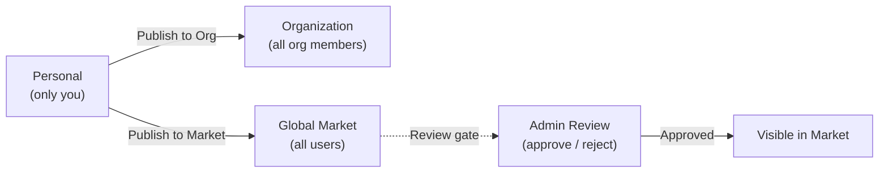

마켓은 FIM One의 내장 리소스 마켓플레이스입니다. 공유 리소스를 두 가지 계층으로 구성합니다:

- **Solutions** -- 엔드투엔드 기능을 제공하는 고수준 리소스: 에이전트, 스킬, 워크플로우.
- **Components** -- 솔루션이 의존하는 구성 요소: 커넥터 및 MCP 서버.

조직 또는 글로벌 마켓의 범위별로 탐색하고, 필요한 것을 찾고, 구독한 후 시작할 수 있습니다 -- 모두 FIM One을 떠나지 않고도 가능합니다.

<Info>
마켓은 **풀 모델**을 사용합니다: 리소스는 탐색을 통해 발견되고 명시적으로 구독됩니다. 자동 가입이나 푸시 메커니즘은 없습니다 -- 설치할 항목을 선택하고, 언제든지 범위별로 필터링할 수 있습니다.
</Info>

## 무엇을 찾을 수 있나요?

### 솔루션

솔루션은 구독하여 즉시 사용할 수 있는 완전하고 준비된 기능입니다.

| 리소스 | 카테고리 | 제공 내용 |
|---|---|---|
| **에이전트** | 솔루션 | 바인딩된 도구와 지식을 갖춘 전문 AI 어시스턴트 |
| **스킬** | 솔루션 | 시스템 프롬프트에 주입되는 글로벌 SOP, 에이전트를 오케스트레이션할 수 있음 |
| **워크플로우** | 솔루션 | 예약되거나 트리거된 실행을 위한 DAG 자동화 흐름 |

### 컴포넌트

컴포넌트는 솔루션을 구성하는 통합 및 도구 서비스입니다.

| 리소스 | 카테고리 | 제공 내용 |
|---|---|---|
| **커넥터** | 컴포넌트 | 에이전트 도구로 사용 가능한 API/데이터베이스 통합 |
| **MCP 서버** | 컴포넌트 | 세션에 로드되는 타사 도구 서비스 |

<Tip>
지식 베이스는 마켓에 독립적으로 나열되지 않습니다. 이를 사용하는 솔루션을 구독할 때 내부 종속성으로 포함됩니다.
</Tip>

## 범위

마켓의 페이지 상단에는 범위 선택기가 있습니다. 두 범위 모두에서 UI와 구독 흐름은 동일하며, 리소스의 가시성만 변경됩니다.

- **조직** -- 팀이나 회사 내에서 공유되는 리소스입니다. 여기에 게시하는 것은 검토가 필요하지 않습니다.
- **글로벌 마켓** -- 전체 FIM One 커뮤니티의 리소스입니다. 여기에 게시하려면 관리자 승인이 필요합니다.

언제든지 범위 간에 전환하여 사용 가능한 항목을 탐색할 수 있습니다.

## 어떻게 구독하나요?

원하는 리소스를 찾으면 **구독**을 클릭하세요. 온보딩 마법사가 필요한 설정(예: 커넥터의 API 자격증명 입력)을 안내합니다. 마법사를 건너뛰고 나중에 자격증명을 구성할 수도 있습니다.

구독 후:

- **에이전트**는 에이전트 선택기와 `call_agent` 카탈로그에 나타납니다.
- **스킬**은 시스템 프롬프트에 자동으로 주입됩니다.
- **워크플로우**는 워크플로우 목록에 나타나며 실행할 준비가 됩니다.
- **커넥터**는 도구 집합과 에이전트 바인딩 드롭다운에 나타납니다.
- **MCP 서버**는 도구를 세션에 로드합니다.

솔루션이 컴포넌트에 종속된 경우(예: 특정 커넥터를 사용하는 에이전트), 이러한 종속성은 구독 중에 자동으로 해결됩니다. 필요한 자격증명을 입력하라는 메시지가 표시됩니다.

구독은 즉시 이루어지며 게시자의 승인이 필요하지 않습니다. 언제든지 구독을 취소하여 워크스페이스에서 리소스를 제거할 수 있습니다.

## 어떻게 게시하나요?

모든 리소스 소유자는 리소스를 검색 가능하도록 게시할 수 있습니다. 게시는 조직 또는 글로벌 마켓을 대상으로 할 수 있습니다.

| 대상 | 누가 볼 수 있는가 | 검토 필요? |
|---|---|---|
| **조직** | 조직의 모든 구성원 | 아니오 (조직 수준 신뢰) |
| **글로벌 마켓** | 모든 인증된 사용자 | 예 -- 관리자 승인 필요 |

글로벌 마켓에 게시하는 것은 항상 검토 게이트를 거칩니다. 관리자는 리소스를 승인하거나, 거부(메모 포함)하거나, 보류 상태로 둘 수 있습니다. 거부된 리소스는 수정하여 다시 제출할 수 있습니다.

## 자격 증명은 어떻게 되나요?

자격 증명이 필요한 리소스(API 키, OAuth 토큰, 데이터베이스 암호)를 구독할 때, 온보딩 마법사가 구독 중에 자격 증명을 수집합니다. 자격 증명은 안전하게 저장되며 계정에 범위가 지정됩니다 -- 다른 사람은 볼 수 없습니다.

리소스의 설정 페이지에서 언제든지 자격 증명을 업데이트하거나 회전할 수 있습니다.

## 통합 방식

내부적으로 Market은 **섀도우 조직**으로 구현됩니다 -- 멤버가 없는 보이지 않는 시스템 조직입니다. Global Market에 게시된 리소스는 이 섀도우 조직 내에서 `visibility: "org"`로 설정되어 있으며, 이를 통해 기존 가시성 시스템이 자연스럽게 이들을 포함할 수 있습니다.

이는 Market이 도구 어셈블리 파이프라인에서 **특수한 경우의 코드가 전혀 필요 없음**을 의미합니다. 개인 및 조직 리소스를 로드하는 동일한 3계층 가시성 필터(own -> org-shared -> subscribed)가 Market 리소스도 로드합니다. 구독하면 구독 기록이 생성되고 리소스가 가시성 필터에 자동으로 나타납니다.

종속성을 번들로 제공하는 솔루션(예: 바인딩된 커넥터 및 지식 베이스가 있는 에이전트)의 경우, 구독 프로세스가 해당 종속성을 해결하고 프로비저닝하여 모든 것이 즉시 작동합니다.

모든 리소스 유형에 걸친 가시성 필터 작동 방식에 대한 기술 세부 정보는 [에이전트 및 리소스 검색 -- 가시성 모델](/architecture/agent-discovery#visibility-model)을 참조하세요.
