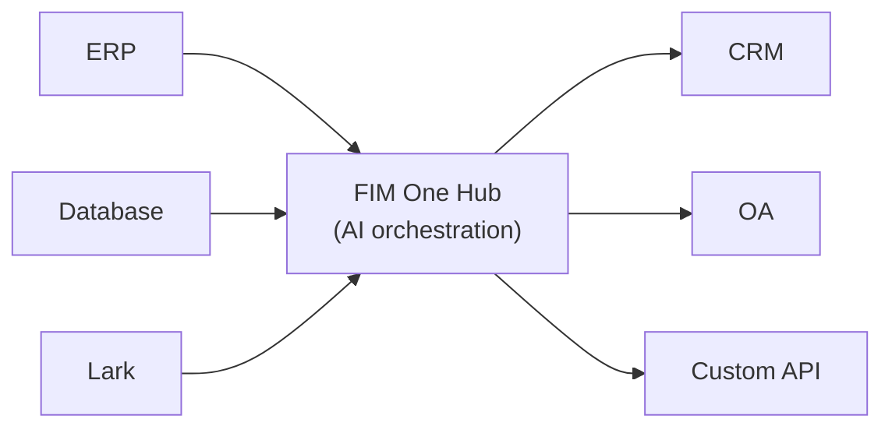

<Frame>
  
</Frame>

FIM One에 오신 것을 환영합니다. FIM One은 엔터프라이즈 시스템 전반에서 복잡한 작업을 동적으로 계획하고 실행하는 에이전트를 구축하기 위한 AI 기반 프레임워크입니다.

  <a href="https://one.fim.ai/">웹사이트</a> · <a href="https://github.com/fim-ai/fim-one">GitHub</a> · <a href="https://discord.gg/z64czxdC7z">Discord</a> · <a href="https://x.com/FIM_One">Twitter</a>

<Tip>
  **☁️ 클라우드에서 FIM One 시도해보세요 — 설정이 필요 없습니다.**
  관리형 버전이 [**cloud.fim.ai**](https://cloud.fim.ai/)에서 실행 중입니다: Docker 없음, API 키 없음, 로그인하고 시스템 연결을 시작하세요. _얼리 액세스 — 피드백을 환영합니다._
</Tip>

## FIM One란 무엇인가요?

FIM One은 기존 시스템과 함께 작동하는 AI 에이전트를 구축하기 위한 공급자 중립적인 Python 프레임워크입니다. 로직을 복제하도록 요구하는 워크플로우 빌더와 달리, FIM One은 데이터베이스 읽기, API 호출, 알림 푸시 등을 모두 통합된 AI 인터페이스를 통해 사전에 시스템을 연결합니다.

핵심 통찰력: **세 가지 전달 모드, 하나의 에이전트 코어**.

## 세 가지 배포 모드

| 모드 | 설명 | 배포 방식 | 사용 사례 |
|------|-----------|----------|----------|
| **Standalone** | 범용 AI 어시스턴트 — 검색, 코드, 지식 베이스 | Portal | 채팅, 코드 실행, 지식 베이스 Q&A |
| **Copilot** | 호스트 시스템에 내장된 AI — 사용자의 기존 UI에서 함께 작동 | iframe / widget / embed | ERP 웹 UI의 "Finance Copilot" |
| **Hub** | 중앙 집중식 크로스 시스템 오케스트레이션 — 모든 시스템 연결 | Portal / API | 에이전트가 ERP를 조회하고, OA를 확인하고, Lark를 통해 알림 |

## Hub 아키텍처

Hub는 핵심 차별화 요소입니다 — 모든 시스템이 AI와 만나는 중앙 포털입니다:

각 커넥터는 표준화된 브리지입니다. 에이전트는 SAP와 통신하는지 또는 커스텀 PostgreSQL 데이터베이스와 통신하는지 알거나 신경 쓰지 않습니다. 데이터는 시스템에 유지되며, FIM One은 이들을 오케스트레이션하는 AI 계층을 제공합니다.

## 시작하기

다음 섹션을 살펴보고 FIM One의 아키텍처를 이해하고 배포하세요:

- **[빠른 시작](/quickstart)** — Docker 또는 로컬 개발으로 몇 분 안에 FIM One 실행하기
- **[실행 모드](/concepts/execution-modes)** — Standalone, Copilot, Hub 모드를 깊이 있게 이해하기
- **[AI Builder](/concepts/ai-builder)** — 자연어로 커넥터와 에이전트를 구축하기 위해 AI 사용하기
- **[커넥터 아키텍처](/architecture/connector-architecture)** — FIM One이 AI를 통해 레거시 시스템을 연결하는 방법
- **[철학](/architecture/philosophy)** — 동적 계획이 경직된 워크플로우와 완전히 자율적인 에이전트 사이의 올바른 중간 지점인 이유
