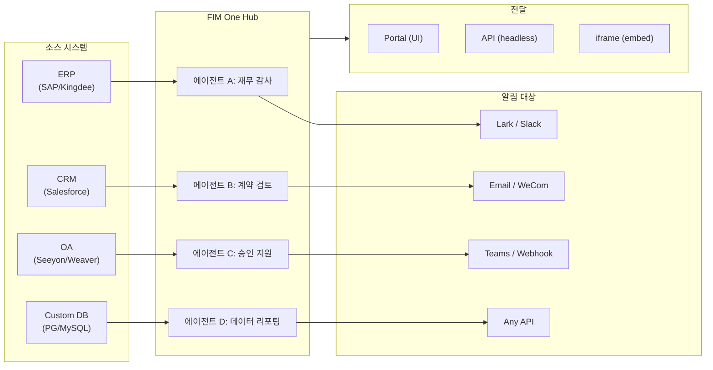

> 목표: **AI 기반 커넥터 허브** 구축 — 독립형(포털 어시스턴트), 코파일럿(호스트 시스템에 임베드됨), 허브(중앙 크로스 시스템 오케스트레이션).
>
> 원칙: **공급자 중립적**(벤더 종속성 없음), **최소 추상화**, **프로토콜 우선**, **커넥터 우선**(통합이 핵심 가치).

## 제품 비전

FIM One은 **AI 커넥터 허브**로서 세 가지 점진적 모드를 제공합니다:

```
Standalone   → 자신의 AI 어시스턴트 (Portal)
Copilot      → 호스트 시스템에 내장된 AI (iframe / widget / embed)
Hub          → 중앙 집중식 크로스 시스템 오케스트레이션 (Portal / API)
```

**Hub 모드가 핵심 차별화 요소입니다.** 엔터프라이즈 클라이언트는 ERP, CRM, OA, 재무, HR 등의 레거시 시스템을 보유하고 있으며, 이들이 AI를 통해 서로 통신해야 합니다:



**GTM 경로: Land and Expand**

| 단계 | 모드 | 진행 상황 |
|------|------|-------------|
| Land | Copilot | 한 시스템에 내장하여 UI 내에서 가치 입증 |
| Expand | Copilot → Hub | 더 많은 시스템으로 확대; Hub가 이들을 통합 |

## 배포된 버전

### v0.1 (2026-02-22) — MVP: ReAct + DAG Planner
- ReActAgent with tools (calculator, python_exec, web_search)
- DAG Planner (LLM generates dependency graphs)
- Portal UI with streaming + KaTeX

### v0.2 (2026-02-24) — 다중 모델 + 메모리
- 재시도 / 속도 제한 / 사용량 추적
- 네이티브 함수 호출 (JSON 전용 파싱 없음)
- 다중 모델 지원 (빠른 + 메인 LLM)
- 메모리: WindowMemory, SummaryMemory
- SSE 스트리밍을 포함한 FastAPI 백엔드

### v0.3 (2026-02-25) — Web Tools + MCP
- Web tools (web_search, web_fetch) via Jina/Tavily/Brave
- File operations tool
- MCP client (standard tool integration)
- Tool auto-discovery + categories
- DAG visualization with click-to-scroll
- Code exec in Docker (`--network=none`)

### v0.4 (2026-02-25) — 다중 턴 + 에이전트
- 다중 턴 대화 (DbMemory)
- 도구 단계 접기 UI
- HTTP 요청 + 셸 실행 도구
- 에이전트 관리 (생성, 구성, 게시)
- JWT 인증
- 에이전트별 실행 모드 + 온도 제어

### v0.5 (2026-02-28) — 전체 RAG + 기반 생성
- 전체 RAG 파이프라인 (임베딩 + 벡터 저장소 + FTS + RRF + 리랭커)
- 기반 생성 (인용, 충돌 감지, 신뢰도 점수)
- 지식 기반 문서 관리 (CRUD, 검색, 재시도, 스키마 마이그레이션)
- ContextGuard + 고정 메시지 (토큰 예산 관리자)
- DbMemory 지속성 + LLM Compact
- DAG 재계획 (최대 3라운드)

### v0.6 (2026-03-01) — 커넥터 플랫폼
- **커넥터 CRUD**: 생성, 읽기, 업데이트, 삭제
- **ConnectorToolAdapter**: 커넥터를 BaseTool로 변환
- **사용자별 자격증명**: AES-GCM 암호화
- **확인 게이트**: 쓰기 작업 승인
- **감사 로깅**: 모든 도구 호출 기록
- **서킷 브레이커**: 장애 시 우아한 성능 저하
- **유틸리티 도구**: email_send, json_transform, template_render, text_utils
- **임베딩 옵션**: Jina, OpenAI, 커스텀 제공자

### v0.7 (2026-03-06) — 관리자 플랫폼 + 멀티테넌트
- **관리자 플랫폼**: 사용자 관리, 역할 전환, 비밀번호 재설정, 계정 활성화/비활성화
- **초대 전용 등록**: 3가지 모드(공개/초대/비활성화) + 초대 코드 CRUD
- **스토리지 관리**: 사용자별 디스크 사용량, 삭제, 고아 정리
- **대화 중재**: 관리자 목록/모두 삭제
- **사용자별 강제 로그아웃**: 모든 토큰 취소
- **API 상태 대시보드**: 시스템 통계, 커넥터 메트릭
- **첫 실행 설정 마법사**: 안내식 관리자 계정 생성
- **개인 센터**: 사용자별 전역 지침, 언어 선호도
- **JWT 인증**: 토큰 기반 SSE 인증, 대화 소유권
- **전역 MCP 서버**: 관리자 프로비저닝, 모든 세션에서 로드
- **하위 호환성**: registration_enabled → registration_mode 자동 마이그레이션

### v0.7.x (2026-03-07 to 2026-03-12) — 안정성 + 폴리시
- 초대 코드 관리
- 사용자별 할당량 (429 적용)
- 구조화된 감사 로깅
- 민감한 단어 필터링
- 관리자 로그인 기록
- 관리자 파일 브라우저
- 향상된 관리자 보기 (model_name, tools, kb_ids 필드)
- Docker Compose 배포 (단일 이미지, 명명된 볼륨)
- OAuth 자동 감지 (window.location에서)
- 확장 사고 / 추론 지원 (`LLM_REASONING_EFFORT`, `LLM_REASONING_BUDGET_TOKENS`) - OpenAI o-series, Gemini 2.5+, Claude
- 관리자 도구별 활성화/비활성화 (비활성화된 도구는 런타임에 채팅에서 제외)
- MCP 서버 관리를 커넥터 페이지로 이동
- 이중 데이터베이스 지원: SQLite (제로 설정 기본값) + PostgreSQL (프로덕션); Docker Compose는 PostgreSQL 자동 프로비저닝
- 모델 구성 문서 페이지 (공급자별 확장 사고 설정 포함)
- SSE Protocol v2: `delta_reasoning`, `usage` 필드 및 분할된 `done`/`suggestions`/`title`/`end` 이벤트를 포함한 실시간 답변 스트리밍; SQLite 풀 크기 5 -> 20
- AI Builder 확장: 7개의 새로운 빌더 도구 (GetSettings, TestConnection, ImportOpenAPI for connectors; ListConnectors, AddConnector, RemoveConnector, SetModel for agents), 에이전트의 `is_builder` 플래그, 빌더 프롬프트 자동 새로고침, SSRF 가드
- SSE v2 프론트엔드: 스트리밍 점 펄스 커서, 축소 가능한 카드로 DAG 재계획 라운드 스냅샷, DAG 레이아웃을 단계 상태에서 분리
- AI Builder 개념 문서 페이지 (커넥터 및 에이전트 빌더 가이드 포함)
- 조직 시스템: 역할 기반 멤버십 (소유자/관리자/멤버)을 포함한 전체 CRUD, 관리자 관리 UI
- 에이전트, 커넥터, 지식 기반, MCP 서버에 대한 3계층 리소스 가시성 (개인/조직/전역)
- 모든 리소스 유형에 대한 게시/게시 취소 API; 게시된 에이전트에 대한 소유자 위임
- 관리자 설정-가시성 엔드포인트 (클론-투-글로벌 대체); 통합 `build_visibility_filter()` 쿼리 헬퍼
- 데이터베이스 커넥터 (Phase 1-3): PG/MySQL/Oracle/SQL Server + 중국 레거시 DB에 대한 직접 SQL 액세스; 스키마 내부 검사, AI 주석, 읽기 전용 쿼리 실행, 암호화된 자격 증명, 커넥터당 3개 도구 (`list_tables`, `describe_table`, `query`)
- **평가 센터**: 정량적 에이전트 품질 벤치마킹 — 테스트 데이터셋 CRUD (프롬프트 + 예상 동작 + 어설션), 평가 실행 (병렬 실행 + LLM 채점자 + 사례별 통과/실패/지연/토큰 결과), 자동 폴링을 포함한 결과 뷰어; 마이그레이션 `r8t0v2x4z567`
- 3가지 모델 역할 (General/Fast/Reasoning) (계층별 env 구성 격리 포함); 빠른 모델은 더 이상 주 모델 설정을 상속하지 않음
- 구조화된 데이터 및 아티팩트 전달을 위한 일반 문자열 단계 결과를 대체하는 `StepOutput` 데이터클래스
- DAG 실행을 위한 도구 캐시 — 비동기 잠금 스탬피드 방지를 포함한 실행별 동일 도구 호출 캐시 (`DAG_TOOL_CACHE`)
- 실패 시 1회 재시도를 포함한 단계별 LLM 검증 (`DAG_STEP_VERIFICATION`)
- 자동 라우팅: 빠른 LLM이 쿼리를 ReAct 또는 DAG로 분류; `/api/auto` 엔드포인트; 프론트엔드 3방향 모드 토글 (`AUTO_ROUTING`)
- [x] ~~**플랫폼 조직 + 리소스 구독**~~: 기본 제공 플랫폼 조직이 모든 사용자 자동 참여; 공유 리소스 구독을 위한 Market API; 리소스 구독 테이블; 전역 가시성을 대체하는 조직 기반 리소스 공유
- [x] ~~**에이전트 자동 발견 및 하위 에이전트 바인딩**~~: 에이전트의 `discoverable` 플래그; `sub_agent_ids` 화이트리스트; 전문가 에이전트에 작업을 위임하기 위한 CallAgentTool
- [x] ~~**MCP 서버 자격 증명 + 사용자별 재정의**~~: `mcp_server_credentials` 테이블; `PUT /api/mcp-servers/{id}/my-credentials` 엔드포인트; 자격 증명 폴백 동작을 위한 `allow_fallback` 플래그
- [x] ~~**커넥터/KB 토글**~~: 리소스 일시 중단/재개를 위한 `POST /api/connectors/{id}/toggle` 및 `POST /api/knowledge-bases/{id}/toggle`
- [x] ~~**독립형 KB 대화**~~: 에이전트 바인딩 없이 직접 KB 채팅을 위한 대화의 `kb_ids` 필드

## 계획된 버전

### v0.8 — 커넥터 선언형 설정 + 점진적 공개

**목표**: Python 코드 작성 없이 커넥터를 더 쉽게 정의하고, LLM에 도구와 지시사항이 노출되는 방식을 최적화합니다.

- [x] ~~**데이터베이스 커넥터**: 직접 SQL 접근 (PostgreSQL, MySQL, Oracle)~~ *(v0.7.x에서 출시 — Phase 1-3)*
- [x] ~~**RBAC**: 사용자/역할별 커넥터 접근 제어~~ *(v0.7.x에서 출시 — 조직 시스템 + 3단계 가시성)*
- [x] **커넥터 자격증명 암호화 + 사용자별 재정의**: `connector_credentials` 테이블, `CREDENTIAL_ENCRYPTION_KEY`를 통한 Fernet 암호화, `allow_fallback` 플래그, `GET/PUT/DELETE /my-credentials` 엔드포인트, 채팅 도구 로딩 시 사용자별 자격증명 해석
- [x] **게시 검토 UI**: 조직 수준 게시 검토 시스템 — 조직별 검토 토글, 승인/거부 워크플로우가 있는 ReviewsSheet, 리소스 카드의 상태 배지, 게시 대화상자의 검토 공지, 거부된 리소스 재제출
- [ ] **커넥터 점진적 공개 (Phase 1-2)**: 단일 `ConnectorMetaTool`이 작업별 도구를 대체; 시스템 프롬프트는 경량 **스텁**만 수신 (이름 + 1줄 설명, 커넥터당 ~30 토큰 vs 작업당 ~250 토큰); 에이전트가 `discover(connector)`를 호출하여 필요 시 전체 작업 스키마 로드 — 스키마는 모델이 커넥터를 선택할 때만 로드되어 캐싱을 위해 프롬프트 접두사를 안정적으로 유지합니다. Claude Code의 `defer_loading: true` 내부 패턴을 반영합니다. `execute` 서브명령; 하위 호환성을 위한 기능 플래그.
- [x] ~~**에이전트 스킬 시스템 + 컴팩트 지시사항**: 에이전트 지시사항을 위한 온디맨드 스킬 로딩 — `Skill` 모델 (이름, 콘텐츠/SOP, 선택적 스크립트)이 에이전트에 첨부; 시스템 프롬프트에서 이름으로만 참조 (~스킬당 10 토큰); 에이전트가 `read_skill(name)`을 호출하여 필요 시 전체 콘텐츠 로드합니다. 대화당 지시사항 토큰 비용을 ~80% 감소시키면서 더 풍부한 SOP 라이브러리를 허용합니다. ConnectorMetaTool의 점진적 공개를 지시사항 수준에 적용한 대응물입니다. "지시사항 + 도구 + 스킬" 차별화 스토리를 활성화합니다. 또한 Agent 모델에 `compact_instructions` 필드를 추가 — 컴팩팅 시 `ContextGuard`에 주입된 에이전트별 압축 우선순위 목록 (예: "주문 ID와 금액 보존, 원본 API 응답 삭제"), 현재 정적 일반 프롬프트를 대체합니다. Claude Code의 Compact Instructions 패턴에서 영감을 받았습니다.~~
- [ ] **YAML/JSON 커넥터 설정**: 플랫폼이 자동으로 MCP 서버 생성
- [ ] **커넥터 가져오기/내보내기**: 커넥터 템플릿 공유
- [ ] **커넥터 포크**: 기존 커넥터 복제 + 커스터마이징
- [ ] **데이터베이스 커넥터 Phase 4**: 엔터프라이즈 드라이버 — Oracle (`oracledb`), SQL Server (`aioodbc`), 达梦 DM8 (`aioodbc` + DM ODBC), 南大通用 GBase (`aioodbc` + GBase ODBC)
- [ ] **메시지 푸시**: Lark, WeCom, Slack, Email 알림 작업
- [x] **워크플로우 블루프린트 시스템**: 다단계 자동화 블루프린트를 설계하고 실행하기 위한 시각적 워크플로우 편집기 — `Workflow` / `WorkflowRun` ORM 모델, 전체 CRUD + SSE 실행 API, 가져오기/내보내기, 복제, 블루프린트 검증 엔드포인트, 위상 정렬 + 세마포어 기반 동시성 + 조건 분기 및 12개 노드 유형 (Start, End, LLM, ConditionBranch, QuestionClassifier, Agent, KnowledgeRetrieval, Connector, HTTPRequest, VariableAssign, TemplateTransform, CodeExecution)을 가진 `WorkflowEngine`, `{{node_id.output}}` 보간 및 `env.*` 네임스페이스가 있는 `VariableStore`, 노드별 오류 전략 (STOP_WORKFLOW / CONTINUE / FAIL_BRANCH)과 노드별 타임아웃 및 고급 설정 UI, React Flow v12 시각적 편집기 (드래그 앤 드롭 팔레트 + 노드 설정 패널 + 변수 선택기 콤보박스 + 엣지에 노드 추가 + 자동 레이아웃 (ELK.js) + 실행 기록 시트), Dify 스타일 컴팩트 노드 설계 (링 기반 실행 상태 스타일링 및 애니메이션 엣지 전환), 4개 기본 제공 시작 템플릿 (Simple LLM Chain, Conditional Router, Knowledge-Augmented QA, HTTP API Pipeline) (템플릿 선택기 대화상자 및 `GET /templates` + `POST /from-template` API 포함), 통계 엔드포인트, `?run=true` URL 파라미터 자동 열기, 서브프로세스 기반 코드 실행 보안, 105개 테스트 스위트 (템플릿, eval 네임스페이스 평탄화, 블루프린트 검증 경고, 노드/엣지 삭제, 가져오기/내보내기/복제, 교착 상태 감지, 다중 조건 분기)
- [x] **작업 감사**: 누가 무엇을 했는지에 대한 상세 로깅 — 관리자 검토 로그 감사 탭 추가 (조직/리소스별 게시 검토 추적)
- [ ] **의미론적 스키마 주석**: 커넥터 스키마 필드를 `semantic_tag`, `description`, 및 `pii` 플래그로 확장; 주석이 LLM 도구 설명에 표시되어 에이전트가 열 이름에서 추측하지 않고도 필드 의도를 이해합니다.

**영향**: 구현 엔지니어 (Python 불필요)는 1-2시간 내에 커넥터를 추가할 수 있습니다. 도구 정의 및 에이전트 지시사항의 토큰 비용은 규모에 따라 ~80–93% 감소합니다.

### v0.9 — 관찰성 + 프로덕션 강화

**목표**: 프로덕션 등급 운영, 디버깅 및 모니터링. **Hook System**을 도입합니다 — 에이전트 지시사항 아래에 위치하며 LLM에 의해 재정의될 수 없는 결정론적 강제 계층입니다.

- [ ] **Connector 점진적 공개 (Phase 3-4)**: 통합 `ConnectorExecutor` 인터페이스 (API/DB/MCP를 하나의 추상화 뒤에); `jsonschema`를 사용한 작업 매개변수 검증; 프로토콜 불가지론적 discover/execute
- [ ] **Agent Trace Layer (Observability++)**: 에이전트 디버깅을 위한 애플리케이션 수준 run/trace/thread 계층 — 각 대화 → `Trace`, 각 LLM 호출 / 도구 호출 / DAG 단계 → 입력/출력/토큰/타이밍이 포함된 `Span`. 타임라인과 확장 가능한 LLM 호출 페이로드가 있는 프론트엔드 trace 뷰어. 이는 OTel (인프라 수준)을 넘어 개발자와 엔터프라이즈 클라이언트를 위한 실행 가능한 에이전트 루프 디버깅을 제공합니다. OpenTelemetry 내보내기를 데이터 싱크 옵션으로 제공합니다. LangSmith의 run/trace/thread 개념을 모델로 합니다 — 에이전트 관찰성을 위한 업계 검증 패턴입니다.
- [ ] **Metrics 대시보드**: 지연시간, 성공률, 토큰 사용량, 커넥터 호출 분석 — 에이전트별, 사용자별, 조직별 분석
- [ ] **Circuit breaker**: 지수 백오프, 실패 감지
- [ ] **Agent Hook System**: **LLM 루프 외부**에서 실행되는 결정론적 강제 계층 — 훅은 도구 이벤트에서 자동으로 실행되며 에이전트 지시사항으로 우회될 수 없습니다. 세 가지 훅 포인트: `PreToolUse` (실행 전 검증 / 차단), `PostToolUse` (실행 후 부작용), `SessionStart` (동적 컨텍스트 주입). 내장 훅: 모든 커넥터 호출에서 자동으로 `ConnectorCallLog` 작성 (현재는 수동); 조직이 읽기 전용 모드일 때 쓰기 작업 차단; 에이전트에 도달하기 전에 과도한 DB 쿼리 결과 자동 자르기; 커넥터별 호출 빈도 제한. 사용자 정의 훅: 에이전트별 YAML 구성 (`hooks:` 필드)으로 일치하는 도구 이벤트에서 트리거되는 셸 명령 또는 Python 호출 가능 선언 — Claude Code의 훅과 동일한 패턴. 핵심 설계 원칙: **훅은 LLM이 기억하는 것에 의존해서는 안 되는 "항상 발생해야 하는" 로직을 위한 것입니다**. 지시사항에서 "모든 호출 기록"; 훅이 실제로 기록합니다. 지시사항에서 "읽기 전용 모드에서 쓰지 마세요"; 훅이 실제로 차단합니다.
- [ ] **Agent Workspace (Tool Output Offloading + Handoff)**: MCP / 커넥터 / DB 도구 응답이 임계값 (기본값: 8K 문자)을 초과할 때, 전체 출력을 대화별 워크스페이스 파일 (`workspace://tool_result_xxx.txt`)에 자동 저장하고 에이전트에 잘린 미리보기 + 파일 URI를 반환합니다. 세 가지 새로운 내장 도구: 선택적 액세스를 위한 `read_workspace_file(path, start_line, end_line)`, 검색을 위한 `list_workspace_files()`, 컨텍스트 전환을 위한 `write_handoff(summary)` — 에이전트는 컨텍스트 압축 또는 세션 전환 전에 구조화된 HANDOFF 노트 (진행 상황, 작동한 것, 실패한 것, 다음 단계)를 작성합니다; 다음 에이전트 인스턴스는 압축 알고리즘의 요약 품질에 의존하는 대신 이를 읽습니다. Claude Code의 워크스페이스 + handoff 패턴을 반영합니다. 큰 결과 집합에 대한 주의 분산을 방지하고 자르기로 인한 자동 데이터 손실을 제거합니다. 최소 변경: `MCPToolAdapter` 및 `ConnectorToolAdapter`에서 `truncate_tool_output()`을 확장하여 워크스페이스 저장소에 쓰기
- [ ] **Sandbox 강화**: v2 코드 실행 격리 개선
- [ ] **Performance 테스트**: 동시 로드 벤치마크
- [ ] **MCP Connection Pooling**: 요청별 STDIO 서브프로세스 생성은 확장되지 않습니다 — 100명의 동시 사용자 = MCP 서버당 100개의 서브프로세스. STDIO 연결을 사용자별 환경 격리로 풀링 (`(server_id, env_hash)`로 키 지정); SSE/HTTP 전송은 `httpx.AsyncClient` 세션을 공유합니다. 목표: 풀링된 STDIO의 100ms 미만 웜 스타트, 사용자 수에 관계없이 MCP 서버당 O(1) HTTP 연결
- [ ] **Scheduled jobs + Event-triggered Agents (Loop)**: cron 유사 백그라운드 작업 트리거; `scheduled_jobs` + `job_runs` DB 테이블; APScheduler 통합; job CRUD API + job 히스토리 UI; 메시지 푸시 커넥터를 통한 결과 알림. 범위는 시간 트리거 (cron) 및 이벤트 트리거 (webhook 인바운드) 패턴을 모두 포함합니다 — 백그라운드에서 비동기적으로 실행되는 에이전트는 Hub 모드의 비동기 서브 에이전트 사용 사례입니다.
- [ ] **DB Schema Advanced Builder**: 대규모 데이터베이스를 위한 AI 기반 스키마 관리 에이전트 — 전략적 테이블 주석 (패턴 기반, SQL 실행 기반), 도메인 접두사별 대량 가시성 관리, 1K–7K+ 테이블 배포를 위한 반복적 다중 라운드 주석; 기존 배치 주석 작업을 선택성 및 비즈니스 컨텍스트 추론으로 보완합니다

**영향**: 자신감을 가지고 규모에 맞게 FIM One을 실행합니다. 이제 세 가지 아키텍처 계층이 완성됩니다: **Trace Layer** (무엇이 일어났는지 확인), **Hook System** (반드시 일어나야 하는 것 강제), **Agent Workspace** (에이전트가 자신의 데이터 액세스 관리). 함께 "에이전트가 따를 수 있는 지시사항"과 "시스템이 강제하는 보장" 사이의 격차를 좁힙니다 — 데모와 프로덕션 엔터프라이즈 도구의 차이입니다.

### v1.0 — Hot-Plug + Embeddable

**목표**: 재시작 없는 커넥터 추가 및 임베드 가능한 배포.

- [ ] **커넥터 점진적 공개 (Phase 5)**: **의미론적 가이드 도구 선택** (쿼리에서 엔티티 추출 → 온톨로지 레지스트리 조회 → 커넥터 집합 축소; 50개 이상 커넥터 배포 시 90% 이상 토큰 감소); 배치/ETL 커넥터용 스케일 모드; CLI 스타일 범용 `connector <name> <action> <params>` 인터페이스
- [ ] **크로스 커넥터 엔티티 정렬 (온톨로지 레지스트리)**: 공유 엔티티 타입(Customer, Order, Asset) 정의 및 커넥터 간 필드 매핑; DAGPlanner가 크로스 시스템 JOIN 키 자동 해결; 하드코딩된 필드명 없이 크로스 커넥터 쿼리 활성화 (예: "Salesforce의 고객 중 Shopify에서 주문한 고객")
- [ ] **Hot-plug 커넥터**: OpenAPI 스펙 업로드, AI가 설정 생성, 5분 내 라이브 (재시작 없음)
- [ ] **커넥터 마켓플레이스**: 커뮤니티 공유 템플릿
- [ ] **임베드 가능한 위젯**: `<script src="fim-one.js">` 호스트 페이지에 주입
- [ ] **페이지 컨텍스트 주입**: 위젯이 호스트 페이지 컨텍스트 읽기 (현재 ID, URL, DOM 선택자)
- [ ] **고급 트리거**: 웹훅 인바운드 이벤트; 스케줄된 작업 개선 (다중 시간대, 캘린더 인식)
- [ ] **배치 실행**: DAG를 통해 1000개 이상 항목 처리
- [ ] **엔터프라이즈 보안**: IP 화이트리스팅, 저장 데이터 암호화, SSO
- [ ] **KB 고급 편집기**: 대규모 지식 기반을 관리하는 파워 사용자용 빌더 모드 에이전트 — 대량 URL 수집, 중복 감지, 격차 분석, 문서 생명주기 관리; 기존 KB AI 채팅을 ReAct 도구 루프로 확장

**영향**: 엔터프라이즈가 FIM One을 0에서 다중 시스템 오케스트레이션까지 며칠 내에 배포.

## 동결된 기능 (출시됨, 유지보수만 진행)

[직교성 전략](/strategy/orthogonality-strategy)에 따라 이 기능들은 출시되어 작동하지만 새로운 기능을 추가하지 않습니다 (버그 수정만 진행):

| 기능 | 버전 | 동결 이유 |
|---------|---------|-----------|
| ReAct 에이전트 | v0.1 | 모델이 이제 기본 도구 호출 기능을 지원함 |
| DAG 계획 / 재계획 | v0.1, v0.5, v0.7.5 | 모델 추론 능력 향상; 분해가 단일 샷으로 변화. v0.7.5에서 단계별 검증 출시 (`DAG_STEP_VERIFICATION`) — 추가 계획 프리미티브 계획 없음 |
| 메모리 (윈도우, 요약, 컴팩트) | v0.2, v0.5 | 컨텍스트 윈도우 증가 (200K+); 외부 메모리 관리의 필요성 감소 |
| RAG 파이프라인 | v0.5 | 제공자들이 검색을 기본으로 구축 중 (OpenAI file_search, Gemini Search Grounding) |
| 근거 기반 생성 | v0.5 | 모델의 인용 능력 향상; 5단계 파이프라인은 수확 체감 |
| ContextGuard / 고정 메시지 | v0.5 | 현재 상태로 출시; 새로운 기능 없음 |

## 고려 대상 (무기한 연기)

직교성 전략에 따라 이들은 높은 노력이 필요하며 흡수 위험에 직면합니다:

| 기능 | 연기 사유 |
|---------|------------|
| 다중 에이전트 오케스트레이션 (깊은 계층 구조) | 제공자들이 기본적으로 구축 중 (OpenAI Swarm, Claude Code Teams, Google A2A). FIM One의 CallAgentTool은 1단계 위임 사례를 다루고, 이벤트 트리거 백그라운드 에이전트는 v0.9의 Scheduled Jobs로 다룸 |
| 에이전트 자체 수정 스킬 (절차적 메모리) | 실행 중 에이전트가 자신의 `skill.md`를 업데이트 — 높은 복잡성, 보안/감사 표면적. 에이전트 스킬 시스템(v0.8)이 먼저 출시되어야 함. 엔터프라이즈 고객이 자체 개선 에이전트를 명시적으로 요청하면 재평가 |
| ~~에이전트 워크스페이스 (도구 출력 파일 오프로딩)~~ | v0.9로 승격. 가치는 **선택적 읽기**이지 컨텍스트 용량이 아님 — Claude Code 검증 확인. 원래 연기 사유 ("200K+ 윈도우는 긴급성 감소")는 잘못됨 |
| 교차 세션 장기 메모리 | 컨텍스트 윈도우 빠르게 증가 중 (200K–2M); 제공자들이 기본 메모리 추가 중 (OpenAI 메모리, Gemini 컨텍스트 캐싱); 높은 구현 비용 대비 차별화 가치 감소. 엔터프라이즈 고객이 명시적으로 요청할 때 재평가 |
| 메모리 라이프사이클 (TTL, 할당량) | 교차 세션 메모리에 종속; 함께 연기 |
| 활성 컨텍스트 압축 도구 (에이전트 트리거) | ContextGuard (v0.5)로 명시적 동결. 200K+ 컨텍스트 윈도우는 가치 감소. 컨텍스트 비용이 주요 엔터프라이즈 불만이 되지 않는 한 재검토하지 않음 |

## 버전이 모드와 정렬되는 방식

| 버전 | Standalone | Copilot | Hub | 참고 |
|---------|-----------|---------|-----|-------|
| **v0.1–v0.3** | 작동 | 아직 아님 | 아직 아님 | 포털 전용, 단일 사용자 |
| **v0.4** | 작동 | 아직 아님 | 아직 아님 | 다중 대화, 에이전트 관리 |
| **v0.5** | 작동 | 아직 아님 | 아직 아님 | 지식 베이스 + RAG |
| **v0.6** | 작동 | 가능 | 가능 | 커넥터 출시; 수동 연결로 Copilot/Hub 가능 |
| **v0.7** | 작동 | 준비됨 | 준비됨 | 관리 플랫폼; 다중 테넌트 인증; 프로덕션 준비 완료 |
| **v0.8** | 작동 | 준비됨 | 최적화됨 | 시스템별 RBAC + 감사 로그; 온보딩 용이 |
| **v0.9** | 작동 | 준비됨 | 프로덕션 | 관찰성, 성능, 강화 |
| **v1.0** | 작동 | 최적화됨 | 엔터프라이즈 | 핫 플러그, 마켓플레이스, 예약된 작업, 웹훅, 배치 |

## 리소스 할당 (v0.8–v1.0)

직교성 전략은 노력이 투입되는 방향을 결정합니다:

| 카테고리 | 할당 | 버전 | 이유 |
|----------|-----------|----------|-----|
| **커넥터 플랫폼** (v0.6+) | 50% | 지속 | 핵심 차별화 요소; 흡수 위험 없음 |
| **엔터프라이즈 기능** (RBAC, 감사, 보안, 관찰성) | 30% | v0.8–v1.0 | 지루하지만 내구성 있음; 프로덕션 필수 요구사항. 에이전트 추적 계층은 상용 앵커 |
| **에이전트 인텔리전스** (스킬 시스템, 예약된 에이전트) | 15% | v0.8–v0.9 | 指令+工具+技能 차별화 스토리; 낮은 흡수 위험 — 프레임워크는 패턴을 검증하지만 엔터프라이즈 SOP는 고객별 맞춤형 |
| **v0.1–v0.5 유지보수** | 5% | 지속 | 버그 수정만; 새로운 기능 없음 |

## 메트릭 기반 마일스톤

성공은 다음 메트릭으로 측정됩니다:

| 메트릭 | v0.7 목표 | v0.8 목표 | v1.0 목표 |
|--------|------------|------------|------------|
| 배포된 커넥터 | 5 | 20+ | 100+ |
| 엔터프라이즈 고객 | 1–2 | 5–10 | 20+ |
| 평균 커넥터 설정 시간 | 2주 | 2일 | 5분 (핫플러그) |
| 토큰 효율성 (DAG vs ReAct-only) | 30% 감소 | 40% 감소 | 50% 감소 |
| 가동시간 SLA | 99.5% | 99.9% | 99.95% |
| 지원 티켓 주제 | 통합, 설정 | 커넥터 커스텀 로직 | 핫플러그, 확장 |

## 미해결 질문 / TBD

- **마켓플레이스 중재**: 커뮤니티 커넥터를 어떻게 검증할 것인가? (v1.0)
- **토큰 경제학**: 다중 사용자, 다중 에이전트 시나리오에서 가격을 어떻게 책정할 것인가? (v1.0)
- **원격 측정 옵트아웃**: 개인정보 보호 기본 설정을 어떻게 준수할 것인가? (v0.8)
- **커넥터 버전 관리**: 커넥터 API의 주요 변경 사항을 어떻게 관리할 것인가? (v0.8)
- **속도 제한**: 커넥터별, 사용자별 또는 전역? (v0.8)

