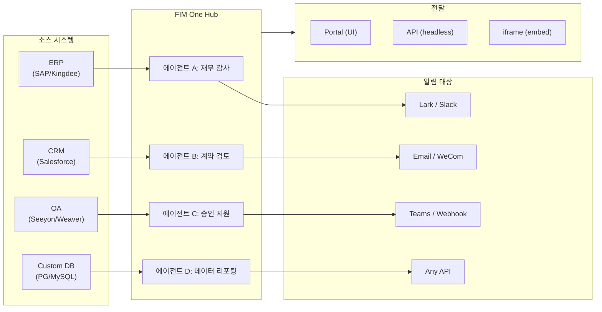

> 목표: **AI 기반 커넥터 허브** 구축 — 독립형(포털 어시스턴트), 코파일럿(호스트 시스템에 임베드), 허브(중앙 교차 시스템 오케스트레이션).
>
> 원칙: **공급자 중립적**(벤더 종속성 없음), **최소 추상화**, **프로토콜 우선**, **커넥터 우선**(통합이 핵심 가치).

## 제품 비전

FIM One은 **AI 커넥터 허브**로서 세 가지 점진적 모드를 제공합니다:

```
Standalone   → 자신의 AI 어시스턴트 (Portal)
Copilot      → 호스트 시스템에 내장된 AI (iframe / widget / embed)
Hub          → 중앙 집중식 크로스 시스템 오케스트레이션 (Portal / API)
```

**Hub 모드가 핵심 차별화 요소입니다.** 엔터프라이즈 클라이언트는 ERP, CRM, OA, 재무, HR 등의 레거시 시스템을 보유하고 있으며, 이들이 AI를 통해 서로 통신해야 합니다:



**GTM 경로: Land and Expand**

| 단계 | 모드 | 진행 상황 |
|------|------|-------------|
| Land | Copilot | 한 시스템에 내장하여 UI 내에서 가치 입증 |
| Expand | Copilot → Hub | 더 많은 시스템으로 확대; Hub가 이들을 통합 |

## 배포된 버전

### v0.1 (2026-02-22) — MVP: ReAct + DAG Planner
- ReActAgent with tools (calculator, python_exec, web_search)
- DAG Planner (LLM generates dependency graphs)
- Portal UI with streaming + KaTeX

### v0.2 (2026-02-24) — 다중 모델 + 메모리
- 재시도 / 속도 제한 / 사용량 추적
- 네이티브 함수 호출 (JSON 전용 파싱 없음)
- 다중 모델 지원 (빠른 + 메인 LLM)
- 메모리: WindowMemory, SummaryMemory
- SSE 스트리밍을 포함한 FastAPI 백엔드

### v0.3 (2026-02-25) — Web Tools + MCP
- Web tools (web_search, web_fetch) via Jina/Tavily/Brave
- File operations tool
- MCP client (standard tool integration)
- Tool auto-discovery + categories
- DAG visualization with click-to-scroll
- Code exec in Docker (`--network=none`)

### v0.4 (2026-02-25) — 다중 턴 + 에이전트
- 다중 턴 대화 (DbMemory)
- 도구 단계 접기 UI
- HTTP 요청 + 셸 실행 도구
- 에이전트 관리 (생성, 구성, 게시)
- JWT 인증
- 에이전트별 실행 모드 + 온도 제어

### v0.5 (2026-02-28) — Full RAG + Grounded Gen
- Full RAG pipeline (embedding + vector store + FTS + RRF + reranker)
- Grounded Generation (citations, confidence scores)
- Knowledge base document management (CRUD, search, retry, schema migration)
- ContextGuard + pinned messages (token budget manager)
- DbMemory persistence + LLM Compact
- DAG Re-Planning (up to 3 rounds)

### v0.6 (2026-03-01) — 커넥터 플랫폼
- **커넥터 CRUD**: 생성, 읽기, 업데이트, 삭제
- **ConnectorToolAdapter**: 커넥터를 BaseTool로 변환
- **사용자별 자격증명**: AES-GCM 암호화
- **확인 게이트**: 쓰기 작업 승인
- **감사 로깅**: 모든 도구 호출 기록
- **서킷 브레이커**: 장애 시 우아한 성능 저하
- **유틸리티 도구**: email_send, json_transform, template_render, text_utils
- **임베딩 옵션**: Jina, OpenAI, 커스텀 제공자

### v0.7 (2026-03-06) — 관리자 플랫폼 + 멀티테넌트
- **관리자 플랫폼**: 사용자 관리, 역할 전환, 비밀번호 재설정, 계정 활성화/비활성화
- **초대 전용 등록**: 3가지 모드(공개/초대/비활성화) + 초대 코드 CRUD
- **스토리지 관리**: 사용자별 디스크 사용량, 삭제, 고아 정리
- **대화 중재**: 관리자 목록/모두 삭제
- **사용자별 강제 로그아웃**: 모든 토큰 취소
- **API 상태 대시보드**: 시스템 통계, 커넥터 메트릭
- **첫 실행 설정 마법사**: 안내식 관리자 계정 생성
- **개인 센터**: 사용자별 전역 지침, 언어 선호도
- **JWT 인증**: 토큰 기반 SSE 인증, 대화 소유권
- **전역 MCP 서버**: 관리자 프로비저닝, 모든 세션에서 로드
- **하위 호환성**: registration_enabled → registration_mode 자동 마이그레이션

### v0.7.x (2026-03-07 to 2026-03-12) — 안정성 + 개선
- 초대 코드 관리
- 사용자별 할당량 (429 적용)
- 구조화된 감사 로깅
- 민감한 단어 필터링
- 관리자 로그인 기록
- 관리자 파일 브라우저
- 향상된 관리자 보기 (model_name, tools, kb_ids 필드)
- Docker Compose 배포 (단일 이미지, 명명된 볼륨)
- OAuth 자동 감지 (window.location에서)
- 확장 사고 / 추론 지원 (`LLM_REASONING_EFFORT`, `LLM_REASONING_BUDGET_TOKENS`) - OpenAI o-series, Gemini 2.5+, Claude
- 관리자 도구별 활성화/비활성화 (비활성화된 도구는 런타임에 채팅에서 제외)
- MCP 서버 관리를 커넥터 페이지로 이동
- 이중 데이터베이스 지원: SQLite (제로 설정 기본값) + PostgreSQL (프로덕션); Docker Compose는 PostgreSQL 자동 프로비저닝
- 모델 구성 문서 페이지 (제공자별 확장 사고 설정 포함)
- SSE Protocol v2: `delta_reasoning`, `usage` 필드를 포함한 실시간 답변 스트리밍, `done`/`suggestions`/`title`/`end` 이벤트 분할; SQLite 풀 크기 5 -> 20
- AI Builder 확장: 7개의 새로운 빌더 도구 (GetSettings, TestConnection, ImportOpenAPI for connectors; ListConnectors, AddConnector, RemoveConnector, SetModel for agents), 에이전트의 `is_builder` 플래그, 빌더 프롬프트 자동 새로고침, SSRF 가드
- SSE v2 프론트엔드: 스트리밍 점 펄스 커서, 축소 가능한 카드로 표시되는 DAG 재계획 라운드 스냅샷, DAG 레이아웃과 단계 상태 분리
- AI Builder 개념 문서 페이지 (커넥터 및 에이전트 빌더 가이드 포함)
- 조직 시스템: 역할 기반 멤버십 (소유자/관리자/멤버)을 포함한 전체 CRUD, 관리자 관리 UI
- 에이전트, 커넥터, 지식 기반, MCP 서버에 대한 3단계 리소스 가시성 (개인/조직/전역)
- 모든 리소스 유형에 대한 게시/게시 취소 API; 게시된 에이전트에 대한 소유자 위임
- 관리자 설정 가시성 엔드포인트 (복제-전역 대체); 통합 `build_visibility_filter()` 쿼리 헬퍼
- 데이터베이스 커넥터 (1-3단계): PG/MySQL/Oracle/SQL Server + 중국 레거시 DB에 대한 직접 SQL 액세스; 스키마 내부 검사, AI 주석, 읽기 전용 쿼리 실행, 암호화된 자격 증명, 커넥터당 3개 도구 (`list_tables`, `describe_table`, `query`)
- **평가 센터**: 정량적 에이전트 품질 벤치마킹 — 테스트 데이터셋 CRUD (프롬프트 + 예상 동작 + 어설션), 평가 실행 (병렬 실행 + LLM 채점자 + 케이스별 통과/실패/지연/토큰 결과), 자동 폴링을 포함한 결과 뷰어; 마이그레이션 `r8t0v2x4z567`
- 3가지 모델 역할 (General/Fast/Reasoning) (티어별 env 구성 격리 포함); 빠른 모델은 더 이상 주 모델 설정을 상속하지 않음
- 구조화된 데이터 및 아티팩트 전달을 위한 일반 문자열 단계 결과를 대체하는 `StepOutput` 데이터클래스
- DAG 실행을 위한 도구 캐시 — 실행당 동일한 도구 호출 캐시 (비동기 잠금 스탬피드 방지 포함) (`DAG_TOOL_CACHE`)
- 실패 시 1회 재시도를 포함한 단계별 LLM 검증 (`DAG_STEP_VERIFICATION`)
- 자동 라우팅: 빠른 LLM이 쿼리를 ReAct 또는 DAG로 분류; `/api/auto` 엔드포인트; 프론트엔드 3방향 모드 토글 (`AUTO_ROUTING`)
- [x] ~~**Shadow Market 조직 + 리소스 구독**~~: 기본 제공 Market 조직 (shadow, 자동 가입 없음)이 Platform 조직을 대체; 마켓플레이스 브라우징 및 명시적 구독을 통해 발견된 리소스 (풀 모델); 공유 리소스 구독을 위한 Market API; Market에 게시하려면 항상 검토 필요; 리소스 구독 테이블; 전역 가시성을 대체하는 조직 기반 리소스 공유
- [x] ~~**에이전트 자동 발견 및 하위 에이전트 바인딩**~~: 에이전트의 `discoverable` 플래그; `sub_agent_ids` 화이트리스트; 전문가 에이전트에 작업을 위임하기 위한 CallAgentTool
- [x] ~~**MCP 서버 자격 증명 + 사용자별 재정의**~~: `mcp_server_credentials` 테이블; `PUT /api/mcp-servers/{id}/my-credentials` 엔드포인트; 자격 증명 폴백 동작을 위한 `allow_fallback` 플래그
- [x] ~~**커넥터/KB 토글**~~: 리소스 일시 중단/재개를 위한 `POST /api/connectors/{id}/toggle` 및 `POST /api/knowledge-bases/{id}/toggle`
- [x] ~~**독립형 KB 대화**~~: 에이전트 바인딩 없이 직접 KB 채팅을 위한 대화의 `kb_ids` 필드

### v0.8 (2026-03-20) — 커넥터 선언형 설정 + 점진적 공개
- [x] **데이터베이스 커넥터**: 직접 SQL 액세스 (PostgreSQL, MySQL, Oracle) *(v0.7.x에서 출시 — Phase 1-3)*
- [x] **RBAC**: 사용자/역할별 커넥터 액세스 제어 *(v0.7.x에서 출시 — 조직 시스템 + 3단계 가시성)*
- [x] **커넥터 자격증명 암호화 + 사용자별 재정의**: `connector_credentials` 테이블, `CREDENTIAL_ENCRYPTION_KEY`를 통한 Fernet 암호화, `allow_fallback` 플래그, `GET/PUT/DELETE /my-credentials` 엔드포인트, 채팅 도구 로딩 시 사용자별 자격증명 해석
- [x] **게시 검토 UI**: 조직 수준 게시 검토 시스템 — 조직별 검토 토글, 승인/거부 워크플로우가 있는 ReviewsSheet, 리소스 카드의 상태 배지, 게시 대화상자의 검토 공지, 거부된 리소스에 대한 재제출
- [x] **커넥터 점진적 공개 (Phase 1-2)**: 단일 `ConnectorMetaTool`이 작업별 도구를 대체; 시스템 프롬프트는 경량 **스텁**만 수신 (이름 + 1줄 설명, 작업당 ~250개 토큰 대비 커넥터당 ~30개 토큰); 에이전트가 `discover(connector)`를 호출하여 전체 작업 스키마를 요청 시 로드 — 스키마는 모델이 커넥터를 선택할 때만 로드되어 캐싱을 위해 프롬프트 접두사를 안정적으로 유지. Claude Code의 `defer_loading: true` 내부 패턴을 반영. `execute` 서브명령; 하위 호환성을 위한 기능 플래그.
- [x] **에이전트 스킬 시스템 + 컴팩트 지침**: 에이전트 지침을 위한 요청 시 스킬 로딩 — `Skill` 모델 (이름, 콘텐츠/SOP, 선택적 스크립트)이 에이전트에 첨부; 시스템 프롬프트에서 이름으로만 참조 (~스킬당 ~10개 토큰); 에이전트가 `read_skill(name)`을 호출하여 전체 콘텐츠를 요청 시 로드. 풍부한 SOP 라이브러리를 허용하면서 대화별 지침 토큰 비용을 ~80% 감소. ConnectorMetaTool의 점진적 공개를 지침 수준에 적용한 대응. "지침 + 도구 + 스킬" 차별화 스토리를 활성화. 또한 Agent 모델에 `compact_instructions` 필드 추가 — 압축 시 `ContextGuard`에 주입된 에이전트별 압축 우선순위 목록 (예: "주문 ID 및 금액 보존, 원본 API 응답 삭제"), 현재의 정적 일반 프롬프트 대체. Claude Code의 Compact Instructions 패턴에서 영감.
- [x] **커넥터 가져오기/내보내기**: 커넥터 템플릿 공유
- [x] **커넥터 포크**: 기존 커넥터 복제 + 사용자 정의
- [x] **워크플로우 Phase 2 노드**: Iterator, Loop, VariableAggregator, ParameterExtractor, ListOperation, Transform, DocumentExtractor, QuestionUnderstanding, HumanIntervention — 전체 프론트엔드 + 백엔드 + 150개의 새로운 테스트 (총 275개)가 있는 9개의 고급 노드 유형. 지수 백오프를 사용한 노드 재시도, 안전한 표현식 평가. 성공률 막대가 있는 통계 패널. 12개의 기본 제공 템플릿. 창 컨텍스트 메뉴 (붙여넣기, 모두 선택, 보기 맞춤, 자동 레이아웃).
- [x] **워크플로우 Phase 3 노드: SubWorkflow + ENV** — 2개의 새로운 노드 유형 (총 25개 노드), 14개의 새로운 테스트 (총 306개), 14개의 기본 제공 템플릿. SubWorkflow: 대상 워크플로우 선택, 변수 매핑, 무한 재귀 방지를 위한 구성 가능한 깊이 제한이 있는 전체 DB 지원 중첩 워크플로우 실행자. ENV: 키 선택기 및 폴백 기본값이 있는 암호화된 환경 변수 읽기. 전체 프론트엔드 (노드 컴포넌트, 설정 패널, 팔레트 항목, 미니맵 색상). 노드별 실행 통계 패널 (성공률, 지속 시간, 실패 횟수 최악 우선 정렬). `getNodeStats` API 클라이언트 + `NodeStatEntry` 유형. 키보드 단축키 대화상자 (`?` 키).
- [x] **워크플로우 예약 트리거**: 시간대, 기본 입력 및 다음 실행 시간 계산이 있는 워크플로우별 cron 구성. 사전 설정 cron 버튼, 30개 트리거 테스트.
- [x] **워크플로우 API 트리거**: 사용자 인증 없이 외부 실행을 위한 워크플로우별 공개 API 키 (`wf_` 접두사), 속도 제한 포함. API 키 관리 대화상자 (생성/재생성/취소, 트리거 URL, cURL/JS 예제).
- [x] **워크플로우 배치 실행**: 최대 100개의 입력 세트, 구성 가능한 병렬 처리 (1-10), 축소 가능한 항목별 결과, JSON 내보내기가 있는 `POST /batch-run`. 14개 배치 실행 테스트.
- [x] **워크플로우 실행 로그 뷰어**: 실행 패널의 실시간 시간순 SSE 이벤트 스트림 (타임스탬프, 색상 코딩된 배지, 이벤트 유형 필터 토글).
- [x] **워크플로우 실행 통계**: 백엔드가 GROUP BY 하위 쿼리를 통해 실행 횟수 및 성공률을 배치 가져오기; 프론트엔드는 색상 코딩된 성공률 표시기가 있는 워크플로우 카드에 통계 표시.
- [x] **워크플로우 스케줄러 데몬**: 60초마다 기한이 된 cron 기반 워크플로우를 폴링하는 백그라운드 비동기 서비스. Croniter 시간대 지원, 세마포어 동시성, `last_scheduled_at` 추적, 웹훅 전달. 14개 테스트.
- [x] **워크플로우 가져오기 충돌 해석기**: 가져오기 중 미해결 에이전트/커넥터/KB/MCP 참조 감지. 가시성 필터링이 있는 배치 DB 쿼리, 프론트엔드 토스트 경고. 17개 테스트.
- [x] **워크플로우 테스트 노드 실행**: 모의 변수를 사용한 격리된 단일 노드 테스트, 편집기에 통합 (설정 패널 테스트 버튼 + 컨텍스트 메뉴). 23개 테스트.
- [x] **워크플로우 버전 차이**: 노드/에지 변경 감지, 색상 코딩된 표시기 (추가됨/제거됨/수정됨)가 있는 나란히 청사진 비교.
- [x] **워크플로우 실행 관리**: 개별 실행 삭제 (`DELETE /runs/{run_id}`) 및 완료된 모든 실행 지우기 (`DELETE /runs`), 프론트엔드 확인 대화상자 포함.
- [x] **워크플로우 실행 재생 오버레이**: 실행 기록의 "캔버스에서 보기" 버튼으로 과거 실행 결과를 캔버스에 오버레이하여 재실행 없이 노드별 상태 및 출력 표시.
- [x] **워크플로우 즐겨찾기/고정**: 워크플로우를 목록 상단에 고정하도록 별표/고정, localStorage 지속성 포함.
- [x] **워크플로우 실행 기록 내보내기**: 전체 실행 메타데이터 및 노드별 결과가 있는 JSON 파일 다운로드로 실행 기록 내보내기.
- [x] **관리자 워크플로우 관리**: 사용자 전체의 모든 워크플로우 관리를 위한 관리 패널 탭 — 나열, 활성/비활성 토글, 확인으로 삭제. 감사 로깅이 있는 삭제, 토글, 게시를 위한 배치 엔드포인트.
- [x] **워크플로우 템플릿 시스템**: 관리자 CRUD, 공개 나열/복제 API, 첫 시작 시 자동 삽입되는 5개의 시드 템플릿이 있는 `WorkflowTemplate` ORM 모델.
- [x] **워크플로우 인라인 검증 배지**: 편집 중 즉각적인 시각적 피드백을 위한 오류/경고 도구 설명이 있는 캔버스의 실시간 노드별 `ValidationBadge`.
- [x] **워크플로우 실행 추적 뷰어**: 엔진 `trace_level` 매개변수 및 단계별 디버깅을 위한 노드별 변수 스냅샷이 있는 타임라인 기반 추적 뷰어 Sheet.
- [x] **워크플로우 속도 제한 및 시간 초과**: 사용자별 `WorkflowRateLimiter` (슬라이딩 윈도우 10회/분, 3개 동시) 및 기본 10분 전역 실행 시간 초과.
- [x] **워크플로우 청사진 시스템**: 다단계 자동화 청사진을 설계하고 실행하기 위한 시각적 워크플로우 편집기 — `Workflow` / `WorkflowRun` ORM 모델, 전체 CRUD + SSE 실행 API, 가져오기/내보내기, 복제, 청사진 검증 엔드포인트, 위상 정렬 + 세마포어 기반 동시성 + 조건 분기 및 12개 노드 유형 (시작, 종료, LLM, ConditionBranch, QuestionClassifier, 에이전트, KnowledgeRetrieval, 커넥터, HTTPRequest, VariableAssign, TemplateTransform, CodeExecution)이 있는 `WorkflowEngine`, `{{node_id.output}}` 보간 및 `env.*` 네임스페이스가 있는 `VariableStore`, 노드별 오류 전략 (STOP_WORKFLOW / CONTINUE / FAIL_BRANCH) (노드별 시간 초과 및 고급 설정 UI 포함), React Flow v12 시각적 편집기 (드래그 앤 드롭 팔레트 + 노드 설정 패널 + 변수 선택기 콤보박스 + 에지에 노드 추가 + 자동 레이아웃 (ELK.js) + 실행 기록 sheet 포함), Dify 스타일 컴팩트 노드 설계 (링 기반 실행 상태 스타일 및 애니메이션 에지 전환 포함), 4개의 기본 제공 시작 템플릿 (단순 LLM 체인, 조건부 라우터, 지식 증강 QA, HTTP API 파이프라인) (템플릿 선택기 대화상자 및 `GET /templates` + `POST /from-template` API 포함), 통계 엔드포인트, `?run=true` URL 매개변수 자동 열기, 서브프로세스 기반 코드 실행 보안, 105개 테스트 스위트 (템플릿, eval 네임스페이스 평탄화, 청사진 검증 경고, 노드/에지 삭제, 가져오기/내보내기/복제, 교착 상태 감지, 다중 조건 분기)
- [x] **작업 감사**: 누가 무엇을 했는지에 대한 상세 로깅 — 관리자 검토

### v0.8.1 (2026-03-29) — 점진적 공개 성숙도 + ReAct 강화
- DB 커넥터(`DatabaseMetaTool`), MCP 서버(`MCPServerMetaTool`), 온디맨드 도구 로딩(`request_tools` 메타 도구)에 대한 점진적 공개
- DAG 품질 개선 (5가지 개선: 모델 업그레이드, 스킬 자동 발견, 인용 검증자, 구조화된 콘텐츠 보존, 도메인 인식 라우팅)
- ReAct의 도메인 모델 에스컬레이션 (전문 도메인이 추론 모델로 자동 에스컬레이션)
- 모델별 Native Function Calling 토글(`tool_choice_enabled`)
- ReAct 사이클 감지 (결정론적 중복 도구 호출 방지)
- ReAct 완료 체크리스트 (도구 사용 시 사전 답변 검증)
- Resource Fork Phase 1 (계보 추적을 포함한 MCP 서버 + 스킬 포크 엔드포인트)
- 워크플로우 연결 종속성 자동 구독 (재귀적 하위 워크플로우 종속성 해결)
- 사전 구축된 솔루션 템플릿 (첫 등록 시 마켓에 8개 수직 솔루션 시드)
- 관리자 알림 개선 (시간대 인식, 마스터 스위치, SMTP Reply-To)
- 턴별 토큰 예산 서킷 브레이커(`REACT_MAX_TURN_TOKENS`)
- 중앙화된 도구 절단, 동적 시스템 프롬프트 예산 책정
- 파일 첨부 다운로드, 중복 메시지 제출 수정

### v0.8.2 (2026-04-10) — 에이전트 코어 강화 + 비전 문서 처리
- **에이전트 코어 Phase 0** — Compact 프롬프트가 9섹션 구조화 형식으로 업그레이드됨; 빈 도구 결과 보호 (`(no output)` 대신 설명적 메시지); 반복 방지 프롬프트 + 사이클 감지 임계값을 2로 낮춤; 도메인 분류기 + 사전 비행 DB 설정 해석 병렬화 (요청당 400–1100ms 절감); SSE `end` 이벤트가 답변 직후 즉시 전송되며, 제목/제안은 백그라운드 작업으로 이동
- **에이전트 코어 Phase 1 (컨텍스트 반-팽창)** — `MicroCompact` 규칙 기반 이전 도구 결과 정리 (최근 6개 유지); `REACT_TOOL_RESULT_BUDGET=40000` 집계 상한; 컨텍스트 오버플로우 시 반응형 compact (자동으로 50% 예산으로 compact하고 재시도, 충돌 대신)
- **에이전트 코어 Phase 2 (속도)** — 키워드 기반 도구 사전 선택 (명백한 일치 시 LLM 호출 건너뜀, 200–500ms 절감); `SharedHttpClient` LLM 연결 풀링; 200 토큰 이상의 답변에 대해 완료 확인 건너뜀; `FallbackLLM`이 기본+빠른 모델을 래핑하며 429/503/529/연결 오류 시 자동 장애 조치
- **지능형 문서 처리 (비전 인식)** — 적응형 문서 처리: PDF 페이지가 비전 가능 모델(GPT-4o, Claude 3/4, Gemini)을 위해 PyMuPDF를 통해 이미지로 렌더링됨; pdfplumber를 통한 텍스트 전용 폴백. 모델별 `supports_vision` 플래그. `DOCUMENT_PROCESSING_MODE`, `DOCUMENT_VISION_DPI`, `DOCUMENT_VISION_MAX_PAGES`를 통한 모드. DOCX/PPTX 포함 이미지 추출. 대화 턴 전체에 걸친 다중 턴 비전 지속성. 스마트 PDF 처리 (텍스트 풍부 페이지는 텍스트 + 이미지 추출; 스캔된 페이지는 전체 페이지 PNG로 렌더링). `--network=none` 코드 실행을 위한 일반적인 데이터 과학 패키지가 포함된 사전 구축 샌드박스 이미지 (`Dockerfile.sandbox`)
- **리소스 포크 완료** — 에이전트 / 커넥터 / 워크플로우 포크 엔드포인트 추가, 5가지 타입 계보 추적 완료 (KB 포크 제거 — 본질적으로 사용자 로컬)
- **파일 무결성 가드레일** — 시스템 프롬프트 규칙이 대상 파일을 읽을 수 없을 때 에이전트가 관련 없는 파일 내용을 대체하는 것을 방지함; 업로드된 파일은 이제 메시지 컨텍스트에 `file_id`를 포함하여 직접 `read_uploaded_file` 접근 가능

### v0.8.3 (2026-04-16) — 범용 문서 변환 + 에이전트 코어 Phase 3
- **범용 문서 변환 (`convert_to_markdown` + OCR)** — Microsoft MarkItDown을 래핑하는 기본 제공 에이전트 도구; PDF, Word, Excel, PowerPoint, HTML, JSON, CSV, XML, ZIP, EPUB, Outlook .msg, 이미지, 오디오, YouTube URL을 Markdown으로 변환합니다. `LiteLLMOpenAIShim`은 모든 비전 지원 LLM(Claude, Gemini, Bedrock, Azure)을 통해 OCR을 활성화합니다. 텍스트 전용 폴백으로 회귀 없이 비전 인식 RAG 수집. 옵트아웃을 위한 `LLM_SUPPORTS_VISION` 환경 변수
- **에이전트 코어 Phase 3 (런타임 불변식 강화)** — 대화 복구(끊어진 `tool_use` 자동 복구); 구조화된 컴팩트 작업 카드(`WorkCard` 압축 라운드 간 타입 병합); 턴 레벨 프로파일러(`REACT_TURN_PROFILE_ENABLED`); 사용자별 속도 제한(`LLM_RATE_LIMIT_PER_USER`); `tool_calls`가 있는 빈 콘텐츠 어시스턴트 메시지가 더 이상 삭제되지 않음

## 계획된 버전

### v0.9 — 관찰성 + 프로덕션 강화

**목표**: 프로덕션 등급 운영, 디버깅 및 모니터링. **Hook System**을 도입합니다 — 에이전트 지시사항 아래에 위치하며 LLM에 의해 재정의될 수 없는 결정론적 강제 계층입니다.

- [ ] **커넥터 점진적 공개 (Phase 3-4)**: 통합 `ConnectorExecutor` 인터페이스 (API/DB/MCP를 하나의 추상화 뒤에); `jsonschema`를 사용한 작업 매개변수 검증; 프로토콜 불가지론적 discover/execute
- [ ] **YAML/JSON 커넥터 설정**: 플랫폼 자동 생성 MCP 서버
- [ ] **데이터베이스 커넥터 Phase 4**: 엔터프라이즈 드라이버 — Oracle (`oracledb`), SQL Server (`aioodbc`), 达梦 DM8 (`aioodbc` + DM ODBC), 南大通用 GBase (`aioodbc` + GBase ODBC)
- [ ] **IM 채널 통합 (양방향)**: **Phase 1 — 아웃바운드 푸시**: Lark, WeCom, Slack, Email, Teams 알림 작업 (에이전트/워크플로우 결과로부터). **Phase 2 — 인바운드 트리거**: 사용자가 IM 그룹 채팅에서 에이전트를 @mention하여 Portal을 열지 않고 작업 트리거; 채널당 webhook 수신기; 각 IM 채널을 양방향 작업(송수신)이 있는 커넥터로 모델링. Hub 모드 킬러 기능

#### 공개 API (Phase 2)

Phase 1 (출시됨): API 키 인증 미들웨어, 범위 지원, 큐레이션된 OpenAPI 사양, 대화형 플레이그라운드가 포함된 Mintlify API 참조.

- [ ] **키별 속도 제한** — API 키별로 구성 가능한 요청/분 및 요청/일 제한; `429 Too Many Requests` 응답 및 `X-RateLimit-*` 헤더
- [ ] **키별 사용량 할당** — 월간 토큰/요청 예산, 관리자 대시보드 및 임계값 알림
- [ ] **엔드포인트별 범위 적용** — 모든 보호된 엔드포인트에 `require_scope("chat")` 의존성; `scopes=chat`이 있는 키는 채팅 관련 API에만 액세스 가능
- [ ] **API 버전 관리** (`/v1/...`) — 안정적인 버전 관리 API 계약; 종료 예정 엔드포인트에 대한 지원 중단 헤더
- [ ] **웹훅 콜백** — API 키별 웹훅 URL 등록; 대화 완료, 에이전트 오류 및 비동기 작업 결과에 대한 POST 알림 수신
- [ ] **SDK 생성** — OpenAPI 사양에서 자동 생성된 Python 및 TypeScript 클라이언트 SDK; PyPI 및 npm에 게시
- [ ] **개발자 포털** — Mintlify 문서의 대화형 "시도해보기" 패널; 키 소유자에게 표시되는 사용량 분석
- [ ] **API 키 로테이션** — 유예 기간이 있는 원클릭 키 로테이션(로테이션 후 24시간 동안 이전 키 유효)
- [ ] **배치/비동기 API** — 최대 100개의 쿼리를 허용하는 `POST /api/batch`; 결과 폴링을 위한 `batch_id` 반환; 대량 KB 쿼리 또는 다중 에이전트 오케스트레이션에 유용
- [ ] **외부 의존성별 서킷 브레이커** — 다운스트림 LLM 제공자 또는 커넥터를 사용할 수 없을 때 연쇄 장애 방지; 자동 폴백 및 복구

#### 관찰성 & 에이전트 런타임

- [ ] **에이전트 추적 레이어 (관찰성++)**: 에이전트 디버깅을 위한 애플리케이션 수준의 실행/추적/스레드 계층 — 각 대화 → `Trace`, 각 LLM 호출 / 도구 호출 / DAG 단계 → 입력/출력/토큰/타이밍이 포함된 `Span`. 타임라인과 확장 가능한 LLM 호출 페이로드가 있는 프론트엔드 추적 뷰어. 이는 OTel(인프라 수준)을 넘어 개발자와 엔터프라이즈 클라이언트를 위한 실행 가능한 에이전트 루프 디버깅을 제공합니다. OpenTelemetry 내보내기를 데이터 싱크 옵션으로 제공. LangSmith의 실행/추적/스레드 개념을 모델로 함 — 에이전트 관찰성을 위한 업계 검증 패턴.
- [ ] **메트릭 대시보드**: 지연시간, 성공률, 토큰 사용량, 커넥터 호출 분석 — 에이전트별, 사용자별, 조직별 분석
- [x] ~~**서킷 브레이커**: 3상태 머신(폐쇄/개방/반개방)과 커넥터별 실패 추적, 5xx 감지 및 모니터링 엔드포인트~~ *(v0.8에서 조기 출시 — 구현됨)*
- [x] ~~**워크플로우 실행 보존 정리**: 구성 가능한 최대 나이 및 워크플로우당 최대 개수를 사용한 백그라운드 정리 작업; 워크플로우별 재정의; 수동 트리거를 위한 관리자 엔드포인트~~ *(v0.8.1에서 출시)*
- [x] ~~**워크플로우 버전 변경 요약**: `compute_blueprint_diff()`는 버전 저장 시 청사진 diff에서 인간이 읽을 수 있는 요약을 자동 생성~~ *(v0.8.1에서 출시)*
- [x] ~~**DAG 품질 개선**: 비고속 단계를 위한 기본 모델 업그레이드; 계획에서 스킬 자동 발견; 법률/의료/금융 도메인을 위한 인용 검증자; 구조화된 콘텐츠 컨텍스트 보존; 라우터의 도메인 분류와 도메인 인식 모델 선택~~ *(v0.8.1에서 출시)*
- [x] ~~**ReAct의 도메인 모델 에스컬레이션**: 전문 도메인은 필수 웹 검색 및 인용 검증과 함께 추론 모델로 자동 에스컬레이션~~ *(v0.8.1에서 출시)*
- [x] ~~**모델별 네이티브 함수 호출 토글**: `tool_choice_enabled` 설정을 통해 모델이 강제 도구 선택을 건너뛰고 JSON 모드로 직접 이동 가능~~ *(v0.8.1에서 출시)*
- [x] ~~**DatabaseMetaTool (DB 커넥터를 위한 점진적 공개)**: 단일 `database` 메타 도구와 `list_tables`/`discover`/`query` 하위 명령이 데이터베이스 커넥터당 3N개의 개별 도구를 대체; `DATABASE_TOOL_MODE` 환경 변수를 통해 구성 가능 (`progressive` 기본값, `legacy` 폴백)~~ *(v0.8.1에서 출시)*
- [x] ~~**`request_tools` 메타 도구를 통한 온디맨드 도구 로딩**: 스마트 선택 후 >12개의 도구를 사용할 수 있을 때, LLM이 대화 중간에 추가 도구를 동적으로 로드 가능; JSON 및 네이티브 함수 호출 모드 모두에서 작동~~ *(v0.8.1에서 출시)*
- [x] ~~**MCPServerMetaTool (MCP를 위한 점진적 공개)**: 단일 `mcp` 메타 도구와 `discover`/`call` 하위 명령이 N*M개의 개별 MCP 도구를 대체; `MCP_TOOL_MODE` 환경 변수를 통해 구성 가능 (`progressive` 기본값, `legacy` 폴백)~~ *(v0.8.1에서 출시)*
- [x] ~~**워크플로우 연결 종속성 자동 구독**: 마켓 구독 캐스케이드를 확장하여 워크플로우의 연결 종속성(API 커넥터, MCP 서버)을 자동 구독. 워크플로우 노드는 커넥터, MCP 서버, 에이전트(더 많은 종속성을 재귀적으로 참조), 하위 워크플로우를 참조할 수 있음 — 전체 트리의 모든 연결 종속성은 구독 시 자동 구독되고 구독 취소 시 캐스케이드 정리되어야 함. 순환 감지를 통한 재귀적 하위 워크플로우 해석으로 인해 스킬/에이전트보다 더 복잡. 솔루션(스킬/에이전트) 연결 종속성 자동 구독의 대응물~~ *(v0.8.1에서 출시)*
- [x] ~~**워크플로우 실제 실행자**: MCP 및 BuiltinTool 노드 실행자 스텁을 전체 구현으로 대체 (MCP 서버 발견 + 도구 호출; ToolRegistry 통합)~~ *(v0.8.1에서 출시)*
- [ ] **에이전트 훅 시스템**: **LLM 루프 외부에서** 실행되는 결정론적 강제 레이어 — 훅은 도구 이벤트에서 자동으로 실행되며 에이전트 지시사항으로 우회할 수 없습니다. 세 가지 훅 포인트: `PreToolUse` (실행 전 검증 / 차단), `PostToolUse` (실행 후 부작용), `SessionStart` (동적 컨텍스트 주입). 기본 제공 훅: 모든 커넥터 호출에서 `ConnectorCallLog` 자동 작성 (현재 수동); 조직이 읽기 전용 모드일 때 쓰기 작업 차단; 에이전트에 도달하기 전에 oversized DB 쿼리 결과 자동 자르기. 사용자 정의 훅: 에이전트별 YAML 구성 (`hooks:` 필드)은 일치하는 도구 이벤트에서 트리거되는 셸 명령 또는 Python 호출 가능 선언 — Claude Code의 훅과 동일한 패턴. 핵심 설계 원칙: **훅은 LLM이 이를 기억하는 데 의존해서는 안 되는 "항상 발생해야 하는" 로직을 위한 것입니다**. 지시사항은 "모든 호출 기록"; 훅은 실제로 기록합니다. 지시사항은 "읽기 전용 모드에서 쓰지 마세요"; 훅은 실제로 차단합니다.
- [ ] **에이전트 워크스페이스 (영구 에이전트 데스크톱)**: 세 가지 레이어: (1) **도구 출력 오프로딩** — oversized 도구 응답(>8K 문자)을 `workspace://` 파일에 자동 저장, 잘린 미리보기 + URI 반환; 선택적 액세스 및 에이전트 생성 아티팩트를 위한 기본 제공 도구 `read_workspace_file`, `list_workspace_files`, `write_workspace_file`. (2) **인계 노트** — 압축/세션 전환 간 컨텍스트 전환을 위한 `write_handoff(summary)`. (3) **워크스페이스 UI** — 대화별 프론트엔드 파일 브라우저 패널 (텍스트/JSON/CSV 미리보기, 다운로드, 삭제/이름 바꾸기); 세션 간 파일 보존; 사용자별 스토리지 할당량 통합. 어댑터의 `truncate_tool_output()` + `GET /api/conversations/{id}/workspace` 엔드포인트 확장
- [x] **스마트 파일 콘텐츠 주입 + `read_uploaded_file` 도구**: 작은 업로드된 파일(`<32K` 문자)은 LLM 컨텍스트에 자동 인라인; 큰 파일은 메타데이터 + 도구 힌트 획득. 이중 모드 `read_uploaded_file` 도구 (페이지 매김 읽기 + 정규식 검색). `GET /api/files/{file_id}/content` 엔드포인트, `.content` 사이드카 스토리지, 파일 API 응답의 `content_length`
- [x] ~~**지능형 문서 처리 (비전 인식)**: 적응형 문서 처리 — PDF 페이지는 비전 가능 모델(GPT-4o, Claude 3/4, Gemini)을 위해 PyMuPDF를 통해 이미지로 렌더링; pdfplumber를 통한 텍스트 전용 폴백. 관리자의 모델별 `supports_vision` 플래그. 두 가지 모드(비전/텍스트)는 `DOCUMENT_PROCESSING_MODE` 환경 변수를 통해 구성 가능. 스마트 PDF 처리: 텍스트 풍부한 페이지는 텍스트 + 포함된 이미지 추출 (토큰 효율적), 스캔된 페이지는 전체 페이지 PNG로 렌더링. DOCX/PPTX 포함 이미지 추출. 다중 턴 비전 지속성. 미리 빌드된 샌드박스 이미지 (`Dockerfile.sandbox`). `.pages/` 사이드카를 사용한 캐시된 페이지 렌더링.~~ *(v0.8.2에서 출시)*
- [x] ~~**범용 문서 변환 (`convert_to_markdown` + OCR)** — Microsoft MarkItDown을 래핑하는 기본 제공 에이전트 도구, 모든 에이전트에서 기본적으로 사용 가능. PDF, Word, Excel, PowerPoint, HTML, JSON, CSV, XML, ZIP, EPUB, Outlook .msg, 이미지, 오디오, YouTube URL 및 데이터 URI를 대화 중 깔끔한 Markdown으로 변환. Office 파일의 포함 이미지 및 스캔된 PDF 페이지는 공식 `markitdown-ocr` 플러그인을 사용하여 워크스페이스의 비전 가능 LLM(DB 우선, ENV 폴백)을 통해 자동 OCR됨. 동일한 변환 커널은 RAG 수집 파이프라인에서 공유되므로 채팅 시간 변환 및 지식 기반 수집은 바이트 동일 Markdown을 생성합니다. 비OpenAI 제공자(Claude, Gemini, Bedrock, Azure)는 모든 FIM One LLM을 openai-SDK 형태의 클라이언트로 제시한 다음 LiteLLM을 통해 라우팅하는 `LiteLLMOpenAIShim`을 통해 투명하게 지원됩니다. 제로 회귀 폴백: 비전 모델을 사용할 수 없을 때, 텍스트 전용 추출은 이전과 정확히 동일하게 계속됩니다.~~ *(v0.8.3에서 출시)*
- [ ] **세션 간 파일 관리**: 파일 브라우저 UI, 스토리지 할당량, 자동 만료 정리
- [ ] **세션 수준 파일 연결**: 어떤 파일이 어떤 대화에서 사용되었는지 추적
- [ ] **세션 간 대화 회상**: 과거 대화 기록을 나열, 검색 및 읽기 위한 에이전트 도구 — `list_conversations`, `search_conversations` (기록 전체에서 키워드/정규식), `read_conversation` (전체 스레드 검색). "지난번에 무엇을 논의했는가" 및 "지난주에 요청한 API 변경을 찾아보세요" 워크플로우를 활성화합니다. 세션 간 파일 관리와 쌍을 이루어 완전한 장기 에이전트 메모리 레이어를 형성
- [ ] **샌드박스 강화**: 코드 실행 격
#### 에코시스템 & 확장

- [ ] **스케줄된 작업 + 이벤트 트리거 에이전트 (Loop)**: cron 유사 백그라운드 작업 트리거; `scheduled_jobs` + `job_runs` DB 테이블; APScheduler 통합; 작업 CRUD API + 작업 이력 UI; 메시지 푸시 커넥터를 통한 결과 알림. 범위는 시간 트리거(cron)와 이벤트 트리거(webhook 인바운드) 패턴 모두를 포함 — 백그라운드에서 비동기로 실행되는 에이전트는 Hub 모드의 비동기 서브 에이전트 사용 사례입니다.
- [x] ~~**사전 구축된 솔루션 템플릿 (마켓 시드 콘텐츠)**: 첫 사용자 등록 시 마켓에 게시된 8개의 즉시 사용 가능한 수직 솔루션 — 재무 감사, 계약 검토, 데이터 보고, IT 헬프데스크, HR 온보딩, 영업 어시스턴트, 콘텐츠 작성자, 회의 요약. 각각은 중국어 SOP가 포함된 에이전트 + 스킬을 번들로 제공; `ensure_solution_templates()`를 통해 멱등성 있게 부트스트랩되고 즉시 마켓플레이스 가용성을 위해 마켓 조직에 게시됨~~ *(v0.8.1에서 출시)*
- [ ] **DB 스키마 고급 빌더**: 대규모 데이터베이스를 위한 AI 기반 스키마 관리 에이전트 — 전략적 테이블 주석(패턴 기반, SQL 실행 정보 활용), 도메인 접두사별 대량 가시성 관리, 1K–7K+ 테이블 배포를 위한 반복적 다중 라운드 주석; 기존 배치 주석 작업을 선택성 및 비즈니스 컨텍스트 추론으로 보완
- [x] ~~**리소스 포크 (패키지 단계 1 — v1.0 패키지 시스템의 전제 조건)**: 모든 리소스별 포크 엔드포인트 구현 — MCP 서버, 스킬, 에이전트, 커넥터, 워크플로우. KB 포크 제거(본질적으로 사용자 로컬). 각 `POST /api/{type}/{id}/fork`는 `forked_from` 계보 추적을 통해 사용자 소유의 깊은 복사본을 생성합니다.~~ *(v0.8.1에서 완료)*

**영향**: FIM One을 자신감 있게 규모에 맞게 실행하세요. 네 가지 기둥: **추적 계층**(무엇이 일어났는지 확인), **훅 시스템**(반드시 일어나야 할 일 강제), **에이전트 워크스페이스**(영구 파일 관리 + 핸드오프), **IM 채널**(에이전트가 사용자가 일하는 곳에 존재). 사전 구축된 솔루션 템플릿은 콜드 스타트를 제거; 대시보드 개선는 운영 상태를 표시합니다. "에이전트가 따를 수 있는 지침"과 "시스템이 강제하는 보장" 사이의 간격이 해소됩니다 — 데모와 프로덕션 엔터프라이즈 도구 간의 차이입니다.

### v1.0 — 핫플러그 + 임베더블

**목표**: 재시작 없는 커넥터 추가, 패키지 생태계, 임베더블 배포.

- [ ] **커넥터 점진적 공개 (Phase 5)**: **의미론적 가이드 도구 선택** (쿼리에서 엔티티 추출 → 온톨로지 레지스트리 조회 → 커넥터 세트 축소; 50개 이상 커넥터 배포 시 90% 이상 토큰 감소); 배치/ETL 커넥터용 스케일 모드; CLI 스타일 범용 `connector <name> <action> <params>` 인터페이스
- [ ] **크로스 커넥터 엔티티 정렬 (온톨로지 레지스트리)**: 공유 엔티티 타입(Customer, Order, Asset) 정의 및 커넥터 간 필드 매핑; DAGPlanner가 크로스 시스템 JOIN 키 자동 해결; 하드코딩된 필드명 없이 크로스 커넥터 쿼리 가능 (예: "Salesforce의 고객 중 Shopify에서 주문한 고객")
- [ ] **핫플러그 커넥터**: OpenAPI 스펙 업로드, AI가 설정 생성, 5분 내 라이브 (재시작 불필요)
- [x] ~~**마켓플레이스 재설계 Phase 1 — 솔루션 + 컴포넌트**~~: 2단계 마켓 모델 (솔루션: 에이전트/스킬/워크플로우; 컴포넌트: 커넥터/MCP 서버); 범위 선택기 (글로벌 마켓 / 조직); 통합 구독 모델 (조직 자동 표시 제거); 마켓 범위에서 KB 제거; 기존 조직 구성원을 위한 데이터 마이그레이션 구독 백필
- [ ] **마켓 패키지 시스템**: 마켓플레이스용 배포 가능한 리소스 번들 — 타입별 "마켓플레이스"를 통합 패키징 계층으로 대체. `fim-package.yaml` 매니페스트 선언: 메타데이터 (이름, 버전, 설명, 작성자, 라이선스, 태그, `min_fim_version`), 진입점 (기본 스킬 또는 에이전트), 리소스 목록 (에이전트, 스킬, 커넥터, KB, MCP 서버, 워크플로우) 및 설정 참조, 패키지 간 의존성 (semver 범위), 필수 자격증명 (설치 시 수집을 위해 커넥터 참조로 매핑), 기본값이 있는 사용자 구성 가능 변수. **두 가지 소비 모드**: (1) **설치** — 모든 리소스 일괄 생성 + ID 치환을 통한 내부 참조 자동 연결; 설치가 버전 업데이트 알림을 위한 소스에 연결됨; `POST /api/market/packages/{id}/install`; (2) **포크** — 사용자 소유 편집 가능 복사본으로 복제, 업데이트 링크 없음 (이것이 템플릿 모드임); `POST /api/market/packages/{id}/fork`. 추가 엔드포인트: 게시 (`POST /api/market/packages` 검토 워크플로우 포함), 제거 (`DELETE /packages/{id}/uninstall` 의존성 확인 + 수정된 리소스 확인 포함), 버전 기록 (`GET /packages/{id}/versions`), 업그레이드 (`POST /packages/{id}/upgrade` 리소스별 diff 미리보기 포함). 중첩된 패키지 요구사항에 대한 의존성 해결자 및 충돌 감지. `PackageInstallation` 테이블은 제거/업그레이드를 위한 리소스 ID 매핑과 함께 사용자별 설치된 패키지를 추적. **개별 리소스 게시와 공존** — 패키지는 구성 계층이지 대체가 아님; 단일 커넥터는 여전히 독립적으로 게시 가능. 예시 의존성 트리: `Package: contract-review` → `Skill: contract-review` (진입점) → `Agent: contract-analyst` + `Agent: risk-scorer` → `KB: legal-clauses` + `Connector: docusign-api` + `MCP: pdf-extractor` + `Workflow: contract-approval-flow`
- [ ] **크리에이터 프로그램**: 마켓플레이스 수익화 계층 — 포트폴리오 페이지가 있는 크리에이터 프로필, 패키지별 분석 (설치, 포크, 활성 사용자, 평점/리뷰), 패키지가 새 구독을 유도할 때 제휴 수수료 추적. 가격 책정, 구매 흐름, 승인 워크플로우가 있는 유료 패키지 계층. 설치 추세, 수익 보고, 사용자 피드백이 있는 크리에이터 대시보드. 프로그래밍 방식 패키지 게시를 위한 공개 크리에이터 API (패키지 작성자용 CI/CD). 커뮤니티 기능: 패키지 댓글, Q&A, 버전별 변경 로그
- [ ] **임베더블 위젯**: `<script src="fim-one.js">` 호스트 페이지에 주입
- [ ] **페이지 컨텍스트 주입**: 위젯이 호스트 페이지 컨텍스트 읽음 (현재 ID, URL, DOM 선택기)
- [ ] **고급 트리거**: 웹훅 인바운드 이벤트; 예약된 작업 개선 (다중 시간대, 달력 인식)
- [ ] **배치 실행**: DAG를 통해 1000개 이상 항목 처리
- [ ] **엔터프라이즈 보안**: IP 화이트리스팅, 저장 데이터 암호화, SSO
- [ ] **KB 고급 편집기**: 대규모 지식 기반을 관리하는 파워 사용자용 빌더 모드 에이전트 — 대량 URL 수집, 중복 감지, 갭 분석, 문서 라이프사이클 관리; 기존 KB AI 채팅을 ReAct 도구 루프로 확장

**영향**: 엔터프라이즈는 FIM One을 0에서 며칠 내에 다중 시스템 오케스트레이션으로 배포. 패키지 시스템은 크리에이터 생태계 생성 — 솔루션 작성자가 복합 번들 (스킬 + 에이전트 + 커넥터 + KB + 워크플로우) 게시, 엔터프라이즈가 한 번의 클릭으로 설치, 크리에이터가 채택으로부터 수익 창출. 설치/포크 이원성은 "있는 그대로 사용" 및 "템플릿에서 커스터마이즈" 사용 사례를 단일 메커니즘으로 커버.

## 동결된 기능 (출시됨, 유지 관리만 수행)

[직교성 전략](/strategy/orthogonality-strategy)에 따라 이러한 기능들은 출시되어 작동하지만 새로운 기능을 추가하지 않습니다 (버그 수정만 수행):

| 기능 | 버전 | 동결 이유 |
|---------|---------|-----------|
| ReAct 에이전트 | v0.1, v0.9 | 모델이 이제 기본 도구 호출 기능을 보유. 루프 중간 자체 반성(v0.9)이 긴 체인에서 목표 이탈 방지. 도구 관찰 합성 품질 개선(8K 문자, `REACT_TOOL_OBS_TRUNCATION`을 통해 구성 가능) |
| DAG 계획 / 재계획 | v0.1, v0.5, v0.7.5 | 모델 추론 능력 향상; 분해가 단일 샷으로 변경. v0.7.5에서 단계별 검증 출시(`DAG_STEP_VERIFICATION`). 강화됨: 계단식 실패 전파, 검증자 상태 수정, 계획자 도구 설명, 전체 재계획 기록, 화이트리스트 기반 도구 캐시. 14개 엔진 상수가 ENV 변수로 노출됨 — 추가 계획 기본 요소 계획 없음 |
| 메모리(윈도우, 요약, 컴팩트) | v0.2, v0.5 | 컨텍스트 윈도우 증가(200K+); 외부 메모리 관리 필요성 감소 |
| RAG 파이프라인 | v0.5 | 제공자가 기본적으로 검색 구축(OpenAI file_search, Gemini Search Grounding) |
| 기반 생성 | v0.5 | 모델이 인용에서 개선 중; 5단계 파이프라인이 감소하는 가치 추가 |
| ContextGuard / 고정 메시지 | v0.5 | 현재 상태로 출시; 새로운 기능 없음 |

## 고려 사항 (무기한 연기)

직교성 전략에 따라, 다음 항목들은 높은 노력이 필요하며 흡수 위험이 있습니다:

| 기능 | 연기 사유 |
|---------|------------|
| 다중 에이전트 오케스트레이션 (깊은 계층 구조) | 제공자들이 기본적으로 구축 중 (OpenAI Swarm, Claude Code Teams, Google A2A). FIM One의 CallAgentTool은 1단계 위임 사례를 다루고 있으며, 이벤트 트리거 백그라운드 에이전트는 v0.9의 예약된 작업으로 다루어집니다 |
| 에이전트 자체 수정 스킬 (절차적 메모리) | 실행 중 에이전트가 자신의 `skill.md`를 업데이트 — 높은 복잡도, 보안/감사 표면적. 에이전트 스킬 시스템 (v0.8) 출시 후 재평가 필요. 엔터프라이즈 고객이 자체 개선 에이전트를 명시적으로 요청할 경우 재검토 |
| ~~에이전트 작업 공간 (도구 출력 파일 오프로딩)~~ | v0.9로 승격. 가치는 **선택적 읽기**이며, 컨텍스트 용량이 아님 — Claude Code 검증 확인. 원래 연기 사유 ("200K+ 윈도우는 긴급성 감소")는 잘못됨 |
| 크로스 세션 장기 메모리 | 컨텍스트 윈도우 빠르게 증가 중 (200K–2M); 제공자들이 기본 메모리 추가 중 (OpenAI 메모리, Gemini 컨텍스트 캐싱); 높은 구현 비용 대비 차별화 가치 감소. 엔터프라이즈 고객이 명시적으로 요청할 때 재평가 |
| 메모리 라이프사이클 (TTL, 할당량) | 크로스 세션 메모리에 종속; 함께 연기 |
| 활성 컨텍스트 압축 도구 (에이전트 트리거) | ContextGuard (v0.5)로 명시적 동결. 200K+ 컨텍스트 윈도우는 가치 감소. 컨텍스트 비용이 주요 엔터프라이즈 불만이 되지 않는 한 재검토하지 않음 |
| 브라우저 자동화 / 컴퓨터 사용 | 높은 유지보수 비용 (DOM 변경, 봇 방지, 샌드박싱). 업계가 컴퓨터 사용 모드 (Anthropic, OpenAI Operator, Google Mariner)와 MCP 브라우저 도구 (Puppeteer/Playwright MCP)로 수렴 중. MCP 통합을 통해 소비하고, 자체 구축하지 않음. 안정적인 컴퓨터 사용 MCP 표준이 나타날 때 재평가 |
| 웹 푸시 알림 | 브라우저 기본 푸시 (Service Worker + VAPID). IM 채널 통합 (v0.8)과 겹침 (엔터프라이즈 선호 채널: Lark/Slack/WeCom/Email 다룸). IM 푸시가 더 높은 엔터프라이즈 가치; 웹 푸시는 포털 전용 사용자를 위한 선택 사항. IM 채널 출시 후 재평가 — 사용자가 IM 범위를 벗어난 브라우저 알림을 요청할 경우 |

## 버전이 모드와 어떻게 정렬되는지

| Version | Standalone | Copilot | Hub | Notes |
|---------|-----------|---------|-----|-------|
| **v0.1–v0.3** | Working | Not yet | Not yet | Portal-only, single-user |
| **v0.4** | Working | Not yet | Not yet | Multi-conversation, 에이전트 관리 |
| **v0.5** | Working | Not yet | Not yet | Knowledge base + RAG |
| **v0.6** | Working | Possible | Possible | 커넥터 출시; 수동 연결을 통한 Copilot/Hub 가능 |
| **v0.7** | Working | Ready | Ready | Admin platform; multi-tenant auth; production 준비 완료 |
| **v0.8** | Working | Ready | Optimized | RBAC + 시스템별 감사 로그; 더 쉬운 온보딩 |
| **v0.9** | Working | Ready | Production | Observability, performance, hardening |
| **v1.0** | Working | Optimized | Enterprise | Package system, creator program, hot-plug, embeddable widget, webhooks, batch |

## 리소스 할당 (v0.8–v1.0)

직교성 전략은 노력이 투입되는 방향을 결정합니다:

| 카테고리 | 할당 | 버전 | 이유 |
|----------|-----------|----------|-----|
| **커넥터 플랫폼** (v0.6+) | 50% | 지속 | 핵심 차별화 요소; 흡수 위험 없음 |
| **엔터프라이즈 기능** (RBAC, 감사, 보안, 관찰성) | 30% | v0.8–v1.0 | 지루하지만 내구성 있음; 프로덕션 필수 요구사항. 에이전트 추적 계층은 상용 앵커 |
| **에이전트 인텔리전스** (스킬 시스템, 예약된 에이전트) | 15% | v0.8–v0.9 | 指令+工具+技能 차별화 스토리; 낮은 흡수 위험 — 프레임워크는 패턴을 검증하지만 엔터프라이즈 SOP는 고객별 맞춤형 |
| **v0.1–v0.5 유지보수** | 5% | 지속 | 버그 수정만; 새로운 기능 없음 |

## 메트릭 기반 마일스톤

성공은 다음 메트릭으로 측정됩니다:

| 메트릭 | v0.7 목표 | v0.8 목표 | v1.0 목표 |
|--------|------------|------------|------------|
| 배포된 커넥터 | 5 | 20+ | 100+ |
| 엔터프라이즈 고객 | 1–2 | 5–10 | 20+ |
| 평균 커넥터 설정 시간 | 2주 | 2일 | 5분 (핫플러그) |
| 토큰 효율성 (DAG vs ReAct-only) | 30% 감소 | 40% 감소 | 50% 감소 |
| 가동시간 SLA | 99.5% | 99.9% | 99.95% |
| 지원 티켓 주제 | 통합, 설정 | 커넥터 커스텀 로직 | 핫플러그, 확장 |

## 미해결 질문 / TBD

- **마켓플레이스 중재**: 커뮤니티 패키지 및 개별 리소스를 검증하는 방법? 패키지 구성에서 자격증명 누수에 대한 자동 스캔? (v1.0)
- **토큰 경제학**: 다중 사용자, 다중 에이전트 시나리오의 가격 책정 방법? (v1.0)
- **패키지 버전 관리**: 설치된 패키지의 주요 변경 사항 — 마이그레이션 스크립트를 통한 자동 업그레이드 또는 업데이트별 수동 승인? 의존성 다이아몬드 문제 해결? (v1.0)
- **패키지 가격 책정**: 무료 vs 유료 계층, Creator Program 수수료율, 결제 제공자 통합? (v1.0)
- **패키지 자격증명 UX**: 설치 시간 자격증명 수집 — 마법사 스타일 단계별 또는 연기된 설정? 동일한 커넥터 유형을 사용하는 패키지 간 자격증명 공유? (v1.0)
- **텔레메트리 옵트아웃**: 개인정보 보호 기본 설정을 준수하는 방법? (v0.8)
- **커넥터 버전 관리**: 커넥터 API의 주요 변경 사항을 관리하는 방법? (v0.8)
- **속도 제한**: 사용자별 워크플로우 속도 제한 배포됨 (슬라이딩 윈도우 10회/분, 3개 동시). 커넥터별 및 에이전트별 속도 제한 TBD (v0.9)

