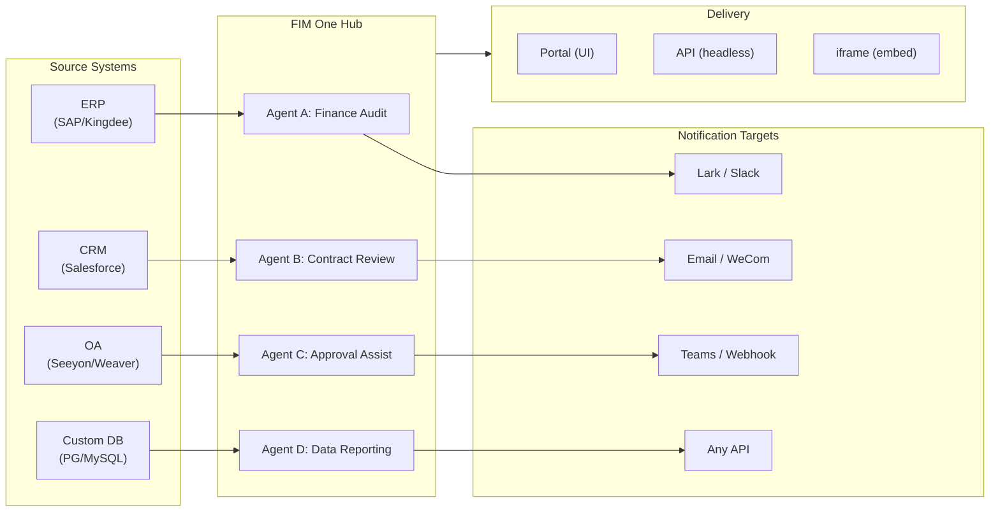

> Goal: Build an **AI-powered Connector Hub** — Standalone (portal assistant), Copilot (embedded in host system), Hub (central cross-system orchestration).
>
> Principles: **Provider-agnostic** (no vendor lock-in), **minimal-abstraction**, **protocol-first**, **connector-first** (integration is the core value).## 제품 비전

FIM One은 **AI Connector Hub**로, 세 가지 점진적 모드를 제공합니다:

```
Standalone   → 자신의 AI 어시스턴트 (Portal)
Copilot      → 호스트 시스템에 임베드된 AI (iframe / widget / embed)
Hub          → 중앙 크로스 시스템 오케스트레이션 (Portal / API)
```

**Hub Mode가 핵심 차별화 요소입니다.** 엔터프라이즈 클라이언트는 ERP, CRM, OA, 재무, HR 등의 레거시 시스템을 보유하고 있으며, 이들이 AI를 통해 서로 통신해야 합니다:



**GTM 경로: Land and Expand**

| 단계 | 모드 | 수행 내용 |
|------|------|-------------|
| Land | Copilot | 한 시스템에 임베드하여 UI 내에서 가치 입증 |
| Expand | Copilot → Hub | 더 많은 시스템으로 확대; Hub가 이들을 통합 |## 배포된 버전### v0.1 (2026-02-22) — MVP: ReAct + DAG Planner
- ReActAgent with tools (calculator, python_exec, web_search)
- DAG Planner (LLM generates dependency graphs)
- Portal UI with streaming + KaTeX### v0.2 (2026-02-24) — Multi-Model + Memory
- 재시도 / 속도 제한 / 사용량 추적
- 네이티브 함수 호출 (JSON 전용 파싱 없음)
- 다중 모델 지원 (빠른 + 메인 LLM)
- 메모리: WindowMemory, SummaryMemory
- SSE 스트리밍이 포함된 FastAPI 백엔드### v0.3 (2026-02-25) — Web Tools + MCP
- Web tools (web_search, web_fetch) via Jina/Tavily/Brave
- File operations tool
- MCP client (standard tool integration)
- Tool auto-discovery + categories
- DAG visualization with click-to-scroll
- Code exec in Docker (`--network=none`)### v0.4 (2026-02-25) — Multi-Turn + Agents
- 다중 턴 대화 (DbMemory)
- 도구 단계 폴딩 UI
- HTTP 요청 + 셸 실행 도구
- 에이전트 관리 (생성, 구성, 게시)
- JWT 인증
- 에이전트별 실행 모드 + 온도 제어### v0.5 (2026-02-28) — Full RAG + Grounded Gen
- Full RAG pipeline (embedding + vector store + FTS + RRF + reranker)
- Grounded Generation (citations, conflict detection, confidence scores)
- Knowledge base document management (CRUD, search, retry, schema migration)
- ContextGuard + pinned messages (token budget manager)
- DbMemory persistence + LLM Compact
- DAG Re-Planning (up to 3 rounds)### v0.6 (2026-03-01) — Connector Platform
- **Connector CRUD**: create, read, update, delete
- **ConnectorToolAdapter**: converts Connector → BaseTool
- **Per-user credentials**: AES-GCM encryption
- **Confirmation gate**: write operation approval
- **Audit logging**: all tool calls recorded
- **Circuit breaker**: graceful degradation on failures
- **Utility tools**: email_send, json_transform, template_render, text_utils
- **Embedding options**: Jina, OpenAI, custom providers### v0.7 (2026-03-06) — Admin Platform + Multi-Tenant
- **Admin Platform**: 사용자 관리, 역할 전환, 비밀번호 재설정, 계정 활성화/비활성화
- **초대 전용 등록**: 3가지 모드(공개/초대/비활성화) + 초대 코드 CRUD
- **스토리지 관리**: 사용자별 디스크 사용량, 삭제, 고아 정리
- **대화 중재**: 관리자 목록/모두 삭제
- **사용자별 강제 로그아웃**: 모든 토큰 취소
- **API 상태 대시보드**: 시스템 통계, connector 메트릭
- **첫 실행 설정 마법사**: 안내식 관리자 계정 생성
- **Personal Center**: 사용자별 전역 지시사항, 언어 선호도
- **JWT 인증**: 토큰 기반 SSE 인증, 대화 소유권
- **Global MCP servers**: 관리자 프로비저닝, 모든 세션에서 로드
- **하위 호환성**: registration_enabled → registration_mode 자동 마이그레이션### v0.7.x (2026-03-07 to 2026-03-12) — 안정성 + 폴리시
- 초대 코드 관리
- 사용자별 할당량 (429 강제)
- 구조화된 감사 로깅
- 민감한 단어 필터링
- 관리자 로그인 기록
- 관리자 파일 브라우저
- 향상된 관리자 보기 (model_name, tools, kb_ids 필드)
- Docker Compose 배포 (단일 이미지, 명명된 볼륨)
- OAuth 자동 감지 (window.location)
- 확장 사고 / 추론 지원 (`LLM_REASONING_EFFORT`, `LLM_REASONING_BUDGET_TOKENS`) - OpenAI o-series, Gemini 2.5+, Claude
- 관리자 도구별 활성화/비활성화 (비활성화된 도구는 런타임 시 채팅에서 제외)
- MCP 서버 관리를 Connectors 페이지로 이동
- 이중 데이터베이스 지원: SQLite (제로 구성 기본값) + PostgreSQL (프로덕션); Docker Compose 자동 PostgreSQL 프로비저닝
- 모델 구성 문서 페이지 (공급자별 확장 사고 설정 포함)
- SSE Protocol v2: `delta_reasoning`, `usage` 필드를 포함한 실시간 답변 스트리밍, `done`/`suggestions`/`title`/`end` 이벤트 분할; SQLite 풀 크기 5 -> 20
- AI Builder 확장: 7개의 새로운 빌더 도구 (GetSettings, TestConnection, ImportOpenAPI for connectors; ListConnectors, AddConnector, RemoveConnector, SetModel for agents), 에이전트의 `is_builder` 플래그, 빌더 프롬프트 자동 새로고침, SSRF 가드
- SSE v2 프론트엔드: 스트리밍 점 펄스 커서, 축소 가능한 카드로 DAG 재계획 라운드 스냅샷, DAG 레이아웃을 단계 상태와 분리
- AI Builder 개념 문서 페이지 (connector 및 agent 빌더 가이드 포함)
- 조직 시스템: 역할 기반 멤버십 (owner/admin/member)을 포함한 전체 CRUD, 관리자 관리 UI
- 3계층 리소스 가시성 (personal/org/global) - 에이전트, connector, 지식 베이스, MCP 서버
- 모든 리소스 유형에 대한 게시/게시 취소 API; 게시된 에이전트에 대한 소유자 위임
- 관리자 set-visibility 엔드포인트 (clone-to-global 대체); 통합 `build_visibility_filter()` 쿼리 헬퍼
- 데이터베이스 Connector (Phase 1-3): PG/MySQL/Oracle/SQL Server + 중국 레거시 DB에 대한 직접 SQL 액세스; 스키마 내부 검사, AI 주석, 읽기 전용 쿼리 실행, 암호화된 자격 증명, connector당 3개 도구 (`list_tables`, `describe_table`, `query`)
- **평가 센터**: 정량적 에이전트 품질 벤치마킹 — 테스트 데이터셋 CRUD (프롬프트 + 예상 동작 + 어설션), 평가 실행 (병렬 실행 + LLM 채점자 + 케이스별 통과/실패/지연/토큰 결과), 자동 폴링을 포함한 결과 뷰어; 마이그레이션 `r8t0v2x4z567`
- 3가지 모델 역할 (General/Fast/Reasoning) - 계층별 env 구성 격리; 빠른 모델은 더 이상 주 모델 설정을 상속하지 않음
- 구조화된 데이터 및 아티팩트 전달을 위한 일반 문자열 단계 결과를 대체하는 `StepOutput` 데이터클래스
- DAG 실행을 위한 도구 캐시 — 비동기 잠금 스탬피드 방지를 포함한 실행당 동일한 도구 호출 캐시 (`DAG_TOOL_CACHE`)
- 실패 시 1회 재시도를 포함한 단계별 LLM 검증 (`DAG_STEP_VERIFICATION`)
- 자동 라우팅: 빠른 LLM이 쿼리를 ReAct 또는 DAG로 분류; `/api/auto` 엔드포인트; 프론트엔드 3방향 모드 토글 (`AUTO_ROUTING`)
- [x] ~~**플랫폼 조직 + 리소스 구독**~~: 기본 제공 Platform org가 모든 사용자를 자동 참여; 공유 리소스 구독을 위한 Market API; 리소스 구독 테이블; 전역 가시성을 대체하는 org 기반 리소스 공유
- [x] ~~**에이전트 자동 발견 및 하위 에이전트 바인딩**~~: 에이전트의 `discoverable` 플래그; `sub_agent_ids` 화이트리스트; 전문가 에이전트에 작업을 위임하기 위한 CallAgentTool
- [x] ~~**MCP 서버 자격 증명 + 사용자별 재정의**~~: `mcp_server_credentials` 테이블; `PUT /api/mcp-servers/{id}/my-credentials` 엔드포인트; 자격 증명 폴백 동작을 위한 `allow_fallback` 플래그
- [x] ~~**Connector/KB 토글**~~: 리소스 일시 중단/재개를 위한 `POST /api/connectors/{id}/toggle` 및 `POST /api/knowledge-bases/{id}/toggle`
- [x] ~~**독립 실행형 KB 대화**~~: 에이전트 바인딩 없이 직접 KB 채팅을 위한 대화의 `kb_ids` 필드## 계획된 버전### v0.8 — Connector 선언형 설정 + 점진적 공개

**목표**: Python 코드 작성 없이 connector를 더 쉽게 정의하고, LLM에 노출되는 도구 및 지시사항을 최적화합니다.

- [x] ~~**데이터베이스 connector**: 직접 SQL 액세스 (PostgreSQL, MySQL, Oracle)~~ *(v0.7.x에서 출시 — Phase 1-3)*
- [x] ~~**RBAC**: 사용자/역할별 connector 액세스 제어~~ *(v0.7.x에서 출시 — org 시스템 + 3단계 가시성)*
- [x] **Connector 자격증명 암호화 + 사용자별 재정의**: `connector_credentials` 테이블, `CREDENTIAL_ENCRYPTION_KEY`를 통한 Fernet 암호화, `allow_fallback` 플래그, `GET/PUT/DELETE /my-credentials` 엔드포인트, 채팅 도구 로딩 시 사용자별 자격증명 해석
- [x] **게시 검토 UI**: Org 수준 게시 검토 시스템 — org별 검토 토글, 승인/거부 워크플로우가 있는 ReviewsSheet, 리소스 카드의 상태 배지, 게시 대화에서 검토 알림, 거부된 리소스 재제출
- [ ] **Connector 점진적 공개 (Phase 1-2)**: 단일 `ConnectorMetaTool`이 작업별 도구를 대체; 시스템 프롬프트는 경량 **스텁**만 수신 (이름 + 1줄 설명, connector당 ~30 토큰 vs 작업당 ~250 토큰); agent가 `discover(connector)`를 호출하여 필요 시 전체 작업 스키마 로드 — 모델이 connector를 선택할 때만 스키마 로드되어 프롬프트 접두사를 캐싱용으로 안정적으로 유지. Claude Code의 `defer_loading: true` 내부 패턴을 반영. `execute` 부명령; 하위 호환성을 위한 기능 플래그.
- [ ] **Agent 스킬 시스템 + 컴팩트 지시사항**: agent 지시사항을 위한 온디맨드 스킬 로딩 — `Skill` 모델 (이름, 콘텐츠/SOP, 선택적 스크립트)이 agent에 첨부; 시스템 프롬프트에서 이름으로만 참조 (~스킬당 ~10 토큰); agent가 `read_skill(name)`을 호출하여 필요 시 전체 콘텐츠 로드. 대화별 지시사항 토큰 비용을 ~80% 감소시키면서 더 풍부한 SOP 라이브러리 허용. ConnectorMetaTool의 점진적 공개를 지시사항 수준에 적용한 대응. "지시사항 + 도구 + 스킬" 차별화 스토리 활성화. 또한 Agent 모델에 `compact_instructions` 필드 추가 — 컴팩팅 시 `ContextGuard`에 주입되는 agent별 압축 우선순위 목록 (예: "주문 ID 및 금액 보존, 원본 API 응답 삭제"), 현재의 정적 일반 프롬프트 대체. Claude Code의 Compact Instructions 패턴에서 영감.
- [ ] **YAML/JSON connector 설정**: 플랫폼이 MCP 서버 자동 생성
- [ ] **Connector 가져오기/내보내기**: connector 템플릿 공유
- [ ] **Connector 포크**: 기존 connector 복제 + 커스터마이징
- [ ] **데이터베이스 connector Phase 4**: 엔터프라이즈 드라이버 — Oracle (`oracledb`), SQL Server (`aioodbc`), 达梦 DM8 (`aioodbc` + DM ODBC), 南大通用 GBase (`aioodbc` + GBase ODBC)
- [ ] **메시지 푸시**: Lark, WeCom, Slack, Email 알림 작업
- [x] **작업 감사**: 누가 무엇을 했는지에 대한 상세 로깅 — admin 검토 로그 감사 탭 추가 (org/리소스별 게시 검토 추적)
- [ ] **의미론적 스키마 주석**: connector 스키마 필드를 `semantic_tag`, `description`, `pii` 플래그로 확장; 주석이 LLM 도구 설명에 표시되어 agent가 열 이름에서 추측하지 않고도 필드 의도를 이해

**영향**: 구현 엔지니어 (Python 불필요)가 1-2시간 내에 connector를 추가할 수 있습니다. 도구 정의 및 agent 지시사항의 토큰 비용이 규모에 따라 ~80–93% 감소합니다.### v0.9 — 관찰성 + 프로덕션 강화

**목표**: 프로덕션 등급 운영, 디버깅 및 모니터링. **Hook System**을 도입합니다 — agent 지시사항 아래에 위치하며 LLM에 의해 재정의될 수 없는 결정론적 강제 계층입니다.

- [ ] **Connector 점진적 공개 (Phase 3-4)**: 통합된 `ConnectorExecutor` 인터페이스 (API/DB/MCP가 하나의 추상화 뒤에 있음); `jsonschema`를 사용한 action 매개변수 검증; 프로토콜 불가지론적 discover/execute
- [ ] **Agent Trace Layer (Observability++)**: agent 디버깅을 위한 애플리케이션 수준의 run/trace/thread 계층 — 각 대화 → `Trace`, 각 LLM 호출 / tool 호출 / DAG 단계 → input/output/tokens/timing을 포함한 `Span`. 타임라인과 확장 가능한 LLM 호출 페이로드가 있는 프론트엔드 trace viewer. 이는 OTel (인프라 수준)을 넘어 개발자와 엔터프라이즈 클라이언트를 위한 실행 가능한 agent-loop 디버깅을 제공합니다. OpenTelemetry export를 데이터 싱크 옵션으로 제공합니다. LangSmith의 run/trace/thread 개념을 기반으로 모델링됩니다 — agent 관찰성을 위한 업계 검증 패턴입니다.
- [ ] **Metrics dashboard**: 지연 시간, 성공률, 토큰 사용량, connector 호출 분석 — agent별, 사용자별, 조직별 분석
- [ ] **Circuit breaker**: 지수 백오프, 실패 감지
- [ ] **Agent Hook System**: **LLM 루프 외부에서** 실행되는 결정론적 강제 계층 — hook은 tool 이벤트에서 자동으로 실행되며 agent 지시사항으로 우회될 수 없습니다. 세 가지 hook 포인트: `PreToolUse` (실행 전 검증 / 차단), `PostToolUse` (실행 후 부작용), `SessionStart` (동적 컨텍스트 주입). 내장 hook: 모든 connector 호출에서 `ConnectorCallLog` 자동 작성 (현재는 수동); 조직이 읽기 전용 모드일 때 쓰기 작업 차단; agent에 도달하기 전에 과도한 크기의 DB 쿼리 결과 자동 자르기; connector 호출 빈도별 속도 제한. 사용자 정의 hook: agent별 YAML 구성 (`hooks:` 필드)으로 일치하는 tool 이벤트에서 트리거되는 shell 명령 또는 Python 호출 가능 선언 — Claude Code의 hook과 동일한 패턴. 핵심 설계 원칙: **hook은 LLM이 기억하는 것에 의존해서는 안 되는 "항상 발생해야 하는" 로직을 위한 것입니다**. 지시사항은 "모든 호출 기록"; hook은 실제로 기록합니다. 지시사항은 "읽기 전용 모드에서 쓰지 마세요"; hook은 실제로 차단합니다.
- [ ] **Agent Workspace (Tool Output 오프로딩 + Handoff)**: MCP / connector / DB tool 응답이 임계값 (기본값: 8K 문자)을 초과할 때, 전체 출력을 대화별 workspace 파일 (`workspace://tool_result_xxx.txt`)에 자동 저장하고 agent에 잘린 미리보기 + 파일 URI를 반환합니다. 세 가지 새로운 내장 tool: 선택적 액세스를 위한 `read_workspace_file(path, start_line, end_line)`, 검색을 위한 `list_workspace_files()`, 컨텍스트 전환을 위한 `write_handoff(summary)` — agent는 구조화된 HANDOFF 노트 (진행 상황, 작동한 것, 실패한 것, 다음 단계)를 컨텍스트 압축 또는 세션 전환 전에 작성합니다; 다음 agent 인스턴스는 압축 알고리즘의 요약 품질에 의존하는 대신 이를 읽습니다. Claude Code의 workspace + handoff 패턴을 반영합니다. 큰 결과 집합에서의 주의 분산을 방지하고 자르기로 인한 자동 데이터 손실을 제거합니다. 최소 변경: `MCPToolAdapter` 및 `ConnectorToolAdapter`의 `truncate_tool_output()`을 확장하여 workspace 스토리지에 쓰기
- [ ] **Sandbox 강화**: v2 코드 실행 격리 개선
- [ ] **Performance 테스트**: 동시 로드 벤치마크
- [ ] **MCP Connection Pooling**: 요청별 STDIO 서브프로세스 생성은 확장되지 않습니다 — 100명의 동시 사용자 = MCP 서버당 100개의 서브프로세스. STDIO 연결을 사용자별 환경 격리로 풀링합니다 (`(server_id, env_hash)`로 키 지정); SSE/HTTP 전송은 `httpx.AsyncClient` 세션을 공유합니다. 목표: 풀링된 STDIO의 100ms 미만 warm-start, 사용자 수에 관계없이 MCP 서버당 O(1) HTTP 연결
- [ ] **Scheduled jobs + Event-triggered Agents (Loop)**: cron과 유사한 백그라운드 작업 트리거; `scheduled_jobs` + `job_runs` DB 테이블; APScheduler 통합; job CRUD API + job 히스토리 UI; 메시지 푸시 connector를 통한 결과 알림. 범위는 시간 트리거 (cron) 및 이벤트 트리거 (webhook 인바운드) 패턴을 모두 포함합니다 — 백그라운드에서 비동기적으로 실행되는 agent는 Hub 모드의 비동기 sub-agent 사용 사례입니다.
- [ ] **DB Schema Advanced Builder**: 대규모 데이터베이스를 위한 AI 기반 스키마 관리 agent — 전략적 테이블 주석 (패턴 기반, SQL 실행 기반), 도메인 접두사별 대량 가시성 관리, 1K–7K+ 테이블 배포를 위한 반복적 다중 라운드 주석; 기존 배치 주석 작업을 선택성 및 비즈니스 컨텍스트 추론으로 보완합니다

**영향**: 자신감을 가지고 FIM One을 규모에 맞게 실행합니다. 이제 세 가지 아키텍처 계층이 완성됩니다: **Trace Layer** (무엇이 일어났는지 확인), **Hook System** (반드시 일어나야 하는 것 강제), **Agent Workspace** (agent가 자신의 데이터 액세스 관리). 함께 "agent가 따를 수 있는 지시사항"과 "시스템이 강제하는 보장" 사이의 격차를 좁힙니다 — 데모와 프로덕션 엔터프라이즈 도구의 차이입니다.### v1.0 — Hot-Plug + Embeddable

**목표**: 재시작 없는 커넥터 추가 및 임베드 가능한 배포.

- [ ] **Connector Progressive Disclosure (Phase 5)**: **Semantic-Guided Tool Selection** (쿼리에서 엔티티 추출 → Ontology Registry 조회 → 커넥터 세트 축소; 50개 이상 커넥터 배포 시 90% 이상 토큰 감소); 배치/ETL 커넥터용 Scale 모드; CLI 스타일 범용 `connector <name> <action> <params>` 인터페이스
- [ ] **Cross-Connector Entity Alignment (Ontology Registry)**: 공유 엔티티 타입(Customer, Order, Asset) 정의 및 커넥터 간 필드 매핑; DAGPlanner가 자동으로 크로스 시스템 JOIN 키 해결; 하드코딩된 필드명 없이 크로스 커넥터 쿼리 활성화 (예: "Salesforce의 고객 중 Shopify에서 주문한 고객")
- [ ] **Hot-plug connectors**: OpenAPI 스펙 업로드, AI가 설정 생성, 5분 내 라이브 (재시작 불필요)
- [ ] **Connector marketplace**: 커뮤니티 공유 템플릿
- [ ] **Embeddable widget**: `<script src="fim-one.js">` 호스트 페이지에 주입
- [ ] **Page context injection**: 위젯이 호스트 페이지 컨텍스트 읽기 (현재 ID, URL, DOM 선택자)
- [ ] **Advanced triggers**: Webhook 인바운드 이벤트; 예약된 작업 개선 (다중 타임존, 캘린더 인식)
- [ ] **Batch execution**: DAG를 통해 1000개 이상 항목 처리
- [ ] **Enterprise security**: IP 화이트리스팅, 저장 데이터 암호화, SSO
- [ ] **KB Advanced Editor**: 대규모 지식 기반을 관리하는 파워 사용자용 Builder 모드 에이전트 — 대량 URL 수집, 중복 감지, 갭 분석, 문서 라이프사이클 관리; ReAct 도구 루프로 기존 KB AI 채팅 확장

**영향**: 엔터프라이즈가 FIM One을 0에서 다중 시스템 오케스트레이션으로 며칠 내에 배포.## Frozen Features (Shipped, Maintain Only)

[Orthogonality Strategy](/strategy/orthogonality-strategy)에 따라, 이 기능들은 출시되었고 작동하지만 새로운 기능을 받지 않습니다 (버그 수정만):

| Feature | Version | Why frozen |
|---------|---------|-----------|
| ReAct Agent | v0.1 | 모델이 이제 기본 도구 호출 기능을 갖춤 |
| DAG Planning / Re-Planning | v0.1, v0.5, v0.7.5 | 모델 추론 기능 개선 중; 분해가 단일 샷으로 변함. v0.7.5에서 단계별 검증 출시 (`DAG_STEP_VERIFICATION`) — 추가 계획 기본 요소 계획 없음 |
| Memory (Window, Summary, Compact) | v0.2, v0.5 | 컨텍스트 윈도우 증가 (200K+); 외부 메모리 관리의 필요성 감소 |
| RAG pipeline | v0.5 | 제공자들이 검색을 기본으로 구축 중 (OpenAI file_search, Gemini Search Grounding) |
| Grounded Generation | v0.5 | 모델이 인용에서 개선 중; 5단계 파이프라인은 수익 감소 |
| ContextGuard / Pinned Messages | v0.5 | 현재 상태로 출시; 새로운 기능 없음 |## 고려 대상 (무기한 연기)

직교성 전략에 따라 이들은 높은 노력이 필요하며 흡수 위험에 직면합니다:

| 기능 | 연기 사유 |
|---------|------------|
| 다중 에이전트 오케스트레이션 (깊은 계층 구조) | 제공자들이 기본적으로 구축 중 (OpenAI Swarm, Claude Code Teams, Google A2A). FIM One의 CallAgentTool은 1단계 위임 사례를 다루고, 이벤트 트리거 백그라운드 에이전트는 v0.9의 Scheduled Jobs으로 다룸 |
| 에이전트 자체 수정 스킬 (절차적 메모리) | 실행 중 에이전트가 자신의 `skill.md`를 업데이트 — 높은 복잡성, 보안/감사 표면적. Agent Skill System (v0.8) 출시에 따라 달라짐. 엔터프라이즈 고객이 자체 개선 에이전트를 명시적으로 요청하면 재평가 |
| ~~에이전트 워크스페이스 (도구 출력 파일 오프로딩)~~ | v0.9로 승격됨. 가치는 **선택적 읽기**이지 컨텍스트 용량이 아님 — Claude Code 검증 확인됨. 원래 연기 사유 ("200K+ 윈도우는 긴급성 감소")는 잘못됨 |
| 교차 세션 장기 메모리 | 컨텍스트 윈도우가 빠르게 증가 중 (200K–2M); 제공자들이 기본 메모리 추가 중 (OpenAI memory, Gemini context caching); 높은 구현 비용 대 감소하는 차별화 가치. 엔터프라이즈 고객이 명시적으로 요청할 때 재평가 |
| 메모리 라이프사이클 (TTL, 할당량) | 교차 세션 메모리에 따라 달라짐; 함께 연기 |
| 활성 컨텍스트 압축 도구 (에이전트 트리거) | ContextGuard (v0.5)로 명시적 동결됨. 200K+ 컨텍스트 윈도우는 가치 감소. 컨텍스트 비용이 주요 엔터프라이즈 불만이 되지 않는 한 재검토하지 않음 |## 버전이 모드와 정렬되는 방식

| Version | Standalone | Copilot | Hub | Notes |
|---------|-----------|---------|-----|-------|
| **v0.1–v0.3** | Working | Not yet | Not yet | Portal-only, single-user |
| **v0.4** | Working | Not yet | Not yet | Multi-conversation, agent management |
| **v0.5** | Working | Not yet | Not yet | Knowledge base + RAG |
| **v0.6** | Working | Possible | Possible | Connectors ship; Copilot/Hub possible with manual wiring |
| **v0.7** | Working | Ready | Ready | Admin platform; multi-tenant auth; ready for production |
| **v0.8** | Working | Ready | Optimized | RBAC + audit log per-system; easier to onboard |
| **v0.9** | Working | Ready | Production | Observability, performance, hardening |
| **v1.0** | Working | Optimized | Enterprise | Hot-plug, marketplace, scheduled jobs, webhooks, batch |## Resource Allocation (v0.8–v1.0)

The Orthogonality Strategy shapes where effort goes:

| Category | Allocation | Versions | Why |
|----------|-----------|----------|-----|
| **Connector Platform** (v0.6+) | 50% | Ongoing | Core differentiation; no absorption risk |
| **Enterprise Features** (RBAC, audit, security, observability) | 30% | v0.8–v1.0 | Boring but durable; production requirement. Agent Trace Layer is commercial anchor |
| **Agent Intelligence** (Skill System, scheduled agents) | 15% | v0.8–v0.9 | 지시+도구+스킬 differentiation story; low absorption risk — frameworks validate patterns, but enterprise SOPs are customer-specific |
| **v0.1–v0.5 maintenance** | 5% | Ongoing | Bug fixes only; no new features |## 메트릭 기반 마일스톤

성공은 다음과 같이 측정됩니다:

| 메트릭 | v0.7 목표 | v0.8 목표 | v1.0 목표 |
|--------|------------|------------|------------|
| 배포된 connector | 5 | 20+ | 100+ |
| 엔터프라이즈 고객 | 1–2 | 5–10 | 20+ |
| 평균 connector 설정 시간 | 2주 | 2일 | 5분 (hot-plug) |
| 토큰 효율성 (DAG vs ReAct-only) | 30% 감소 | 40% 감소 | 50% 감소 |
| 가동시간 SLA | 99.5% | 99.9% | 99.95% |
| 지원 티켓 주제 | 통합, 설정 | Connector 커스텀 로직 | Hot-plug, 확장 |## 미해결 질문 / TBD

- **마켓플레이스 중재**: 커뮤니티 커넥터를 어떻게 검증할 것인가? (v1.0)
- **토큰 경제학**: 다중 사용자, 다중 에이전트 시나리오에 대한 가격 책정 방법? (v1.0)
- **텔레메트리 옵트아웃**: 개인정보 보호 선호도를 어떻게 존중할 것인가? (v0.8)
- **커넥터 버전 관리**: 커넥터 API의 주요 변경 사항을 어떻게 관리할 것인가? (v0.8)
- **속도 제한**: 커넥터별, 사용자별 또는 전역? (v0.8)