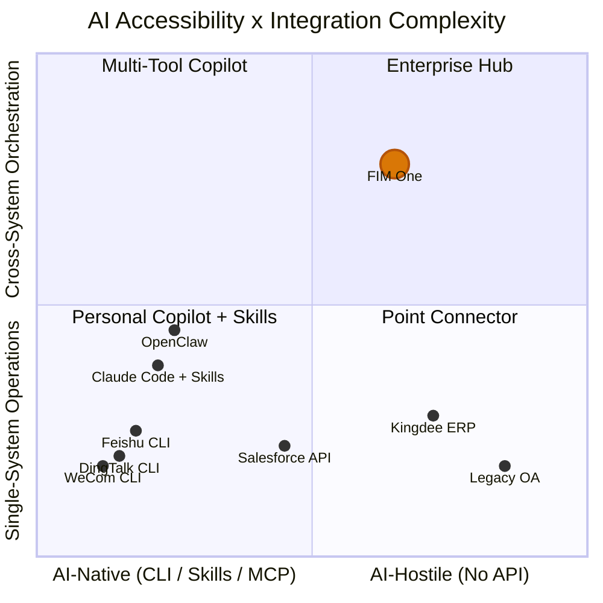

## 2026년 3월 신호

2026년 3월, 중국의 세 대형 직장 플랫폼이 같은 주 내에 CLI 도구를 오픈소스화했습니다:

- **DingTalk**은 `dws` 출시 — 12개 비즈니스 도메인에 걸친 104개 도구
- **Feishu/Lark**은 `lark-cli` 출시 — 11개 도메인에 걸친 200+ 명령어
- **WeCom**은 `wecom-cli` 출시 — 7개 비즈니스 도메인 커버

이들 중 누구도 MCP를 선택하지 않았습니다. 세 회사 모두 `npx skills add`를 통해 배포되는 사전 패키징된 AI Skills를 포함한 순수 CLI 도구를 출시했습니다. 이는 AI 에이전트가 엔터프라이즈 시스템과 어떻게 통신해야 하는지에 대해 업계가 집단적으로 입장을 보인 첫 번째 사례입니다 — 그리고 그 답은 프로토콜이 아니라 패키징 형식이었습니다.

이 문서는 이것이 AI-시스템 통합 전반에 무엇을 의미하는지, 그리고 FIM One의 전략에 특히 무엇을 의미하는지 분석합니다.

## AI 시스템 통합을 위한 세 가지 패러다임

### 1. REST API (Traditional)

기본 방식입니다. 모든 SaaS 플랫폼은 OpenAPI 스펙으로 문서화된 HTTP 엔드포인트를 노출합니다. AI 통합을 위해서는 어댑터 레이어가 필요합니다 — "이 헤더와 JSON 본문으로 이 API 엔드포인트를 호출하세요"를 "지능체가 호출할 수 있는 도구입니다"로 변환하는 무언가가 필요합니다.

이것이 FIM One의 ConnectorToolAdapter가 오늘날 하는 일입니다. 작동하지만, 각 통합에는 사용자 정의 작업이 필요합니다: API 문서 읽기, 인증 처리, 응답 형식 매핑, 페이지네이션 처리.

- **사용자**: 모든 SaaS 플랫폼, 레거시 통합
- **AI 통합**: 어댑터 레이어 필요 (ConnectorToolAdapter, 사용자 정의 코드)
- **장점**: 범용적, 잘 이해됨, 구조화된 JSON I/O
- **단점**: 각 통합에 사용자 정의 개발 노력 필요

### 2. CLI + Skills (Emerging)

플랫폼은 컴파일된 CLI 바이너리를 제공합니다. AI 통합은 사전 패키징된 Skill 파일을 통해 이루어집니다 — AI IDE에 CLI 명령을 subprocess를 통해 호출하는 방법을 알려주는 마크다운 문서입니다. 배포는 npm을 통해 이루어집니다: `npx skills add dingtalk/dws`.

AI는 Skill 파일을 읽고, 사용 가능한 명령과 그 인자가 무엇인지 이해한 후, CLI를 subprocess로 호출합니다. 출력은 일반적으로 자유 텍스트(테이블, 포맷된 문자열)이며 AI가 파싱해야 합니다.

- **사용자**: DingTalk, Feishu, WeCom (모두 2026년 3월에 선택)
- **AI 통합**: `npx skills add platform/cli` — AI IDE가 Skill 마크다운을 읽고 CLI 명령을 호출
- **장점**: 빠른 배포, Skills 형식을 지원하는 모든 AI IDE에서 작동
- **단점**: 비정형 텍스트 출력 (AI가 파싱해야 함), 표준화된 검색 프로토콜 없음, 단일 플랫폼 범위

### 3. MCP (Model Context Protocol)

JSON-RPC over stdio or SSE. Structured tool discovery (`tools/list`) and invocation (`tools/call`). The AI client negotiates capabilities with the server, gets a typed schema for every tool, and receives structured `CallToolResult` responses.

- **Who uses it**: Anthropic ecosystem, growing number of developer tools
- **AI integration**: Native protocol — structured I/O, schema-based discovery
- **Strength**: Standardized, structured, composable, built for multi-tool orchestration
- **Weakness**: Higher implementation cost, not yet adopted by major workplace platforms

### 비교

| 차원 | REST API | CLI + Skills | MCP |
|-----------|----------|-------------|-----|
| 표준화 | 중간 (OpenAPI) | 낮음 (공급업체별 Skills) | 높음 (JSON-RPC 프로토콜) |
| AI 친화성 | 낮음 (어댑터 필요) | 중간 (텍스트 I/O, AI로 파싱됨) | 높음 (구조화된 JSON I/O) |
| 검색 메커니즘 | OpenAPI 사양 / 문서 | `--help` + Skill markdown | `tools/list` 프로토콜 엔드포인트 |
| 출력 형식 | 구조화된 JSON | 자유 텍스트 (AI 파싱 필요) | 구조화된 `CallToolResult` |
| 출시 시간 | 주 단위 (통합당) | 일 단위 (기존 API 래핑) | 주 단위 (프로토콜 구현) |
| 크로스 플랫폼 오케스트레이션 | 허브 필요 | 내장되지 않음 | 내장되지 않음 |
| 엔터프라이즈 거버넌스 | 허브 필요 | 내장되지 않음 | 내장되지 않음 |

## 주요 플랫폼이 실제로 선택한 것

| | DingTalk `dws` | Feishu `lark-cli` | WeCom `wecom-cli` |
|---|---|---|---|
| 언어 | Go | Go + Python | Rust + TS |
| 도구 | 104 / 12개 도메인 | 200+ / 11개 도메인 | 7개 도메인 |
| MCP 지원 | 아니오 | 아니오 | 아니오 |
| AI 통합 | Markdown Skills + schema introspection | 19개 npm Skills (`npx skills add`) | 12개 npm Skills (`npx skills add`) |
| 출력 형식 | JSON / table / raw + `--jq` | JSON / table / csv / ndjson | JSON |
| 에이전트 친화적 플래그 | `--yes`, `--dry-run`, smart input correction | `--no-wait`, `--as user/bot`, `--dry-run` | Direct JSON params |
| 검색 | `dws schema` (self-introspection) | `lark-cli schema` (self-introspection) | Skill 파일을 통해서만 |

핵심 관찰: `npx skills add`는 MCP를 우회하는 AI 도구 통합을 위한 사실상의 배포 채널이 되고 있습니다. 이 플랫폼들은 프로토콜 표준화보다 빠른 출시 속도를 선택했습니다. AI IDE 생태계(Cursor, Claude Code, Windsurf)는 이미 Skills 파일을 이해하므로, 플랫폼들은 프로토콜 서버를 구현하지 않고도 즉시 AI 통합을 얻을 수 있습니다.

## AI 접근성 스펙트럼

모든 시스템이 AI에 동등하게 접근 가능한 것은 아니며, 모든 작업이 동등하게 간단한 것도 아닙니다. 이 두 가지 차원이 서로 다른 통합 접근 방식이 가치를 창출하는 위치를 정의합니다.

**차트 읽기:**

- **좌하단 (Personal Copilot + Skills)**: 간단한 작업을 수행하는 AI-native 플랫폼입니다. DingTalk, Feishu, WeCom이 여기에 집중되어 있습니다 — 자체 CLI + Skills를 제공하여 단일 플랫폼 AI 통합을 셀프서비스로 만듭니다. OpenClaw 및 Claude Code with Skills 같은 Personal copilot이 이 영역을 차지합니다. FIM One은 여기서 거의 가치를 더하지 않습니다 — 플랫폼이 이미 작업을 완료했기 때문입니다.
- **좌상단 (Multi-Tool Copilot)**: 크로스 시스템 요구사항이 있는 AI-native 플랫폼입니다. Claude Code에서 여러 Skills(`dingtalk` + `feishu` + `wechat`)를 설치하는 사용자는 다중 플랫폼 조정을 시도할 수 있지만, 거버넌스, 오케스트레이션 계획, 통합 자격증명 관리가 부족합니다.
- **우하단 (Point Connector)**: 간단한 브리지가 필요한 레거시 시스템입니다. Kingdee ERP 또는 레거시 OA 시스템에 대한 단일 Connector — FIM One은 이러한 시스템에 CLI가 없고 API가 제한적이거나 없기 때문에 단일 시스템 작업에서도 어댑터로서 유용합니다.
- **우상단 (Enterprise Hub)**: 크로스 시스템 오케스트레이션 요구사항이 있는 레거시 또는 API 제한 시스템입니다. 이것이 FIM One의 최적 영역입니다. 레거시 관리 시스템 전체에서 계약을 조회하고, ERP 수금액과 상관관계를 파악하고, DingTalk를 통해 수금 통지를 보내는 것 — 이는 DAG 계획, 다중 Connector 조정, 자격증명 보관소, 감사 추적, 인적 확인 게이트가 필요합니다. 어떤 Personal copilot, CLI, Skills 파일도 여기에 도달할 수 없습니다.

FIM One의 가치는 우상단으로 이동할수록 증가합니다: 도달하기 어려운 시스템과 더 복잡한 오케스트레이션 요구사항의 조합입니다. 자체 CLI + Skills를 제공하는 플랫폼은 반대 모서리를 차지합니다 — 접근하기 쉽고, 간단한 작업 — 그리고 FIM One이 추구하지 않아야 할 시장을 나타냅니다.

## 개인용 Copilot vs 엔터프라이즈 Hub

개인용 AI copilot(OpenClaw, Claude Code, Cursor, Windsurf)의 확산은 포지셔닝 문제를 제기합니다. 두 가지 근본적으로 다른 모델이 존재합니다:

### 개인 Copilot

- **사용자**: 개별 개발자 또는 지식 근로자
- **데이터 범위**: 내 캘린더, 내 이메일, 내 문서
- **인증**: 내 개인 token, 내 OAuth 세션
- **통합 범위**: 단일 사용자, 소수 플랫폼, 개인 생산성
- **거버넌스**: 필요 없음 — 내 데이터, 내 작업

### Enterprise Connector Hub

- **User**: Organization (teams, departments, cross-functional workflows)
- **Data scope**: Cross-department, cross-system, includes sensitive and regulated data
- **Authentication**: Admin-assigned permissions, least-privilege, credential vaulting
- **Integration scope**: Multi-system orchestration, business process automation
- **Governance**: Audit logs, RBAC, confirmation gates, compliance requirements

These are complementary, not competitive. As personal copilots proliferate, enterprises will need a central hub to govern what those copilots can access. An individual using Claude Code with `npx skills add dingtalk/dws` can read their own DingTalk messages. But when an AI 智能体 needs to orchestrate across DingTalk, the company ERP, and the finance system — with audit trails, permission controls, and human confirmation for write operations — that is a different problem entirely.

Personal copilots commoditize simple single-platform operations. This is not FIM One's market. FIM One's market is the cross-system, governance-required, legacy-inclusive enterprise integration that no personal copilot can handle.

## FIM One의 전략적 함의

| 우선순위 | 조치 | 근거 |
|----------|--------|-----------|
| 현재 방향 유지 | Connector 아키텍처에 대한 투자 지속 (레거시/API 시스템) | 이것이 경쟁력 — CLI + Skills는 레거시 시스템에 절대 도달할 수 없음 |
| MCP 수용 | MCP Server 지원 이미 구축됨 (MCPServerMetaTool) — 계속 정교화 | MCP는 구조화된 프로토콜 베팅; 일부 플랫폼은 결국 채택할 것 |
| Skills 모니터링 | `npx skills add` 생태계 추적하되 쫓아가지 말 것 | Skills는 배포 문제를 해결하는데 FIM One은 이 문제가 없음 |
| 거버넌스로 차별화 | 감사, RBAC, 확인 게이트, 자격증명 관리 | 개인용 코파일럿은 절대 엔터프라이즈 거버넌스를 제공할 수 없음 |
| 명확한 포지셔닝 | "당신의 시스템이 AI를 만나는 허브" — "DingTalk를 호출하는 또 다른 방법"이 아님 | 플랫폼이 무료로 제공하는 단순 통합으로 경쟁하지 말 것 |

최악의 전략적 결정은 CLI + Skills 물결에 반응하여 이미 자체 Skills를 제공하는 플랫폼을 위한 Skills 어댑터를 구축하는 것입니다. 이는 플랫폼 벤더 자체와의 하향식 경쟁입니다. 올바른 대응은 그 벤더들이 절대 도달할 수 없는 시스템에 집중하는 것입니다.

## CLI, Skills, 및 MCP 간의 관계

이 세 가지 개념은 서로 다른 계층에서 작동하며 논의에서 종종 혼동됩니다. 정확한 구분은 다음과 같습니다:

- **CLI**는 사용자 인터페이스입니다 — 셸 명령어, 텍스트 I/O, 시스템과 상호작용하는 형식
- **Skills**는 배포 메커니즘입니다 — AI에게 CLI 명령어 호출 방법을 가르치는 마크다운 파일, AI 도구 통합을 위한 패키징 형식
- **MCP**는 프로토콜입니다 — JSON-RPC, 구조화된 검색 및 호출, AI-도구 통신을 위한 상호운용성 표준

장기적으로 이들은 서로를 대체할 수 없습니다. CLI는 인간(또는 AI 서브프로세스)이 도구와 상호작용하는 방식입니다. Skill 파일은 해당 CLI가 AI IDE로 배포되는 방식입니다. MCP는 프로토콜 수준에서 구조화되고 스키마 타입이 지정되며 구성 가능한 통합이 작동하는 방식입니다.

그러나 단기적으로(2026년), CLI + Skills는 MCP보다 구현이 저렴하기 때문에 채택 속도에서 우위를 점하고 있습니다. 기존 CLI를 가진 플랫폼은 하루 안에 Skill 파일을 배포할 수 있습니다. MCP 서버를 구현하려면 몇 주가 걸리며 프로토콜 사양, 전송 계층 및 기능 협상을 이해해야 합니다.

가능한 수렴: 오늘날 CLI를 배포하는 플랫폼은 내일 이를 MCP 서버로 래핑할 수 있습니다. MCP의 stdio 전송은 이미 CLI 프로세스를 시작합니다 — "Skills로 호출된 CLI"와 "MCP 서버로 래핑된 CLI" 간의 차이는 작습니다. 하지만 이 수렴은 보장되지 않습니다. Skills 생태계가 충분히 빠르게 성장하고 AI IDE가 이를 표준화한다면, MCP는 엔터프라이즈 도구 표준이 아닌 개발자 도구 프로토콜로 남을 수 있습니다.

FIM One의 경우 결론은 명확합니다: 배포 계층(Skills)이 아닌 프로토콜 계층(MCP)과 거버넌스 계층(Connector 아키텍처)에 투자하세요. 배포는 플랫폼 공급업체에게 해결된 문제입니다. 프로토콜과 거버넌스는 허브가 지속적인 가치를 창출하는 곳입니다.
