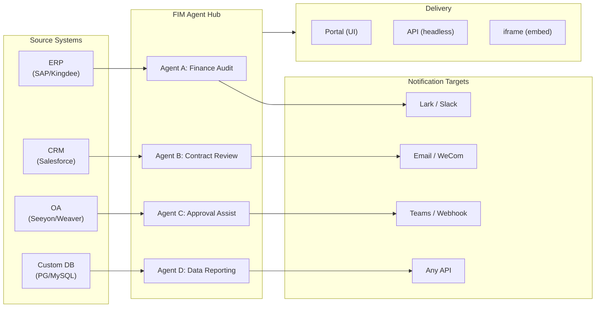

> Goal: Build an **AI-powered Connector Hub** — Standalone (portal assistant), Copilot (embedded in host system), Hub (central cross-system orchestration).
>
> Principles: **Provider-agnostic** (no vendor lock-in), **minimal-abstraction**, **protocol-first**, **connector-first** (integration is the core value).

## Product Vision

FIM Agent is an **AI Connector Hub** that serves three progressive modes:

```
Standalone   → Your own AI assistant (Portal)
Copilot      → AI embedded in a host system (iframe / widget / embed)
Hub          → Central cross-system orchestration (Portal / API)
```

**Hub Mode is the core differentiator.** Enterprise clients have legacy systems — ERP, CRM, OA, finance, HR — that need to talk to each other through AI:



**GTM path: Land and Expand**

| Step | Mode | What happens |
|------|------|-------------|
| Land | Copilot | Embed into one system, prove value inside their UI |
| Expand | Copilot → Hub | Roll out to more systems; Hub aggregates them |

## Shipped Versions

### v0.1 (2025-08-01) — MVP: ReAct + DAG Planner
- ReActAgent with tools (calculator, python_exec, web_search)
- DAG Planner (LLM generates dependency graphs)
- Portal UI with streaming + KaTeX

### v0.2 (2025-09-15) — Multi-Model + Memory
- Retry / rate limiting / usage tracking
- Native function calling (no JSON-only parsing)
- Multi-model support (fast + main LLM)
- Memory: WindowMemory, SummaryMemory
- FastAPI backend with SSE streaming

### v0.3 (2025-10-20) — Web Tools + MCP
- Web tools (web_search, web_fetch) via Jina/Tavily/Brave
- File operations tool
- MCP client (standard tool integration)
- Tool auto-discovery + categories
- DAG visualization with click-to-scroll
- Code exec in Docker (`--network=none`)

### v0.4 (2025-11-15) — Multi-Turn + Agents
- Multi-turn conversations (DbMemory)
- Tool step folding UI
- HTTP request + shell exec tools
- Agent management (create, configure, publish)
- JWT authentication
- Per-agent execution mode + temperature control

### v0.5 (2025-12-20) — Full RAG + Grounded Gen
- Full RAG pipeline (embedding + vector store + FTS + RRF + reranker)
- Grounded Generation (citations, conflict detection, confidence scores)
- Knowledge base document management (CRUD, search, retry, schema migration)
- ContextGuard + pinned messages (token budget manager)
- DbMemory persistence + LLM Compact
- DAG Re-Planning (up to 3 rounds)

### v0.6 (2026-01-10) — Connector Platform
- **Connector CRUD**: create, read, update, delete
- **ConnectorToolAdapter**: converts Connector → BaseTool
- **Per-user credentials**: AES-GCM encryption
- **Confirmation gate**: write operation approval
- **Audit logging**: all tool calls recorded
- **Circuit breaker**: graceful degradation on failures
- **Utility tools**: email_send, json_transform, template_render, text_utils
- **Embedding options**: Jina, OpenAI, custom providers

### v0.7 (2026-02-07) — Admin Platform + Multi-Tenant
- **Admin Platform**: user management, role toggle, password reset, account enable/disable
- **Invite-only registration**: three modes (open/invite/disabled) + invite code CRUD
- **Storage management**: per-user disk usage, clear, orphan cleanup
- **Conversation moderation**: admin list/delete all
- **Per-user force logout**: revoke all tokens
- **API health dashboard**: system stats, connector metrics
- **First-run setup wizard**: guided admin account creation
- **Personal Center**: per-user global instructions, language preference
- **JWT auth**: token-based SSE auth, conversation ownership
- **Global MCP servers**: admin-provisioned, loaded in all sessions
- **Backward-compat**: registration_enabled → registration_mode auto-migration

### v0.7.x (2026-02-21 onwards) — Stability + Polish
- Invite code management
- Per-user quotas (429 enforcement)
- Structured audit logging
- Sensitive word filtering
- Admin login history
- Admin file browser
- Enhanced admin views (model_name, tools, kb_ids fields)
- Docker Compose deployment (single image, named volumes)
- OAuth auto-detection from window.location
- Extended thinking / reasoning support (`LLM_REASONING_EFFORT`, `LLM_REASONING_BUDGET_TOKENS`) for OpenAI o-series, Gemini 2.5+, Claude
- Admin per-tool enable/disable (disabled tools excluded from chat at runtime)
- MCP servers management moved to Connectors page
- Dual database support: SQLite (zero-config default) + PostgreSQL (production); Docker Compose auto-provisions PostgreSQL
- Models configuration documentation page with extended thinking setup per provider

## Planned Versions

### v0.7.x (continued) — Builder Agent Hardening

- **Builder prompt auto-refresh (Method A)**: On every `POST /api/builder/session`, overwrite `instructions` on the existing builder agent even if it already exists. This ensures new deployments with improved builder prompts are picked up without manual DB intervention or stale sessions. Currently the session endpoint returns early if the agent already exists, leaving old prompts in place.

### v0.8 — Connector Declarative Config + RBAC

**Goal**: Make it easier to define connectors without writing Python code.

- **YAML/JSON connector config**: platform auto-generates MCP server
- **Connector import/export**: share connector templates
- **Connector fork**: clone + customize existing connectors
- **Database connectors**: direct SQL access (PostgreSQL, MySQL, Oracle)
- **Message push**: Lark, WeCom, Slack, Email notification actions
- **RBAC**: per-user/role connector access control
- **Operation audit**: detailed logging of who did what

**Impact**: Implementation engineers (no Python required) can add connectors in 1-2 hours.

### v0.9 — Observability + Production Hardening

**Goal**: Production-grade operations and debugging.

- **Distributed tracing**: OpenTelemetry integration
- **Circuit breaker**: exponential backoff, failure detection
- **Observability**: metrics (latency, success rate, token usage)
- **Connector analytics**: usage patterns, failure modes
- **Sandbox hardening**: v2 improvements to code execution isolation
- **Docker Compose**: full deployment stack
- **Performance testing**: concurrent load benchmarks

**Impact**: Run FIM Agent at scale with confidence.

### v1.0 — Hot-Plug + Embeddable

**Goal**: Zero-restart connector addition and embedded delivery.

- **Hot-plug connectors**: upload OpenAPI spec, AI generates config, live in 5 minutes (no restart)
- **Connector marketplace**: community-shared templates
- **Embeddable widget**: `<script src="fim-agent.js">` injected into host page
- **Page context injection**: widget reads host page context (current ID, URL, DOM selectors)
- **Scheduled jobs**: cron-like DAG triggers
- **Webhooks**: inbound event triggers
- **Batch execution**: process 1000+ items via DAG
- **Admin dashboard**: full management UI
- **Enterprise security**: IP whitelisting, encryption at rest, SSO
- **Semantic memory**: cross-session memory retrieval
- **Memory lifecycle**: TTL, importance scoring, semantic similarity

**Impact**: Enterprises deploy FIM Agent from zero to multi-system orchestration in days.

## Frozen Features (Shipped, Maintain Only)

Per the [Orthogonality Strategy](/strategy/orthogonality-strategy), these features are shipped and working but will not receive new capabilities (bug fixes only):

| Feature | Version | Why frozen |
|---------|---------|-----------|
| ReAct Agent | v0.1 | Models now have native tool calling |
| DAG Planning / Re-Planning | v0.1, v0.5 | Model reasoning capabilities improving; decomposition becoming single-shot |
| Memory (Window, Summary, Compact) | v0.2, v0.5 | Context windows growing (200K+); less need for external memory management |
| RAG pipeline | v0.5 | Providers building retrieval natively (OpenAI file_search, Gemini Search Grounding) |
| Grounded Generation | v0.5 | Models improving at citations; 5-stage pipeline adds diminishing value |
| ContextGuard / Pinned Messages | v0.5 | Shipping as-is; no new features |

## Consider (Deferred Indefinitely)

Per the Orthogonality Strategy, these would be high-effort and face absorption risk:

| Feature | Why deferred |
|---------|------------|
| Multi-Agent Orchestration | Providers building natively (OpenAI Swarm, Claude Code Teams, Google A2A) |
| Semantic Memory Store | Context windows growing; providers adding native memory (ChatGPT Memory, Claude Projects) |
| Memory Lifecycle | Same as above; engineering cost high relative to shrinking gap |

## How Versions Align With Modes

| Version | Standalone | Copilot | Hub | Notes |
|---------|-----------|---------|-----|-------|
| **v0.1–v0.3** | Working | Not yet | Not yet | Portal-only, single-user |
| **v0.4** | Working | Not yet | Not yet | Multi-conversation, agent management |
| **v0.5** | Working | Not yet | Not yet | Knowledge base + RAG |
| **v0.6** | Working | Possible | Possible | Connectors ship; Copilot/Hub possible with manual wiring |
| **v0.7** | Working | Ready | Ready | Admin platform; multi-tenant auth; ready for production |
| **v0.8** | Working | Ready | Optimized | RBAC + audit log per-system; easier to onboard |
| **v0.9** | Working | Ready | Production | Observability, performance, hardening |
| **v1.0** | Working | Optimized | Enterprise | Hot-plug, marketplace, scheduled jobs, webhooks, batch |

## Resource Allocation (v0.8–v1.0)

The Orthogonality Strategy shapes where effort goes:

| Category | Allocation | Versions | Why |
|----------|-----------|----------|-----|
| **Connector Platform** (v0.6+) | 60% | Ongoing | Core differentiation; no absorption risk |
| **Enterprise Features** (RBAC, audit, security) | 25% | v0.8–v1.0 | Boring but durable; production requirement |
| **Embedded/Delivery** (widget, hot-plug) | 10% | v0.9–v1.0 | Strategic for land-and-expand GTM |
| **v0.1–v0.5 maintenance** | 5% | Ongoing | Bug fixes only; no new features |

## Metric-Driven Milestones

Success is measured by:

| Metric | v0.7 Target | v0.8 Target | v1.0 Target |
|--------|------------|------------|------------|
| Connectors deployed | 5 | 20+ | 100+ |
| Enterprise customers | 1–2 | 5–10 | 20+ |
| Avg connector setup time | 2 weeks | 2 days | 5 minutes (hot-plug) |
| Token efficiency (DAG vs ReAct-only) | 30% reduction | 40% reduction | 50% reduction |
| Uptime SLA | 99.5% | 99.9% | 99.95% |
| Support ticket themes | Integration, setup | Connector custom logic | Hot-plug, scaling |

## Open Questions / TBD

- **Marketplace moderation**: How to validate community connectors? (v1.0)
- **Token economics**: How to price multi-user, multi-agent scenarios? (v1.0)
- **Telemetry opt-out**: How to honor privacy preferences? (v0.8)
- **Connector versioning**: How to manage breaking changes in connector APIs? (v0.8)
- **Rate limiting**: Per-connector, per-user, or global? (v0.8)

