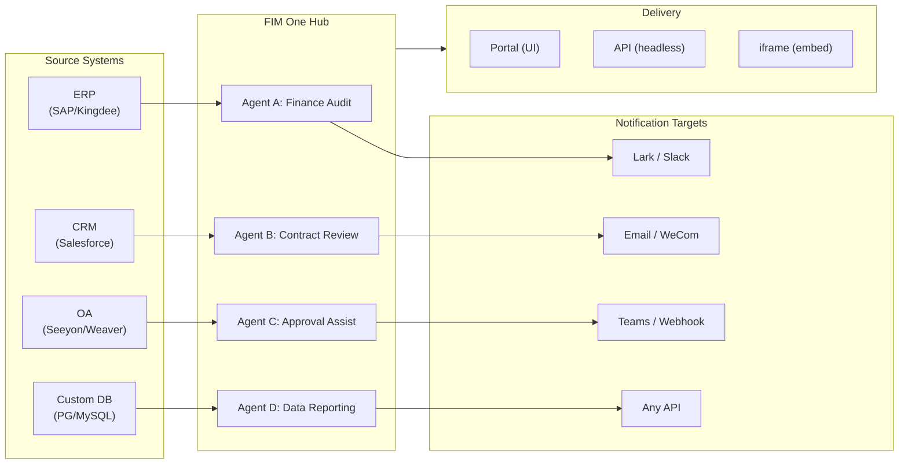

> Goal: Build an **AI-powered Connector Hub** — Standalone (portal assistant), Copilot (embedded in host system), Hub (central cross-system orchestration).
>
> Principles: **Provider-agnostic** (no vendor lock-in), **minimal-abstraction**, **protocol-first**, **connector-first** (integration is the core value).

## Product Vision

FIM One is an **AI Connector Hub** that serves three progressive modes:

```
Standalone   → Your own AI assistant (Portal)
Copilot      → AI embedded in a host system (iframe / widget / embed)
Hub          → Central cross-system orchestration (Portal / API)
```

**Hub Mode is the core differentiator.** Enterprise clients have legacy systems — ERP, CRM, OA, finance, HR — that need to talk to each other through AI:



**GTM path: Land and Expand**

| Step | Mode | What happens |
|------|------|-------------|
| Land | Copilot | Embed into one system, prove value inside their UI |
| Expand | Copilot → Hub | Roll out to more systems; Hub aggregates them |

## Shipped Versions

### v0.1 (2026-02-22) — MVP: ReAct + DAG Planner
- ReActAgent with tools (calculator, python_exec, web_search)
- DAG Planner (LLM generates dependency graphs)
- Portal UI with streaming + KaTeX

### v0.2 (2026-02-24) — Multi-Model + Memory
- Retry / rate limiting / usage tracking
- Native function calling (no JSON-only parsing)
- Multi-model support (fast + main LLM)
- Memory: WindowMemory, SummaryMemory
- FastAPI backend with SSE streaming

### v0.3 (2026-02-25) — Web Tools + MCP
- Web tools (web_search, web_fetch) via Jina/Tavily/Brave
- File operations tool
- MCP client (standard tool integration)
- Tool auto-discovery + categories
- DAG visualization with click-to-scroll
- Code exec in Docker (`--network=none`)

### v0.4 (2026-02-25) — Multi-Turn + Agents
- Multi-turn conversations (DbMemory)
- Tool step folding UI
- HTTP request + shell exec tools
- Agent management (create, configure, publish)
- JWT authentication
- Per-agent execution mode + temperature control

### v0.5 (2026-02-28) — Full RAG + Grounded Gen
- Full RAG pipeline (embedding + vector store + FTS + RRF + reranker)
- Grounded Generation (citations, conflict detection, confidence scores)
- Knowledge base document management (CRUD, search, retry, schema migration)
- ContextGuard + pinned messages (token budget manager)
- DbMemory persistence + LLM Compact
- DAG Re-Planning (up to 3 rounds)

### v0.6 (2026-03-01) — Connector Platform
- **Connector CRUD**: create, read, update, delete
- **ConnectorToolAdapter**: converts Connector → BaseTool
- **Per-user credentials**: AES-GCM encryption
- **Confirmation gate**: write operation approval
- **Audit logging**: all tool calls recorded
- **Circuit breaker**: graceful degradation on failures
- **Utility tools**: email_send, json_transform, template_render, text_utils
- **Embedding options**: Jina, OpenAI, custom providers

### v0.7 (2026-03-06) — Admin Platform + Multi-Tenant
- **Admin Platform**: user management, role toggle, password reset, account enable/disable
- **Invite-only registration**: three modes (open/invite/disabled) + invite code CRUD
- **Storage management**: per-user disk usage, clear, orphan cleanup
- **Conversation moderation**: admin list/delete all
- **Per-user force logout**: revoke all tokens
- **API health dashboard**: system stats, connector metrics
- **First-run setup wizard**: guided admin account creation
- **Personal Center**: per-user global instructions, language preference
- **JWT auth**: token-based SSE auth, conversation ownership
- **Global MCP servers**: admin-provisioned, loaded in all sessions
- **Backward-compat**: registration_enabled → registration_mode auto-migration

### v0.7.x (2026-03-07 to 2026-03-12) — Stability + Polish
- Invite code management
- Per-user quotas (429 enforcement)
- Structured audit logging
- Sensitive word filtering
- Admin login history
- Admin file browser
- Enhanced admin views (model_name, tools, kb_ids fields)
- Docker Compose deployment (single image, named volumes)
- OAuth auto-detection from window.location
- Extended thinking / reasoning support (`LLM_REASONING_EFFORT`, `LLM_REASONING_BUDGET_TOKENS`) for OpenAI o-series, Gemini 2.5+, Claude
- Admin per-tool enable/disable (disabled tools excluded from chat at runtime)
- MCP servers management moved to Connectors page
- Dual database support: SQLite (zero-config default) + PostgreSQL (production); Docker Compose auto-provisions PostgreSQL
- Models configuration documentation page with extended thinking setup per provider
- SSE Protocol v2: real-time answer streaming with `delta_reasoning`, `usage` fields, and split `done`/`suggestions`/`title`/`end` events; SQLite pool size 5 -> 20
- AI Builder expansion: 7 new builder tools (GetSettings, TestConnection, ImportOpenAPI for connectors; ListConnectors, AddConnector, RemoveConnector, SetModel for agents), `is_builder` flag on agents, builder prompt auto-refresh, SSRF guard
- SSE v2 frontend: streaming dot-pulse cursor, DAG re-plan round snapshots as collapsible cards, DAG layout decoupled from step states
- AI Builder concept documentation page with connector and agent builder guides
- Organization system: full CRUD with role-based membership (owner/admin/member), admin management UI
- Three-tier resource visibility (personal/org/global) for agents, connectors, knowledge bases, MCP servers
- Publish/unpublish API for all resource types; owner delegation for published agents
- Admin set-visibility endpoint (replaces clone-to-global); unified `build_visibility_filter()` query helper
- Database Connectors (Phase 1-3): direct SQL access to PG/MySQL/Oracle/SQL Server + Chinese legacy DBs; schema introspection, AI annotation, read-only query execution, encrypted credentials, 3 tools per connector (`list_tables`, `describe_table`, `query`)
- **Evaluation Center**: quantitative agent quality benchmarking — test dataset CRUD (prompt + expected behavior + assertions), eval runs (parallel execution + LLM grader + per-case pass/fail/latency/token results), results viewer with auto-polling; migration `r8t0v2x4z567`
- Three model roles (General/Fast/Reasoning) with per-tier env config isolation; fast model no longer inherits main model settings
- `StepOutput` dataclass replacing plain string step results for structured data and artifact passing
- Tool cache for DAG execution — identical tool calls cached per-run with async lock stampede prevention (`DAG_TOOL_CACHE`)
- Per-step LLM verification with 1 retry on failure (`DAG_STEP_VERIFICATION`)
- Auto-routing: fast LLM classifies queries as ReAct or DAG; `/api/auto` endpoint; frontend 3-way mode toggle (`AUTO_ROUTING`)
- [x] ~~**Platform Organization + Resource Subscriptions**~~: Built-in Platform org auto-joins all users; Market API for subscribing to shared resources; Resource subscriptions table; org-based resource sharing replacing global visibility
- [x] ~~**Agent Auto-discovery and Sub-agent Binding**~~: `discoverable` flag on agents; `sub_agent_ids` whitelist; CallAgentTool for delegating tasks to specialist agents
- [x] ~~**MCP Server Credentials + Per-User Override**~~: `mcp_server_credentials` table; `PUT /api/mcp-servers/{id}/my-credentials` endpoint; `allow_fallback` flag for credential fallback behavior
- [x] ~~**Connector/KB Toggle**~~: `POST /api/connectors/{id}/toggle` and `POST /api/knowledge-bases/{id}/toggle` for suspending/resuming resources
- [x] ~~**Standalone KB Conversations**~~: `kb_ids` field on conversations for direct KB chat without agent binding

## Planned Versions

### v0.8 — Connector Declarative Config + Progressive Disclosure

**Goal**: Make it easier to define connectors without writing Python code, and optimize how tools and instructions are exposed to the LLM.

- [x] ~~**Database connectors**: direct SQL access (PostgreSQL, MySQL, Oracle)~~ *(shipped in v0.7.x — Phase 1-3)*
- [x] ~~**RBAC**: per-user/role connector access control~~ *(shipped in v0.7.x — org system + three-tier visibility)*
- [x] **Connector credential encryption + per-user override**: `connector_credentials` table, Fernet encryption via `CREDENTIAL_ENCRYPTION_KEY`, `allow_fallback` flag, `GET/PUT/DELETE /my-credentials` endpoints, per-user credential resolution in chat tool loading
- [x] **Publish review UI**: Org-level publish review system — review toggle per org, ReviewsSheet with approve/reject workflow, status badges on resource cards, review notice in publish dialog, resubmit for rejected resources
- [ ] **Connector Progressive Disclosure (Phase 1-2)**: single `ConnectorMetaTool` replaces per-action tools; system prompt receives lightweight **stubs** only (name + 1-line description, ~30 tokens/connector vs ~250 tokens/action); agent calls `discover(connector)` to load full action schema on demand — schema only loads when the model selects a connector, keeping the prompt prefix stable for caching. Mirrors Claude Code's `defer_loading: true` internal pattern. `execute` subcommand; feature flag for backward compatibility.
- [x] ~~**Agent Skill System + Compact Instructions**: On-demand skill loading for agent instructions — `Skill` model (name, content/SOP, optional scripts) attached to agents; referenced in system prompt by name only (~10 tokens/skill); agent calls `read_skill(name)` to load full content on demand. Reduces per-conversation instruction token cost by ~80% while allowing richer SOP libraries. Counterpart to ConnectorMetaTool's progressive disclosure applied at the instruction level. Enables the "指令 + 工具 + 技能" differentiation story. Also adds `compact_instructions` field to Agent model — per-agent compression priority list injected into `ContextGuard` when compacting (e.g., "preserve order IDs and amounts, drop raw API responses"), replacing the current static generic prompt. Inspired by Claude Code's Compact Instructions pattern.~~
- [ ] **YAML/JSON connector config**: platform auto-generates MCP server
- [ ] **Connector import/export**: share connector templates
- [ ] **Connector fork**: clone + customize existing connectors
- [ ] **Database connectors Phase 4**: enterprise drivers — Oracle (`oracledb`), SQL Server (`aioodbc`), 达梦 DM8 (`aioodbc` + DM ODBC), 南大通用 GBase (`aioodbc` + GBase ODBC)
- [ ] **Message push**: Lark, WeCom, Slack, Email notification actions
- [x] **Workflow Phase 2 Nodes**: Iterator, Loop, VariableAggregator, ParameterExtractor, ListOperation, Transform, DocumentExtractor, QuestionUnderstanding, HumanIntervention — 9 advanced node types with full frontend + backend + 150 new tests (275 total). Node retry with exponential backoff, safe expression evaluation. Stats panel with success rate bar. 12 built-in templates. Pane context menu (Paste, Select All, Fit View, Auto Layout).
- [x] **Workflow Phase 3 Nodes: SubWorkflow + ENV** — 2 new node types (25 nodes total), 14 new tests (306 total), 14 built-in templates. SubWorkflow: full DB-backed nested workflow executor with target workflow selection, variable mapping, and configurable depth limit to prevent infinite recursion. ENV: reads encrypted environment variables with key picker and fallback defaults. Full frontend (node components, config panels, palette entries, minimap colors). Per-node execution statistics panel (success rates, durations, failure counts sorted worst-first). `getNodeStats` API client + `NodeStatEntry` type. Keyboard shortcuts dialog (`?` key).
- [x] **Workflow Scheduled Triggers**: Per-workflow cron configuration with timezone, default inputs, and next-run-at calculation. Preset cron buttons, 30 trigger tests.
- [x] **Workflow API Triggers**: Public per-workflow API keys (`wf_` prefix) for external execution without user auth, with rate limiting. API key management dialog with generate/regenerate/revoke, trigger URL, and cURL/JS examples.
- [x] **Workflow Batch Execution**: `POST /batch-run` with up to 100 input sets, configurable parallelism (1-10), collapsible per-item results, JSON export. 14 batch execution tests.
- [x] **Workflow Execution Log Viewer**: Real-time chronological SSE event stream in the run panel with timestamps, color-coded badges, and event type filter toggles.
- [x] **Workflow Run Stats**: Backend batch-fetches run counts and success rates via GROUP BY subquery; frontend displays stats on workflow cards with color-coded success rate indicators.
- [x] **Workflow Scheduler Daemon**: Background async service polling every 60s for due cron-based workflows. Croniter timezone support, semaphore concurrency, `last_scheduled_at` tracking, webhook delivery. 14 tests.
- [x] **Workflow Import Conflict Resolver**: Detects unresolved agent/connector/KB/MCP references during import. Batch DB queries with visibility filtering, frontend toast warnings. 17 tests.
- [x] **Workflow Test-Node Execution**: Isolated single-node testing with mock variables, integrated into editor (config panel Test button + context menu). 23 tests.
- [x] **Workflow Version Diff**: Side-by-side blueprint comparison with node/edge change detection, color-coded indicators (added/removed/modified).
- [x] **Workflow Run Management**: Delete individual runs (`DELETE /runs/{run_id}`) and clear all completed runs (`DELETE /runs`), with frontend confirmation dialogs.
- [x] **Workflow Run Replay Overlay**: "View on Canvas" button in run history to overlay past execution results on the canvas, showing per-node status and output without re-executing.
- [x] **Workflow Favorites/Pinning**: Star/pin workflows to the top of the list with localStorage persistence.
- [x] **Workflow Run History Export**: Export run history as JSON file download with full run metadata and per-node results.
- [x] **Admin Workflows Management**: Admin panel tab for managing all workflows across users — list, toggle active/inactive, delete with confirmation.
- [x] **Workflow Blueprint System**: Visual workflow editor for designing and executing multi-step automation blueprints — `Workflow` / `WorkflowRun` ORM models, full CRUD + SSE execution API, import/export, duplicate, blueprint validation endpoint, `WorkflowEngine` with topological sort + semaphore-based concurrency + condition branching and 12 node types (Start, End, LLM, ConditionBranch, QuestionClassifier, Agent, KnowledgeRetrieval, Connector, HTTPRequest, VariableAssign, TemplateTransform, CodeExecution), `VariableStore` with `{{node_id.output}}` interpolation and `env.*` namespace, error strategies per node (STOP_WORKFLOW / CONTINUE / FAIL_BRANCH) with per-node timeout and advanced config UI, React Flow v12 visual editor with drag-and-drop palette + node config panel + variable picker combobox + add-node-on-edge + auto-layout (ELK.js) + run history sheet, Dify-style compact node design with ring-based run status styling and animated edge transitions, 4 built-in starter templates (Simple LLM Chain, Conditional Router, Knowledge-Augmented QA, HTTP API Pipeline) with template picker dialog and `GET /templates` + `POST /from-template` API, stats endpoint, `?run=true` URL param auto-open, subprocess-based code execution security, 105-test suite (templates, eval namespace flattening, blueprint validation warnings, node/edge deletion, import/export/duplicate, deadlock detection, multi-condition branching)
- [x] **Operation audit**: detailed logging of who did what — admin review log audit tab added (publish review trail per org/resource)
- [ ] **Semantic Schema Annotations**: extend connector schema fields with `semantic_tag`, `description`, and `pii` flags; annotations surfaced in LLM tool descriptions so the agent understands field intent without guessing from column names

**Impact**: Implementation engineers (no Python required) can add connectors in 1-2 hours. Token cost for tool definitions and agent instructions drops by ~80–93% at scale.

### v0.9 — Observability + Production Hardening

**Goal**: Production-grade operations, debugging, and monitoring. Introduces the **Hook System** — a deterministic enforcement layer that sits below agent instructions and cannot be overridden by the LLM.

- [ ] **Connector Progressive Disclosure (Phase 3-4)**: unified `ConnectorExecutor` interface (API/DB/MCP behind one abstraction); action parameter validation with `jsonschema`; protocol-agnostic discover/execute
- [ ] **Agent Trace Layer (Observability++)**: Application-level run/trace/thread hierarchy for agent debugging — each conversation → `Trace`, each LLM call / tool call / DAG step → `Span` with input/output/tokens/timing. Frontend trace viewer with timeline and expandable LLM call payloads. This goes beyond OTel (infrastructure-level) to provide actionable agent-loop debugging for developers and enterprise clients. OpenTelemetry export as a data sink option. Modeled after LangSmith's run/trace/thread concepts — the industry-validated pattern for agent observability.
- [ ] **Metrics dashboard**: latency, success rate, token usage, connector call analytics — per-agent, per-user, per-org breakdowns
- [ ] **Circuit breaker**: exponential backoff, failure detection
- [ ] **Agent Hook System**: A deterministic enforcement layer that runs **outside the LLM loop** — hooks execute automatically on tool events and cannot be bypassed by agent instructions. Three hook points: `PreToolUse` (validate / block before execution), `PostToolUse` (side effects after execution), `SessionStart` (inject dynamic context). Built-in hooks: auto-write `ConnectorCallLog` on every connector call (currently manual); block write operations when org is in read-only mode; auto-truncate oversized DB query results before they hit the agent; rate-limit per-connector call frequency. User-defined hooks: per-agent YAML config (`hooks:` field) declaring shell commands or Python callables triggered on matching tool events — same pattern as Claude Code's hooks. Key design principle: **hooks are for "must always happen" logic that should never depend on the LLM remembering to do it**. Instructions say "record all calls"; hooks actually record them. Instructions say "don't write in read-only mode"; hooks actually block it.
- [ ] **Agent Workspace (Tool Output Offloading + Handoff)**: When MCP / connector / DB tool responses exceed a threshold (default: 8K chars), auto-save full output to a per-conversation workspace file (`workspace://tool_result_xxx.txt`) and return a truncated preview + file URI to the agent. Three new builtin tools: `read_workspace_file(path, start_line, end_line)` for selective access, `list_workspace_files()` for discovery, and `write_handoff(summary)` for context transitions — agent writes a structured HANDOFF note (progress, what worked, what failed, next step) before context compression or session switch; the next agent instance reads it instead of relying on the compression algorithm's summary quality. Mirrors Claude Code's workspace + handoff patterns. Prevents attention dilution on large result sets and eliminates silent data loss from truncation. Minimal change: extend `truncate_tool_output()` in `MCPToolAdapter` and `ConnectorToolAdapter` to write to workspace storage.
- [ ] **Sandbox hardening**: v2 improvements to code execution isolation
- [ ] **Performance testing**: concurrent load benchmarks
- [ ] **MCP Connection Pooling**: per-request STDIO subprocess spawning doesn't scale — 100 concurrent users = 100 subprocesses per MCP server. Pool STDIO connections with per-user env isolation (keyed by `(server_id, env_hash)`); SSE/HTTP transports share `httpx.AsyncClient` sessions. Target: sub-100ms warm-start for pooled STDIO, O(1) HTTP connections per MCP server regardless of user count
- [ ] **Scheduled jobs + Event-triggered Agents (Loop)**: cron-like background task triggers; `scheduled_jobs` + `job_runs` DB tables; APScheduler integration; job CRUD API + job history UI; result notification via message push connectors. Scope covers both time-triggered (cron) and event-triggered (webhook inbound) patterns — an agent running asynchronously in the background IS the async sub-agent use case for Hub mode.
- [ ] **DB Schema Advanced Builder**: AI-driven schema management agent for large-scale databases — strategic table annotation (pattern-based, SQL-execution-informed), bulk visibility management by domain prefix, iterative multi-round annotation for 1K–7K+ table deployments; complements existing batch-annotation job with selectivity and business-context reasoning

**Impact**: Run FIM One at scale with confidence. Three architectural layers now complete: **Trace Layer** (see what happened), **Hook System** (enforce what must happen), **Agent Workspace** (agent manages its own data access). Together they close the gap between "instructions the agent might follow" and "guarantees the system enforces" — the difference between a demo and a production enterprise tool.

### v1.0 — Hot-Plug + Embeddable

**Goal**: Zero-restart connector addition and embedded delivery.

- [ ] **Connector Progressive Disclosure (Phase 5)**: **Semantic-Guided Tool Selection** (entity extraction from query → Ontology Registry lookup → connector set reduction; 90%+ token reduction for 50+ connector deployments); Scale mode for batch/ETL connectors; CLI-style universal `connector <name> <action> <params>` interface
- [ ] **Cross-Connector Entity Alignment (Ontology Registry)**: define shared entity types (Customer, Order, Asset) with field mappings across connectors; DAGPlanner auto-resolves cross-system JOIN keys; enables cross-connector queries (e.g., "customers in Salesforce who ordered in Shopify") without hardcoded field names
- [ ] **Hot-plug connectors**: upload OpenAPI spec, AI generates config, live in 5 minutes (no restart)
- [ ] **Connector marketplace**: community-shared templates
- [ ] **Embeddable widget**: `<script src="fim-one.js">` injected into host page
- [ ] **Page context injection**: widget reads host page context (current ID, URL, DOM selectors)
- [ ] **Advanced triggers**: Webhook inbound events; scheduled job enhancements (multi-timezone, calendar-aware)
- [ ] **Batch execution**: process 1000+ items via DAG
- [ ] **Enterprise security**: IP whitelisting, encryption at rest, SSO
- [ ] **KB Advanced Editor**: Builder-mode agent for power users managing large knowledge bases — bulk URL ingestion, duplicate detection, gap analysis, document lifecycle management; extends existing KB AI chat with ReAct tool loop

**Impact**: Enterprises deploy FIM One from zero to multi-system orchestration in days.

## Frozen Features (Shipped, Maintain Only)

Per the [Orthogonality Strategy](/strategy/orthogonality-strategy), these features are shipped and working but will not receive new capabilities (bug fixes only):

| Feature | Version | Why frozen |
|---------|---------|-----------|
| ReAct Agent | v0.1 | Models now have native tool calling |
| DAG Planning / Re-Planning | v0.1, v0.5, v0.7.5 | Model reasoning capabilities improving; decomposition becoming single-shot. Per-step verification shipped in v0.7.5 (`DAG_STEP_VERIFICATION`) — no further planning primitives planned |
| Memory (Window, Summary, Compact) | v0.2, v0.5 | Context windows growing (200K+); less need for external memory management |
| RAG pipeline | v0.5 | Providers building retrieval natively (OpenAI file_search, Gemini Search Grounding) |
| Grounded Generation | v0.5 | Models improving at citations; 5-stage pipeline adds diminishing value |
| ContextGuard / Pinned Messages | v0.5 | Shipping as-is; no new features |

## Consider (Deferred Indefinitely)

Per the Orthogonality Strategy, these would be high-effort and face absorption risk:

| Feature | Why deferred |
|---------|------------|
| Multi-Agent Orchestration (deep hierarchies) | Providers building natively (OpenAI Swarm, Claude Code Teams, Google A2A). FIM One's CallAgentTool covers the one-level delegation case; event-triggered background agents are covered by Scheduled Jobs in v0.9 |
| Agent Self-modifying Skills (Procedural Memory) | Agents updating their own `skill.md` during execution — high complexity, safety/audit surface area. Depends on Agent Skill System (v0.8) shipping first. Re-evaluate if enterprise customers request self-improving agents explicitly |
| ~~Agent Workspace (Tool Output File Offloading)~~ | Promoted to v0.9. The value is **selective reading**, not context capacity — Claude Code validation confirmed. Original deferral reasoning ("200K+ windows reduce urgency") was wrong. |
| Cross-Session Long-Term Memory | Context windows growing rapidly (200K–2M); providers adding built-in memory (OpenAI memory, Gemini context caching); high implementation cost vs diminishing differentiation value. Re-evaluate when enterprise customers explicitly request it |
| Memory Lifecycle (TTL, quotas) | Depends on cross-session memory; deferred together |
| Active Context Compression Tool (agent-triggered) | Explicitly frozen with ContextGuard (v0.5). Context windows at 200K+ reduce value. Will not be revisited unless context costs become a major enterprise complaint |

## How Versions Align With Modes

| Version | Standalone | Copilot | Hub | Notes |
|---------|-----------|---------|-----|-------|
| **v0.1–v0.3** | Working | Not yet | Not yet | Portal-only, single-user |
| **v0.4** | Working | Not yet | Not yet | Multi-conversation, agent management |
| **v0.5** | Working | Not yet | Not yet | Knowledge base + RAG |
| **v0.6** | Working | Possible | Possible | Connectors ship; Copilot/Hub possible with manual wiring |
| **v0.7** | Working | Ready | Ready | Admin platform; multi-tenant auth; ready for production |
| **v0.8** | Working | Ready | Optimized | RBAC + audit log per-system; easier to onboard |
| **v0.9** | Working | Ready | Production | Observability, performance, hardening |
| **v1.0** | Working | Optimized | Enterprise | Hot-plug, marketplace, scheduled jobs, webhooks, batch |

## Resource Allocation (v0.8–v1.0)

The Orthogonality Strategy shapes where effort goes:

| Category | Allocation | Versions | Why |
|----------|-----------|----------|-----|
| **Connector Platform** (v0.6+) | 50% | Ongoing | Core differentiation; no absorption risk |
| **Enterprise Features** (RBAC, audit, security, observability) | 30% | v0.8–v1.0 | Boring but durable; production requirement. Agent Trace Layer is commercial anchor |
| **Agent Intelligence** (Skill System, scheduled agents) | 15% | v0.8–v0.9 | 指令+工具+技能 differentiation story; low absorption risk — frameworks validate patterns, but enterprise SOPs are customer-specific |
| **v0.1–v0.5 maintenance** | 5% | Ongoing | Bug fixes only; no new features |

## Metric-Driven Milestones

Success is measured by:

| Metric | v0.7 Target | v0.8 Target | v1.0 Target |
|--------|------------|------------|------------|
| Connectors deployed | 5 | 20+ | 100+ |
| Enterprise customers | 1–2 | 5–10 | 20+ |
| Avg connector setup time | 2 weeks | 2 days | 5 minutes (hot-plug) |
| Token efficiency (DAG vs ReAct-only) | 30% reduction | 40% reduction | 50% reduction |
| Uptime SLA | 99.5% | 99.9% | 99.95% |
| Support ticket themes | Integration, setup | Connector custom logic | Hot-plug, scaling |

## Open Questions / TBD

- **Marketplace moderation**: How to validate community connectors? (v1.0)
- **Token economics**: How to price multi-user, multi-agent scenarios? (v1.0)
- **Telemetry opt-out**: How to honor privacy preferences? (v0.8)
- **Connector versioning**: How to manage breaking changes in connector APIs? (v0.8)
- **Rate limiting**: Per-connector, per-user, or global? (v0.8)

