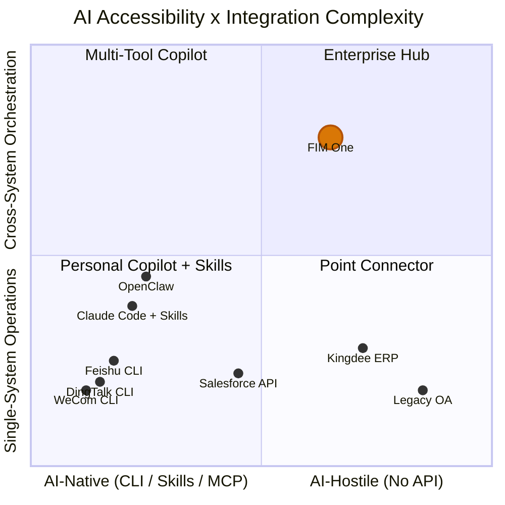

## The March 2026 Signal

In March 2026, three major Chinese workplace platforms open-sourced CLI tools within the same week:

- **DingTalk** released `dws` — 104 tools across 12 business domains
- **Feishu/Lark** released `lark-cli` — 200+ commands across 11 domains
- **WeCom** released `wecom-cli` — covering 7 business domains

None of them chose MCP. All three shipped pure CLI tools with pre-packaged AI Skills distributed via `npx skills add`. This is the first time the industry collectively showed its hand on how AI agents should talk to enterprise systems — and the answer was not a protocol, but a packaging format.

This document analyzes what this means for AI-system integration broadly, and for FIM One's strategy specifically.

## Three Paradigms for AI-System Integration

### 1. REST API (Traditional)

The baseline. Every SaaS platform exposes HTTP endpoints documented with OpenAPI specs. AI integration requires an adapter layer — something that translates between "call this API endpoint with these headers and this JSON body" and "here is a tool the agent can invoke."

This is what FIM One's ConnectorToolAdapter does today. It works, but each integration requires custom work: reading API docs, handling authentication, mapping response formats, dealing with pagination.

- **Who uses it**: Every SaaS platform, legacy integrations
- **AI integration**: Requires adapter layer (ConnectorToolAdapter, custom code)
- **Strength**: Universal, well-understood, structured JSON I/O
- **Weakness**: Each integration requires custom development effort

### 2. CLI + Skills (Emerging)

The platform provides a compiled CLI binary. AI integration comes via pre-packaged Skill files — markdown documents that teach AI IDEs how to invoke CLI commands via subprocess. Distribution happens through npm: `npx skills add dingtalk/dws`.

The AI reads the Skill file, understands what commands are available and what arguments they take, then invokes the CLI as a subprocess. Output is typically free text (tables, formatted strings) that the AI must parse.

- **Who uses it**: DingTalk, Feishu, WeCom (all chose this in March 2026)
- **AI integration**: `npx skills add platform/cli` — AI IDE reads Skill markdown, invokes CLI commands
- **Strength**: Fast to ship, works with any AI IDE that supports Skills format
- **Weakness**: Unstructured text output (AI must parse), no standardized discovery protocol, single-platform scope

### 3. MCP (Model Context Protocol)

JSON-RPC over stdio or SSE. Structured tool discovery (`tools/list`) and invocation (`tools/call`). The AI client negotiates capabilities with the server, gets a typed schema for every tool, and receives structured `CallToolResult` responses.

- **Who uses it**: Anthropic ecosystem, growing number of developer tools
- **AI integration**: Native protocol — structured I/O, schema-based discovery
- **Strength**: Standardized, structured, composable, built for multi-tool orchestration
- **Weakness**: Higher implementation cost, not yet adopted by major workplace platforms

### Comparison

| Dimension | REST API | CLI + Skills | MCP |
|-----------|----------|-------------|-----|
| Standardization | Medium (OpenAPI) | Low (vendor-specific Skills) | High (JSON-RPC protocol) |
| AI-friendliness | Low (needs adapter) | Medium (text I/O, parsed by AI) | High (structured JSON I/O) |
| Discovery mechanism | OpenAPI spec / docs | `--help` + Skill markdown | `tools/list` protocol endpoint |
| Output format | Structured JSON | Free text (needs AI parsing) | Structured `CallToolResult` |
| Time to ship | Weeks (per integration) | Days (wrap existing API) | Weeks (implement protocol) |
| Cross-platform orchestration | Requires hub | Not built-in | Not built-in |
| Enterprise governance | Requires hub | Not built-in | Not built-in |

## What the Major Platforms Actually Chose

| | DingTalk `dws` | Feishu `lark-cli` | WeCom `wecom-cli` |
|---|---|---|---|
| Language | Go | Go + Python | Rust + TS |
| Tools | 104 / 12 domains | 200+ / 11 domains | 7 domains |
| MCP support | No | No | No |
| AI integration | Markdown Skills + schema introspection | 19 npm Skills (`npx skills add`) | 12 npm Skills (`npx skills add`) |
| Output formats | JSON / table / raw + `--jq` | JSON / table / csv / ndjson | JSON |
| Agent-friendly flags | `--yes`, `--dry-run`, smart input correction | `--no-wait`, `--as user/bot`, `--dry-run` | Direct JSON params |
| Discovery | `dws schema` (self-introspection) | `lark-cli schema` (self-introspection) | Via Skill files only |

Key observation: `npx skills add` is becoming a de facto distribution channel for AI tool integrations, bypassing MCP entirely. These platforms chose speed-to-ship over protocol standardization. The AI IDE ecosystem (Cursor, Claude Code, Windsurf) already understands Skills files, so the platforms get immediate AI integration without implementing a protocol server.

## The AI Accessibility Spectrum

Not all systems are equally easy for AI to reach, and not all tasks are equally simple. These two dimensions define where different integration approaches create value.

**Reading the chart:**

- **Bottom-left (Personal Copilot + Skills)**: AI-native platforms with simple operations. DingTalk, Feishu, and WeCom cluster here — they ship their own CLI + Skills, making single-platform AI integration self-service. Personal copilots like OpenClaw and Claude Code with Skills occupy this zone. FIM One adds little value here — the platform has already done the work.
- **Top-left (Multi-Tool Copilot)**: AI-native platforms with cross-system needs. A user installing multiple Skills (`dingtalk` + `feishu` + `wechat`) in Claude Code can attempt multi-platform coordination, but lacks governance, orchestration planning, and unified credential management.
- **Bottom-right (Point Connector)**: Legacy systems that need a simple bridge. A single Connector to a Kingdee ERP or a legacy OA system — FIM One is useful here as an adapter, even for single-system operations, because these systems have no CLI and limited or no API.
- **Top-right (Enterprise Hub)**: Legacy or API-limited systems with cross-system orchestration requirements. This is FIM One's sweet spot. Querying contracts across a legacy management system, correlating with ERP receivables, and sending collection notices via DingTalk — this requires DAG planning, multi-connector coordination, credential vaulting, audit trails, and human confirmation gates. No personal copilot, no CLI, no Skills file will ever reach here.

FIM One's value increases as you move toward the top-right: harder-to-reach systems combined with more complex orchestration needs. The platforms that ship their own CLI + Skills occupy the opposite corner — easy to reach, simple operations — and represent a market FIM One should not chase.

## Personal Copilot vs Enterprise Hub

The proliferation of personal AI copilots (OpenClaw, Claude Code, Cursor, Windsurf) raises a positioning question. Two fundamentally different models exist:

### Personal Copilot

- **User**: Individual developer or knowledge worker
- **Data scope**: My calendar, my email, my documents
- **Authentication**: My personal token, my OAuth session
- **Integration scope**: Single-person, few platforms, personal productivity
- **Governance**: None needed — it is my data, my actions

### Enterprise Connector Hub

- **User**: Organization (teams, departments, cross-functional workflows)
- **Data scope**: Cross-department, cross-system, includes sensitive and regulated data
- **Authentication**: Admin-assigned permissions, least-privilege, credential vaulting
- **Integration scope**: Multi-system orchestration, business process automation
- **Governance**: Audit logs, RBAC, confirmation gates, compliance requirements

These are complementary, not competitive. As personal copilots proliferate, enterprises will need a central hub to govern what those copilots can access. An individual using Claude Code with `npx skills add dingtalk/dws` can read their own DingTalk messages. But when an AI agent needs to orchestrate across DingTalk, the company ERP, and the finance system — with audit trails, permission controls, and human confirmation for write operations — that is a different problem entirely.

Personal copilots commoditize simple single-platform operations. This is not FIM One's market. FIM One's market is the cross-system, governance-required, legacy-inclusive enterprise integration that no personal copilot can handle.

## Strategic Implications for FIM One

| Priority | Action | Rationale |
|----------|--------|-----------|
| Stay the course | Keep investing in Connector architecture for legacy/API systems | This is the moat — CLI + Skills will never reach legacy systems |
| Embrace MCP | MCP Server support already built (MCPServerMetaTool) — keep it polished | MCP is the structured protocol bet; some platforms will adopt it eventually |
| Monitor Skills | Track the `npx skills add` ecosystem but don't chase it | Skills solve a distribution problem FIM One doesn't have |
| Differentiate on governance | Audit, RBAC, confirmation gates, credential management | Personal copilots will never offer enterprise governance |
| Position clearly | "The hub where your systems meet AI" — not "another way to call DingTalk" | Avoid competing on simple integrations that platforms give away for free |

The worst strategic move would be to react to the CLI + Skills wave by building Skills adapters for platforms that already provide their own. That is a race to the bottom against the platform vendors themselves. The correct response is to stay focused on the systems those vendors will never reach.

## The Relationship Between CLI, Skills, and MCP

These three concepts operate at different layers and are often conflated in discussion. A precise distinction:

- **CLI** is a user interface — shell commands, text I/O, a form factor for interacting with a system
- **Skills** is a distribution mechanism — markdown files that teach AI how to invoke CLI commands, a packaging format for AI tool integrations
- **MCP** is a protocol — JSON-RPC, structured discovery and invocation, an interoperability standard for AI-tool communication

They are not substitutes for each other in the long run. A CLI is how a human (or AI subprocess) interacts with a tool. A Skill file is how that CLI gets distributed into AI IDEs. MCP is how a structured, schema-typed, composable integration works at the protocol level.

However, in the short term (2026), CLI + Skills is winning on adoption speed because it is cheaper to implement than MCP. A platform with an existing CLI can ship a Skills file in a day. Implementing an MCP server takes weeks and requires understanding the protocol specification, transport layers, and capability negotiation.

The likely convergence: platforms that ship CLIs today may wrap them as MCP servers tomorrow. MCP's stdio transport already launches CLI processes — the gap between "CLI invoked by Skills" and "CLI wrapped as MCP server" is small. But this convergence is not guaranteed. If the Skills ecosystem grows fast enough and AI IDEs standardize around it, MCP may remain a developer-tools protocol rather than an enterprise-tools standard.

For FIM One, the takeaway is clear: invest in the protocol layer (MCP) and the governance layer (Connector architecture), not the distribution layer (Skills). Distribution is a solved problem for platform vendors. Protocol and governance are where a hub creates durable value.
