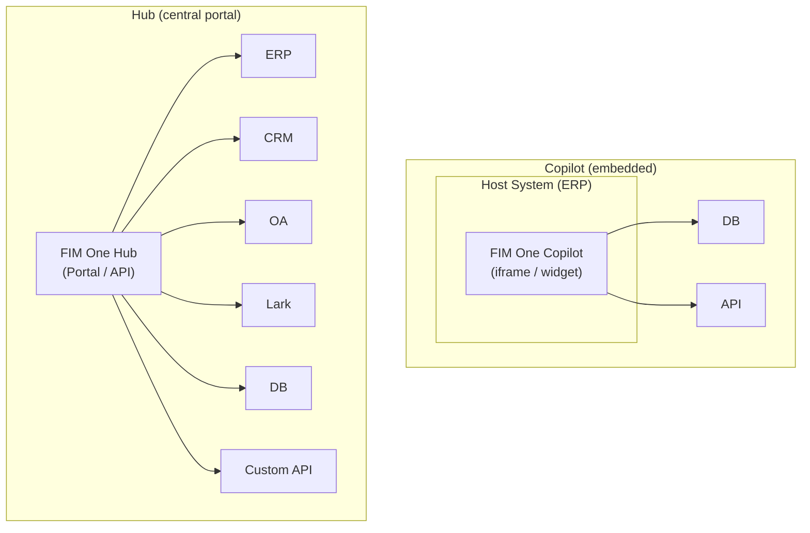
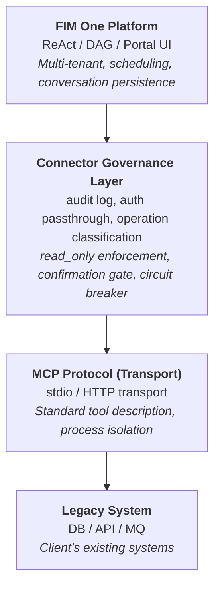
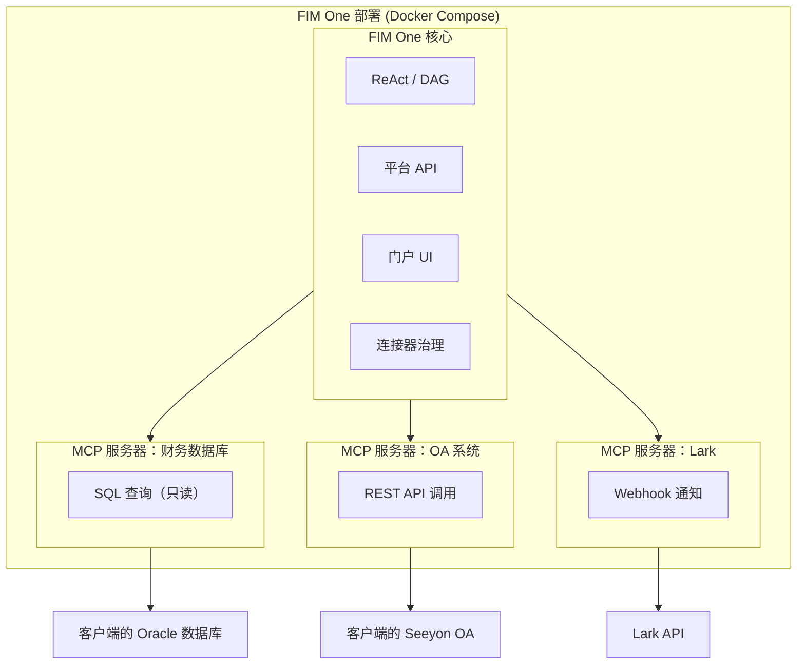
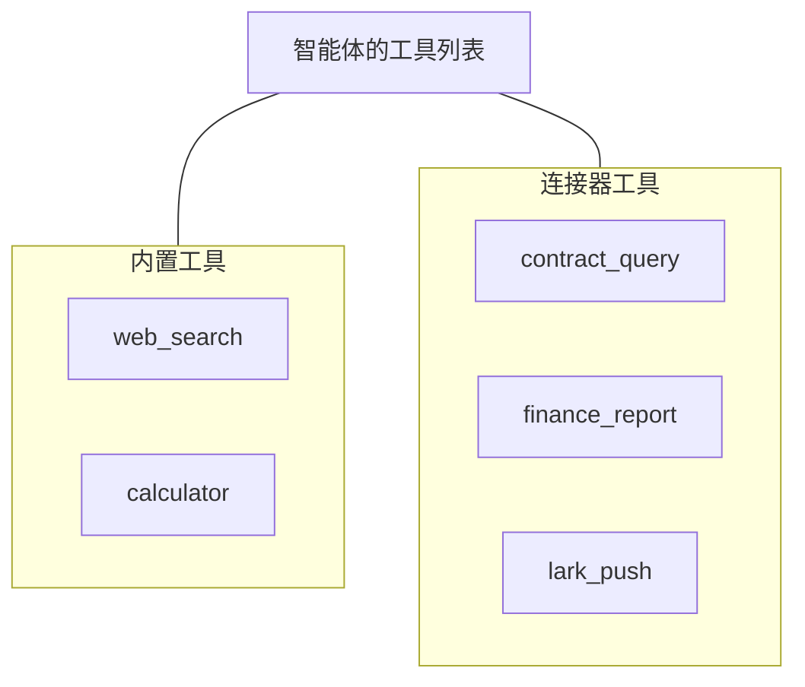
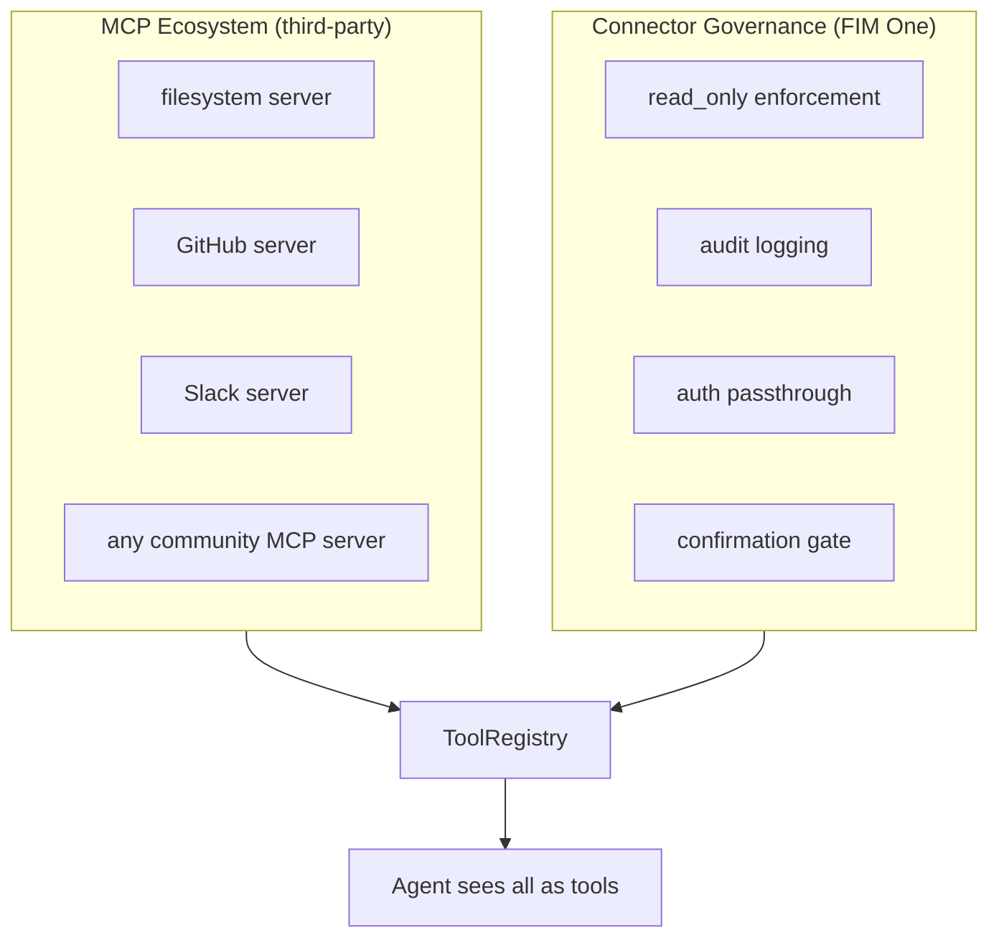

## Copilot vs Hub

该架构支持两种集成规模：



**Copilot** 嵌入到宿主系统的 UI 中。用户可以在熟悉的界面中与 AI 交互，无需离开。它可以使用多个连接器（宿主 DB + 通知服务等）。

**Hub** 是一个独立的门户，连接所有系统。它不嵌入任何单一系统 -- 它是系统与 AI 相遇的中央智能层。

相同的连接器架构，不同的交付方式。Copilot 使用与 Hub 相同的 `ConnectorToolAdapter`。

## 核心原则

**客户端零代码改动。** FIM One 主动集成到他们的系统中——读取他们的数据库、调用他们的 API、推送到他们的消息总线。客户端仅需提供凭证和网络访问权限。

## 三层架构



每一层都有不同的职责：

| 层 | 负责 | 变化时机... |
|---|---|---|
| **平台** | 编排、多租户、UI | 新平台功能发布时 |
| **连接器治理层** | 企业治理策略 | 安全/合规要求变化时 |
| **MCP 协议** | 传输、工具接口标准 | 永不变化（开放标准） |
| **遗留系统** | 业务数据和逻辑 | 永不变化（这就是重点） |

## 为什么选择 MCP 作为传输层

适配器被实现为 **MCP 服务器**。这是一个深思熟虑的架构选择：

- **重用**：FIM One 已经附带 MCP 客户端（v0.3）。添加遗留系统适配器与添加任何 MCP 工具使用相同的基础设施。
- **标准协议**：MCP 是开放标准。无需发明或维护专有协议。
- **生态系统**：第三方 MCP 服务器（数据库、API、SaaS 工具）开箱即用。
- **进程隔离**：每个 MCP 服务器作为单独的进程运行。行为不当的适配器无法导致平台崩溃。

### MCP 单独不提供的功能

**连接器治理层**添加了原始 MCP 缺乏的企业治理功能：

| 关注点 | MCP | 连接器治理层 |
|---|---|---|
| 只读强制执行 | 否 | 操作上的 `read_only` 标志；默认阻止写入 |
| 审计日志 | 否 | 记录每个工具调用（时间戳、用户、工具、参数、结果） |
| 身份验证传递 | 否 | 代理主机系统身份验证；智能体代表已登录用户行动 |
| 确认门控 | 否 | 写入操作需要人工批准（SSE `confirmation_required`） |
| 断路器 | 否 | 连接失败触发优雅降级 |
| 操作分类 | 否 | 操作标记为读/写/管理，具有各级别策略 |

### 为什么不发明自定义协议

协议是商品化的。技术价值在于适配器本身（领域知识、模式映射、边界情况处理）和治理层（审计、身份验证、安全性）。发明传输协议会增加维护成本，而不会增加功能。Stripe 使用 HTTPS；Docker 使用 cgroups；FIM One 使用 MCP。

## 部署模型

所有内容都在单个 Docker Compose 部署中运行。客户端无需安装任何内容。



<Note>
全部由 FIM One 提供。客户端仅需提供：
- 数据库凭证（建议使用只读账户）
- API 端点和密钥（如果可用）
- 网络白名单访问权限
</Note>

**访问层级**：FIM One 适配客户端能够提供的任何访问权限：

| 客户端拥有的 | FIM One 连接方式 |
|---|---|
| 有文档的 API | HTTP API 适配器（最佳情况） |
| 无文档的 API | HTTP API 适配器 + 手动模式映射 |
| 仅数据库访问 | 数据库适配器（直接 SQL，默认只读） |
| 数据库 + 消息总线 | 数据库适配器 + 消息推送适配器 |

## 智能体-连接器解耦

智能体将连接器视为普通工具。它不知道也不关心某个工具是内置的、第三方 MCP Server 还是遗留系统连接器。



这意味着：

- **添加**新系统 = 添加连接器配置。智能体代码无需更改。
- **移除**连接器 = 移除配置。无需代码更改。
- 同一个智能体可以在单个任务中同时使用内置工具和连接器。

## 热插拔演进

| 版本 | 如何添加新连接器 | 需要重启？ |
|---|---|---|
| **v0.6** | 编写 Python MCP Server 并配置连接器治理层，添加到 docker-compose | 重新部署 |
| **v0.8** | 编写 YAML/JSON 配置，平台生成 MCP Server | 重启 |
| **v1.0** | 上传 OpenAPI 规范，AI 自动生成配置 | **无需重启（热插拔）** |

企业部署是"一次实现，运行数月"——热插拔是 v1.0 的便利功能，而非 v0.6 的必需功能。

## 数据流示例

用户："检查财务系统中所有逾期合同，并将摘要推送到 Lark。"

```
1. 用户通过 Portal / API 发送消息

2. FIM One (ReAct 模式):
   Think: 我需要查询财务数据库中的逾期合同，然后推送到 Lark。

3. Act: contract_query(status="overdue", days_past_due=">30")
   → Connector Governance: 审计日志、只读检查（通过）
   → MCP Server: 转换为 SQL
   → Client DB: SELECT * FROM contracts WHERE status='overdue' AND ...
   ← 返回 7 份逾期合同

4. Think: 找到 7 份逾期合同。我将进行总结并推送。

5. Act: lark_push(message="7 overdue contracts found: ...")
   → Connector Governance: 审计日志、写入操作 → 确认门控
   → 用户通过 Portal 批准
   → MCP Server: POST 到 Lark webhook
   ← 推送成功

6. Answer: "Found 7 overdue contracts. Summary pushed to Lark group."
```

## 连接器标准化级别

| 级别 | 版本 | 方法 | 构建者 |
|---|---|---|---|
| **级别 1** | v0.6 | Python MCP Server with Connector Governance | FIM One 开发者 |
| **级别 2** | v0.8 | YAML/JSON 配置，平台自动生成 MCP Server | 实施工程师（无需 Python） |
| **级别 3** | v1.0 | 上传 OpenAPI/Swagger 规范，AI 生成配置 | AI（需人工审核） |

## 与现有 MCP 生态系统的关系

FIM One 的 MCP 客户端（v0.3 版本中提供）已经支持第三方 MCP 服务器。遗留系统适配器只是**使用连接器治理层构建的特定领域 MCP 服务器**，用于企业治理。



连接器治理层不是替代 MCP，而是为企业遗留系统集成所需的治理功能扩展 MCP。
