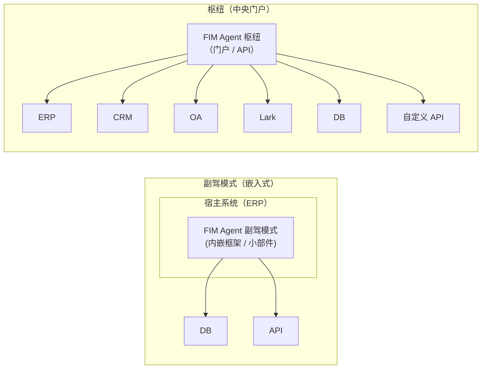
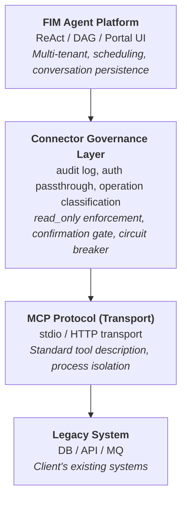
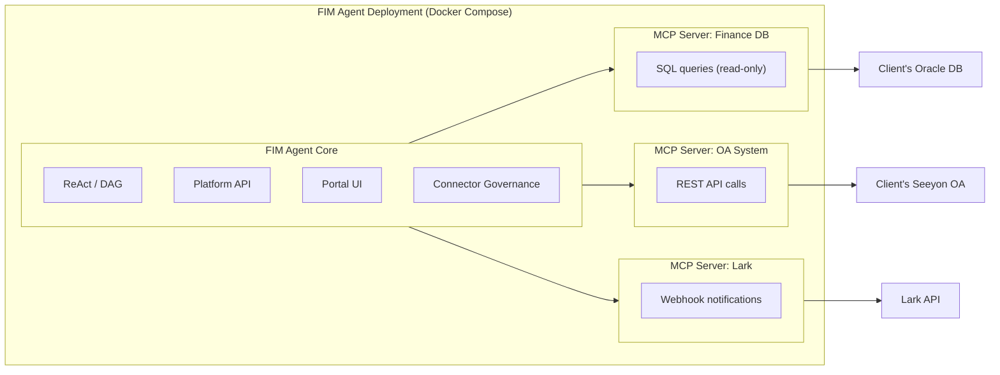
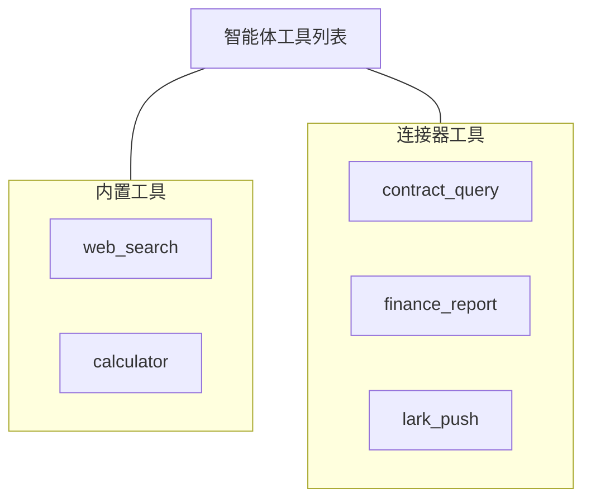
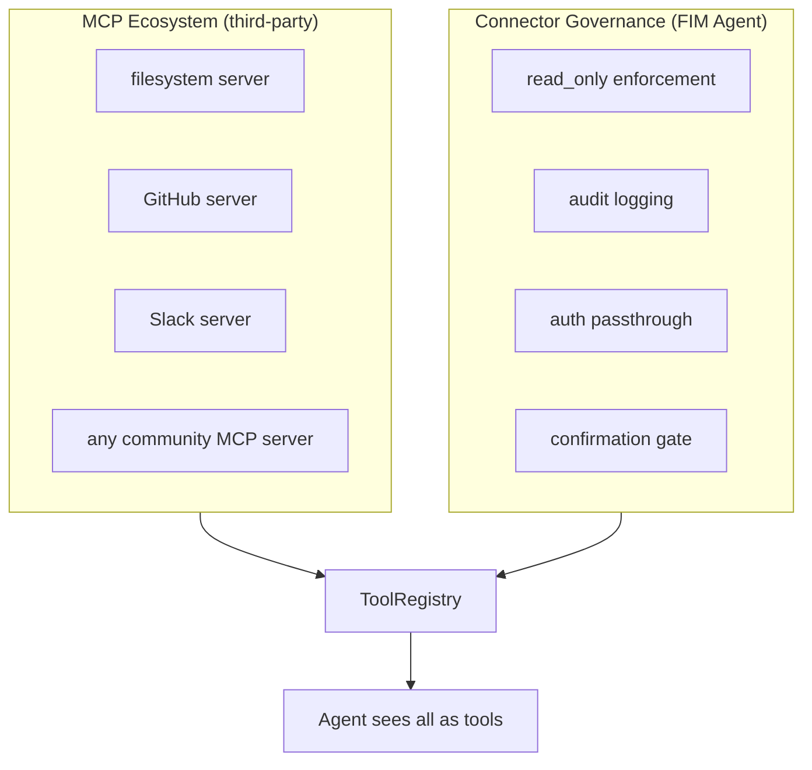

<div id="copilot-vs-hub">
  ## 副驾模式与枢纽
</div>

该架构支持两种集成方式：



**副驾模式**嵌入宿主系统的 UI 中。用户无需离开熟悉的界面，即可与 AI 交互。它可以使用多个连接器 (如宿主数据库 + 通知服务等) 。

**枢纽**是一个连接所有系统的独立门户。它不嵌入任何单一系统——而是系统与 AI 交汇的中央智能层。

相同的连接器架构，不同的交付方式。副驾模式与枢纽使用相同的 `ConnectorToolAdapter`。


<div id="core-principle">
  ## 核心原则
</div>

**客户无需修改任何代码。** FIM Agent 会主动桥接到其系统中——读取其数据库、调用其 API，并向其消息总线推送数据。客户只需提供凭据和网络访问权限。

<div id="three-layer-architecture">
  ## 三层架构
</div>



各层各自承担明确的职责：

| 层级 | 职责 | 何时变更 |
|---|---|---|
| **Platform** | 编排、多租户、UI | 平台发布新功能时 |
| **Connector Governance Layer** | 企业治理策略 | 安全/合规要求发生变化时 |
| **MCP Protocol** | 传输、工具接口标准 | 永不（开放标准） |
| **Legacy System** | 业务数据和逻辑 | 永不（这正是其核心所在） |

<div id="why-mcp-as-the-transport-layer">
  ## 为什么选择 MCP 作为传输层
</div>

适配器以 **MCP 服务器** 的形式实现。这是一个有意为之的架构选择：

* **复用**：FIM Agent 已内置 MCP Client (v0.3) 。新增遗留系统适配器时，可复用与接入任何 MCP 工具相同的基础设施。
* **标准协议**：MCP 是开放标准。无需自行设计或维护专有协议。
* **生态系统**：第三方 MCP 服务器 (数据库、API、SaaS 工具) 可开箱即用。
* **进程隔离**：每个 MCP 服务器都以独立进程运行。即使某个适配器行为异常，也不会导致整个平台崩溃。

<div id="what-mcp-alone-does-not-provide">
  ### 仅靠 MCP 还无法提供什么
</div>

**连接器治理层** 补充了原生 MCP 所不具备的企业级治理能力：

| 关注点  | MCP | 连接器治理层                                   |
| ---- | --- | ---------------------------------------- |
| 只读约束 | 否   | 通过操作上的 `read_only` 标志控制；默认禁止写操作          |
| 审计日志 | 否   | 记录每一次工具调用 (时间戳、用户、工具、参数、结果)              |
| 认证透传 | 否   | 代理宿主系统认证；智能体以已登录用户身份执行操作                 |
| 确认门  | 否   | 写操作需要人工批准 (SSE `confirmation_required`)  |
| 熔断机制 | 否   | 连接失败时会触发优雅降级                             |
| 操作分类 | 否   | 操作标记为读/写/管理，并按级别应用策略                     |

<div id="why-not-invent-a-custom-protocol">
  ### 为什么不自创协议
</div>

协议本身已经是成熟的通用能力。真正的技术价值在于适配器本身 (领域知识、模式映射、边缘情况处理) 以及治理层 (审计、认证、安全) 。自创一种传输协议只会增加维护成本，而不会带来额外能力。Stripe 使用 HTTPS；Docker 使用 cgroups；FIM Agent 使用 MCP。

<div id="deployment-model">
  ## 部署模型
</div>

所有组件均在单个 Docker Compose 部署中运行。客户无需安装任何软件。



<Note>
均由 FIM Agent 提供。客户仅需提供：
- 数据库凭据（建议使用只读账户）
- API 端点和密钥（如有）
- 网络白名单访问权限
</Note>

**访问层级**：FIM Agent 可适配客户能够提供的各种访问方式：

| 客户具备的条件 | FIM Agent 的连接方式 |
|---|---|
| 有文档的 API | HTTP API 适配器（最佳情况） |
| 无文档的 API | HTTP API 适配器 + 手动 schema 映射 |
| 仅有数据库访问 | 数据库适配器（直接 SQL，默认只读） |
| 数据库 + 消息总线 | 数据库适配器 + 消息推送适配器 |

<div id="agent-connector-decoupling">
  ## 智能体-连接器解耦
</div>

智能体将连接器视作普通工具。它并不知道，也不在意某个工具究竟是内置工具、第三方 MCP 服务器，还是遗留系统连接器。



这意味着：

* **新增** 一个系统 = 新增一个连接器配置。智能体代码无需变更。
* **移除** 一个连接器 = 移除相应配置。无需修改代码。
* 同一个智能体可以在单个任务中同时使用内置工具和连接器。


<div id="hot-plug-evolution">
  ## 热插拔演进
</div>

| 版本       | 如何添加新的连接器                                      | 需要重启吗？               |
| -------- | ---------------------------------------------- | -------------------- |
| **v0.6** | 编写带有连接器治理层的 Python MCP 服务器，并添加到 docker-compose | 重新部署                 |
| **v0.8** | 编写 YAML/JSON 配置，由平台生成 MCP 服务器                  | 重启                   |
| **v1.0** | 上传 OpenAPI 规范，AI 自动生成配置 | **无需重启 (热插拔)** |

企业部署通常是“实施一次，运行数月”——热插拔是 v1.0 提供的便利特性，不是 v0.6 的要求。

<div id="data-flow-example">
  ## 数据流示例
</div>

用户："检查财务系统中所有已逾期的合同，并将摘要推送到 Lark。"

```
1. 用户通过门户 / API 发送消息

2. FIM Agent（ReAct 模式）：
   Think: 我需要查询财务数据库中的逾期合同，然后推送到 Lark。

3. Act: contract_query(status="overdue", days_past_due=">30")
   → Connector Governance：审计日志，read_only 检查（通过）
   → MCP 服务器：转换为 SQL
   → Client DB: SELECT * FROM contracts WHERE status='overdue' AND ...
   ← 返回 7 份逾期合同

4. Think: 找到 7 份逾期合同。我将汇总并推送。

5. Act: lark_push(message="7 overdue contracts found: ...")
   → Connector Governance：审计日志，写操作 → 确认门
   → 用户通过门户批准
   → MCP 服务器：POST 到 Lark webhook
   ← 推送成功

6. Answer: "已找到 7 份逾期合同。摘要已推送到 Lark 群组。"
```

<div id="connector-standardization-levels">
  ## 连接器标准化级别
</div>

| 级别        | 版本   | 方式                              | 构建方                |
| --------- | ---- | ------------------------------- | ------------------ |
| **第 1 级** | v0.6 | 带连接器治理的 Python MCP 服务器          | FIM Agent 开发者      |
| **第 2 级** | v0.8 | YAML/JSON 配置，由平台自动生成 MCP 服务器    | 实施工程师 (无需 Python)  |
| **第 3 级** | v1.0 | 上传 OpenAPI/Swagger 规范，AI 自动生成配置 | AI (经人工审核)         |

<div id="relationship-to-existing-mcp-ecosystem">
  ## 与现有 MCP 生态系统的关系
</div>

FIM Agent 的 MCP Client（随 v0.3 发布）已支持第三方 MCP 服务器。遗留系统适配器本质上只是借助连接器治理层构建的**面向特定领域的 MCP 服务器**，以满足企业级治理要求。



连接器治理层并不取代 MCP——而是在 MCP 的基础上扩展了企业遗留系统集成所需的治理层。