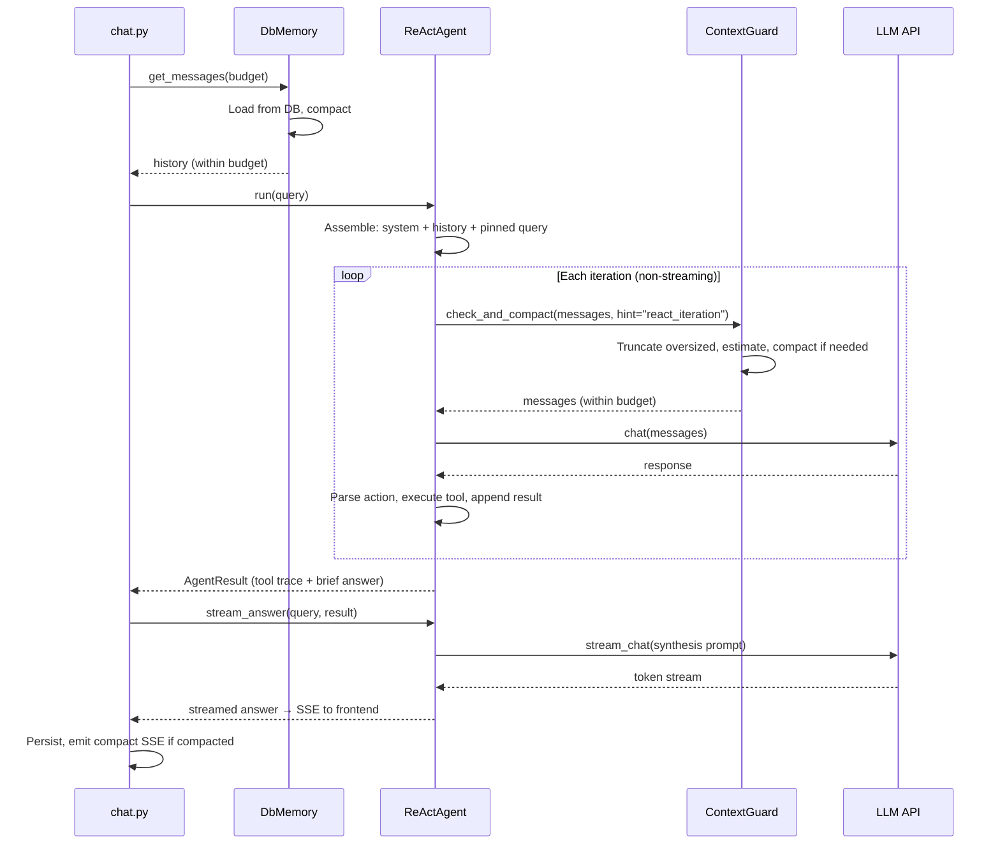
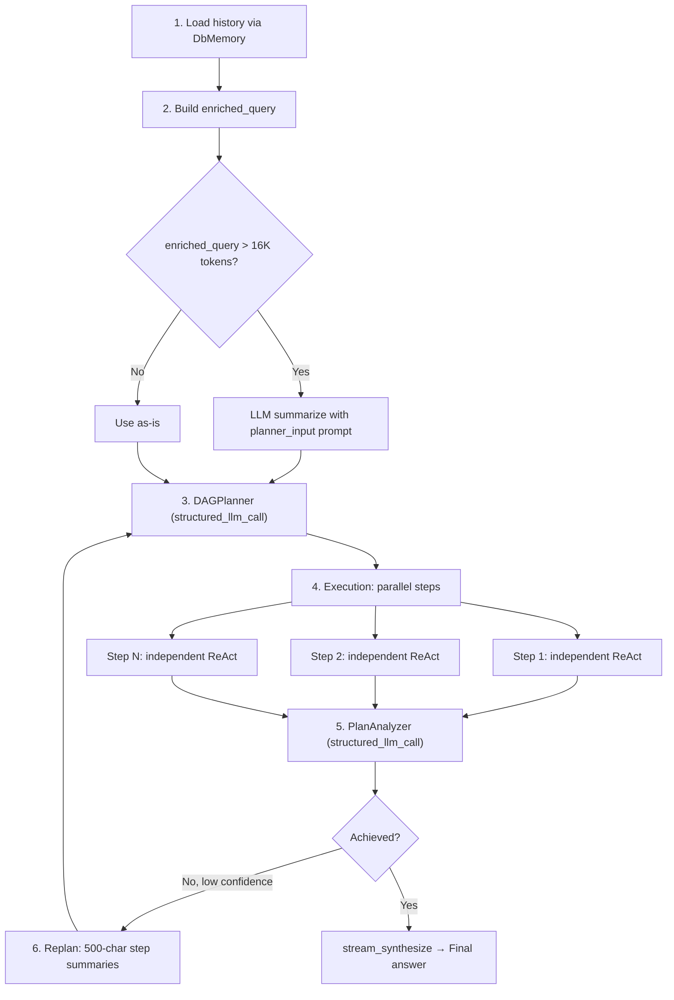

---
title: "上下文管理"
description: "FIM One 如何管理对话上下文 — 一个五层纵深防御系统，可防止令牌溢出，同时保持对话质量。"
---## 问题所在

LLM 的上下文窗口是有限的。一个 128K 令牌的模型听起来很慷慨，直到你减去输出预算、系统提示、工具描述和多轮对话的累积历史。长对话、大型工具结果和多步骤 agent 循环都会对这个限制造成压力——通常在单个会话内就会发生。

天真的解决方案是截断：当窗口填满时丢弃旧消息。这很快且可预测，但它会无差别地破坏上下文。用户的原始意图、早期轮次的关键决策和关键数据点在生硬的字符截断时都会消失。相反的极端——每轮都进行 LLM 驱动的摘要——保留了语义内容，但成本高、速度慢，并引入了自己的故障模式（幻觉摘要、数值精度丧失）。

真正的挑战不是"适应窗口"。而是：**优雅地降级而不丧失关键信息，不在不必要的压缩上浪费令牌，也不增加用户能感受到的延迟。**

FIM One 通过五层纵深防御架构解决了这个问题。每一层都解决问题的不同规模，它们组合得很干净——没有单一层需要完美，因为下一层会捕捉它遗漏的内容。## 五层防御

上下文管理不是单一机制。它是一个堆栈，其中每一层在特定的粒度处理特定的问题：

| 层 | 组件 | 功能 | 执行时机 |
|-------|-----------|-------------|-------------|
| **5** | Budget Configuration | 从模型规格计算可用的输入令牌预算 | 启动时 / 每个请求 |
| **4** | DbMemory | 加载持久化历史记录，加载时进行压缩 | 每个请求一次 |
| **3** | ContextGuard | 每次迭代的预算强制执行 | 每个 ReAct 迭代 |
| **2** | CompactUtils | 令牌估计、智能截断、LLM 压缩 | 由第 3 和 4 层调用 |
| **1** | Memory Implementations | 抽象接口 + 具体策略 | 框架级 |

这些层从下到上编号，因为更高的层依赖于更低的层。第 5 层设置预算。第 4 层进行初始加载时压缩。第 3 层在每次迭代时强制执行预算。第 2 层和第 1 层提供第 3 层和第 4 层使用的原语。

```mermaid
flowchart TD
    L5["Layer 5: Budget Configuration<br/><i>context_size - max_output - 4K reserve</i>"]
    L4["Layer 4: DbMemory<br/><i>Load history, compact on load</i>"]
    L3["Layer 3: ContextGuard<br/><i>Per-iteration enforcement</i>"]
    L2["Layer 2: CompactUtils<br/><i>Estimation, truncation, LLM compact</i>"]
    L1["Layer 1: Memory Implementations<br/><i>BaseMemory, WindowMemory, SummaryMemory, DbMemory</i>"]

    L5 -->|"budget"| L4
    L5 -->|"budget"| L3
    L4 -->|"calls"| L2
    L3 -->|"calls"| L2
    L4 -.->|"implements"| L1
```### Layer 5 — 预算配置

预算由三个值计算得出：

```
usable_input_tokens = context_size - max_output_tokens - system_prompt_reserve
```

默认值：`128,000 - 64,000 - 4,000 = 60,000 tokens`。

4,000 token 的系统提示保留用于覆盖代理的系统提示、工具描述和格式化开销。这是一个固定常数——足够大以避免在实践中裁剪系统提示，又足够小以不浪费预算。

预算值可以来自三个来源，按优先级顺序解决：

1. **数据库 ModelConfig** — 由管理员设置的每个模型的 `context_size` 和 `max_output_tokens`。
2. **环境变量** — `LLM_CONTEXT_SIZE` 和 `LLM_MAX_OUTPUT_TOKENS`。
3. **硬编码默认值** — 128K 上下文，64K 输出。

主 LLM 和快速 LLM 有独立的预算。DAG 步骤执行使用快速 LLM 的预算；ReAct 模式使用主 LLM 的预算。这很重要，因为操作员通常会为 ReAct 配对一个大上下文模型（历史会累积）和一个更小、更快的模型用于 DAG 步骤（每个步骤都从头开始）。

强制执行 4,000 token 的下限——如果配置错误的值会产生更小的预算，系统会限制在 4K，而不是静默失败。### Layer 4 — DbMemory

`DbMemory` 是生产环境中的内存实现。它从数据库加载持久化的对话历史，并将其压缩以适应令牌预算，然后再让代理看到。

设计是**有意只读的**。持久化由 `chat.py` 处理——拥有完整消息生命周期的 API 层（包括元数据、使用情况跟踪和图像附件）。`DbMemory` 仅读取。其 `add_message()` 和 `clear()` 方法是空操作。这种分离防止了双重写入，并将持久化逻辑保持在一个地方。

加载时，`DbMemory`：

1. 查询对话的所有 `user` 和 `assistant` 消息，按创建时间排序。
2. 删除尾部用户消息（当前查询，代理将重新追加）。
3. 重建图像附件——包含图像的用户消息在数据库中存储元数据（`file_id`、`mime_type`），`DbMemory` 从磁盘重建 base64 数据 URL，以便 LLM 可以"看到"之前轮次的图像。
4. 压缩：如果提供了 `compact_llm`，使用 `CompactUtils.llm_compact()`。否则，回退到 `CompactUtils.smart_truncate()`。

压缩后，`DbMemory` 设置跟踪标志（`was_compacted`、`_original_count`、`_compacted_count`），SSE 层使用这些标志向前端发出 `compact` 事件。### Layer 3 — ContextGuard

`ContextGuard` 是每次迭代的预算执行器。它在每个 ReAct 迭代的顶部被调用——既在独立 ReAct 模式中，也在每个 DAG 步骤的子代理内部。这是消息到达 LLM API 之前的最后一道防线。

执行遵循三步流程：

1. **截断超大单条消息。** 任何超过 50K 字符的单条消息都会被硬截断，并添加 `[Truncated]` 后缀。这可以捕获失控的工具输出——返回整个网页的网页抓取、转储大型数据集的文件读取。

2. **估计总令牌数。** 如果总数在预算范围内，立即返回。大多数迭代在这里通过——压缩是例外，而非常规。

3. **如果超过预算则压缩。** 如果有可用的 `compact_llm`，使用带有特定提示的 LLM 驱动压缩。否则，回退到 `smart_truncate`。

**提示系统** 是使 ContextGuard 具有上下文感知而非一刀切的原因。不同的情况需要不同的压缩策略：

| 提示 | 使用者 | 保留 | 丢弃 |
|------|---------|-----------|-------|
| `react_iteration` | ReAct 代理循环 | 最近的推理链、当前目标、关键数据 | 旧的冗余步骤、失败的重试、冗长的工具输出 |
| `planner_input` | DAG 丰富查询 | 用户意图演变、关键决策、约束 | 对话细节、问候、工具调用机制 |
| `step_dependency` | DAG 步骤上下文 | 关键数据、数字、结论 | 推理过程、失败的尝试、冗长的格式 |
| `general` | 默认回退 | 关键事实、决策、工具结果 | 问候、填充内容、冗余往返 |

每个提示都映射到一个精心措辞的系统提示，告诉压缩 LLM 要保留什么和丢弃什么。提示以"用对话中使用的相同语言写作"结尾——这对于摘要可能默认为英文的 CJK 用户来说很重要。

如果 LLM 压缩失败（网络错误、空响应、任何异常），ContextGuard 会无声地回退到 `smart_truncate`。代理永远不会看到失败。这是一个刻意的可靠性选择：通过启发式截断丢失一些上下文比让迭代崩溃要好。### Layer 2 — CompactUtils

`CompactUtils` 是一个无状态的实用程序类 — 没有实例，没有状态，只有纯函数。它提供了第 3 层和第 4 层构建的三种功能。

**Token 估计**将文本转换为近似的 token 计数，无需导入 tokenizer 库。启发式方法：

- ASCII 字符：~4 个字符每 token
- CJK / 非 ASCII 字符：~1.5 个字符每 token
- 图像：765 tokens 每张图像（固定成本）
- 每条消息开销：4 tokens（角色标记、分隔符）

**`smart_truncate`** 是启发式回退方案。它无条件地保留固定消息，然后向后遍历非固定消息，累积直到预算耗尽。结果是适合的对话后缀。它还确保结果永远不会以助手消息开头 — 没有前置用户消息的孤立助手转向会使 LLM 困惑。

**`llm_compact`** 是 LLM 驱动的路径。它将消息分为三组 — 系统消息（始终保留）、固定消息（始终保留）和可压缩消息。最旧的可压缩消息被总结为单个 `[Conversation summary]` 系统消息；最近的 4 条消息保持原样。如果压缩后的结果仍然过长，它会在压缩输出上回退到 `smart_truncate` — 双重保险。### 第 1 层 — 内存实现

内存层定义了 `BaseMemory` 接口：`add_message()`、`get_messages()`、`clear()`。存在三种实现：

- **WindowMemory** — 基于计数的滑动窗口。保留最后 N 条非系统消息。简单、可预测，无 LLM 调用。不用于生产环境；对测试和无状态场景很有用。

- **SummaryMemory** — 当消息计数超过阈值时触发 LLM 摘要化。将旧消息压缩为 `[Conversation summary]` 系统消息。不用于生产环境；早于更复杂的 ContextGuard 方法。

- **DbMemory** — 生产实现（在第 4 层中描述）。数据库支持、只读，在加载时使用 LLM 或启发式压缩。

WindowMemory 和 SummaryMemory 保留在代码库中，因为它们作为测试的有用基元，以及对于嵌入 FIM One 核心库而不使用 Web 层的用户很有用。它们不是死代码 — 它们是架构发展而来的简单案例。## 上下文如何通过 ReAct 流动

ReAct agent 在两个不同的阶段使用上下文管理：加载时和迭代时。



工具迭代使用非流式 `chat()` 以提高速度；答案合成使用通过 `stream_answer()` 的流式 `stream_chat()`。这种两阶段分割——快速工具循环后跟流式合成——优化了延迟和用户体验。有关完整的 ReAct 引擎架构（包括双模式执行和工具选择），请参阅 [ReAct Engine](/architecture/react-engine)。

关键洞察：**DbMemory 处理历史上下文问题（来自先前请求的轮次），而 ContextGuard 处理请求内增长问题（工具结果在 agent 循环期间累积）。** 它们在不同的时间尺度上运行并捕获不同的故障模式。

用户的当前查询始终标记为 `pinned=True`。这确保它在所有压缩中都能存活——`smart_truncate` 和 `llm_compact` 都无条件地保留固定消息。无论历史记录压缩得多么激进，用户的实际问题永远不会丢失。## 上下文如何流经 DAG

DAG 模式的上下文形状与 ReAct 根本不同。它不是一个长对话线程，而是一棵树：一个规划阶段、多个并行执行步骤和一个分析阶段。每个阶段都有自己的上下文管理策略。



**阶段 1 — 历史加载。** DbMemory 加载并压缩对话历史，与 ReAct 相同。压缩后的历史被格式化为以 `"Previous conversation:"` 为前缀的文本块。

**阶段 2 — 富化查询构造。** 历史文本和当前查询被组合成 `enriched_query`。如果超过 16K 个令牌，则使用 `planner_input` 提示词通过 LLM 进行总结。选择 16K 阈值是因为规划器需要在一次传递中读取整个查询 — 与 ReAct 不同，规划期间没有迭代压缩。

**阶段 3 — 规划。** 规划器接收一个 2 消息提示：系统提示加富化查询。这里没有 ContextGuard — 富化查询已经通过 16K 检查进行了大小控制。

**阶段 4 — 步骤执行。** 每个 DAG 步骤作为一个独立的 ReAct 代理运行，具有自己的 ContextGuard。关键是，这些子代理**没有内存** — 它们从零开始，只有任务描述和依赖上下文。这是设计上的考虑：DAG 步骤应该是自包含的工作单元。依赖结果通过 `_build_step_context` 注入，该函数在 50K 处进行字符截断（ContextGuard 的 `max_message_chars` 限制）。

**阶段 5 — 分析。** 步骤结果为分析器 LLM 格式化，每个步骤在 10K 字符处进行截断。这可以防止单个步骤的详细输出主导分析上下文。

**阶段 6 — 重新规划。** 当分析器确定目标未实现且置信度低于阈值时，步骤结果被截断为仅 500 个字符用于重新规划上下文。重新规划需要知道*发生了什么*和*哪里出了问题*，而不是每个步骤输出的完整细节。这种激进的截断使重新规划提示足够紧凑，规划器可以高效处理。

有关完整的 DAG 管道架构（包括 LLM 调用映射和重新规划逻辑），请参阅 [DAG Engine](/architecture/dag-engine)。## 固定消息

固定机制防止压缩破坏必须保留的消息。有两类消息被固定：

1. **当前用户查询** — 始终固定。如果用户提出问题且历史记录过长，系统会压缩历史记录，而不是问题。

2. **中途注入的消息** — 当用户在代理仍在运行时发送后续消息时，注入的消息被标记为固定，以便代理在下一次迭代中看到它。

固定的风险是积累。在有许多注入消息的长会话中，固定内容可能会增长到消耗大部分预算，留下没有空间给实际的对话历史。ContextGuard 通过硬上限来解决这个问题：**当固定令牌超过预算的 50% 时，最旧的注入消息被取消固定并移到可压缩池。** 只有最近的固定消息（当前查询）被保留。

这是一个权衡。取消固定旧的注入消息意味着它们可能被总结或截断。但另一种选择 — 让固定消息挤占所有其他上下文 — 更糟。系统倾向于保留最近的上下文，这几乎总是比较旧的注入更相关。## 令牌估计

FIM One 使用启发式令牌估计而不是真实的分词器。这是一个经过深思熟虑的选择，具有明确的权衡。

**为什么不使用真实的分词器？** 三个原因：

1. **依赖成本。** `tiktoken`（OpenAI 的分词器）是 15MB 的编译 Rust 绑定。`sentencepiece`（由某些开源模型使用）有自己的构建要求。对于针对多个 LLM 提供商的框架，没有单一的正确分词器——每个模型系列使用不同的分词器。

2. **速度。** 启发式估计是对字符串的单次遍历。真实分词涉及词汇查找、BPE 合并操作和特殊令牌处理。ContextGuard 在每次迭代时调用估计，有时多次调用——速度差异很重要。

3. **足够好。** 启发式方法针对混合语言文本进行了调整（ASCII/CJK 分割涵盖了两个主要情况）。对于边界情况（大量标点符号的代码、不寻常的 Unicode），可能相差 1.5-2 倍，但上下文管理本质上是近似的。在 60K 预算上相差 30% 仍然留有舒适的余量。

具体的启发式方法：

| 内容类型 | 比率 | 原理 |
|-------------|-------|-----------|
| ASCII 文本 | ~4 字符/令牌 | 英文散文和代码在 GPT/Claude 分词器中平均为 3.5-4.5 字符/令牌 |
| CJK / 非 ASCII | ~1.5 字符/令牌 | 每个 CJK 字符通常为 1-2 个令牌；1.5 是几何平均值 |
| 图像 | 765 令牌/图像 | 视觉 API 中 base64 编码图像的近似成本 |
| 每条消息开销 | 4 令牌 | 角色标记、分隔符、格式化 |

对于非空内容，估计始终至少返回 1 个令牌。这可以防止预算算术中的除以零边界情况。## 用户看到的内容

上下文管理设计为在常见情况下不可见，激活时的干扰最小。用户面向的信号包括：

**CompactDivider。** 当 `DbMemory` 在加载时压缩历史记录时，前端会呈现一条虚线分隔符，文本为"Earlier context (N messages) was summarized by AI."。这出现在摘要和保留的最近消息之间，为用户提供视觉提示，表明较旧的上下文已被压缩，而不会中断对话流。

**Token 使用情况显示。** 每个响应末尾的 `done` 卡片显示"X.Xk in / X.Xk out"——消耗的总输入和输出 token。这包括花费在压缩上的 token（用于摘要的快速 LLM 调用）。监控 token 消耗的用户可以看到压缩何时增加开销。

**优雅的错误处理。** 如果上下文管理完全失败——考虑到回退链，这种情况不应该发生，但理论上可能发生——错误会作为响应中的代理错误文本出现，而不是系统崩溃。对话继续；用户可以重试或改述。

目标是大多数用户永远不会考虑上下文管理。他们进行长对话，系统透明地处理预算，唯一可见的工件是偶尔出现的压缩分隔符。对于关心 token 效率的高级用户和操作员，使用情况显示和可配置的预算参数提供了他们需要的控制。