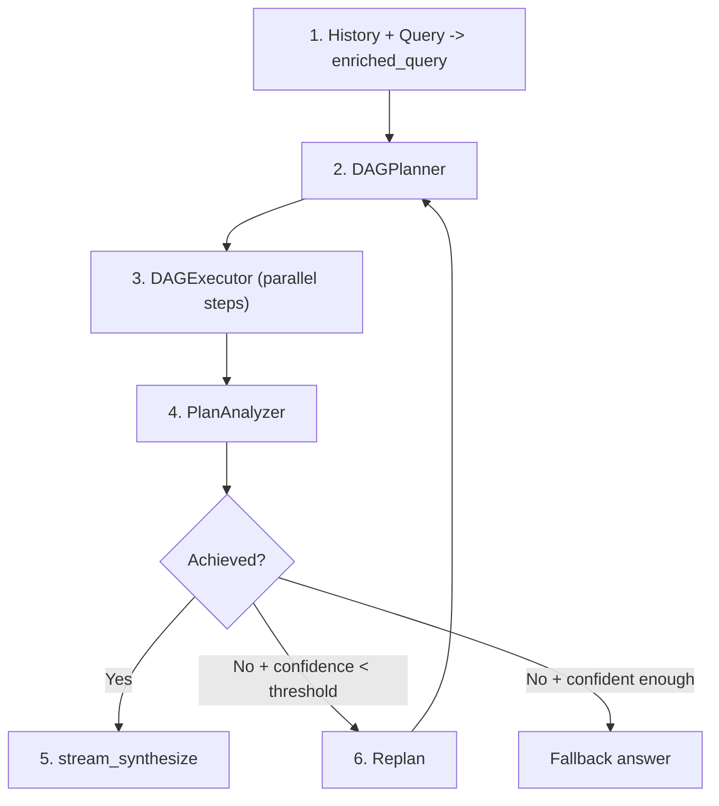
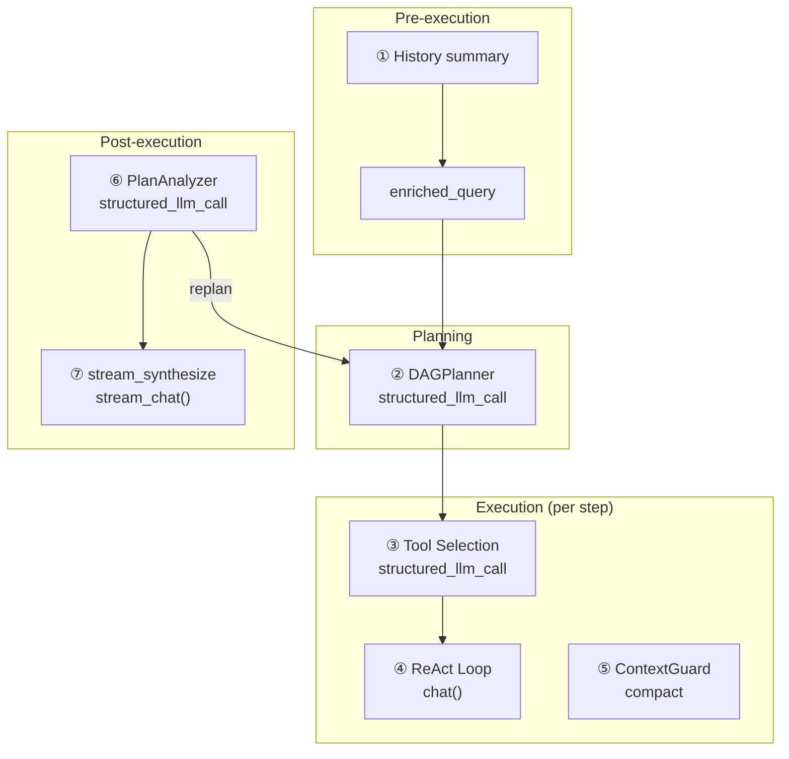
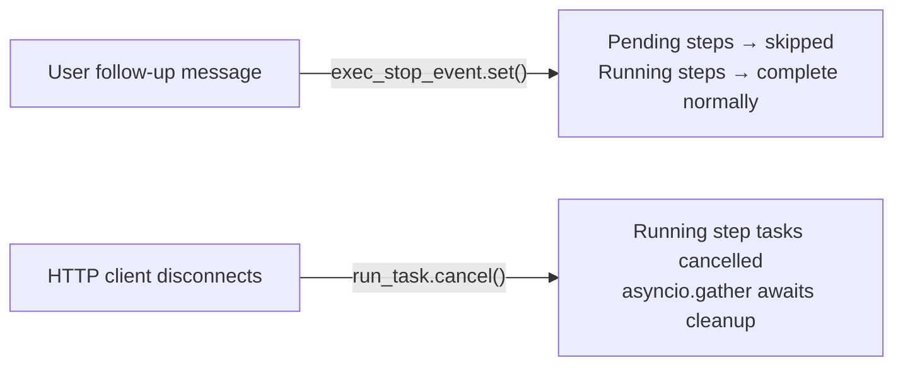

## 管道

DAG 模式将复杂目标分解为有向无环图 (DAG) 的步骤，以最大并行度执行它们，然后反思是否实际达成了目标。如果没有，它会重新规划并再次尝试 — 自主地，直到达到可配置的预算。

管道有四个阶段形成一个循环：

**规划。** 智能 LLM 将富化的查询分解为 2-6 个步骤，具有显式依赖边。每个步骤都获得任务描述、可选工具提示和模型提示，该提示控制它是在快速还是智能 LLM 上运行。

**执行。** DAGExecutor 并行启动独立步骤（最多 5 个并发），尊重依赖图。每个步骤作为自包含的 ReAct 智能体运行，没有内存 — 它仅接收其任务描述和已完成依赖的结果。

**分析。** PlanAnalyzer 评估执行的计划是否达成了原始目标，生成结构化的判决：`achieved`（布尔值）、`confidence`（0.0-1.0）、`reasoning` 和可选的 `final_answer`。

**重新规划。** 如果目标未达成且置信度低于停止阈值，管道循环回规划，使用重新规划上下文总结发生了什么以及哪里出错了。此循环自主运行最多 `DAG_MAX_REPLAN_ROUNDS` 次。

两个 LLM 全程协作：**智能 LLM** 处理规划、分析和答案合成（需要高推理能力的任务），而**通用 LLM** 默认处理步骤执行（使用 `model_hint="fast"` 的步骤委托给快速 LLM 以节省成本）。上下文压缩和历史摘要使用快速 LLM。每个结构化输出调用都使用 `structured_llm_call`，它提供 3 级降级链（Native FC、JSON Mode、带正则表达式回退的纯文本）来处理特定模型的输出怪癖。

## LLM 调用映射

完整的 DAG 管道进行七个不同类别的 LLM 调用。理解每个调用发生的位置、哪个模型处理它以及失败时会发生什么对于调试和成本优化至关重要。

| # | 调用位置 | 模块 | LLM 角色 | 格式 | 回退 |
|---|-----------|--------|----------|--------|----------|
| 1 | 历史摘要 | chat.py | 快速 LLM | 纯文本 | 截断最后 20K 字符 |
| 2 | DAGPlanner | planner.py | 智能 LLM | structured\_llm\_call | 3 级降级 |
| 3 | 工具选择 | react.py | 步骤 LLM | structured\_llm\_call | 返回所有工具 |
| 4 | ReAct 循环（每步） | react.py | 通用 LLM（默认）/ 快速 LLM（`model_hint="fast"`）/ 推理 LLM（`model_hint="reasoning"`） | chat() | 重试/回退 |
| 5 | ContextGuard 压缩 | context\_guard.py | 快速 LLM | 纯文本 | smart\_truncate |
| 6 | PlanAnalyzer | analyzer.py | 智能 LLM | structured\_llm\_call | regex + 默认值 |
| 7 | stream\_synthesize | analyzer.py | 智能 LLM | stream\_chat() | analysis.final\_answer |

调用 1 和 5 对用户**不可见** — 它们是管理上下文大小的基础设施调用。调用 2、6 和 7 使用**智能 LLM**，因为它们需要高推理能力（分解目标、判断成就、综合连贯答案）。调用 4 默认使用**通用 LLM** — 只有显式标记为 `model_hint="fast"` 的步骤才会降级到快速 LLM，标记为 `model_hint="reasoning"` 的步骤会提升到推理 LLM。调用 3 使用为该步骤解析的相同 LLM。

## DAGPlanner

规划器的工作是将高级目标转化为有效的 DAG，包含具体、可执行的步骤。它通过单次 `structured_llm_call` 调用智能 LLM 来完成此操作。

**提示词设计。** 规划提示词注入当前日期和年份（使 LLM 能够规划时间感知搜索），强制语言匹配（任务描述必须使用与目标相同的语言），并将步骤数限制在 2-6 之间。每个步骤有五个字段：`id`、`task`、`dependencies`、`tool_hint` 和 `model_hint`。提示词明确反对拆分平凡相关的子任务——"如果多个检查可以在单个脚本中完成，将它们合并为一个步骤。"

**结构化提取。** 规划器使用 `structured_llm_call` 配合 `_PLAN_SCHEMA`，该模式定义 `steps` 数组架构和一个 `parse_fn`，用于将原始字典转换为 `PlanStep` 对象。如果 LLM 返回单个步骤对象而不是 `{"steps": [...]}` 包装器，解析器会自动恢复。[ReAct 引擎——structured_llm_call](/architecture/react-engine#structured_llm_call--unified-output-extraction) 中记录的 3 级降级链处理跨提供商的模型输出异常。

**DAG 验证。** 提取后，规划器使用 Kahn 算法进行拓扑排序来验证图结构。检查两个不变量：

1. **无悬空引用。** 如果步骤引用计划中不存在的依赖 ID，该引用会被静默剪除并记录警告日志。这是一种恢复机制——LLM 有时会遗漏它们引用的步骤，硬失败会浪费整个规划调用。

2. **无循环。** 如果 Kahn 算法无法访问所有节点（意味着至少存在一个循环），规划器会抛出 `ValueError`。循环是不可恢复的——循环规划无法执行。

**model_hint。** 规划器为它认为简单且确定性的步骤分配 `"fast"`（数据查找、格式转换、直接检索），为需要标准推理的步骤分配 `null`（解析为通用模型），为需要深度分析的步骤分配 `"reasoning"`。执行器使用此提示通过 `ModelRegistry` 为每个步骤选择适当的 LLM。在不确定时，提示词指示 LLM 使用 `null`——使用更强大的模型总是更安全的。对于特定领域的任务（法律、医疗、金融），规划器从路由器接收领域上下文，并被引导为需要专家准确性的步骤分配 `model_hint="reasoning"`。

**输入构造。** 丰富的查询将对话历史与当前请求相结合。如果对话很长，历史通过 `DbMemory` 加载并格式化为 `"Previous conversation: ..."`。当生成的丰富查询超过 16K 令牌（通过 `CompactUtils.estimate_tokens` 估计）时，它会使用 ContextGuard 中的 `planner_input` 提示词由 LLM 进行总结，然后传递给规划器。当没有可用的快速 LLM 时的回退方案：硬截断到最后 20K 个字符。

## DAGExecutor

执行器接收一个经过验证的 `ExecutionPlan` 并并发运行其步骤，同时尊重依赖边并强制执行资源限制。

**并发模型。** 一个 `asyncio.Semaphore` 将并行步骤执行限制为 `max_concurrency`（默认为 5，可通过 `MAX_CONCURRENCY` 环境变量配置）。调度循环识别所有依赖项已完成的步骤，将它们作为 `asyncio.Task` 实例启动，并等待至少一个完成后再次检查。步骤按排序的 ID 顺序启动，以确保确定性行为。

**每步 ReAct 智能体。** 每个步骤作为由 `_resolve_agent()` 创建的独立 ReAct 智能体运行。如果步骤有一个 `model_hint` 与 `ModelRegistry` 中的角色匹配，则会创建一个具有相应 LLM 的临时智能体。否则，使用注册表的默认（通用）模型。这些每步智能体**没有记忆** — 它们从零开始，仅包含任务描述、原始目标、任何工具提示和已完成依赖项的结果。这种隔离是有意的：DAG 步骤应该是自包含的工作单元，不应在图中泄露状态。

**依赖上下文注入。** `_build_step_context()` 将所有已完成依赖步骤的结果格式化为文本块：每个依赖项的 ID、状态、任务描述和结果。如果配置了 `ContextGuard` 且组合上下文超过 `max_message_chars`，则会使用 `[Dependency context truncated]` 后缀进行硬截断。这可以防止依赖于多个冗长前置步骤的步骤超出其自身的上下文窗口。

**结构化内容乘数。** 当依赖结果包含结构化内容 — 法律引用、markdown 表格或代码块时，`_build_step_context()` 对截断预算应用乘数（默认 `3.0`，可通过 `DAG_STRUCTURED_CONTEXT_MULTIPLIER` 配置）。这确保引用、表格数据和其他结构化工件在步骤边界间得到保留，而不是被截断。

**步骤超时。** 每个步骤都用 `asyncio.wait_for` 包装，默认超时为 600 秒（10 分钟）。如果步骤超过此时间，它将被取消并标记为 `"failed"`，并附带超时消息。超时是按步骤的，而不是按计划的 — 一个 5 步计划如果步骤按顺序执行，理论上可以运行 50 分钟。

**中断和取消。** 执行器有两条不同的取消路径，每条由不同的事件触发：

*优雅跳过 — 停止事件。* 当用户在执行期间发送后续消息时，`chat.py` 中的编排器设置 `exec_stop_event`。执行器在每个调度循环的顶部检查此标志：如果设置，所有剩余的 `pending` 步骤立即标记为 `"skipped"`，原因为 `"Skipped — user changed requirements"`，循环退出。已运行的步骤允许完成 — 仅未启动的步骤被放弃。这种快速退出让管道能够围绕用户的更新意图重新规划，而无需等待完整的原始计划完成。

*立即中止 — asyncio 取消。* 当 HTTP 客户端断开连接时，`chat.py` 通过 `asyncio.Task.cancel()` 取消顶级 `run_task`。执行器捕获 `asyncio.CancelledError`，取消所有当前运行的步骤任务，通过 `asyncio.gather(..., return_exceptions=True)` 等待它们确认，然后重新抛出。客户端断开连接通过在 SSE 事件循环内每 0.5 秒轮询一次 `await request.is_disconnected()` 来检测。

语义差异很重要：**停止事件**意味着"跳过尚未启动的内容，但保留已运行的内容" — 已完成的步骤结果保持可用以通知重新规划。**CancelledError** 意味着"立即中止所有内容" — 所有进行中的工作被丢弃，无法恢复结果。

**死锁检测。** 如果调度循环发现没有任务运行且没有步骤准备启动（因为它们的依赖项失败），所有剩余的待处理步骤都标记为 `"failed"`，并附带说明其依赖项从未完成的消息。这可以防止执行器无限期挂起。

**进度回调。** 执行器为三种事件类型触发 `(step_id, event, data)` 回调：`"started"`（步骤启动）、`"iteration"`（步骤内的工具调用）和 `"completed"`（步骤完成）。`chat.py` 中的 SSE 层将这些回调桥接到前端用于渲染实时 DAG 可视化的 `step_progress` 事件。

## 引用验证

每个步骤完成后，执行器可选地运行**引用验证器**，检查步骤输出中的事实声明。这由 `DAG_CITATION_VERIFICATION` 环境变量控制（默认值：`true`），并针对引用不准确会带来高风险的领域——法律法规、医学参考文献和财务法规。

验证器分三个阶段运行：

1. **提取。** 正则表达式模式识别步骤结果中类似引用的字符串（例如案例号、法规参考、法规代码）。
2. **验证。** 每个提取的引用由 LLM 判断调用评估，检查合理性和内部一致性。
3. **失败时重试。** 如果验证失败，步骤将重试，并将更正反馈附加到任务描述中，让智能体有机会修复不准确的参考文献。

引用验证会增加包含引用的步骤的延迟，但不影响不包含引用的步骤。如果您的用例不涉及引用敏感领域，可通过设置 `DAG_CITATION_VERIFICATION=false` 来禁用它。

## 领域感知路由

自动路由器现在使用 **`domain_hint`** 对查询进行分类，同时保留现有的模式选择。识别的领域包括 `legal`、`medical` 和 `financial`；这些领域之外的查询接收 `null`。

领域分类以两种方式影响管道：

**DAG 模式。** 当路由器选择 DAG 并提供非空 `domain_hint` 时，领域上下文被注入到规划器提示中。这引导规划器为需要专家级准确性的步骤分配 `model_hint="reasoning"`，并为与可用领域技能匹配的步骤建议 `tool_hint="read_skill"`。

**ReAct 模式。** 当路由器为领域特定查询选择 ReAct 时，系统通过 `registry.get_by_role("reasoning")` 从通用模型升级到**推理模型**。此外，会注入强制性指令，要求智能体在编写任何领域特定内容之前使用 `web_search`，并通过搜索验证引文。`read_skill` 工具在工具选择中被固定（不被过滤），确保领域知识始终可访问。

路由偏差也会改变：紧密耦合的领域分析（其中多个子任务共享上下文和引文）倾向于 ReAct 模式，以避免在 DAG 步骤边界之间丢失上下文。

## PlanAnalyzer

分析器评估执行的计划是否达成了原始目标。它生成一个结构化的 `AnalysisResult`，包含四个字段：

- **`achieved`** (布尔值) — 仅当目标完全实现时为 `true`。
- **`confidence`** (浮点数，0.0-1.0) — 分析器对其评估的确定程度。相互矛盾的来源会降低此分数。
- **`final_answer`** (字符串或 null) — 当达成目标时的综合答案，否则为 `null`。
- **`reasoning`** (字符串) — LLM 的思维链推理过程。

**结构化提取。** 分析器使用 `structured_llm_call` 配合 `_ANALYSIS_SCHEMA`、处理类型强制转换和置信度限制的 `parse_fn`，以及用于格式错误 JSON 的 `regex_fallback`。正则表达式回退 (`_regex_extract_analysis`) 使用模式匹配从部分有效的 JSON 中提取 `achieved`、`confidence`、`final_answer` 和 `reasoning` 字段。这很重要，因为分析响应往往比规划响应更长更复杂，使得 JSON 格式错误更容易发生。

**安全默认值。** 如果所有提取级别都失败（原生 FC、JSON 模式、纯文本、正则表达式），分析器返回 `AnalysisResult(achieved=False, confidence=0.0, reasoning="Could not parse analysis response")`。这确保管道始终获得可用的结果——解析失败变成"未达成"的判决，触发重新规划而不是崩溃。

**步骤结果格式化。** 每个步骤的结果在分析提示中被截断为 10K 字符。这可以防止单个步骤的冗长输出（例如大型网页抓取或文件转储）主导分析器的上下文窗口并挤占其他步骤结果的空间。

**多源比较。** 分析提示包含一条指令，要求明确比较来自不同来源的结果。当网页搜索结果、知识库检索和文件操作都贡献数据时，分析器必须标记矛盾（不同的数字、日期、声明），并指出哪个来源可能更权威。矛盾会降低置信度分数，进而影响重新规划的决策。

## 重新规划

重新规划循环是 DAG 引擎最独特的特性：它可以通过反思出了什么问题并尝试不同的方法来自主恢复部分故障。

**决策逻辑。** 在每一轮计划-执行-分析之后，`chat.py` 中的编排器评估分析结果：

1. **`achieved == True`** — 退出循环，继续进行流式合成。
2. **此轮期间发生用户注入** — 始终重新规划，无论置信度或预算如何。用户后续消息被视为需求变更，需要重新尝试。这不会消耗自主重新规划预算。
3. **自主重新规划预算已耗尽** — 退出循环。预算为 `max_replan_rounds - 1` 次自主重新规划（默认：从总共 3 轮中进行 2 次自主重新规划）。
4. **`confidence >= replan_stop_confidence`** — 退出循环。即使目标未完全实现，高置信度分数（默认阈值：0.8，可通过 `DAG_REPLAN_STOP_CONFIDENCE` 配置）表明分析器对发生的情况相当确定 — 重新规划不太可能有帮助。
5. **其他情况** — 重新规划。目标未实现，置信度低，预算仍有余额。

**重新规划上下文。** 重新规划时，编排器调用 `_format_replan_context()` 来构建前一轮的摘要。这包括分析器的推理和每个步骤结果的截断预览（每个步骤最多 500 个字符）。激进的截断是有意的：规划器需要知道*发生了什么*和*哪里出错了*，而不是每个步骤输出的完整细节。此上下文与原始富化查询一起作为 `context` 参数传递给 `DAGPlanner.plan()`。

**最大轮数。** `DAG_MAX_REPLAN_ROUNDS` 环境变量（默认 3）控制规划轮数的总数。使用默认设置，第一轮是初始规划，最多留下 2 次自主重新规划。用户触发的重新规划（通过消息注入）不计入此预算 — 用户可以无限期地引导管道。

**SSE 事件。** 当管道决定重新规划时，它会发出包含分析器推理的 `replanning` 阶段事件。前端使用此事件向用户显示管道重试的原因。

**enriched_query 累积。** 用户后续消息在各轮中附加到富化查询：`enriched_query += "\n\n[User follow-up]: {content}"`。这意味着规划器在构建修订计划时看到用户意图的完整演变 — 原始请求加上所有后续澄清。

## 流式合成

当分析器确认目标已实现（`analysis.achieved == True`）时，管道通过 `PlanAnalyzer.stream_synthesize()` 向用户流式传输合成的最终答案。

**输入。** 合成调用接收三个输入：原始目标、格式化的步骤结果（每个步骤最多 10K 字符）和分析器来自非流式分析调用的推理。推理提供了合成应涵盖内容的"路线图"。

**系统提示。** 合成提示指示 LLM 直接回答，不包含元注释（"不要包含诸如'基于结果'之类的短语"），匹配原始目标的语言，并在适用时比较来自不同来源的结果。如果可用，将从用户偏好设置追加语言指令。

**流式传输。** 该方法使用 `stream_chat()` 逐步生成令牌。SSE 层将每个块包装在带有 `status: "delta"` 的 `answer` 事件中，为前端提供最终答案的实时渲染。

**回退链。** 两个回退路径处理失败：

1. **stream_synthesize 引发异常** — 回退到非流式 `analyze()` 调用中的 `analysis.final_answer`。此答案已在分析期间生成，因此即使流式调用失败也可用。

2. **目标未实现（未尝试合成）** — 连接所有已完成的步骤结果，用水平线分隔。每个结果以其步骤 ID 为前缀。如果根本没有步骤完成，返回 `"(goal not achieved)"`。

回退设计确保用户始终获得答案 — 虽然可能降级但永远不会为空。

## 多LLM架构

DAG引擎的成本和延迟特性由其多模型设计决定。分工如下：

| 角色 | 用途 | 优化方向 |
|------|----------|---------------|
| **Smart LLM** | 规划、分析、答案合成 | 推理能力 |
| **General LLM** | 步骤执行（默认）、ReAct智能体 | 能力和成本的平衡 |
| **Fast LLM** | `model_hint="fast"`步骤、上下文压缩、历史摘要 | 成本和延迟 |
| **Reasoning LLM** | `model_hint="reasoning"`步骤、领域升级的ReAct | 深度分析能力 |

Smart LLM处理三个需要最深层推理的调用：将目标分解为连贯的计划、判断计划是否达成目标，以及合成最终答案来连贯整合多个步骤结果。这些调用每轮发生一次（或仅在合成时发生一次），因此其较高的单位令牌成本被摊销。

General LLM默认处理步骤执行——每个DAG步骤的ReAct循环在General模型上运行，除非规划器明确分配不同的`model_hint`。Fast LLM保留用于标记为`model_hint="fast"`的步骤（简单查询、格式转换）和基础设施调用（上下文压缩、历史摘要）。Reasoning LLM用于标记为`model_hint="reasoning"`的步骤和领域升级的ReAct任务（参见[领域感知路由](#domain-aware-routing)）。

**按步骤覆盖。** 每个`PlanStep`上的`model_hint`字段控制哪个LLM运行该步骤。当`model_hint`为`null`时，执行器使用General模型。当为`"fast"`时，执行器通过模型注册表使用Fast LLM。当为`"reasoning"`时，执行器使用Reasoning LLM。规划器被指示为确定性任务设置`"fast"`、为标准推理设置`null`、为深度分析设置`"reasoning"`——但也可以设置为在`ModelRegistry`中注册的任何自定义角色。模型解析在**每个步骤一次**通过`_resolve_agent()`进行，时间在该步骤的ReAct循环开始之前——步骤内的所有迭代（工具选择、ReAct循环、ContextGuard压缩）使用相同的已解析LLM。模型在步骤中途永远不会改变。

**预算独立性。** 每个LLM角色都有独立的上下文预算，从其模型配置计算得出。DAG步骤执行使用已解析步骤模型的预算（默认为General）；规划和分析调用使用Smart LLM的预算。这很重要，因为操作者通常将大上下文模型（128K+）用于规划，而为步骤执行使用不同的模型。有关预算如何计算的详细信息，请参见[上下文管理——预算配置](/architecture/context-management#layer-5--budget-configuration)。
