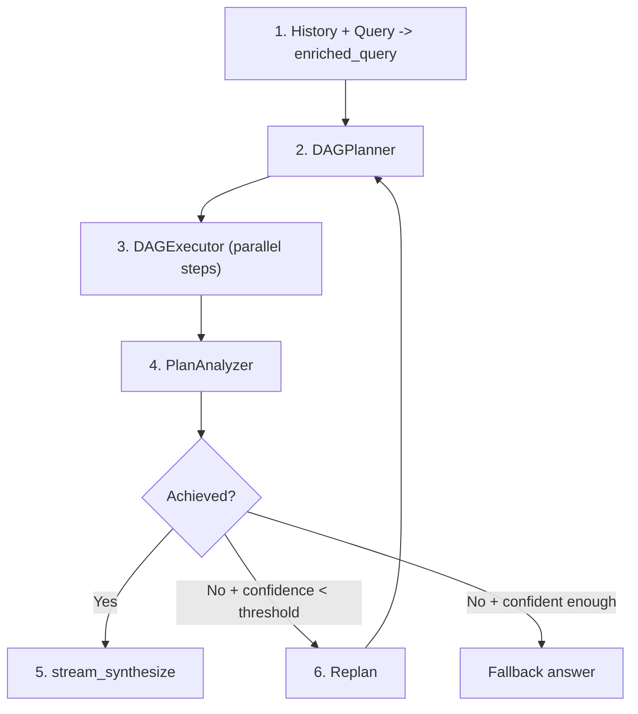
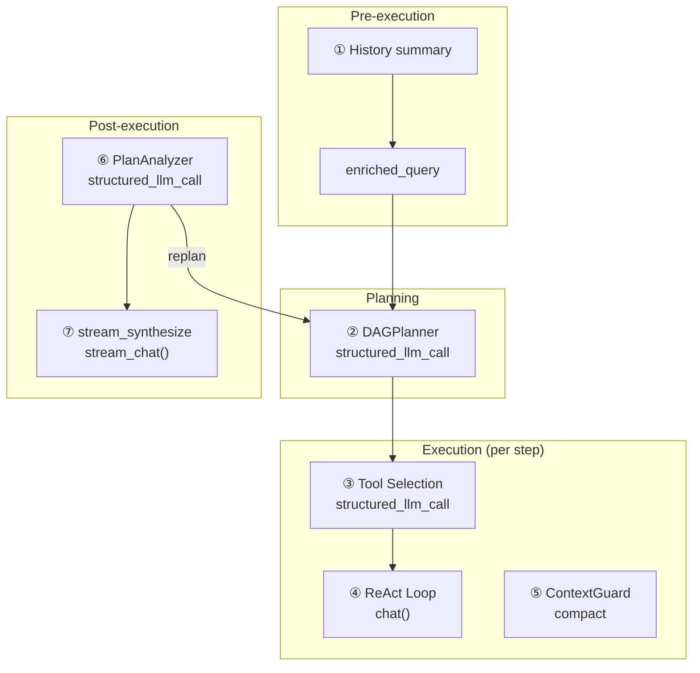

## 流水线概览

DAG 模式将复杂目标分解为一个有向无环图（DAG）的步骤，以最大并行度执行，然后反思目标是否真正达成。如果未达成，它会重新规划并再次尝试——全程自主，受限于可配置的预算。

流水线包含四个阶段，形成一个循环：

**规划。** 智能 LLM 将 enriched query 分解为 2-6 个步骤，步骤之间有明确的依赖边。每个步骤包含任务描述、可选的工具提示，以及一个控制其使用快速还是智能 LLM 的模型提示。

**执行。** DAGExecutor 并行启动独立步骤（最多 5 个并发），同时遵守依赖图。每个步骤作为一个自包含的 ReAct 智能体运行，没有 Memory——它仅接收任务描述和已完成依赖步骤的结果。

**分析。** PlanAnalyzer 评估已执行的计划是否达成了原始目标，产出一个结构化判定：`achieved`（布尔值）、`confidence`（0.0-1.0）、`reasoning`，以及可选的 `final_answer`。

**重规划。** 如果目标未达成且置信度低于停止阈值，流水线会携带一个总结了上一轮发生了什么及哪里出了问题的重规划上下文，循环回到规划阶段。该循环最多自主运行 `DAG_MAX_REPLAN_ROUNDS` 次。

两个 LLM 全程协作：**智能 LLM** 负责规划、分析和答案合成（需要高推理能力的任务），**快速 LLM** 负责步骤执行和上下文压缩（成本和延迟比峰值推理能力更重要的任务）。所有结构化输出调用使用 `structured_llm_call`，它提供三级降级链（Native FC、JSON Mode、纯文本 + 正则回退），以应对不同模型的输出格式差异。

## LLM 调用图

完整的 DAG 流水线包含七类不同的 LLM 调用。理解每个调用发生在何处、由哪个模型处理、失败时如何应对，对于调试和成本优化至关重要。

| # | 调用点 | 模块 | LLM 角色 | 格式 | 降级方案 |
|---|--------|------|----------|------|---------|
| 1 | 历史摘要 | chat.py | 快速 LLM | 纯文本 | 截断最后 20K 字符 |
| 2 | DAGPlanner | planner.py | 智能 LLM | structured\_llm\_call | 三级降级 |
| 3 | 工具选择 | react.py | 步骤 LLM | structured\_llm\_call | 返回全部工具 |
| 4 | ReAct 循环（每步） | react.py | 快速/智能 LLM | chat() | 重试/降级 |
| 5 | ContextGuard 压缩 | context\_guard.py | 快速 LLM | 纯文本 | smart\_truncate |
| 6 | PlanAnalyzer | analyzer.py | 智能 LLM | structured\_llm\_call | 正则 + 默认值 |
| 7 | stream\_synthesize | analyzer.py | 智能 LLM | stream\_chat() | analysis.final\_answer |

调用 1 和 5 对用户**不可见**——它们是管理上下文大小的基础设施调用。调用 2、6、7 使用**智能 LLM**，因为它们需要高推理能力（分解目标、判断达成情况、合成连贯答案）。调用 3 和 4 默认使用**快速 LLM**，因为每个 DAG 步骤应该是聚焦、有界的任务——不过，`model_hint: null` 的步骤可以通过模型注册表提升到智能 LLM。

## DAGPlanner

规划器的职责是将高层目标转化为一个合法的 DAG，由具体可操作的步骤组成。它通过对智能 LLM 的一次 `structured_llm_call` 调用来完成。

**提示词设计。** 规划提示词注入当前日期时间和年份（以便 LLM 能规划时间感知的搜索），强制语言匹配（任务描述必须使用与目标相同的语言），并将步骤数限制在 2-6 个。每个步骤有五个字段：`id`、`task`、`dependencies`、`tool_hint` 和 `model_hint`。提示词明确反对拆分无意义的细粒度子任务——"如果几项检查可以在一个脚本中完成，就合并为一个步骤。"

**结构化提取。** 规划器使用 `structured_llm_call`，配合定义了 `steps` 数组模式的 `_PLAN_SCHEMA` 和一个将原始字典转换为 `PlanStep` 对象的 `parse_fn`。如果 LLM 返回单个步骤对象而非 `{"steps": [...]}` 包装，解析器会自动恢复。三级降级链的详细文档参见 [ReAct 引擎 — structured\_llm\_call](/zh/architecture/react-engine#structured_llm_call--unified-output-extraction)。

**DAG 验证。** 提取后，规划器使用 Kahn 算法进行拓扑排序来验证图结构。检查两个不变量：

1. **无悬空引用。** 如果某个步骤引用了计划中不存在的依赖 ID，该引用会被静默修剪并记录警告日志。这是一种恢复机制——LLM 有时会省略它引用过的步骤，硬失败会浪费整个规划调用。

2. **无环。** 如果 Kahn 算法无法访问所有节点（意味着存在至少一个环），规划器抛出 `ValueError`。环是不可恢复的——有环的计划无法执行。

**model\_hint。** 规划器为它认为简单且确定性的步骤（数据查找、格式转换、直接检索）分配 `"fast"`，为需要更深层推理的步骤分配 `null`。执行器根据这个提示为每个步骤选择合适的 LLM。当不确定时，提示词指示 LLM 使用 `null`——使用更强的模型总是更安全的。

**输入构建。** enriched query 将对话历史与当前请求合并。如果对话较长，历史通过 `DbMemory` 加载并格式化为 `"Previous conversation: ..."`。当生成的 enriched query 超过 16K token（通过 `CompactUtils.estimate_tokens` 估算），会使用 ContextGuard 的 `planner_input` 场景提示进行 LLM 摘要后再传给规划器。当没有可用的快速 LLM 时的降级方案：硬截断到最后 20K 字符。

## DAGExecutor

执行器接收一个已验证的 `ExecutionPlan`，并发运行其步骤，同时遵守依赖边并执行资源限制。

**并发模型。** 一个 `asyncio.Semaphore` 将并行步骤执行限制为 `max_concurrency`（默认 5，可通过 `MAX_CONCURRENCY` 环境变量配置）。调度循环识别所有依赖已完成的步骤，将它们作为 `asyncio.Task` 实例启动，并等待至少一个完成后再重新检查。步骤按 ID 排序启动，以确保行为确定性。

**每步 ReAct 智能体。** 每个步骤作为由 `_resolve_agent()` 创建的独立 ReAct 智能体运行。如果步骤的 `model_hint` 匹配 `ModelRegistry` 中的某个角色，会创建一个使用相应 LLM 的临时智能体。否则，使用默认的快速 LLM 智能体。这些每步智能体**没有 Memory**——它们仅带着任务描述、原始目标、任何工具提示和已完成依赖步骤的结果从零开始。这种隔离是刻意的：DAG 步骤应该是自包含的工作单元，不在图中泄露状态。

**依赖上下文注入。** `_build_step_context()` 将所有已完成依赖步骤的结果格式化为文本块：每个依赖的 ID、状态、任务描述和结果。如果配置了 `ContextGuard` 且合并后的上下文超过 `max_message_chars`，会进行字符级硬截断并附加 `[Dependency context truncated]` 后缀。这防止了一个依赖多个冗长前置步骤的步骤撑爆自身的上下文窗口。

**步骤超时。** 每个步骤都包装在 `asyncio.wait_for` 中，默认超时 600 秒（10 分钟）。如果步骤超时，会被取消并标记为 `"failed"`，附带超时消息。超时是按步骤计算的，而非按计划——一个 5 步的计划如果步骤顺序执行，理论上可以运行 50 分钟。

**停止事件。** 当用户在执行过程中发送后续消息时，编排器设置 `exec_stop_event`。执行器在每个调度循环的顶部检查此事件：如果已设置，所有剩余待处理步骤标记为 `"skipped"`，执行循环退出。已经在运行的步骤允许完成——只有未启动的步骤被跳过。

**死锁检测。** 如果调度循环发现没有运行中的任务且没有就绪可启动的步骤（因为它们的依赖失败了），所有剩余的待处理步骤标记为 `"failed"`，附带解释其依赖未完成的消息。这防止执行器无限挂起。

**进度回调。** 执行器为三种事件类型触发 `(step_id, event, data)` 回调：`"started"`（步骤启动）、`"iteration"`（步骤内的工具调用）和 `"completed"`（步骤完成）。`chat.py` 中的 SSE 层将这些回调桥接为 `step_progress` 事件，前端用此渲染实时 DAG 可视化。

## PlanAnalyzer

分析器评估已执行的计划是否达成了原始目标。它产出一个包含四个字段的结构化 `AnalysisResult`：

- **`achieved`**（布尔值）——仅在目标完全达成时为 `true`。
- **`confidence`**（浮点数，0.0-1.0）——分析器对其判断的确信程度。来源之间的矛盾会降低此分数。
- **`final_answer`**（字符串或 null）——达成时的合成答案，否则为 `null`。
- **`reasoning`**（字符串）——LLM 的思维链论证。

**结构化提取。** 分析器使用 `structured_llm_call`，配合 `_ANALYSIS_SCHEMA`、一个处理类型转换和置信度钳位的 `parse_fn`，以及一个用于格式错误 JSON 的 `regex_fallback`。正则回退（`_regex_extract_analysis`）通过模式匹配从部分有效的 JSON 中提取 `achieved`、`confidence`、`final_answer` 和 `reasoning` 字段。这很重要，因为分析响应往往比规划响应更长更复杂，JSON 格式错误的概率更高。

**安全默认值。** 如果所有提取层级都失败（Native FC、JSON Mode、纯文本、正则），分析器返回 `AnalysisResult(achieved=False, confidence=0.0, reasoning="Could not parse analysis response")`。这确保流水线始终获得可用的结果——解析失败变成"未达成"判定，触发重规划而非崩溃。

**步骤结果格式化。** 每个步骤的结果在分析提示词中被截断到 10K 字符。这防止某个步骤的冗长输出（如大型网页抓取或文件内容导出）主导分析器的上下文窗口，挤占其他步骤结果的空间。

**多源对比。** 分析提示词包含一条指令，要求明确对比来自不同来源的结果。当 web 搜索结果、知识库检索和文件操作都贡献了数据时，分析器必须标记矛盾之处（不同的数字、日期、论断），并指出哪个来源可能更权威。矛盾会降低置信度分数，进而影响重规划决策。

## 重规划

重规划循环是 DAG 引擎最具特色的功能：它能够通过反思哪里出了问题并尝试不同方法，自主地从部分失败中恢复。

**决策逻辑。** 在每一轮规划-执行-分析之后，`chat.py` 中的编排器评估分析结果：

1. **`achieved == True`** ——退出循环，进入流式合成。
2. **本轮发生了用户注入** ——无论置信度或预算如何，始终重规划。用户后续消息被视为需求变更，需要全新尝试。这不消耗自主重规划预算。
3. **自主重规划预算耗尽** ——退出循环。预算为 `max_replan_rounds - 1` 次自主重规划（默认：总共 3 轮中有 2 次自主重规划）。
4. **`confidence >= replan_stop_confidence`** ——退出循环。即使目标未完全达成，高置信度分数（默认阈值：0.8，可通过 `DAG_REPLAN_STOP_CONFIDENCE` 配置）表明分析器对情况相当确定——重规划不太可能有帮助。
5. **其他情况** ——重规划。目标未达成，置信度低，预算尚有余量。

**重规划上下文。** 重规划时，编排器调用 `_format_replan_context()` 构建上一轮的摘要。这包括分析器的推理和每个步骤结果的截断预览（每步最多 500 字符）。激进的截断是刻意为之：规划器需要知道*发生了什么*和*哪里出了问题*，而不是每个步骤输出的完整细节。此上下文作为 `context` 参数与原始 enriched query 一起传给 `DAGPlanner.plan()`。

**最大轮数。** `DAG_MAX_REPLAN_ROUNDS` 环境变量（默认 3）控制规划的总轮数。使用默认设置，第一轮是初始规划，剩余最多 2 次自主重规划。用户触发的重规划（通过消息注入）不计入此预算——用户可以无限引导流水线。

**SSE 事件。** 当流水线决定重规划时，会发出一个包含分析器推理的 `replanning` 阶段事件。前端用此向用户展示流水线为什么要重试。

**enriched\_query 累积。** 用户后续消息会跨轮追加到 enriched query：`enriched_query += "\n\n[User follow-up]: {content}"`。这意味着规划器在构建修订计划时能看到用户意图的完整演变——原始请求加上所有后续澄清。

## 流式合成

当分析器确认目标已达成（`analysis.achieved == True`）时，流水线通过 `PlanAnalyzer.stream_synthesize()` 向用户流式输出合成的最终答案。

**输入。** 合成调用接收三个输入：原始目标、格式化的步骤结果（每步最多 10K 字符），以及非流式分析调用中分析器的推理。推理为合成内容应涵盖的要点提供了"路线图"。

**系统提示词。** 合成提示词指示 LLM 直接回答，避免元评论（"不要包含'根据结果'之类的短语"），匹配原始目标的语言，并在适用时对比不同来源的结果。如果有用户偏好的语言指令，也会追加。

**流式传输。** 该方法使用 `stream_chat()` 增量地输出 token。SSE 层将每个块包装在 `status: "delta"` 的 `answer` 事件中，使前端能实时渲染最终答案。

**降级链。** 两条降级路径处理失败：

1. **stream\_synthesize 抛出异常** ——降级到非流式 `analyze()` 调用中的 `analysis.final_answer`。该答案在分析阶段已经生成，因此即使流式调用失败也可用。

2. **目标未达成（未尝试合成）** ——拼接所有已完成步骤的结果，以水平分隔线分隔。每个结果以其步骤 ID 为前缀。如果没有任何步骤完成，返回 `"(goal not achieved)"`。

降级设计确保用户始终能获得答案——质量可能有所退化，但绝不会为空。

## 双 LLM 架构

DAG 引擎的成本和延迟特性由其双模型设计决定。分工如下：

| 角色 | 用途 | 优化目标 |
|------|------|---------|
| **智能 LLM** | 规划、分析、答案合成 | 推理能力 |
| **快速 LLM** | 步骤执行、上下文压缩、历史摘要 | 成本和延迟 |

智能 LLM 处理需要最深层推理的三类调用：将目标分解为连贯的计划、判断计划是否达成目标、以及合成一个连贯整合多步结果的最终答案。这些调用每轮发生一次（合成仅总共一次），因此其较高的单 token 成本被摊薄了。

快速 LLM 处理高频调用：每个 DAG 步骤的 ReAct 循环（可能涉及多次工具调用和迭代）、步骤上下文过大时的上下文压缩、以及多轮对话的历史摘要。一个 5 步计划中每步 3 次迭代意味着 15+ 次快速 LLM 调用——在这里使用智能 LLM 的成本将高得令人望而却步。

**每步覆盖。** 每个 `PlanStep` 上的 `model_hint` 字段允许规划器将个别步骤提升到智能 LLM。当 `model_hint` 为 `null` 时，执行器使用默认智能体（快速 LLM）。当其为 `"fast"` 时，执行器通过模型注册表显式使用快速 LLM。规划器被指示为确定性任务设置 `"fast"`，为复杂推理设置 `null`，但也可以设置为 `ModelRegistry` 中注册的任何自定义角色。模型解析在每个 Step 开始前通过 `_resolve_agent()` **执行一次**——该 Step 内的所有迭代（工具选择、ReAct 循环、ContextGuard 压缩）都使用同一个已解析的 LLM，模型不会在 Step 中途切换。

**预算独立。** 智能和快速 LLM 有独立的上下文预算，分别从各自的模型配置计算得出。DAG 步骤执行使用快速 LLM 的预算；规划和分析调用使用智能 LLM 的预算。这很重要，因为运营者通常会为规划搭配大上下文模型（128K+），为步骤执行搭配更小更快的模型（32K）。预算计算的详细信息请参阅[上下文管理 — 预算配置](/zh/architecture/context-management#第-5-层--预算配置)。
