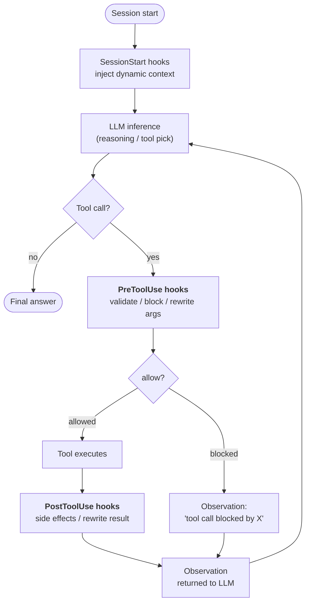
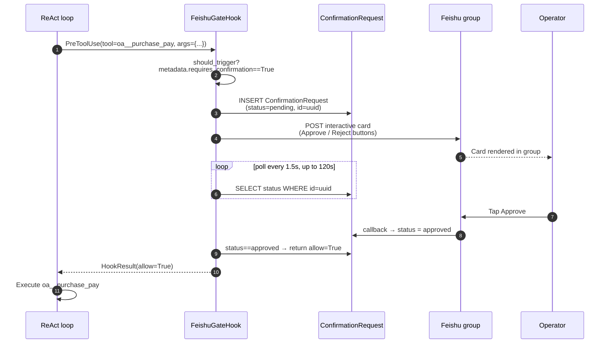

## 为什么需要 hooks

系统提示词中的指令是**建议**。足够固执或困惑的 LLM 可以忽略它们。对于大多数智能体行为，这正是你想要的——指令给模型适应的空间。

但某些要求不是建议。"每个敏感工具调用都必须被记录。" "当组织处于只读模式时，写操作被阻止。" "超过 ¥50k 的付款在执行前需要人工确认。" 这些是**不变量**——关于系统的事实，无论模型在任何给定轮次中做什么决定，都必须成立。

Hook 是在智能体执行生命周期中明确定义的点**在 LLM 循环之外**运行的代码。LLM 看不到 hook。LLM 无法与 hook 争论。LLM 无法说服 hook 跳过某个步骤。如果 `PreToolUse` hook 返回 `allow=False`，工具调用就不会发生——无论推理跟踪有多坚持。

这是关键的架构区别：

| 机制 | 运行位置 | 谁控制它 | 保证 |
|---|---|---|---|
| **系统提示词指令** | LLM 推理内部 | 模型 | "可能遵循它" |
| **工具描述 / schema** | LLM 推理内部 | 模型 | "可能遵循它" |
| **Hook** | LLM 推理周围 | 平台代码 | **总是运行** |

Hooks 是 FIM One 如何将"智能体应该..."转变为"智能体无法绕过..."的方式。

## 钩子的插入点

目前定义了三个钩子点。每个都标记了智能体在一次循环迭代中跨越的边界：



| 钩子点 | 触发时机 | 能否阻止？ | 能否修改数据？ |
|---|---|---|---|
| `SessionStart` | 会话的第一次 LLM 调用之前 | 否 | 是 — 将上下文注入初始提示词 |
| `PreToolUse` | LLM 选择工具之后，工具运行之前 | **是**（通过 `allow=False`） | 是 — 可在执行前重写 `tool_args` |
| `PostToolUse` | 工具返回之后，观察结果发送给 LLM 之前 | 否 | 是 — 可重写观察结果 |

同一点的多个钩子按优先级顺序运行。较早的 `PreToolUse` 钩子重写的参数会传递给后续钩子，因此中间件可以组合。

## 何时使用 hook 与指令

决定是否用提示词指令或 hook 来解决需求，与"运行时断言 vs. 代码注释"的计算方式相同：

| 症状 | 解决方案 |
|---|---|
| "智能体在 Y 时应优先选择 X" | 指令 — 软性指导，模型有自由度 |
| "智能体必须记录对连接器 Z 的每次调用" | **PostToolUse hook** — 不能依赖模型记住 |
| "超过 ¥50k 的支付需要人工审批" | **PreToolUse hook** — 不能依赖模型主动询问 |
| "智能体应该用中文自我介绍" | 指令 — 风格化的，遗漏成本低 |
| "智能体不能在只读模式下写入生产数据库" | **PreToolUse hook** — 安全不变量，零容错 |
| "智能体应该总结长数据库查询结果" | 两者都可以，但 hook 更稳健 — 见 PostToolUse 截断 |

经验法则：**如果错误行为会导致事故，使用 hook。如果错误行为只是小烦恼，指令就足够了。**

## hook 合约

hook 是 `PreToolUseHook`、`PostToolUseHook` 或 `SessionStartHook` 的子类，具有一个必需方法：

```python
class ReadOnlyGuard(PreToolUseHook):
    name = "readonly_guard"
    priority = 5                          # lower runs earlier

    def should_trigger(self, ctx: HookContext) -> bool:
        return ctx.tool_name.startswith("sql_")

    async def execute(self, ctx: HookContext) -> HookResult:
        if org_is_readonly(ctx.metadata["org_id"]):
            return HookResult(
                allow=False,
                error="Org is in read-only mode — write blocked.",
                side_effects=["readonly_guard: blocked sql write"],
            )
        return HookResult()               # default: allow=True, no mutation
```

传入的 `HookContext` 包含 `tool_name`、`tool_args`、`agent_id`、`user_id` 和一个灵活的 `metadata` 字典，引擎会填充每个请求的事实（组织 id、对话 id、连接器操作的 `requires_confirmation` 标志等）。

返回的 `HookResult` 控制结果：

- `allow: bool = True` — 工具调用是否继续进行（对于 `PostToolUse` / `SessionStart` 忽略）
- `error: str | None` — 人类可读的原因，在被阻止时作为观察结果呈现给 LLM
- `modified_args: dict | None` — 如果设置，在执行前替换工具参数
- `modified_result: Any | None` — 如果设置（PostToolUse），在返回给 LLM 前替换观察结果
- `side_effects: list[str]` — hook 所做操作的审计跟踪，合并到智能体的跟踪中

## 案例研究：`FeishuGateHook`

在这个系统之上发布的第一个钩子是 `FeishuGateHook` — 一个 `PreToolUse` 钩子，它将任何标记为 `requires_confirmation=True` 的工具转换为发送到组织 Feishu 群组的人工审批卡片。

这个钩子演示了完整的生命周期：



这个设计的优势：

- **工具调用被真正暂停。** 智能体的 SSE 流在"我将调用 `oa__purchase_pay`"和观察结果之间暂停。用户看到智能体在等待，这与底层实际发生的情况相匹配。
- **审批在进程重启后仍然存在。** 待处理行在数据库中，而不是在内存中。如果后端在卡片未处理时重启，下一次轮询会从中断处继续。
- **决策被审计。** `ConfirmationRequest` 保存 `payload`、`responded_at`、`responded_by_open_id` 和最终状态 — 一份谁在何时批准了什么的可审计记录。
- **决策循环中没有 LLM。** 模型生成工具调用。人类生成判决。钩子是确定性的桥梁。

`FeishuGateHook` 依赖于配置的 [Feishu 频道](/configuration/channels/feishu) — 钩子通过频道的 `send_interactive_card()` 方法发送卡片，并监听频道解析的回调事件。这种分离是有意的：钩子拥有"审批状态机"，频道拥有"IM 平台机制"。同一个钩子明天可以针对 Slack 或 WeCom，而无需改变其逻辑 — 只需改变频道实现。

## 计划中的 hooks (v0.9)

四种 hook 模式在 v0.9 路线图中，都复用相同的生命周期：

| Hook | 触发点 | 目的 |
|---|---|---|
| `AuditLogHook` | PostToolUse | 在每次连接器调用时自动写入 `ConnectorCallLog`。目前这是手动的；将其作为 hook 可以确保覆盖。 |
| `ReadOnlyGuard` | PreToolUse | 当组织处于只读模式时阻止写入。 |
| `ResultTruncateHook` | PostToolUse | 在工具观察到达 LLM 上下文窗口前截断超大工具观察（>8k 字符）。 |
| `ConnectorRateLimitHook` | PreToolUse | 按连接器按用户的调用频率上限，独立于 LLM 速率限制。 |

还计划了一个用户定义的 hook 层：每个智能体的 YAML 配置（`hooks: [...]`）声明在匹配工具事件时运行的 shell 命令或 Python 可调用对象。这遵循现代智能体框架（Claude Code、OpenDevin）已经汇聚的相同模式——基于 hook 的强制执行将"必须始终发生"的逻辑保持在提示词之外。

## Hooks vs. Channels

这两个抽象解决了正交的问题：

| 概念 | 建模内容 | 生命周期 | 示例 |
|---|---|---|---|
| **Hook** | 智能体执行中平台代码运行的一个点 | 每次工具调用 | `FeishuGateHook`, `AuditLogHook` |
| **Channel** | 到外部消息平台的可插拔适配器 | 每个组织长期存在 | `FeishuChannel`, 计划中的 `SlackChannel` |

Hooks 消费 Channels — 需要与外部世界通信的 hook（发送卡片、发布警报、上报给群组）会调用组织的 Channel。没有任何 hook 使用的 channel 仍然有用（例如智能体可以通过工具主动发送通知），但审批门模式特别需要两个部分都到位。

换句话说：**Channels 是"我在哪里与人类交谈"的管道，Hooks 是"我何时必须与人类交谈"的策略**。生产环境中的人机协作工作流需要两者。

## 当前状态 (v0.8.4)

已发布内容和后续计划的快照：

- ✅ `HookRegistry`、`HookContext`、`HookResult` 原语已集成到 ReAct 和 DAG 中
- ✅ `PreToolUseHook` / `PostToolUseHook` / `SessionStartHook` 抽象基类
- ✅ `FeishuGateHook` — 完整实现，包括 `ConfirmationRequest` 表、轮询循环、超时/过期和回调驱动的状态转换
- ✅ Feishu 频道回调端点，解码 `card.action.trigger` 并更新待处理行
- ✅ 智能体级别的 hook 声明：`agent.model_config_json.hooks.class_hooks` 在每个 ReAct/DAG 会话上解析为实例化的 `HookRegistry`
- 🟡 **跨执行表面的 Hook 继承** (v0.8.5)：主聊天路径（Portal、API、DAG）触发 hooks。评估中心有意**绕过** hooks（自动化评估不能阻塞人工审批）。委派的子智能体（`CallAgentTool`）和工作流 `AGENT` 节点目前不继承父 hooks — 继承策略是 v0.8.5 的决策点。
- ❌ `AuditLogHook`、`ReadOnlyGuard`、`ResultTruncateHook`、`ConnectorRateLimitHook` (v0.9)
- ❌ 用户定义的 YAML hook 声明 (v0.9)

Hook 系统是 v0.9 生产强化的**承重基础**。其第一个用户（`FeishuGateHook`）本身也是一个生产特性，这就是为什么该框架在 2026-04-24 路演中提前发布，而不是等待完整的 hook 目录。
