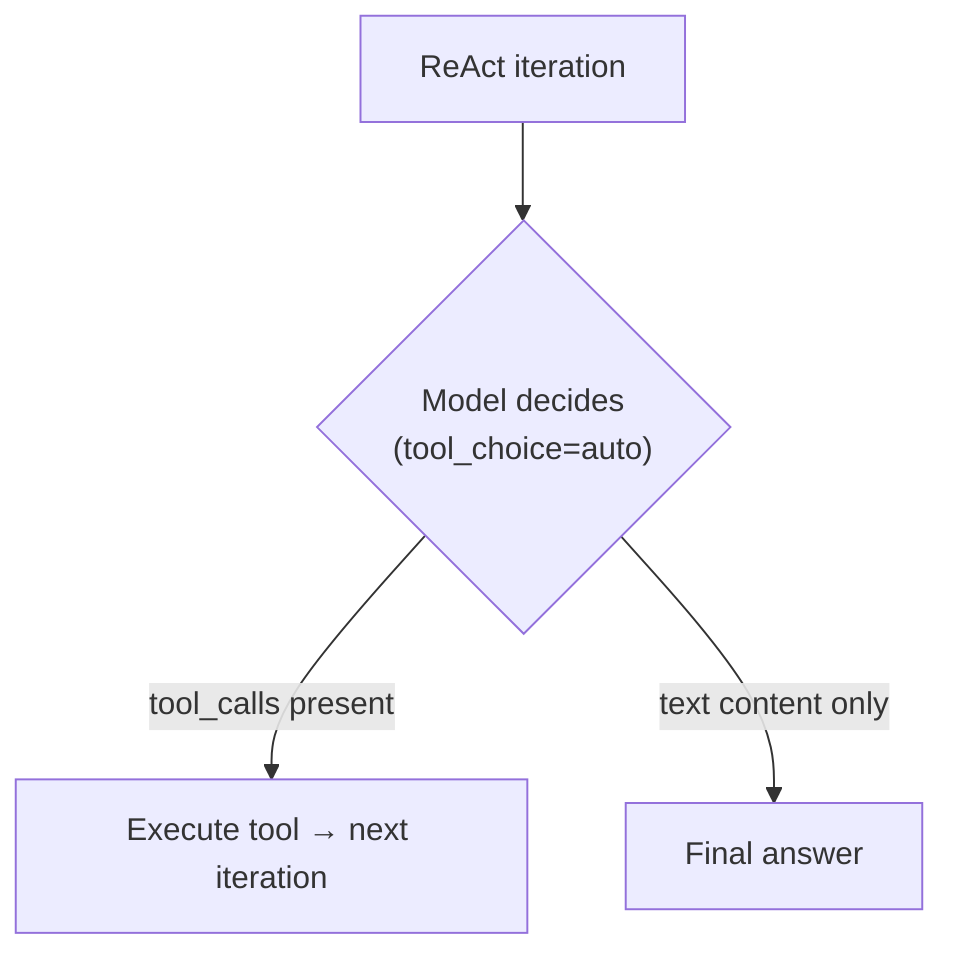
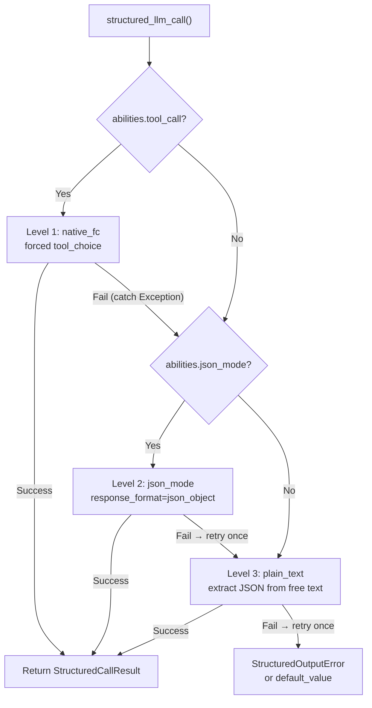
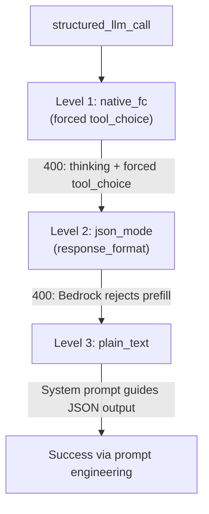

---
title: "LLM 提供商兼容性"
description: "FIM One 如何路由 LLM 调用、tool_choice 架构以及提供商特定的陷阱——特别是 Anthropic thinking + AWS Bedrock。"
---## 提供商检测

FIM One 使用 LiteLLM 作为通用适配器。`core/model/openai_compatible.py` 中的 `_resolve_litellm_model()` 函数将用户的 `LLM_BASE_URL` + `LLM_MODEL` 映射到带有提供商前缀的 LiteLLM 模型标识符。前缀决定了 LiteLLM 如何路由请求 — 原生 API 协议（Anthropic Messages API、Gemini 等）或通用 OpenAI 兼容的 `/v1/chat/completions`。

解析顺序：

1. **显式提供商**（来自数据库 `ModelConfig.provider` 字段）— 最高优先级。如果提供商与 URL 中的已知域匹配，则不返回 `api_base`（LiteLLM 进行原生路由）。否则，`api_base` 设置为中继 URL。
2. **域名匹配** `KNOWN_DOMAINS` — 通过主机名识别官方 API 端点。
3. **URL 路径提示** `PATH_PROVIDER_HINTS` — 常见于 UniAPI 等中继平台，其中路径中的 `/claude` 或 `/anthropic` 表示上游协议。
4. **回退** — `openai/` 前缀（通用 OpenAI 兼容）。

| 域名 / 路径 | 提供商前缀 | 协议 |
|---|---|---|
| `api.openai.com` | `openai/` | OpenAI Chat Completions |
| `anthropic.com` | `anthropic/` | Anthropic Messages API |
| `generativelanguage.googleapis.com` | `gemini/` | Google Gemini |
| `api.deepseek.com` | `deepseek/` | DeepSeek（OpenAI 兼容） |
| `api.mistral.ai` | `mistral/` | Mistral |
| 路径包含 `/claude` 或 `/anthropic` | `anthropic/` | Anthropic Messages API（通过中继） |
| 路径包含 `/gemini` | `gemini/` | Google Gemini（通过中继） |
| 其他任何情况 | `openai/` | 通用 OpenAI 兼容 |

当提供商前缀是原生协议（anthropic、gemini 等）且 URL 不是官方端点时，LiteLLM 使用原生协议但将请求发送到中继的 `api_base`。这意味着提供商特定的行为 — 包括下面描述的 Bedrock 预填充问题 — 无论请求是发送到官方 API 还是通过中继，都会应用。

<Warning>
如果你的中继 URL 路径中包含 `/claude`，FIM One 会自动通过 Anthropic 的原生协议进行路由。这通常是正确的（更好的流式传输、思考支持），但意味着提供商特定的行为会应用 — 包括下面描述的 Bedrock 预填充问题。
</Warning>## tool_choice — 四种模式

`tool_choice` 参数通过 OpenAI 格式进行标准化。LiteLLM 在发送请求前将其转换为每个提供商的原生协议。

| 模式 | 含义 | 提供商支持 |
|---|---|---|
| `"auto"` | 模型决定是否调用工具或用文本响应 | 所有提供商 |
| `"required"` | 必须调用工具，但由模型选择哪个 | 大多数提供商 |
| `{"type":"function","function":{"name":"X"}}` | 必须特别调用函数 X | 大多数提供商 — **与 Anthropic thinking 不兼容** |
| `"none"` | 无法使用工具，仅限文本 | 所有提供商 |

`"auto"` 和强制模式（`{"type":"function",...}`）之间的区别是 FIM One 中每个兼容性问题的关键。这两种模式由完全不同的子系统使用，具有不同的要求。## tool_choice 的使用位置

两个子系统使用 `tool_choice`，它们以根本不同的方式使用它。### ReAct 引擎 — tool_choice="auto"

ReAct 循环需要模型在每次迭代中决定：调用工具，或给出最终答案。只有 `"auto"` 在这里有意义 — 模型可以自由选择生成 `tool_calls` 或文本内容。这与所有提供商、所有模型和所有模式（包括扩展思考）兼容。



当 `abilities["tool_call"] = True` 时，ReAct 引擎使用原生函数调用（`_run_native`），否则回退到 JSON-in-content 模式（`_run_json`）。两种模式都使用 `"auto"` — 区别在于工具是通过 `tools` 参数传递还是在系统提示中描述。详见 [ReAct 引擎 — 双模式执行](/architecture/react-engine#dual-mode-execution)。### structured_llm_call — tool_choice=forced

一次性结构化提取（schema 注解、DAG 规划、计划分析）。强制模型调用特定的虚拟函数，保证结构化 JSON 输出。这是触发提供商特定错误的调用点。

`structured_llm_call` 实现了一个 3 级降级链：



关键的设计差异：`structured_llm_call` 的降级是**运行时**的——它动态尝试每个级别并捕获异常以进行降级。ReAct 引擎的模式选择是**构建时**的——它在开始时检查一次 `_native_mode_active` 并为整个循环提交到一种模式。这意味着 `structured_llm_call` 可以透明地从提供商特定的 400 错误中恢复，而 ReAct 依赖于事先正确选择的模式。## Bedrock 预填陷阱

当为使用 `anthropic/` 前缀解析的模型传递 `response_format={"type":"json_object"}` 时，LiteLLM 会在内部注入一条助手预填消息来模拟 JSON 模式。Anthropic Messages API 没有原生的 `response_format` 参数，所以 LiteLLM 通过在助手内容前面加上一个开括号来近似实现：

```json
{"role": "assistant", "content": "{"}
```

这在 Anthropic 的直接 API 上有效。但是，较新的 AWS Bedrock 模型版本会拒绝任何最后一条消息具有 `role: "assistant"` 的对话——他们称之为"助手消息预填"并抛出：

```
ValidationException: This model does not support assistant message prefill.
The conversation must end with a user message.
```

仅当**同时满足以下三个条件**时才会发生此错误：

1. 模型使用 `anthropic/` 前缀解析（通过域匹配或 URL 路径提示）。
2. 传递了 `response_format={"type":"json_object"}`（`structured_llm_call` 中的 json_mode 代码路径）。
3. 实际后端是 AWS Bedrock（拒绝预填）。

<Warning>
这**不**影响原生工具调用（带有 `tools=` 参数的 `tool_choice="auto"`）。预填注入仅对 `response_format` 发生。ReAct 代理执行完全不受影响。
</Warning>

实际中的失败路径如下所示：



当 Level 1（思考冲突）和 Level 2（Bedrock 预填）都失败时，系统仍然在 Level 3 恢复——但代价是每次结构化提取浪费两次 LLM 调用。下面的修复消除了浪费的 json_mode 调用。### 修复：json_mode_enabled

每个模型的 `json_mode_enabled` 标志控制是否尝试 Level 2 (json_mode)：

- **DB 配置的模型**：在 Admin → Models → Advanced settings 中切换。该标志存储在 `ModelConfig.json_mode_enabled` 上（默认 `TRUE`）。
- **ENV 配置的模型**：在环境中设置 `LLM_JSON_MODE_ENABLED=false`。
- **效果**：禁用时，`abilities["json_mode"]` 返回 `False` → `response_format` 永远不会被传递 → 无预填充 → Bedrock 正常工作。降级链变为 `native_fc → plain_text`，完全跳过注定失败的 json_mode 调用。
- **无质量损失**：模型仍然返回有效的 JSON，因为系统提示指示它这样做。plain_text 级别使用 `extract_json()` 从自由格式内容中解析 JSON，这对现代模型来说可靠有效。## Anthropic thinking + forced tool_choice

Anthropic 的 API 在启用扩展思考时会拒绝 `tool_choice={"type":"function","function":{"name":"X"}}`。错误信息为：

```
Thinking may not be enabled when tool_choice forces tool use
```

这是协议级别的语义冲突：强制特定工具调用与模型关于应该调用哪个工具（或是否应该调用工具）的推理自由相矛盾。Anthropic 强制执行此约束；其他提供商则不然。

冲突**仅影响** `structured_llm_call` 的第 1 级（native_fc），该级使用强制 `tool_choice` 来保证结构化输出。`_call_llm` 中现有的 `try/except` 捕获 400 响应并回退到 json_mode 或 plain_text。在 `abilities` 字典中无需特殊处理。

至关重要的是，`tool_choice="auto"` 与 Anthropic thinking 启用时完美配合。ReAct 引擎专门使用 `"auto"`，因此永远不会受到影响。

<Warning>
不要设置 `abilities["tool_call"] = False` 来解决 thinking + forced tool_choice 冲突。这样做会禁用 ReAct 的 `_run_native` 模式（该模式使用 `tool_choice="auto"` 并与 thinking 配合良好），强制其进入 `_run_json` 模式。在 `_run_json` 中，模型必须在其内容中生成有效的 JSON — 这不太可靠，在 Bedrock 上，如果启用了 json_mode，可能会触发预填充问题。正确的修复方法是让 `structured_llm_call` 回退链处理它。
</Warning>## 快速参考：什么在哪里有效

| 场景 | ReAct 模式 | structured_llm_call 路径 | 备注 |
|---|---|---|---|
| OpenAI（任何模型） | `_run_native` | native_fc | 完全支持，无警告 |
| Anthropic（无思考） | `_run_native` | native_fc | 完全支持 |
| Anthropic + 思考 | `_run_native` | native_fc → 400 → json_mode | 自动回退，浪费一次调用 |
| Bedrock 中继（无思考） | `_run_native` | native_fc | 完全支持 |
| Bedrock 中继 + 思考 | `_run_native` | native_fc → 400 → json_mode → 400 → plain_text | 两次浪费的调用；设置 `json_mode_enabled=false` |
| Bedrock 中继 + `json_mode_enabled=false` | `_run_native` | native_fc → 400 → plain_text | Bedrock 与思考的推荐配置 |
| Bedrock 中继（无思考） + `json_mode_enabled=false` | `_run_native` | native_fc | 无影响 — native_fc 首次尝试成功 |
| Gemini | `_run_native` | native_fc | 完全支持 |
| DeepSeek | `_run_native` | native_fc | 完全支持 |
| 通用 OpenAI 兼容 | `_run_native` | native_fc | 完全支持 |
| 任何带 `tool_call=false` 的模型 | `_run_json` | json_mode 或 plain_text | 不支持工具调用的模型的回退 |

**AWS Bedrock 中继的推荐配置：**

```bash# 在 .env 或环境中
LLM_JSON_MODE_ENABLED=false
```

或在管理 UI 中按模型配置：Admin → Models → 选择 Bedrock 模型 → Advanced → 禁用"JSON Mode"。

这消除了所有浪费的调用。降级路径变为 `native_fc → plain_text`（无思考）或 `native_fc → 400 → plain_text`（有思考）。两条路径都快速且可靠。## 推理工作量和思考配置

FIM One 公开了两个环境变量用于控制扩展思考/推理：

| 变量 | 值 | 效果 |
|---|---|---|
| `LLM_REASONING_EFFORT` | `low`, `medium`, `high` | 作为 `reasoning_effort` 传递给 LiteLLM。Anthropic：映射到 `thinking` 参数。OpenAI o 系列：直接传递。其他：静默丢弃（`drop_params=True`）。 |
| `LLM_REASONING_BUDGET_TOKENS` | 整数（例如 `10000`） | 仅限 Anthropic：设置显式 `thinking.budget_tokens` 上限，绕过 LiteLLM 的自动映射。用于控制 Claude 模型的成本。 |

当设置了 `reasoning_effort` 且模型被解析为 `anthropic/` 时，会应用两个额外的行为：

1. **温度被强制设置为 1.0。** Bedrock 在启用思考时拒绝 `temperature != 1.0`。FIM One 会自动处理此问题 — 无需用户操作。
2. **GPT-5.x 与工具**：当存在 `tools` 时，`reasoning_effort` 会被静默丢弃，因为 GPT-5 `/v1/chat/completions` 端点拒绝此组合。这仅影响 ReAct 工具循环；不包含 `tools` 参数的 `structured_llm_call` 调用不受影响。## 故障排除

**"This model does not support assistant message prefill"**
Bedrock + json_mode。设置 `LLM_JSON_MODE_ENABLED=false` 或在管理员模型设置中禁用 JSON Mode。

**"Thinking may not be enabled when tool_choice forces tool use"**
Anthropic thinking + 在 `structured_llm_call` 中强制函数调用。这是**预期行为，不是错误**。回退链捕获 400，跳过 native_fc，并在 json_mode 或 plain_text 处成功。日志处于 DEBUG 级别 — 仅当 `LOG_LEVEL=DEBUG` 时才会看到。成本：约 300ms 网络往返，零 token（模型在 400 处从不运行）。无需采取行动。

**ReAct 意外回退到 JSON mode**
检查模型的 `abilities["tool_call"]` 是否为 `True`。对于 `OpenAICompatibleLLM` 始终为 `True`，但自定义 `BaseLLM` 子类可能会覆盖它。通过管理员 API 中的模型详情端点进行验证。

**structured_llm_call 耗尽所有级别并抛出 StructuredOutputError**
模型在任何级别都无法生成可解析的 JSON。这在现代模型中很少见。检查：(1) schema 是有效的 JSON Schema，(2) 模型有足够的 `max_tokens` 来生成完整响应，(3) 系统提示没有与 schema 指令相矛盾。DAG planner 和 analyzer 都提供 `default_value` 回退，因此此错误仅从显式省略默认值的调用站点传播。