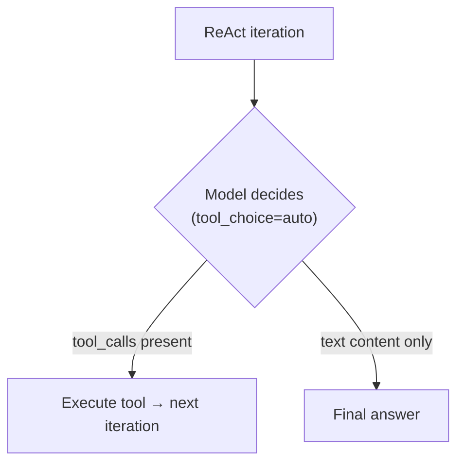
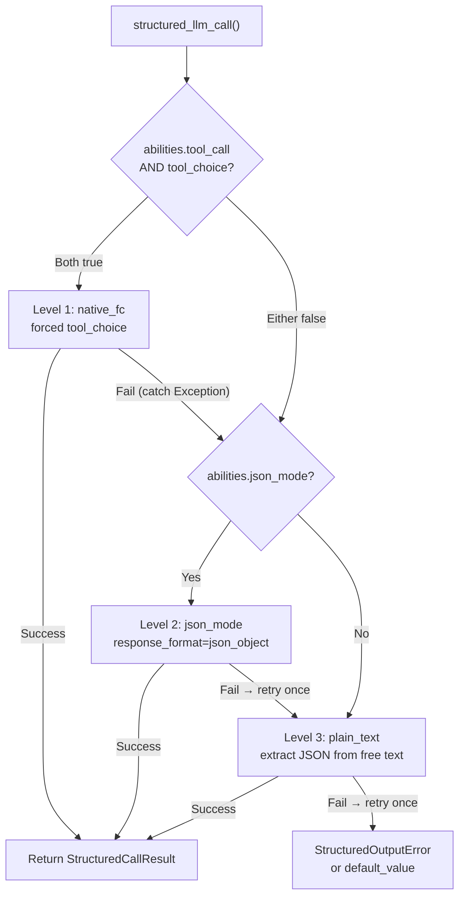

## 提供商检测

FIM One 使用 LiteLLM 作为通用适配器。`core/model/openai_compatible.py` 中的 `_resolve_litellm_model()` 函数将用户的 `LLM_BASE_URL` + `LLM_MODEL` 映射到带有提供商前缀的 LiteLLM 模型标识符。该前缀决定了 LiteLLM 如何路由请求 — 原生 API 协议（Anthropic Messages API、Gemini 等）或通用 OpenAI 兼容的 `/v1/chat/completions`。

解析顺序：

1. **显式提供商**（来自数据库 `ModelConfig.provider` 字段）— 最高优先级。如果提供商与 URL 中的已知域匹配，则不返回 `api_base`（LiteLLM 原生路由）。否则，`api_base` 设置为中继 URL。
2. **域名匹配** `KNOWN_DOMAINS` — 通过主机名识别官方 API 端点。
3. **URL 路径提示** `PATH_PROVIDER_HINTS` — 常见于 UniAPI 等中继平台，其中路径中的 `/claude` 或 `/anthropic` 表示上游协议。
4. **回退** — `openai/` 前缀（通用 OpenAI 兼容）。

| 域名 / 路径 | 提供商前缀 | 协议 |
|---|---|---|
| `api.openai.com` | `openai/` | OpenAI Chat Completions |
| `anthropic.com` | `anthropic/` | Anthropic Messages API |
| `generativelanguage.googleapis.com` | `gemini/` | Google Gemini |
| `api.deepseek.com` | `deepseek/` | DeepSeek（OpenAI 兼容） |
| `api.mistral.ai` | `mistral/` | Mistral |
| 路径包含 `/claude` 或 `/anthropic` | `anthropic/` | Anthropic Messages API（通过中继） |
| 路径包含 `/gemini` | `gemini/` | Google Gemini（通过中继） |
| 其他任何情况 | `openai/` | 通用 OpenAI 兼容 |

当提供商前缀是原生协议（anthropic、gemini 等）且 URL 不是官方端点时，LiteLLM 使用原生协议但将请求发送到中继的 `api_base`。这意味着提供商特定的行为 — 包括下面描述的 Bedrock 预填充问题 — 无论请求是发送到官方 API 还是通过中继，都会适用。

<Warning>
如果你的中继 URL 路径中包含 `/claude`，FIM One 会自动通过 Anthropic 的原生协议路由。这通常是正确的（更好的流式传输、思考支持），但意味着提供商特定的行为会适用 — 包括下面描述的 Bedrock 预填充问题。
</Warning>

## tool_choice — 四种模式

`tool_choice` 参数通过 OpenAI 格式标准化。LiteLLM 在发送请求前将其转换为每个提供商的原生协议。

| 模式 | 含义 | 提供商支持 |
|---|---|---|
| `"auto"` | 模型决定是否调用工具或以文本响应 | 所有提供商 |
| `"required"` | 必须调用工具，但由模型选择哪个 | 大多数提供商 |
| `{"type":"function","function":{"name":"X"}}` | 必须特别调用函数 X | 大多数提供商 — **与 Anthropic thinking 不兼容** |
| `"none"` | 无法使用工具，仅文本 | 所有提供商 |

`"auto"` 和强制模式（`{"type":"function",...}`）之间的区别是 FIM One 中每个兼容性问题的关键。这两种模式由具有不同要求的完全不同的子系统使用。

## tool_choice 的使用位置

两个子系统使用 `tool_choice`，它们以根本不同的方式使用它。

### ReAct 引擎 — tool_choice="auto"

ReAct 循环需要模型在每次迭代中做出决定：调用工具或给出最终答案。只有 `"auto"` 才有意义——模型可以自由选择生成 `tool_calls` 或文本内容。这与所有提供商、所有模型和所有模式（包括扩展思考）兼容。



ReAct 引擎在 `abilities["tool_call"] = True` 时使用原生函数调用（`_run_native`），否则回退到 JSON-in-content 模式（`_run_json`）。两种模式都使用 `"auto"`——区别在于工具是通过 `tools` 参数传递还是在系统提示中描述。详见 [ReAct 引擎——双模式执行](/architecture/react-engine#dual-mode-execution)。

### structured_llm_call — tool_choice=forced

一次性结构化提取（模式注解、DAG 规划、计划分析）。强制模型调用特定的虚拟函数，保证结构化 JSON 输出。这是触发提供商特定错误的调用点。

`structured_llm_call` 实现了一个 3 级降级链：



关键设计差异：`structured_llm_call` 的回退是**运行时**——它动态尝试每个级别并捕获异常以进行回退。ReAct 引擎的模式选择是**构建时**——它在开始时检查一次 `_native_mode_active` 并为整个循环提交到一种模式。这意味着 `structured_llm_call` 可以透明地从提供商特定的 400 错误中恢复，而 ReAct 依赖于模式在前期被正确选择。

## Bedrock 预填陷阱

当为使用 `anthropic/` 前缀解析的模型传递 `response_format={"type":"json_object"}` 时，LiteLLM 会在内部注入一条助手预填消息来模拟 JSON 模式。Anthropic Messages API 没有原生的 `response_format` 参数，所以 LiteLLM 通过在助手内容前面添加一个开括号来近似实现：

```json
{"role": "assistant", "content": "{"}
```

这在 Anthropic 的直接 API 上可以正常工作。但是，较新的 AWS Bedrock 模型版本会拒绝任何最后一条消息具有 `role: "assistant"` 的对话——他们称之为"助手消息预填"并抛出：

```
ValidationException: This model does not support assistant message prefill.
The conversation must end with a user message.
```

此错误仅在**同时满足以下三个条件**时发生：

1. 模型使用 `anthropic/` 前缀解析（通过域名匹配或 URL 路径提示）。
2. 传递了 `response_format={"type":"json_object"}`（`structured_llm_call` 中的 json_mode 代码路径）。
3. 实际后端是 AWS Bedrock（拒绝预填）。

<Warning>
这**不**影响原生工具调用（带有 `tools=` 参数的 `tool_choice="auto"`）。预填注入仅在 `response_format` 时发生。ReAct 智能体执行完全不受影响。
</Warning>

如果 Level 1（native_fc）和 Level 2（json_mode）在 Bedrock 上都失败，系统会在 Level 3（plain_text）恢复。下面描述的 `json_mode_enabled` 标志消除了浪费的 Level 2 调用。

### 修复方案：json_mode_enabled

一个按模型的 `json_mode_enabled` 标志控制是否尝试 Level 2（json_mode）：

- **数据库配置的模型**：在 Admin → Models → Advanced settings 中切换。该标志存储在 `ModelProviderModel.json_mode_enabled` 上（默认值 `TRUE`）。
- **环境变量配置的模型**：在环境中设置 `LLM_JSON_MODE_ENABLED=false`。
- **效果**：禁用时，`abilities["json_mode"]` 返回 `False` → `response_format` 永远不会被传递 → 无预填充 → Bedrock 正常工作。降级链变为 `native_fc → plain_text`，完全跳过注定失败的 json_mode 调用。
- **无质量损失**：模型仍然返回有效的 JSON，因为系统提示指示它这样做。plain_text 级别使用 `extract_json()` 从自由格式内容中解析 JSON，这在现代模型中工作可靠。

## 思维模型 + 强制 tool_choice

某些模型已永久启用扩展思维（思维链）。它们的 API 拒绝强制 `tool_choice`，因为强制特定函数调用与模型优先推理的自由度相矛盾：

```
tool_choice 'specified' is incompatible with thinking enabled
```

Anthropic 在协议级别强制执行此约束，某些其他提供商（例如 Moonshot AI / Kimi K2.5）遵循相同模式。

对于 Anthropic 模型，`structured_llm_call` 通过在调用 native_fc 时传递 `reasoning_effort=None` 来自动处理此问题，禁用该特定调用的扩展思维。结构化输出调用需要**架构合规性**，而不是深度推理——在这里禁用思维既正确又有益（更低延迟、更低成本）。

但是，某些模型（例如 Kimi K2.5）的思维永久启用，无法从外部禁用。对于这些模型，native_fc 总是以 400 错误失败，在结构化调用前浪费约 10 秒延迟，然后降级链才会降级到 json_mode。

### 修复：tool_choice_enabled

一个针对每个模型的 `tool_choice_enabled` 标志控制是否尝试 Level 1（native_fc）：

- **数据库配置的模型**：在 Admin → Models → Advanced → "Native Function Calling" 中切换。该标志存储在 `ModelProviderModel.tool_choice_enabled` 上（默认为 `TRUE`）。
- **ENV 配置的模型**：在环境中设置 `LLM_TOOL_CHOICE_ENABLED=false`。
- **效果**：禁用时，`abilities["tool_choice"]` 返回 `False` → 降级链从 Level 2（json_mode）或 Level 3（plain_text）开始，完全跳过 native_fc。这消除了不兼容模型每次结构化调用约 10 秒的性能损失。
- **ReAct 智能体不受影响**：`tool_choice_enabled` 仅控制 `structured_llm_call` 中的强制工具选择。ReAct 引擎使用 `tool_choice="auto"`（模型自由决定），无论此设置如何都适用于所有模型。

<Note>
`tool_choice_enabled` 和 `tool_call` 是独立的能力标志。`tool_call`（对于 `OpenAICompatibleLLM` 始终为 `True`）控制工具是否被传递给模型 — 禁用它会破坏 ReAct 智能体。`tool_choice` 仅控制是否尝试**强制**工具选择以进行结构化输出提取。
</Note>

`tool_choice="auto"` 不受思考模式影响。ReAct 引擎专门使用 `"auto"`，因此启用思考时智能体执行工作正常。

<Warning>
不要设置 `abilities["tool_call"] = False` 来避免此约束。这会禁用 ReAct 的 `_run_native` 模式（使用 `tool_choice="auto"` 且与思考配合良好），强制其进入不太可靠的 `_run_json` 模式。
</Warning>

<Note>
**提供商迁移说明：**某些第三方中继会静默丢弃不支持的参数，如 `reasoning_effort`（`drop_params=True`），因此即使配置了思考也永远不会激活。迁移到正确支持思考的提供商（Bedrock、直接 Anthropic API）时，native_fc 中的 `reasoning_effort=None` 确保一致的行为。无需用户操作 — 结构化输出在所有提供商中的工作方式相同。
</Note>

## 快速参考：什么在哪里有效

| 场景 | ReAct 模式 | structured_llm_call 路径 | 备注 |
|---|---|---|---|
| OpenAI（任何模型） | `_run_native` | native_fc | 完全支持 |
| Anthropic（无思考） | `_run_native` | native_fc | 完全支持 |
| Anthropic + 思考 | `_run_native` | native_fc（思考自动禁用） | 仅对结构化输出禁用思考 |
| Bedrock 中继（无思考） | `_run_native` | native_fc | 完全支持 |
| Bedrock 中继 + 思考 | `_run_native` | native_fc（思考自动禁用） | 仅对结构化输出禁用思考 |
| Gemini | `_run_native` | native_fc | 完全支持 |
| DeepSeek（非思考） | `_run_native` | native_fc | 完全支持 |
| DeepSeek R1（思考） | `_run_native` | json_mode（设置 `tool_choice_enabled=false`） | 思考始终启用；跳过 native_fc |
| Kimi K2（非思考） | `_run_native` | native_fc | 完全支持 |
| Kimi K2.5（思考） | `_run_native` | json_mode（设置 `tool_choice_enabled=false`） | 思考始终启用；跳过 native_fc |
| 通用 OpenAI 兼容 | `_run_native` | native_fc | 完全支持 |
| 任何 `tool_call=false` 的模型 | `_run_json` | json_mode 或 plain_text | 不支持工具调用的模型的备选方案 |

## 推荐的每个模型配置

`tool_choice_enabled` 和 `json_mode_enabled` 都可以在管理员 → 模型 → 高级设置中按模型切换。默认值（两者都为 `TRUE`）适用于大多数提供商。仅在遇到错误或不必要的延迟时进行调整。

| 模型类型 | 原生 FC | JSON 模式 | 原因 |
|---|---|---|---|
| OpenAI GPT 系列 | 开启 | 开启 | 完全支持 — 默认值正确 |
| Anthropic Claude | 开启 | 开启 | 原生 FC 自动禁用思考 |
| Google Gemini | 开启 | 开启 | 完全支持 |
| DeepSeek V3 / Coder | 开启 | 开启 | 完全支持 |
| **DeepSeek R1（思考）** | **关闭** | 开启 | 思考始终开启；原生 FC 被拒绝 |
| **Kimi K2.5（思考）** | **关闭** | 开启 | 思考始终开启；原生 FC 被拒绝 |
| Kimi K2（非思考） | 开启 | 开启 | 完全支持 |
| **AWS Bedrock 中继** | 开启 | **关闭** | Bedrock 在 json_mode 中拒绝助手预填充 |
| 弱小模型 | 关闭 | 关闭 | 直接进行纯文本提取 |

<Tip>
**何时更改：** 如果在日志中看到 `structured_llm_call: native_fc call raised` 警告，随后成功进行 json_mode 提取，则该模型不受益于原生 FC。为该模型禁用"原生函数调用"以消除浪费的 API 调用（每个结构化输出请求约 10 秒）。
</Tip>

**环境变量级别的覆盖** 适用于通过环境变量配置的所有模型（不是管理员 UI）：

```bash
# Disable native_fc globally (for thinking-model-only deployments)
LLM_TOOL_CHOICE_ENABLED=false

# Disable json_mode globally (for Bedrock relay deployments)
LLM_JSON_MODE_ENABLED=false
```

## 推理工作量和思考配置

FIM One 公开了两个环境变量用于控制扩展思考/推理：

| 变量 | 值 | 效果 |
|---|---|---|
| `LLM_REASONING_EFFORT` | `low`、`medium`、`high` | 作为 `reasoning_effort` 传递给 LiteLLM。Anthropic：映射到 `thinking` 参数。OpenAI o 系列：直接传递。其他：静默丢弃（`drop_params=True`）。 |
| `LLM_REASONING_BUDGET_TOKENS` | 整数（例如 `10000`） | 仅 Anthropic：设置显式的 `thinking.budget_tokens` 上限，绕过 LiteLLM 的自动映射。用于控制 Claude 模型的成本。 |

当设置了 `reasoning_effort` 且模型被解析为 `anthropic/` 时，应用以下两个额外行为：

1. **温度被强制设置为 1.0。** Bedrock 在启用思考时拒绝 `temperature != 1.0`。FIM One 会自动处理此问题 — 无需用户操作。
2. **GPT-5.x 与工具**：当存在 `tools` 时，`reasoning_effort` 被静默丢弃，因为 GPT-5 `/v1/chat/completions` 端点拒绝此组合。这仅影响 ReAct 工具循环；缺少 `tools` 参数的 `structured_llm_call` 调用不受影响。

## 结构化输出的防御性解析

即使 native_fc 正常工作，结构化输出管道也包含一个防御性解析层，用于处理来自任何提供商或兼容性层的边界情况。

DAG 规划器的 `_dict_to_steps` 解析器处理三个常见的边界情况：

1. **单个对象而非数组。** 某些模型返回 `{"steps": {"id": "1", "task": "..."}}` （单个步骤对象）而不是 `{"steps": [{"id": "1", "task": "..."}]}` （数组）。解析器通过检查 `id` 或 `task` 键来检测这种情况，并将对象包装在列表中。

2. **双重编码的 JSON 字符串。** 当结构化输出降级到 json_mode（缺乏模式强制）时，某些提供商将 `steps` 值作为 JSON 字符串而非原生数组返回 — 例如 `{"steps": "[{\"id\": \"1\", ...}]"}`。这个字符串可能还包含字面换行符（来自模型的格式化），会破坏标准的 `json.loads`。解析器使用 `extract_json_value()` （包含 `_repair_json_strings`）来处理：
   - JSON 字符串值内的字面换行符
   - 无效的转义序列（常见于 LaTeX 或代码内容）
   - 来自兼容性层的其他序列化问题

3. **缺少 `steps` 包装器。** 模型可能返回单个步骤作为顶级对象，而没有 `steps` 包装键。解析器在根级别检测 `id` 和 `task`，并相应地进行包装。

<Note>
在正常操作下，native_fc 返回正确结构化的工具调用参数，这些边界情况不会出现。防御性解析器作为安全网存在，用于自定义 `BaseLLM` 子类、异常的提供商行为，或结构化输出降级到 json_mode 或 plain_text 的回退场景。
</Note>

## 故障排除

**"This model does not support assistant message prefill"**
Bedrock + json_mode。设置 `LLM_JSON_MODE_ENABLED=false` 或在管理员模型设置中禁用 JSON Mode。

**"Thinking may not be enabled when tool_choice forces tool use"** / **"tool_choice 'specified' is incompatible with thinking enabled"**
对于 Anthropic 模型，`structured_llm_call` 会自动为 native_fc 调用禁用思考。对于具有始终启用思考的其他提供商（例如 Kimi K2.5），在模型的高级设置中禁用"Native Function Calling"，或全局设置 `LLM_TOOL_CHOICE_ENABLED=false`。降级链将跳过 native_fc 并改为通过 json_mode 或 plain_text 提取结构化输出。

**"DAG pipeline failed: LLM 'steps' is not an array"**
LLM 将 `steps` 字段返回为字符串或单个对象，而不是数组。这通常意味着结构化输出降级到了 json_mode（缺乏模式强制）。检查日志中的 `structured_llm_call: level=xxx` — 如果显示 `json_mode` 而不是 `native_fc`，则 native_fc 正在静默失败。如果使用自定义 `BaseLLM` 子类，请验证它接受 `reasoning_effort` 关键字参数。

**ReAct 意外降级到 JSON mode**
检查模型的 `abilities["tool_call"]` 是否为 `True`。对于 `OpenAICompatibleLLM`，这始终为 `True`，但自定义 `BaseLLM` 子类可能会覆盖它。使用管理员 API 中的模型详情端点进行验证。

**structured_llm_call 耗尽所有级别并抛出 StructuredOutputError**
模型在任何级别都无法生成可解析的 JSON。这在现代模型中很少见。检查：(1) 模式是否为有效的 JSON Schema，(2) 模型是否有足够的 `max_tokens` 来生成完整响应，(3) 系统提示是否与模式指令相矛盾。DAG 规划器和分析器都提供 `default_value` 回退，因此此错误仅从显式省略默认值的调用站点传播。
