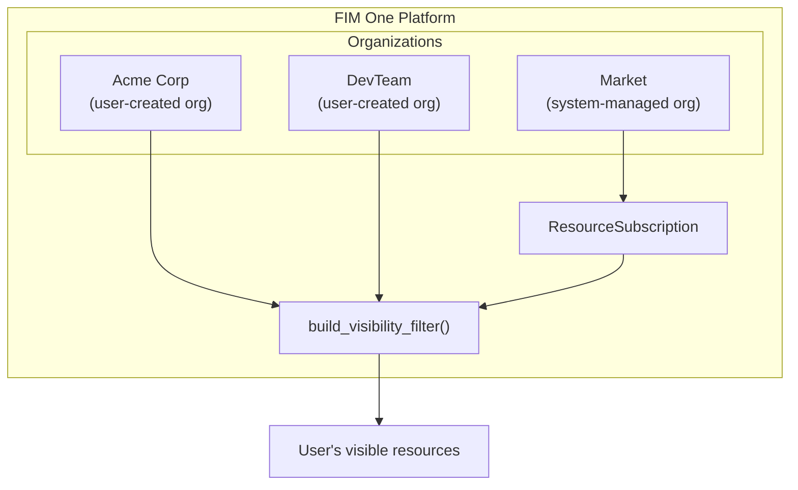
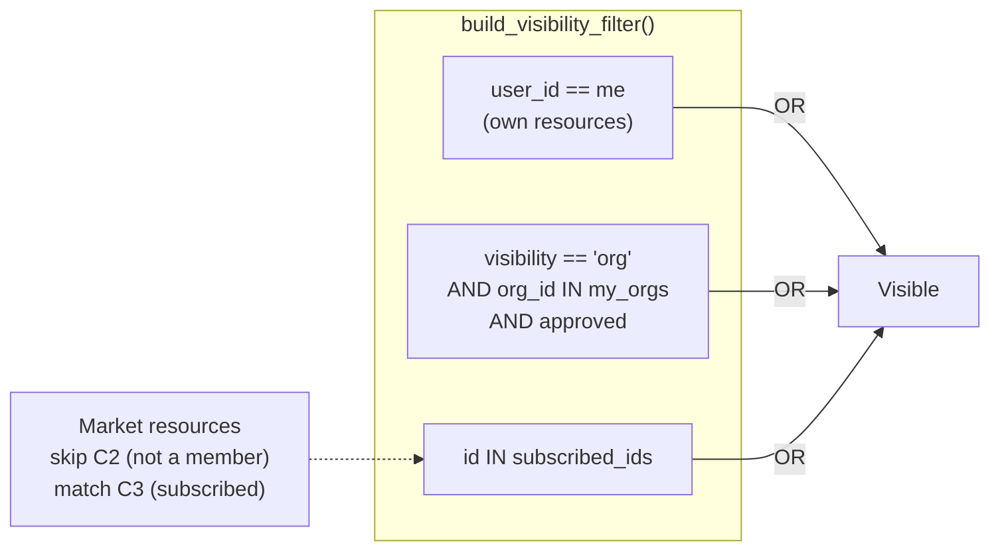
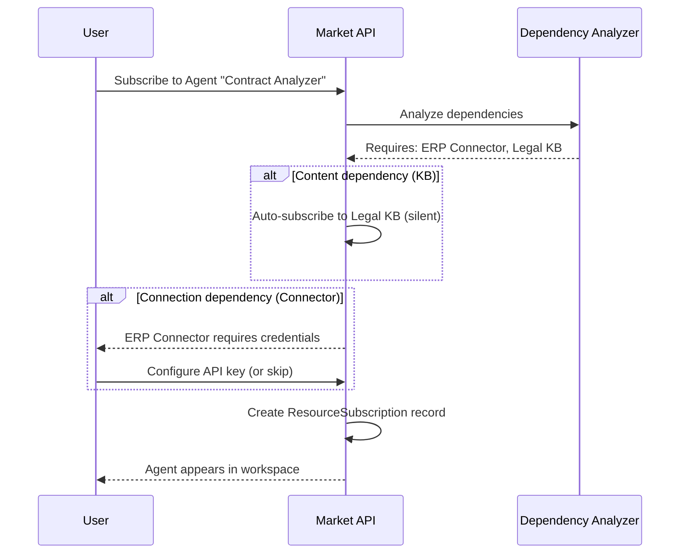
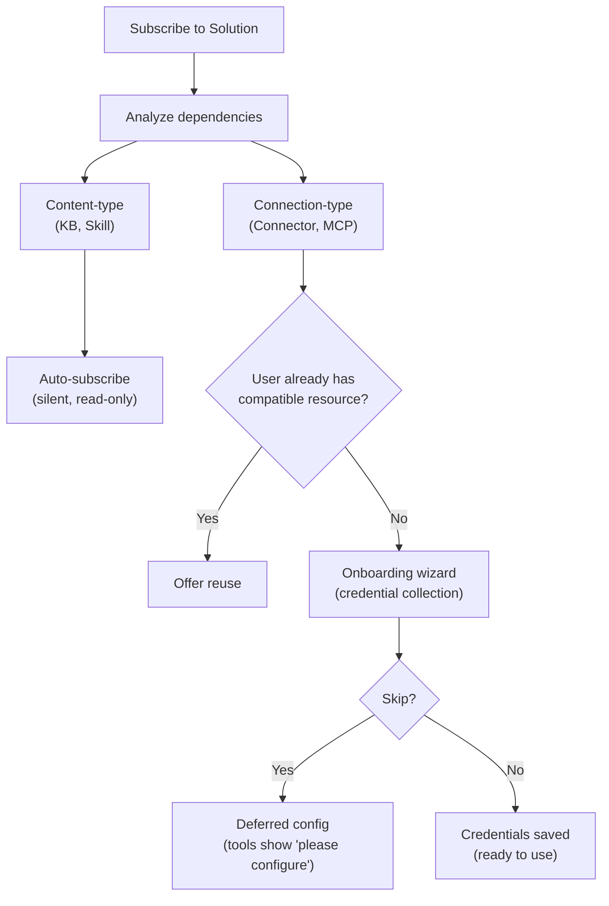

## 概述

Market 是 FIM One 的资源市场。用户发布他们构建的资源，其他人发现并订阅这些资源，订阅的资源会在订阅者的工作区中显示，就像是他们自己的资源一样。整个系统建立在一个单一的架构洞察上：**Market 是一个组织** — 一个系统管理的影子组织，具有特殊的信任规则。

本页面解释了 Market 的内部架构。有关发布和订阅的用户界面概述，请参阅 [Market（功能）](/concepts/market)。有关订阅资源如何加载到工具集中的信息，请参阅 [智能体和资源发现](/architecture/agent-discovery)。

## 两层分类

Market 根据资源的功能而非实现方式，将资源组织为两个类别。

### 解决方案

解决方案是**为您工作的东西**。用户订阅解决方案后会获得一个开箱即用的功能。

| 资源类型 | 功能说明 |
|---|---|
| **智能体** | 一个具有绑定工具、知识和指令的对话式 AI 助手 |
| **技能** | 一个全局标准操作流程 (SOP)，可以通过 `call_agent` 编排多个智能体 |
| **工作流** | 一个基于 DAG 的自动化流程，具有可视化编辑和确定性执行 |

解决方案可能依赖于其他资源。智能体可能需要特定的连接器来进行 API 调用，以及知识库来支持其检索管道。市场在订阅期间会自动处理这些依赖关系（请参阅下面的[依赖关系解析](#dependency-resolution)）。

### 组件

组件是**开发者可复用的构建块**。它们提供解决方案所消费的功能。

| 资源类型 | 功能说明 |
|---|---|
| **连接器** | API 或数据库集成适配器定义 |
| **MCP Server** | 使用 Model Context Protocol 的工具服务配置 |

组件订阅更简单——它们没有内部依赖关系，只有凭证要求。

### 为什么知识库不单独列出

知识库不作为独立的市场资源发布。它们是解决方案的内部依赖项——智能体的检索管道或技能的参考资料。当用户订阅依赖于知识库的解决方案时，知识库会自动作为只读参考包含在内。订阅者无需单独查找、评估或管理知识库。

<Info>
两层分类（解决方案与组件）是一个**显示层概念**。它在查询时从 `resource_type` 派生，而不是存储为单独的字段。底层订阅机制、可见性过滤和审查流程对所有资源类型都是相同的。
</Info>

## 统一架构

### 市场作为影子组织

市场最重要的架构决策是它不是一个单独的子系统。它是一个**组织** — 一个系统管理的组织，具有固定的ID（`MARKET_ORG_ID`），在平台初始化期间自动创建。

这意味着：

- **相同的可见性过滤器**（`build_visibility_filter()`）在单个查询中处理个人、组织和市场资源。没有市场查询的特殊情况代码。
- **相同的订阅机制**（`ResourceSubscription`）适用于组织和市场资源。订阅组织资源和订阅市场资源会创建相同的记录。
- **相同的凭证处理**（回退、每用户覆盖）在两种上下文中都有效。连接器和MCP服务器上的`allow_fallback`标志的行为完全相同，无论来源如何。
- **相同的审查流程**（`apply_publish_status()`）处理组织级别和市场级别的审查。唯一的区别是市场组织将所有审查标志锁定为`true`。

常规组织和市场组织之间的关键区别：

| 方面 | 组织 | 市场 |
|---|---|---|
| **信任模型** | 高信任（团队成员） | 不假设信任（全球社区） |
| **审查** | 每种资源类型可选 | 始终对所有类型强制 |
| **访问** | 对所有成员自动 | 需要显式订阅 |
| **范围** | 团队或公司 | 全球 |

<Tip>
因为市场只是一个具有特殊规则的组织，为组织构建的任何功能 — 审查工作流、凭证管理、资源生命周期 — 自动适用于市场，无需任何额外实现。
</Tip>

### 可见性过滤器如何处理它

没有人在 Market 组织中拥有成员资格。用户不会"加入" Market — 他们订阅单个资源。这意味着 `MARKET_ORG_ID` 永远不会出现在用户的 `user_org_ids` 列表中，并且对于 Market 资源，组织成员资格可见性条件会自然跳过。

相反，订阅的 Market 资源通过 `build_visibility_filter()` 中的 `subscribed_ids` 路径流动：

这个三条件 OR 子句是整个可见性模型。个人资源、组织共享资源和 Market 订阅资源在一个查询中解决，没有针对不同资源来源的分支逻辑。

### 基于范围的浏览

Market 页面提供了一个**范围选择器**，可在两个浏览上下文之间切换：

| 范围 | 显示内容 | 审核人员 |
|---|---|---|
| **全局 Market** | 由任何人发布到 Market 组织的资源 | 平台管理员 |
| **组织：[name]** | 由特定组织成员发布的资源 | 组织管理员 |

两个范围中应用相同的 UI、相同的选项卡（Solutions / Components）和相同的订阅流程。切换范围只会改变浏览查询中的 `org_id` 过滤器。从用户的角度来看，体验是相同的——他们正在浏览目录并选择要安装的内容。

## 订阅流程

### 浏览和发现

用户通过分页目录浏览市场。每个资源显示其名称、描述、图标、发布者用户名和订阅按钮。用户已订阅的资源会相应标记。浏览 API（`GET /api/market`）排除用户自己的资源 — 您无法订阅您发布的内容。

### 订阅解决方案

订阅解决方案（智能体、技能或工作流）涉及依赖项分析：

1. 系统分析解决方案的依赖项 — 它需要哪些连接器、知识库、MCP 服务器和技能。
2. **内容类型依赖项**（知识库、技能）会自动静默订阅。用户看不到或管理这些。
3. **连接类型依赖项**（连接器、MCP 服务器）被列为需求。入职向导收集凭据。
4. 创建 `ResourceSubscription` 记录，资源出现在用户的可见性筛选器中。

### 订阅组件

组件（连接器和 MCP 服务器）的流程更简单——不需要进行依赖分析。用户订阅、可选地配置凭证，组件就可以使用了。

### 凭证配置

凭证遵循**混合模型**，在便利性和灵活性之间取得平衡：

- **在订阅期间提供。** 当连接类型依赖项需要凭证时，入门向导会立即呈现凭证表单。
- **可跳过。** 用户可以选择"跳过，稍后配置"。资源已订阅，但需要这些凭证的工具在调用时会返回"请配置您的凭证"消息。
- **延迟配置。** 用户可以随时从其设置页面配置或更新凭证。

这与组织中使用的 `allow_fallback` 机制相同。如果发布者启用了回退并设置了默认凭证，订阅者可以立即使用该资源，无需提供自己的密钥。如果禁用回退，每个订阅者必须提供自己的凭证。

<Warning>
使用启用了凭证回退的 Market 资源时，您的 API 请求会通过发布者的凭证流动。对于敏感操作，请考虑提供您自己的凭证或验证发布者的可信度。
</Warning>

### 取消订阅

取消订阅会删除 `ResourceSubscription` 记录。该资源将从用户的可见性筛选器中消失，并且不再加载到工具集中。对于具有自动订阅依赖项的解决方案，依赖资源（知识库、技能）也会被清理。资源的用户配置凭证将被删除。

## 依赖项解析

当发布或订阅解决方案时，系统会分析其依赖树。依赖项分为两个类别，具有不同的处理策略。

### 内容类型依赖关系

**知识库**和**技能**是由解决方案引用的内容类型依赖关系。它们提供只读数据——检索文档、标准操作程序——供解决方案使用。

- **订阅时：** 自动静默订阅。用户不会看到针对每个知识库或技能的单独订阅步骤。
- **访问模型：** 对原始作者资源的只读引用。订阅者无法修改内容。
- **取消订阅时：** 当父解决方案取消订阅时自动清理。

### 连接类型依赖

**连接器**和**MCP 服务器**由解决方案引用，属于连接类型依赖。它们需要凭证才能运行。

- **订阅时：** 在入职向导中列为要求。系统会提示用户配置凭证（或跳过）。
- **智能匹配：** 如果用户已有兼容的连接器（相同类型、相同基础 URL），系统会提供重用它而不是创建新订阅的选项。
- **取消订阅时：** 订阅被移除，但用户创建的凭证被保留（用户可能在其他地方使用相同的连接器）。

## 发布

### 发布解决方案

当作者将智能体、技能或工作流发布到市场时：

1. 系统在资源上设置 `visibility: "org"` 和 `org_id: MARKET_ORG_ID`。
2. 系统分析解决方案的依赖项并构建清单 — 列出所需的连接器、知识库和 MCP 服务器。
3. 清单显示给作者以供确认。
4. `apply_publish_status()` 将资源设置为 `pending_review`（市场组织的所有审查标志都锁定为 `true`）。
5. 系统管理员审查并批准或拒绝该资源。

### 发布组件

发布连接器或 MCP 服务器更简单：

1. 系统如上所述设置可见性和 org_id。
2. 提取凭证架构（订阅者需要填写的字段）。
3. 资源进入 `pending_review` 并等待管理员批准。

### 审核流程

审核流程是组织使用的相同机制，但有一个关键区别：

| 上下文 | 需要审核？ | 谁进行审核 |
|---|---|---|
| **组织** | 可按资源类型配置（`review_agents`、`review_connectors` 等） | 组织管理员 |
| **市场** | 对所有资源类型始终必需 | 平台管理员（市场组织所有者） |

市场组织初始化时所有六个审核标志都设置为 `true`，此配置无法更改。发布到市场的每个资源必须通过管理员审核才能在浏览目录中可见。

<Note>
组织所有者自动绕过审核 — 他们发布的资源立即可用。对于市场，只有市场组织所有者（系统管理员）具有此绕过权限。
</Note>

当已批准的资源由其作者编辑时，`check_edit_revert()` 会自动将 `publish_status` 恢复为 `pending_review`。这确保对实时市场资源的更改在对订阅者可见之前会重新接受审核。

## 实现说明

### 影子组织

Market 组织有一个众所周知的固定 ID（`00000000-0000-0000-0000-000000000001`）和 slug（`market`）。它由 `ensure_market_org()` 在平台初始化期间创建——通常在第一个管理员用户登录时。该函数是幂等的；多次调用是安全的。

### ResourceSubscription

`ResourceSubscription` 表是 Market 访问的核心数据结构：

| 列 | 用途 |
|---|---|
| `user_id` | 订阅者 |
| `resource_type` | `agent`、`connector`、`knowledge_base`、`mcp_server`、`skill` 或 `workflow` |
| `resource_id` | 订阅资源的 ID |
| `org_id` | 源组织（Market 组织 ID 或常规组织 ID） |

`(user_id, resource_type, resource_id)` 上的唯一约束防止重复订阅。`org_id` 列跟踪订阅的来源，支持范围感知的取消订阅。

### 可见性过滤器集成

`resolve_visibility()` 函数在单次调用中执行两次查询：

1. 获取用户的组织成员身份（`user_org_ids`）
2. 获取用户的订阅（`subscribed_ids`）

这些数据被传递给 `build_visibility_filter()`，它生成一个单一的 SQL WHERE 子句，组合所有三个可见性层级（自有、组织共享、已订阅）。该函数在查询资源的任何地方都会使用——智能体列表、连接器下拉菜单、技能注入、自动发现模式——确保整个平台的可见性保持一致。

### 凭证加密

在订阅期间（或稍后在设置中）配置的凭证使用平台的加密密钥进行静态加密。Market API 在浏览响应中从不公开凭证值 — 只有元数据（名称、描述、图标、类型）在 `_*_market_info()` 辅助函数中返回。

## 另见

- [组织与市场](/architecture/organization) -- 组织级别的共享和信任模型
- [智能体与资源发现](/architecture/agent-discovery) -- 订阅的资源如何加载到工具集中
- [连接器架构](/architecture/connector-architecture) -- 连接器设计、身份验证注入和审计
- [系统概览](/architecture/system-overview) -- 所有资源汇聚的统一工具抽象
