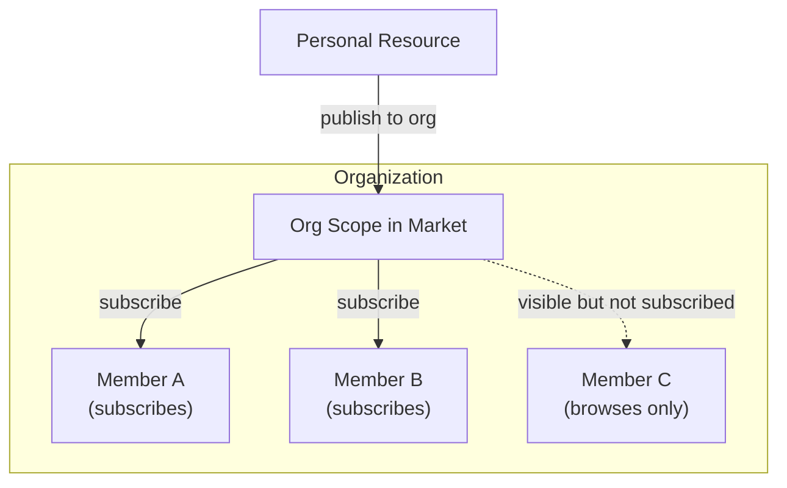
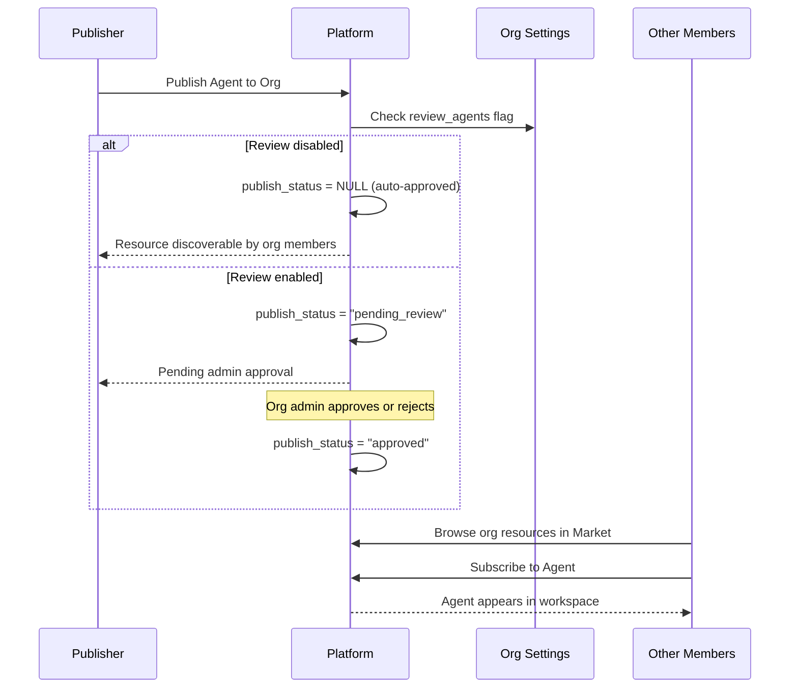
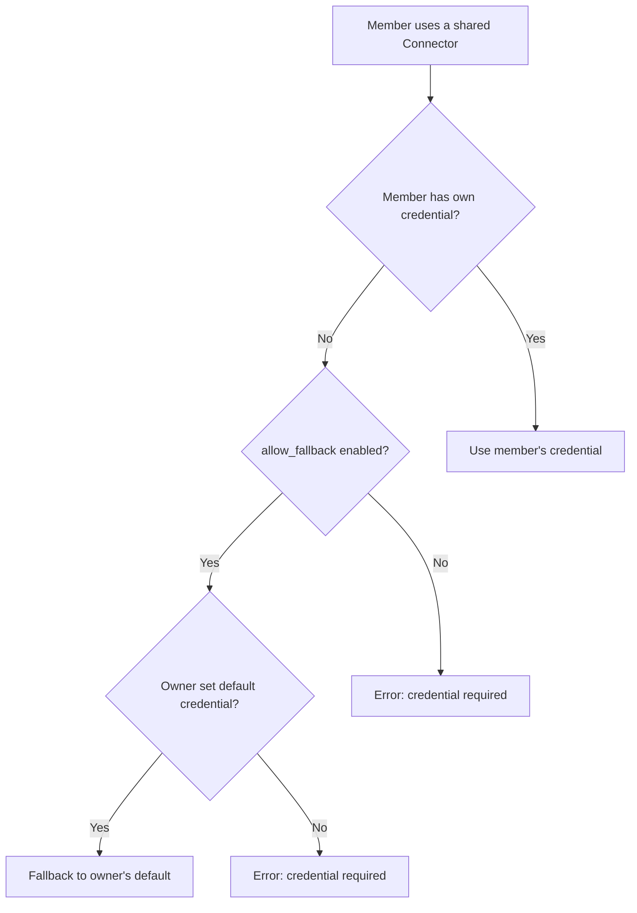

## 概述

组织是 FIM One 的团队协作单位。它们让用户组能够在受信任的范围内共享资源——智能体、连接器、知识库、MCP 服务器、工作流和技能。

FIM One 中的每个资源最初都是**个人的**（仅对其创建者可见）。当您将资源发布到组织时，它会变成**可发现的**，组织内的其他成员可以通过市场的组织范围浏览它。成员浏览组织的共享资源并订阅他们需要的资源。



组织和全球市场共享相同的基于订阅的访问模型。关键区别在于信任：组织代表一个团队或公司，其中成员彼此了解和信任，因此审查是可选的，凭证共享是直接的。

## 创建和管理组织

每个用户可以创建**无限**个组织并加入任意数量的组织。一个组织有三个角色：

| 角色 | 权限 |
|---|---|
| **所有者** | 完全控制 — 管理成员、配置设置、绕过审查 |
| **管理员** | 管理成员和审查已发布的资源 |
| **成员** | 浏览和订阅共享资源 |

所有者始终是创建组织的用户。所有权可以转移但不能共享。

## 发布资源

当您将资源发布到您的组织时，它**不会**自动出现在每个成员的工作区中。相反，该资源在市场的组织范围内变得可发现，成员可以在其中浏览并订阅它。

这种基于订阅的模型让每个成员能够控制他们的工作区。一个大型组织可能共享数十个连接器，但个别成员只订阅与他们的工作相关的那些。



### 审核系统

审核是**可选的**，按资源类型配置。每个组织都有独立的切换标志：

- `review_agents`
- `review_connectors`
- `review_kbs`
- `review_mcp_servers`
- `review_workflows`
- `review_skills`

当为某个资源类型禁用审核时，已发布的资源会立即被成员发现——无需管理员操作。启用审核时，资源进入 `pending_review` 状态，需要管理员批准后才能变为可见。

<Tip>
组织所有者会自动绕过审核。他们发布的资源始终立即可被发现。
</Tip>

这种灵活性让组织能够匹配其治理需求。小型初创公司可能会禁用所有审核切换以实现无摩擦共享，而注重合规的企业可能会在智能体和连接器上启用审核以保持监督。

## 凭证回退

连接器和 MCP 服务器通常需要凭证（API 密钥、数据库密码、OAuth 令牌）。FIM One 提供了**回退机制**，使成员无需自己配置每个凭证。



有两种模式：

- **启用回退**（`allow_fallback=true`，默认值）：未提供自己凭证的成员自动使用所有者的默认凭证。这适用于团队共享的 API 密钥或内部服务，其中单个密钥覆盖整个团队。
- **禁用回退**（`allow_fallback=false`）：每个成员必须配置自己的凭证。这适用于每个用户需要个人 API 密钥的情况（例如，按座位计费的 SaaS 许可证）。

不需要凭证的资源（例如只读公共 API 连接器或无身份验证的智能体）在订阅后立即可用。无需配置。

<Info>
凭证回退仅在成员订阅资源后适用。回退机制决定了凭证在运行时如何解析，而不是资源是否可访问。
</Info>

## 资源可见性

FIM One 中的每个资源都有一个 `visibility` 属性，用于确定其访问范围：

| 可见性 | 范围 | 谁可以发现它 |
|---|---|---|
| `personal` | 仅所有者 | 创建它的用户 |
| `org` | 组织 | 组织成员可以浏览和订阅（如果获得批准） |

可见性过滤器遵循统一的查询模式：

```
A resource is available in your workspace if:
  1. You own it (any visibility), OR
  2. It's published to an org you belong to, approved, AND you've subscribed to it
```

<Warning>
将资源发布到组织不会自动授予访问权限。成员必须通过市场的组织范围订阅才能将资源添加到其工作区。
</Warning>

## 实际应用场景

### 团队共享数据库连接器

1. Alice 创建了一个连接到团队 PostgreSQL 数据库的连接器
2. Alice 将其发布到她的团队组织（连接器禁用了审查）
3. 该连接器在市场的组织范围内可被发现
4. Bob 浏览组织的共享资源，找到该连接器，并订阅
5. 该连接器出现在 Bob 的工作区中，使用 Alice 的数据库凭证作为备用
6. Carol 也订阅了。Dave（外部承包商）订阅并配置了自己的只读凭证

### 严格审查的组织

1. 一家合规性公司在其组织上启用 `review_agents=true` 和 `review_connectors=true`
2. 当员工发布新的智能体时，它进入 `pending_review` 状态
3. 组织管理员审查智能体配置并批准它
4. 智能体变为可发现的 — 其他成员现在可以找到并订阅它
5. 如果发布者稍后编辑已批准的智能体，它会自动恢复到 `pending_review` 状态以重新审查

### 大型组织中的选择性订阅

1. 一个组织发布 50+ 个连接器，涵盖内部 API、数据库和第三方服务
2. 数据团队仅订阅数据库连接器和分析 API
3. 营销团队仅订阅 CRM 和电子邮件平台连接器
4. 每个团队成员的工作区保持专注且整洁

## 另请参阅

- [市场架构](/concepts/market) — 了解全球市场及其与组织的关系。两者使用相同的订阅模型，但市场充当跨组织发现渠道，需要强制审查。
- [智能体和资源发现](/architecture/agent-discovery) — 订阅的资源如何在聊天期间组装成工具集。
