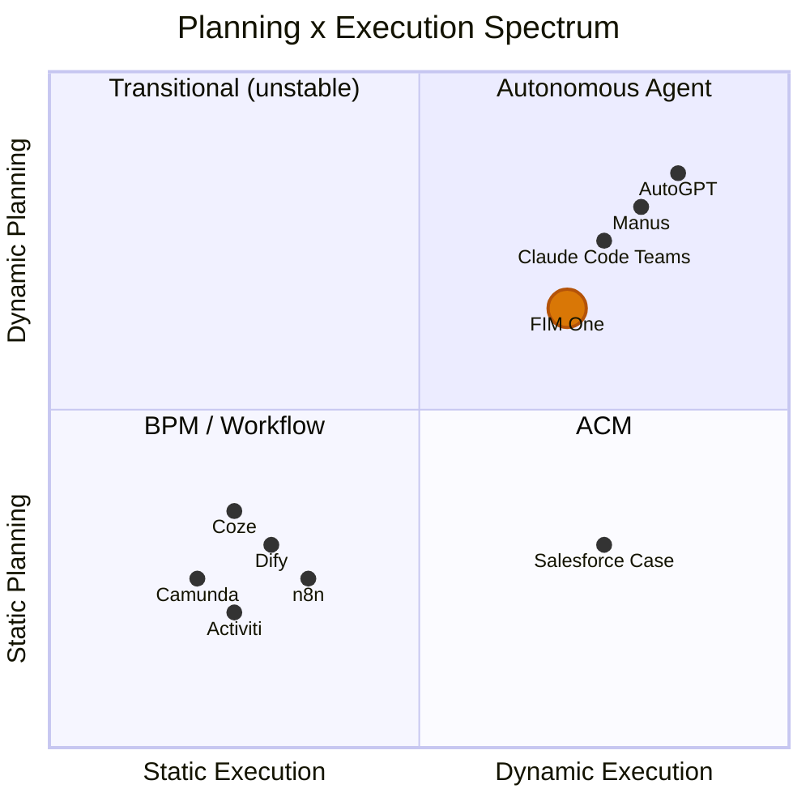
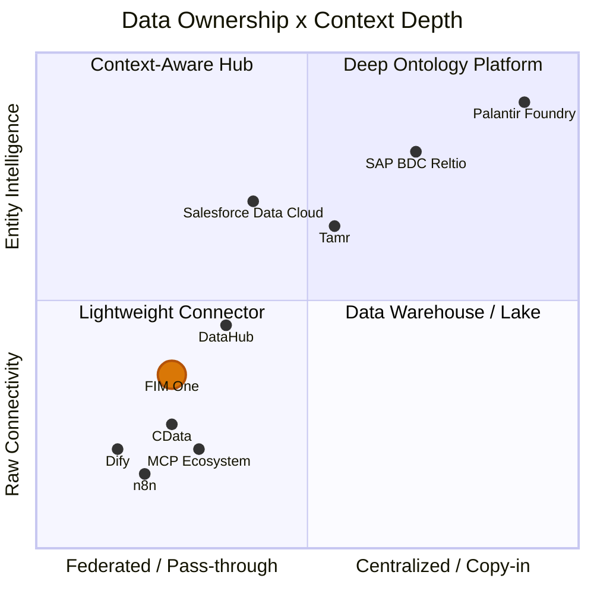

## 为什么动态规划是困难的中间地带

AI 智能体的格局分为两个阵营，两者都选择了简单的路径。传统工作流引擎——Dify、n8n、Coze——选择了静态编排：带有固定执行路径的可视化拖放流程图。这不是无知；企业客户要求确定性（相同输入、稳定输出），而静态图能够提供这一点。在另一个极端，完全自主的智能体（AutoGPT 及其衍生品）承诺端到端的自主性，但被证明不切实际：任务分解不可靠、代币成本失控，以及无人能预测或调试的行为。

最佳点很窄但真实存在。简单任务不需要规划器。足够复杂需要数十个相互依赖步骤的任务会让当前的 LLM 不堪重负。但在两者之间存在一类丰富的问题——具有清晰的并行子任务的任务，这些任务很难硬编码，但对 LLM 来说可以分解。动态 DAG 规划正是针对这个区域：模型在运行时提出执行图，框架验证结构并以最大并发性运行它。没有拖放，没有盲目自主。

## 对改进模型的押注

每隔几个月基础就会发生变化——GPT-4、函数调用、Claude 3、MCP 协议。在不断变化的基础上构建严格的抽象是有风险的；LangChain 的过度抽象是这个领域中每个人都已经吸取的教训。FIM One 采取相反的方法：**最小化抽象，最大化可扩展性**。该框架拥有编排、并发和可观测性。智能来自模型，而模型不断改进。

今天，LLM 任务分解精度对于非平凡目标来说约为 70-80%。当达到 90% 以上时，动态规划的"最佳点"会大幅扩展——昨天过于复杂的问题明天就会变得易于处理。FIM One 的 DAG 框架旨在捕获这种扩展的价值，而无需重写底层逻辑。

## ReAct 和 DAG 规划会过时吗？

ReAct 不会消失——它会沉入模型中。考虑这个类比：你不需要手写 TCP 握手，但 TCP 并没有消失；它被吸收到了操作系统中。当模型足够强大时，思考-行动-观察循环会成为模型内部的隐式行为，而不是显式框架代码。这已经在发生：Claude Code 本质上是一个 ReAct 智能体，其中循环由模型本身驱动，而不是由外部框架驱动。

DAG 规划的持久价值不是"帮助能力有限的模型分解任务"——而是**并发调度**。即使拥有无限能力的模型，物理学也会施加延迟限制：10 个 LLM 调用的串行链比 3 个并行波次慢 10 倍。DAG 是一个工程问题（如何快速可靠地运行事物），而不是智能问题（如何决定运行什么）。重试逻辑、成本控制、超时管理、可观测性——当模型变得更聪明时，这些都不会消失。

最终状态：**模型拥有"做什么"（规划智能内化到模型中），框架拥有"怎么做"（并发、重试、监控、成本治理）**。框架的持久价值不是智能——而是治理。

## 为什么不镜像 Dify 的工作流编辑器

一个自然的问题：如果 DAG 涵盖了灵活的情况，我们是否也应该为确定性情况构建一个静态工作流编辑器？

不应该。原因如下：

1. **工作流已经存在于其他地方。** 政府和企业客户的固定流程存在于他们的 OA、ERP 和遗留系统中。他们不想在另一个平台上重新构建这些流程 -- 他们想要能够连接到这些流程已经运行的系统的 AI。连接器平台（v0.6）直接解决了这个问题。

2. **现有功能组合成固定管道。** 定时任务（v1.0）使用固定提示触发 DAG 智能体；DAG 动态规划步骤；连接器（v0.6）连接到目标系统。这个组合等同于静态管道 -- 但更灵活，因为 LLM 可以根据它遇到的数据调整其计划。不需要单独的管道 DSL。

3. **投资不匹配。** 生产级质量的可视化工作流编辑器（画布、节点类型、变量传递、调试/重放）需要数月的专项工作。其结果将是 Dify 的 120K 星社区已经维护的低保真副本。这些工作最好用于连接器架构 -- 这是竞争对手没有提供的功能。

战略赌注：**不要在工作流可视化上竞争；要在成为系统与 AI 相遇的枢纽上竞争**。让 Dify 拥有"可视化构建 AI 工作流"。FIM One 拥有"系统与 AI 相遇的枢纽"。

## FIM One 的定位

FIM One 不是"AGI 任务调度器"，也不是静态工作流引擎。它处于中间地带：具有约束的规划能力、可观测的并发。

- 与 **Dify** 相比：更灵活 -- 运行时 DAG 生成 vs. 设计时流程图。您无需提前预测每个执行路径。不在可视化工作流编辑上竞争；在遗留系统集成上竞争。
- 与 **AutoGPT** 相比：更受控 -- 有界迭代、重新规划限制、路线图上的人工介入。在护栏内的自主性。

策略很直接：现在构建编排框架，让不断改进的模型随着时间推移为其填充能力。

## FIM One 的位置：规划 x 执行频谱

AI 执行景观可以映射到两个轴上——规划如何创建（静态 vs 动态）以及如何执行（刚性 vs 自适应）：

**为什么 Dify/n8n 是静态规划 + 静态执行**：DAG 由人类在设计时在可视化画布上绘制。每个节点执行固定操作（带有固定提示词的 LLM 调用、HTTP 请求、代码块）。没有运行时重新规划——如果一个步骤失败，工作流失败或遵循预先连接的错误分支。这在结构上与 BPM 相同，只是图中有 AI 节点。

**FIM One 的位置：动态规划 + 动态执行**

- **DAG 拓扑由 LLM 在运行时生成**（动态规划）——没有人类设计图
- **每个 DAG 节点运行完整的 ReAct 循环**（动态执行）——节点进行推理、使用工具并进行自适应
- **重新规划机制**（执行 → 分析 → 如果不满意则重新规划）
- 但有界限：最多 3 个重新规划轮次、token 预算、人工确认门

这将 FIM One 放在与 AutoGPT 相同的象限中，但具有防止失控行为的工程约束。比 BPM/Dify 更灵活，比 AutoGPT 更受控。

## 概念术语表

对于不熟悉本文档中使用的术语的读者：

| 术语 | 单行解释 | 与 FIM One 的关系 |
|------|---------------------|----------------------|
| **BPM**（业务流程管理） | 流程在设计时完全固定，严格执行。Camunda、Activiti。 | FIM One **不是** BPM。没有固定的流程引擎。 |
| **FSM**（有限状态机） | 系统在任何时刻恰好处于一个状态；事件触发转换。支持循环（拒绝 → 重新提交）。 | 目标系统（ERP、合同系统）内部使用 FSM。FIM One **不需要**自己的 FSM -- 它调用目标系统的 API。 |
| **ACM**（自适应案例管理） | 骨架静态，分支动态。主流程预定义，每个节点在运行时自适应。 | FIM One 的 DAG + ReAct 自然落入这个象限。 |
| **HTN**（分层任务网络） | 递归任务分解：高级 → 子任务 → 原子操作。 | DAG 重新规划涵盖大多数场景；暂不需要完整的 HTN。 |
| **iPaaS**（集成平台即服务） | 云集成平台，连接多个 SaaS/本地系统。MuleSoft、Zapier。 | FIM One 的 Hub Mode 类似**AI 原生 iPaaS** -- 自然语言驱动跨系统集成。 |
| **MDM**（主数据管理） | 跨系统去重和统一实体记录为"黄金记录"。Reltio、Informatica、Tamr。 | FIM One **连接到** MDM 系统；它不复制实体解析。 |
| **Context Layer / System of Context**（上下文层 / 上下文系统） | 统一的实体 + 关系图，为 AI 智能体提供可信的业务上下文。术语由 Reltio（2026）推广。 | FIM One 将此委托给上游 MDM/数据平台。Skills 为常见情况提供轻量级聚合。 |

## 架构边界：FIM One 不复制工作流逻辑

复杂的业务流程（审批链、转移、拒绝、升级、共同签署、副署）是**目标系统的责任**。这些系统花费多年构建这些逻辑 -- ERP、OA、合同管理系统都拥有成熟的状态机。

从连接器的角度来看：

| 操作 | 连接器的作用 |
|-----------|------------------------|
| 转移 | 调用一个 API，传递目标人员 |
| 拒绝 | 调用一个 API，传递拒绝原因 |
| 升级 | 调用一个 API，传递升级人员列表 |
| 共同签署 | 调用一个 API，传递共同签署人列表 |

每个复杂的工作流操作都简化为一个带参数的 HTTP 请求。FIM One 调用 API；目标系统管理状态机。

这是一个**刻意的架构边界**，而不是能力缺陷。复制目标系统中已存在的工作流逻辑会：
1. 增加维护负担（两个状态机需要保持同步）
2. 增加故障模式（如果它们不一致怎么办？）
3. 提供零附加价值（目标系统已经正确处理了这一点）

连接器模式设计简洁：**一个操作 = 一个 API 调用**。

## 架构边界：连接器层，而非上下文层

企业 AI 正在采用分层架构来管理智能体上下文：

| 层 | 功能 | 代表性产品 |
|-------|-------------|----------------------|
| **决策追踪** | 记录*为什么*发生了某事 -- 审计追踪、血缘关系 | Palantir Decision Lineage、Arize |
| **实体上下文** | 统一的黄金记录 + 关系图 -- "上下文系统" | Reltio/SAP、Informatica/Salesforce、Tamr |
| **数据连接** | 通过 API 和协议将智能体连接到源系统 | **FIM One**、CData、MCP 生态系统 |
| **源系统** | CRM、ERP、合同管理、数据库、SaaS 应用 | SAP、Salesforce、自定义系统 |

FIM One 在**数据连接层**运行。它不尝试构建其上方的实体上下文层。这是一个有意的选择，而不是一个缺陷。

### 行业背景：2025-2026年整合浪潮

两项标志性收购重塑了企业AI数据格局，并使上下文层成为战略竞争地：

- **Salesforce收购Informatica**（2025年11月）-- 将企业MDM和数据治理能力添加到其Data Cloud + Agentforce堆栈中。目标：通过将Agentforce智能体建立在Informatica的黄金记录基础上，使其值得信赖。
- **SAP宣布收购Reltio**（2026年3月）-- 将AI原生实体解析和关系图添加到其业务数据云（BDC）中。目标：创建跨越SAP和非SAP环境的"上下文系统"，作为Joule智能体的可信基础。

这些举措表明，全球最大的企业平台现在认为统一的实体上下文是可靠AI智能体的先决条件 -- 而不仅仅是锦上添花。

### 数据所有权 × 上下文深度谱系

**图表解读：**

- **左下角（轻量级连接器）**：最小数据所有权，原始 API 连接。Dify、n8n 和基础 MCP 服务器位于此处——它们连接到系统但不理解实体。FIM One 在此象限但 y 轴更高，因为具有渐进式披露元工具、基于技能的上下文聚合和领域感知升级。
- **左上角（上下文感知中枢）**：联合访问与实体级理解。Salesforce Data Cloud 是典范——零复制联合与按需实体解析。DataHub 提供元数据级上下文（模式、血缘、所有权）而不拥有业务数据。
- **右上角（深层本体平台）**：完整数据摄取与深层实体智能。SAP BDC + Reltio 构建持久的多域黄金记录与关系图。Palantir 走得最远——三层本体与决策血缘。
- **右下角（数据仓库 / 数据湖）**：集中式数据存储但无实体语义。传统数据平台摄取一切但缺乏实体解析或关系建模。

FIM One 的位置反映了一个深思熟虑的选择：保持联合和轻量级，但投资使来自任何 MDM 的上游实体上下文易于被智能体访问。

### 三种实体上下文模型

**SAP：多域黄金记录（复制入库 + 治理）**

SAP 正在构建三层企业架构：

| 层级 | 系统 | 角色 |
|-------|--------|------|
| **交易** | S/4HANA | 业务执行 -- 订单、发票、交付 |
| **智能** | Business Data Cloud (BDC) + Reltio | 语义集成、实体解析、关系图 |
| **智能体** | Joule + Joule Agents | 意图理解、工具编排、自主执行 |

Reltio 位于智能层的核心。其职责：从 SAP 和非 SAP 系统摄取实体数据，通过基于 AI 的匹配解决重复项，并生成**多域黄金记录**（客户、供应商、产品、患者、资产）以及关系图。Reltio 对 **MCP 协议**的早期采用在战略上意义重大 -- 它将黄金记录定位为任何 MCP 兼容智能体都可直接调用的资源，而不仅限于 SAP 自己的 Joule。

SAP 的赌注：智能体需要一个持久的、受治理的、跨域的"唯一真实来源"来在高风险企业流程中可靠地运作。

**Salesforce：零复制联邦（联邦 + 按需解析）**

Salesforce 采取了更轻量级的方法。Data Cloud 不需要物理数据移动；相反，它使用**零复制合作伙伴关系**（Databricks、Snowflake、BigQuery）来就地联邦数据。实体解析在 Data Cloud 内按需进行，创建统一的客户档案，无需持久的黄金记录存储。

关键数据（2026 财年第三季度）：Data Cloud 摄取了 32 万亿条记录，其中 15 万亿条通过零复制（同比增长 341%）。这个规模验证了联邦模型对于以 CRM 为中心的用例的有效性。

Agentforce 智能体基于这种联邦上下文：它们在分布式数据资产中推理，无需所有数据都落地到一个系统中。对于前台场景（销售、服务、营销），这既灵活又快速部署。

Salesforce 的赌注：智能体不需要重量级的黄金记录存储 -- 它们需要实时访问联邦的、已解析的上下文，就在数据已存在的地方。

**Palantir：深层本体（重量级参考）**

在极端情况下，Palantir Foundry 摄取所有数据并构建三层本体（语义对象 + 动力学操作 + 动态规则），具有完整的决策谱系。这是生产中最完整的上下文系统，但合同价格为 1000 万美元以上，部署周期为 6-18 个月。它充当参考架构，而不是大多数组织的现实模型。

### FIM One 的定位

| 维度 | SAP + Reltio | Salesforce + Informatica | FIM One |
|-----------|-------------|-------------------------|---------|
| **数据理念** | 复制导入：导入到 BDC，构建黄金记录 | 联邦化：零复制访问，按需解析 | 直通：连接到源，不存储 |
| **实体解析** | 深度 -- AI 原生 MDM 与关系图 | 中等 -- Data Cloud 实体解析 | 无 -- 委托给上游 MDM |
| **智能体集成** | Joule 智能体 + MCP | Agentforce + Data Cloud 基础 | 任何智能体 + 任何连接器 |
| **部署成本** | 企业平台定价 | 企业 SaaS 定价 | 轻量级，数小时到数天 |
| **锁定** | 高（BDC + S/4HANA 生态系统） | 中等（Salesforce 生态系统） | 低 -- 连接器可互换 |
| **最佳适用场景** | 制造、供应链、生命科学（复杂多域） | CRM 驱动型企业（前台办公重点） | 中端市场、多系统、供应商无关 |

FIM One 最接近 **Salesforce 理念**（不拥有数据，连接到数据），但不依赖 Salesforce 生态系统。战略定位：在连接层保持供应商无关性，让任何 MDM -- 无论是 SAP/Reltio、Salesforce/Informatica、Tamr 或自定义解决方案 -- 充当实体上下文源。

### 为什么 FIM One 保持在连接器层

构建实体上下文层需要持久数据存储、基于机器学习的实体解析、存活规则、关系图引擎和治理框架。这是一个独特的产品类别 (MDM)，具有十年深度的竞争 (Reltio、Informatica、Tamr)。尝试这样做会：

1. **将 FIM One 从连接器转变为数据平台** -- 从根本上不同的产品、团队和市场进入方式
2. **复制上游系统已经提供的功能** -- 我们在工作流逻辑中避免的相同反模式
3. **增加锁定** -- 一旦用户在 FIM One 中存储黄金记录，转换成本会急剧上升

正确的策略：**成为任何 MDM 系统的最佳入口点**，而不是其替代品。FIM One 应该使 Reltio、Informatica、Tamr 或自定义 MDM 为智能体提供实体上下文变得轻而易举 -- 通过 MCP Resources、连接器 API 或知识库注入。

### 当前方法：技能作为轻量级上下文聚合

对于需要跨连接器上下文的场景（例如，合同审查需要供应商数据 + 付款历史 + 风险标志），**技能**已经提供了一个实用的解决方案。技能的 SOP 可以按顺序编排多个连接器操作，聚合结果，并向智能体呈现结构化上下文 -- 无需构建持久实体层。

这涵盖了 80% 的用例。如果未来出现对连接器级别实时实体解析的需求，该架构为未来的 `ContextSource` 连接器类型留出了空间，该类型可与外部 MDM 系统集成 -- 但这是未来的考虑，而非当前的承诺。

### 类比

FIM One 与上下文层的关系就像 SQLAlchemy 与数据库的关系：它不存储或管理数据，但它使任何数据源都可以被应用层访问。让 MDM 平台拥有实体解析；让 FIM One 拥有连接。

## FIM One 在 AI 堆栈中的位置

### 分层模型

一个有用的心智模型（致谢 [Phil Schmid](https://www.philschmid.de/)）将 AI 系统映射到类似于计算硬件的四层堆栈：

| 层级 | 类比 | FIM One 组件 |
|-------|---------|-------------------|
| **模型** | CPU | ModelRegistry -- 任何 OpenAI 兼容的 LLM |
| **上下文** | RAM | ContextGuard + 内存（窗口 / 摘要 / 数据库） |
| **框架** | 操作系统 | ReAct 智能体 + DAG 规划器 + 钩子 + ToolRegistry |
| **应用** | 应用程序 | Portal、Copilot、Hub API |

FIM One 在**框架层**运作 -- 它不与模型竞争；它通过提供正确的工具、约束和反馈循环来提高模型的生产力。模型提供智能；框架提供治理、并发性和可靠性。

### AI 工程的三个时代

这个学科经历了不同的阶段：**提示词工程**专注于精心设计指令以从固定模型中获得正确行为。**上下文工程**将注意力转向组装正确的信息——检索文档、注入工具结果、管理记忆——使模型拥有良好推理所需的内容。**治理工程**更进一步：围绕模型设计完整的执行环境，包括确定性防护栏、工具编排、反馈循环和成本控制。

FIM One 的架构体现了治理工程原则。[Hook 系统](/architecture/hook-system)在明确定义的生命周期点在 LLM 循环外运行平台代码——目前 `FeishuGateHook` 拦截敏感工具调用并通过 IM 渠道路由审批，同一抽象是 v0.9 中计划的审计日志、只读模式强制执行、速率限制和结果截断的所在地。ContextGuard 管理什么进入上下文窗口以及何时进入。动态工具选择（渐进式披露元工具）随着连接器数量增长而保持工具表面可控。ReAct 循环的自反思机制和 DAG 规划器的重新规划周期提供结构化反馈，在不需要更强大模型的情况下改进执行质量。
