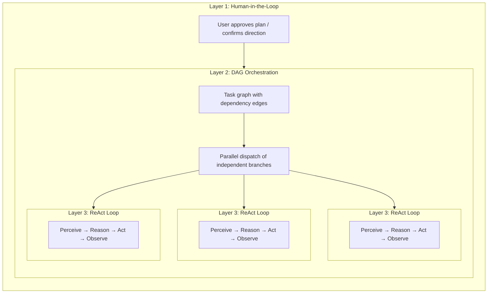

  ## AI 工具领域中的五种“规划”

“规划”这个词常被混用。如今至少存在五种不同的方法，它们分别解决不同的问题：

| 方法                        | 计划格式                  | 执行方式            | 审批            | 核心价值             |
| ------------------------- | --------------------- | --------------- | ------------- | ---------------- |
| **隐式模型规划**                | 内部思维链                 | 单次推理            | 无             | 模型自行推演步骤         |
| **Claude Code plan mode** | Markdown 文档           | 串行              | 执行前由人工审查      | 在动手修改代码前先就方案达成一致 |
| **Claude Code Teams**     | 带依赖边的任务列表             | **并发** (多智能体)   | 人工批准计划，随后自主执行 | 动态智能体池 + 并行执行    |
| **Kiro 规范驱动开发**           | 结构化规范 (需求 + 设计 + 任务)  | 串行              | 人工审查规范        | 可追溯的需求与验收标准      |
| **FIM Agent DAG**         | JSON 依赖图              | **并发** (单一编排器)  | 自动 (计划分析器)    | 并行执行 + 运行时调度     |

前两种属于**设计时**规划——它们在工作开始*之前*先产出计划，然后由人工 (或模型本身) 按步骤执行。后三种则引入了**运行时**规划——执行图以程序化方式生成并调度，彼此独立的分支可并行运行。区别在于*谁*来执行：Claude Code Teams 会启动自主智能体；FIM Agent DAG 则在单一编排器内分派各个步骤。

这些方法并不是相互竞争的关系；它们是互补的分层。Kiro 风格的规范可以定义要构建的*内容*，而 FIM Agent DAG 可以调度子任务*如何*并发执行。Claude Code 的计划模式确保人工认同实施方案；FIM Agent 的计划分析器则自动验证结果。

  ## 三层嵌套：全能力架构

在满负载下，Claude Code Teams 和 FIM Agent DAG 都呈现出**三层嵌套架构**：

- **第 1 层 — 人工把关**：用户先审阅并批准计划，然后才开始执行。
- **第 2 层 — DAG 编排**：获批的计划会被分解为带依赖边的任务。相互独立的任务并行运行；下游任务则需等待其前置阻塞被解除。
- **第 3 层 — ReAct 内循环**：每个任务都由一个运行完整 ReAct 循环（Perceive → Reason → Act → Observe）的智能体执行，具备多步推理、工具调用和自主重试能力。

关键点在于：**Claude Code Teams 和 FIM Agent DAG 实现的是同样的三层结构，只是第 2 层的机制不同**——消息传递 vs 依赖边解析。

  ## 全能力运行时：FIM Agent vs Claude Code Teams

两者都是真正的智能体——核心循环完全一致：**感知 → 推理 → 行动 → 反馈**。区别在于，它们如何在满负载下编排并行工作。

| 维度 | Claude Code Teams | FIM Agent DAG |
|---|---|---|
| **并行模型** | Leader 创建 SubAgents，并通过消息分派任务 | 拓扑排序会自动并行化相互独立的步骤 |
| **任务图** | 带有 `blockedBy` / `blocks` 边的 TaskList（动态 DAG） | 带有 `depends_on` 边的静态 JSON DAG |
| **协调方式** | 显式消息传递（SendMessage / Broadcast） | 隐式依赖边——没有消息，只有数据流 |
| **智能体生命周期** | 动态池——按需创建智能体，完成后关闭 | 固定步骤执行器——每个步骤对应一次 LLM 调用 |
| **反馈与纠正** | 每个 SubAgent 自主重试；Leader 在失败时重新分派任务 | PlanAnalyzer 评估结果 → 重新规划循环（最多 3 轮） |
| **人工参与** | Plan mode 审批后，再自主执行 | 全自动——由 PlanAnalyzer 决定通过还是重新规划 |
| **上下文管理** | 每个 SubAgent 都有隔离的上下文窗口（无交叉污染） | 所有步骤共享 DbMemory + LLM Compact |
| **令牌经济性** | `N agents × per-agent tokens` ——时间↓、令牌↑（成本成倍增加） | 串行或浅层并行——总令牌消耗更低 |
| **扩展模式** | 增加更多 SubAgents（横向扩展，消息耦合） | 增加更多 DAG 分支（横向扩展，依赖耦合） |
| **最适用场景** | 多样化、关联较弱的任务（研究 + 编码 + 测试） | 具有清晰数据依赖关系的结构化工作流 |

  ### 真实世界基准：v0.5 RAG 系统

Claude Code Teams 在单次会话中构建了 FIM Agent 的整个 v0.5 RAG 子系统：

* **8 个阶段**：Embedding → Reranker → Loaders → Chunking → VectorStore → Retrieval → KB Backend → Frontend + Docs
* **46 项测试**全部通过，前端构建无报错
* **总耗时**：约 5 分钟
* **令牌成本**：每个智能体任务约 10 万令牌 × 8+ 个任务 ≈ 80 万+ 总令牌
* **依赖边**：第 5 阶段依赖第 4 阶段 + 1b；第 6 阶段依赖第 5 阶段 + 2 + 3 —— 形成一个真正的 DAG

这展示了核心权衡：**以令牌倍增为代价换取时间并行性**。Claude Code Teams 用计算成本换取开发者时间。

  ### 走向融合，而非竞争

“团队协作”和“流水线调度”之间的边界正在逐渐模糊：

- **Claude Code Teams 的 `blockedBy`/`blocks` 本身就是 DAG** —— 任务具有显式依赖边，随着前序任务完成，Leader 会分派新近解除阻塞的任务。这本质上就是拓扑调度，只是多了一些额外步骤（消息）。
- **FIM Agent 的 DAG 也可以从智能体自主性中获益** —— 与其让每一步只执行一次 LLM 调用，不如让每一步运行完整的 ReAct 循环，这样会更适合处理复杂子任务。

**要点：** 两者有着相同的智能体本质，并行理念正逐步趋同。Claude Code 采用的是**团队协作**模型——由 Leader 向 Workers 分派任务，并通过消息通信。FIM Agent 采用的是**流水线调度**模型——由 DAG Executor 根据依赖关系的解析结果分派各个步骤。实际上，两者都在实现依赖驱动的并行执行；差异主要在于协调开销（消息 vs 边）以及令牌经济性（隔离上下文 vs 共享内存）。最优架构很可能是两者结合：结构化流水线采用 DAG 调度，需要自主多步推理的任务则使用智能体池。