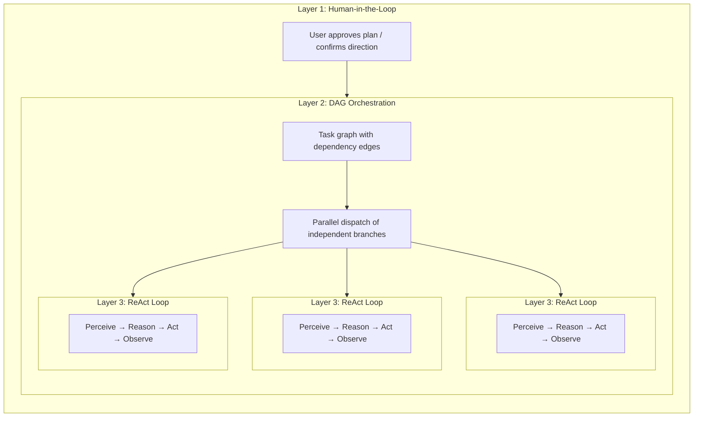

## AI 工具生态中的五种"规划"

"规划"这个词被过度使用了。目前至少存在五种不同的方法，它们解决不同的问题：

| 方法 | 规划格式 | 执行 | 审批 | 核心价值 |
|---|---|---|---|---|
| **隐式模型规划** | 内部思维链 | 单次推理 | 无 | 模型自行思考步骤 |
| **Claude Code 规划模式** | Markdown 文档 | 串行 | 人工在执行前审查 | 在修改代码前达成方法共识 |
| **Claude Code Teams** | 带依赖边的任务列表 | **并发**（多智能体） | 人工批准规划，然后自主执行 | 动态智能体池 + 并行执行 |
| **Kiro 规范驱动开发** | 结构化规范（需求 + 设计 + 任务） | 串行 | 人工审查规范 | 可追溯的需求、验收标准 |
| **FIM One DAG** | JSON 依赖图 | **并发**（单个编排器） | 自动（PlanAnalyzer） | 并行执行 + 运行时调度 |

前两种是**设计时**规划——它们在工作开始前生成规划，由人类（或模型本身）逐步执行。后三种引入了**运行时**规划——执行图由程序生成和调度，独立分支并行运行。区别在于*谁*执行：Claude Code Teams 生成自主智能体；FIM One DAG 在单个编排器内调度步骤。

这些方法不是竞争关系，而是互补层。Kiro 风格的规范可以定义*构建什么*，而 FIM One DAG 可以调度*如何*并发执行子任务。Claude Code 的规划模式确保人工同意该方法；FIM One 的 PlanAnalyzer 自动验证结果。

## 三层嵌套：全功能架构

Claude Code Teams 和 FIM One DAG 在全容量下都展现出**三层嵌套架构**：

- **第 1 层 — 人工审核门**：用户审查计划并在执行开始前批准。
- **第 2 层 — DAG 编排**：批准的计划被分解为具有依赖边的任务。独立任务并行运行；下游任务等待其阻塞者解决。
- **第 3 层 — ReAct 内循环**：每个任务由运行完整 ReAct 循环（感知 → 推理 → 行动 → 观察）的智能体执行，能够进行多步推理、工具使用和自主重试。

关键洞察：**Claude Code Teams 和 FIM One DAG 实现相同的三层，只是第 2 层机制不同** — 消息传递 vs 依赖边解析。

## 全功能运行时：FIM One vs Claude Code Teams

两者都是真正的智能体——核心循环相同：**感知 → 推理 → 行动 → 反馈**。区别在于它们如何在满负荷下编排并行工作。

| 维度 | Claude Code Teams | FIM One DAG |
|---|---|---|
| **并行模型** | Leader 生成 SubAgent，通过消息分配任务 | 拓扑排序自动并行化独立步骤 |
| **任务图** | 带有 `blockedBy` / `blocks` 边的 TaskList（动态 DAG） | 带有 `depends_on` 边的静态 JSON DAG |
| **协调** | 显式消息传递（SendMessage / Broadcast） | 隐式依赖边——无消息，仅数据流 |
| **智能体生命周期** | 动态池——按需生成智能体，完成后关闭 | 固定步骤执行器——每个步骤一次 LLM 调用 |
| **反馈与纠正** | 每个 SubAgent 自主重试；Leader 在失败时重新分配 | PlanAnalyzer 评估结果 → 重新规划循环（最多 3 轮） |
| **人工参与** | 规划模式审批，然后自主执行 | 完全自动——PlanAnalyzer 决定通过/重新规划 |
| **上下文管理** | 每个 SubAgent 获得隔离的上下文窗口（无交叉污染） | 跨所有步骤共享 DbMemory + LLM Compact |
| **Token 经济学** | `N 个智能体 × 每个智能体 token` — 时间↓ token↑（乘法成本） | 顺序或浅并行——总 token 更少 |
| **扩展模式** | 添加更多 SubAgent（水平，消息耦合） | 添加更多 DAG 分支（水平，依赖耦合） |
| **最适用于** | 多样化、松散相关的任务（研究 + 代码 + 测试） | 具有明确数据依赖的结构化工作流 |

### 真实基准：v0.5 RAG 系统

Claude Code Teams 在单个会话中构建了 FIM One 的整个 v0.5 RAG 子系统：

- **8 个阶段**：嵌入 → 重排序器 → 加载器 → 分块 → 向量存储 → 检索 → 知识库后端 → 前端 + 文档
- **46 个测试**通过，前端构建清晰
- **实际耗时**：约 5 分钟
- **令牌成本**：每个智能体任务约 100k 令牌 × 8+ 个任务 ≈ 800k+ 总令牌
- **依赖边**：第 5 阶段依赖第 4 阶段 + 1b；第 6 阶段依赖第 5 阶段 + 2 + 3 — 一个真正的 DAG

这演示了核心权衡：**时间并行性以令牌倍增为代价**。Claude Code Teams 用计算成本换取开发者时间。

### 汇聚而非竞争

"团队协作"和"管道调度"之间的界限正在模糊：

- **Claude Code Teams 的 `blockedBy`/`blocks` 本质上是一个 DAG** — 任务具有显式的依赖边，领导者在前置任务完成时分派新解锁的任务。这是拓扑调度加上额外步骤（消息）。
- **FIM One 的 DAG 可以受益于智能体自主性** — 与其每个步骤进行单次 LLM 调用，不如让每个步骤运行完整的 ReAct 循环来更好地处理复杂的子任务。

**要点：** 相同的智能体本质，汇聚的平行理念。Claude Code 遵循**团队协作**模型 — 领导者委派任务给工作者，工作者通过消息进行通信。FIM One 遵循**管道调度**模型 — DAG 执行器根据依赖关系解析分派步骤。实际上，两者都实现了依赖驱动的并行执行；区别在于协调开销（消息 vs 边）和 token 经济学（隔离上下文 vs 共享内存）。最优架构可能结合两者：用 DAG 调度处理结构化管道，用智能体池处理需要自主多步推理的任务。

## 结构化输出降级

DAG 管道中的所有结构化 LLM 调用点（Planner、Analyzer、Tool Selection）都使用统一的 `structured_llm_call()` 实用程序，该程序实现了一个 3 级降级链：

| 级别 | 条件 | 工作原理 |
|---|---|---|
| **Native FC** | `llm.abilities["tool_call"]` | 强制执行虚拟工具调用；从 `tool_calls[0].arguments` 中提取 |
| **JSON Mode** | `llm.abilities["json_mode"]` | 设置 `response_format={"type":"json_object"}`；使用 `extract_json()` 解析 |
| **Plain text** | 始终可用 | 使用 `extract_json()` 解析自由格式内容，然后可选的 `regex_fallback()` |

每个基于文本的级别在降级到下一个级别之前会使用重新格式化提示重试一次。结果是一个 `StructuredCallResult`，包含解析的值、成功的提取级别和累积的令牌使用情况。

这种设计意味着相同的提示可以可靠地跨 GPT-4（native FC）、Claude（JSON mode）和本地模型（plain text）工作，在一个地方实现一致的错误处理和重试逻辑，而不是分散在四个调用点中。
