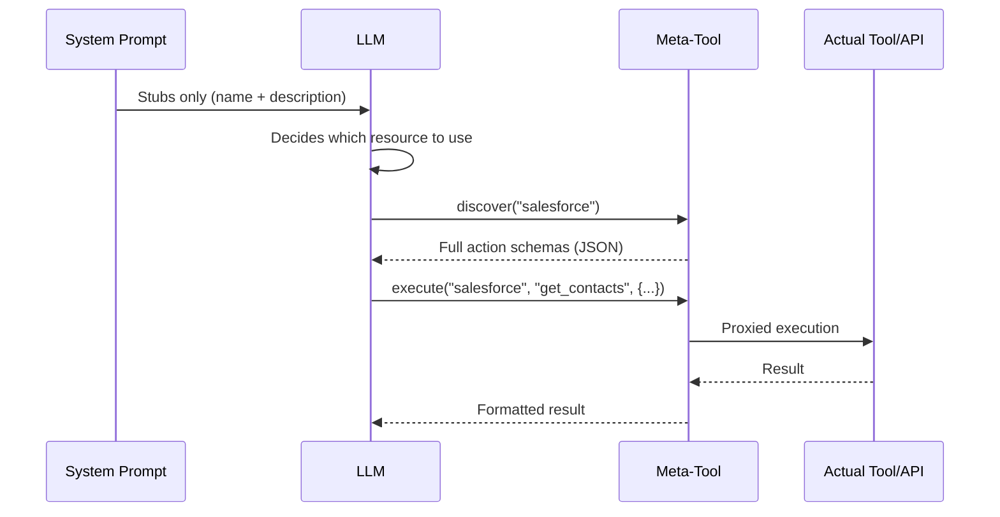
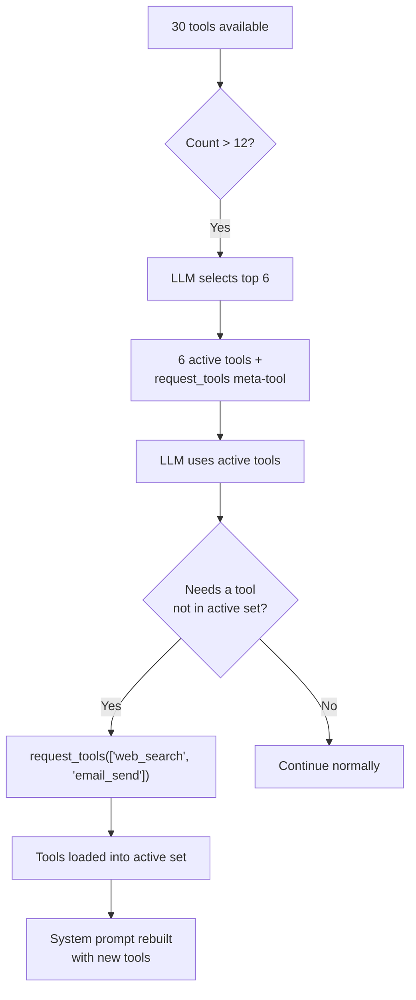

## 问题所在

LLM 在两种货币上付出代价：令牌和注意力。系统提示中注入的每个工具定义都会消耗两者。单个 MCP 服务器可以暴露 90 多个工具。五个 API 连接器，每个 20 个操作，产生 100 个工具定义。三个数据库连接器，每个 30 个表，生成另外 90 个模式描述。在用户甚至输入一个字之前，系统提示就可以消耗 50-100KB 的上下文 -- 128K 模型预算的一半。

代价不仅仅是令牌。研究和实践一致表明，**随着无关上下文的增长，LLM 的准确性会下降。** 系统提示中有 80 个工具定义的智能体在工具选择上的表现明显不如只有 6 个工具的智能体。模型将注意力花在它永远不会使用的工具模式上，削弱了它对重要工具和指令的关注。

天真的解决方案 -- 注入所有内容，让模型自己理清 -- 无法扩展。FIM One 采取相反的方法：**向 LLM 展示做出决策所需的最少信息，让它在需要时请求更多。**

## 模式

渐进式披露在所有资源类型中遵循两层架构：

1. **第 1 层 -- 系统提示中的存根。** 轻量级摘要：名称、简短描述和足够的元数据（操作计数、表计数、工具计数），供 LLM 决定是否需要更多信息。

2. **第 2 层 -- 按需提供完整详情。** LLM 调用元工具来检索完整的模式、参数和执行能力。完整详情作为工具结果消息进入对话 -- 仅限于该轮次，不会永久占用系统提示。



关键洞察：**完整工具模式是对话范围的，而非提示范围的。** 它们作为工具结果消息出现，上下文管理系统可以在后续轮次中对其进行摘要或截断。相比之下，系统提示内容在整个对话中以完整大小持续存在。

## 五种披露机制

FIM One 在五种资源类型中统一应用渐进式披露。每种都使用相同的两层模式，但配备针对其语义定制的元工具。

| 资源 | 元工具 | 存根显示 | 按需返回 | 配置变量 | 默认值 |
|---|---|---|---|---|---|
| 技能 | `read_skill` | 名称 + 描述（120 字符） | 完整 SOP 内容 + 嵌入式脚本 | `SKILL_TOOL_MODE` | `progressive` |
| API 连接器 | `connector` | 连接器名称 + 操作列表 | 完整操作模式及参数 | `CONNECTOR_TOOL_MODE` | `progressive` |
| 数据库连接器 | `database` | 数据库名称 + 表名称 + 计数 | 列模式、SQL 查询执行 | `DATABASE_TOOL_MODE` | `progressive` |
| MCP 服务器 | `mcp` | 服务器名称 + 工具列表 | 完整工具模式 + 调用 | `MCP_TOOL_MODE` | `progressive` |
| 内置工具 | `request_tools` | 紧凑目录（名称 + 80 字符描述） | 完整工具模式注入会话 | _（自动）_ | 工具 >12 时自动 |

### 技能 -- `read_skill`

**LLM 最初看到的内容：**

```
## Available Skills
Call read_skill(name) to load full content before executing any of these:
- Customer Complaint SOP: Handle escalations per company policy...
- Refund Processing: Step-by-step refund workflow with approval gates...
```

每个存根大约 30 个令牌 -- 一个名称加上从完整技能内容截断的 120 个字符描述。

**按需发生的情况：** LLM 调用 `read_skill("Customer Complaint SOP")` 并接收完整的 SOP 文本 -- 可能包含数千个令牌的分步说明、决策树和嵌入式脚本。此内容作为工具结果输入，而不是系统提示文本，因此在后续轮次中受到正常上下文管理（摘要、截断）的约束。

**旧版模式：** `SKILL_TOOL_MODE=inline` 将完整的技能内容直接嵌入到系统提示中。适用于技能数量少、规模小的情况 -- 但扩展性差。

**上下文节省：** 部署 10 个平均 2,000 个令牌的技能在渐进模式下消耗约 300 个令牌（仅存根），而在内联模式下消耗约 20,000 个令牌。这是持久上下文成本的 98% 减少。

### API 连接器 -- `connector`

**LLM 最初看到的内容：**

```
Interact with external services. Available connectors:
  - salesforce: CRM system -- actions: get_contacts, create_lead, update_opportunity
  - jira: Project management -- actions: create_issue, get_issue, search_issues

Subcommands:
  discover <name> -- list actions with full parameter schemas
  execute <name> <action> {"param": "value"} -- run an action
```

每个连接器存根列出操作名称，但不包含参数模式。LLM 知道*存在*哪些操作，但不知道*如何*调用它们——这正是决定是否使用连接器的恰当细节级别。

**按需发生的情况：** `connector("discover", "salesforce")` 返回完整的操作模式，包括 HTTP 方法、URL 路径、参数 JSON 模式和请求体模板。`connector("execute", "salesforce", "get_contacts", {"limit": 10})` 通过 `ConnectorToolAdapter` 代理执行，具有完整的身份验证注入和审计日志记录。

**旧版模式：** `CONNECTOR_TOOL_MODE=legacy` 将每个操作注册为单独的工具（`salesforce__get_contacts`、`salesforce__create_lead` 等）。具有 20 个操作的连接器在系统提示中变成 20 个工具定义。

**上下文节省：** 具有 15 个操作的连接器生成约 50 个令牌的存根，而完整模式约 3,000 个令牌。五个连接器：约 250 个令牌渐进式 vs. 约 15,000 个令牌旧版。

### 数据库连接器 -- `database`

**LLM 最初看到的内容：**

```
Query connected databases. Available databases:
  - hr_postgres: HR system (12 tables: employees, departments, salaries ...)
  - analytics_db: Analytics warehouse (45 tables: events, sessions, users ...)

Subcommands:
  list_tables <database> -- table names, descriptions, column counts
  discover <database> [table] -- full column schemas for one or all tables
  query <database> <sql> -- execute a SQL query
```

数据库存根包括表名称（最多 10 个）和计数，为 LLM 提供足够的信息来决定查询哪个数据库，而无需加载任何列架构。

**按需发生的情况：** 三个子命令形成自然的发现流程：

1. `database("list_tables", "hr_postgres")` -- 返回所有表名称、描述和列计数。
2. `database("discover", "hr_postgres", table="employees")` -- 返回完整的列架构（名称、类型、可为空、主键、描述）。
3. `database("query", "hr_postgres", sql="SELECT ...")` -- 执行经过验证的 SQL 查询，包含安全检查和行限制。

三步流程反映了开发人员探索新数据库的方式：浏览表、检查架构，然后查询。LLM 自然地遵循相同的模式。

**传统模式：** `DATABASE_TOOL_MODE=legacy` 为每个数据库注册三个工具（`{db}__list_tables`、`{db}__describe_table`、`{db}__query`）。对于 5 个数据库连接器，这是 15 个工具定义而不是 1 个。

**上下文节省：** 具有 30 个表和 200 列的数据库生成约 80 个令牌的存根，而完整架构生成约 5,000 个令牌。节省会随着多个数据库而增加。

### MCP 服务器 -- `mcp`

**LLM 最初看到的内容：**

```
Interact with MCP servers. Available servers:
  - github: GitHub (35 tools: create_issue, list_repos, get_pull_request ...)
  - slack: Slack (12 tools: send_message, list_channels, upload_file ...)

Subcommands:
  discover <server> -- list tools with full parameter schemas
  call <server> <tool> {"param": "value"} -- invoke an MCP tool
```

MCP 服务器是渐进式信息披露最显著的案例。GitHub MCP 服务器公开 35+ 个工具。文件系统服务器公开 20+ 个工具。如果没有渐进式信息披露，连接 3 个 MCP 服务器可能会向系统提示中注入 70+ 个工具定义 -- 每个都带有完整的 JSON Schema 参数。

**按需发生的情况：** `mcp("discover", "github")` 返回完整的工具目录和参数模式。`mcp("call", "github", "create_issue", {"title": "Bug report", "body": "..."})` 委托给存储的 `MCPToolAdapter`，该适配器与 MCP 服务器进程通信。

**旧版模式：** `MCP_TOOL_MODE=legacy` 将每个 MCP 工具注册为单独的工具（`github__create_issue`、`github__list_repos` 等）。这很容易超过工具选择阈值并触发不必要的选择阶段。

**上下文节省：** 这里的节省是极端的。GitHub MCP 服务器的 35 个工具可能消耗 10,000+ 个 token 的模式。在渐进式模式下，存根成本约为 100 个 token。如果用户在该对话中从不需要 GitHub，那么这 10,000 个 token 永远不会被消耗。

### 内置工具 -- `request_tools`

第五种机制在架构上与其他四种不同。它不会在元工具后面整合资源类型。相反，它解决了**工具选择瓶颈** -- 当智能体有超过 12 个工具可用时会发生什么。

**工作原理：** 当工具总数超过 `REACT_TOOL_SELECTION_THRESHOLD`（默认值：12）时，ReAct 引擎运行一个轻量级 LLM 调用来为当前查询选择前 6 个最相关的工具。其余工具存储在完整注册表中。会自动注册一个 `request_tools` 元工具，将所有未加载的工具列为紧凑目录（名称 + 80 字符描述）。



**LLM 最初看到的内容：**

```
Load additional tools into the current session.
Available tools not yet loaded:
- web_search: Search the web for current information and return relevant results...
- email_send: Send an email to one or more recipients with subject, body, and opt...
- python_exec: Execute Python code in a sandboxed environment and return the output...
```

**按需发生的情况：** `request_tools(tool_names=["web_search", "email_send"])` 将这些工具从完整注册表复制到活跃注册表中。系统提示在下一次迭代时重建，以便 LLM 看到完整的模式。这是一个副作用 -- 该工具在对话中途改变活跃工具集。

**无环境变量：** 当工具选择过滤集合时，此机制会自动激活。没有 `REQUEST_TOOLS_MODE` 环境变量。如果要完全禁用工具选择，请将 `REACT_TOOL_SELECTION_THRESHOLD` 设置为一个很大的数字。

**上下文节省：** 节省取决于有多少可用工具以及选择选择了多少工具。一个拥有 30 个工具的智能体只看到 6 个活跃模式 + `request_tools` 目录可节省大约 60--70% 的工具模式上下文。

## 它如何融入工具组装管道

[系统概述](/architecture/system-overview)描述了一个每请求8步的工具组装管道。渐进式披露在多个点起作用：

| 管道步骤 | 渐进式披露角色 |
|---|---|
| **1. 基础发现** | 无影响 -- 内置工具正常加载 |
| **2. 智能体类别过滤** | 无影响 -- 类别过滤无论模式如何都适用 |
| **3. KB 注入** | 无影响 -- KB 工具本身轻量级（1-2 个工具） |
| **4. 连接器加载** | `ConnectorMetaTool` 整合所有 API 连接器；`DatabaseMetaTool` 整合所有数据库连接器 |
| **5. MCP 加载** | `MCPServerMetaTool` 将所有 MCP 服务器整合为一个工具 |
| **6. 技能注入** | `ReadSkillTool` 在系统提示中用紧凑的存根替换完整内容 |
| **7. CallAgent 注册** | 无影响 -- `call_agent` 已是单个工具，带有目录 |
| **8. 运行时选择** | 当选择过滤集合时注册 `request_tools` 元工具 |

净效果：步骤 4-6 各自将工具数量减少到 1 个（或一个小常数），步骤 8 为动态加载选择阶段遗漏的任何内容添加了安全网。在旧版模式下会有 50+ 个工具的 Hub 智能体在渐进式模式下可能呈现 8-10 个 -- 远低于选择阈值。

## 配置

四个环境变量控制渐进式披露，每个资源类型一个：

| 变量 | 值 | 默认值 | 效果 |
|---|---|---|---|
| `SKILL_TOOL_MODE` | `progressive` / `inline` | `progressive` | 技能：存根 + `read_skill` vs. 系统提示中的完整内容 |
| `CONNECTOR_TOOL_MODE` | `progressive` / `legacy` | `progressive` | API 连接器：单个 `connector` 元工具 vs. 单个操作工具 |
| `DATABASE_TOOL_MODE` | `progressive` / `legacy` | `progressive` | 数据库连接器：单个 `database` 元工具 vs. 每个数据库 3 个工具 |
| `MCP_TOOL_MODE` | `progressive` / `legacy` | `progressive` | MCP 服务器：单个 `mcp` 元工具 vs. 单个服务器工具 |

**智能体级别覆盖。** 每个环境变量可以通过 `model_config_json` 字段按智能体覆盖：

```json
{
  "model_config_json": {
    "skill_tool_mode": "inline",
    "connector_tool_mode": "legacy",
    "database_tool_mode": "progressive",
    "mcp_tool_mode": "progressive"
  }
}
```

**优先级顺序：** 智能体配置 > 环境变量 > 默认值。

这意味着你可以全局运行 `progressive`（默认值）并有选择地为特定智能体覆盖。具有单个小技能的智能体可能使用 `inline` 模式。需要 LLM 提前看到所有连接器操作的智能体（例如，不能可靠地调用元工具的微调模型）可能使用 `legacy` 模式。

**`request_tools` 没有配置。** 当工具选择产生过滤的子集时，它会自动激活。阈值由 `REACT_TOOL_SELECTION_THRESHOLD`（默认值：12）控制，最大选择计数由 `REACT_TOOL_SELECTION_MAX`（默认值：6）控制。

## 设计决策

### 为什么选择显式（LLM驱动）而非隐式（框架驱动）？

另一种设计方案是让框架根据启发式方法自动扩展工具模式 -- 例如，检测用户查询涉及的连接器，并在LLM看到提示词前注入其模式。FIM One 刻意选择了LLM驱动的方法，原因有三：

1. **LLM 在意图检测上优于启发式方法。** 像"检查客户是否有未解决的工单并更新其资料"这样的查询涉及两个连接器。基于关键词的启发式匹配很脆弱；LLM 能自然地识别两者。

2. **透明度。** 当LLM调用 `connector("discover", "jira")` 时，该操作会出现在工具追踪中。用户（以及进行调试的开发者）可以清楚地看到加载了哪些模式以及何时加载。隐式扩展是不可见的。

3. **上下文效率。** 框架无法知道LLM需要连接器内的哪些操作。扩展连接器的所有操作会在无关的操作上浪费token。LLM 首先看到操作名称（通过存根），然后仅请求特定操作的模式 -- 这是两层级披露的最纯粹形式。

### 为什么使用按资源的元工具而不是一个通用工具？

单个 `discover_resource(type, name)` 工具实现起来更简单，但对 LLM 来说更差。按资源的元工具提供：

- **类型化参数。** `connector` 有 `subcommand`、`connector`、`action`、`parameters`。`database` 有 `subcommand`、`database`、`table`、`sql`。参数模式告诉 LLM 确切期望的内容。
- **枚举约束。** 每个元工具在模式中将其有效名称（连接器名称、数据库名称、服务器名称）列为枚举值。LLM 无法凭空捏造连接器名称。
- **类别语义。** `connector` 工具的类别为 `connector`，`database` 的类别为 `database`，`mcp` 的类别为 `mcp`。这会进入智能体类别过滤 -- 仅配置了 `connector` 类别的智能体将看不到 `database` 或 `mcp` 元工具。

### 为什么同时支持渐进式和传统模式？

并非所有 LLM 都能同样好地处理元工具。较小的或经过微调的模型可能在两步发现-然后-执行模式中遇到困难。传统模式提供了一个直接的回退方案，其中每个操作都是一个独立的工具，其完整的模式是可见的——不需要元工具间接。

双模式设计还支持迁移。现有部署可以逐步切换到渐进式模式，通过更改单个环境变量一次测试一个资源类型。
