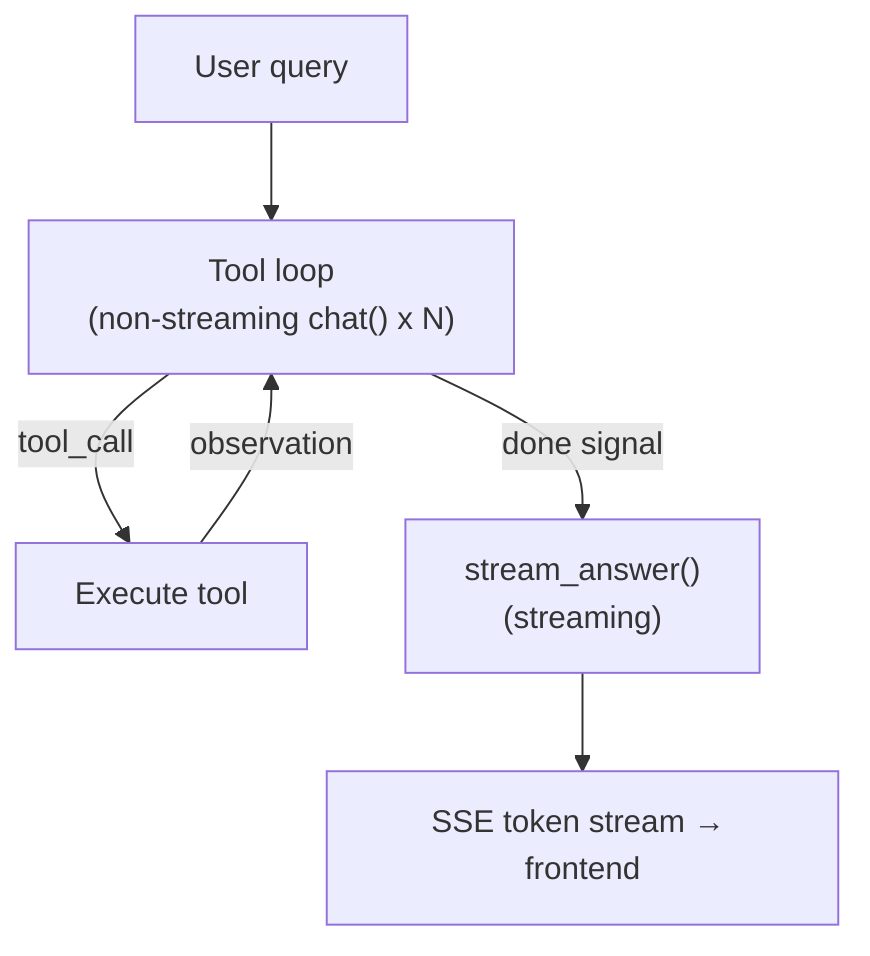
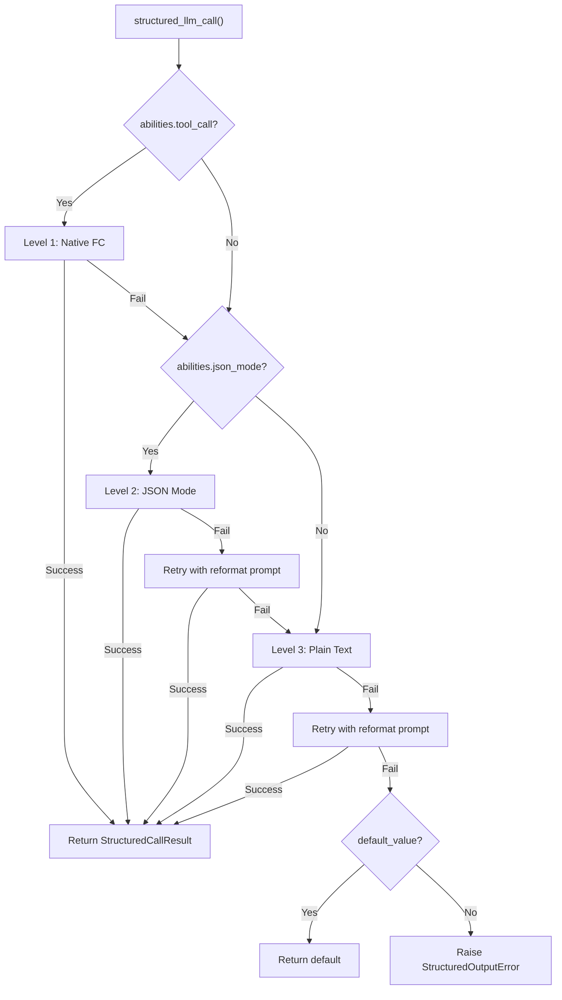
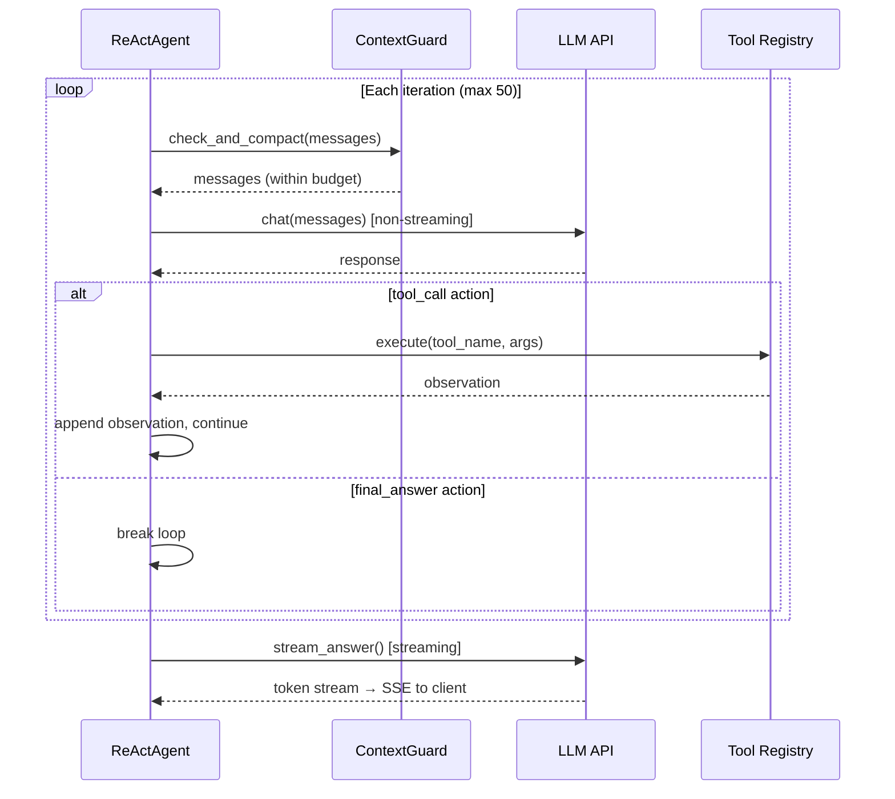
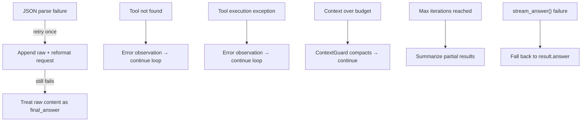
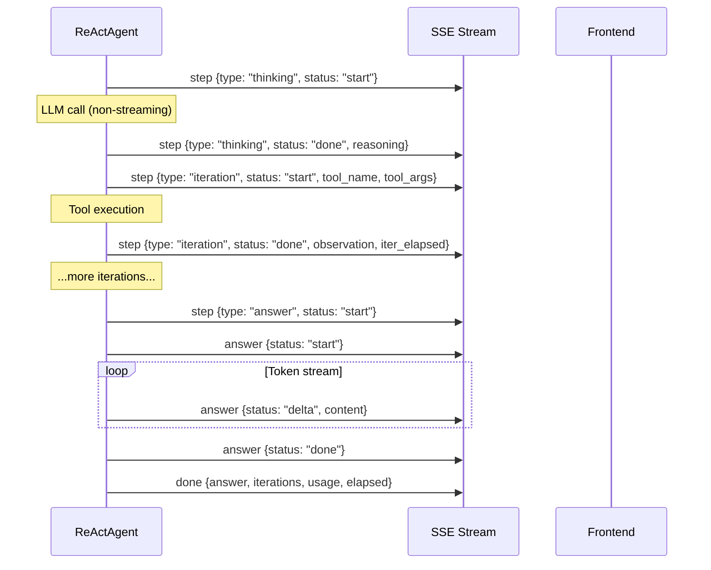

## 架构

ReAct 引擎实现了一个两阶段执行模型。第一阶段是一个迭代工具使用循环：智能体反复向 LLM 请求操作，执行任何请求的工具，追加观察结果，并继续直到 LLM 发出"完成"信号。第二阶段是答案合成：一个单独的流式 LLM 调用，读取完整的执行跟踪并生成面向用户的响应。

这种分离是有意的。工具迭代针对速度进行了优化——循环中的每个 LLM 调用都使用非流式 `chat()`，因为用户不需要看到部分 JSON 操作或中间推理令牌。答案生成针对用户体验进行了优化——它使用流式 `stream_chat()` 以便用户实时看到令牌出现。结果是两全其美：快速工具执行和响应式答案交付。

工具循环生成一个 `AgentResult`，包含完整的对话历史——系统提示、用户查询、每条助手消息、每个工具结果。`stream_answer()` 方法将这个跟踪提炼成简洁、连贯的答案。工具结果在合成上下文中被截断为 2,000 个字符，即使在复杂的多工具工作流之后也能保持提示精简。

**模型绑定。** LLM 被注入到 `ReActAgent.__init__()` 中并存储为 `self._llm`。单个 `run()` 调用中的每个调用——所有工具循环迭代和最终答案合成——都使用同一个实例。模型在迭代之间不会改变。要使用不同的模型，必须构造一个新的 `ReActAgent`。在 DAG 模式下，`DAGExecutor._resolve_agent()` 利用这个模式：它在该步骤的 ReAct 循环开始之前立即为每个步骤创建一个新的智能体（根据 `step.model_hint` 从 `ModelRegistry` 中选择模型）。详见 [DAG 引擎——按步骤覆盖](/architecture/dag-engine#two-llm-architecture)。

## 双模式执行

ReAct 引擎支持两种不同的模式来与工具循环中的 LLM 交互。

**JSON 模式** (`_run_json`) 将工具描述直接嵌入系统提示中，并指示 LLM 使用 JSON 对象进行响应——要么是带有工具名称和参数的 `tool_call` 操作，要么是 `final_answer` 信号。智能体从响应内容中解析 JSON，执行工具，并将观察结果作为用户消息追加。

**原生函数调用** (`_run_native`) 使用 LLM 提供商的内置工具调用 API。工具描述通过 `tools` 参数传递，LLM 在 API 响应中返回结构化的 `tool_calls`，而不是在其内容中发出 JSON。这是支持该功能的模型的首选模式。

模式选择是自动的。属性 `_native_mode_active` 仅在两个条件都满足时返回 `True`：智能体是使用 `use_native_tools=True`（默认值）创建的，且 LLM 公告 `abilities["tool_call"] = True`。如果任一条件不满足，引擎将回退到 JSON 模式。

| 方面 | JSON 模式 | 原生函数调用 |
|--------|-----------|------------------------|
| LLM 输出 | 消息内容中的 JSON 对象 | API 响应中的 `tool_calls` |
| 系统提示 | 在文本中嵌入完整工具描述 | 通过 `tools` 参数传递工具 |
| 并行工具调用 | 每次迭代一个工具 | 通过 `asyncio.gather` 多个 |
| 解析失败处理 | 使用重新格式化提示重试 | 不适用（由 API 结构化） |
| 循环 LLM 调用 | 非流式 `chat()` | 非流式 `chat()` |
| 最适合 | 不支持工具调用的模型 | GPT-4、Claude 等 |

两种模式共享相同的答案合成阶段——`stream_answer()` 的工作方式与工具循环的运行方式无关。

## structured_llm_call — 统一输出提取

任何需要 LLM 返回符合 JSON 模式的数据的调用点都使用 `structured_llm_call()`。这是整个框架中结构化输出的单一入口点 — DAG 规划器、计划分析器、工具选择以及任何需要从 LLM 解析 JSON 的未来组件都使用它。

该函数实现了一个 3 级降级链，根据 LLM 声称的能力按顺序尝试每个级别：

**级别 1：原生函数调用。** 使用 LLM 的 `tool_call` / `tool_choice` API 强制返回结构化响应。当 `abilities["tool_call"] = True` 时可用。如果 LLM 返回 `tool_calls`，参数直接提取。如果解析失败，则降级到下一级别。

**级别 2：JSON 模式。** 设置 `response_format={"type": "json_object"}` 以限制 LLM 的输出格式。当 `abilities["json_mode"] = True` 时可用。如果响应无法解析，使用重新格式化提示重试一次（"Your previous response could not be parsed as valid JSON..."），然后降级。

**级别 3：纯文本。** 调用 LLM 时不施加格式限制，并使用 `extract_json()` 从自由格式文本中提取 JSON。如果提取失败，则尝试可选的 `regex_fallback` 函数。在放弃之前使用重新格式化提示重试一次。

降级链意味着每个模型 — 从具有完整工具调用支持的 GPT-4 到只能生成纯文本的本地 LLM — 都可以参与结构化输出场景。最坏情况是 5 次 LLM 调用（1 次原生 + 1 次 JSON + 1 次 JSON 重试 + 1 次纯文本 + 1 次纯文本重试），但实际上大多数调用在级别 1 中一次尝试就能解决。

| 模型能力 | 路径 | 最大 LLM 调用次数 |
|---------|------|-----------------|
| tool_call + json_mode | L1 → L2 → L3 | 5 |
| 仅 json_mode | L2 → L3 | 4 |
| 仅纯文本 | L3 | 2 |

结果是一个 `StructuredCallResult`，包含解析后的值、原始字典、成功的级别以及累积的 token 使用量。调用点使用 `parse_fn` 将原始字典转换为域对象（例如 DAG 计划），使用 `default_value` 在完全失败可接受时提供回退。

`structured_llm_call` 被以下组件使用：DAG 规划器（计划模式）、计划分析器（分析模式）、工具选择（工具列表模式）以及任何需要可靠结构化输出的组件。它也在 [Planning Landscape](/architecture/planning-landscape) 中讨论。

## 工具选择

当智能体可以访问许多工具时——在 Hub 模式中很常见，其中多个连接器各自公开多个操作——将每个工具的完整架构注入到对话上下文中是浪费的。一个包含 20 个工具的连接器中心仅在工具描述中就消耗大约 5K 个令牌，挤占了对话历史和工具结果的空间。

引擎通过轻量级选择阶段来解决这个问题。当注册工具的总数超过 `TOOL_SELECTION_THRESHOLD`（12）时，智能体在进入主循环之前运行一个初步的 LLM 调用。此调用接收一个紧凑的目录——每个工具大约 80 个字符，仅包含名称和单行描述，没有参数架构——并为当前查询选择最相关的工具，最多 `_TOOL_SELECTION_MAX`（6）个。

选择使用 `structured_llm_call` 和一个简单的架构（`{"tools": ["tool_name_1", "tool_name_2"]}`），因此它受益于相同的 3 级降级。选定的工具名称用于构建一个过滤的 `ToolRegistry`，主循环将其用于系统提示构造和工具执行。

选择失败是故意设计为非致命的。如果 LLM 返回无法解析的输出、所有选定的名称都无效，或发生任何异常，智能体会回退到完整工具集。这确保了有缺陷的选择永远不会阻止智能体的运行——它只是使用比最优情况下更多的上下文。

## 迭代循环

核心循环驱动 JSON 模式和原生模式，消息处理方式略有不同。每次迭代遵循相同的高级模式：检查上下文预算、调用 LLM、处理响应，然后执行工具或中断。

**JSON 模式循环。** LLM 的响应通过 `_parse_action()` 解析，该函数使用 `extract_json()` 在内容中查找 JSON 对象。如果解析失败，智能体会附加原始响应和重新格式化请求，然后继续——这会计入 `max_iterations`，防止无限重试循环。成功时，操作要么是 `tool_call`（执行工具，将观察结果作为用户消息附加），要么是 `final_answer`（中断并进行合成）。

**原生模式循环。** LLM 的响应可能包含一个或多个 `tool_calls`。单个响应中的所有工具调用通过 `asyncio.gather` 并行执行，所有工具结果消息在任何其他消息之前附加。这个排序约束很关键——OpenAI API（及兼容提供商）要求 `tool` 消息紧跟在产生 `tool_calls` 的 `assistant` 消息之后。在它们之间插入任何其他消息（如用户中断）会破坏协议。当不存在 `tool_calls` 时，响应被视为最终答案。

**最大迭代次数。** 默认限制是 50 次迭代。如果循环在没有产生 `final_answer` 的情况下耗尽此限制，智能体会从累积的步骤结果合成一个备用响应——总结调用了哪些工具以及它们是否成功或失败。这是一个安全网，不是正常的退出路径。

[上下文管理](/architecture/context-management)解释了 ContextGuard 如何在每次迭代中强制执行令牌预算，包括告诉压缩 LLM 保留最近推理链的提示系统。

## 中期循环自我反思

长推理链（10+ 工具调用）存在**目标漂移**风险——智能体逐渐从原始目标转向局部子问题，重复类似操作，或陷入循环重试循环。中期循环自我反思是一种轻量级对策。

每隔 `_SELF_REFLECTION_INTERVAL` 个工具调用迭代（默认值：**6**），智能体向对话中注入一条用户消息，要求 LLM 暂停并反思：

- 它是否仍在朝原始目标前进？
- 它是否一直在重复类似操作或陷入循环？
- 完成任务最直接的下一步是什么？
- 现在应该生成最终答案吗？

计数器仅跟踪**实际工具调用**——JSON 解析重试、思考事件和中断注入不计入。在原生模式下，反思消息严格附加在所有 `tool_result` 消息之后，以保持 tool_use/tool_result 配对约束。

这每次注入消耗约 100 个令牌（无额外 LLM 调用），对短运行（`< 6` 个工具调用）无影响。它通过解决不同的失败模式来补充 ContextGuard（管理令牌预算）和逐步验证（验证单个结果）：智能体在多次迭代中失去对目标的关注。

## 答案合成 (stream_answer)

工具循环和答案合成之间的分离是一个核心架构决策。工具迭代产生原始数据 — JSON 操作、工具观察、错误消息。用户需要一个连贯、格式良好的答案，而不是智能体内部跟踪的转储。

`stream_answer()` 从两个组件构建合成提示。系统提示指示 LLM 充当合成器：直接呈现结果、使用 markdown 格式、避免元注释（"基于工具输出..."），并匹配原始查询的语言。用户消息包含原始问题和格式化的执行跟踪 — 每个工具调用及其结果，工具结果截断为 2,000 个字符。

合成调用使用 `stream_chat()`，逐步产生令牌。web 层将这些令牌包装在 SSE `answer` 事件中，带有 `delta` 状态，以便前端可以在它们到达时呈现它们。

如果 `stream_answer()` 失败 — 网络错误、LLM 超时、任何异常 — web 层回退到 `result.answer`，工具循环最后一次迭代中的简短文本。这是一个降级的体验（无流式传输、可能不太精致的散文），但它确保用户始终获得响应。

## 中断处理

用户可以在智能体仍在处理时发送后续消息。这些消息通过 `interrupt_queue` 传递——一个按对话注册的 `InterruptQueue`，在迭代之间累积消息。

由于工具调用排序约束，不同模式下的队列排空时机不同：

- **JSON 模式**：队列在每条助手消息之后立即排空，在检查操作是否为 `final_answer` 之前。这是安全的，因为 JSON 模式使用普通的用户/助手消息，没有结构配对要求。

- **Native FC 模式**：队列仅在工具结果消息被追加后排空。`tool` 消息必须紧跟在包含 `tool_calls` 的 `assistant` 消息之后——在它们之间插入用户消息会违反 API 协议并导致错误。

注入的消息被标记为 `pinned=True`，确保它们在 ContextGuard 的任何后续压缩中存活。参见[固定消息](/architecture/context-management#pinned-messages)了解固定机制如何防止压缩丢弃关键消息。

当 `final_answer` 待处理但已有注入消息到达时，智能体会抑制最终答案并继续循环，以便处理用户的后续消息。来自同一次排空的多个注入被合并为单个 `[USER INTERRUPT]` 消息——这防止 LLM 看到碎片化的短消息序列，并鼓励它整体处理所有后续消息。

## 错误处理和回退

引擎设计为在 LLM 或工具失败时永不崩溃。每条错误路径要么静默恢复，要么向用户显示有用的消息。

**JSON 解析失败。** 当 LLM 在 JSON 模式下返回非 JSON 内容时，`_parse_action()` 将其包装为 `final_answer`，推理内容为 `"(could not parse LLM output as JSON)"`。循环检测到这个哨兵值，追加原始内容和重新格式化指令，然后继续。如果重试也失败，原始内容就成为答案——虽然不完美，但不会导致崩溃。

**工具错误。** "工具未找到"和"工具执行异常"都会产生错误观察，这些观察被追加到对话中。LLM 在下一次迭代时看到错误，可以决定是否使用不同的参数重试或继续进行。这使得智能体对于临时工具失败具有自我修复能力。

**扩展思考。** DeepSeek R1 等模型在单独的 `reasoning_content` 字段中返回推理内容，而不是在 JSON 正文中。引擎检查这一点，并在 JSON `reasoning` 字段为空时将其用作回退。

**富文本内容。** 当工具生成 HTML 或 markdown 工件时，发送给 LLM 的观察被替换为简短摘要（`"[Artifact generated: filename] The content is rendered as a preview in the UI..."`）。这可以防止 LLM 在最终答案中回显大型 HTML 块——这是一种常见的失败模式，其中模型会有帮助地粘贴回整个工具输出。

## SSE 事件协议

Web 层将智能体的迭代回调转换为服务器发送事件（Server-Sent Events）供前端使用。事件在两个 SSE 通道上发出：`step` 用于工具循环，`answer` 用于合成阶段。

| 事件 | 通道 | 负载 | 触发时机 |
|-------|---------|---------|------|
| 思考开始 | `step` | `{type: "thinking", status: "start", iteration}` | 每次 LLM 调用前 |
| 思考完成 | `step` | `{type: "thinking", status: "done", iteration, reasoning}` | LLM 响应后，工具执行前 |
| 迭代开始 | `step` | `{type: "iteration", status: "start", iteration, tool_name, tool_args}` | 工具执行开始 |
| 迭代完成 | `step` | `{type: "iteration", status: "done", iteration, tool_name, observation, error, iter_elapsed}` | 工具执行完成 |
| 答案信号 | `step` | `{type: "answer", status: "start"}` | 智能体发出 final_answer 信号 |
| 答案开始 | `answer` | `{status: "start"}` | 合成流开始 |
| 答案增量 | `answer` | `{status: "delta", content}` | 每个流式令牌 |
| 答案完成 | `answer` | `{status: "done"}` | 合成流完成 |
| 压缩 | `compact` | `{original_messages, kept_messages}` | 加载时压缩了上下文 |
| 阶段 | `phase` | `{phase: "selecting_tools", total_tools}` | 工具选择阶段活跃 |
| 注入 | `inject` | `{type: "inject", content}` | 收到用户中断 |
| 完成 | `done` | `{answer, iterations, usage, elapsed}` | 最终结果负载 |

前端使用 `step` 事件渲染可折叠的工具调用卡片（显示正在运行的工具、其参数和观察结果），使用 `answer` 增量流式传输响应文本，使用 `compact` 显示上下文摘要分隔符。`done` 事件携带完整的元数据——总迭代次数、令牌使用情况和经过的时间——用于响应页脚。
