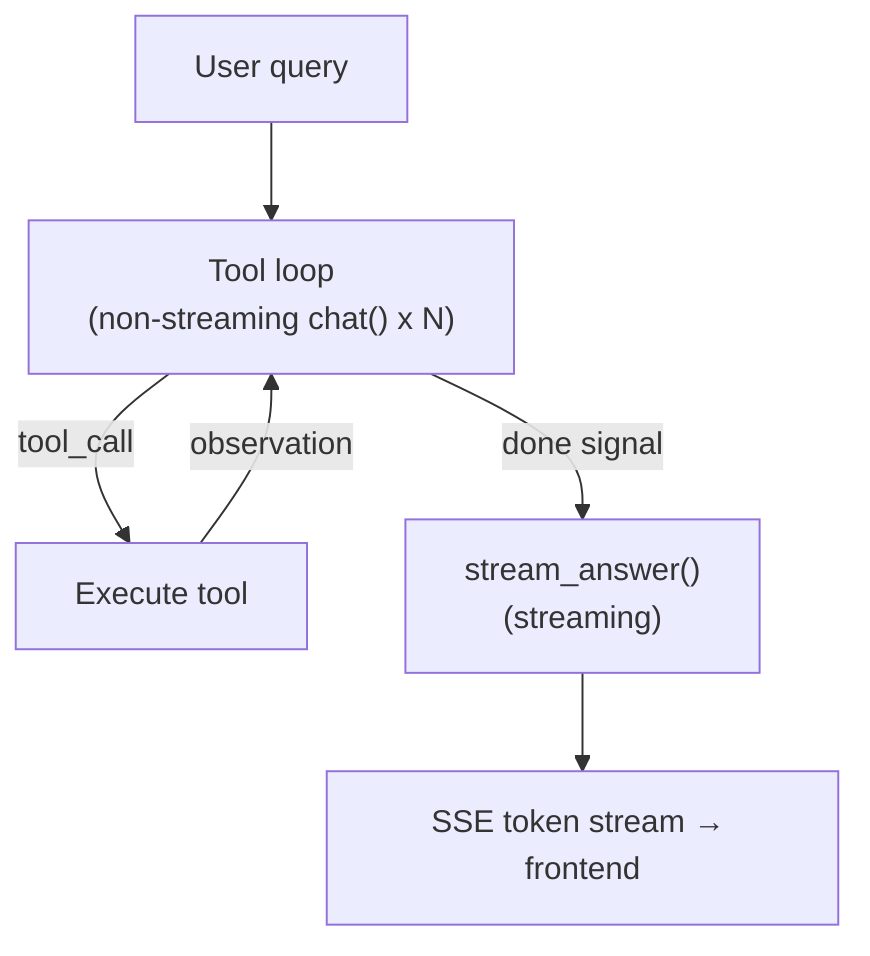
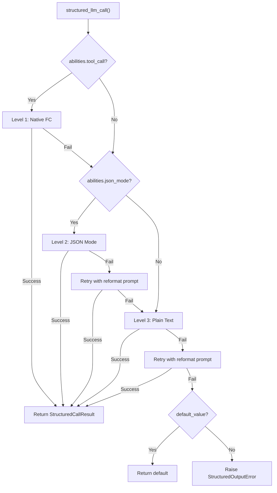
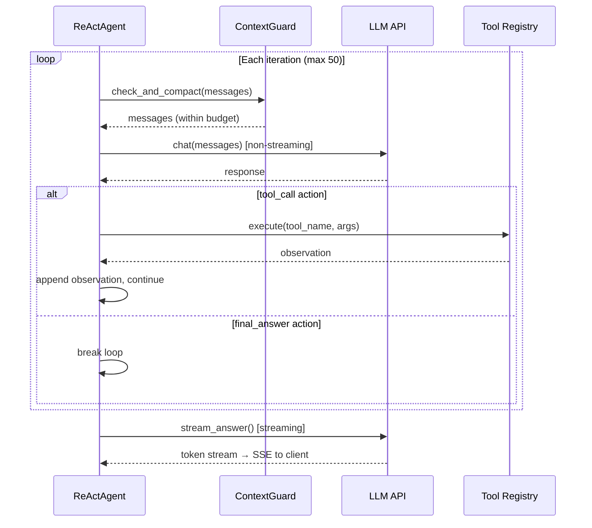
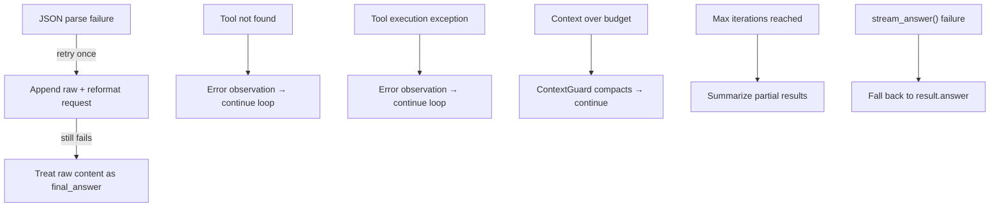
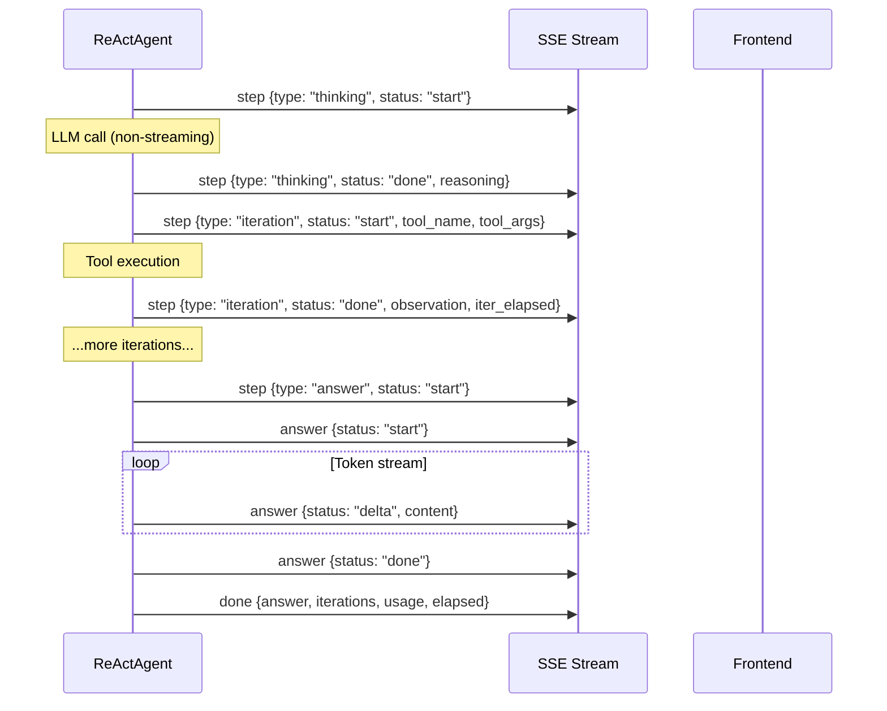

## 整体架构

ReAct 引擎采用两阶段执行模型。第一阶段是迭代式工具调用循环：智能体反复请求 LLM 给出下一步动作，执行被请求的工具，追加观测结果，循环往复直到 LLM 发出"完成"信号。第二阶段是答案合成：一次独立的流式 LLM 调用，读取完整的执行轨迹并生成面向用户的回答。

这种拆分是刻意为之的。工具迭代针对速度优化——循环中的每次 LLM 调用都使用非流式 `chat()`，因为用户不需要看到部分 JSON 动作或中间推理 token。答案生成针对用户体验优化——使用流式 `stream_chat()`，让用户实时看到 token 逐步出现。最终效果是两全其美：工具执行快速高效，答案呈现响应流畅。

工具循环产生一个 `AgentResult`，包含完整的对话历史——系统提示词、用户查询、每条 assistant 消息、每个工具返回结果。`stream_answer()` 方法将这个执行轨迹提炼为简洁连贯的答案。合成上下文中，每个工具结果被截断到 2,000 字符，即使经历了复杂的多工具流程，提示词也保持精简。

**模型绑定。** LLM 在 `ReActAgent.__init__()` 时注入并存储为 `self._llm`。单次 `run()` 调用内的所有操作——工具循环的每轮迭代和最终答案合成——都使用这同一个实例。迭代之间模型不会切换。如需使用不同的模型，必须构造一个新的 `ReActAgent`。在 DAG 模式中，`DAGExecutor._resolve_agent()` 正是利用了这一模式：在每个 Step 的 ReAct 循环开始**之前**，根据 `step.model_hint` 从 `ModelRegistry` 中选取对应模型并创建一个全新的智能体。详见 [DAG 引擎 — 每步覆盖](/zh/architecture/dag-engine#双-llm-架构)。

## 双模式执行

ReAct 引擎在工具循环中支持两种与 LLM 交互的模式。

**JSON Mode**（`_run_json`）将工具描述直接嵌入系统提示词，指示 LLM 以 JSON 对象响应——要么是包含工具名称和参数的 `tool_call` 动作，要么是 `final_answer` 完成信号。智能体从响应内容中解析 JSON，执行工具，并将观测结果作为用户消息追加。

**Native Function Calling**（`_run_native`）使用 LLM 提供商内置的工具调用 API。工具描述通过 `tools` 参数传递，LLM 在 API 响应中返回结构化的 `tool_calls`，而非在内容中输出 JSON。对于支持此功能的模型，这是首选模式。

模式选择是自动的。属性 `_native_mode_active` 仅在两个条件同时满足时返回 `True`：智能体创建时设置了 `use_native_tools=True`（默认值），且 LLM 声明 `abilities["tool_call"] = True`。任一条件不满足，引擎就回退到 JSON Mode。

| 维度 | JSON Mode | Native Function Calling |
|------|-----------|------------------------|
| LLM 输出 | 消息内容中的 JSON 对象 | API 响应中的 `tool_calls` |
| 系统提示词 | 将完整工具描述嵌入文本 | 工具通过 `tools` 参数传递 |
| 并行工具调用 | 每次迭代一个工具 | 通过 `asyncio.gather` 支持多个 |
| 解析失败处理 | 用重格式化提示重试 | 不适用（API 保证结构化） |
| 循环 LLM 调用 | 非流式 `chat()` | 非流式 `chat()` |
| 适用场景 | 不支持工具调用的模型 | GPT-4、Claude 等 |

两种模式共享相同的答案合成阶段——无论工具循环以何种方式运行，`stream_answer()` 的行为完全一致。

## structured_llm_call — 统一输出提取

任何需要 LLM 返回符合 JSON schema 数据的调用点，都使用 `structured_llm_call()`。它是整个框架中结构化输出的唯一入口——DAG 规划器、计划分析器、工具选择，以及任何未来需要从 LLM 获取解析后 JSON 的组件，都通过它来完成。

该函数实现了一个 3 级降级链，根据 LLM 声明的能力依次尝试每个级别：

**Level 1: Native Function Calling。** 使用 LLM 的 `tool_call` / `tool_choice` API 强制获取结构化响应。当 `abilities["tool_call"] = True` 时可用。如果 LLM 返回 `tool_calls`，直接提取参数。如果解析失败，降级到下一层。

**Level 2: JSON Mode。** 设置 `response_format={"type": "json_object"}` 约束 LLM 的输出格式。当 `abilities["json_mode"] = True` 时可用。如果响应无法解析，用重格式化提示（"Your previous response could not be parsed as valid JSON..."）重试一次，然后降级。

**Level 3: Plain Text。** 不带格式约束调用 LLM，通过 `extract_json()` 从自由文本中提取 JSON。如果提取失败，尝试可选的 `regex_fallback` 函数。用重格式化提示重试一次后放弃。

降级链意味着每个模型——从具备完整工具调用支持的 GPT-4 到只能产出纯文本的本地 LLM——都能参与结构化输出场景。最坏情况需要 5 次 LLM 调用（1 次 native + 1 次 JSON + 1 次 JSON 重试 + 1 次 plain + 1 次 plain 重试），但实际中大多数调用在 Level 1 一次就解决了。

| 模型能力 | 执行路径 | 最大 LLM 调用次数 |
|---------|---------|-----------------|
| tool_call + json_mode | L1 → L2 → L3 | 5 |
| 仅 json_mode | L2 → L3 | 4 |
| 仅纯文本 | L3 | 2 |

返回结果是一个 `StructuredCallResult`，包含解析后的值、原始字典、成功的级别以及累计 token 用量。调用方通过 `parse_fn` 将原始字典转换为领域对象（如 DAG 计划），通过 `default_value` 在完全失败可接受时提供兜底值。

`structured_llm_call` 的使用者包括：DAG 规划器（计划 schema）、计划分析器（分析 schema）、工具选择（工具列表 schema），以及任何需要可靠结构化输出的组件。相关内容也在 [规划全景](/zh/architecture/planning-landscape) 中有讨论。

## 工具选择

当智能体可以访问大量工具时——这在 Hub 模式下很常见，多个连接器各自暴露若干动作——将每个工具的完整 schema 注入对话上下文是浪费的。一个拥有 20 个工具的连接器 Hub 仅工具描述就消耗约 5K token，严重挤占对话历史和工具结果的空间。

引擎通过轻量级选择阶段来解决这个问题。当注册工具总数超过 `TOOL_SELECTION_THRESHOLD`（12）时，智能体在进入主循环前先执行一次预选 LLM 调用。这次调用接收一份精简目录——每个工具约 80 字符，仅包含名称和一行描述，不含参数 schema——然后针对当前查询挑选最相关的工具，上限为 `_TOOL_SELECTION_MAX`（6）个。

选择过程使用 `structured_llm_call`，schema 很简单（`{"tools": ["tool_name_1", "tool_name_2"]}`），因此同样受益于 3 级降级链。选中的工具名用于构建过滤后的 `ToolRegistry`，主循环用它来构造系统提示词和执行工具。

选择失败被设计为非致命的。如果 LLM 返回无法解析的输出、所有选中的名称都无效，或发生任何异常，智能体会回退到完整工具集。这确保了有缺陷的选择永远不会阻止智能体正常运行——只是上下文占用会多于最优情况。

## 迭代循环

核心循环同时驱动 JSON Mode 和 Native Mode，在消息处理上有细微差异。每次迭代遵循相同的高层模式：检查上下文预算、调用 LLM、处理响应、执行工具或跳出循环。

**JSON Mode 循环。** LLM 的响应通过 `_parse_action()` 解析，该方法使用 `extract_json()` 从内容中查找 JSON 对象。如果解析失败，智能体追加原始响应和重格式化请求，然后继续——这会计入 `max_iterations`，防止无限重试循环。解析成功后，动作要么是 `tool_call`（执行工具，将观测结果作为用户消息追加），要么是 `final_answer`（跳出循环进入合成阶段）。

**Native Mode 循环。** LLM 的响应可能包含一个或多个 `tool_calls`。单次响应中的所有工具调用通过 `asyncio.gather` 并行执行，所有工具结果消息在任何其他消息之前追加。这个顺序约束至关重要——OpenAI API（及兼容提供商）要求 `tool` 消息紧跟在产生 `tool_calls` 的 `assistant` 消息之后。在它们之间插入任何其他消息（如用户中断）都会破坏协议。当没有 `tool_calls` 时，响应被视为最终答案。

**最大迭代次数。** 默认上限为 50 次迭代。如果循环耗尽此限制仍未产生 `final_answer`，智能体会从累积的步骤结果中合成一个兜底响应——总结调用了哪些工具、是否成功或失败。这是一个安全网，不是正常退出路径。

[上下文管理](/zh/architecture/context-management) 详细说明了 ContextGuard 如何在每轮迭代中执行 token 预算，包括告诉压缩 LLM 保留最近推理链的提示系统。

## 答案合成（stream_answer）

工具循环与答案合成的分离是一个核心架构决策。工具迭代产出原始数据——JSON 动作、工具观测结果、错误消息。用户需要的是连贯、格式良好的答案，而不是智能体内部轨迹的转储。

`stream_answer()` 从两部分构建合成提示词。系统提示词指示 LLM 充当合成器：直接呈现结果，使用 markdown 格式，避免元评论（"根据工具输出..."），并匹配原始查询的语言。用户消息包含原始问题和格式化的执行轨迹——每次工具调用及其结果，工具结果截断到 2,000 字符。

合成调用使用 `stream_chat()`，增量输出 token。Web 层将这些 token 包装为带 `delta` 状态的 SSE `answer` 事件，前端可以在 token 到达时即时渲染。

如果 `stream_answer()` 失败——网络错误、LLM 超时或任何异常——Web 层会回退到 `result.answer`，即工具循环最后一次迭代的简短文本。这是降级体验（无流式，文字可能不够精炼），但确保用户始终能获得响应。

## 中断处理

用户可以在智能体仍在处理时发送后续消息。这些消息通过 `interrupt_queue` 送达——每个对话注册一个 `InterruptQueue`，在迭代之间累积消息。

排空时机因模式不同而异，原因在于工具调用的顺序约束：

- **JSON Mode**：队列在每条 assistant 消息之后立即排空，在检查动作是否为 `final_answer` 之前。这是安全的，因为 JSON Mode 使用普通的 user/assistant 消息，没有结构配对要求。

- **Native FC Mode**：队列仅在工具结果消息追加之后排空。`tool` 消息必须紧跟包含 `tool_calls` 的 `assistant` 消息——在它们之间插入用户消息会违反 API 协议并导致错误。

注入的消息被标记为 `pinned=True`，确保它们在 ContextGuard 后续的任何压缩中存活。关于固定机制如何防止压缩丢弃关键消息，请参阅 [固定消息](/zh/architecture/context-management#pinned-messages)。

当 `final_answer` 已就绪但有注入消息到达时，智能体会压制最终答案并继续循环，以便处理用户的后续消息。同一次排空中的多条注入消息被合并为一条 `[USER INTERRUPT]` 消息——这防止 LLM 看到一系列碎片化的短消息，并鼓励它整体性地回应所有后续问题。

## 错误处理与降级

引擎的设计目标是永远不因 LLM 或工具故障而崩溃。每个错误路径要么静默恢复，要么向用户呈现有用的信息。

**JSON 解析失败。** 当 LLM 在 JSON Mode 下返回非 JSON 内容时，`_parse_action()` 将其包装为带有推理内容 `"(could not parse LLM output as JSON)"` 的 `final_answer`。循环检测到这个标记，追加原始内容和重格式化指令，然后继续。如果重试也失败，原始内容直接作为答案——不完美，但不会崩溃。

**工具错误。** "工具未找到"和"工具执行异常"都会产生错误观测结果并追加到对话中。LLM 在下一轮迭代中看到错误，可以决定用不同参数重试或放弃该工具。这使智能体对瞬时工具故障具有自愈能力。

**扩展思维。** DeepSeek R1 等模型将推理内容返回在单独的 `reasoning_content` 字段中，而非 JSON 体中。引擎会检查此字段，并在 JSON `reasoning` 字段为空时将其用作兜底。

**富内容。** 当工具产出 HTML 或 markdown 制品时，发送给 LLM 的观测结果被替换为简短摘要（`"[Artifact generated: filename] The content is rendered as a preview in the UI..."`）。这防止 LLM 在最终答案中回显大段 HTML——一种常见的失败模式，模型会"好心地"将整个工具输出原样粘贴回来。

## SSE 事件协议

Web 层将智能体的迭代回调转换为发送给前端的 Server-Sent Events。事件通过两个 SSE 通道发出：`step` 用于工具循环，`answer` 用于合成阶段。

| 事件 | 通道 | 载荷 | 触发时机 |
|------|------|------|---------|
| Thinking 开始 | `step` | `{type: "thinking", status: "start", iteration}` | 每次 LLM 调用之前 |
| Thinking 完成 | `step` | `{type: "thinking", status: "done", iteration, reasoning}` | LLM 响应后、工具执行前 |
| Iteration 开始 | `step` | `{type: "iteration", status: "start", iteration, tool_name, tool_args}` | 工具执行开始 |
| Iteration 完成 | `step` | `{type: "iteration", status: "done", iteration, tool_name, observation, error, iter_elapsed}` | 工具执行完成 |
| Answer 信号 | `step` | `{type: "answer", status: "start"}` | 智能体发出 final_answer 信号 |
| Answer 开始 | `answer` | `{status: "start"}` | 合成流式开始 |
| Answer 增量 | `answer` | `{status: "delta", content}` | 每个流式 token |
| Answer 完成 | `answer` | `{status: "done"}` | 合成流式结束 |
| Compact | `compact` | `{original_messages, kept_messages}` | 加载时上下文已压缩 |
| Phase | `phase` | `{phase: "selecting_tools", total_tools}` | 工具选择阶段激活 |
| Inject | `inject` | `{type: "inject", content}` | 收到用户中断消息 |
| Done | `done` | `{answer, iterations, usage, elapsed}` | 最终结果载荷 |

前端使用 `step` 事件渲染可折叠的工具调用卡片（显示正在运行的工具、参数和观测结果），使用 `answer` 增量流式渲染响应文本，使用 `compact` 显示上下文摘要分隔线。`done` 事件携带完整的元数据——总迭代次数、token 用量和耗时——用于响应页脚展示。
