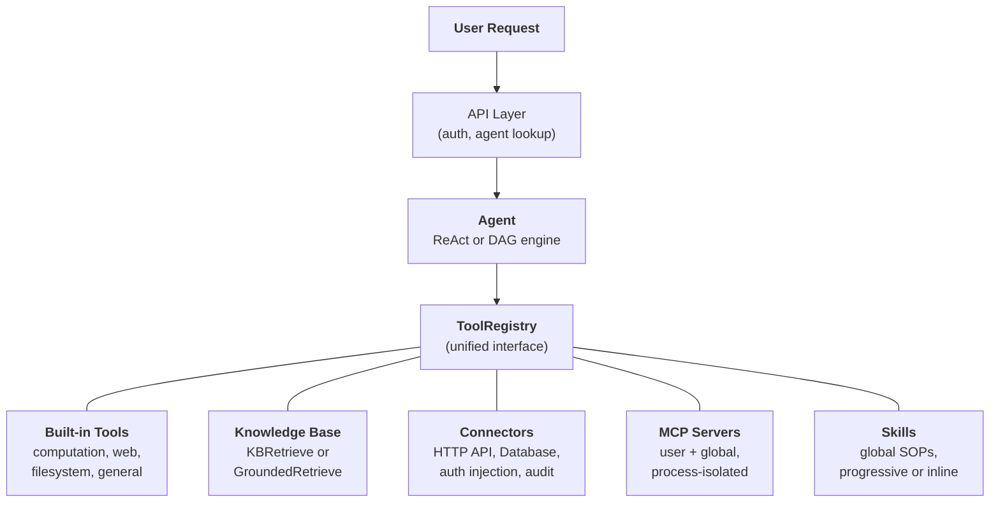
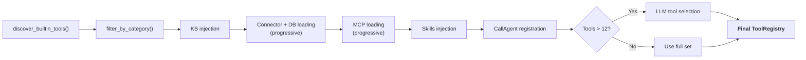

## 统一工具抽象

FIM One 的核心设计理念是**智能体能做的一切都是工具**。计算器、知识库查询、ERP API 调用和第三方 MCP 服务器都实现相同的 `Tool` 协议：`name`、`description`、`parameters_schema`、`category` 和 `run()`。智能体不知道也不关心它是在调用本地 Python 函数、查询向量数据库、代理到遗留系统还是调用社区 MCP 服务器。它看到的是 `ToolRegistry` 中的一个平面工具列表。

这是一个深思熟虑的架构选择，而不是偶然的简化。这意味着添加新的能力来源永远不需要改变智能体、执行引擎或上下文管理层。你注册工具；智能体使用它们。

五个能力来源汇聚到一个注册表中。智能体平等地从所有来源中获取。

## 五个能力来源

### 内置工具

在启动时通过 `discover_builtin_tools()` 自动发现。将 `BaseTool` 子类放入 `core/tool/builtin/`，它会在没有任何配置的情况下自动注册。类别包括计算（`calculator`、`python_exec`）、网络（`web_search`、`web_fetch`）、文件系统（`file_ops`）和通用（`email_send`、`json_transform`、`template_render`、`text_utils`）。这些是智能体的原生能力——始终可用，零配置。

### 知识库

条件性。当智能体绑定了 `kb_ids` 时，通用的 `kb_retrieve` 工具会被替换为专门的检索工具。在**简单模式**下，`KBRetrieveTool` 执行基本的 RAG 检索。在**接地模式**下，`GroundedRetrieveTool` 运行一个 5 阶段的管道：多知识库检索、引用提取、对齐评分、冲突检测和置信度计算。知识库不是一个独立的子系统，而是作为专门的工具进入智能体——它受到与其他所有工具相同的 `Tool` 协议的约束。

### 连接器

`ConnectorToolAdapter` 将企业系统操作包装为工具。每个操作都成为一个名为 `{connector}__{action}` 的工具，分类为 `connector`。该适配器添加了带有身份验证注入的 HTTP 代理（bearer、API 密钥、基本身份验证）、操作级访问控制（读/写/管理员）、响应截断和审计日志。对于直接数据库访问，`DatabaseToolAdapter` 提供了具有可选只读强制的架构感知 SQL 执行。连接器是 AI 和遗留系统之间的桥梁 -- 核心差异化因素。有关完整设计，请参阅 [连接器架构](/architecture/connector-architecture)。

### MCP

外部 MCP 服务器通过标准协议提供第三方工具。每个服务器在自己的进程中运行（stdio 或 HTTP 传输），完全与平台隔离。工具被适配到 `Tool` 协议中，并在 `mcp` 类别下注册。管理员可以配置**全局 MCP 服务器**，自动为所有用户加载。MCP 是生态系统的关键——任何兼容 MCP 的服务器都可以无需自定义集成而工作。

### 技能

技能是可复用的标准操作程序 (SOP) -- 公司政策、处理流程、分步工作流 -- 全局应用，与选择的智能体无关。与连接器和知识库不同（可以限定到特定智能体），技能始终根据可见性（个人、组织共享或市场订阅）为每个用户加载。

技能支持两种注入模式 -- **渐进式**（默认）和**内联式** -- 由 `SKILL_TOOL_MODE` 控制。在渐进式模式下，紧凑的存根出现在系统提示中，LLM 按需调用 `read_skill(name)`。这是更广泛的[渐进式披露](/architecture/progressive-disclosure)架构的一部分，该架构在技能、连接器、数据库和 MCP 服务器中应用相同的存根优先、按需详情的模式。

要深入了解为什么技能是全局的（不与智能体绑定）以及它们如何与双模式资源发现交互，请参阅[智能体和资源发现](/architecture/agent-discovery)。

## 按请求进行工具组装

每个聊天请求都通过 `_resolve_tools()` 中的过滤管道组装一个新鲜的工具集。这不是静态配置——它是根据智能体的设置、用户的身份以及可用的连接器和 MCP 服务器按请求计算的。

八个步骤：

1. **基础发现。** `discover_builtin_tools()` 加载所有内置工具，范围限定在对话的沙箱内。
2. **智能体类别过滤。** `filter_by_category(*agent.tool_categories)` 限制为仅智能体被允许使用的类别。
3. **知识库注入。** 如果智能体有 `kb_ids`，通用检索工具将被替换为 `KBRetrieveTool` 或 `GroundedRetrieveTool`，具体取决于检索模式。
4. **连接器加载。** 在智能体约束模式下，仅加载智能体绑定的连接器。在自动发现模式下（未选择智能体），加载用户可见的所有连接器。API 连接器（`ConnectorMetaTool`）和数据库连接器（`DatabaseMetaTool`）默认使用[渐进式披露](/architecture/progressive-disclosure)——系统提示中的轻量级存根，按需加载完整模式。
5. **MCP 加载。** 加载用户的个人 MCP 服务器以及管理员配置的全局 MCP 服务器并进行连接。在渐进模式（默认）下，单个 `MCPServerMetaTool` 整合所有服务器；LLM 按需调用 `discover` 和 `call` 子命令。参见[渐进式披露](/architecture/progressive-disclosure)。
6. **技能注入。** 加载用户可见的所有活跃技能——无论是否选择了智能体。在渐进模式下，`ReadSkillTool` 在系统提示中注册为紧凑存根。在内联模式下，完整的技能内容直接嵌入。
7. **CallAgent 注册。** 所有活跃的、可见的智能体被组装成一个目录并通过 `CallAgentTool` 公开，使 LLM 能够将任务委派给专家子智能体。子智能体接收从其自身配置构建的完整 `ToolRegistry`，但排除 `call_agent` 以防止无限递归。
8. **运行时选择。** 如果工具总数超过 12 个，一个轻量级 LLM 调用为此特定查询选择最相关的子集（最多 6 个）。`request_tools` 元工具会自动注册，允许 LLM 在对话中动态加载额外工具，如果初始选择遗漏了所需工具。选择失败是非致命的——智能体回退到完整集合。参见[渐进式披露](/architecture/progressive-disclosure)。

结果：智能体看到的正好是它需要的工具，不多不少。一个没有连接器和知识库的简单智能体可能看到 5 个工具。一个连接到 3 个企业系统、具有基础知识库和 2 个 MCP 服务器的 Hub 智能体可能看到 30 个——但经过选择后，只有 6 个最相关的进入上下文。

## 何时使用什么

| 需求 | 使用 | 原因 |
|------|-----|-----|
| 通用计算、代码执行、文本转换 | 内置工具 | 始终可用，无需配置 |
| 企业系统集成（ERP、CRM、OA） | 连接器 | 身份验证治理、审计跟踪、操作级访问控制 |
| 带引用和证据的知识检索 | 知识库 | RAG 管道、有根据的生成、置信度评分 |
| 第三方工具生态系统 | MCP | 标准协议、流程隔离、社区服务器 |
| 组织政策、SOP、处理流程 | 技能 | 默认全局、渐进式加载、可见性范围 |
| 委派任务给专家智能体 | 调用智能体 | 语义智能体路由、完整工具继承、并行执行 |
| 直接数据库访问 | 数据库连接器 | 模式感知 SQL、可选的只读强制执行 |
| 自定义内部工具 | MCP 或内置 | MCP 用于流程隔离；内置用于紧密集成 |

这些类别不是互斥的。单个智能体可以在一次对话中使用所有五个能力来源——加载用于投诉处理 SOP 的技能、查询知识库获取政策文档、调用连接器检查 ERP、委派分析给专家子智能体，以及使用内置工具格式化结果。

## 执行引擎是正交的

工具系统和执行引擎是独立的关注点。由LLM驱动的引擎（ReAct和DAG）从同一个`ToolRegistry`消费工具。引擎的选择影响工具如何被编排，而不是哪些工具可用。

**ReAct** 是一个迭代工具循环。智能体进行推理，选择一个工具，观察结果，然后重复直到完成。它擅长探索性、对话性任务，其中下一步取决于前一步的结果。循环运行最多50次迭代，通过ContextGuard进行每次迭代的上下文管理。详见 [ReAct Engine](/architecture/react-engine)。

**DAG** 将目标分解为2-6个并行步骤。每个步骤运行一个独立的ReAct智能体。PlanAnalyzer评估目标是否已实现；如果未实现，管道会自主重新规划（最多3轮）。DAG擅长具有明确子任务且可以并发运行的任务——"搜索三个来源并比较结果"在一次搜索的时间内完成，而不是三次。详见 [DAG Engine](/architecture/dag-engine)。

两个引擎共享基础设施：`structured_llm_call`用于可靠的结构化输出，`ContextGuard`用于令牌预算强制执行，以及`ToolRegistry`用于工具解析。添加新工具不需要对任何引擎进行更改。添加新引擎（如果需要的话）不需要对工具系统进行任何更改。

两个引擎也支持通过`CallAgentTool`进行**多智能体委派**。在原生函数调用模式下，LLM可以在单个回合中调用多个`call_agent`调用，这些调用通过`asyncio.gather`并发执行。每个子智能体接收自己的`ToolRegistry`并作为完整的执行单元运行。关于智能体发现、Skills作为全局SOP以及多智能体编排的详细设计，详见 [Agent & Resource Discovery](/architecture/agent-discovery)。

### 工作流引擎 — 第三范式

除了 LLM 驱动的 ReAct 和 DAG 引擎外，FIM One 还包括**工作流引擎** — 一个可视化 DAG 编辑器，拥有 26 种节点类型，用于固定流程自动化（审批链、定时 ETL、多步骤管道）。工作流可以调用智能体、连接器、知识库、MCP 服务器、LLM 调用、HTTP 请求、Python 代码和人工审批门。这种关系是不对称的：工作流可以编排智能体（通过 AGENT 节点），但智能体无法直接调用工作流。将智能体用于灵活的探索性任务；将工作流用于确定性的可重复流程。详见 [执行模式](/concepts/execution-modes)。

## 生命周期概览

**启动。** `start.sh` 运行 Alembic 迁移，启动 FastAPI 服务器，发现内置工具，并为任何预配置的全局服务器建立 MCP 服务器连接。

**按请求。** JWT 身份验证、智能体配置查找、工具组装（上述 8 步管道）、引擎选择（基于智能体配置的 ReAct 或 DAG）、SSE 流式执行以及结果持久化。

**横切关注点。** [上下文管理](/architecture/context-management)（5 层令牌预算）保护每个 LLM 调用免于溢出。审计日志跟踪每个连接器工具调用。沙箱隔离包含代码执行工具。双 LLM 架构（智能 + 快速）优化规划、执行和合成的成本。

该架构的设计使得每个关注点——工具注册、执行编排、上下文管理、安全性——都可以独立演进。新的连接器类型、新的执行引擎或新的上下文策略可以添加而不会在系统中产生级联变化。
