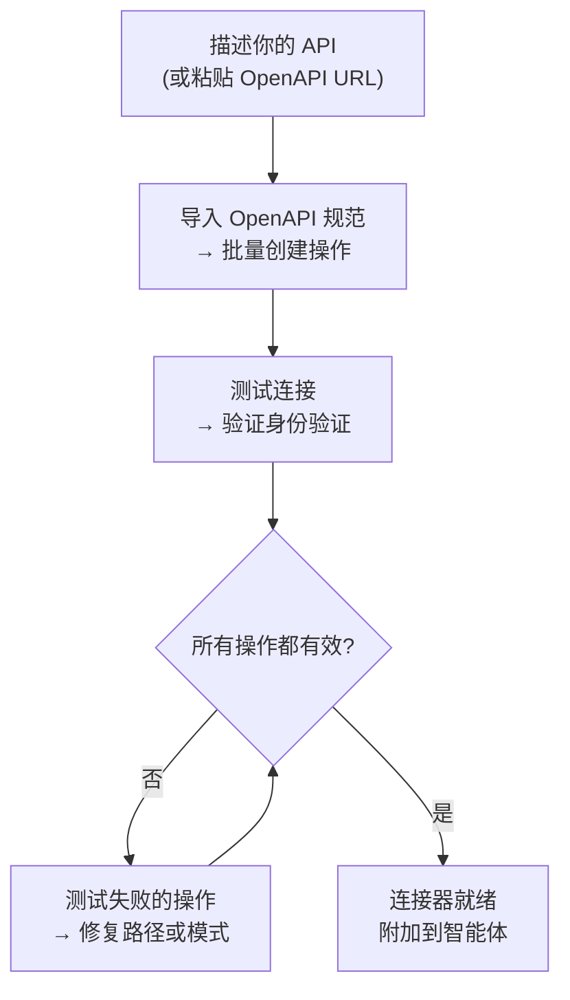
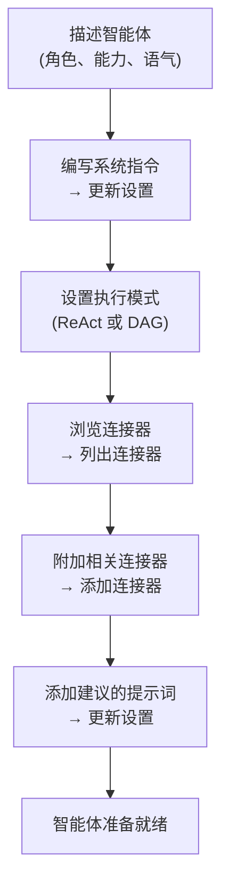

## 概述

AI Builder 让你用自然语言描述需求，由 AI 智能体为你配置。它有两种模式：

| 模式 | 工作原理 | 最适用于 |
|------|-------------|---------|
| **快速建议** | 单次 LLM 调用生成配置 | 快速初稿、简单 API |
| **高级构建器** | ReAct 智能体循环使用工具来构建、测试和优化 | 复杂 API、OpenAPI 导入、迭代优化 |

你可以随时在两种模式之间切换。快速模式创建起点；高级构建器让你进行迭代。

---

## 连接器构建器

**连接器**定义了 FIM One 如何与外部系统通信——其基础 URL、身份验证和它公开的特定 API 操作。连接器构建器为 AI 智能体提供了 9 个工具来代表您构建和管理此配置。

### 工具

| 工具 | 功能说明 |
|------|-------------|
| **获取设置** | 读取当前连接器配置（URL、身份验证类型、身份验证配置） |
| **更新设置** | 更改连接器名称、基础 URL 或身份验证凭证 |
| **列出操作** | 查看所有现有 API 操作及其方法和路径 |
| **创建操作** | 添加新的 API 端点 — HTTP 方法、路径、参数、请求体模板 |
| **更新操作** | 修改现有操作（描述、架构、响应提取） |
| **删除操作** | 移除不再需要的操作 |
| **测试操作** | 为任何操作发送实时 HTTP 请求并检查响应 |
| **测试连接** | 验证基础 URL 可访问且凭证被接受 |
| **导入 OpenAPI** | 从 Swagger 2.x 或 OpenAPI 3.x 规范批量导入最多 50 个端点 |

### 典型工作流

最常见的模式：粘贴 OpenAPI URL，让构建器完成其余工作。

**示例提示：**
> "从 `https://api.acme.com/openapi.json` 导入 OpenAPI 规范，然后使用 `order_id=12345` 测试 `GET /orders` 端点。"

构建器获取规范、自动创建所有操作、发送测试请求并报告结果 — 所有这一切都无需你触碰表单。

---

## 智能体构建器

一个**智能体**是一个具有一组指令、工具和（可选）连接器的命名 AI 角色。智能体构建器为 AI 智能体提供 6 个工具来从头开始配置另一个智能体。

### 工具

| 工具 | 功能 |
|------|-------------|
| **获取设置** | 读取当前智能体配置（指令、执行模式、工具、模型） |
| **更新设置** | 更改名称、描述、系统提示、执行模式或建议提示 |
| **列出连接器** | 浏览所有可用连接器（已附加和未附加） |
| **添加连接器** | 附加连接器，以便智能体可以将其操作作为工具调用 |
| **移除连接器** | 分离连接器（连接器本身不会被删除） |
| **设置模型** | 切换底层 LLM，或调整温度和最大令牌数 |

### 典型工作流程

从描述开始，让构建者配置整个智能体：

**示例提示词：**
> "创建一个财务副驾驶。它应该使用 Acme 连接器回答关于订单和发票的问题。使用 ReAct 模式并为常见问题添加 3 个建议的提示词。"

构建者读取当前设置、编写系统提示词、附加连接器、设置执行模式并添加建议的提示词 — 在单个对话轮次中完成。

---

## 工作原理

在底层，两个构建器都与常规智能体共享相同的基础设施：

| 构建器模式 | 机制 |
|-------------|-----------|
| **快速建议** | 单次 LLM 推理调用生成完整配置作为结构化 JSON |
| **高级构建器** | ReAct 智能体循环：推理 → 调用构建器工具 → 观察结果 → 决定下一步 |

高级构建器是一个完整的 ReAct 智能体，恰好具有受限的工具集 — 仅限 9 个连接器或 6 个智能体构建器工具，没有网络或计算工具。它读取目标资源的当前状态，规划需要更改的内容，调用适当的工具，并在声明完成前验证结果。

这意味着高级构建器可以处理歧义：如果 OpenAPI 导入创建了 30 个操作但只有 5 个相关，你可以告诉它"仅保留订单相关的端点"，它将删除其余的。
