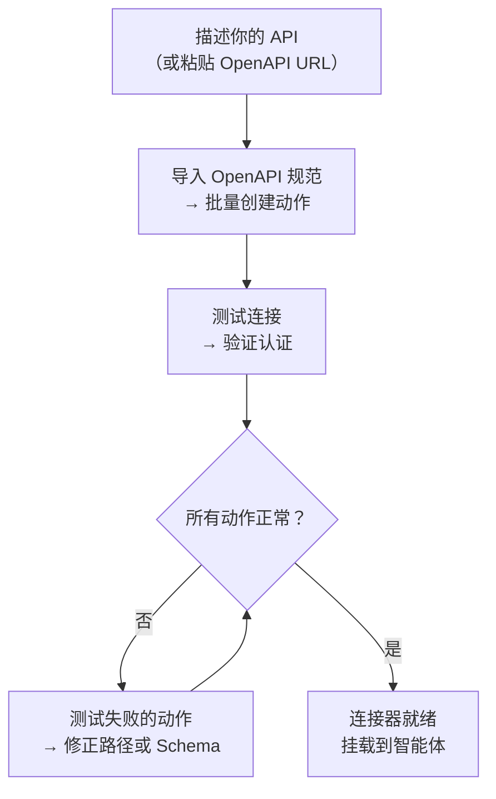
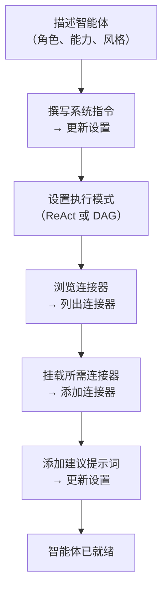

## 概述

AI 构建器让你用自然语言描述需求，由 AI 智能体代为完成配置。它支持两种模式：

| 模式 | 工作方式 | 适用场景 |
|------|---------|---------|
| **快速建议** | 单次 LLM 调用生成配置 | 快速初稿、简单 API |
| **高级构建器** | ReAct 智能体通过工具循环来构建、测试和迭代 | 复杂 API、OpenAPI 导入、多轮精调 |

两种模式可以随时切换。快速模式给出起点，高级构建器负责迭代优化。

---

## 连接器构建器

**连接器**定义了 FIM Agent 与外部系统的通信方式——基础 URL、身份验证，以及它暴露的具体 API 动作。连接器构建器为 AI 智能体提供 9 个工具，代你完成配置。

### 工具一览

| 工具 | 功能说明 |
|------|---------|
| **获取设置** | 读取当前连接器配置（URL、认证类型、认证信息） |
| **更新设置** | 修改连接器名称、基础 URL 或认证凭据 |
| **列出动作** | 查看所有已有的 API 动作（方法和路径） |
| **创建动作** | 添加新的 API 端点——HTTP 方法、路径、参数、请求体模板 |
| **更新动作** | 修改已有动作（描述、参数 Schema、响应提取表达式） |
| **删除动作** | 移除不再需要的动作 |
| **测试动作** | 对任意动作发起真实 HTTP 请求并查看响应 |
| **测试连接** | 验证基础 URL 是否可达、认证凭据是否有效 |
| **导入 OpenAPI** | 从 Swagger 2.x 或 OpenAPI 3.x 规范批量导入最多 50 个端点 |

### 典型工作流

最常见的用法：粘贴一个 OpenAPI URL，让构建器自动完成其余工作。

**示例提示词：**
> "从 `https://api.acme.com/openapi.json` 导入 OpenAPI 规范，然后用 `order_id=12345` 测试 `GET /orders` 端点。"

构建器会自动拉取规范、创建所有动作、发起测试请求，并报告结果——全程无需手动填写表单。

---

## 智能体构建器

**智能体**是一个具名的 AI 角色，拥有自己的系统指令、工具集，以及可选的连接器。智能体构建器为 AI 智能体提供 6 个工具，从零开始配置另一个智能体。

### 工具一览

| 工具 | 功能说明 |
|------|---------|
| **获取设置** | 读取当前智能体配置（指令、执行模式、工具、模型） |
| **更新设置** | 修改名称、描述、系统提示词、执行模式或建议提示词 |
| **列出连接器** | 浏览所有可用连接器（已挂载和未挂载） |
| **添加连接器** | 挂载连接器，使智能体可将其动作作为工具调用 |
| **移除连接器** | 卸载连接器（连接器本身不会被删除） |
| **设置模型** | 切换底层 LLM，或调整 temperature 和 max_tokens |

### 典型工作流

从一句描述出发，让构建器完成整个智能体的配置：

**示例提示词：**
> "创建一个财务副驾智能体，使用 Acme 连接器回答订单和发票相关问题。采用 ReAct 模式，并添加 3 条常见问题的建议提示词。"

构建器会读取当前设置，编写系统提示词，挂载连接器，设置执行模式，添加建议提示词——在一轮对话中全部完成。

---

## 工作原理

两个构建器在底层与普通智能体共享相同的基础设施：

| 构建器模式 | 机制 |
|-----------|------|
| **快速建议** | 单次 LLM 推理调用，将完整配置生成为结构化 JSON |
| **高级构建器** | ReAct 智能体循环：推理 → 调用构建器工具 → 观察结果 → 决定下一步 |

高级构建器本质上是一个完整的 ReAct 智能体，只是工具集受限——仅有 9 个连接器工具或 6 个智能体工具，没有网络或计算类工具。它读取目标资源的当前状态，规划需要变更的内容，调用对应工具，并在声明完成之前验证结果。

这意味着高级构建器能处理模糊需求：如果 OpenAPI 导入了 30 个动作但只有 5 个相关，你可以告诉它"只保留订单相关的端点"，它会自动删除其余动作。
