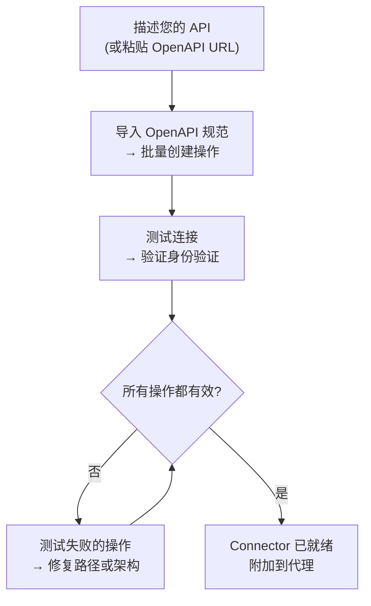
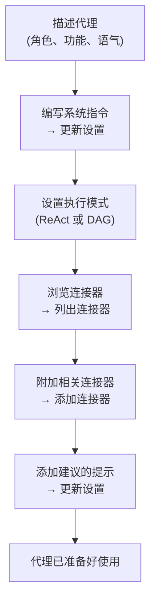

---
title: "AI Builder"
description: "使用 AI 构建 Connectors 和 Agents — 快速建议或完整的 ReAct builder。"
---## 概述

AI Builder 让你用纯文本描述你的需求，由 AI 代理为你配置。它有两种工作模式：

| 模式 | 工作原理 | 最适合 |
|------|-------------|---------|
| **快速建议** | 单次 LLM 调用生成配置 | 快速初稿、简单 API |
| **高级构建器** | ReAct 代理在循环中使用工具来构建、测试和优化 | 复杂 API、OpenAPI 导入、迭代优化 |

你可以随时在两种模式之间切换。快速模式创建起点；高级构建器让你进行迭代。## 连接器构建器

**连接器**定义了 FIM One 如何与外部系统通信 — 其基础 URL、身份验证和它公开的特定 API 操作。连接器构建器为 AI 代理提供了 9 个工具来代表您构建和管理此配置。### 工具

| 工具 | 功能 |
|------|-------------|
| **Get Settings** | 读取当前连接器配置（URL、身份验证类型、身份验证配置） |
| **Update Settings** | 更改连接器名称、基础 URL 或身份验证凭证 |
| **List Actions** | 查看所有现有 API 操作及其方法和路径 |
| **Create Action** | 添加新的 API 端点 — HTTP 方法、路径、参数、请求体模板 |
| **Update Action** | 修改现有操作（描述、架构、响应提取） |
| **Delete Action** | 删除不再需要的操作 |
| **Test Action** | 为任何操作发送实时 HTTP 请求并检查响应 |
| **Test Connection** | 验证基础 URL 是否可访问且凭证是否被接受 |
| **Import OpenAPI** | 从 Swagger 2.x 或 OpenAPI 3.x 规范批量导入最多 50 个端点 |### 典型工作流程

最常见的模式：粘贴 OpenAPI URL 并让构建器完成其余工作。

**示例提示：**
> "从 `https://api.acme.com/openapi.json` 导入 OpenAPI 规范，然后使用 `order_id=12345` 测试 `GET /orders` 端点。"

构建器获取规范、自动创建所有操作、触发测试请求并报告结果 — 所有这一切都无需您接触表单。

---## Agent Builder

一个**Agent**是一个具有一组指令、工具和（可选）连接器的命名AI角色。Agent Builder为AI代理提供6个工具来从头配置另一个代理。### 工具

| 工具 | 功能 |
|------|-------------|
| **Get Settings** | 读取当前 agent 配置（指令、执行模式、工具、模型） |
| **Update Settings** | 更改名称、描述、系统提示、执行模式或建议的提示词 |
| **List Connectors** | 浏览所有可用的 connector（已附加和未附加） |
| **Add Connector** | 附加一个 connector，使 agent 能够调用其操作作为工具 |
| **Remove Connector** | 分离一个 connector（connector 本身不会被删除） |
| **Set Model** | 切换底层 LLM，或调整温度和最大令牌数 |### 典型工作流程

从描述开始，让构建者配置整个代理：

**示例提示：**
> "创建一个财务助手。它应该使用 Acme 连接器回答有关订单和发票的问题。使用 ReAct 模式并为常见问题添加 3 个建议的提示。"

构建者读取当前设置，编写系统提示，附加连接器，设置执行模式，并在单个对话轮次中添加建议的提示。

---## 工作原理

在底层，两个构建器都与常规代理共享相同的基础设施：

| 构建器模式 | 机制 |
|-------------|-----------|
| **快速建议** | 单次 LLM 推理调用生成完整配置作为结构化 JSON |
| **高级构建器** | ReAct 代理循环：推理 → 调用构建器工具 → 观察结果 → 决定下一步 |

高级构建器是一个完整的 ReAct 代理，恰好具有受限的工具集——仅限 9 个 Connector 或 6 个 Agent 构建器工具，没有网络或计算工具。它读取目标资源的当前状态，规划需要更改的内容，调用适当的工具，并在声明完成前验证结果。

这意味着高级构建器可以处理歧义：如果 OpenAPI 导入创建了 30 个操作但只有 5 个相关，你可以告诉它"仅保留订单相关的端点"，它将删除其余的。