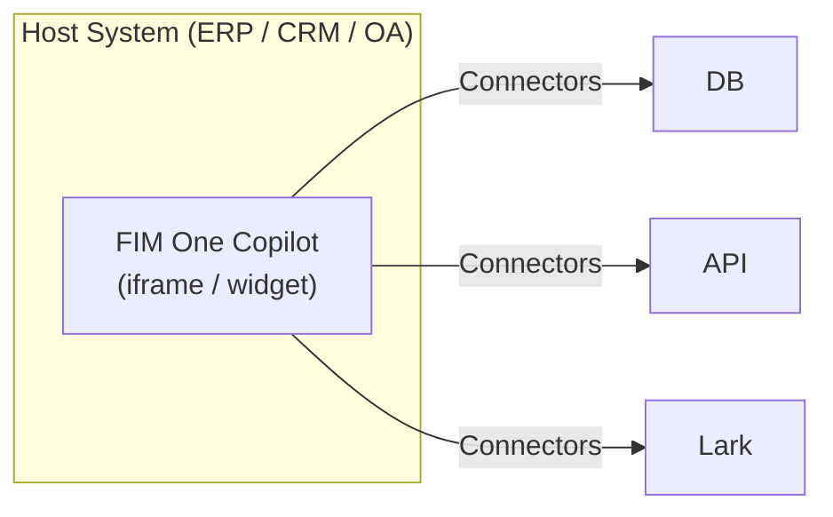
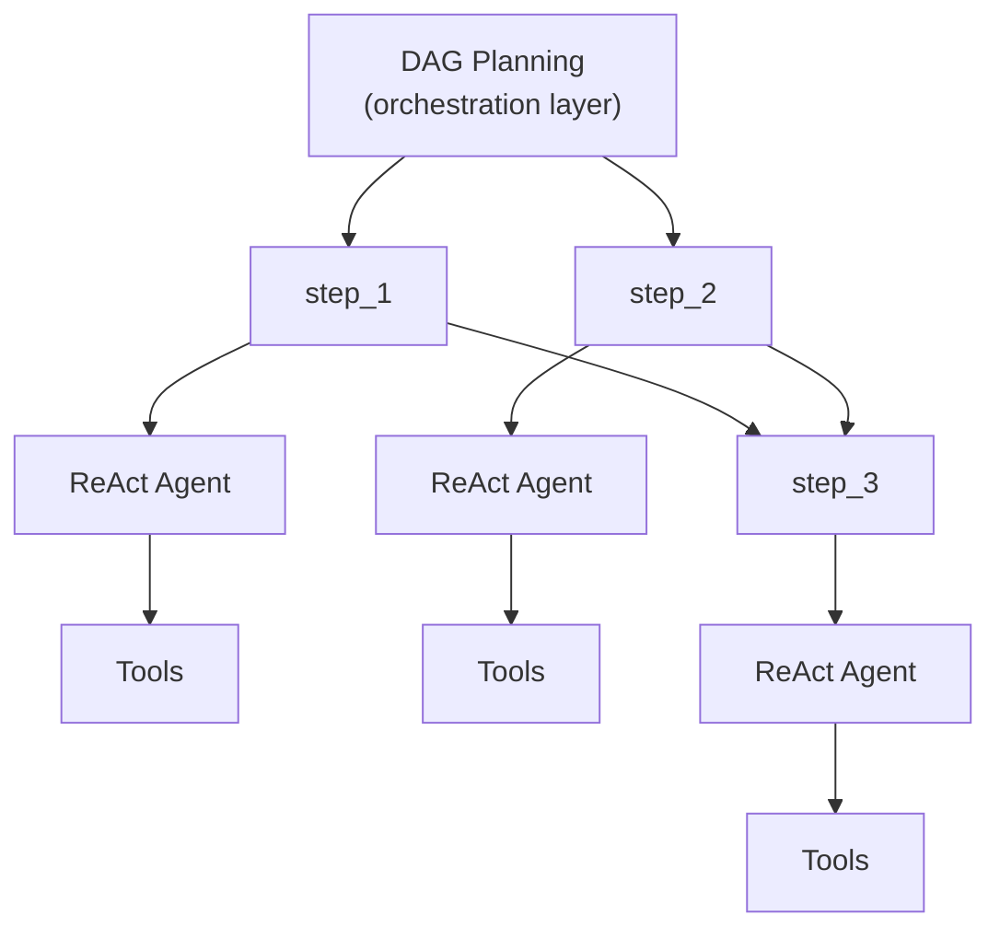

---
title: "执行模式"
description: "独立、副驾驶和中心 — 三种部署 FIM One 的方式。"
---## 三种模式

FIM One 根据代理的部署和使用方式在三种模式中运行：

| 模式 | 定义 | 交付方式 | 示例 |
|------|-----------|----------|---------|
| **独立模式** | 通用 AI 助手 | Portal | 聊天、搜索、代码执行、知识库问答 |
| **Copilot 模式** | 嵌入到宿主系统中的 AI | iframe / widget / embed | "财务 Copilot"嵌入到 ERP 网页 UI |
| **Hub 模式** | 中央跨系统编排 | Portal / API | 代理查询 ERP、检查 OA 审批、通过 Lark 通知 |

这个过程是自然递进的：从独立模式开始，将其嵌入到宿主系统作为 Copilot，然后设置 Hub 进行跨系统编排。Copilot 保持嵌入运行；Hub 添加中央编排层。## 模式详情### 独立模式（0 个连接器）

默认模式。FIM One 作为功能完整的 AI 助手工作：

- 内置工具：网络搜索、Python 执行、计算器、文件操作、shell 命令
- 带有 RAG 的知识库（PDF、DOCX、Markdown、HTML、CSV）
- 用于复杂多步骤任务的动态 DAG 规划
- 带有 DAG 可视化的实时流式传输

无需外部系统访问。适用于常规分析、研究和代码任务。### Copilot（嵌入式）

将 FIM One 嵌入到主机系统的 Web UI 中。该代理在用户熟悉的界面中与用户协同工作——无需切换上下文。Copilot 模式可以使用多个连接器（例如，主机系统的数据库 + 通知服务）。

示例：
- **财务 Copilot**：通过数据库连接器连接到金蝶 → 查询财务报表、生成分析报告
- **合同 Copilot**：通过 API 连接器连接到合同管理系统 → 搜索合同、提取条款、评估风险
- **HR Copilot**：通过 API 连接器连接到 HR 系统 → 查询员工信息、生成统计数据

该代理使用与独立模式相同的 ReAct/DAG 引擎，但现在可以通过连接器访问真实业务数据。### Hub（中央编排）

Hub 是一个独立的门户（或 API），充当中央智能层。它不嵌入任何单一系统中——相反，它连接到所有系统。用户通过 Portal UI 或 API 访问它。

示例：
- "检查 CRM 中逾期的合同，与 ERP 付款交叉参考，在 Lark 上通知财务团队"
- "当 OA 审批完成时，更新 CRM 中的合同状态并记录到审计数据库"
- "从 Salesforce 查询销售数据，使用业务数据库生成预测，向管理层发送电子邮件摘要"

每个 connector 都是一个独立的桥接。添加或删除一个不会影响其他的。## 交付方式

| 交付方式 | 描述 | 典型模式 |
|----------|-------------|-------------|
| **Portal (Web UI)** | 内置 Next.js 界面 | Standalone, Hub |
| **API (headless)** | HTTP/SSE 端点 (`/api/execute`, `/api/stream`) | Hub (programmatic access) |
| **iframe / Embed** | 注入到主机系统页面 | Copilot |

交付方式和模式相关但不是锁定的：你可以通过 API 访问 Hub，或通过 Portal 使用独立代理。但典型的模式是 Portal 用于 Hub，embed 用于 Copilot。## 执行引擎（内部实现）

在幕后，FIM One 提供两个执行引擎：

| 引擎 | 最适合 | 工作原理 |
|--------|----------|-------------|
| **ReAct** | 单个复杂查询 | 推理 → 行动 → 观察循环与工具 |
| **DAG Planning** | 多步骤并行任务 | LLM 生成依赖图，独立步骤并发运行 |

ReAct 是原子单位；DAG 是编排层。两个引擎都在所有三种模式（Standalone、Copilot、Hub）中工作。在 Hub 模式中，单个 DAG 步骤可能调用不同系统的 connector。## 为什么没有传统工作流引擎

FIM One 刻意**不**构建拖放式工作流编辑器。这是一个战略选择：

1. **工作流已经存在于其他地方。** 企业客户的固定流程（审批链、审计流）存在于他们的 OA、ERP 和遗留系统中。他们需要连接到这些系统的 AI，而不是另一个工作流编辑器。

2. **动态 DAG 覆盖灵活的情况。** 对于未预定义的任务，LLM 生成的 DAG 在运行时自适应——无需人工预设计。

3. **现有功能组合成固定管道。** 定时任务（计划中）使用固定提示触发 DAG 代理；DAG 规划步骤；Connector 桥接到目标系统。这种组合等同于静态管道——但更灵活，因为 LLM 根据遇到的数据调整其计划。

4. **Connector = API 调用。** 复杂的工作流操作（转移、拒绝、升级）是目标系统的责任。从 connector 的角度来看，每个操作只是带有参数的 HTTP 请求。FIM One 调用 API；目标系统管理状态机。