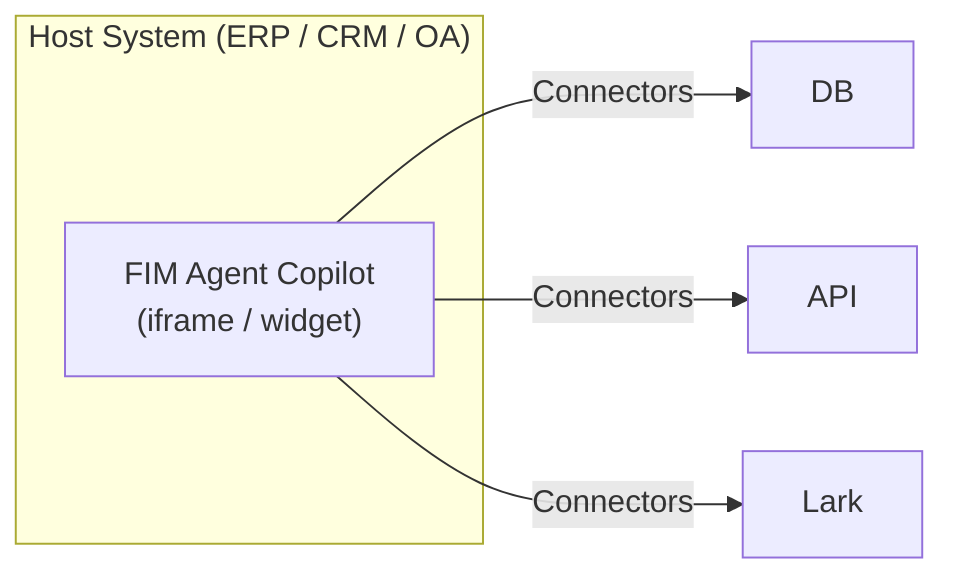
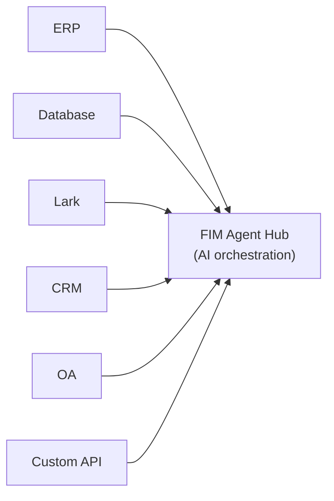
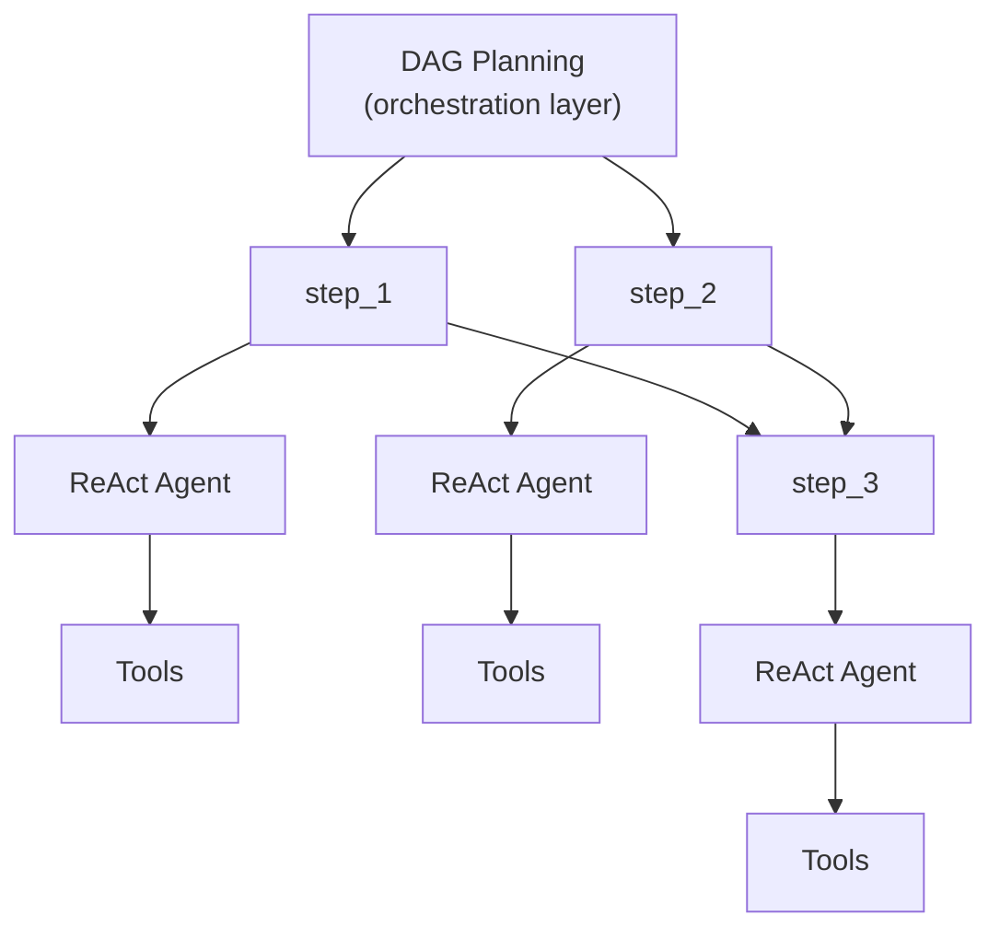

  ## 三种模式

FIM Agent 提供三种运行模式，具体取决于智能体的部署方式和使用方式：

| 模式       | 是什么         | 交付方式            | 示例                               |
| -------- | ----------- | --------------- | -------------------------------- |
| **独立模式** | 通用 AI 助手    | 门户              | 聊天、搜索、代码执行、知识库问答                 |
| **副驾模式** | 嵌入宿主系统中的 AI | 内嵌框架 / 小部件 / 嵌入 | 嵌入 ERP Web UI 的“财务副驾”            |
| **枢纽**   | 跨系统的集中编排中心  | 门户 / API        | 智能体查询 ERP、检查 OA 审批，并通过 Lark 发送通知 |

这种演进路径很自然：先从独立模式开始，再以副驾模式嵌入宿主系统，最后搭建枢纽来实现跨系统编排。副驾模式会继续以嵌入方式运行；枢纽则在此基础上增加一个中心编排层。

  ## 模式说明

  ### 独立模式 (0 个连接器)

默认模式。FIM Agent 作为功能完整的 AI 助手运行：

* 内置工具：网页搜索、Python 执行、计算器、文件操作、Shell 命令
* 集成 RAG 的知识库 (PDF、DOCX、Markdown、HTML、CSV) 
* 面向复杂多步骤任务的动态 DAG 规划
* 支持 DAG 可视化的实时流式输出

无需访问外部系统。适用于通用分析、研究和代码类任务。

  ### 副驾模式 (嵌入式)

将 FIM Agent 嵌入宿主系统的 Web 界面中。智能体可在用户熟悉的界面内与其协同工作——无需切换上下文。副驾模式可使用多个连接器（例如：宿主系统的 DB + 通知服务）。

示例：

- **财务 Copilot**：通过 DB 连接器接入金蝶 (Kingdee) → 查询财务报表、生成分析报告
- **合同 Copilot**：通过 API 连接器接入合同管理系统 → 检索合同、提取条款、评估风险
- **HR Copilot**：通过 API 连接器接入 HR 系统 → 查询员工信息、生成统计报表

该智能体使用与独立模式相同的 ReAct/DAG 引擎，但现在可通过连接器访问真实业务数据。

  ### 枢纽 (中央编排)

枢纽是一个独立的门户（或 API），充当中央智能层。它并不嵌入任何单一系统中——而是连接所有系统。用户可通过门户 UI 或 API 访问它。

示例：

- "检查 CRM 中逾期合同，与 ERP 付款信息交叉核对，并通过 Lark 通知财务团队"
- "当 OA 审批完成后，更新 CRM 中的合同状态，并记录到审计数据库"
- "从 Salesforce 查询销售数据，结合业务数据库生成预测，并通过电子邮件将摘要发送给管理层"

每个连接器都是独立的桥接组件。新增或移除一个都不会影响其他连接器。

  ## 交付方式

| 交付方式 | 说明 | 典型模式 |
|----------|-------------|-------------|
| **Portal (Web UI)** | 内置的 Next.js 界面 | 独立模式、枢纽 |
| **API (headless)** | HTTP/SSE 端点 (`/api/execute`, `/api/stream`) | 枢纽（程序化访问） |
| **iframe / Embed** | 嵌入宿主系统页面 | 副驾模式 |

交付方式与模式相关，但并非固定绑定：你可以通过 API 访问枢纽，也可以通过门户使用独立智能体。但典型模式是：门户用于枢纽，嵌入用于副驾模式。

  ## 执行引擎 (内部实现)

在底层实现上，FIM Agent 提供两种执行引擎：

| 引擎 | 适用场景 | 工作原理 |
| ---------- | -------- | -------------------------------- |
| **ReAct** | 单个复杂查询 | 通过工具执行 Reason → Act → Observe 循环 |
| **DAG 规划** | 多步骤并行任务 | LLM 生成依赖图，彼此独立的步骤可并发执行 |

ReAct 是原子单元；DAG 是编排层。这两种引擎在三种模式 (独立模式、副驾模式、枢纽模式) 下均可运行。在枢纽模式下，单个 DAG 步骤可能会调用连接到不同系统的连接器。

  ## 为什么不采用传统工作流引擎

FIM Agent 有意**不**构建拖拽式工作流编辑器。这是一个战略性选择：

1. **工作流本就存在于其他地方。** 企业客户的固定流程 (审批链、审计流程) 已经运行在其 OA、ERP 和遗留系统中。他们需要的是能够连接这些系统的 AI，而不是另一个工作流编辑器。

2. **动态 DAG 覆盖灵活场景。** 对于未预先定义的任务，由 LLM 生成的 DAG 可在运行时动态适配——无需人工事先设计。

3. **现有能力可组合成固定流水线。** 计划任务 (规划中) 通过固定提示词触发一个 DAG 智能体；DAG 负责规划步骤；连接器负责打通目标系统。这种组合等同于静态流水线——但更灵活，因为 LLM 会根据其遇到的数据调整执行计划。

4. **连接器 = API 调用。** 复杂的工作流操作 (转交、驳回、升级) 由目标系统负责。从连接器的视角看，每个操作都只是一个带参数的 HTTP 请求。FIM Agent 调用 API；目标系统管理状态机。