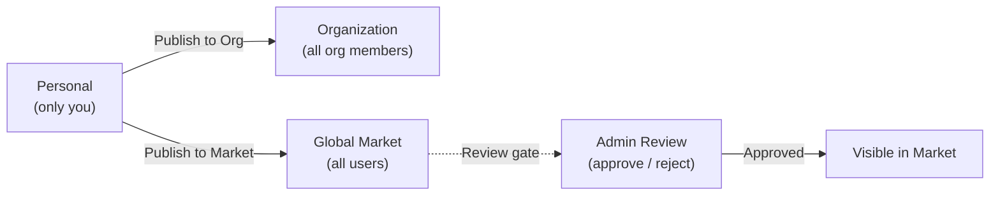

市场是 FIM One 的内置资源市场。它将共享资源组织为两个层级：

- **解决方案** -- 提供端到端功能的高级资源：智能体、技能和工作流。
- **组件** -- 解决方案依赖的构建块：连接器和 MCP 服务器。

您可以按范围（您的组织或全球市场）浏览、找到所需资源、订阅并开始使用 -- 所有操作都无需离开 FIM One。

<Info>
市场使用**拉取模型**：资源通过浏览发现并明确订阅。没有自动加入或推送机制 -- 您选择要安装的内容，并且可以随时按范围筛选。
</Info>

## 我可以找到什么？

### 解决方案

解决方案是完整的、即用型的功能，您可以订阅并立即投入使用。

| 资源 | 类别 | 您获得的内容 |
|---|---|---|
| **智能体** | 解决方案 | 一个具有绑定工具和知识的专家 AI 助手 |
| **技能** | 解决方案 | 注入到系统提示中的全局标准操作流程，可以编排智能体 |
| **工作流** | 解决方案 | 用于计划或触发执行的 DAG 自动化流 |

### 组件

组件是解决方案所基于的集成和工具服务。

| 资源 | 类别 | 您获得的内容 |
|---|---|---|
| **连接器** | 组件 | 可作为智能体工具的 API/数据库集成 |
| **MCP Server** | 组件 | 加载到会话中的第三方工具服务 |

<Tip>
知识库不会在市场中独立列出。当您订阅使用它们的解决方案时，它们会作为内部依赖项包含在内。
</Tip>

## 范围

Market 在页面顶部有一个范围选择器。两个范围中的 UI 和订阅流程相同 -- 只有资源的可见性会改变。

- **Organization** -- 在您的团队或公司内共享的资源。在此处发布不需要审核。
- **Global Market** -- 来自整个 FIM One 社区的资源。在此处发布需要管理员批准。

随时在范围之间切换以探索可用的内容。

## 我如何订阅？

当你找到想要的资源时，点击**订阅**。一个入门向导会引导你完成任何必需的设置 -- 例如，为连接器输入 API 凭证。如果你愿意，可以跳过向导，稍后再配置凭证。

订阅后：

- **智能体**会出现在你的智能体选择器和 `call_agent` 目录中。
- **技能**会自动注入到你的系统提示中。
- **工作流**会出现在你的工作流列表中，准备好运行。
- **连接器**会出现在你的工具集和智能体绑定下拉菜单中。
- **MCP 服务器**会将其工具加载到你的会话中。

如果一个解决方案依赖于组件（例如，使用特定连接器的智能体），这些依赖关系会在订阅期间自动解决。系统会提示你输入任何必需的凭证。

订阅是即时的 -- 无需发布者的批准。你可以随时取消订阅以从工作区中删除该资源。

## 我如何发布？

任何资源所有者都可以发布以使其资源可被发现。发布可以针对您的组织或全球市场。

| 目标 | 谁可以看到 | 需要审查？ |
|---|---|---|
| **组织** | 您组织的所有成员 | 否（组织级信任） |
| **全球市场** | 所有已认证用户 | 是 -- 需要管理员批准 |

发布到全球市场始终需要通过审查门槛。管理员可以批准、拒绝（附注释）或将资源保留为待处理状态。被拒绝的资源可以修改后重新提交。

## 关于凭证？

当你订阅需要凭证的资源（API 密钥、OAuth 令牌、数据库密码）时，入门向导会在订阅期间收集这些凭证。凭证被安全存储并限定在你的账户范围内——其他人无法看到它们。

你可以随时从资源的设置页面更新或轮换凭证。

## 它如何集成

在底层，Market 被实现为一个**影子组织** -- 一个不持有任何成员的隐形系统组织。发布到全球 Market 的资源在此影子组织内设置为 `visibility: "org"`，这允许现有的可见性系统自然地包含它们。

这意味着 Market 在工具组装管道中**不需要任何特殊情况代码**。加载个人和组织资源的相同三层可见性过滤器（own -> org-shared -> subscribed）也会加载 Market 资源。当你订阅时，会创建一条订阅记录，资源会自动出现在你的可见性过滤器中。

对于捆绑依赖项的解决方案（例如，带有绑定连接器和知识库的智能体），订阅过程会解析并配置这些依赖项，使一切开箱即用。

有关可见性过滤器如何跨所有资源类型工作的技术细节，请参阅[智能体和资源发现 -- 可见性模型](/architecture/agent-discovery#visibility-model)。
