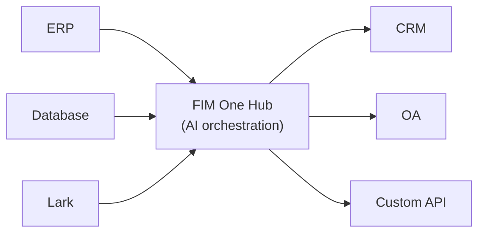

<Frame>
  
</Frame>

欢迎来到 FIM One，这是一个 AI 驱动的框架，用于构建能够跨企业系统动态规划和执行复杂任务的代理。

  <a href="https://one.fim.ai/">网站</a> · <a href="https://github.com/fim-ai/fim-one">GitHub</a> · <a href="https://discord.gg/z64czxdC7z">Discord</a> · <a href="https://x.com/FIM_One">Twitter</a> · <a href="https://www.producthunt.com/products/fim-one">Product Hunt</a>

<Tip>
  **☁️ 在云端尝试 FIM One — 无需设置。**
  托管版本已在 [**cloud.fim.ai**](https://cloud.fim.ai/) 上线：无需 Docker，无需 API 密钥，只需登录即可开始连接您的系统。_早期访问 — 欢迎反馈。_
</Tip>## FIM One 是什么？

FIM One 是一个与提供商无关的 Python 框架，用于构建与现有系统协作的 AI 代理。与要求你复制逻辑的工作流构建器不同，FIM One 主动连接你的系统——读取数据库、调用 API、推送通知——所有这些都通过统一的 AI 界面完成。

核心理念：**三种交付模式，一个代理核心**。## 三种交付模式

| 模式 | 定义 | 交付方式 | 使用场景 |
|------|-----------|----------|----------|
| **独立模式** | 通用AI助手 — 搜索、代码、知识库 | Portal | 聊天、代码执行、知识库问答 |
| **Copilot** | 嵌入式AI — 在用户现有UI中与用户协作 | iframe / widget / embed | ERP网页UI中的"财务Copilot" |
| **Hub** | 中央跨系统编排 — 连接所有系统 | Portal / API | Agent查询ERP、检查OA、通过Lark通知 |## Hub 架构

Hub 是核心差异化因素——一个中央门户，您的所有系统在这里与 AI 相遇：

每个 connector 都是一个标准化的桥接。agent 不知道也不关心它是在与 SAP 还是自定义 PostgreSQL 数据库通信。您的数据保留在您的系统中；FIM One 提供了跨系统编排的 AI 层。## 开始使用

探索以下部分以了解 FIM One 的架构并部署它：

- **[快速开始](/quickstart)** — 使用 Docker 或本地开发在几分钟内运行 FIM One
- **[执行模式](/concepts/execution-modes)** — 深入了解 Standalone、Copilot 和 Hub 模式
- **[AI Builder](/concepts/ai-builder)** — 使用 AI 通过自然语言构建 Connectors 和 Agents
- **[Connector 架构](/architecture/connector-architecture)** — FIM One 如何通过 AI 连接遗留系统
- **[哲学](/architecture/philosophy)** — 为什么动态规划是刚性工作流和完全自主代理之间的正确中间地带