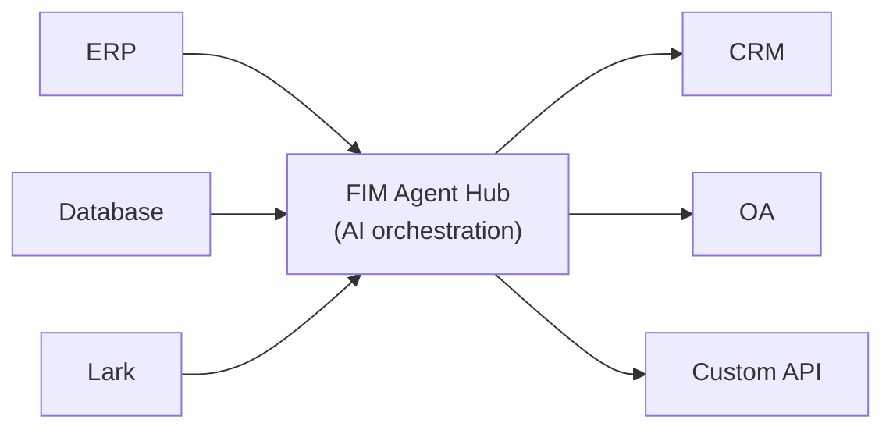

欢迎使用 FIM Agent，这是一个 AI 驱动的框架，用于构建能够在企业各系统间动态规划并执行复杂任务的智能体。

  ## 什么是 FIM Agent？

FIM Agent 是一个不依赖特定提供商的 Python 框架，用于构建可与您现有系统协同工作的 AI 智能体。不同于要求您重复搭建逻辑的工作流构建工具，FIM Agent 会主动打通您的各个系统——读取数据库、调用 API、推送通知——全部通过统一的 AI 接口完成。

核心理念：**三种交付模式，一个智能体核心**。

  ## 三种交付模式

| 模式 | 是什么 | 交付形式 | 使用场景 |
|------|-----------|----------|----------|
| **独立模式** | 通用型 AI 助手——搜索、代码、知识库 | 门户 | 对话、代码执行、知识库问答 |
| **Copilot** | 嵌入宿主系统的 AI——在用户现有 UI 中协同工作 | iframe / widget / embed | 您的 ERP Web UI 中的“财务 Copilot” |\n| **Hub** | 跨系统的中央编排——连接您的所有系统 | 门户 / API | 智能体查询 ERP、检查 OA，并通过 Lark 发送通知 |

  ## Hub 架构

Hub 是核心差异化特性——一个让您的所有系统与 AI 在此汇聚的中央门户：

每个连接器都是一个标准化的桥梁。智能体并不知道，也不关心它连接的是 SAP 还是自定义的 PostgreSQL 数据库。您的数据始终保留在您的系统中；FIM Agent 提供的是在这些系统之间进行统一编排的 AI 层。

  ## 开始使用

阅读以下章节，了解 FIM Agent 的架构并完成部署：

* **[快速开始](/zh/quickstart)** — 使用 Docker 或本地开发，在几分钟内启动 FIM Agent
* **[执行模式](/zh/concepts/execution-modes)** — 深入了解独立模式、副驾模式和枢纽模式
* **[连接器架构](/zh/architecture/connector-architecture)** — FIM Agent 如何通过 AI 连接遗留系统
* **[设计理念](/zh/architecture/philosophy)** — 为什么动态规划是在僵化工作流与完全自主智能体之间的最佳平衡