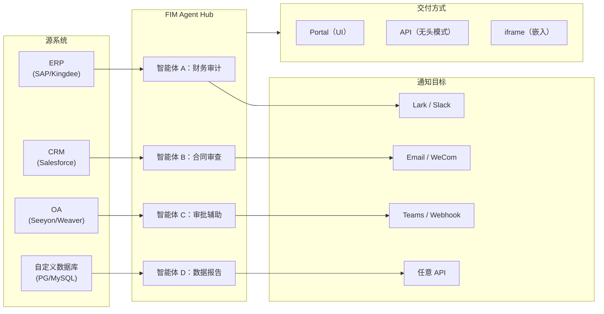

> 目标：构建一个**AI 驱动的连接器枢纽**——独立模式 (门户助手) 、副驾模式 (嵌入宿主系统) 、枢纽 (跨系统集中编排) 。
>
> 原则：**与提供商无关** (避免厂商锁定) 、**最小抽象**、**协议优先**、**连接器优先** (集成是核心价值) 。

<div id="product-vision">
  ## 产品愿景
</div>

FIM Agent 是一个**AI 连接器枢纽**，服务于三种逐步演进的模式：

```
独立模式     → 您自己的 AI 助手（Portal）
副驾模式     → 嵌入宿主系统的 AI（iframe / widget / embed）
枢纽         → 跨系统集中编排（Portal / API）
```

**枢纽模式是核心差异化优势。** 企业客户拥有遗留系统——ERP、CRM、OA、财务、人力资源——这些系统需要通过 AI 相互联通：



**GTM 路径：落地并扩展**

| 阶段 | 模式 | 内容 |
|------|------|-------------|
| 落地 | 副驾模式 | 嵌入一个系统，在其 UI 内证明价值 |
| 扩展 | 副驾模式 → 枢纽 | 推广到更多系统；由枢纽统一汇聚 |

<div id="shipped-versions">
  ## 发布版本
</div>

<div id="v01-2026-02-22-mvp-react-dag-planner">
  ### v0.1 (2026-02-22) — MVP：ReAct + DAG 规划器
</div>

* 支持工具 (calculator、python&#95;exec、网页搜索) 的 ReAct代理
* DAG 规划器 (LLM 生成依赖图)
* 支持流式输出 + KaTeX 的门户 UI

<div id="v02-2026-02-24-multi-model-memory">
  ### v0.2 (2026-02-24) — 多模型 + 记忆
</div>

* 重试 / 速率限制 / 用量跟踪
* 原生函数调用 (无需仅依赖 JSON 解析)
* 多模型支持 (快速模型 + 主 LLM)
* 记忆：窗口记忆、摘要记忆
* 基于 FastAPI 的后端，支持 SSE 流式传输

<div id="v03-2026-02-25-web-tools-mcp">
  ### v0.3 (2026-02-25) — 网页工具 + MCP
</div>

* 通过 Jina/Tavily/Brave 提供的网页工具 (网页搜索、网页获取)
* 文件操作工具
* MCP 客户端 (标准工具集成)
* 工具自动发现 + 分类
* 支持点击跳转滚动的 DAG 可视化
* 在 Docker 中执行代码 (`--network=none`)

<div id="v04-2026-02-25-multi-turn-agents">
  ### v0.4 (2026-02-25) — 多轮对话 + 智能体
</div>

* 多轮对话 (数据库记忆)
* 工具步骤折叠 UI
* HTTP 请求 + shell 执行工具
* 智能体管理 (创建、配置、发布)
* JWT 身份验证
* 按智能体设置的执行模式 + 温度控制

<div id="v05-2026-02-28-full-rag-grounded-gen">
  ### v0.5 (2026-02-28) — 完整 RAG + 可溯源生成
</div>

* 完整 RAG 流水线 (嵌入 + 向量存储 + FTS + 倒数排名融合 + 重排序器)
* 可溯源生成 (引用、冲突检测、置信度评分)
* 知识库文档管理 (CRUD、搜索、重试、Schema 迁移)
* 上下文保护器 + 置顶消息 (令牌预算管理器)
* 数据库记忆持久化 + LLM Compact
* DAG 重新规划 (最多 3 轮)

<div id="v06-2026-03-01-connector-platform">
  ### v0.6 (2026-03-01) — 连接器平台
</div>

* **连接器 CRUD**：创建、读取、更新、删除
* **连接器工具适配器**：将连接器转换为 BaseTool
* **用户级凭据**：AES-GCM 加密
* **确认门**：写操作审批
* **审计日志**：记录所有工具调用
* **熔断机制**：故障时优雅降级
* **实用工具**：email_send、json_transform、template_render、text_utils
* **嵌入选项**：Jina、OpenAI、自定义提供商

<div id="v07-2026-03-06-admin-platform-multi-tenant">
  ### v0.7 (2026-03-06) — 管理平台 + 多租户
</div>

* **管理平台**：用户管理、角色切换、密码重置、账户启用/禁用
* **仅限邀请注册**：三种模式 (开放/邀请/禁用) + 邀请码 CRUD
* **存储管理**：按用户磁盘用量、清理、孤儿数据清理
* **会话审核**：管理员可查看/删除全部
* **按用户强制登出**：撤销所有令牌
* **API 健康仪表板**：系统统计、连接器指标
* **首次运行设置向导**：引导创建管理员账户
* **个人中心**：用户级全局指令、语言偏好
* **JWT 认证**：基于令牌的 SSE 认证、会话所有权
* **全局 MCP 服务器**：由管理员预配，在所有会话中加载
* **向后兼容**：registration&#95;enabled → registration&#95;mode 自动迁移

<div id="v07x-2026-03-07-onwards-stability-polish">
  ### v0.7.x (自 2026-03-07 起) — 稳定性与完善
</div>

* 邀请码管理
* 按用户配额 (执行 429 限流)
* 结构化审计日志
* 敏感词过滤
* 管理员登录历史
* 管理员文件浏览器
* 增强的管理视图 (`model_name`、`tools`、`kb_ids` 字段)
* Docker Compose 部署 (单镜像、命名卷)
* 基于 `window.location` 自动检测 OAuth
* 扩展思考 / 推理支持（`LLM_REASONING_EFFORT`、`LLM_REASONING_BUDGET_TOKENS`），适用于 OpenAI o 系列、Gemini 2.5+、Claude
* 管理后台逐工具启用/禁用（禁用的工具在运行时从聊天中排除）
* MCP 服务器管理移至连接器页面
* 双数据库支持：SQLite（零配置默认）+ PostgreSQL（生产环境推荐）；Docker Compose 自动配置 PostgreSQL
* 模型配置文档页面，含各提供商的扩展思考设置指南
* SSE 协议 v2：实时回答流式传输，新增 `delta_reasoning`、`usage` 字段，事件拆分为 `done`/`suggestions`/`title`/`end`；SQLite 连接池 5 -> 20
* AI Builder 扩展：7 个新构建器工具（连接器端 GetSettings、TestConnection、ImportOpenAPI；智能体端 ListConnectors、AddConnector、RemoveConnector、SetModel），智能体新增 `is_builder` 标志，构建器提示词自动刷新，SSRF 防护
* SSE v2 前端：点脉冲流式光标、DAG 重新规划轮次快照显示为可折叠卡片、DAG 布局与步骤状态解耦
* AI Builder 概念文档页面，含连接器和智能体构建器指南

<div id="planned-versions">
  ## 规划版本
</div>

<div id="v08-connector-declarative-config-rbac">
  ### v0.8 — 连接器声明式配置 + RBAC
</div>

**目标**：让连接器定义更简单，无需编写 Python 代码。

* **YAML/JSON 连接器配置**：平台自动生成 MCP 服务器
* **连接器导入/导出**：共享连接器模板
* **连接器分叉**：复制并自定义现有连接器
* **数据库连接器**：直接访问 SQL (PostgreSQL、MySQL、Oracle)
* **消息推送**：Lark、WeCom、Slack、Email 通知动作
* **RBAC**：按用户/角色控制连接器访问权限
* **操作审计**：详细记录谁执行了哪些操作

**影响**：实施工程师 (无需 Python) 可在 1-2 小时内新增连接器。

<div id="v09-observability-production-hardening">
  ### v0.9 — 可观测性 + 生产环境加固
</div>

**目标**：实现面向生产环境的运维、调试与跨会话智能。

* **分布式追踪**：集成 OpenTelemetry
* **熔断机制**：指数退避、故障检测
* **可观测性**：指标 (延迟、成功率、令牌使用量)
* **连接器分析**：使用模式、故障模式
* **沙箱加固**：代码执行隔离的 v2 改进
* **Docker Compose**：完整部署栈
* **性能测试**：并发负载基准测试
* **跨会话长期记忆**：用户级持久化记忆，跨对话记住关键事实、偏好和决策；包含重要性评分、带时间衰减的语义检索，以及会话结束时的静默摘要；与现有 RAG 嵌入流水线集成
  * `user_memories` 表 (ORM + Alembic 迁移)，含嵌入向量存储
  * 记忆写入代理：重要性评分 (1–5)、自动分类
  * 会话开始时语义检索 (注入系统提示词)
  * 时间衰减 (30 天半衰期，近期记忆权重更高)
  * 手动触发关键词 ("remember this"、"记住这个")
  * 记忆管理 UI (查看 / 编辑 / 删除记忆)

**影响**：让 FIM Agent 能够自信地实现大规模运行。用户受益于持久化上下文，使每次对话都比上一次更智能。

<div id="v10-hot-plug-embeddable">
  ### v1.0 — 热插拔 + 可嵌入式
</div>

**目标**：无需重启即可添加连接器，并支持可嵌入式交付。

* **热插拔连接器**：上传 OpenAPI 规范，AI 自动生成配置，5 分钟内即可上线 (无需重启)
* **连接器市场**：社区共享模板
* **可嵌入式组件**：将 `<script src="fim-agent.js">` 注入宿主页面
* **页面上下文注入**：小部件读取宿主页面上下文 (当前 ID、URL、DOM 选择器)
* **计划任务**：类 cron 的 DAG 触发器
* **Webhook**：入站事件触发器
* **批量执行**：通过 DAG 处理 1000+ 条数据
* **管理控制台**：完整的管理界面
* **企业级安全**：IP 白名单、静态数据加密、SSO
* **记忆生命周期 v2**：TTL 策略、管理员管理的记忆配额、组织级共享记忆 (基于 v0.9 跨会话记忆构建)

**影响**：企业可在数天内完成 FIM Agent 从零到多系统编排的部署。

<div id="frozen-features-shipped-maintain-only">
  ## 冻结功能 (已发布，仅维护)
</div>

根据[正交性策略](/zh/strategy/orthogonality-strategy)，这些功能已发布并正常运行，但不会再获得新能力 (仅修复 bug) ：

| 功能 | 版本 | 冻结原因 |
|---------|---------|-----------|
| ReAct 智能体 | v0.1 | 模型现已原生支持工具调用 |
| DAG 规划 / 重新规划 | v0.1, v0.5 | 模型推理能力持续提升；任务分解正趋向于单次完成 |
| 记忆 (窗口、摘要、压缩)  | v0.2, v0.5 | 上下文窗口持续扩大 (200K+) ；对外部记忆管理的需求降低 |
| RAG 流水线 | v0.5 | 提供商正原生构建检索能力 (OpenAI file&#95;search、Gemini Search Grounding)  |
| 可溯源生成 | v0.5 | 模型在引用方面持续改进；5 阶段流水线带来的边际价值递减 |
| ContextGuard / 置顶消息 | v0.5 | 按现状交付；不再新增功能 |

<div id="consider-deferred-indefinitely">
  ## 考虑 (无限期推迟)
</div>

根据正交性策略，这些功能投入成本高，且存在被原生能力吸收的风险：

| 功能 | 推迟原因 |
| ------- | ---------------------------------------------------------- |
| 多智能体编排 | 提供商正在原生构建相关能力 (OpenAI Swarm、Claude Code Teams、Google A2A) |
| ~~语义记忆存储~~ | **已规划至 v0.9**，作为跨会话长期记忆功能 |
| ~~记忆生命周期~~ | **已规划至 v0.9** (时间衰减、重要性评分) + **v1.0** (TTL 策略、管理员配额) |

<div id="how-versions-align-with-modes">
  ## 版本与模式的对应关系
</div>

| 版本            | 独立模式 | 副驾模式 | 枢纽   | 说明                       |
| ------------- | ---- | ---- | ---- | ------------------------ |
| **v0.1–v0.3** | 可用   | 尚未支持 | 尚未支持 | 仅限 Portal，单用户            |
| **v0.4**      | 可用   | 尚未支持 | 尚未支持 | 多会话、智能体管理                |
| **v0.5**      | 可用   | 尚未支持 | 尚未支持 | 知识库 + RAG                |
| **v0.6**      | 可用   | 可支持  | 可支持  | 连接器已交付；通过手动集成可实现副驾模式/枢纽  |
| **v0.7**      | 可用   | 就绪   | 就绪   | 管理平台；多租户认证；可用于生产环境       |
| **v0.8**      | 可用   | 就绪   | 已优化  | 按系统划分的 RBAC + 审计日志；接入更容易 |
| **v0.9**      | 可用   | 就绪   | 生产可用 | 可观测性、性能、加固               |
| **v1.0**      | 可用   | 已优化  | 企业级  | 热插拔、市场、计划任务、Webhook、批处理  |

<div id="resource-allocation-v08v10">
  ## 资源分配 (v0.8–v1.0)
</div>

正交性策略决定了资源投入的重点：

| 类别 | 占比 | 版本 | 原因 |
|----------|-----------|----------|-----|
| **连接器平台** (v0.6+) | 60% | 持续 | 核心差异化能力；不存在被吸收的风险 |
| **企业级功能** (RBAC、审计、安全) | 25% | v0.8–v1.0 | 不炫目但可持续；生产环境必需 |
| **嵌入/交付** (widget、热插拔) | 10% | v0.9–v1.0 | 对”落地并扩展”GTM 具有战略意义 |
| **v0.1–v0.5 维护** | 5% | 持续 | 仅修复缺陷；不新增功能 |

<div id="metric-driven-milestones">
  ## 以指标驱动的里程碑
</div>

成功将通过以下指标衡量：

| 指标                      | v0.7 目标 | v0.8 目标  | v1.0 目标     |
| ----------------------- | ------- | -------- | ----------- |
| 已部署连接器数量                | 5       | 20+      | 100+        |
| 企业客户数量                  | 1–2     | 5–10     | 20+         |
| 平均连接器配置时间               | 2 周     | 2 天      | 5 分钟 (热插拔)  |
| 令牌效率 (DAG 对比仅使用 ReAct)  | 降低 30%  | 降低 40%   | 降低 50%      |
| 可用性 SLA                 | 99.5%   | 99.9%    | 99.95%      |
| 支持工单主要主题                | 集成、配置   | 连接器自定义逻辑 | 热插拔、扩缩容     |

<div id="open-questions-tbd">
  ## 开放问题 / 待定
</div>

* **Marketplace 审核**：如何验证社区连接器？(v1.0)
* **令牌经济**：如何为多用户、多智能体场景定价？(v1.0)
* **Telemetry 退出**：如何尊重隐私偏好？(v0.8)
* **连接器版本管理**：如何管理连接器 API 中的破坏性变更？(v0.8)
* **速率限制**：按连接器、按用户，还是全局？(v0.8)