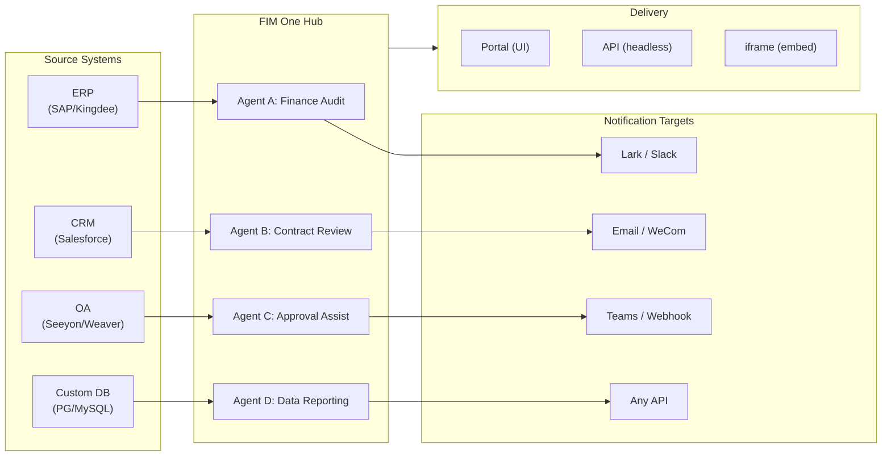

> 目标：构建一个**AI 驱动的连接器中心** — 独立门户（门户助手）、副驾驶（嵌入主机系统）、中心（跨系统中央编排）。
>
> 原则：**供应商无关**（无厂商锁定）、**最小抽象**、**协议优先**、**连接器优先**（集成是核心价值）。

## 产品愿景

FIM One 是一个 **AI 连接器中心**，提供三种渐进式模式：

```
Standalone   → 您自己的 AI 助手 (Portal)
Copilot      → AI 嵌入到主系统中 (iframe / widget / embed)
Hub          → 中央跨系统编排 (Portal / API)
```

**Hub 模式是核心差异化优势。** 企业客户拥有遗留系统——ERP、CRM、OA、财务、HR——需要通过 AI 相互通信：



**GTM 路径：先着陆后扩展**

| 步骤 | 模式 | 发生的事情 |
|------|------|-------------|
| 着陆 | Copilot | 嵌入到一个系统中，在其 UI 内证明价值 |
| 扩展 | Copilot → Hub | 推广到更多系统；Hub 聚合它们 |

## 已发布的版本

### v0.1 (2026-02-22) — MVP: ReAct + DAG Planner
- ReActAgent with tools (calculator, python_exec, web_search)
- DAG Planner (LLM generates dependency graphs)
- Portal UI with streaming + KaTeX

### v0.2 (2026-02-24) — 多模型 + 记忆
- 重试 / 速率限制 / 使用情况跟踪
- 原生函数调用（无仅 JSON 解析）
- 多模型支持（快速 + 主 LLM）
- 记忆：WindowMemory、SummaryMemory
- FastAPI 后端与 SSE 流式传输

### v0.3 (2026-02-25) — Web Tools + MCP
- Web tools (web_search, web_fetch) via Jina/Tavily/Brave
- File operations tool
- MCP client (standard tool integration)
- Tool auto-discovery + categories
- DAG visualization with click-to-scroll
- Code exec in Docker (`--network=none`)

### v0.4 (2026-02-25) — 多轮对话 + 智能体
- 多轮对话（DbMemory）
- 工具步骤折叠 UI
- HTTP 请求 + shell 执行工具
- 智能体管理（创建、配置、发布）
- JWT 身份验证
- 按智能体执行模式 + 温度控制

### v0.5 (2026-02-28) — 完整 RAG + 基础生成
- 完整 RAG 管道（嵌入 + 向量存储 + FTS + RRF + 重排器）
- 基础生成（引用、冲突检测、置信度分数）
- 知识库文档管理（CRUD、搜索、重试、模式迁移）
- ContextGuard + 固定消息（令牌预算管理器）
- DbMemory 持久化 + LLM Compact
- DAG 重新规划（最多 3 轮）

### v0.6 (2026-03-01) — 连接器平台
- **连接器 CRUD**: 创建、读取、更新、删除
- **ConnectorToolAdapter**: 将连接器转换为 BaseTool
- **按用户凭证**: AES-GCM 加密
- **确认门**: 写入操作审批
- **审计日志**: 所有工具调用记录
- **断路器**: 故障时优雅降级
- **实用工具**: email_send、json_transform、template_render、text_utils
- **嵌入选项**: Jina、OpenAI、自定义提供商

### v0.7 (2026-03-06) — 管理平台 + 多租户
- **管理平台**: 用户管理、角色切换、密码重置、账户启用/禁用
- **邀请制注册**: 三种模式（开放/邀请/禁用）+ 邀请码 CRUD
- **存储管理**: 按用户磁盘使用量、清除、孤立文件清理
- **对话审核**: 管理员列表/删除所有对话
- **按用户强制登出**: 撤销所有令牌
- **API 健康仪表板**: 系统统计、连接器指标
- **首次运行设置向导**: 引导式管理员账户创建
- **个人中心**: 按用户全局指令、语言偏好
- **JWT 认证**: 基于令牌的 SSE 认证、对话所有权
- **全局 MCP 服务器**: 管理员配置、在所有会话中加载
- **向后兼容**: registration_enabled → registration_mode 自动迁移

### v0.7.x (2026-03-07 to 2026-03-12) — 稳定性 + 打磨
- 邀请码管理
- 按用户配额（429 强制执行）
- 结构化审计日志
- 敏感词过滤
- 管理员登录历史
- 管理员文件浏览器
- 增强的管理员视图（model_name、tools、kb_ids 字段）
- Docker Compose 部署（单个镜像、命名卷）
- OAuth 自动检测（来自 window.location）
- 扩展思考/推理支持（`LLM_REASONING_EFFORT`、`LLM_REASONING_BUDGET_TOKENS`）支持 OpenAI o 系列、Gemini 2.5+、Claude
- 管理员按工具启用/禁用（禁用的工具在运行时从聊天中排除）
- MCP 服务器管理移至连接器页面
- 双数据库支持：SQLite（零配置默认）+ PostgreSQL（生产环境）；Docker Compose 自动配置 PostgreSQL
- 模型配置文档页面，包含每个提供商的扩展思考设置
- SSE 协议 v2：实时答案流式传输，包含 `delta_reasoning`、`usage` 字段，以及拆分的 `done`/`suggestions`/`title`/`end` 事件；SQLite 连接池大小 5 -> 20
- AI Builder 扩展：7 个新的构建器工具（GetSettings、TestConnection、ImportOpenAPI 用于连接器；ListConnectors、AddConnector、RemoveConnector、SetModel 用于智能体），智能体上的 `is_builder` 标志，构建器提示自动刷新，SSRF 防护
- SSE v2 前端：流式点脉冲光标，DAG 重新规划轮快照作为可折叠卡片，DAG 布局与步骤状态解耦
- AI Builder 概念文档页面，包含连接器和智能体构建器指南
- 组织系统：完整的 CRUD 操作，基于角色的成员资格（所有者/管理员/成员），管理员管理 UI
- 三层资源可见性（个人/组织/全局）用于智能体、连接器、知识库、MCP 服务器
- 发布/取消发布 API 用于所有资源类型；已发布智能体的所有者委派
- 管理员设置可见性端点（替换克隆到全局）；统一的 `build_visibility_filter()` 查询助手
- 数据库连接器（第 1-3 阶段）：直接 SQL 访问 PG/MySQL/Oracle/SQL Server + 中文遗留数据库；模式内省、AI 注释、只读查询执行、加密凭证、每个连接器 3 个工具（`list_tables`、`describe_table`、`query`）
- **评估中心**：定量智能体质量基准测试 — 测试数据集 CRUD（提示 + 预期行为 + 断言），评估运行（并行执行 + LLM 评分器 + 每个案例的通过/失败/延迟/令牌结果），带自动轮询的结果查看器；迁移 `r8t0v2x4z567`
- 三个模型角色（通用/快速/推理）具有按层级的环境配置隔离；快速模型不再继承主模型设置
- `StepOutput` 数据类替换纯字符串步骤结果，用于结构化数据和工件传递
- DAG 执行的工具缓存 — 每次运行中相同的工具调用缓存，具有异步锁雷鸣羊群防护（`DAG_TOOL_CACHE`）
- 按步骤 LLM 验证，失败时重试 1 次（`DAG_STEP_VERIFICATION`）
- 自动路由：快速 LLM 将查询分类为 ReAct 或 DAG；`/api/auto` 端点；前端 3 向模式切换（`AUTO_ROUTING`）
- [x] ~~**影子市场组织 + 资源订阅**~~：内置市场组织（影子，无自动加入）替换平台组织；通过市场浏览发现资源并明确订阅（拉取模型）；用于订阅共享资源的市场 API；发布到市场始终需要审查；资源订阅表；基于组织的资源共享替换全局可见性
- [x] ~~**智能体自动发现和子智能体绑定**~~：智能体上的 `discoverable` 标志；`sub_agent_ids` 白名单；CallAgentTool 用于委派任务给专家智能体
- [x] ~~**MCP 服务器凭证 + 按用户覆盖**~~：`mcp_server_credentials` 表；`PUT /api/mcp-servers/{id}/my-credentials` 端点；凭证回退行为的 `allow_fallback` 标志
- [x] ~~**连接器/知识库切换**~~：`POST /api/connectors/{id}/toggle` 和 `POST /api/knowledge-bases/{id}/toggle` 用于暂停/恢复资源
- [x] ~~**独立知识库对话**~~：对话上的 `kb_ids` 字段，用于直接知识库聊天，无需智能体绑定

## 计划版本

### v0.8 — 连接器声明式配置 + 渐进式信息披露

**目标**: 使定义连接器更容易，无需编写 Python 代码，并优化工具和指令向 LLM 的暴露方式。

- [x] ~~**数据库连接器**: 直接 SQL 访问 (PostgreSQL, MySQL, Oracle)~~ *(在 v0.7.x 中发布 — 第 1-3 阶段)*
- [x] ~~**RBAC**: 按用户/角色的连接器访问控制~~ *(在 v0.7.x 中发布 — 组织系统 + 三层可见性)*
- [x] **连接器凭证加密 + 按用户覆盖**: `connector_credentials` 表，通过 `CREDENTIAL_ENCRYPTION_KEY` 进行 Fernet 加密，`allow_fallback` 标志，`GET/PUT/DELETE /my-credentials` 端点，聊天工具加载中的按用户凭证解析
- [x] **发布审查 UI**: 组织级发布审查系统 — 按组织审查切换，带有批准/拒绝工作流的 ReviewsSheet，资源卡上的状态徽章，发布对话框中的审查通知，被拒绝资源的重新提交
- [x] **连接器渐进式信息披露 (第 1-2 阶段)**: 单个 `ConnectorMetaTool` 替代按操作工具；系统提示仅接收轻量级**存根** (名称 + 1 行描述，~30 tokens/连接器 vs ~250 tokens/操作)；智能体调用 `discover(connector)` 按需加载完整操作架构 — 架构仅在模型选择连接器时加载，保持提示前缀稳定以便缓存。镜像 Claude Code 的 `defer_loading: true` 内部模式。`execute` 子命令；向后兼容的功能标志。
- [x] ~~**智能体技能系统 + 紧凑指令**: 智能体指令的按需技能加载 — `Skill` 模型 (名称、内容/SOP、可选脚本) 附加到智能体；在系统提示中仅按名称引用 (~10 tokens/技能)；智能体调用 `read_skill(name)` 按需加载完整内容。将每次对话指令令牌成本降低约 80%，同时允许更丰富的 SOP 库。与 ConnectorMetaTool 的渐进式信息披露在指令级别的对应物。启用"指令 + 工具 + 技能"差异化故事。还向 Agent 模型添加 `compact_instructions` 字段 — 按智能体压缩优先级列表注入到 `ContextGuard` 中进行压缩 (例如，"保留订单 ID 和金额，删除原始 API 响应")，替换当前静态通用提示。受 Claude Code 的紧凑指令模式启发。~~
- [ ] **YAML/JSON 连接器配置**: 平台自动生成 MCP 服务器
- [x] **连接器导入/导出**: 共享连接器模板
- [x] **连接器分叉**: 克隆并自定义现有连接器
- [ ] **数据库连接器第 4 阶段**: 企业驱动程序 — Oracle (`oracledb`)、SQL Server (`aioodbc`)、达梦 DM8 (`aioodbc` + DM ODBC)、南大通用 GBase (`aioodbc` + GBase ODBC)
- [ ] **消息推送**: Lark、WeCom、Slack、Email 通知操作
- [x] **工作流第 2 阶段节点**: Iterator、Loop、VariableAggregator、ParameterExtractor、ListOperation、Transform、DocumentExtractor、QuestionUnderstanding、HumanIntervention — 9 种高级节点类型，包含完整前端 + 后端 + 150 个新测试 (共 275 个)。节点重试带指数退避，安全表达式评估。包含成功率条的统计面板。12 个内置模板。窗格上下文菜单 (粘贴、全选、适应视图、自动布局)。
- [x] **工作流第 3 阶段节点: SubWorkflow + ENV** — 2 种新节点类型 (共 25 个节点)，14 个新测试 (共 306 个)，14 个内置模板。SubWorkflow: 完整数据库支持的嵌套工作流执行器，具有目标工作流选择、变量映射和可配置深度限制以防止无限递归。ENV: 使用密钥选择器和回退默认值读取加密环境变量。完整前端 (节点组件、配置面板、调色板条目、小地图颜色)。按节点执行统计面板 (成功率、持续时间、按最坏优先排序的失败计数)。`getNodeStats` API 客户端 + `NodeStatEntry` 类型。键盘快捷键对话框 (`?` 键)。
- [x] **工作流计划触发器**: 按工作流 cron 配置，包含时区、默认输入和下次运行时间计算。预设 cron 按钮，30 个触发器测试。
- [x] **工作流 API 触发器**: 公共按工作流 API 密钥 (`wf_` 前缀) 用于外部执行，无需用户认证，带速率限制。API 密钥管理对话框，包含生成/重新生成/撤销、触发 URL 和 cURL/JS 示例。
- [x] **工作流批量执行**: `POST /batch-run`，最多 100 个输入集，可配置并行度 (1-10)，可折叠的按项结果，JSON 导出。14 个批量执行测试。
- [x] **工作流执行日志查看器**: 运行面板中的实时按时间顺序 SSE 事件流，包含时间戳、彩色徽章和事件类型过滤切换。
- [x] **工作流运行统计**: 后端通过 GROUP BY 子查询批量获取运行计数和成功率；前端在工作流卡上显示统计信息，带彩色编码的成功率指示器。
- [x] **工作流调度程序守护进程**: 后台异步服务每 60 秒轮询一次到期的基于 cron 的工作流。Croniter 时区支持、信号量并发、`last_scheduled_at` 跟踪、webhook 传递。14 个测试。
- [x] **工作流导入冲突解析器**: 在导入期间检测未解析的智能体/连接器/KB/MCP 引用。带可见性过滤的批量数据库查询，前端 toast 警告。17 个测试。
- [x] **工作流测试节点执行**: 使用模拟变量的隔离单节点测试，集成到编辑器中 (配置面板测试按钮 + 上下文菜单)。23 个测试。
- [x] **工作流版本差异**: 并排蓝图比较，包含节点/边变更检测、彩色编码指示器 (添加/删除/修改)。
- [x] **工作流运行管理**: 删除单个运行 (`DELETE /runs/{run_id}`) 和清除所有已完成的运行 (`DELETE /runs`)，带前端确认对话框。
- [x] **工作流运行重放覆盖**: 运行历史中的"在画布上查看"按钮，在画布上覆盖过去的执行结果，显示按节点状态和输出，无需重新执行。
- [x] **工作流收藏/固定**: 对工作流进行星标/固定到列表顶部，带 localStorage 持久化。
- [x] **工作流运行历史导出**: 将运行历史导出为 JSON 文件下载，包含完整运行元数据和按节点结果。
- [x] **管理员工作流管理**: 管理员面板选项卡，用于管理所有用户的工作流 — 列表、切换活跃/非活跃、删除并确认。用于删除、切换和发布的批量端点，带审计日志。
- [x] **工作流模板系统**: `WorkflowTemplate` ORM 模型，包含管理员 CRUD、公共列表/克隆 API 和 5 个种子模板，在首次启动时自动插入。
- [x] **工作流内联验证徽章**: 画布上的实时按节点 `ValidationBadge`，包含错误/警告工具提示，用于编辑期间的即时视觉反馈。
- [x] **工作流执行跟踪查看器**: 基于时间线的跟踪查看器 Sheet，包含引擎 `trace_level` 参数和按节点变量快照，用于逐步调试。
- [x] **工作流速率限制和超时**: 按用户 `WorkflowRateLimiter` (滑动窗口 10 runs/min，3 并发) 和默认 10 分钟全局运行超时。
- [x] **工作流蓝图系统**: 用于设计和执行多步自动化蓝图的可视工作流编辑器 — `Workflow` / `WorkflowRun` ORM 模型，完整 CRUD + SSE 执行 API、导入/导出、复制、蓝图验证端点、`WorkflowEngine` 包含拓扑排序 + 基于信号量的并发 + 条件分支和 12 种节点类型 (Start、End、LLM、ConditionBranch、QuestionClassifier、Agent、KnowledgeRetrieval、Connector、HTTPRequest、VariableAssign、TemplateTransform、CodeExecution)、`VariableStore` 包含 `{{node_id.output}}` 插值和 `env.*` 命名空间、按节点错误策略 (STOP_WORKFLOW / CONTINUE / FAIL_BRANCH) 包含按节点超时和高级配置 UI、React Flow v12 可视编辑器，包含拖放调色板 + 节点配置面板 + 变量选择器组合框 + 边上添加节点 + 自动布局 (ELK.js) + 运行历史 sheet、Dify 风格紧凑节点设计，包含基于环的运行状态样式和动画边过渡、4 个内置启动模板 (简单 LLM 链、条件路由器、知识增强 QA、HTTP API 管道)，包含模板选择器对话框和 `GET /templates` + `POST /from-template` API、统计端点、`?run=true` URL 参数自动打开、基于子进程的代码执行安全、105 测试套件 (模板、eval 命名空间展平、蓝图验证警告、节点/边删除、导入/导出/复制、死锁检测、多条件分支)
- [x] **操作审计**: 详细记录谁做了什么 — 添加了管理员审查日志审计选项卡 (按组织/资源的发布审查跟踪)
- [x] **语义架构注释**: 使用 `semantic_tag`、`description` 和 `pii` 标志扩展连接器架构字段；注释在 LLM 工具描述中显示，以便智能体理解字段意图，无需从列名猜测

**影响**: 实现工程师 (无需 Python) 可在 1-2 小时内添加连接器。工具定义和智能体指令的令牌成本大规模下降 ~80–93%。

### v0.9 — 可观测性 + 生产环境强化

**目标**: 生产级运维、调试和监控。引入**钩子系统** — 一个确定性执行层，位于智能体指令下方，LLM 无法覆盖。

- [ ] **连接器渐进式披露（第3-4阶段）**: 统一的 `ConnectorExecutor` 接口（API/DB/MCP 在一个抽象后面）；使用 `jsonschema` 进行操作参数验证；协议无关的发现/执行
- [ ] **智能体追踪层（可观测性++）**: 应用级运行/追踪/线程层级用于智能体调试 — 每个对话 → `Trace`，每个 LLM 调用 / 工具调用 / DAG 步骤 → `Span`（包含输入/输出/令牌/时序）。前端追踪查看器带时间线和可展开的 LLM 调用负载。这超越了 OTel（基础设施级）以为开发者和企业客户提供可操作的智能体循环调试。OpenTelemetry 导出作为数据接收器选项。参考 LangSmith 的运行/追踪/线程概念 — 行业验证的智能体可观测性模式。
- [ ] **指标仪表板**: 延迟、成功率、令牌使用、连接器调用分析 — 按智能体、按用户、按组织分解
- [x] ~~**断路器**: 三态机（关闭/开启/半开）带每个连接器故障追踪、5xx 检测和监控端点~~ *（提前发布 — 在 v0.8 中实现）*
- [x] **工作流运行保留清理**: 后台清理任务，可配置最大年龄和每个工作流最大计数；每个工作流覆盖；管理员手动触发端点
- [x] **工作流版本变更摘要**: `compute_blueprint_diff()` 在版本保存时从蓝图差异自动生成人类可读的摘要
- [x] **工作流真实执行器**: 用完整实现替换 MCP 和 BuiltinTool 节点执行器存根（MCP 服务器发现 + 工具调用；ToolRegistry 集成）
- [ ] **智能体钩子系统**: 一个在 **LLM 循环外** 运行的确定性执行层 — 钩子在工具事件上自动执行，无法被智能体指令绕过。三个钩子点：`PreToolUse`（执行前验证/阻止）、`PostToolUse`（执行后副作用）、`SessionStart`（注入动态上下文）。内置钩子：每个连接器调用时自动写入 `ConnectorCallLog`（目前手动）；组织处于只读模式时阻止写操作；在代理接收前自动截断超大 DB 查询结果；限制每个连接器调用频率。用户定义的钩子：每个智能体 YAML 配置（`hooks:` 字段）声明在匹配工具事件上触发的 shell 命令或 Python 可调用对象 — 与 Claude Code 的钩子相同模式。关键设计原则：**钩子用于"必须始终发生"的逻辑，不应依赖 LLM 记住去做**。指令说"记录所有调用"；钩子实际记录它们。指令说"不在只读模式下写入"；钩子实际阻止它。
- [ ] **智能体工作区（工具输出卸载 + 交接）**: 当 MCP / 连接器 / DB 工具响应超过阈值（默认：8K 字符）时，自动将完整输出保存到每个对话的工作区文件（`workspace://tool_result_xxx.txt`），并向智能体返回截断预览 + 文件 URI。三个新的内置工具：`read_workspace_file(path, start_line, end_line)` 用于选择性访问，`list_workspace_files()` 用于发现，`write_handoff(summary)` 用于上下文转换 — 智能体在上下文压缩或会话切换前写入结构化交接注释（进度、有效的、失败的、下一步）；下一个智能体实例读取它而不是依赖压缩算法的摘要质量。镜像 Claude Code 的工作区 + 交接模式。防止大结果集上的注意力分散，消除截断导致的无声数据丢失。最小改动：在 `MCPToolAdapter` 和 `ConnectorToolAdapter` 中扩展 `truncate_tool_output()` 以写入工作区存储。
- [ ] **沙箱强化**: v2 改进代码执行隔离
- [ ] **性能测试**: 并发负载基准
- [ ] **MCP 连接池**: 每个请求 STDIO 子进程生成不可扩展 — 100 个并发用户 = 每个 MCP 服务器 100 个子进程。使用每用户环境隔离池化 STDIO 连接（由 `(server_id, env_hash)` 键入）；SSE/HTTP 传输共享 `httpx.AsyncClient` 会话。目标：池化 STDIO 的 sub-100ms 热启动，无论用户数量如何每个 MCP 服务器 O(1) HTTP 连接
- [ ] **定时作业 + 事件触发的智能体（循环）**: 类似 cron 的后台任务触发；`scheduled_jobs` + `job_runs` DB 表；APScheduler 集成；作业 CRUD API + 作业历史 UI；通过消息推送连接器的结果通知。范围涵盖时间触发（cron）和事件触发（webhook 入站）模式 — 在后台异步运行的智能体 IS Hub 模式的异步子智能体用例。
- [ ] **DB 架构高级构建器**: 用于大规模数据库的 AI 驱动架构管理智能体 — 战略性表注释（基于模式、SQL 执行知情）、按域前缀批量可见性管理、1K–7K+ 表部署的迭代多轮注释；补充现有批注释作业的选择性和业务上下文推理
- [ ] **资源分叉（包装阶段 1 — v1.0 包装系统的先决条件）**: 每个资源克隆/分叉端点作为包装分叉的原子构建块。每个 `POST /api/{type}/{id}/fork` 创建资源配置的用户拥有的深层副本，与原始副本解耦（无更新链接）。**测试矩阵**: 每个资源必须针对市场订阅（安装）和组织级发布（两个不同的代码路径）进行测试。按复杂性的实现顺序：
  1. **MCP 服务器分叉** — 最简单；复制配置（命令、参数、环境模板）。每用户 MCP 凭证覆盖（`mcp_server_credentials`）已提供原子凭证隔离 — 扩展此模式
  2. **技能分叉** — 复制名称、内容/SOP、脚本
  3. **智能体分叉** — 复制配置 + 重新映射 `skill_ids`、`connector_ids`、`kb_ids`、`sub_agent_ids`、`mcp_server_ids` 到分叉副本（需要先分叉叶资源）
  4. **连接器分叉** — 已发布（v0.8）；验证它在分叉时处理凭证剥离（用户必须提供自己的凭证）
  5. **工作流分叉** — 重复已存在；验证它处理对智能体/连接器/KB 的节点引用
  6. **KB 分叉** — 最复杂；**仅浅层副本**（元数据 + 文档引用，嵌入重新生成）。深层复制向量索引成本高且浪费，因为分叉用户通常修改文档。参考 npm 的方法：不过度设计，浅层足够好
  **分叉接线策略**: 资源依赖图上的拓扑排序 — 先分叉叶节点（KB、连接器、MCP），构建 `old_id → new_id` 映射表，然后用 ID 替换分叉父节点（智能体、技能）。重用工作流导入冲突解析器的模式（`compute_blueprint_diff()` ID 映射）。此阶段 1 独立有用 — 用户可以从市场分叉单个资源而无需包装

**影响**: 自信地大规模运行 FIM One。三个架构层现已完成：**追踪层**（查看发生了什么）、**钩子系统**（执行必须发生的事）、**智能体工作区**（智能体管理自己的数据访问）。它们一起缩小"智能体可能遵循的指令"和"系统强制的保证"之间的差距 — 演示和生产企业工具之间的区别。

### v1.0 — 热插拔 + 可嵌入

**目标**: 零重启连接器添加、包生态系统和嵌入式交付。

- [ ] **连接器渐进式披露 (第5阶段)**: **语义引导工具选择** (从查询进行实体提取 → 本体注册表查询 → 连接器集合缩减；50+ 连接器部署时可减少 90% 以上的令牌); 批处理/ETL 连接器的规模模式; CLI 风格的通用 `connector <name> <action> <params>` 接口
- [ ] **跨连接器实体对齐 (本体注册表)**: 定义共享实体类型 (客户、订单、资产) 及其在连接器间的字段映射; DAGPlanner 自动解析跨系统 JOIN 键; 支持跨连接器查询 (例如 "Salesforce 中在 Shopify 下单的客户") 而无需硬编码字段名称
- [ ] **热插拔连接器**: 上传 OpenAPI 规范，AI 生成配置，5 分钟内上线 (无需重启)
- [ ] **市场包系统**: 用于市场的可分发资源包 — 用统一的打包层替代每种类型的 "市场". `fim-package.yaml` 清单声明: 元数据 (名称、版本、描述、作者、许可证、标签、`min_fim_version`)、入口点 (主要技能或智能体)、资源列表 (智能体、技能、连接器、知识库、MCP 服务器、工作流) 及其配置引用、包间依赖关系 (语义化版本范围)、所需凭证 (映射到连接器引用以便安装时收集) 和用户可配置的变量及其默认值。**两种消费模式**: (1) **安装** — 批量创建所有资源 + 通过 ID 替换自动连接内部引用; 安装链接到源以获取版本更新通知; `POST /api/market/packages/{id}/install`; (2) **分叉** — 克隆为用户拥有的可编辑副本，无更新链接 (这就是模板模式); `POST /api/market/packages/{id}/fork`。其他端点: 发布 (`POST /api/market/packages` 带审核工作流)、卸载 (`DELETE /packages/{id}/uninstall` 带依赖检查 + 修改资源确认)、版本历史 (`GET /packages/{id}/versions`)、升级 (`POST /packages/{id}/upgrade` 带逐资源差异预览)。嵌套包需求的依赖解析器及冲突检测。`PackageInstallation` 表跟踪每个用户的已安装包及其资源 ID 映射以便卸载/升级。**与单个资源发布共存** — 包是组合层，不是替代品; 单个连接器仍可独立发布。示例依赖树: `包: contract-review` → `技能: contract-review` (入口点) → `智能体: contract-analyst` + `智能体: risk-scorer` → `知识库: legal-clauses` + `连接器: docusign-api` + `MCP: pdf-extractor` + `工作流: contract-approval-flow`
- [ ] **创作者计划**: 市场变现层 — 创作者资料及作品集页面、逐包分析 (安装数、分叉数、活跃用户、评分/评论)、当包驱动新订阅时的联盟佣金跟踪。付费包层级、购买流程和审核工作流。创作者仪表板，包含安装趋势、收入报告和用户反馈。用于程序化包发布的公共创作者 API (包作者的 CI/CD)。社区功能: 包评论、问答、每个版本的更新日志
- [ ] **可嵌入小部件**: `<script src="fim-one.js">` 注入到主机页面
- [ ] **页面上下文注入**: 小部件读取主机页面上下文 (当前 ID、URL、DOM 选择器)
- [ ] **高级触发器**: Webhook 入站事件; 计划作业增强 (多时区、日历感知)
- [ ] **批量执行**: 通过 DAG 处理 1000+ 项目
- [ ] **企业安全**: IP 白名单、静态加密、SSO
- [ ] **知识库高级编辑器**: 为管理大型知识库的高级用户提供的生成器模式智能体 — 批量 URL 摄入、重复检测、差距分析、文档生命周期管理; 使用 ReAct 工具循环扩展现有知识库 AI 聊天

**影响**: 企业在数天内从零部署 FIM One 到多系统编排。包系统创建创作者生态 — 解决方案作者发布复合包 (技能 + 智能体 + 连接器 + 知识库 + 工作流)、企业一键安装、创作者从采用中获利。安装/分叉二元性在单一机制中涵盖 "按原样使用" 和 "从模板自定义" 两种用例。

## 冻结功能（已发布，仅维护）

根据[正交性策略](/strategy/orthogonality-strategy)，这些功能已发布并正常运行，但不会获得新功能（仅进行错误修复）：

| 功能 | 版本 | 冻结原因 |
|---------|---------|-----------|
| ReAct 智能体 | v0.1, v0.9 | 模型现已具有原生工具调用能力。中间循环自反思（v0.9）防止长链中的目标漂移。工具观察合成质量已改进（8K 字符，可通过 `REACT_TOOL_OBS_TRUNCATION` 配置） |
| DAG 规划 / 重新规划 | v0.1, v0.5, v0.7.5 | 模型推理能力不断提升；分解逐渐变为单次完成。v0.7.5 中已发布逐步验证（`DAG_STEP_VERIFICATION`）。已加固：级联失败传播、验证器状态修复、规划器工具描述、完整重规划历史、基于白名单的工具缓存。14 个引擎常数已作为环境变量公开——不再计划新的规划原语 |
| 内存（窗口、摘要、紧凑） | v0.2, v0.5 | 上下文窗口不断增长（200K+）；对外部内存管理的需求减少 |
| RAG 管道 | v0.5 | 提供商正在原生构建检索功能（OpenAI file_search、Gemini Search Grounding） |
| 基础生成 | v0.5 | 模型在引用方面不断改进；5 阶段管道的边际价值递减 |
| ContextGuard / 固定消息 | v0.5 | 按现状发布；无新功能 |

## 考虑中（无限期延迟）

根据正交性策略，这些功能需要高投入且面临吸收风险：

| 功能 | 延迟原因 |
|---------|------------|
| 多智能体编排（深层级结构） | 提供商正在原生构建（OpenAI Swarm、Claude Code Teams、Google A2A）。FIM One 的 CallAgentTool 涵盖单级委派情况；事件触发的后台智能体由 v0.9 中的计划任务覆盖 |
| 智能体自修改技能（程序化记忆） | 智能体在执行期间更新自己的 `skill.md` — 高复杂性、安全/审计表面积大。取决于智能体技能系统（v0.8）首先发布。如果企业客户明确请求自我改进智能体，则重新评估 |
| ~~智能体工作区（工具输出文件卸载）~~ | 晋升至 v0.9。价值在于**选择性读取**，而非上下文容量 — Claude Code 验证已确认。原始延迟理由（"200K+ 窗口降低紧迫性"）是错误的 |
| 跨会话长期记忆 | 上下文窗口快速增长（200K–2M）；提供商添加内置记忆（OpenAI 记忆、Gemini 上下文缓存）；高实现成本与差异化价值递减。当企业客户明确请求时重新评估 |
| 记忆生命周期（TTL、配额） | 取决于跨会话记忆；一起延迟 |
| 活跃上下文压缩工具（智能体触发） | 使用 ContextGuard（v0.5）明确冻结。200K+ 的上下文窗口降低了价值。除非上下文成本成为主要企业投诉，否则不会重新审视 |

## 版本如何与模式对齐

| 版本 | 独立模式 | 副驾驶模式 | Hub | 备注 |
|---------|-----------|---------|-----|-------|
| **v0.1–v0.3** | 可用 | 尚未支持 | 尚未支持 | 仅限门户，单用户 |
| **v0.4** | 可用 | 尚未支持 | 尚未支持 | 多对话，智能体管理 |
| **v0.5** | 可用 | 尚未支持 | 尚未支持 | 知识库 + RAG |
| **v0.6** | 可用 | 可能 | 可能 | 连接器发布；副驾驶模式/Hub 可通过手动配置实现 |
| **v0.7** | 可用 | 就绪 | 就绪 | 管理平台；多租户身份验证；生产就绪 |
| **v0.8** | 可用 | 就绪 | 优化 | 每系统 RBAC + 审计日志；更易于集成 |
| **v0.9** | 可用 | 就绪 | 生产 | 可观测性、性能、加固 |
| **v1.0** | 可用 | 优化 | 企业级 | 包系统、创作者计划、热插拔、可嵌入小部件、Webhook、批处理 |

## 资源分配 (v0.8–v1.0)

正交性策略指导工作重点分配：

| 类别 | 分配比例 | 版本 | 原因 |
|----------|-----------|----------|-----|
| **连接器平台** (v0.6+) | 50% | 持续进行 | 核心差异化；无被吸收风险 |
| **企业功能** (RBAC、审计、安全、可观测性) | 30% | v0.8–v1.0 | 虽然平凡但持久；生产环境必需。智能体追踪层是商业支撑点 |
| **智能体智能** (技能系统、定时智能体) | 15% | v0.8–v0.9 | 指令+工具+技能 差异化故事；低被吸收风险——框架验证模式，但企业SOP是客户特定的 |
| **v0.1–v0.5 维护** | 5% | 持续进行 | 仅限错误修复；无新功能 |

## 指标驱动的里程碑

成功通过以下指标衡量：

| 指标 | v0.7 目标 | v0.8 目标 | v1.0 目标 |
|--------|------------|------------|------------|
| 已部署的连接器 | 5 | 20+ | 100+ |
| 企业客户 | 1–2 | 5–10 | 20+ |
| 平均连接器设置时间 | 2 周 | 2 天 | 5 分钟（热插拔） |
| 令牌效率（DAG vs ReAct-only） | 30% 降低 | 40% 降低 | 50% 降低 |
| 正常运行时间 SLA | 99.5% | 99.9% | 99.95% |
| 支持工单主题 | 集成、设置 | 连接器自定义逻辑 | 热插拔、扩展 |

## 未解决的问题 / 待定事项

- **Marketplace 审核**：如何验证社区包和个人资源？对包配置中的凭证泄露进行自动扫描？(v1.0)
- **Token 经济学**：如何为多用户、多智能体场景定价？(v1.0)
- **包版本控制**：已安装包中的破坏性更改 — 使用迁移脚本自动升级，还是每次更新都需要手动批准？依赖关系钻石问题解决方案？(v1.0)
- **包定价**：免费与付费层级、Creator Program 佣金率、支付提供商集成？(v1.0)
- **包凭证用户体验**：安装时凭证收集 — 向导式分步骤还是延迟设置？使用相同连接器类型的包之间的凭证共享？(v1.0)
- **遥测选择退出**：如何尊重隐私偏好？(v0.8)
- **连接器版本控制**：如何管理连接器 API 中的破坏性更改？(v0.8)
- **速率限制**：已发布按用户工作流速率限制（滑动窗口 10 次运行/分钟、3 个并发）。按连接器和按智能体速率限制待定 (v0.9)

