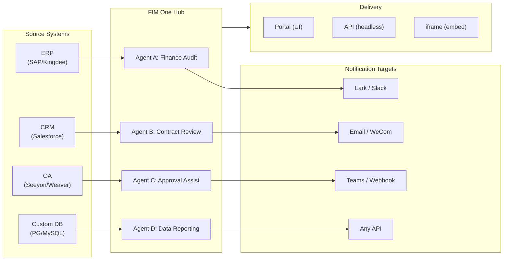

> 目标：构建一个**AI 驱动的连接器中心** — 独立门户（门户助手）、副驾驶（嵌入主机系统）、中心（跨系统中央编排）。
>
> 原则：**提供商无关**（无供应商锁定）、**最小抽象**、**协议优先**、**连接器优先**（集成是核心价值）。

## 产品愿景

FIM One 是一个 **AI 连接器中心**，提供三种渐进式模式：

```
Standalone   → 您自己的 AI 助手 (Portal)
Copilot      → AI 嵌入到主系统中 (iframe / widget / embed)
Hub          → 中央跨系统编排 (Portal / API)
```

**Hub 模式是核心差异化优势。** 企业客户拥有遗留系统——ERP、CRM、OA、财务、HR——需要通过 AI 相互通信：



**GTM 路径：先着陆后扩展**

| 步骤 | 模式 | 发生的事情 |
|------|------|-------------|
| 着陆 | Copilot | 嵌入到一个系统中，在其 UI 内证明价值 |
| 扩展 | Copilot → Hub | 推广到更多系统；Hub 聚合它们 |

## 已发布的版本

### v0.1 (2026-02-22) — MVP: ReAct + DAG Planner
- ReActAgent with tools (calculator, python_exec, web_search)
- DAG Planner (LLM generates dependency graphs)
- Portal UI with streaming + KaTeX

### v0.2 (2026-02-24) — 多模型 + 记忆
- 重试 / 速率限制 / 使用情况跟踪
- 原生函数调用（无仅 JSON 解析）
- 多模型支持（快速 + 主 LLM）
- 记忆：WindowMemory、SummaryMemory
- FastAPI 后端与 SSE 流式传输

### v0.3 (2026-02-25) — Web Tools + MCP
- Web tools (web_search, web_fetch) via Jina/Tavily/Brave
- File operations tool
- MCP client (standard tool integration)
- Tool auto-discovery + categories
- DAG visualization with click-to-scroll
- Code exec in Docker (`--network=none`)

### v0.4 (2026-02-25) — 多轮对话 + 智能体
- 多轮对话（DbMemory）
- 工具步骤折叠 UI
- HTTP 请求 + shell 执行工具
- 智能体管理（创建、配置、发布）
- JWT 身份验证
- 按智能体执行模式 + 温度控制

### v0.5 (2026-02-28) — 完整 RAG + 基础生成
- 完整 RAG 管道（嵌入 + 向量存储 + FTS + RRF + 重排序器）
- 基础生成（引用、置信度分数）
- 知识库文档管理（CRUD、搜索、重试、模式迁移）
- ContextGuard + 固定消息（令牌预算管理器）
- DbMemory 持久化 + LLM Compact
- DAG 重新规划（最多 3 轮）

### v0.6 (2026-03-01) — 连接器平台
- **连接器 CRUD**: 创建、读取、更新、删除
- **ConnectorToolAdapter**: 将连接器转换为 BaseTool
- **按用户凭证**: AES-GCM 加密
- **确认门**: 写入操作审批
- **审计日志**: 所有工具调用记录
- **断路器**: 故障时优雅降级
- **实用工具**: email_send、json_transform、template_render、text_utils
- **嵌入选项**: Jina、OpenAI、自定义提供商

### v0.7 (2026-03-06) — 管理平台 + 多租户
- **管理平台**: 用户管理、角色切换、密码重置、账户启用/禁用
- **邀请制注册**: 三种模式（开放/邀请/禁用）+ 邀请码 CRUD
- **存储管理**: 按用户磁盘使用量、清除、孤立文件清理
- **对话审核**: 管理员列表/删除所有对话
- **按用户强制登出**: 撤销所有令牌
- **API 健康仪表板**: 系统统计、连接器指标
- **首次运行设置向导**: 引导式管理员账户创建
- **个人中心**: 按用户全局指令、语言偏好
- **JWT 认证**: 基于令牌的 SSE 认证、对话所有权
- **全局 MCP 服务器**: 管理员配置、在所有会话中加载
- **向后兼容**: registration_enabled → registration_mode 自动迁移

### v0.7.x (2026-03-07 to 2026-03-12) — 稳定性 + 打磨
- 邀请码管理
- 按用户配额（429 强制执行）
- 结构化审计日志
- 敏感词过滤
- 管理员登录历史
- 管理员文件浏览器
- 增强的管理员视图（model_name、tools、kb_ids 字段）
- Docker Compose 部署（单个镜像、命名卷）
- OAuth 自动检测（来自 window.location）
- 扩展思考/推理支持（`LLM_REASONING_EFFORT`、`LLM_REASONING_BUDGET_TOKENS`）支持 OpenAI o 系列、Gemini 2.5+、Claude
- 管理员按工具启用/禁用（禁用的工具在运行时从聊天中排除）
- MCP 服务器管理移至连接器页面
- 双数据库支持：SQLite（零配置默认）+ PostgreSQL（生产环境）；Docker Compose 自动配置 PostgreSQL
- 模型配置文档页面，包含每个提供商的扩展思考设置
- SSE 协议 v2：实时答案流式传输，包含 `delta_reasoning`、`usage` 字段，以及拆分的 `done`/`suggestions`/`title`/`end` 事件；SQLite 连接池大小 5 -> 20
- AI Builder 扩展：7 个新的构建器工具（GetSettings、TestConnection、ImportOpenAPI 用于连接器；ListConnectors、AddConnector、RemoveConnector、SetModel 用于智能体），智能体上的 `is_builder` 标志，构建器提示自动刷新，SSRF 防护
- SSE v2 前端：流式点脉冲光标，DAG 重新规划轮快照作为可折叠卡片，DAG 布局与步骤状态解耦
- AI Builder 概念文档页面，包含连接器和智能体构建器指南
- 组织系统：完整的 CRUD 操作，基于角色的成员资格（所有者/管理员/成员），管理员管理 UI
- 三层资源可见性（个人/组织/全局）用于智能体、连接器、知识库、MCP 服务器
- 发布/取消发布 API 用于所有资源类型；已发布智能体的所有者委派
- 管理员设置可见性端点（替换克隆到全局）；统一的 `build_visibility_filter()` 查询助手
- 数据库连接器（第 1-3 阶段）：直接 SQL 访问 PG/MySQL/Oracle/SQL Server + 中文遗留数据库；模式内省、AI 注释、只读查询执行、加密凭证、每个连接器 3 个工具（`list_tables`、`describe_table`、`query`）
- **评估中心**：定量智能体质量基准测试 — 测试数据集 CRUD（提示 + 预期行为 + 断言），评估运行（并行执行 + LLM 评分器 + 每个案例的通过/失败/延迟/令牌结果），带自动轮询的结果查看器；迁移 `r8t0v2x4z567`
- 三个模型角色（通用/快速/推理）具有按层级的环境配置隔离；快速模型不再继承主模型设置
- `StepOutput` 数据类替换纯字符串步骤结果，用于结构化数据和工件传递
- DAG 执行的工具缓存 — 每次运行中相同的工具调用缓存，具有异步锁雷鸣羊群防护（`DAG_TOOL_CACHE`）
- 按步骤 LLM 验证，失败时重试 1 次（`DAG_STEP_VERIFICATION`）
- 自动路由：快速 LLM 将查询分类为 ReAct 或 DAG；`/api/auto` 端点；前端 3 向模式切换（`AUTO_ROUTING`）
- [x] ~~**影子市场组织 + 资源订阅**~~：内置市场组织（影子，无自动加入）替换平台组织；通过市场浏览发现资源并明确订阅（拉取模型）；用于订阅共享资源的市场 API；发布到市场始终需要审查；资源订阅表；基于组织的资源共享替换全局可见性
- [x] ~~**智能体自动发现和子智能体绑定**~~：智能体上的 `discoverable` 标志；`sub_agent_ids` 白名单；CallAgentTool 用于委派任务给专家智能体
- [x] ~~**MCP 服务器凭证 + 按用户覆盖**~~：`mcp_server_credentials` 表；`PUT /api/mcp-servers/{id}/my-credentials` 端点；凭证回退行为的 `allow_fallback` 标志
- [x] ~~**连接器/知识库切换**~~：`POST /api/connectors/{id}/toggle` 和 `POST /api/knowledge-bases/{id}/toggle` 用于暂停/恢复资源
- [x] ~~**独立知识库对话**~~：对话上的 `kb_ids` 字段，用于直接知识库聊天，无需智能体绑定

### v0.8 (2026-03-20) — 连接器声明式配置 + 渐进式披露
- [x] **数据库连接器**: 直接 SQL 访问 (PostgreSQL, MySQL, Oracle) *(在 v0.7.x 中发布 — 第 1-3 阶段)*
- [x] **RBAC**: 按用户/角色连接器访问控制 *(在 v0.7.x 中发布 — 组织系统 + 三层可见性)*
- [x] **连接器凭证加密 + 按用户覆盖**: `connector_credentials` 表，通过 `CREDENTIAL_ENCRYPTION_KEY` 进行 Fernet 加密，`allow_fallback` 标志，`GET/PUT/DELETE /my-credentials` 端点，聊天工具加载中的按用户凭证解析
- [x] **发布审核 UI**: 组织级发布审核系统 — 按组织审核切换，带有批准/拒绝工作流的 ReviewsSheet，资源卡上的状态徽章，发布对话框中的审核通知，被拒绝资源的重新提交
- [x] **连接器渐进式披露 (第 1-2 阶段)**: 单个 `ConnectorMetaTool` 替代按操作工具；系统提示词仅接收轻量级**存根** (名称 + 单行描述，约 30 tokens/连接器 vs 约 250 tokens/操作)；智能体调用 `discover(connector)` 按需加载完整操作架构 — 架构仅在模型选择连接器时加载，保持提示词前缀稳定以便缓存。遵循现代智能体框架中常见的延迟工具加载模式。`execute` 子命令；向后兼容性的功能标志。
- [x] **智能体技能系统 + 紧凑指令**: 智能体指令的按需技能加载 — `Skill` 模型 (名称、内容/SOP、可选脚本) 附加到智能体；在系统提示词中仅按名称引用 (~10 tokens/技能)；智能体调用 `read_skill(name)` 按需加载完整内容。将每次对话指令 token 成本降低约 80%，同时允许更丰富的 SOP 库。与 ConnectorMetaTool 的渐进式披露在指令级别的对应物。启用"指令 + 工具 + 技能"差异化故事。还向 Agent 模型添加 `compact_instructions` 字段 — 按智能体压缩优先级列表注入到 `ContextGuard` 中进行压缩 (例如，"保留订单 ID 和金额，删除原始 API 响应")，替换当前的静态通用提示词。遵循现代智能体框架中广泛采用的紧凑指令约定。
- [x] **连接器导入/导出**: 共享连接器模板
- [x] **连接器分叉**: 克隆 + 自定义现有连接器
- [x] **工作流第 2 阶段节点**: Iterator、Loop、VariableAggregator、ParameterExtractor、ListOperation、Transform、DocumentExtractor、QuestionUnderstanding、HumanIntervention — 9 种高级节点类型，具有完整的前端 + 后端 + 150 个新测试 (总计 275 个)。节点重试，指数退避，安全表达式评估。带成功率条的统计面板。12 个内置模板。窗格上下文菜单 (粘贴、全选、适应视图、自动布局)。
- [x] **工作流第 3 阶段节点: SubWorkflow + ENV** — 2 种新节点类型 (总计 25 个节点)，14 个新测试 (总计 306 个)，14 个内置模板。SubWorkflow: 完整的数据库支持的嵌套工作流执行器，具有目标工作流选择、变量映射和可配置的深度限制以防止无限递归。ENV: 使用密钥选择器和回退默认值读取加密的环境变量。完整的前端 (节点组件、配置面板、调色板条目、小地图颜色)。按节点执行统计面板 (成功率、持续时间、按最差优先排序的失败计数)。`getNodeStats` API 客户端 + `NodeStatEntry` 类型。键盘快捷键对话框 (`?` 键)。
- [x] **工作流计划触发器**: 按工作流 cron 配置，带时区、默认输入和下次运行时间计算。预设 cron 按钮，30 个触发器测试。
- [x] **工作流 API 触发器**: 公共按工作流 API 密钥 (`wf_` 前缀) 用于外部执行，无需用户身份验证，带速率限制。API 密钥管理对话框，带生成/重新生成/撤销、触发器 URL 和 cURL/JS 示例。
- [x] **工作流批量执行**: `POST /batch-run`，最多 100 个输入集，可配置的并行度 (1-10)，可折叠的按项结果，JSON 导出。14 个批量执行测试。
- [x] **工作流执行日志查看器**: 运行面板中的实时按时间顺序 SSE 事件流，带时间戳、彩色徽章和事件类型过滤切换。
- [x] **工作流运行统计**: 后端通过 GROUP BY 子查询批量获取运行计数和成功率；前端在工作流卡上显示统计信息，带彩色编码的成功率指示器。
- [x] **工作流调度程序守护程序**: 后台异步服务，每 60 秒轮询一次到期的基于 cron 的工作流。Croniter 时区支持、信号量并发、`last_scheduled_at` 跟踪、webhook 传递。14 个测试。
- [x] **工作流导入冲突解析器**: 在导入期间检测未解决的智能体/连接器/KB/MCP 引用。批量数据库查询，具有可见性过滤，前端 toast 警告。17 个测试。
- [x] **工作流测试节点执行**: 使用模拟变量的隔离单节点测试，集成到编辑器中 (配置面板测试按钮 + 上下文菜单)。23 个测试。
- [x] **工作流版本差异**: 并排蓝图比较，带节点/边变化检测，彩色编码指示器 (添加/删除/修改)。
- [x] **工作流运行管理**: 删除单个运行 (`DELETE /runs/{run_id}`) 和清除所有已完成的运行 (`DELETE /runs`)，带前端确认对话框。
- [x] **工作流运行重放叠加层**: 运行历史中的"在画布上查看"按钮，将过去的执行结果叠加在画布上，显示按节点状态和输出，无需重新执行。
- [x] **工作流收藏/固定**: 将工作流星标/固定到列表顶部，具有 localStorage 持久化。
- [x] **工作流运行历史导出**: 将运行历史导出为 JSON 文件下载，具有完整的运行元数据和按节点结果。
- [x] **管理员工作流管理**: 用于管理所有用户工作流的管理面板选项卡 — 列表、切换活跃/非活跃、带确认的删除。用于删除、切换和发布的批量端点，带审计日志。
- [x] **工作流模板系统**: `WorkflowTemplate` ORM 模型，具有管理员 CRUD、公共列表/克隆 API 和 5 个种子模板，在首次启动时自动插入。
- [x] **工作流内联验证徽章**: 画布上的实时按节点 `ValidationBadge`，带错误/警告工具提示，用于编辑期间的即时视觉反馈。
- [x] **工作流执行跟踪查看器**: 基于时间线的跟踪查看器 Sheet，带引擎 `trace_level` 参数和按节点变量快照，用于逐步调试。
- [x] **工作流速率限制和超时**: 按用户 `WorkflowRateLimiter` (滑动窗口 10 runs/min、3 并发) 和默认 10 分钟全局运行超时。
- [x] **工作流蓝图系统**: 用于设计和执行多步自动化蓝图的可视化工作流编辑器 — `Workflow` / `WorkflowRun` ORM 模型，完整的 CRUD + SSE 执行 API、导入/导出、复制、蓝图验证端点、`WorkflowEngine`，具有拓扑排序 + 基于信号量的并发 + 条件分支和 12 种节点类型 (Start、End、LLM、ConditionBranch、QuestionClassifier、Agent、KnowledgeRetrieval、Connector、HTTPRequest、VariableAssign、TemplateTransform、CodeExecution)、`VariableStore`，具有 `{{node_id.output}}` 插值和 `env.*` 命名空间、按节点错误策略 (STOP_WORKFLOW / CONTINUE / FAIL_BRANCH)，具有按节点超时和高级配置 UI、React Flow v12 可视化编辑器，具有拖放调色板 + 节点配置面板 + 变量选择器组合框 + 边上添加节点 + 自动布局 (ELK.js) + 运行历史 sheet、Dify 风格的紧凑节点设计，具有基于环的运行状态样式和动画边过渡、4 个内置启动模板 (简单 LLM 链、条件路由器、知识增强 QA、HTTP API 管道)，具有模板选择器对话框和 `GET /templates` + `POST /from-template` API、统计端点、`?run=true` URL 参数自动打开、基于子进程的代码执行安全、105 测试套件 (模板、eval 命名空间展平、蓝图验证警告、节点/边删除、导入/导出/复制、死锁检测、多条件分支)
- [x] **操作审计**: 详细的谁做了什么的日志 — 添加了管理员审核日志审计选项卡 (按组织/资源发布审核跟踪)
- [x] **语义架构注释**: 使用 `semantic_tag`、`description` 和 `pii` 标志扩展连接器架构字段；注释在 LLM 工具描述中显示，以便智能体理解字段意图，无需从列名猜测

### v0.8.1 (2026-03-29) — 渐进式信息披露成熟度 + ReAct 强化
- DB 连接器（`DatabaseMetaTool`）、MCP 服务器（`MCPServerMetaTool`）和按需工具加载（`request_tools` 元工具）的渐进式信息披露
- DAG 质量全面改进（5 项改进：模型升级、技能自动发现、引用验证器、结构化内容保留、领域感知路由）
- ReAct 中的领域模型升级（专业领域自动升级到推理模型）
- 按模型原生函数调用切换（`tool_choice_enabled`）
- ReAct 循环检测（确定性重复工具调用防止）
- ReAct 完成清单（使用工具时的答案前验证）
- 资源分叉第 1 阶段（MCP 服务器 + 技能分叉端点，带血缘追踪）
- 工作流连接依赖自动订阅（递归子工作流依赖解析）
- 预构建解决方案模板（首次注册时向市场植入 8 个垂直解决方案）
- 管理员通知改进（时区感知、主开关、SMTP 回复地址）
- 按轮次令牌预算断路器（`REACT_MAX_TURN_TOKENS`）
- 集中式工具截断、动态系统提示预算
- 文件附件下载、重复消息提交修复

### v0.8.2 (2026-04-10) — 智能体核心强化 + 视觉文档处理
- **智能体核心第0阶段** — 紧凑提示词升级为9段结构化格式；空工具结果保护（使用描述性消息而非 `(no output)`）；反循环提示词 + 循环检测阈值降低至2；域分类器 + 预检DB配置解析并行化（每个请求节省400–1100毫秒）；SSE `end` 事件在答案后立即发送，标题/建议移至后台任务
- **智能体核心第1阶段（上下文反膨胀）** — `MicroCompact` 基于规则的旧工具结果清理（保留最后6条）；`REACT_TOOL_RESULT_BUDGET=40000` 聚合上限；上下文溢出时反应式紧凑（自动紧凑至50%预算并重试，而非崩溃）
- **智能体核心第2阶段（速度）** — 基于关键词的工具预选（在明显匹配时跳过LLM调用，节省200–500毫秒）；`SharedHttpClient` LLM连接池；答案>200 token时跳过完成检查；`FallbackLLM` 包装主LLM+快速LLM，在429/503/529/连接错误时自动故障转移
- **智能文档处理（视觉感知）** — 自适应文档处理：PDF页面通过PyMuPDF为视觉能力模型（GPT-4o、Claude 3/4、Gemini）渲染为图像，通过pdfplumber提供纯文本回退。按模型 `supports_vision` 标志。通过 `DOCUMENT_PROCESSING_MODE`、`DOCUMENT_VISION_DPI`、`DOCUMENT_VISION_MAX_PAGES` 控制模式。DOCX/PPTX嵌入图像提取。跨对话轮次的多轮视觉持久化。智能PDF处理（文本丰富页面提取文本+图像；扫描页面渲染为全页PNG）。预构建沙箱镜像（`Dockerfile.sandbox`），包含用于 `--network=none` 代码执行的常见数据科学包
- **资源分支完成** — 智能体/连接器/工作流分支端点已添加，完成五类系统血缘追踪（KB分支已移除——本质上是用户本地的）
- **文件完整性护栏** — 系统提示词规则防止智能体在目标文件不可读时替换无关文件内容；上传的文件现在在消息上下文中包含 `file_id`，用于直接 `read_uploaded_file` 访问

### v0.8.3 (2026-04-16) — 通用文档转换 + 智能体核心第 3 阶段
- **通用文档转换（`convert_to_markdown` + OCR）** — 内置智能体工具，封装 Microsoft MarkItDown；将 PDF、Word、Excel、PowerPoint、HTML、JSON、CSV、XML、ZIP、EPUB、Outlook .msg、图像、音频、YouTube URL 转换为 Markdown。`LiteLLMOpenAIShim` 通过任何支持视觉的 LLM（Claude、Gemini、Bedrock、Azure）启用 OCR。支持视觉的 RAG 摄取，具有零回归纯文本降级方案。`LLM_SUPPORTS_VISION` 环境变量用于选择退出
- **智能体核心第 3 阶段（运行时不变量强化）** — 对话恢复（悬空 `tool_use` 自动修复）；结构化紧凑工作卡（`WorkCard` 跨压缩轮的类型化合并）；轮级分析器（`REACT_TURN_PROFILE_ENABLED`）；每用户速率限制（`LLM_RATE_LIMIT_PER_USER`）；包含 `tool_calls` 的空内容助手消息不再被丢弃

### v0.8.4 (2026-04-17) — 提示词缓存 + 推理正确性
- **系统提示词部分注册表与缓存断点** — 记忆化的 `PromptRegistry` 将系统提示词分为稳定前缀 + 动态后缀；支持缓存的提供商（Claude、Bedrock Anthropic、Vertex Claude）在前缀上接收 `cache_control: {"type": "ephemeral"}`，实现约 60-80% 的每轮输入 token 节省。不支持缓存的提供商获得单个连接的消息（零行为变化）
- **提示词缓存可观测性** — `cache_read_input_tokens` 和 `cache_creation_input_tokens` 通过 `UsageSummary` → `TurnProfiler` → `done_payload.cache` 字段进行追踪；每轮结构化 `turn_cache` 日志行。同时用作中继缓存诚实性探针
- **对话恢复 MVP** — 合成 `tool_result` 行在中断轮次后持久化；`POST /chat/resume` 从单调游标重放缓存的 SSE 事件；前端 `useSseResume` hook 自动重连，指数退避（300ms → 1s → 3s，最多 3 次尝试）并显示"重新连接中…"指示器
- **思考块持久化与签名** — `reasoning_content` + Anthropic `signature` 持久化在 `metadata_["thinking"]` 中并在后续轮次重放；修复 Claude 4 多轮对话中的 HTTP 400 签名不匹配问题
- **提供商感知推理重放策略** — `core/prompt/reasoning.py` 中的集中式 `reasoning_replay_policy()` 按提供商族系控制序列化：Claude 重放带签名的思考块；DeepSeek-R1/Qwen-QwQ/Gemini-thinking/o-series 在出站时删除 `reasoning_content`（之前泄露，破坏提供商 KV 缓存并违反 API 文档）

## 计划版本

### v0.9 — 可观测性 + 生产级强化

**目标**: 生产级运维、调试和监控。引入**Hook 系统** — 一个确定性执行层，位于智能体指令下方，无法被 LLM 覆盖。

- [ ] **连接器渐进式披露（第 3-4 阶段）**: 统一的 `ConnectorExecutor` 接口（API/DB/MCP 在一个抽象后）；使用 `jsonschema` 进行操作参数验证；协议无关的发现/执行
- [ ] **YAML/JSON 连接器配置**: 平台自动生成 MCP 服务器
- [ ] **数据库连接器第 4 阶段**: 企业级驱动 — Oracle (`oracledb`)、SQL Server (`aioodbc`)、[x] 达梦 DM8（原生 `dmPython`）、[x] 人大金仓 KingbaseES + 瀚高 HighGo（PG 兼容，复用 `asyncpg`）、南大通用 GBase（`aioodbc` + GBase ODBC）
- [ ] **IM 频道集成（双向）**: **第 1 阶段 — 出站推送**: Lark、WeCom、Slack、Email、Teams 通知操作来自智能体/工作流结果。**第 2 阶段 — 入站触发**: 用户在 IM 群聊中 @mention 智能体以触发任务，无需打开 Portal；每个频道的 webhook 接收器；每个 IM 频道建模为具有双向操作的连接器（发送 + 接收）。Hub 模式杀手级功能

#### 公开 API（第 2 阶段）

第 1 阶段（已发布）：API 密钥认证中间件、作用域支持、精选 OpenAPI 规范、Mintlify API 参考文档及交互式演练场。

- [ ] **按密钥速率限制** — 每个 API 密钥可配置的请求/分钟和请求/天限制；`429 Too Many Requests` 响应包含 `X-RateLimit-*` 标头
- [ ] **按密钥使用配额** — 月度令牌/请求预算，包含管理员仪表板和阈值告警
- [ ] **按端点的作用域强制执行** — 所有受保护端点上的 `require_scope("chat")` 依赖；具有 `scopes=chat` 的密钥只能访问聊天相关 API
- [ ] **API 版本控制** (`/v1/...`) — 稳定的版本化 API 契约；日落端点的弃用标头
- [ ] **Webhook 回调** — 为每个 API 密钥注册 webhook URL；接收对话完成、智能体错误和异步任务结果的 POST 通知
- [ ] **SDK 生成** — 从 OpenAPI 规范自动生成 Python 和 TypeScript 客户端 SDK；发布到 PyPI 和 npm
- [ ] **开发者门户** — Mintlify 文档中的交互式"试用"面板；密钥所有者可见的使用分析
- [ ] **API 密钥轮换** — 一键密钥轮换，包含宽限期（轮换后旧密钥有效期为 24 小时）
- [ ] **批量/异步 API** — `POST /api/batch` 接受最多 100 个查询；返回 `batch_id` 用于轮询结果；适用于批量知识库查询或多智能体编排
- [ ] **外部依赖的断路器** — 防止下游 LLM 提供商或连接器不可用时的级联故障；自动回退和恢复

#### 可观测性与智能体运行时

- [ ] **智能体追踪层（可观测性++）**: 应用级运行/追踪/线程层级，用于智能体调试——每个对话 → `Trace`，每个 LLM 调用/工具调用/DAG 步骤 → `Span`，包含输入/输出/token/时序。前端追踪查看器，具有时间线和可展开的 LLM 调用载荷。这超越了 OTel（基础设施级）的范围，为开发者和企业客户提供可操作的智能体循环调试。OpenTelemetry 导出作为数据接收选项。参考 LangSmith 的运行/追踪/线程概念建模——行业验证的智能体可观测性模式。
- [ ] **指标仪表板**: 延迟、成功率、token 使用、连接器调用分析——按智能体、按用户、按组织分解
- [x] ~~**断路器**: 三态机（关闭/打开/半开），具有按连接器故障跟踪、5xx 检测和监控端点~~ *（v0.8 提前发布）*
- [x] ~~**工作流运行保留清理**: 后台清理任务，具有可配置的最大年龄和每个工作流的最大计数；按工作流覆盖；管理员手动触发端点~~ *（v0.8.1 发布）*
- [x] ~~**工作流版本变更摘要**: `compute_blueprint_diff()` 在版本保存时从蓝图差异自动生成人类可读的摘要~~ *（v0.8.1 发布）*
- [x] ~~**DAG 质量大修**: 非快速步骤的默认模型升级；规划中的技能自动发现；法律/医疗/金融领域的引用验证器；结构化内容上下文保留；路由器中的域分类，具有域感知的模型选择~~ *（v0.8.1 发布）*
- [x] ~~**ReAct 中的域模型升级**: 专业领域自动升级到推理模型，具有强制网络搜索和引用验证~~ *（v0.8.1 发布）*
- [x] ~~**按模型原生函数调用切换**: `tool_choice_enabled` 设置让模型跳过强制工具选择，直接进入 JSON 模式~~ *（v0.8.1 发布）*
- [x] ~~**DatabaseMetaTool（数据库连接器的渐进式披露）**: 单个 `database` 元工具，具有 `list_tables`/`discover`/`query` 子命令，替代每个数据库连接器的 3N 个单独工具；通过 `DATABASE_TOOL_MODE` 环境变量配置（`progressive` 默认，`legacy` 回退）~~ *（v0.8.1 发布）*
- [x] ~~**通过 `request_tools` 元工具按需工具加载**: 当智能选择后有 >12 个工具可用时，LLM 可以在对话中动态加载额外工具；在 JSON 和原生函数调用模式中都有效~~ *（v0.8.1 发布）*
- [x] ~~**MCPServerMetaTool（MCP 的渐进式披露）**: 单个 `mcp` 元工具，具有 `discover`/`call` 子命令，替代 N*M 个单独的 MCP 工具；通过 `MCP_TOOL_MODE` 环境变量配置（`progressive` 默认，`legacy` 回退）~~ *（v0.8.1 发布）*
- [x] ~~**工作流连接依赖自动订阅**: 扩展 Market 订阅级联，自动订阅工作流的连接依赖（API 连接器、MCP 服务器）。工作流节点可以引用连接器、MCP 服务器、智能体（递归引用更多依赖）和子工作流——完整树中的所有连接依赖必须在订阅时自动订阅，在取消订阅时级联清理。由于递归子工作流解析和循环检测，比技能/智能体更复杂。解决方案（技能/智能体）连接依赖自动订阅的对应物~~ *（v0.8.1 发布）*
- [x] ~~**工作流真实执行器**: 用完整实现替换 MCP 和 BuiltinTool 节点执行器存根（MCP 服务器发现 + 工具调用；ToolRegistry 集成）~~ *（v0.8.1 发布）*
- [ ] **智能体钩子系统**: 在 **LLM 循环外** 运行的确定性强制层——钩子在工具事件上自动执行，不能被智能体指令绕过。三个钩子点：`PreToolUse`（执行前验证/阻止）、`PostToolUse`（执行后副作用）、`SessionStart`（注入动态上下文）。内置钩子：每个连接器调用时自动写入 `ConnectorCallLog`（当前手动）；当组织处于只读模式时阻止写操作；在代理之前自动截断超大 DB 查询结果；按连接器调用频率限流。用户定义的钩子：按智能体 YAML 配置（`hooks:` 字段），声明在匹配工具事件上触发的 shell 命令或 Python 可调用对象——跨现代智能体框架共享的基于钩子的强制模式。关键设计原则：**钩子用于"必须始终发生"的逻辑，不应依赖 LLM 记住去做**。指令说"记录所有调用"；钩子实际记录它们。指令说"不在只读模式下写入"；钩子实际阻止它。
- [ ] **智能体工作区（持久智能体桌面）**: 三层：(1) **工具输出卸载** ——自动保存超大工具响应（>8K 字符）到 `workspace://` 文件，返回截断预览 + URI；内置工具 `read_workspace_file`、`list_workspace_files`、`write_workspace_file` 用于选择性访问和智能体生成的工件。(2) **交接笔记** ——`write_handoff(summary)` 用于跨压缩/会话切换的上下文转换。(3) **工作区 UI** ——前端文件浏览器面板，每个对话一个（预览文本/JSON/CSV、下载、删除/重命名）；跨会话文件保留；按用户存储配额集成。扩展适配器中的 `truncate_tool_output()` + `GET /api/conversations/{id}/workspace` 端点
- [x] **智能文件内容注入 + `read_uploaded_file` 工具**: 小上传文件（`<32K` 字符）自动内联到 LLM 上下文；大文件获取元数据 + 工具提示。双模式 `read_uploaded_file` 工具（分页读取 + 正则搜索）。`GET /api/files/{file_id}/content` 端点、`.content` 侧车存储、文件 API 响应中的 `content_length`
- [x] ~~**智能文档处理（视觉感知）**: 自适应文档处理——PDF 页面通过 PyMuPDF 为视觉能力强的模型（GPT-4o、Claude 3/4、Gemini）渲染为图像；通过 pdfplumber 进行纯文本回退。Admin 中按模型 `supports_vision` 标志。两种模式（视觉/文本）通过 `DOCUMENT_PROCESSING_MODE` 环境变量配置。智能 PDF 处理：文本丰富的页面提取文本 + 嵌入图像（token 高效），扫描页面渲染为全页 PNG。DOCX/PPTX 嵌入图像提取。多轮视觉持久化。预构建沙箱镜像（`Dockerfile.sandbox`）。缓存页面渲染，带 `.pages/` 侧车。~~ *（v0.8.2 发布）*
- [x] ~~**通用文档转换（`convert_to_markdown` + OCR）** ——内置智能体工具，包装 Microsoft MarkItDown，默认对每个智能体可用。将 PDF、Word、Excel、PowerPoint、HTML、JSON、CSV、XML、ZIP、EPUB、Outlook .msg、图像、音频、YouTube URL 和数据 URI 转换为对话中的干净 Markdown。Office 文件和扫描 PDF 页面中的嵌入图像通过官方 `markitdown-ocr` 插件使用工作区的视觉能力强的 LLM（DB 优先，ENV 回退）自动进行 OCR。相同的转换内核由 RAG 摄取管道共享，因此聊天时转换和知识库摄取生成字节相同的 Markdown。非 OpenAI 提供商（Claude、Gemini、Bedrock、Azure）通过 `LiteLLMOpenAIShim` 透明支持，该 shim 将任何 FIM One LLM 呈现为 openai-SDK 形状的客户端，然后通过 LiteLLM 路由。零回归回退：当没有可用的视觉模型时，纯文本提取继续完全相同。~~ *（v0.8.3 发布）*
- [ ] **跨会话文件管理**: 文件浏览器 UI、存储配额、自动过期清理
- [ ] **会话级文件关联**: 跟踪哪些文件在哪些对话中使用
- [ ] **跨会话对话回忆**: 智能体工具列出、搜索和读取过去的对话历史——`list_conversations`、`search_conversations`（跨历史的关键字/正则表达式）、`read_conversation`（检索完整线程）。启用"我们上次讨论了什么"和"找到我上周要求的 API 更改"工作流。与跨会话文件管理配对，形成完整的长期智能体记忆层
- [ ] **沙箱强化**: v2 改进代码执行隔离
- [ ] **性能测试**: 并发负载基准
- [ ] **MCP 连接池**: 按请求 STDIO 子进程生成不可扩展——100 个并发用户 = 每个 MCP 服务器 100 个子进程。使用按用户环境隔离的池 STDIO 连接（由 `(server_id, env_hash)` 键控）；SSE/HTTP 传输共享 `httpx.AsyncClient` 会话。目标：池 STDIO 的 `≤100 ms` 热启动，无论用户数如何，每个 MCP 服务器 O(1) HTTP 连接
- [ ] **内部工具基准** ——用于量化工具参数变化（系统提示词、自反思频率、工具选择阈值）的内置测试套件，使用 EVAL CENTER 基础设施
- [x] ~~**ReAct 循环检测** ——确定性重复工具调用检测，具有可配置的阈值；防止智能体循环，无需依赖 LLM 自我意识~~ *（v0.8.1 发布）*
- [x] ~~**ReAct 完成检查清单** ——使用工具时的一次性答前验证提示词；减少过早结论~~ *（v0.8.1 发布）*
- [x] ~~**智能体核心第 3 阶段——运行时不变量强化**: 四个错误修复/可观测性升级，解决 CC 的运行时不变量——(I.14) 对话恢复：在 `DbMemory.get_messages()` 中检测和修复来自中断轮次的悬空 `tool_use` 块，防止 HTTP 400 轨迹错误；(I.15) 结构化紧凑工作卡：将 9 部分紧凑输出解析为类型化 `WorkCard` 并跨连续压缩合并，以便错误/待处理任务在多轮中存活；(I.16) 轮次分析器：按轮次阶段级时序日志（`memory_load`/`compact`/`tool_schema_build`/`llm_first_token`/`llm_total`/`tool_exec`），由 `REACT_TURN_PROFILE_ENABLED` 门控；(I.17) 按用户限流：修复进程全局限流器为按用户键控的桶，通过 `ContextVar` 管道，由 `LLM_RATE_LIMIT_PER_USER` 门控。智能体追踪层的先决条件基础。~~ *（v0.8.3 发布）*
- [x] ~~**对话恢复（部分——MVP）**: 合成 `tool_result` 行持久化为持久 `role="tool"` DB 行；`POST /chat/resume` 在单调游标后重放缓存的 SSE 事件；前端 playground 通过 `useSseResume` 钩子自动重连，具有指数退避~~ *（v0.8.4 发布）*
- [x] ~~**系统提示词部分注册表——记忆化部分 + 缓存断点（MVP：仅 ReAct）**: `fim_one.core.prompt` 模块，具有 `PromptRegistry`、`PromptSection`、`DYNAMIC_BOUNDARY`；ReAct JSON/原生/合成路径分为静态前缀 + 动态后缀；缓存能力提供商在前缀上接收 `cache_control: {"type": "ephemeral"}`。Claude 4 轮次上 91.9%–95.9% 缓存比率~~ *（v0.8.4 发布）*
- [x] ~~**思
#### Prompt Cache + 推理 Follow-ups（来自 Batch A MVPs）

这些项目完成了 Batch A 中已发货的部分工作（对话恢复、系统提示词注册表、思考块）并将缓存覆盖范围扩展到剩余的提供商系列。

- [ ] **Gemini Context Cache Adapter**：Google Gemini 使用单独的 REST API（`POST /v1beta/cachedContents` → 返回 `cacheName` → 在后续 `generateContent` 调用中通过 `cachedContent: "<cacheName>"` 引用），而不是 Anthropic 使用的内联 `cache_control` 标记。需要一个 `GeminiCacheAdapter` 来进行生命周期管理（预注册前缀 → 引用 cacheName → TTL 感知失效），集成到 `OpenAICompatibleLLM` 的 Gemini 路径或 LiteLLM 的 Gemini 提供商中。读取折扣约 0.25×，最小前缀 32,768 tokens（Gemini Pro）/ 4,096（Flash）— 主要受益者是长上下文 KB/RAG 智能体和文档密集型工作流。
- [ ] **提示词注册表扩展到规划器 / 验证器 / 域分类器**：将 `PromptRegistry` + `DYNAMIC_BOUNDARY` 模式从 ReAct 扩展到剩余的 LLM 调用点：`DAGPlanner`、`PlanAnalyzer`、`StepVerifier`、`CitationVerifier`、`DomainClassifier`、`ExecutionModeRouter`、`CompactUtils`。目前这些在每次调用时都从头重建提示词。频率低于 ReAct，因此 ROI 较低，但完成了缓存故事。
- [ ] **按智能体 `cache_ttl` 配置**：让智能体所有者在 `ephemeral`（5 分钟，默认，写入成本低）和 `extended`（1 小时，写入成本高 2 倍但更适合批处理 / 计划工作流）之间选择。在 Agent 模型上显示为一个字段，并在支持的地方通过 `cache_control: {"type": "...", "ttl": "..."}` 传递。
- [ ] **DAG 步骤级检查点表**：当前 A1 对话恢复 MVP 持久化合成 tool_results 和缓存的 SSE 事件，但 DAG 中间步骤状态仅存在于内存中。新的 `dag_execution_step` 表快照每个步骤的 tool_calls、结果和工件引用，以便 DAG 中途断开连接可以恢复而无需重新执行已完成的步骤。与前端 `useSseResume` hook 配对以实现端到端连续性。
- [ ] **Message 上的专用 `tool_call_id` 列**：目前 `tool_call_id` 存在于 `metadata_` JSON 中，需要 `json_extract(...)` / `::json->>` 查找来进行孤立工具使用查询。对于高流量部署，一级索引列将使恢复传递以 O(log n) 而不是 O(n) 扫描运行。在规模需求之前优先级较低。
- [ ] **中流思考 token 重建**：当前恢复粒度是"下一个完整 SSE 事件"— 如果断开发生在思考 delta 内，客户端从以下事件重新启动。Token 级恢复需要重新发出飞行中思考块的缓冲 tokens。小众改进；仅当用户在不稳定连接上报告思考 UX 抖动时才值得追求。
- [ ] **API 中继缓存诚实性探针**：后台工具（管理员触发或计划）通过每个配置的中继发送两个相同的 Claude 请求，比较实际计费输入与 `cache_read_input_tokens`，并标记剥离 `cache_control` 标记或不传递 0.10× 折扣的中继。显示为工作区级别的"中继健康"信号 — 对于通过中文 API 代理路由的企业来说是有用的运营工具。

#### 可靠性后续工作（智能体核心优先级矩阵）

智能体核心集成蓝图（第0–3阶段，I.1–I.16）的主体已在v0.8.2和v0.8.3中发布。下面的项目来自仍需关注的并行优先级矩阵。

- [ ] **内容替换状态持久化**（流式传输不变量#2）："一旦看到，命运冻结"——已经发送给客户端的消息内容在恢复/重新加载时不得进行逆向变更。需要与A1的SSE游标对齐的替换账本。被阻止在理解实际用户可见的故障上；没有主动投诉。
- [ ] **附件上下文路由器**：使用`alreadySurfaced` + `readFileState`去重、聚合附件预算和活跃性检查的更智能的附件注入。防止在每个回合上重新发送相同的50KB PDF提取。与工作区文件卸载耦合（已在v0.9计划中）。
- [ ] **辅助查询工作线程（提示词工作线程池）**：用于召回/分类/摘要/会话记忆查询的专用轻量级池，以便它们不与主智能体LLM调用争夺速率限制预算。前提条件：提示词注册表扩展（上述）。

#### 生态系统与扩展

- [ ] **定时任务 + 事件触发的智能体（Loop）**：类似 cron 的后台任务触发；`scheduled_jobs` + `job_runs` 数据库表；APScheduler 集成；任务 CRUD API + 任务历史 UI；通过消息推送连接器进行结果通知。范围涵盖时间触发（cron）和事件触发（webhook 入站）两种模式——在后台异步运行的智能体就是 Hub 模式下的异步子智能体用例。
- [x] ~~**预构建解决方案模板（市场种子内容）**：首次用户注册时发布到市场的 8 个即用型垂直解决方案——财务审计、合同审查、数据报告、IT 帮助台、人力资源入职、销售助手、内容编写、会议总结。每个都包含一个智能体 + 技能和中文 SOP；通过 `ensure_solution_templates()` 幂等引导，发布到市场组织以实现即时市场可用性~~ *（已在 v0.8.1 中发布）*
- [ ] **数据库架构高级构建器**：用于大规模数据库的 AI 驱动架构管理智能体——战略性表注释（基于模式、SQL 执行信息）、按域前缀进行批量可见性管理、用于 1K–7K+ 表部署的迭代多轮注释；补充现有批量注释任务，提供选择性和业务上下文推理
- [x] ~~**资源分支（包阶段 1——v1.0 包系统的前提条件）**：所有按资源分支端点已实现——MCP Server、技能、智能体、连接器、工作流。知识库分支已移除（本质上是用户本地的）。每个 `POST /api/{type}/{id}/fork` 创建一个用户拥有的深层副本，具有 `forked_from` 血统跟踪。~~ *（已在 v0.8.1 中完成）*

**影响**：自信地大规模运行 FIM One。四大支柱：**追踪层**（查看发生了什么）、**钩子系统**（强制必须发生的事情）、**智能体工作区**（持久文件管理 + 交接）、**IM 频道**（智能体存在于用户工作的地方）。预构建解决方案模板消除冷启动；仪表板增强功能显示运营健康状况。"智能体可能遵循的指令"和"系统强制执行的保证"之间的差距已消除——这是演示和生产企业工具之间的区别。

### v1.0 — 热插拔 + 可嵌入

**目标**: 零重启连接器添加、包生态系统和嵌入式交付。

- [ ] **连接器渐进式信息披露（第5阶段）**: **语义引导工具选择**（从查询中提取实体 → 本体注册表查找 → 连接器集合缩减；50+连接器部署时可减少90%+令牌）；批处理/ETL连接器的规模模式；CLI风格通用`connector <name> <action> <params>`接口
- [ ] **跨连接器实体对齐（本体注册表）**: 定义共享实体类型（客户、订单、资产），具有跨连接器的字段映射；DAGPlanner自动解析跨系统JOIN键；启用跨连接器查询（例如，"在Salesforce中订购过Shopify的客户"），无需硬编码字段名称
- [ ] **热插拔连接器**: 上传OpenAPI规范，AI生成配置，5分钟内上线（无需重启）
- [x] ~~**市场重设计第1阶段 — 解决方案 + 组件**~~: 两层市场模型（解决方案：智能体/技能/工作流；组件：连接器/MCP服务器）；范围选择器（全球市场/组织）；统一订阅模型（组织自动出现已移除）；KB从市场范围移除；数据迁移为现有组织成员回填订阅
- [ ] **市场包系统**: 市场的可分发资源包 — 用统一打包层替换按类型的"市场"。`fim-package.yaml`清单声明：元数据（名称、版本、描述、作者、许可证、标签、`min_fim_version`）、入口点（主要技能或智能体）、资源列表（智能体、技能、连接器、知识库、MCP服务器、工作流）及其配置引用、包间依赖关系（semver范围）、所需凭证（映射到连接器引用以进行安装时收集）和带默认值的用户可配置变量。**两种消费模式**: (1) **安装** — 批量创建所有资源 + 通过ID替换自动连接内部引用；安装链接到源以获取版本更新通知；`POST /api/market/packages/{id}/install`；(2) **分叉** — 克隆为用户拥有的可编辑副本，无更新链接（这是模板模式）；`POST /api/market/packages/{id}/fork`。其他端点：发布（`POST /api/market/packages`带审查工作流）、卸载（`DELETE /packages/{id}/uninstall`带依赖检查 + 修改资源确认）、版本历史（`GET /packages/{id}/versions`）、升级（`POST /packages/{id}/upgrade`带按资源差异预览）。嵌套包需求的依赖解析器，具有冲突检测。`PackageInstallation`表跟踪每个用户安装的包及资源ID映射，用于卸载/升级。**与单个资源发布共存** — 包是组合层，不是替代品；单个连接器仍可独立发布。示例依赖树：`包：合同审查` → `技能：合同审查`（入口点）→ `智能体：合同分析师` + `智能体：风险评分员` → `知识库：法律条款` + `连接器：docusign-api` + `MCP：pdf-extractor` + `工作流：合同审批流`
- [ ] **创作者计划**: 市场货币化层 — 创作者档案及作品集页面、按包分析（安装、分叉、活跃用户、评分/评论）、当包驱动新订阅时的联盟佣金追踪。付费包层级，包含定价、购买流程和审批工作流。创作者仪表板，包含安装趋势、收入报告和用户反馈。用于程序化包发布的公共创作者API（包作者的CI/CD）。社区功能：包评论、问答、每个版本的更新日志
- [ ] **可嵌入小部件**: `<script src="fim-one.js">`注入到主机页面
- [ ] **页面上下文注入**: 小部件读取主机页面上下文（当前ID、URL、DOM选择器）
- [ ] **高级触发器**: Webhook入站事件；计划作业增强（多时区、日历感知）
- [ ] **批量执行**: 通过DAG处理1000+项目
- [ ] **企业安全**: IP白名单、静态加密、SSO
- [ ] **知识库高级编辑器**: 为管理大型知识库的高级用户提供构建器模式智能体 — 批量URL摄取、重复检测、差距分析、文档生命周期管理；使用ReAct工具循环扩展现有知识库AI聊天

**影响**: 企业在数天内从零部署FIM One到多系统编排。包系统创建创作者生态系统 — 解决方案作者发布复合包（技能 + 智能体 + 连接器 + 知识库 + 工作流），企业一键安装，创作者从采用中获利。安装/分叉二元性在单一机制中涵盖"按原样使用"和"从模板自定义"两种用例。

## 冻结功能（已发布，仅维护）

根据[正交性策略](/strategy/orthogonality-strategy)，这些功能已发布并正常运行，但不会获得新功能（仅进行错误修复）：

| 功能 | 版本 | 冻结原因 |
|---------|---------|-----------|
| ReAct 智能体 | v0.1, v0.9 | 模型现已具有原生工具调用能力。中间循环自反思（v0.9）防止长链中的目标漂移。工具观察合成质量已改进（8K 字符，可通过 `REACT_TOOL_OBS_TRUNCATION` 配置） |
| DAG 规划 / 重新规划 | v0.1, v0.5, v0.7.5 | 模型推理能力不断提升；分解逐渐变为单次完成。v0.7.5 中已发布逐步验证（`DAG_STEP_VERIFICATION`）。已加固：级联失败传播、验证器状态修复、规划器工具描述、完整重规划历史、基于白名单的工具缓存。14 个引擎常数已作为环境变量公开——不再计划新的规划原语 |
| 内存（窗口、摘要、紧凑） | v0.2, v0.5 | 上下文窗口不断增长（200K+）；对外部内存管理的需求减少 |
| RAG 管道 | v0.5 | 提供商正在原生构建检索功能（OpenAI file_search、Gemini Search Grounding） |
| 基础生成 | v0.5 | 模型在引用方面不断改进；5 阶段管道的边际价值递减 |
| ContextGuard / 固定消息 | v0.5 | 按现状发布；无新功能 |

## 考虑中（无限期延迟）

根据正交性策略，以下功能需要高投入且面临吸收风险：

| 功能 | 延迟原因 |
|---------|------------|
| 多智能体编排（深层级结构） | 提供商正在原生构建（OpenAI Swarm、Google A2A 及类似的多智能体产品）。FIM One 的 CallAgentTool 覆盖单级委托场景；事件触发的后台智能体由 v0.9 中的计划任务覆盖 |
| 智能体自修改技能（程序化记忆） | 智能体在执行期间更新自己的 `skill.md` — 高复杂度、安全/审计表面积大。取决于智能体技能系统（v0.8）首先发布。如果企业客户明确请求自改进智能体，则重新评估 |
| ~~智能体工作区（工具输出文件卸载）~~ | 升级至 v0.9。价值在于**选择性读取**，而非上下文容量 — 跨框架验证已确认。原始延迟理由（"200K+ 窗口降低紧迫性"）是错误的 |
| 跨会话长期记忆 | 上下文窗口快速增长（200K–2M）；提供商添加内置记忆（OpenAI 记忆、Gemini 上下文缓存）；实现成本高而差异化价值递减。当企业客户明确请求时重新评估 |
| 记忆生命周期（TTL、配额） | 取决于跨会话记忆；一起延迟 |
| 主动上下文压缩工具（智能体触发） | 已通过 ContextGuard（v0.5）明确冻结。200K+ 上下文窗口降低价值。除非上下文成本成为主要企业投诉，否则不会重新考虑 |
| 浏览器自动化 / 计算机使用 | 高维护成本（DOM 变化、反机器人、沙箱隔离）。行业正在汇聚于计算机使用模式（Anthropic、OpenAI Operator、Google Mariner）和 MCP 浏览器工具（Puppeteer/Playwright MCP）。通过 MCP 集成消费，不自行构建。当稳定的计算机使用 MCP 标准出现时重新评估 |
| Web 推送通知 | 浏览器原生推送通过 Service Worker + VAPID。与 IM 频道集成（v0.8）重叠，后者覆盖企业首选频道（Lark/Slack/WeCom/Email）。IM 推送具有更高的企业价值；Web 推送是仅限门户用户的锦上添花。IM 频道发布后重新评估 — 如果用户请求超出 IM 覆盖范围的浏览器通知 |

## 版本如何与模式对齐

| 版本 | 独立模式 | 副驾驶模式 | Hub | 备注 |
|---------|-----------|---------|-----|-------|
| **v0.1–v0.3** | 可用 | 尚未支持 | 尚未支持 | 仅限门户，单用户 |
| **v0.4** | 可用 | 尚未支持 | 尚未支持 | 多对话，智能体管理 |
| **v0.5** | 可用 | 尚未支持 | 尚未支持 | 知识库 + RAG |
| **v0.6** | 可用 | 可能 | 可能 | 连接器发布；副驾驶模式/Hub 可通过手动配置实现 |
| **v0.7** | 可用 | 就绪 | 就绪 | 管理平台；多租户身份验证；生产就绪 |
| **v0.8** | 可用 | 就绪 | 优化 | 每系统 RBAC + 审计日志；更易于集成 |
| **v0.9** | 可用 | 就绪 | 生产 | 可观测性、性能、加固 |
| **v1.0** | 可用 | 优化 | 企业级 | 包系统、创作者计划、热插拔、可嵌入小部件、Webhook、批处理 |

## 资源分配 (v0.8–v1.0)

正交性策略指导工作重点分配：

| 类别 | 分配比例 | 版本 | 原因 |
|----------|-----------|----------|-----|
| **连接器平台** (v0.6+) | 50% | 持续进行 | 核心差异化；无被吸收风险 |
| **企业功能** (RBAC、审计、安全、可观测性) | 30% | v0.8–v1.0 | 虽然平凡但持久；生产环境必需。智能体追踪层是商业支撑点 |
| **智能体智能** (技能系统、定时智能体) | 15% | v0.8–v0.9 | 指令+工具+技能 差异化故事；低被吸收风险——框架验证模式，但企业SOP是客户特定的 |
| **v0.1–v0.5 维护** | 5% | 持续进行 | 仅限错误修复；无新功能 |

## 指标驱动的里程碑

成功通过以下指标衡量：

| 指标 | v0.7 目标 | v0.8 目标 | v1.0 目标 |
|--------|------------|------------|------------|
| 已部署的连接器 | 5 | 20+ | 100+ |
| 企业客户 | 1–2 | 5–10 | 20+ |
| 平均连接器设置时间 | 2 周 | 2 天 | 5 分钟（热插拔） |
| 令牌效率（DAG vs ReAct-only） | 30% 降低 | 40% 降低 | 50% 降低 |
| 正常运行时间 SLA | 99.5% | 99.9% | 99.95% |
| 支持工单主题 | 集成、设置 | 连接器自定义逻辑 | 热插拔、扩展 |

## 未解决的问题 / 待定事项

- **Marketplace 审核**：如何验证社区包和个人资源？对包配置中的凭证泄露进行自动扫描？(v1.0)
- **Token 经济学**：如何为多用户、多智能体场景定价？(v1.0)
- **包版本控制**：已安装包中的破坏性更改 — 使用迁移脚本自动升级，还是每次更新都需要手动批准？依赖关系钻石问题解决方案？(v1.0)
- **包定价**：免费与付费层级、Creator Program 佣金率、支付提供商集成？(v1.0)
- **包凭证用户体验**：安装时凭证收集 — 向导式分步骤还是延迟设置？使用相同连接器类型的包之间的凭证共享？(v1.0)
- **遥测选择退出**：如何尊重隐私偏好？(v0.8)
- **连接器版本控制**：如何管理连接器 API 中的破坏性更改？(v0.8)
- **速率限制**：已发布按用户工作流速率限制（滑动窗口 10 次运行/分钟、3 个并发）。按连接器和按智能体速率限制待定 (v0.9)

