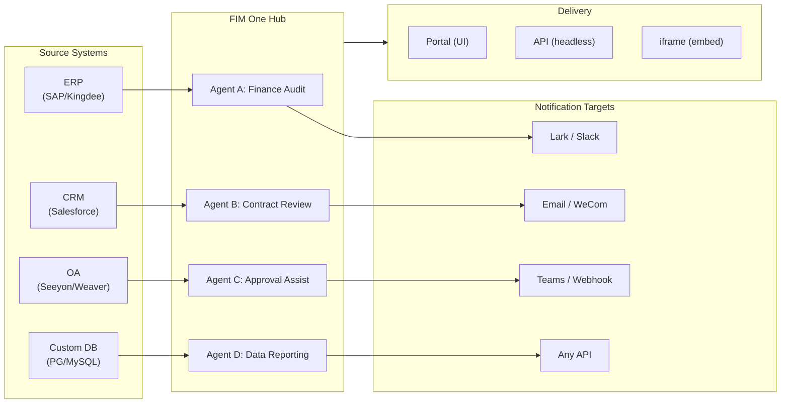

> Goal: Build an **AI-powered Connector Hub** — Standalone (portal assistant), Copilot (embedded in host system), Hub (central cross-system orchestration).
>
> Principles: **Provider-agnostic** (no vendor lock-in), **minimal-abstraction**, **protocol-first**, **connector-first** (integration is the core value).## 产品愿景

FIM One 是一个 **AI 连接器中心**，提供三种渐进式模式：

```
Standalone   → 您自己的 AI 助手 (Portal)
Copilot      → 嵌入在主机系统中的 AI (iframe / widget / embed)
Hub          → 中央跨系统编排 (Portal / API)
```

**Hub 模式是核心差异化因素。** 企业客户拥有遗留系统——ERP、CRM、OA、财务、HR——需要通过 AI 相互通信：



**GTM 路径：先着陆后扩展**

| 步骤 | 模式 | 发生的事情 |
|------|------|-------------|
| 着陆 | Copilot | 嵌入到一个系统中，在其 UI 内证明价值 |
| 扩展 | Copilot → Hub | 推广到更多系统；Hub 聚合它们 |## 已发布的版本### v0.1 (2026-02-22) — MVP: ReAct + DAG Planner
- ReActAgent with tools (calculator, python_exec, web_search)
- DAG Planner (LLM generates dependency graphs)
- Portal UI with streaming + KaTeX### v0.2 (2026-02-24) — 多模型 + 内存
- 重试 / 速率限制 / 使用情况跟踪
- 原生函数调用（无仅 JSON 解析）
- 多模型支持（快速 + 主 LLM）
- 内存：WindowMemory、SummaryMemory
- FastAPI 后端与 SSE 流式传输### v0.3 (2026-02-25) — Web Tools + MCP
- Web tools (web_search, web_fetch) via Jina/Tavily/Brave
- File operations tool
- MCP client (standard tool integration)
- Tool auto-discovery + categories
- DAG visualization with click-to-scroll
- Code exec in Docker (`--network=none`)### v0.4 (2026-02-25) — 多轮对话 + 代理
- 多轮对话（DbMemory）
- 工具步骤折叠 UI
- HTTP 请求 + shell 执行工具
- 代理管理（创建、配置、发布）
- JWT 身份验证
- 按代理执行模式 + 温度控制### v0.5 (2026-02-28) — Full RAG + Grounded Gen
- Full RAG pipeline (embedding + vector store + FTS + RRF + reranker)
- Grounded Generation (citations, conflict detection, confidence scores)
- Knowledge base document management (CRUD, search, retry, schema migration)
- ContextGuard + pinned messages (token budget manager)
- DbMemory persistence + LLM Compact
- DAG Re-Planning (up to 3 rounds)### v0.6 (2026-03-01) — Connector 平台
- **Connector CRUD**: 创建、读取、更新、删除
- **ConnectorToolAdapter**: 将 Connector 转换为 BaseTool
- **按用户凭证**: AES-GCM 加密
- **确认门**: 写入操作批准
- **审计日志**: 所有工具调用已记录
- **断路器**: 故障时的优雅降级
- **实用工具**: email_send、json_transform、template_render、text_utils
- **嵌入选项**: Jina、OpenAI、自定义提供商### v0.7 (2026-03-06) — 管理平台 + 多租户
- **管理平台**: 用户管理、角色切换、密码重置、账户启用/禁用
- **仅邀请注册**: 三种模式（开放/邀请/禁用）+ 邀请码 CRUD
- **存储管理**: 按用户磁盘使用量、清除、孤立文件清理
- **对话审核**: 管理员列表/删除全部
- **按用户强制登出**: 撤销所有令牌
- **API 健康仪表板**: 系统统计、连接器指标
- **首次运行设置向导**: 引导式管理员账户创建
- **个人中心**: 按用户全局指令、语言偏好
- **JWT 认证**: 基于令牌的 SSE 认证、对话所有权
- **全局 MCP 服务器**: 管理员配置、在所有会话中加载
- **向后兼容**: registration_enabled → registration_mode 自动迁移### v0.7.x (2026-03-07 to 2026-03-12) — 稳定性 + 打磨
- 邀请码管理
- 按用户配额（429 强制执行）
- 结构化审计日志
- 敏感词过滤
- 管理员登录历史
- 管理员文件浏览器
- 增强的管理员视图（model_name、tools、kb_ids 字段）
- Docker Compose 部署（单镜像、命名卷）
- OAuth 自动检测（来自 window.location）
- 扩展思考/推理支持（`LLM_REASONING_EFFORT`、`LLM_REASONING_BUDGET_TOKENS`）支持 OpenAI o 系列、Gemini 2.5+、Claude
- 管理员按工具启用/禁用（禁用的工具在运行时从聊天中排除）
- MCP 服务器管理移至连接器页面
- 双数据库支持：SQLite（零配置默认）+ PostgreSQL（生产环境）；Docker Compose 自动配置 PostgreSQL
- 模型配置文档页面，包含每个提供商的扩展思考设置
- SSE Protocol v2：实时答案流式传输，包含 `delta_reasoning`、`usage` 字段，以及分离的 `done`/`suggestions`/`title`/`end` 事件；SQLite 连接池大小 5 -> 20
- AI Builder 扩展：7 个新构建工具（GetSettings、TestConnection、ImportOpenAPI 用于连接器；ListConnectors、AddConnector、RemoveConnector、SetModel 用于代理），代理上的 `is_builder` 标志，构建器提示自动刷新，SSRF 防护
- SSE v2 前端：流式点脉冲光标，DAG 重新规划轮快照作为可折叠卡片，DAG 布局与步骤状态解耦
- AI Builder 概念文档页面，包含连接器和代理构建器指南
- 组织系统：完整 CRUD，具有基于角色的成员资格（所有者/管理员/成员），管理员管理 UI
- 三层资源可见性（个人/组织/全局）用于代理、连接器、知识库、MCP 服务器
- 发布/取消发布 API 用于所有资源类型；已发布代理的所有者委派
- 管理员设置可见性端点（替换克隆到全局）；统一 `build_visibility_filter()` 查询助手
- 数据库连接器（第 1-3 阶段）：直接 SQL 访问 PG/MySQL/Oracle/SQL Server + 中文遗留数据库；架构内省、AI 注释、只读查询执行、加密凭证、每个连接器 3 个工具（`list_tables`、`describe_table`、`query`）
- **评估中心**：定量代理质量基准测试 — 测试数据集 CRUD（提示 + 预期行为 + 断言），评估运行（并行执行 + LLM 评分器 + 每个案例的通过/失败/延迟/令牌结果），带自动轮询的结果查看器；迁移 `r8t0v2x4z567`
- 三个模型角色（通用/快速/推理），每层 env 配置隔离；快速模型不再继承主模型设置
- `StepOutput` 数据类替换纯字符串步骤结果，用于结构化数据和工件传递
- DAG 执行的工具缓存 — 每次运行中相同的工具调用缓存，带异步锁防止雷鸣羊群（`DAG_TOOL_CACHE`）
- 每步 LLM 验证，失败时重试 1 次（`DAG_STEP_VERIFICATION`）
- 自动路由：快速 LLM 将查询分类为 ReAct 或 DAG；`/api/auto` 端点；前端 3 向模式切换（`AUTO_ROUTING`）
- [x] ~~**平台组织 + 资源订阅**~~：内置平台组织自动加入所有用户；用于订阅共享资源的市场 API；资源订阅表；基于组织的资源共享替换全局可见性
- [x] ~~**代理自动发现和子代理绑定**~~：代理上的 `discoverable` 标志；`sub_agent_ids` 白名单；CallAgentTool 用于委派任务给专家代理
- [x] ~~**MCP 服务器凭证 + 按用户覆盖**~~：`mcp_server_credentials` 表；`PUT /api/mcp-servers/{id}/my-credentials` 端点；用于凭证回退行为的 `allow_fallback` 标志
- [x] ~~**连接器/KB 切换**~~：`POST /api/connectors/{id}/toggle` 和 `POST /api/knowledge-bases/{id}/toggle` 用于暂停/恢复资源
- [x] ~~**独立 KB 对话**~~：对话上的 `kb_ids` 字段，用于直接 KB 聊天，无需代理绑定## 计划版本### v0.8 — Connector 声明式配置 + 渐进式信息披露

**目标**: 使定义 connector 更加容易，无需编写 Python 代码，并优化工具和指令向 LLM 的暴露方式。

- [x] ~~**数据库 connector**: 直接 SQL 访问 (PostgreSQL, MySQL, Oracle)~~ *(在 v0.7.x 中发布 — 第 1-3 阶段)*
- [x] ~~**RBAC**: 按用户/角色的 connector 访问控制~~ *(在 v0.7.x 中发布 — 组织系统 + 三层可见性)*
- [x] **Connector 凭证加密 + 按用户覆盖**: `connector_credentials` 表，通过 `CREDENTIAL_ENCRYPTION_KEY` 进行 Fernet 加密，`allow_fallback` 标志，`GET/PUT/DELETE /my-credentials` 端点，聊天工具加载中的按用户凭证解析
- [x] **发布审查 UI**: 组织级发布审查系统 — 按组织审查切换，ReviewsSheet 包含批准/拒绝工作流，资源卡上的状态徽章，发布对话框中的审查通知，被拒绝资源的重新提交
- [ ] **Connector 渐进式信息披露 (第 1-2 阶段)**: 单个 `ConnectorMetaTool` 替代按操作工具；系统提示仅接收轻量级**存根** (名称 + 1 行描述，~30 tokens/connector vs ~250 tokens/action)；agent 调用 `discover(connector)` 按需加载完整操作架构 — 架构仅在模型选择 connector 时加载，保持提示前缀稳定以便缓存。镜像 Claude Code 的 `defer_loading: true` 内部模式。`execute` 子命令；向后兼容的功能标志。
- [ ] **Agent 技能系统 + 紧凑指令**: 按需加载 agent 指令的技能 — `Skill` 模型 (名称、内容/SOP、可选脚本) 附加到 agent；在系统提示中仅按名称引用 (~10 tokens/skill)；agent 调用 `read_skill(name)` 按需加载完整内容。将按对话指令 token 成本降低约 80%，同时允许更丰富的 SOP 库。与 ConnectorMetaTool 的渐进式信息披露在指令级别的对应物。启用"指令 + 工具 + 技能"差异化故事。还向 Agent 模型添加 `compact_instructions` 字段 — 按 agent 压缩优先级列表在压缩时注入到 `ContextGuard` (例如，"保留订单 ID 和金额，删除原始 API 响应")，替代当前的静态通用提示。受 Claude Code 的 Compact Instructions 模式启发。
- [ ] **YAML/JSON connector 配置**: 平台自动生成 MCP server
- [ ] **Connector 导入/导出**: 共享 connector 模板
- [ ] **Connector fork**: 克隆 + 自定义现有 connector
- [ ] **数据库 connector 第 4 阶段**: 企业驱动程序 — Oracle (`oracledb`)、SQL Server (`aioodbc`)、达梦 DM8 (`aioodbc` + DM ODBC)、南大通用 GBase (`aioodbc` + GBase ODBC)
- [ ] **消息推送**: Lark、WeCom、Slack、Email 通知操作
- [x] **操作审计**: 详细记录谁做了什么 — 添加了管理员审查日志审计选项卡 (按组织/资源的发布审查跟踪)
- [ ] **语义架构注解**: 使用 `semantic_tag`、`description` 和 `pii` 标志扩展 connector 架构字段；注解在 LLM 工具描述中显示，以便 agent 理解字段意图而无需从列名猜测

**影响**: 实施工程师 (无需 Python) 可在 1-2 小时内添加 connector。大规模工具定义和 agent 指令的 token 成本下降约 80–93%。### v0.9 — 可观测性 + 生产硬化

**目标**：生产级运维、调试和监控。引入**Hook 系统**——一个确定性执行层，位于代理指令下方，无法被 LLM 覆盖。

- [ ] **连接器渐进式披露（第 3-4 阶段）**：统一的 `ConnectorExecutor` 接口（API/DB/MCP 在一个抽象后面）；使用 `jsonschema` 进行操作参数验证；协议无关的发现/执行
- [ ] **代理追踪层（可观测性++）**：应用级运行/追踪/线程层次结构，用于代理调试——每个对话 → `Trace`，每个 LLM 调用/工具调用/DAG 步骤 → `Span`，包含输入/输出/令牌/时序。前端追踪查看器，具有时间线和可展开的 LLM 调用负载。这超越了 OTel（基础设施级）的范围，为开发者和企业客户提供可操作的代理循环调试。OpenTelemetry 导出作为数据接收选项。参考 LangSmith 的运行/追踪/线程概念建模——行业验证的代理可观测性模式。
- [ ] **指标仪表板**：延迟、成功率、令牌使用、连接器调用分析——按代理、按用户、按组织的细分
- [ ] **断路器**：指数退避、故障检测
- [ ] **代理 Hook 系统**：在 **LLM 循环外** 运行的确定性执行层——hook 在工具事件上自动执行，无法被代理指令绕过。三个 hook 点：`PreToolUse`（执行前验证/阻止）、`PostToolUse`（执行后副作用）、`SessionStart`（注入动态上下文）。内置 hook：在每个连接器调用上自动写入 `ConnectorCallLog`（目前为手动）；当组织处于只读模式时阻止写操作；在代理接收前自动截断超大 DB 查询结果；限制每连接器调用频率。用户定义的 hook：每个代理的 YAML 配置（`hooks:` 字段）声明在匹配工具事件上触发的 shell 命令或 Python 可调用对象——与 Claude Code 的 hook 模式相同。关键设计原则：**hook 用于"必须始终发生"的逻辑，不应依赖 LLM 记住执行**。指令说"记录所有调用"；hook 实际记录它们。指令说"不在只读模式下写入"；hook 实际阻止它。
- [ ] **代理工作区（工具输出卸载 + 交接）**：当 MCP/连接器/DB 工具响应超过阈值（默认：8K 字符）时，自动将完整输出保存到每对话工作区文件（`workspace://tool_result_xxx.txt`），并向代理返回截断预览 + 文件 URI。三个新的内置工具：`read_workspace_file(path, start_line, end_line)` 用于选择性访问，`list_workspace_files()` 用于发现，`write_handoff(summary)` 用于上下文转换——代理在上下文压缩或会话切换前写入结构化 HANDOFF 笔记（进度、有效内容、失败内容、下一步）；下一个代理实例读取它，而不是依赖压缩算法的摘要质量。镜像 Claude Code 的工作区 + 交接模式。防止大结果集上的注意力分散，消除截断导致的无声数据丢失。最小改动：在 `MCPToolAdapter` 和 `ConnectorToolAdapter` 中扩展 `truncate_tool_output()` 以写入工作区存储。
- [ ] **沙箱硬化**：v2 改进代码执行隔离
- [ ] **性能测试**：并发负载基准
- [ ] **MCP 连接池**：每请求 STDIO 子进程生成无法扩展——100 个并发用户 = 每个 MCP 服务器 100 个子进程。使用每用户环境隔离池化 STDIO 连接（由 `(server_id, env_hash)` 键入）；SSE/HTTP 传输共享 `httpx.AsyncClient` 会话。目标：池化 STDIO 的 <100ms 热启动，无论用户数量如何，每个 MCP 服务器 O(1) HTTP 连接
- [ ] **计划作业 + 事件触发的代理（循环）**：类似 cron 的后台任务触发；`scheduled_jobs` + `job_runs` DB 表；APScheduler 集成；作业 CRUD API + 作业历史 UI；通过消息推送连接器进行结果通知。范围涵盖时间触发（cron）和事件触发（webhook 入站）模式——在后台异步运行的代理 IS Hub 模式的异步子代理用例。
- [ ] **DB 架构高级构建器**：用于大规模数据库的 AI 驱动架构管理代理——战略性表注释（基于模式、SQL 执行知情）、按域前缀进行批量可见性管理、用于 1K–7K+ 表部署的迭代多轮注释；补充现有批量注释作业，具有选择性和业务上下文推理

**影响**：自信地大规模运行 FIM One。三个架构层现已完成：**追踪层**（查看发生了什么）、**Hook 系统**（强制必须发生的事情）、**代理工作区**（代理管理自己的数据访问）。它们一起缩小了"代理可能遵循的指令"和"系统强制的保证"之间的差距——演示和生产企业工具之间的区别。### v1.0 — Hot-Plug + Embeddable

**目标**: 零重启连接器添加和嵌入式交付。

- [ ] **连接器渐进式信息披露 (第5阶段)**: **语义引导工具选择** (从查询中提取实体 → 本体注册表查找 → 连接器集合缩减；50+ 连接器部署时可减少 90%+ 令牌); 批处理/ETL 连接器的扩展模式; CLI 风格的通用 `connector <name> <action> <params>` 接口
- [ ] **跨连接器实体对齐 (本体注册表)**: 定义共享实体类型 (Customer, Order, Asset)，包含跨连接器的字段映射; DAGPlanner 自动解析跨系统 JOIN 键; 启用跨连接器查询 (例如，"Salesforce 中在 Shopify 下单的客户") 而无需硬编码字段名称
- [ ] **热插拔连接器**: 上传 OpenAPI 规范，AI 生成配置，5 分钟内上线 (无需重启)
- [ ] **连接器市场**: 社区共享模板
- [ ] **可嵌入小部件**: `<script src="fim-one.js">` 注入到主机页面
- [ ] **页面上下文注入**: 小部件读取主机页面上下文 (当前 ID、URL、DOM 选择器)
- [ ] **高级触发器**: Webhook 入站事件; 计划作业增强 (多时区、日历感知)
- [ ] **批量执行**: 通过 DAG 处理 1000+ 项目
- [ ] **企业安全**: IP 白名单、静态加密、SSO
- [ ] **KB 高级编辑器**: 为管理大型知识库的高级用户提供的 Builder 模式代理 — 批量 URL 摄取、重复检测、差距分析、文档生命周期管理; 使用 ReAct 工具循环扩展现有 KB AI 聊天

**影响**: 企业在数天内从零部署 FIM One 到多系统编排。## 冻结功能（已发布，仅维护）

根据[正交性策略](/strategy/orthogonality-strategy)，这些功能已发布并正常运行，但不会获得新功能（仅进行错误修复）：

| 功能 | 版本 | 冻结原因 |
|---------|---------|-----------|
| ReAct Agent | v0.1 | 模型现在具有原生工具调用能力 |
| DAG 规划 / 重新规划 | v0.1, v0.5, v0.7.5 | 模型推理能力不断提升；分解变为单次完成。v0.7.5 中发布了按步骤验证（`DAG_STEP_VERIFICATION`）— 未计划进一步的规划原语 |
| 内存（窗口、摘要、紧凑） | v0.2, v0.5 | 上下文窗口不断增长（200K+）；对外部内存管理的需求减少 |
| RAG 管道 | v0.5 | 提供商正在原生构建检索功能（OpenAI file_search、Gemini Search Grounding） |
| 基础生成 | v0.5 | 模型在引用方面不断改进；5 阶段管道价值递减 |
| ContextGuard / 固定消息 | v0.5 | 按原样发布；无新功能 |## 考虑中（无限期延期）

根据正交性策略，这些功能需要高投入且面临吸收风险：

| 功能 | 延期原因 |
|---------|------------|
| 多代理编排（深层级） | 提供商正在原生构建（OpenAI Swarm、Claude Code Teams、Google A2A）。FIM One 的 CallAgentTool 涵盖单级委托情况；事件触发的后台代理由 v0.9 中的计划作业覆盖 |
| 代理自修改技能（过程记忆） | 代理在执行期间更新自己的 `skill.md` — 高复杂性、安全/审计表面积大。取决于代理技能系统（v0.8）首先发布。如果企业客户明确请求自改进代理，则重新评估 |
| ~~代理工作区（工具输出文件卸载）~~ | 升级至 v0.9。价值在于**选择性读取**，而非上下文容量 — Claude Code 验证已确认。原始延期理由（"200K+ 窗口降低紧迫性"）是错误的 |
| 跨会话长期记忆 | 上下文窗口快速增长（200K–2M）；提供商添加内置记忆（OpenAI 记忆、Gemini 上下文缓存）；高实现成本与差异化价值递减。当企业客户明确请求时重新评估 |
| 记忆生命周期（TTL、配额） | 取决于跨会话记忆；一起延期 |
| 活跃上下文压缩工具（代理触发） | 使用 ContextGuard（v0.5）明确冻结。200K+ 的上下文窗口降低了价值。除非上下文成本成为主要企业投诉，否则不会重新审视 |## 版本如何与模式对齐

| Version | Standalone | Copilot | Hub | Notes |
|---------|-----------|---------|-----|-------|
| **v0.1–v0.3** | Working | Not yet | Not yet | 仅限门户，单用户 |
| **v0.4** | Working | Not yet | Not yet | 多对话，代理管理 |
| **v0.5** | Working | Not yet | Not yet | 知识库 + RAG |
| **v0.6** | Working | Possible | Possible | 连接器发布；Copilot/Hub 可通过手动配置实现 |
| **v0.7** | Working | Ready | Ready | 管理平台；多租户身份验证；生产就绪 |
| **v0.8** | Working | Ready | Optimized | 按系统的 RBAC + 审计日志；更易于集成 |
| **v0.9** | Working | Ready | Production | 可观测性、性能、加固 |
| **v1.0** | Working | Optimized | Enterprise | 热插拔、市场、定时任务、Webhook、批处理 |## 资源分配 (v0.8–v1.0)

正交性策略决定了工作重点的分配：

| 类别 | 分配 | 版本 | 原因 |
|----------|-----------|----------|-----|
| **连接器平台** (v0.6+) | 50% | 持续进行 | 核心差异化；无吸收风险 |
| **企业功能** (RBAC、审计、安全、可观测性) | 30% | v0.8–v1.0 | 虽然平凡但持久；生产环境需求。Agent Trace Layer 是商业支撑点 |
| **Agent 智能** (技能系统、计划代理) | 15% | v0.8–v0.9 | 指令+工具+技能 差异化故事；低吸收风险——框架验证模式，但企业 SOP 是客户特定的 |
| **v0.1–v0.5 维护** | 5% | 持续进行 | 仅限错误修复；无新功能 |## 指标驱动的里程碑

成功通过以下指标衡量：

| 指标 | v0.7 目标 | v0.8 目标 | v1.0 目标 |
|--------|------------|------------|------------|
| 已部署的 connector | 5 | 20+ | 100+ |
| 企业客户 | 1–2 | 5–10 | 20+ |
| 平均 connector 设置时间 | 2 周 | 2 天 | 5 分钟（热插拔） |
| Token 效率（DAG vs ReAct-only） | 30% 降低 | 40% 降低 | 50% 降低 |
| 正常运行时间 SLA | 99.5% | 99.9% | 99.95% |
| 支持工单主题 | 集成、设置 | Connector 自定义逻辑 | 热插拔、扩展 |## 未解决的问题 / 待定事项

- **Marketplace moderation**: 如何验证社区连接器？(v1.0)
- **Token economics**: 如何为多用户、多代理场景定价？(v1.0)
- **Telemetry opt-out**: 如何尊重隐私偏好？(v0.8)
- **Connector versioning**: 如何管理 connector API 中的破坏性变更？(v0.8)
- **Rate limiting**: 按连接器、按用户还是全局？(v0.8)