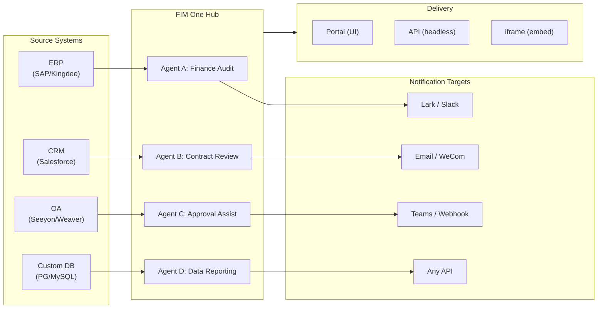

> 目标：构建一个**AI 驱动的连接器中心** — 独立门户（门户助手）、副驾驶（嵌入主机系统）、中心（跨系统中央编排）。
>
> 原则：**供应商无关**（无厂商锁定）、**最小抽象**、**协议优先**、**连接器优先**（集成是核心价值）。

## 产品愿景

FIM One 是一个 **AI 连接器中心**，提供三种渐进式模式：

```
Standalone   → 您自己的 AI 助手 (Portal)
Copilot      → AI 嵌入到主系统中 (iframe / widget / embed)
Hub          → 中央跨系统编排 (Portal / API)
```

**Hub 模式是核心差异化优势。** 企业客户拥有遗留系统——ERP、CRM、OA、财务、HR——需要通过 AI 相互通信：



**GTM 路径：先着陆后扩展**

| 步骤 | 模式 | 发生的事情 |
|------|------|-------------|
| 着陆 | Copilot | 嵌入到一个系统中，在其 UI 内证明价值 |
| 扩展 | Copilot → Hub | 推广到更多系统；Hub 聚合它们 |

## 已发布的版本

### v0.1 (2026-02-22) — MVP: ReAct + DAG Planner
- ReActAgent with tools (calculator, python_exec, web_search)
- DAG Planner (LLM generates dependency graphs)
- Portal UI with streaming + KaTeX

### v0.2 (2026-02-24) — 多模型 + 记忆
- 重试 / 速率限制 / 使用情况跟踪
- 原生函数调用（无仅 JSON 解析）
- 多模型支持（快速 + 主 LLM）
- 记忆：WindowMemory、SummaryMemory
- FastAPI 后端与 SSE 流式传输

### v0.3 (2026-02-25) — Web Tools + MCP
- Web tools (web_search, web_fetch) via Jina/Tavily/Brave
- File operations tool
- MCP client (standard tool integration)
- Tool auto-discovery + categories
- DAG visualization with click-to-scroll
- Code exec in Docker (`--network=none`)

### v0.4 (2026-02-25) — 多轮对话 + 智能体
- 多轮对话（DbMemory）
- 工具步骤折叠 UI
- HTTP 请求 + shell 执行工具
- 智能体管理（创建、配置、发布）
- JWT 身份验证
- 按智能体执行模式 + 温度控制

### v0.5 (2026-02-28) — 完整 RAG + 基础生成
- 完整 RAG 管道（嵌入 + 向量存储 + FTS + RRF + 重排器）
- 基础生成（引用、冲突检测、置信度分数）
- 知识库文档管理（CRUD、搜索、重试、模式迁移）
- ContextGuard + 固定消息（令牌预算管理器）
- DbMemory 持久化 + LLM Compact
- DAG 重新规划（最多 3 轮）

### v0.6 (2026-03-01) — 连接器平台
- **连接器 CRUD**: 创建、读取、更新、删除
- **ConnectorToolAdapter**: 将连接器转换为 BaseTool
- **按用户凭证**: AES-GCM 加密
- **确认门**: 写入操作审批
- **审计日志**: 所有工具调用记录
- **断路器**: 故障时优雅降级
- **实用工具**: email_send、json_transform、template_render、text_utils
- **嵌入选项**: Jina、OpenAI、自定义提供商

### v0.7 (2026-03-06) — 管理平台 + 多租户
- **管理平台**: 用户管理、角色切换、密码重置、账户启用/禁用
- **邀请制注册**: 三种模式（开放/邀请/禁用）+ 邀请码 CRUD
- **存储管理**: 按用户磁盘使用量、清除、孤立文件清理
- **对话审核**: 管理员列表/删除所有对话
- **按用户强制登出**: 撤销所有令牌
- **API 健康仪表板**: 系统统计、连接器指标
- **首次运行设置向导**: 引导式管理员账户创建
- **个人中心**: 按用户全局指令、语言偏好
- **JWT 认证**: 基于令牌的 SSE 认证、对话所有权
- **全局 MCP 服务器**: 管理员配置、在所有会话中加载
- **向后兼容**: registration_enabled → registration_mode 自动迁移

### v0.7.x (2026-03-07 to 2026-03-12) — 稳定性 + 打磨
- 邀请码管理
- 按用户配额（429 强制执行）
- 结构化审计日志
- 敏感词过滤
- 管理员登录历史
- 管理员文件浏览器
- 增强的管理员视图（model_name、tools、kb_ids 字段）
- Docker Compose 部署（单个镜像、命名卷）
- OAuth 自动检测（来自 window.location）
- 扩展思考/推理支持（`LLM_REASONING_EFFORT`、`LLM_REASONING_BUDGET_TOKENS`）支持 OpenAI o 系列、Gemini 2.5+、Claude
- 管理员按工具启用/禁用（禁用的工具在运行时从聊天中排除）
- MCP 服务器管理移至连接器页面
- 双数据库支持：SQLite（零配置默认）+ PostgreSQL（生产环境）；Docker Compose 自动配置 PostgreSQL
- 模型配置文档页面，包含每个提供商的扩展思考设置
- SSE 协议 v2：实时答案流式传输，包含 `delta_reasoning`、`usage` 字段，以及分离的 `done`/`suggestions`/`title`/`end` 事件；SQLite 连接池大小 5 -> 20
- AI Builder 扩展：7 个新的 builder 工具（GetSettings、TestConnection、ImportOpenAPI 用于连接器；ListConnectors、AddConnector、RemoveConnector、SetModel 用于智能体），智能体上的 `is_builder` 标志，builder 提示自动刷新，SSRF 防护
- SSE v2 前端：流式点脉冲光标，DAG 重新规划轮快照作为可折叠卡片，DAG 布局与步骤状态解耦
- AI Builder 概念文档页面，包含连接器和智能体 builder 指南
- 组织系统：完整的 CRUD 操作，基于角色的成员资格（所有者/管理员/成员），管理员管理 UI
- 三层资源可见性（个人/组织/全局）用于智能体、连接器、知识库、MCP 服务器
- 发布/取消发布 API 用于所有资源类型；已发布智能体的所有者委派
- 管理员设置可见性端点（替代克隆到全局）；统一的 `build_visibility_filter()` 查询助手
- 数据库连接器（第 1-3 阶段）：直接 SQL 访问 PG/MySQL/Oracle/SQL Server + 中文遗留数据库；模式内省、AI 注释、只读查询执行、加密凭证、每个连接器 3 个工具（`list_tables`、`describe_table`、`query`）
- **评估中心**：定量智能体质量基准测试 — 测试数据集 CRUD（提示 + 预期行为 + 断言），评估运行（并行执行 + LLM 评分器 + 每个案例的通过/失败/延迟/令牌结果），结果查看器带自动轮询；迁移 `r8t0v2x4z567`
- 三个模型角色（通用/快速/推理）具有按层级的环境配置隔离；快速模型不再继承主模型设置
- `StepOutput` 数据类替代纯字符串步骤结果，用于结构化数据和工件传递
- DAG 执行的工具缓存 — 每次运行中相同的工具调用缓存，带异步锁雷鸣羊群防护（`DAG_TOOL_CACHE`）
- 按步骤 LLM 验证，失败时重试 1 次（`DAG_STEP_VERIFICATION`）
- 自动路由：快速 LLM 将查询分类为 ReAct 或 DAG；`/api/auto` 端点；前端 3 路模式切换（`AUTO_ROUTING`）
- [x] ~~**平台组织 + 资源订阅**~~：内置平台组织自动加入所有用户；市场 API 用于订阅共享资源；资源订阅表；基于组织的资源共享替代全局可见性
- [x] ~~**智能体自动发现和子智能体绑定**~~：智能体上的 `discoverable` 标志；`sub_agent_ids` 白名单；CallAgentTool 用于将任务委派给专家智能体
- [x] ~~**MCP 服务器凭证 + 按用户覆盖**~~：`mcp_server_credentials` 表；`PUT /api/mcp-servers/{id}/my-credentials` 端点；`allow_fallback` 标志用于凭证回退行为
- [x] ~~**连接器/知识库切换**~~：`POST /api/connectors/{id}/toggle` 和 `POST /api/knowledge-bases/{id}/toggle` 用于暂停/恢复资源
- [x] ~~**独立知识库对话**~~：对话上的 `kb_ids` 字段用于直接知识库聊天，无需智能体绑定

## 计划版本

### v0.8 — 连接器声明式配置 + 渐进式信息展示

**目标**: 使定义连接器无需编写 Python 代码，并优化工具和指令向 LLM 的暴露方式。

- [x] ~~**数据库连接器**: 直接 SQL 访问 (PostgreSQL、MySQL、Oracle)~~ *(在 v0.7.x 中发布 — 第 1-3 阶段)*
- [x] ~~**RBAC**: 按用户/角色的连接器访问控制~~ *(在 v0.7.x 中发布 — 组织系统 + 三层可见性)*
- [x] **连接器凭证加密 + 按用户覆盖**: `connector_credentials` 表、通过 `CREDENTIAL_ENCRYPTION_KEY` 的 Fernet 加密、`allow_fallback` 标志、`GET/PUT/DELETE /my-credentials` 端点、聊天工具加载中的按用户凭证解析
- [x] **发布审核 UI**: 组织级发布审核系统 — 按组织审核切换、带有批准/拒绝工作流的 ReviewsSheet、资源卡上的状态徽章、发布对话框中的审核通知、被拒资源的重新提交
- [ ] **连接器渐进式信息展示 (第 1-2 阶段)**: 单个 `ConnectorMetaTool` 替代按操作工具；系统提示仅接收轻量级**存根** (名称 + 单行描述，~30 tokens/连接器 vs ~250 tokens/操作)；智能体调用 `discover(connector)` 按需加载完整操作架构 — 架构仅在模型选择连接器时加载，保持提示前缀稳定以便缓存。镜像 Claude Code 的 `defer_loading: true` 内部模式。`execute` 子命令；向后兼容的功能标志。
- [x] ~~**智能体技能系统 + 紧凑指令**: 智能体指令的按需技能加载 — `Skill` 模型 (名称、内容/SOP、可选脚本) 附加到智能体；在系统提示中仅按名称引用 (~10 tokens/技能)；智能体调用 `read_skill(name)` 按需加载完整内容。在规模上将按对话指令令牌成本降低 ~80%，同时允许更丰富的 SOP 库。作为应用于指令级别的 ConnectorMetaTool 渐进式信息展示的对应部分。启用"指令 + 工具 + 技能"差异化故事。还向 Agent 模型添加 `compact_instructions` 字段 — 按智能体压缩优先级列表注入到 `ContextGuard` 中进行压缩 (例如，"保留订单 ID 和金额，删除原始 API 响应")，替换当前静态通用提示。受 Claude Code 的紧凑指令模式启发。~~
- [ ] **YAML/JSON 连接器配置**: 平台自动生成 MCP 服务器
- [ ] **连接器导入/导出**: 共享连接器模板
- [ ] **连接器分叉**: 克隆 + 自定义现有连接器
- [ ] **数据库连接器第 4 阶段**: 企业驱动程序 — Oracle (`oracledb`)、SQL Server (`aioodbc`)、达梦 DM8 (`aioodbc` + DM ODBC)、南大通用 GBase (`aioodbc` + GBase ODBC)
- [ ] **消息推送**: Lark、WeCom、Slack、Email 通知操作
- [x] **工作流第 2 阶段节点**: Iterator、Loop、VariableAggregator、ParameterExtractor、ListOperation、Transform — 6 种高级节点类型，具有完整的前端 + 后端 + 82 个新测试 (共 200 个)。包含成功率条的统计面板。6 个内置模板。
- [x] **工作流蓝图系统**: 用于设计和执行多步自动化蓝图的可视化工作流编辑器 — `Workflow` / `WorkflowRun` ORM 模型、完整的 CRUD + SSE 执行 API、导入/导出、复制、蓝图验证端点、具有拓扑排序 + 基于信号量的并发 + 条件分支的 `WorkflowEngine` 和 12 种节点类型 (Start、End、LLM、ConditionBranch、QuestionClassifier、Agent、KnowledgeRetrieval、Connector、HTTPRequest、VariableAssign、TemplateTransform、CodeExecution)、具有 `{{node_id.output}}` 插值和 `env.*` 命名空间的 `VariableStore`、按节点的错误策略 (STOP_WORKFLOW / CONTINUE / FAIL_BRANCH)，带有按节点超时和高级配置 UI、React Flow v12 可视化编辑器，具有拖放调色板 + 节点配置面板 + 变量选择器组合框 + 边上添加节点 + 自动布局 (ELK.js) + 运行历史表、Dify 风格的紧凑节点设计，具有基于环的运行状态样式和动画边过渡、4 个内置启动模板 (简单 LLM 链、条件路由器、知识增强 QA、HTTP API 管道)，带有模板选择器对话框和 `GET /templates` + `POST /from-template` API、统计端点、`?run=true` URL 参数自动打开、基于子进程的代码执行安全性、105 个测试套件 (模板、eval 命名空间展平、蓝图验证警告、节点/边删除、导入/导出/复制、死锁检测、多条件分支)
- [x] **操作审计**: 详细记录谁做了什么 — 添加了管理员审核日志审计选项卡 (按组织/资源的发布审核跟踪)
- [ ] **语义架构注释**: 使用 `semantic_tag`、`description` 和 `pii` 标志扩展连接器架构字段；注释在 LLM 工具描述中显示，以便智能体理解字段意图，无需从列名猜测

**影响**: 实现工程师 (无需 Python) 可在 1-2 小时内添加连接器。在规模上，工具定义和智能体指令的令牌成本下降 ~80–93%。

### v0.9 — 可观测性 + 生产强化

**目标**: 生产级运维、调试和监控。引入**钩子系统** — 一个确定性执行层，位于智能体指令下方，无法被LLM覆盖。

- [ ] **连接器渐进式披露（第3-4阶段）**: 统一的`ConnectorExecutor`接口（API/DB/MCP在一个抽象后面）；使用`jsonschema`进行操作参数验证；协议无关的发现/执行
- [ ] **智能体追踪层（可观测性++）**: 应用级运行/追踪/线程层级用于智能体调试 — 每个对话 → `Trace`，每个LLM调用/工具调用/DAG步骤 → `Span`，包含输入/输出/令牌/时间。前端追踪查看器，带时间线和可展开的LLM调用负载。这超越了OTel（基础设施级）以为开发者和企业客户提供可操作的智能体循环调试。OpenTelemetry导出作为数据接收器选项。参照LangSmith的运行/追踪/线程概念建模 — 行业验证的智能体可观测性模式。
- [ ] **指标仪表板**: 延迟、成功率、令牌使用、连接器调用分析 — 按智能体、按用户、按组织细分
- [ ] **断路器**: 指数退避、故障检测
- [ ] **智能体钩子系统**: 在**LLM循环外**运行的确定性执行层 — 钩子在工具事件上自动执行，无法被智能体指令绕过。三个钩子点：`PreToolUse`（执行前验证/阻止）、`PostToolUse`（执行后副作用）、`SessionStart`（注入动态上下文）。内置钩子：每个连接器调用时自动写入`ConnectorCallLog`（目前手动）；当组织处于只读模式时阻止写操作；在结果到达智能体前自动截断超大DB查询结果；限制每个连接器调用频率。用户定义的钩子：每个智能体YAML配置（`hooks:`字段）声明shell命令或Python可调用对象，在匹配工具事件上触发 — 与Claude Code钩子相同的模式。关键设计原则：**钩子用于"必须始终发生"的逻辑，不应依赖LLM记住去做**。指令说"记录所有调用"；钩子实际记录它们。指令说"不在只读模式下写入"；钩子实际阻止它。
- [ ] **智能体工作区（工具输出卸载 + 交接）**: 当MCP/连接器/DB工具响应超过阈值（默认：8K字符）时，自动保存完整输出到每个对话工作区文件（`workspace://tool_result_xxx.txt`）并返回截断预览 + 文件URI给智能体。三个新内置工具：`read_workspace_file(path, start_line, end_line)`用于选择性访问，`list_workspace_files()`用于发现，`write_handoff(summary)`用于上下文转换 — 智能体在上下文压缩或会话切换前写入结构化交接备注（进度、有效的、失败的、下一步）；下一个智能体实例读取它而不是依赖压缩算法的摘要质量。镜像Claude Code的工作区 + 交接模式。防止大结果集上的注意力分散，消除截断导致的无声数据丢失。最小改动：在`MCPToolAdapter`和`ConnectorToolAdapter`中扩展`truncate_tool_output()`以写入工作区存储。
- [ ] **沙箱强化**: v2代码执行隔离改进
- [ ] **性能测试**: 并发负载基准
- [ ] **MCP连接池**: 每请求STDIO子进程生成无法扩展 — 100个并发用户 = 每个MCP服务器100个子进程。使用每用户环境隔离（由`(server_id, env_hash)`键控）池化STDIO连接；SSE/HTTP传输共享`httpx.AsyncClient`会话。目标：池化STDIO的亚100ms热启动，无论用户数量如何每个MCP服务器O(1) HTTP连接
- [ ] **计划任务 + 事件触发的智能体（循环）**: 类cron后台任务触发；`scheduled_jobs` + `job_runs` DB表；APScheduler集成；任务CRUD API + 任务历史UI；通过消息推送连接器进行结果通知。范围涵盖时间触发（cron）和事件触发（webhook入站）模式 — 在后台异步运行的智能体就是Hub模式的异步子智能体用例。
- [ ] **DB模式高级构建器**: 大规模数据库的AI驱动模式管理智能体 — 战略表注释（基于模式、SQL执行知情）、按域前缀批量可见性管理、1K–7K+表部署的迭代多轮注释；补充现有批量注释任务，具有选择性和业务上下文推理

**影响**: 自信地大规模运行FIM One。三个架构层现已完成：**追踪层**（查看发生了什么）、**钩子系统**（执行必须发生的事）、**智能体工作区**（智能体管理自己的数据访问）。它们一起缩小了"智能体可能遵循的指令"和"系统执行的保证"之间的差距 — 演示和生产企业工具之间的区别。

### v1.0 — 热插拔 + 可嵌入

**目标**: 零重启连接器添加和嵌入式交付。

- [ ] **连接器渐进式披露（第5阶段）**: **语义引导工具选择** (从查询中提取实体 → 本体注册表查找 → 连接器集合缩减；50+连接器部署时可减少90%+令牌)；批处理/ETL连接器的规模模式；CLI风格的通用 `connector <name> <action> <params>` 接口
- [ ] **跨连接器实体对齐（本体注册表）**: 定义共享实体类型（客户、订单、资产），具有跨连接器的字段映射；DAGPlanner自动解析跨系统JOIN键；启用跨连接器查询（例如，"在Salesforce中订购过Shopify的客户"），无需硬编码字段名称
- [ ] **热插拔连接器**: 上传OpenAPI规范，AI生成配置，5分钟内上线（无需重启）
- [ ] **连接器市场**: 社区共享模板
- [ ] **可嵌入小部件**: `<script src="fim-one.js">` 注入到主机页面
- [ ] **页面上下文注入**: 小部件读取主机页面上下文（当前ID、URL、DOM选择器）
- [ ] **高级触发器**: Webhook入站事件；计划作业增强（多时区、日历感知）
- [ ] **批量执行**: 通过DAG处理1000+项目
- [ ] **企业安全**: IP白名单、静态加密、SSO
- [ ] **KB高级编辑器**: 为管理大型知识库的高级用户提供生成器模式智能体 — 批量URL摄取、重复检测、差距分析、文档生命周期管理；使用ReAct工具循环扩展现有KB AI聊天

**影响**: 企业在数天内从零部署FIM One到多系统编排。

## 冻结功能（已发布，仅维护）

根据[正交性策略](/strategy/orthogonality-strategy)，这些功能已发布并正常运行，但不会获得新功能（仅进行错误修复）：

| 功能 | 版本 | 冻结原因 |
|---------|---------|-----------|
| ReAct 智能体 | v0.1 | 模型现在具有原生工具调用能力 |
| DAG 规划 / 重新规划 | v0.1, v0.5, v0.7.5 | 模型推理能力不断提升；分解变为单次完成。按步骤验证已在 v0.7.5 中发布（`DAG_STEP_VERIFICATION`）— 未计划进一步的规划原语 |
| 内存（窗口、摘要、紧凑） | v0.2, v0.5 | 上下文窗口不断增长（200K+）；对外部内存管理的需求减少 |
| RAG 管道 | v0.5 | 提供商正在原生构建检索功能（OpenAI file_search、Gemini Search Grounding） |
| 有根据的生成 | v0.5 | 模型在引用方面不断改进；5 阶段管道价值递减 |
| ContextGuard / 固定消息 | v0.5 | 按现状发布；无新功能 |

## 考虑中（无限期延迟）

根据正交性策略，这些功能需要高投入且面临吸收风险：

| 功能 | 延迟原因 |
|---------|------------|
| 多智能体编排（深层级结构） | 提供商正在原生构建（OpenAI Swarm、Claude Code Teams、Google A2A）。FIM One 的 CallAgentTool 涵盖单级委派情况；事件触发的后台智能体由 v0.9 中的计划任务覆盖 |
| 智能体自修改技能（程序化记忆） | 智能体在执行期间更新自己的 `skill.md` — 高复杂性、安全/审计表面积大。取决于智能体技能系统（v0.8）首先发布。如果企业客户明确请求自我改进智能体，则重新评估 |
| ~~智能体工作区（工具输出文件卸载）~~ | 晋升至 v0.9。价值在于**选择性读取**，而非上下文容量 — Claude Code 验证已确认。原始延迟理由（"200K+ 窗口降低紧迫性"）是错误的 |
| 跨会话长期记忆 | 上下文窗口快速增长（200K–2M）；提供商添加内置记忆（OpenAI 记忆、Gemini 上下文缓存）；高实现成本与差异化价值递减。当企业客户明确请求时重新评估 |
| 记忆生命周期（TTL、配额） | 取决于跨会话记忆；一起延迟 |
| 活跃上下文压缩工具（智能体触发） | 使用 ContextGuard（v0.5）明确冻结。200K+ 的上下文窗口降低了价值。除非上下文成本成为主要企业投诉，否则不会重新审视 |

## 版本如何与模式对齐

| 版本 | 独立模式 | 副驾驶模式 | Hub | 备注 |
|---------|-----------|---------|-----|-------|
| **v0.1–v0.3** | 可用 | 尚未支持 | 尚未支持 | 仅限门户，单用户 |
| **v0.4** | 可用 | 尚未支持 | 尚未支持 | 多对话，智能体管理 |
| **v0.5** | 可用 | 尚未支持 | 尚未支持 | 知识库 + RAG |
| **v0.6** | 可用 | 可能 | 可能 | 连接器发布；副驾驶模式/Hub 可通过手动配置实现 |
| **v0.7** | 可用 | 就绪 | 就绪 | 管理平台；多租户认证；生产就绪 |
| **v0.8** | 可用 | 就绪 | 已优化 | 基于系统的 RBAC + 审计日志；更易于集成 |
| **v0.9** | 可用 | 就绪 | 生产级 | 可观测性、性能、加固 |
| **v1.0** | 可用 | 已优化 | 企业级 | 热插拔、应用市场、定时任务、Webhook、批处理 |

## 资源分配 (v0.8–v1.0)

正交性策略指导工作重点分配：

| 类别 | 分配比例 | 版本 | 原因 |
|----------|-----------|----------|-----|
| **连接器平台** (v0.6+) | 50% | 持续进行 | 核心差异化；无被吸收风险 |
| **企业功能** (RBAC、审计、安全、可观测性) | 30% | v0.8–v1.0 | 虽然平凡但持久；生产环境必需。智能体追踪层是商业支撑点 |
| **智能体智能** (技能系统、定时智能体) | 15% | v0.8–v0.9 | 指令+工具+技能 差异化故事；低被吸收风险——框架验证模式，但企业SOP是客户特定的 |
| **v0.1–v0.5 维护** | 5% | 持续进行 | 仅限错误修复；无新功能 |

## 指标驱动的里程碑

成功通过以下指标衡量：

| 指标 | v0.7 目标 | v0.8 目标 | v1.0 目标 |
|--------|------------|------------|------------|
| 已部署的连接器 | 5 | 20+ | 100+ |
| 企业客户 | 1–2 | 5–10 | 20+ |
| 平均连接器设置时间 | 2 周 | 2 天 | 5 分钟（热插拔） |
| 令牌效率（DAG vs ReAct-only） | 30% 降低 | 40% 降低 | 50% 降低 |
| 正常运行时间 SLA | 99.5% | 99.9% | 99.95% |
| 支持工单主题 | 集成、设置 | 连接器自定义逻辑 | 热插拔、扩展 |

## 开放问题 / 待定事项

- **市场审核**：如何验证社区连接器？(v1.0)
- **代币经济学**：如何为多用户、多智能体场景定价？(v1.0)
- **遥测选择退出**：如何尊重隐私偏好？(v0.8)
- **连接器版本控制**：如何管理连接器 API 中的破坏性变更？(v0.8)
- **速率限制**：按连接器、按用户还是全局？(v0.8)

