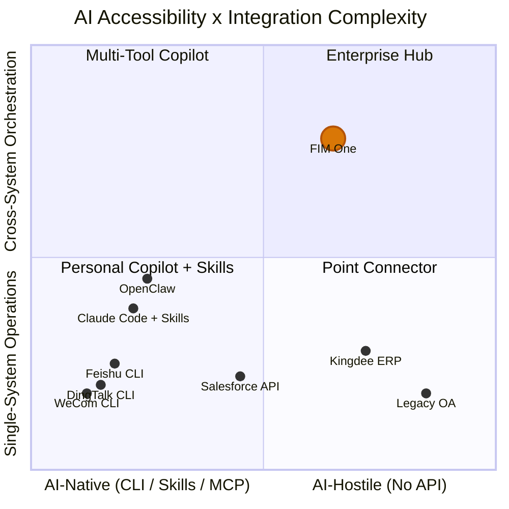

## 2026年3月信号

2026年3月，三个主要的中文工作场景平台在同一周内开源了CLI工具：

- **钉钉** 发布了 `dws` — 覆盖12个业务领域的104个工具
- **飞书/Lark** 发布了 `lark-cli` — 覆盖11个领域的200+个命令
- **企业微信** 发布了 `wecom-cli` — 覆盖7个业务领域

他们都没有选择MCP。三家都发布了纯CLI工具，通过 `npx skills add` 分发预打包的AI Skills。这是业界首次集体展示了AI智能体应该如何与企业系统交互的方案——答案不是一个协议，而是一种打包格式。

本文档分析了这对AI系统集成的广泛意义，以及对FIM One战略的具体影响。

## AI 系统集成的三种范式

### 1. REST API（传统方式）

基线方案。每个 SaaS 平台都暴露 HTTP 端点，并使用 OpenAPI 规范进行文档化。AI 集成需要一个适配层——将"使用这些请求头和 JSON 请求体调用此 API 端点"转换为"这是智能体可以调用的工具"。

这正是 FIM One 的 ConnectorToolAdapter 目前所做的。它能工作，但每个集成都需要自定义工作：阅读 API 文档、处理身份验证、映射响应格式、处理分页。

- **使用者**：每个 SaaS 平台、遗留集成
- **AI 集成**：需要适配层（ConnectorToolAdapter、自定义代码）
- **优势**：通用、易于理解、结构化 JSON I/O
- **劣势**：每个集成都需要自定义开发工作

### 2. CLI + Skills（新兴）

该平台提供编译后的 CLI 二进制文件。AI 集成通过预打包的 Skill 文件实现——这些 markdown 文档教会 AI IDE 如何通过子进程调用 CLI 命令。分发通过 npm 进行：`npx skills add dingtalk/dws`。

AI 读取 Skill 文件，理解可用的命令及其参数，然后将 CLI 作为子进程调用。输出通常是自由文本（表格、格式化字符串），AI 必须解析这些输出。

- **使用者**：钉钉、飞书、企业微信（均在 2026 年 3 月选择此方案）
- **AI 集成**：`npx skills add platform/cli` — AI IDE 读取 Skill markdown，调用 CLI 命令
- **优势**：快速交付，适用于任何支持 Skills 格式的 AI IDE
- **劣势**：非结构化文本输出（AI 必须解析）、无标准化发现协议、单平台范围

### 3. MCP (Model Context Protocol)

JSON-RPC over stdio or SSE. Structured tool discovery (`tools/list`) and invocation (`tools/call`). The AI client negotiates capabilities with the server, gets a typed schema for every tool, and receives structured `CallToolResult` responses.

- **Who uses it**: Anthropic ecosystem, growing number of developer tools
- **AI integration**: Native protocol — structured I/O, schema-based discovery
- **Strength**: Standardized, structured, composable, built for multi-tool orchestration
- **Weakness**: Higher implementation cost, not yet adopted by major workplace platforms

### 比较

| 维度 | REST API | CLI + Skills | MCP |
|-----------|----------|-------------|-----|
| 标准化 | 中等 (OpenAPI) | 低 (供应商特定的 Skills) | 高 (JSON-RPC 协议) |
| AI 友好性 | 低 (需要适配器) | 中等 (文本 I/O，由 AI 解析) | 高 (结构化 JSON I/O) |
| 发现机制 | OpenAPI spec / docs | `--help` + Skill markdown | `tools/list` 协议端点 |
| 输出格式 | 结构化 JSON | 自由文本 (需要 AI 解析) | 结构化 `CallToolResult` |
| 上线时间 | 数周 (每个集成) | 数天 (包装现有 API) | 数周 (实现协议) |
| 跨平台编排 | 需要 hub | 未内置 | 未内置 |
| 企业治理 | 需要 hub | 未内置 | 未内置 |

## 主要平台的实际选择

| | DingTalk `dws` | Feishu `lark-cli` | WeCom `wecom-cli` |
|---|---|---|---|
| Language | Go | Go + Python | Rust + TS |
| Tools | 104 / 12 domains | 200+ / 11 domains | 7 domains |
| MCP support | No | No | No |
| AI integration | Markdown Skills + schema introspection | 19 npm Skills (`npx skills add`) | 12 npm Skills (`npx skills add`) |
| Output formats | JSON / table / raw + `--jq` | JSON / table / csv / ndjson | JSON |
| Agent-friendly flags | `--yes`, `--dry-run`, smart input correction | `--no-wait`, `--as user/bot`, `--dry-run` | Direct JSON params |
| Discovery | `dws schema` (self-introspection) | `lark-cli schema` (self-introspection) | Via Skill files only |

关键观察：`npx skills add` 正在成为 AI 工具集成的事实上的分发渠道，完全绕过了 MCP。这些平台选择了快速上市而不是协议标准化。AI IDE 生态系统（Cursor、Claude Code、Windsurf）已经理解 Skills 文件，所以这些平台无需实现协议服务器就能获得即时的 AI 集成。

## AI 可访问性谱系

并非所有系统对 AI 的可访问性都相同，也并非所有任务的复杂度都一样。这两个维度定义了不同集成方法创造价值的位置。

**图表解读：**

- **左下角（个人副驾驶 + 技能）**：具有简单操作的 AI 原生平台。DingTalk、Feishu 和 WeCom 聚集在这里——它们提供自己的 CLI + 技能，使单平台 AI 集成成为自助服务。OpenClaw 和 Claude Code with Skills 等个人副驾驶占据这个区域。FIM One 在这里增加的价值很小——平台已经完成了这项工作。
- **左上角（多工具副驾驶）**：具有跨系统需求的 AI 原生平台。用户在 Claude Code 中安装多个技能（`dingtalk` + `feishu` + `wechat`）可以尝试多平台协调，但缺乏治理、编排规划和统一的凭证管理。
- **右下角（点连接器）**：需要简单桥接的遗留系统。单个连接器连接到金蝶 ERP 或遗留 OA 系统——FIM One 在这里很有用，甚至可用于单系统操作，因为这些系统没有 CLI，API 有限或不存在。
- **右上角（企业枢纽）**：具有跨系统编排需求的遗留系统或 API 受限系统。这是 FIM One 的优势所在。跨遗留管理系统查询合同、与 ERP 应收账款关联，并通过 DingTalk 发送催收通知——这需要 DAG 规划、多连接器协调、凭证保管库、审计跟踪和人工确认门控。没有个人副驾驶、没有 CLI、没有技能文件能够到达这里。

当你向右上角移动时，FIM One 的价值会增加：难以访问的系统与更复杂的编排需求相结合。提供自己的 CLI + 技能的平台占据相反的角落——易于访问、简单操作——代表 FIM One 不应该追逐的市场。

## 个人 Copilot vs 企业中心

个人 AI copilot 的激增（OpenClaw、Claude Code、Cursor、Windsurf）引发了一个定位问题。存在两种根本不同的模式：

### 个人副驾驶

- **用户**: 个人开发者或知识工作者
- **数据范围**: 我的日历、我的电子邮件、我的文档
- **身份验证**: 我的个人 token、我的 OAuth 会话
- **集成范围**: 单人、少数平台、个人生产力
- **治理**: 不需要 — 这是我的数据、我的操作

### 企业连接器中心

- **用户**: 组织（团队、部门、跨职能工作流）
- **数据范围**: 跨部门、跨系统，包括敏感和受管制数据
- **身份验证**: 管理员分配权限、最小权限原则、凭证保管库
- **集成范围**: 多系统编排、业务流程自动化
- **治理**: 审计日志、RBAC、确认门控、合规要求

这些是互补的，而非竞争的。随着个人智能体的增多，企业需要一个中央中心来管理这些智能体可以访问的内容。使用 Claude Code 的个人可以通过 `npx skills add dingtalk/dws` 读取自己的钉钉消息。但当一个 AI 智能体需要在钉钉、公司 ERP 和财务系统之间进行编排——包括审计跟踪、权限控制和写入操作的人工确认——这就是一个完全不同的问题。

个人智能体使简单的单平台操作商品化。这不是 FIM One 的市场。FIM One 的市场是跨系统、需要治理、包含遗留系统的企业集成，这是任何个人智能体都无法处理的。

## FIM One 的战略意义

| 优先级 | 行动 | 理由 |
|----------|--------|-----------|
| 坚持现有方向 | 继续投资 Connector 架构以支持遗留系统/API 系统 | 这是护城河 — CLI + Skills 永远无法到达遗留系统 |
| 拥抱 MCP | MCP Server 支持已内置（MCPServerMetaTool）— 保持其完善 | MCP 是结构化协议的赌注；某些平台最终会采用它 |
| 监控 Skills | 跟踪 `npx skills add` 生态系统但不要盲目追随 | Skills 解决的是 FIM One 不存在的分发问题 |
| 在治理上差异化 | 审计、RBAC、确认门控、凭证管理 | 个人副驾驶永远无法提供企业级治理 |
| 清晰定位 | "您的系统与 AI 相遇的枢纽" — 而非"调用 DingTalk 的另一种方式" | 避免在平台免费提供的简单集成上竞争 |

最糟糕的战略举措是通过为已经提供自有 Skills 的平台构建 Skills 适配器来应对 CLI + Skills 浪潮。那是与平台供应商本身的一场底线竞争。正确的应对是保持专注于那些供应商永远无法到达的系统。

## CLI、Skills 和 MCP 之间的关系

这三个概念在不同的层级运作，讨论中经常被混淆。精确的区分如下：

- **CLI** 是用户界面 — shell 命令、文本 I/O、与系统交互的一种形式
- **Skills** 是分发机制 — markdown 文件，教导 AI 如何调用 CLI 命令，AI 工具集成的打包格式
- **MCP** 是协议 — JSON-RPC、结构化发现和调用、AI 工具通信的互操作性标准

从长期来看，它们不是彼此的替代品。CLI 是人类（或 AI 子进程）与工具交互的方式。Skill 文件是该 CLI 分发到 AI IDE 的方式。MCP 是在协议层级进行结构化、schema 类型化、可组合集成的方式。

然而，在短期内（2026 年），CLI + Skills 因为实现成本低于 MCP 而在采用速度上领先。拥有现有 CLI 的平台可以在一天内交付 Skill 文件。实现 MCP 服务器需要数周时间，并且需要理解协议规范、传输层和能力协商。

可能的收敛：今天交付 CLI 的平台明天可能会将其包装为 MCP 服务器。MCP 的 stdio 传输已经启动 CLI 进程 — "由 Skills 调用的 CLI"和"包装为 MCP 服务器的 CLI"之间的差距很小。但这种收敛并非必然。如果 Skills 生态系统增长足够快，AI IDE 围绕它进行标准化，MCP 可能仍然是开发者工具协议，而不是企业工具标准。

对于 FIM One，结论很清楚：投资于协议层（MCP）和治理层（连接器架构），而不是分发层（Skills）。对于平台供应商来说，分发是一个已解决的问题。协议和治理是中心创造持久价值的地方。
